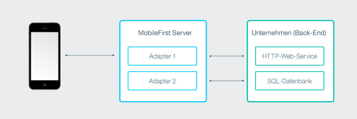
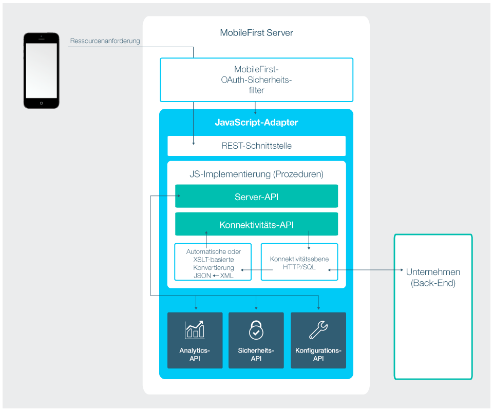
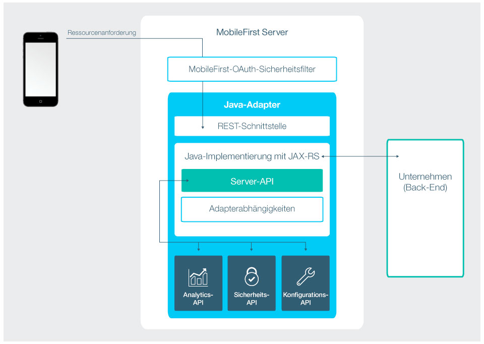

<!-- NLS_CHARSET=UTF-8 -->
## Übersicht
{: #overview }
Adapter sind Maven-Projekte mit serverseitigem Code, der in Java oder JavaScript implementiert wird.  
Mit Adaptern wird die notwendige serverseitige Logik ausgeführt. Adapter werden zudem verwendet, um Informationen für Clientanwendungen und Cloud-Services von Back-End-Systemen abzurufen.  

Jeder Adapter hat seine eigene isolierte Sandbox, die ausgeführt wird, ohne etwas über andere Adapter-Sandboxes zu wissen oder Einfluss auf andere Adapter-Sandboxes zu nehmen. Dennoch können Adapter miteinander kommunizieren, indem sie eine API aufrufen, sodass ein "[Adapter-Mashup](advanced-adapter-usage-mashup)" möglich ist. 

Es ist möglich, für den Adaptercode erforderliche Bibliotheken anderer Anbieter aufzunehmen. Dazu müssen diese in der Datei **pom.xml** des Adapters als Maven-Abhängigkeiten definiert werden. Weitere Informationen finden Sie im Abschnitt [Abhängigkeiten](creating-adapters/#dependencies) des Lernprogramms [Java- und JavaScript-Adapter erstellen](creating-adapters). 

Adapter unterstützen auch DevOps-Anforderungen: 

* Sie können Adapter
bei laufendem Server implementieren. Es ist also möglich, Adapter in der Laufzeit zu implementieren, zu deimplementieren und erneut zu implementieren. Der serverseitige
-Entwicklungsprozess ist durch diese Funktionalität sehr flexibel. 
* Für einen Adapter können von Administratoren benutzerdefinierte Eigenschaften konfiguriert werden, ohne dass der Adapter reimplementiert werden muss. Dank dieses Features können Sie das Adapterverhalten an verschiedene Umgebungen, z. B. an eine Entwicklungs-, Test- und Produktionsumgebung, anpassen. 

Lesen Sie als Nächstes einen Überblick über Java- und JavaScript-Adapter. Gehen Sie dann die Lernprogramme in der Seitenleistennavigation durch, um zu lernen,
wie Java- und JavaScript-Adapter erstellt, aktualisiert, entwickelt, getestet und implementiert werden,
wie IDEs für die Adapter-Entwicklung genutzt werden und wie serverseitige Protokolle erfasst werden.
In den Lernprogrammen für Fortgeschrittene erfahren Sie dann etwas über Adapter-Mashups und über die Cloudant-Integration. 

### Vorteile von Adaptern
{: #benefits-of-using-adapters }

#### Universalität
{: #universality }

* Adapter unterstützen mehrere Integrationstechnologien und Back-End-Informationssysteme.

#### Funktionalität für Schreibschutz und Transaktionen
{: #read-only-and-transactional-capabilities }

* Adapter unterstützen den schreibgeschützten und transaktionsorientierten Zugriff auf Back-End-Systeme. 

#### Schnelle Entwicklung
{: #fast-development }

* Adapter verwenden eine einfache XML-Syntax und können über die
JavaScript- oder Java-API ohne großen Aufwand konfiguriert werden. 

#### Sicherheit
{: #security }

* Adpater nutzen für die Herstellung von Verbindungen zu Back-End-Systemen flexible Authentifizierungseinrichtungen. 
* Adapter ermöglichen die Steuerung der Identität des verbundenen Benutzers. 

#### Transparenz
{: #transparency }

* Von Back-End-Anwendungen abgerufene Daten werden unabhängig vom Adaptertyp in einheitlicher Weise zugänglich gemacht.   

### Spezifische Vorteile von Java-Adaptern
{: #benefits-specific-to-java-adapters }

* Fähigkeit der vollständigen Kontrolle der URL-Struktur, der Inhaltstypen, der Anforderungs- und Antwortheader, des Inhalts und der Codierung
* Möglichkeit, den Adapter mit einem Tool eines anderen Anbieters zu testen, z. B. mit Postman
* Einfache und schnelle Entwicklung in einer aktiven MobileFirst-Server-Instanz ohne Abstriche bei der Leistung und ohne Ausfallzeit
* Sicherheitsintegration in das Sicherheitsmodell der {{ site.data.keys.product }} ohne zusätzliche Anpassung durch die Verwendung einfacher Annotationen im Quellcode

## JavaScript-Adapter
{: #javascript-adapters }

JavaScript-Adapter sind Schablonen für die Kommunikation mit HTTP- und SQL-Back-Ends. Diese Vorlagen enthalten eine Reihe von Services, die als Prozeduren bezeichnet werden. Mobile Apps können Ajax-Anforderungen absetzen, um Prozeduren aufzurufen. Eine Prozedur ruft Informationen von der Back-End-Anwendung ab und gibt Daten an die Anwendung zurück. Mit einer REST-Schnittstelle können Sie vom
[OAuth-2.0-Sicherheitsframework](../authentication-and-security) der {{ site.data.keys.product }} profitieren.

* Wenn die Daten im JSON-Format vorliegen, sorgt {{ site.data.keys.mf_server }} dafür, dass die Daten intakt bleiben. Andernfalls konvertiert {{ site.data.keys.mf_server }} die Daten automatisch in JSON.   
* Sie können
alternativ eine
XSL-Transformation angeben, um die Daten in JSON zu konvertieren. In diesem Fall muss die Rückgabe vom Back-End
den Inhaltstyp XML haben. Mit einem XSLT-Filter können Sie die Daten nach Ihrem Bedarf filtern.
* Mit
einem HTTP-Adapter können Sie GET- oder POST-HTTP-Anforderungen senden und Daten aus den Headern und dem Text der Antwort
abrufen. HTTP-Adapter arbeiten mit REST-konformen und SOAP-basierten Services und können strukturierte HTTP-Quellen wie RSS-Feeds
lesen. 
* Über einen SQL-Adapter können Sie mit jeder SQL-Datenquelle kommunizieren.
Sie können einfache SQL-Abfragen oder gespeicherte Prozeduren verwenden. 

> * Im Lernprogramm [Adapter erstellen](creating-adapters) können Sie sich über die Erstellung von Adaptern informieren. 
> * Informieren Sie sich über [JavaScript-Adapter](javascript-adapters). 

## Java-Adapter
{: #java-adapters }

Java-Adapter basieren auf der [Spezifikation JAX-RS 2.0](https://jax-rs-spec.java.net/nonav/2.0-rev-a/apidocs/index.html) und
sind somit in Java geschrieben. Für den Client machen Sie eine vollumfängliche REST-API zugänglich. Bei Java-Adaptern ist es Sache des Entwicklers, den zurückgegebenen Inhalt und dessen Format sowie die URL-Struktur der einzelnen Ressourcen zu definieren. Die einzige Ausnahme bildet das Senden der Anforderung durch einen Client mit GZip-Unterstützung. In dem Fall wird der zurückgegebene Inhalt von GZip komprimiert. Für alle Operationen in dem zurückgegebenen Inhalt ist der Entwickler zuständig, der gleichzeitig Eigner dieser Operationen ist. 

Das folgende Diagramm zeigt, wie ein mobiles Gerät
von seinem REST-Endpunkt aus auf jeden Java-Adapter zugreifen kann. Die REST-Schnittstelle wird
mit dem {{ site.data.keys.product }}-OAuth-Sicherheitsfilter geschützt, sodass
der Client für den Zugriff auf die Adapterressourcen ein Zugriffstoken anfordern muss. Jede der Adapterressourcen hat eine eigene URL, sodass
{{ site.data.keys.product }}-Endpunkte mit einer Firewall geschützt werden
können. Die REST-Schnittstelle ruft den Java-Code (JAX-RS-Service) für die Behandlung eingehender Anforderungen
auf. Der Java-Code
kann über die Java-API von
{{ site.data.keys.mf_server }} Operationen auf dem Server ausführen. Außerdem kann der Java-Code
eine Verbindung zum Unternehmenssystem herstellen, um Daten abzurufen oder zu aktualisieren, oder andere Operationen ausführen, die über das Unternehmenssystem
zugänglich sind.

> * Im Lernprogramm [Adapter erstellen](creating-adapters) können Sie sich über die Erstellung von Adaptern informieren. 
> * Informieren Sie sich über [Java-Adapter](java-adapters). 

## Nächste Lernprogramme
{: #tutorials-to-follow-next }
