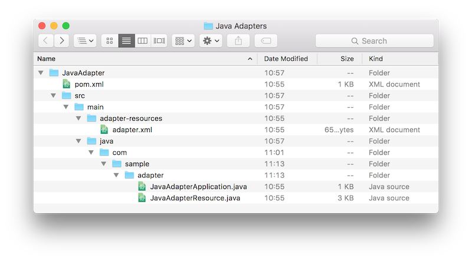

<!-- NLS_CHARSET=UTF-8 -->
## Übersicht
{: #overview }

Java-Adapter basieren auf der Spezifikation JAX-RS 2.0. Ein Java-Adapter ist also ein JAX-RS-2.0-Service, der ohne großen Aufwand
in einer Instanz von {{ site.data.keys.mf_server }} implementiert werden kann und auf MobileFirst-Server-APIs sowie APIs anderer Anbieter
zugreifen kann. 

**Voraussetzung:** Arbeiten Sie zuerst das Lernprogramm [Java- und JavaScript-Adapter erstellen](../creating-adapters) durch. 

#### Fahren Sie mit folgenden Abschnitten fort: 
{: #jump-to }

* [Dateistruktur](#file-structure)
* [Anwendungsklasse von JAX-RS 2.0](#jax-rs-20-application-class)
* [JAX-RS-2.0-Ressource](#implementing-a-jax-rs-20-resource)
* [HTTP-Sitzung](#http-session)
* [Serverseitige APIs](#server-side-apis)

## Dateistruktur
{: #file-structure }



### Ordner 'adapter-resources'  
{: #the-adapter-resources-folder }

Der Ordner **adapter-resources** enthält eine XML-Konfigurationsdatei (**adapter.xml**). In dieser Konfigurationsdatei können Sie den Klassennamen
der JAX-RS-2.0-Anwendung für diesen Adapter definieren, z. B. `com.sample.JavaAdapterApplication`.

```xml
<?xml version="1.0" encoding="UTF-8"?>
<mfp:adapter name="JavaAdapter"
	xmlns:xsi="http://www.w3.org/2001/XMLSchema-instance"
	xmlns:mfp="http://www.ibm.com/mfp/integration"
	xmlns:http="http://www.ibm.com/mfp/integration/http">

	<displayName>JavaAdapter</displayName>
	<description>JavaAdapter</description>

	<JAXRSApplicationClass>com.sample.JavaAdapterApplication</JAXRSApplicationClass>
	
	<property name="DB_url" displayName="Database URL" defaultValue="jdbc:mysql://127.0.0.1:3306/mobilefirst_training"  />
	<property name="DB_username" displayName="Database username" defaultValue="mobilefirst"  />
	<property name="DB_password" displayName="Database password" defaultValue="mobilefirst"  />
<securityCheckDefinition name="sample" class="com.sample.sampleSecurityCheck">
    	<property name="maxAttempts" defaultValue="3"/>
	</securityCheckDefinition>
</mfp:adapter>
```

<div class="panel-group accordion" id="terminology" role="tablist">
    <div class="panel panel-default">
        <div class="panel-heading" role="tab" id="adapter-xml">
            <h4 class="panel-title">
                <a class="preventScroll" role="button" data-toggle="collapse" data-parent="#adapter-xml" data-target="#collapse-adapter-xml" aria-expanded="false" aria-controls="collapse-adapter-xml"><b>Für Attribute und untergeordnete Elemente in adapter.xml hier klicken</b></a>
            </h4>
        </div>

        <div id="collapse-adapter-xml" class="panel-collapse collapse" role="tabpanel" aria-labelledby="adapter-xml">
            <div class="panel-body">
                <ul>
                    <li><b>name</b>: Dieses <i>obligatorische</i> Attribut gibt den Namen des Adapters an. Dieser Name muss innerhalb von {{ site.data.keys.mf_server }} eindeutig sein. Er kann aus alphanumerischen Zeichen und Unterstreichungszeichen bestehen und muss mit einem Buchstaben beginnen. Den Namen eines definierten und implementierten Adapters können Sie nicht mehr ändern.</li>
					<li><b>displayName</b>: Dieses <i>optionale</i> Attribut gibt den Namen des Adapters an, der in der {{ site.data.keys.mf_console }} angezeigt wird. Wenn dieses Element nicht angegeben ist, wird stattdessen der Wert des Attributs name verwendet. </li>
					<li><b>description</b>: Dieses <i>optionale</i> Attribut gibt zusätzliche Informationen zum Adapter an. Die Informationen werden in der {{ site.data.keys.mf_console }} angezeigt.</li>
					<li><b>JAXRSApplicationClass</b>: Dieses Attribut, das <i>obligatorisch ist, um einen Endpunkt /adapter zugänglich zu machen</i>, definiert den Klassennamen der JAX-RS-Anwendung für diesen Adapter. Im Beispiel lautet der Name <b>com.sample.JavaAdapterApplication</b>.
</li>
					<li><b>securityCheckDefinition</b>: Dieses <i>optionale</i> Attribut definiert ein Sicherheitsüberprüfungsobjekt. Weitere Informationen zu Sicherheitsüberprüfungen enthält das Lernprogramm <a href="../../authentication-and-security/creating-a-security-check">Sicherheitsüberprüfungen erstellen</a>. </li>
					<li><b>property</b>: Dieses <i>optionale</i> Attribut deklariert eine benutzerdefinierte Eigenschaft. Weitere Informationen hierzu enthält der folgende Abschnitt. </li>
                </ul>
				<br/>
                <a class="preventScroll" role="button" data-toggle="collapse" data-parent="#adapter-xml" data-target="#collapse-adapter-xml" aria-expanded="false" aria-controls="collapse-adapter-xml"><b>Abschnitt schließen</b></a>
            </div>
        </div>
    </div>
</div>

#### Angepasste Eigenschaften
{: #custom-properties }

Die Datei **adapter.xml** kann auch benutzerdefinierte Eigenschaften enthalten. Die Werte, die Entwickler diesen Eigenschaften während der Adaptererstellung zuweisen, können in der {{ site.data.keys.mf_console }}
auf der Registerkarte **Konfigurationen** für Ihren Adapter überschrieben werden, ohne dass der Adapter neu implementiert werden muss. Benutzredefinierte Eigenschaften können mit
der [Schnittstelle ConfigurationAPI](#configuration-api) gelesen
und später zur Laufzeit weiter angepasst werden. 

> <span class="glyphicon glyphicon-info-sign" aria-hidden="true"></span> **Hinweis:** Die Elemente für die Konfigurationseigenschaften müssen
sich **unter** dem Element `JAXRSApplicationClass` befinden.   
Im obigen Beispiel wurden die Verbindungseinstellungen definiert und Standardwerte für die Einstellungen festgelegt, sodass sie später in der Klasse AdapterApplication verwendet werden können.

Das Element `<property>` wird mit folgenden Attributen verwendet:

- **name**: Name der Eigenschaft, wie er in der Konfigurationsklasse definiert ist
- **defaultValue**: Setzt den in der Konfigurationsklasse definierten Wert außer Kraft
- **displayName**: Anzeigename, der in der Konsole erscheint (*optional*) 
- **description**: Beschreibung, die in der Konsole angezeigt wird (*optional*)
- **type**: Stellt sicher, dass die Eigenschaft einen bestimmten Typ hat, z. B. `integer`, `string` oder `boolean` bzw. eine Liste mit gültigen Werten wie `type="['1','2','3']"` (*optional*) 


#### Pull- und Push-Konfiguration
{: #pull-and-push-configurations }

Angepasste Adaptereigenschaften können über die auf der Registerkarte
**Konfigurationsdateien** angezeigte Adapterkonfiguraionsdatei gemeinsam genutzt werden.
  
Verwenden Sie dazu die nachfolgend beschriebenen Befehle `pull` und `push` in Maven
oder in der {{ site.data.keys.mf_cli }}. Damit die Eigenschaften gemeinsam genutzt werden können, müssen Sie die *Standardwerte der Eigenschaften ändern*.

Führen Sie die Befehle im Stammordner des Maven-Adapterprojekts aus. 

**Maven**  

* Konfigurationsdatei mit **pull** übertragen  
  ```bash
  mvn adapter:configpull -DmfpfConfigFile=config.json
  ```

* Konfigurationsdatei mit **push** übertragen
  ```bash
  mvn adapter:configpush -DmfpfConfigFile=config.json
  ```

**{{ site.data.keys.mf_cli }}**  

* Konfigurationsdatei mit **pull** übertragen
  ```bash
  mfpdev adapter pull
  ```

* Konfigurationsdatei mit **push** übertragen
  ```bash
  mfpdev adapter push
  ```

#### Konfigurationen per Push-Operation auf mehrere Server übertragen
{: #pushing-configurations-to-multiple-servers }

Die Befehle **pull** und **push** können helfen, diverse DevOps-Abläufe zu erstellen,
die je nach Umgebung (DEV, QA, UAT, PRODUCTION) unterschiedliche Werte für Adapter erfordern.

**Maven**  
Oben ist beschrieben, wie standardmäßig eine Datei **config.json** angegeben wird. Erstellen Sie Dateien mit unterschiedlichen Namen für verschiedene Ziele. 

**{{ site.data.keys.mf_cli }}**  
Verwenden Sie die Option **--configFile** oder **-c**, um eine von der Standarddatei abweichende Konfigurationsdatei anzugeben. 

```bash
mfpdev adapter pull -c [adapterProject]/alternate_config.json
```

> Weitere Informationen erhalten Sie, wenn Sie `mfpdev help adapter pull/push` eingeben.

### Java-Ordner
{: #the-java-folder }

Die Java-Quellen des Service JAX-RS 2.0 werden in diesen Ordner gestellt. Der Service JAX-RS 2.0 umfasst eine Anwendungsklasse
(die `com.ibm.mfp.adapter.api.MFPJAXRSApplication` erweitert) und die Ressourcenklassen. 

Die Anwendungs- und Ressourcenklassen von JAX-RS 2.0 definieren die Java-Methoden und ihre Zuordnung zu URLs.  
Die Anwendungsklasse von JAX-RS 2.0 ist `com.sample.JavaAdapterApplication` und
`com.sample.JavaAdapterResource` ist eine darin enthaltene JAX-RS-2.0-Ressource. 

## Anwendungsklasse von JAX-RS 2.0
{: #jax-rs-20-application-class }

Die Anwendungsklasse von JAX-RS 2.0 teilt dem JAX-RS-2.0-Framework mit, welche Ressourcen in der Anwendung enthalten sind. 

```java
package com.sample.adapter;

import java.util.logging.Logger;
import com.ibm.mfp.adapter.api.MFPJAXRSApplication;

public class JavaAdapterApplication extends MFPJAXRSApplication{

    static Logger logger = Logger.getLogger(JavaAdapterApplication.class.getName());

    @Override
    protected void init() throws Exception {
        logger.info("Adapter initialized!");
    }

    @Override
    protected String getPackageToScan() {
        // Das Paket mit dieser Klasse wird (rekursiv) gescannt, um JAX-RS-2.0-Ressourcen zu finden.
        return getClass().getPackage().getName();
    }
}
```

Die Klasse `MFPJAXRSApplication` scannt das Paket auf
JAX-RS-2.0-Ressourcen und erstellt automatisch eine Liste. Außerdem
ruft {{ site.data.keys.mf_server }} die Methode `init`
der Klasse auf, sobald der Adapter implementiert ist, wenn die
MobileFirst-Foundation-Laufzeit gestartet wird und vor der Bereitstellung von Services. 

## JAX-RS-2.0-Ressource
{: #implementing-a-jax-rs-20-resource }

Die JAX-RS-2.0-Ressource ist ein POJO (Plain Old Java Object), das einer Stamm-URL zugeordnet ist und
über Java-Methoden verfügt, um an diese Stamm-URL und die zugehörigen untergeordneten URLs gerichtete Anforderungen
zu bedienen. Jede Ressource kann ein gesondertes
URL-Set haben. 

```java
package com.sample.adapter;

import java.util.logging.Logger;

import javax.ws.rs.GET;
import javax.ws.rs.Path;
import javax.ws.rs.PathParam;

@Path("/")
public class JavaAdapterResource {

    // Logger definieren (Standard: java.util.Logger)
    static Logger logger = Logger.getLogger(JavaAdapterResource.class.getName());

    // Pfad für Methode: "<Serveradresse>/Adapters/adapters/JavaAdapter/{username}"
    @GET
    @Path("/{username}")
    public String helloUser(@PathParam("username") String name){
        return "Hello " + name;
    }
}
```

* `@Path("/")` vor der Klassendefinition legt den Stammverzeichnispfad für diese Ressource fest. Wenn Sie mehrere Ressourcenklassen haben, sollten Sie für jede einen anderen Pfad definieren.   

	Angenommen, Sie haben eine `UserResource` mit `@Path("/users")`, um die Benutzer eines Blogs zu verwalten.
Diese Ressource wäre dann über `http(s)://host:port/ProjectName/adapters/AdapterName/users/` zugänglich.

	Derselbe Adapter könnten eine weitere Ressource `PostResource` mit `@Path("/posts")` für die Verwaltung von Blogbeiträgen enthalten. Diese Ressource wäre dann über
die URL `http(s)://host:port/ProjectName/adapters/AdapterName/posts/` zugänglich.   

	Da es im obigen Beispiel nur eine Ressourcenklasse gibt, ist diese auf `@Path("/")` gesetzt und damit über
`http(s)://host:port/Adapters/adapters/JavaAdapter/` zugänglich.  

* Jeder Methode wird mindestens eine JAX-RS-2.0-Annotation vorangestellt, z. B.
eine Annotation für HTTP-Anforderungen wie `@GET`, `@PUT`, `@POST`, `@DELETE` oder
`@HEAD`. Solche Annotationen definieren, wie auf die Methode zugegriffen werden kann.   

* Ein weiteres Beispiel ist `@Path("/{username}")`, das (neben dem Pfad auf Ressourcenebene) den Pfad für den Zugriff auf diese Prozedur definiert. Wie Sie sehen, kann dieser Pfad einen Variablenabschnitt enthalten. Diese Variable wird dann als Parameter der Methode verwendet (`@PathParam("username") String name`).   

> Sie können viele weitere Annoationen verwenden, die in der folgenden **Zusammenfassung der Annotationstypen** angegeben sind: 
[https://jax-rs-spec.java.net/nonav/2.0-rev-a/apidocs/javax/ws/rs/package-summary.html](https://jax-rs-spec.java.net/nonav/2.0-rev-a/apidocs/javax/ws/rs/package-summary.html)

>**Wichtiger Hinweis:** Wenn Sie in Ihrer Adapterimplementierung statische Referenzen auf Klassen von `javax.ws.rs.*` oder `javax.servlet.*` verwenden, müssen Sie **RuntimeDelegate** mit einer der folgenden Optionen konfigurieren:
*	Legen Sie `-Djavax.ws.rs.ext.RuntimeDelegate=org.apache.cxf.jaxrs.impl.RuntimeDelegateImpl` in `jvm.options` in Liberty fest.
ODER
*	Legen Sie Sie die Systemeigenschaft oder angepasste JVM-Eigenschaft `javax.ws.rs.ext.RuntimeDelegate=org.apache.cxf.jaxrs.impl.RuntimeDelegateImpl` fest.


## HTTP-Sitzung
{: #http-session }

{{ site.data.keys.mf_server }} ist
nicht auf HTTP-Sitzungen angewiesen, und jede Anforderung kann von einem anderen Knoten empfangen werden. Sie sollten nicht darauf setzen, dass Daten von einer Anforderung zur nächsten durch
HTTP-Sitzungen erhalten bleiben können. 

## Serverseitige APIs
{: #server-side-apis}

Java-Adapter können serverseitige Java-APIs
verwenden,
um Operationen im Zusammenhang mit {{ site.data.keys.mf_server }} auszuführen:
Aufrufen anderer Adapter, Anmeldung beim Serverprotokoll, Abrufen der Werte von Konfigurationseigenschaften,
Melden von Aktivitäten an Analytics, Abrufen der Identität des Anforderungsausstellers.   

### Konfigurations-API
{: #configuration-api }

Die Klasse `ConfigurationAPI` stellt eine API bereit, mit der die in
der Datei **adapter.xml** oder in der {{ site.data.keys.mf_console }} definierten Eigenschaften abgerufen werden können.

Fügen Sie in Ihrer Java-Klasse Folgendes auf Klassenebene hinzu: 

```java
@Context
	ConfigurationAPI configurationAPI;

	```

Verwenden Sie dann die `configurationAPI`-Instanz zum Abrufen der Eigenschaften: 

```java
configurationAPI.getPropertyValue("DB_url");
```

Wenn die Adapterkonfiguration
in der {{ site.data.keys.mf_console }}
modifiziert wird, wird die JAX-RS-Anwendungsklasse neu geladen und die Methode `init` dieser Klasse erneut
aufgerufen. 

Die Methode `getServerJNDIProperty` kann auch zum Abrufen einer JNDI-Eigenschaft aus Ihrer Serverkonfiguration
verwendet werden. 

Verwendungsbeispiele sind im Lernprogramm [Java-SQL-Adapter](java-sql-adapter) enthalten.

### Adapter-API
{: #adapters-api }

Die Klasse `AdaptersAPI` stellt eine API bereit, mit der Informationen
zum aktuellen Adapter abgerufen und REST-Anforderungen an andere Adapter gesendet werden können. 

Fügen Sie in Ihrer Java-Klasse Folgendes auf Klassenebene hinzu: 

```java
@Context
AdaptersAPI adaptersAPI;
```

Verwendungsbeispiele sind im Lernprogramm [Erweiterte Nutzung von Adaptern und Adapterkombinationen](../advanced-adapter-usage-mashup) enthalten.

### Analytics-API
{: #analytics-api }

Die Klasse `AnalyticsAPI` stellt eine API bereit, mit der Informationen an Analytics gemeldet werden können. 

Fügen Sie in Ihrer Java-Klasse Folgendes auf Klassenebene hinzu: 

```java
@Context
AnalyticsAPI analyticsAPI;
```

Verwendungsbeispiele sind im Lernprogramm [Analytics-API](../../analytics/analytics-api) enthalten.

### Sicherheits-API
{: #security-api }

Die Klasse `AdapterSecurityContext` stellt den Adapter für einen REST-Adapteraufruf bereit. 

Fügen Sie in Ihrer Java-Klasse Folgendes auf Klassenebene hinzu: 

```java
@Context
AdapterSecurityContext securityContext;
```

Anschließend können Sie beispielsweise wie folgt den aktuellen authentifizierten Benutzer (`AuthenticatedUser`) abrufen: 

```java
AuthenticatedUser currentUser = securityContext.getAuthenticatedUser();
```

## Beispiele für Java-Adapter
{: #java-adapter-examples }

Beispiele für Java-Adapter, die mit einem HTTP- oder SQL-Back-End kommunizieren, finden Sie unter: 
