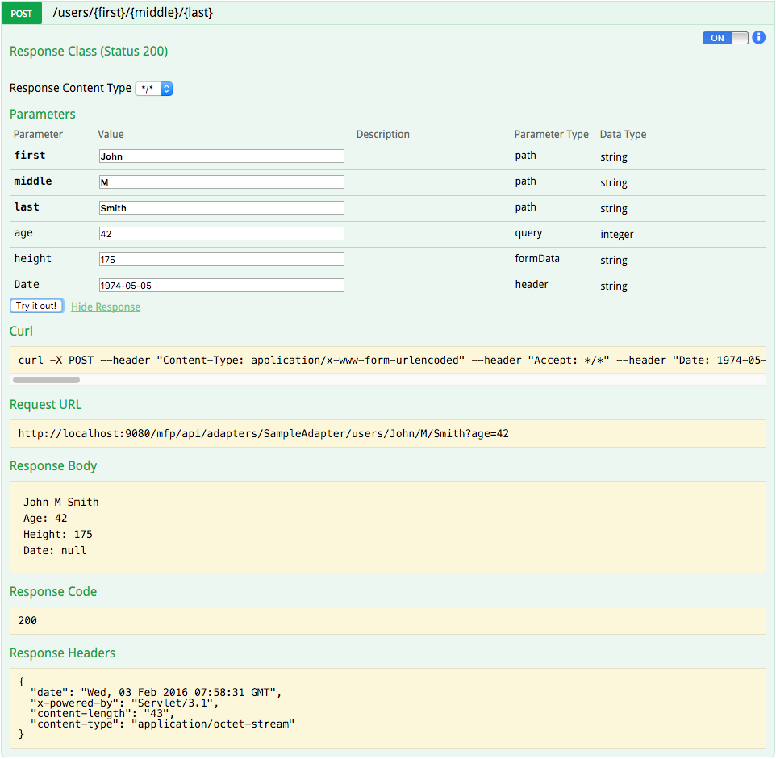

<!-- NLS_CHARSET=UTF-8 -->
## Übersicht
{: #overview }

Sie können IDEs wie Eclipse, IntelliJ oder ähnliche verwenden, um Java- und JavaScript-Adapter zu testen
und um Java-Code zu debuggen, der für Java- oder JavaScript-Adapter implementiert werden soll.   

Dieses Lernprogramm zeigt, wie Sie Adapter mithilfe der {{ site.data.keys.mf_cli }} und mit Postman testen und
einen Java-Adapter in der Eclipse-IDE debuggen können. 

#### Fahren Sie mit folgenden Abschnitten fort: 
{: #jump-to }

* [Adapter testen](#testing-adapters)
 * [Postman](#using-postman)
 * [Swagger](#using-swagger)
* [Adapter debuggen](#debugging-adapters)
 * [JavaScript-Adapter](#debugging-javascript-adapters)
 * [Java-Adapter](#debugging-java-adapters)

## Adapter testen
{: #testing-adapters }

Adapter sind über eine REST-Schnittstelle verfügbar. Wenn Sie die URL einer Ressource kennen, können Sie daher
HTTP-Tools wie Postman verwenden, um Anforderungen zu testen und `URL`-, `path`- und `body`-Parameter
oder `headers` zu übergeben. 

Die URL für den Zugriff auf die Adapterressource hat folgende Struktur: 

* JavaScript-Adapter - `http://hostname-or-ip-address:port-number/mfp/api/adapters/{adapter-name}/{procedure-name}`
* Java-Adapter - `http://hostname-or-ip-address:port-number/mfp/api/adapters/{adapter-name}/{path}`

### Parameter übergeben
{: #passing-parameters }

* Wenn Sie Java-Adapter verwenden, können Sie je nach Konfiguration Ihres Adapters Parameter
in der URL, im Hauptteil, im Formular usw. übergeben. 
* Wenn Sie JavaScript-Adapter verwenden, übergeben Sie Parameter in der Form `params=["param1", "param2"]`. Eine JavaScript-Prozedur empfängt also nur einen Parameter mit der Bezeichnung
`params`, bei dem es sich um ein **Array mit sortierten, nicht benannten Werten** handeln muss. Dieser Parameter
kann bei Verwendung von `Content-Type: application/x-www-form-urlencoded` in der URL enthalten sein (`GET`) oder im Hauptteil (`POST`). 

### Handhabung der Sicherheit
{: #handling-security }

Das Sicherheitsframework der {{ site.data.keys.product }} erfordert für jede Adapterressource ein Zugriffstoken.
Dies gilt auch dann, wenn der Ressource nicht explizit ein Bereich zugeordnet wurde. Der Endpunkt ist somit immer geschützt, es sei denn, Sie haben die Sicherheit inaktiviert. 

Wenn Sie die Sicherheit in Java-Adaptern inaktivieren möchten, fügen Sie zur Methode/Klasse die Annotation `OAuthSecurity` hinzu: 

```java
@OAuthSecurity(enabled=false)
```

Wenn Sie die Sicherheit in JavaScript-Adaptern inaktivieren möchten, fügen Sie zur Prozedur das Attribut `secured` hinzu: 

```js
<procedure name="adapter-procedure-name" secured="false"/>
```

In der Entwicklungsversion von {{ site.data.keys.mf_server }} gibt es als Alternative einen Testtokenendpunkt zum Umgehen der Sicherheitsabfragen. 

### Postman
{: #using-postman }

#### Testtoken
{: #test-token }

Zum Abrufen eines Testtokens können Sie unten auf die Schaltfläche "In Postman ausführen" klicken und eine Sammlung
in Ihre Postman-App mit einer fertigen Anforderung importieren oder den nächsten Schritt ausführen und eine eigene Anforderung erstellen. 

<a href="https://app.getpostman.com/run-collection/d614827491450d43c10e"></a>


1. Erstellen Sie in der {{ site.data.keys.mf_console }} auf der Registerkarte
**Einstellungen** → **Vertrauliche Clients** einen vertraulichen Client. Sie können auch den
Standardclient verwenden. Setzen Sie
**Zulässiger Bereich** für Testzwecke auf `**`.

  


1. Setzen Sie mit Ihrem HTTP-Client (Postman) eine HTTP-`POST`-Anforderung an
`http://<IP-Adresse>:<PORT>/mfp/api/az/v1/token` ab. Verwenden Sie
`Content-Type: application/x-www-form-urlencoded` und die folgenden Parameter:

* `grant_type`: `client_credentials`
* `scope`: Verwenden Sie den Bereich, der die Ressource schützt.
Falls Sie Ihre Ressource nicht mit einem Bereich schützen, verwenden Sie eine leere Zeichenfolge. 


  
2. Fügen Sie einen Autorisierungsheader (`authorization header`) hinzu. Verwenden Sie die Basisauthentifizierung
(`Basic authentication`) mit "test" als ID des vertraulichen Clients und "test" als geheimem Schlüssel. 
> Weitere Informationen zum vertraulichen Client enthält das Lernprogramm [Vertraulicher Client](../../authentication-and-security/confidential-clients).

  


Das Ergebnis ist ein JSON-Objekt mit einem temporär gültigen Zugriffstoken: 

```json
{
  "access_token": "eyJhbGciOiJSUzI1NiIsImp3ayI6eyJlIjoiQVFBQiIsIm4iOiJBTTBEZDd4QWR2NkgteWdMN3I4cUNMZEUtM0kya2s0NXpnWnREZF9xczhmdm5ZZmRpcVRTVjRfMnQ2T0dHOENWNUNlNDFQTXBJd21MNDEwWDlJWm52aHhvWWlGY01TYU9lSXFvZS1ySkEwdVp1dzJySGhYWjNXVkNlS2V6UlZjQ09Zc1FOLW1RSzBtZno1XzNvLWV2MFVZd1hrU093QkJsMUVocUl3VkR3T2llZzJKTUdsMEVYc1BaZmtOWkktSFU0b01paS1Uck5MelJXa01tTHZtMDloTDV6b3NVTkExNXZlQ0twaDJXcG1TbTJTNjFuRGhIN2dMRW95bURuVEVqUFk1QW9oMmluSS0zNlJHWVZNVVViTzQ2Q3JOVVl1SW9iT2lYbEx6QklodUlDcGZWZHhUX3g3c3RLWDVDOUJmTVRCNEdrT0hQNWNVdjdOejFkRGhJUHU4Iiwia3R5IjoiUlNBIiwia2lkIjoidGVzdCJ9fQ.eyJpc3MiOiJjb20uaWJtLm1mcCIsInN1YiI6InRlc3QiLCJhdWQiOiJjb20uaWJtLm1mcCIsImV4cCI6MTQ1MjUxNjczODAwNSwic2NvcGUiOiJ4eCJ9.vhjSkv5GShCpcDSu1XCp1FlgSpMHZa-fcJd3iB4JR-xr_3HOK54c36ed_U5s3rvXViao5E4HQUZ7PlEOl23bR0RGT2bMGJHiU7c0lyrMV5YE9FdMxqZ5MKHvRnSOeWlt2Vc2izh0pMMTZd-oL-0w1T8e-F968vycyXeMs4UAbp5Dr2C3DcXCzG_h9jujsNNxgXL5mKJem8EpZPolQ9Rgy2bqt45D06QTW7J9Q9GXKt1XrkZ9bGpL-HgE2ihYeHBygFll80M8O56By5KHwfSvGDJ8BMdasHFfGDRZUtC_yz64mH1lVxz5o0vWqPwEuyfslTNCN-M8c3W9-6fQRjO4bw",
  "token_type": "Bearer",
  "expires_in": 3599,
  "scope": "**"
}
```
<br/><br/>
#### Anforderung senden
{: #sending-request }

Fügen Sie in Ihren künftigen Anforderungen an die Adapterendpunkte einen HTTP-Header mit dem Namen `Authorization` und den Wert, den
Sie erhalten haben (und der mit Bearer beginnt), hinzu. Das Sicherheitsframework übergeht alle Sicherheitsabfragen zum Schutz Ihrer Ressource. 

  

### Swagger
{: #using-swagger }

Die Benutzerschnittstelle für Swagger-Dokumente ist eine grafische Darstellung von REST-Endpunkten eines Adapters.   
In Swagger kann ein Entwickler die Adapterendpunkte testen, bevor sie von einer Clientanwendung konsumiert werden. 

Greifen Sie wie folgt auf Swagger zu:

1. Öffnen Sie die {{ site.data.keys.mf_console }} und wählen Sie in der Adapterliste einen Adapter aus. 
2. Klicken Sie auf das Register **Ressourcen**. 
3. Klicken Sie auf die Schaltfläche **Swagger-Dokumente anzeigen**.   
4. Klicken Sie auf die Schaltfläche **Ein-/Ausblenden**. 

  


#### Testtoken
{: #test-token }

Wenn Sie ein Testtoken zu der Anforderung hinzufügen möchten, damit das Sicherheitsframework alle Sicherheitsabfragen zum Schutz Ihrer Ressource übergeht,
klicken Sie am rechten Rand neben einer Endpunktoperation auf die Schaltfläche **ON/OFF**. 

Sie werden aufgefordert, die Bereiche auszuwählen, für die Sie die Swagger-Benutzerschnittstelle berechtigen möchten. (Zu Testzwecken können Sie alle auswählen.) Wenn Sie die Swagger-Benutzerschnittstelle zum ersten Mal verwenden, müssen Sie sich möglicherweise mit einer ID des vertraulichen Clients und einem geheimen Schlüssel anmelden. Sie müssen dazu einen neuen vertraulichen Client mit
`*` als **zulässigem Bereich** erstellen. 

> Weitere Informationen zum vertraulichen Client enthält das Lernprogramm [Vertraulicher Client](../../authentication-and-security/confidential-clients).

<br/><br/>
#### Anforderung senden
{: #sending-request-swagger }

Blenden Sie die Operation des Endpunkts ein, geben Sie (sofern erforderlich) die Parameter ein und klicken Sie auf
die Schaltfläche **Try it out!**. 

  

#### Swagger-Annotationen
{: #swagger-annotations }
Die Annotationen sind nur für Java-Adapter verfügbar. 

Wenn Sie eine Swagger-Dokumentation für Java-Adapter generieren möchten, verwenden Sie in Ihrer Java-Implementierung Swagger-Annotationen. 
> Weitere Informationen zu Swagger-Annotationen finden Sie in der [Swagger-Dokumentation](https://github.com/swagger-api/swagger-core/wiki/Annotations-1.5.X).

```java
@ApiOperation(value = "Multiple Parameter Types Example", notes = "Example of passing parameters by using 3 different methods: path parameters, headers, and form parameters. A JSON object containing all the received parameters is returned.")
@ApiResponses(value = { @ApiResponse(code = 200, message = "A JSON object containing all the received parameters returned.") })
@POST
@Produces(MediaType.APPLICATION_JSON)
@Path("/{path}")
public Map<String, String> enterInfo(
    @ApiParam(value = "The value to be passed as a path parameter", required = true) @PathParam("path") String path,
    @ApiParam(value = "The value to be passed as a header", required = true) @HeaderParam("Header") String header,
    @ApiParam(value = "The value to be passed as a form parameter", required = true) @FormParam("form") String form) {
  Map<String, String> result = new HashMap<String, String>();

  result.put("path", path);
  result.put("header", header);
  result.put("form", form);

  return result;
}
```



### {{ site.data.keys.mf_cli }} verwenden
{: #using-mobilefirst-cli }

Verwenden Sie zum Testen der Adapterfunktionalität den Befehl `mfpdev adapter call`, mit dem Java- oder JavaScript-Adapter von der Befehlszeile aus aufgerufen werden können.
Sie können wählen, ob Sie den Befehl interaktiv oder direkt ausführen möchten. Es folgt ein Beispiel für den Direktmodus:

#### Java-Adapter
{: #java-adapters-adapters-cli }

Öffnen Sie ein **Befehlszeilenfenster** und führen Sie Folgendes aus:

```bash
mfpdev adapter call adapterName/path
```
Beispiel:

```bash
mfpdev adapter call SampleAdapter/users/World

Calling GET '/mfp/api/adapters/SampleAdapter/users/World'
Response:
Hello World
```

#### JavaScript-Adapter
{: #javascript-adapters-cli }

Öffnen Sie ein **Befehlszeilenfenster** und führen Sie Folgendes aus:

```bash
mfpdev adapter call adapterName/procedureName
```
Beispiel:

```bash
mfpdev adapter call SampleAdapter/getFeed

Calling GET '/mfp/api/adapters/SampleAdapter/users/World'
Response:
Hello World
```



## Adapter debuggen
{: #debugging-adapters }

### JavaScript-Adapter
{: #debugging-javascript-adapters }
Sie können JavaScript-Code von JavaScript-Adaptern mit der API `MFP.Logger` debuggen.   
Die verfügbaren Protokollierungsstufen von der geringsten bis zur größten Ausführlichkeit sind: `MFP.Logger.error`, `MFP.Logger.warn`, `MFP.Logger.info` und `MFP.Logger.debug`.

Die Protokolle werden dann in der Protokolldatei des Anwendungsservers ausgegeben.   
Sie müssen die Ausführlichkeit des Servers entsprechend festlegen, da Sie andernfalls keine Protokollierung in der Protokolldatei sehen. 

### Java-Adapter
{: #debugging-java-adapters }

Vor dem Debuggen des Java-Codes eines Adapters muss Eclipse wie folgt konfiguriert werden: 

1. **Maven-Integration**: Ab Eclipse Kepler (Version 4.3) ist Maven-Unterstützung in Eclipse integriert.
Falls Ihre Eclipse-Instanz keine Unterstützung für Maven bietet,
folgen Sie den Anweisungen unter [M2Eclipse](http://www.eclipse.org/m2e/), um Maven-Unterstützung hinzuzufügen. 

2. Wenn Maven in Eclipse verfügbar ist, importieren Sie das Maven-Adapterprojekt. 

    

3. Geben Sie wie folgt die Debugparameter an: 
    - Klicken Sie auf **Ausführen** → **Debugkonfigurationen**.
    - Klicken Sie doppelt auf **Ferne Java-Anwendung**.
    - Geben Sie einen **Namen** für dise Konfiguration an. 
    - Legen Sie den **Host** fest. Geben Sie "localhost" an, wenn Sie einen lokalen Server verwenden. Geben Sie andernfalls den Namen Ihres fernen Serverhosts an. 
    - Setzen Sie den **Port** auf den Wert "10777".
    - Klicken Sie auf **Durchsuchen** und wählen Sie das Maven-Projekt aus. 
    - Klicken Sie auf **Debug**.

    

4. Klicken Sie auf **Fenster → Sicht anzeigen → Debug**, um *debug mode* einzugeben. Jetzt können Sie den Java-Code normal debuggen, wie Sie es in einer Java-Standardanwendung tun würden. Sie müssen eine Anforderung an den Adapter absetzen, damit der Code ausgeführt wird und die definierten Breakpoints erreicht werden. Befolgen Sie zu diesem Zweck die Anweisungen für das Aufrufen einer Adapterressource im Abschnitt [Adapter testen](#testing-adapters).

    

> Anweisungen für die Nutzung von IntelliJ zum Debuggen von Java-Adaptern finden Sie im Blogbeitrag [Using IntelliJ to Develop MobileFirst Java Adapters]({{site.baseurl}}/blog/2016/03/31/using-intellij-to-develop-adapters).
