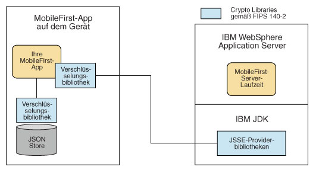

<!-- NLS_CHARSET=UTF-8 -->
## Übersicht
{: #overview }
Die {{ site.data.keys.product_full }}
unterstützt
die Spezifikationen FDCC (Federal Desktop Core Configuration) und USGCB (United States Government Configuration Baseline). Die {{ site.data.keys.product }}
unterstützt auch den Federal Information Processing Standard (FIPS) 140-2,
der ein Sicherheitsstandard für die Zulassung von Verschlüsselungsmodulen ist.

#### Fahren Sie mit folgenden Abschnitten fort: 
{: #jump-to }

* [FDCC- und USGCB-Unterstützung](#fdcc-and-usgcb-support)
* [Unterstützung für FIPS 140-2](#fips-140-2-support)
* [FIPS 140-2 aktivieren](#enabling-fips-140-2)
* [FIPS-140-2-Modus für HTTPS- und JSONStore-Verschlüsselung konfigurieren](#configure-fips-140-2-mode-for-https-and-jsonstore-encryption)
* [FIPS 140-2 für vorhandene Anwendungen konfigurieren](#configuring-fips-140-2-for-existing-applications)

## FDCC- und USGCB-Unterstützung
{: #fdcc-and-usgcb-support }
Die Regierung der Vereinigten Staaten schreibt vor, dass in US-Bundesbehörden Desktops mit
Microsoft-Windows-Plattformen die FDCC-Sicherheitseinstellungen
(Federal
Desktop Core Configuration) oder die neueren USGCB-Sicherheitseinstellungen (United States Government
Configuration Baseline) übernehmen. 

IBM Worklight
Version 5.0.6
wurde in einem Selbstzertifizierungsprozess mit den USGCB- und FDCC-Sicherheitseinstellungen getestet. Die Tests waren so ausgelegt, dass
sichergestellt werden konnte, dass Installationsfunktionen und zentrale Funktionen in dieser Konfiguration ausgeführt werden können.

#### Referenzen
{: #references }
Weitere Informationen finden Sie unter [USGCB](http://usgcb.nist.gov/).

## Unterstützung für FIPS 140-2
{: #fips-140-2-support }
Federal Information Processing Standards (FIPS) sind Standards und Richtlinien, die vom
NIST (United States National Institute
of Standards and Technology) für Computersysteme in US-Regierungsbehörden herausgegeben werden. Die FIPS-Veröffentlichung 140-2 ist ein Sicherheitsstandard für
die Zulassung von Verschlüsselungsmodulen.Die
{{ site.data.keys.product }}
bietet FIPS-140-2-Unterstützung für Android- und iOS-Cordova-Apps. 

### FIPS 140-2 für den {{ site.data.keys.mf_server }} und SSL-Kommunikation mit dem {{ site.data.keys.mf_server }}
{: #fips-140-2-on-the-mobilefirst-server-and-ssl-communications-with-the-mobilefirst-server }
{{ site.data.keys.mf_server }} wird in einem Anwendungsserver wie WebSphere Application Server ausgeführt. Der WebSphere Application Server kann
so konfiguriert werden, dass mit FIPS 140-2 konforme Verschlüsselungsmodule für eingehende und abgehende SSL-Verbindungen (Secure Sockets Layer) verwendet
werden müssen.
Die Verschlüsselungsmodule werden über JCE
(Java Cryptography Extension) auch für Verschlüsselungsoperationen der Anwendungen verwendet. Da der {{ site.data.keys.mf_server }} eine
im Anwendungsserver ausgeführte Anwendung ist, verwendet er für eingehende und abgehende SSL-Verbindungen mit
FIPS 140-2 konforme Verschlüsselungsmodule.

Wenn ein
{{ site.data.keys.product_adj }}-Client eine
SSL-Verbindung (Secure Sockets Layer) zu
einem {{ site.data.keys.mf_server }} herstellt,
der in einem Anwendungsserver mit FIPS-140-2-Modus ausgeführt wird,
wird die Cipher-Suite gemäß FIPS 140-2 verwendet. Wenn die Clientplattform keine Unterstützung für Cipher-Suites gemäß FIPS 140-2 bietet,
schlägt die SSL-Transaktion fehl und der Client kann keine SSL-Verbindung zum Server erstellen. Bei erfolgreichem Verbindungsaufbau verwendet der
Client eine mit FIPS 140-2 konforme Cipher-Suite. 

> **Hinweis:** Die Verschlüsselungsmodulinstanzen, die der Client verwendet,
müssen nicht notwendigerweise dem Standard FIPS 140-2 entsprechen. Welche Optionen es für die Verwendung von Bibliotheken mit FIPS-140-2-Zulassung auf
Clientgeräten gibt, erfahren Sie weiter unten. 

Es kann sein, dass Client und Server dieselbe Cipher-Suite
(z. B. SSL_RSA_WITH_AES_128_CBC_SHA) verwenden, das clientseitige Verschlüsselungsmodul aber nicht den Zulassungsprozess nach
FIPS 140-2 durchlaufen hat, während der Server Module verwendet, die nach FIPS
140-2 zertifiziert sind.

### Schutz ruhender Daten im JSONStore und über HTTPS transportierter Daten
mit FIPS 140-2 auf dem {{ site.data.keys.product_adj }}-Clientgerät
{: #fips-140-2-on-the-mobilefirst-client-device-for-protection-of-data-at-rest-in-jsonstore-and-data-in-motion-when-using-https-communications }
Der Schutz
ruhender Daten auf dem Clientgerät wird durch den JSONStore
der {{ site.data.keys.product }} gewährleistet.
Der Schutz transportierter Daten erfolgt mittels HTTPS-Datenübertragung zwischen
dem {{ site.data.keys.product_adj }}-Client
und dem {{ site.data.keys.mf_server }}.


Auf iOS-Geräten ist die FIPS-140-2-Unterstützung standardmäßig für bewegte und ruhende Daten aktiviert. 

Android-Geräte verwdnden standardmäßig nicht gemäß FIPS 140-2 validierte Bibliotheken. Es gibt jedoch die Option, für den Schutz
(d. h. die Ver- und Entschlüsselung) lokaler, im JSONStore gespeicherter Daten und der
HTTPS-Datenübertragung zum
{{ site.data.keys.mf_server }} Bibliotheken gemäß FIPS 140-2 zu verwenden.
Für diese Unterstützung
müssen Sie eine OpenSSL-Bibliothek mit FIPS-140-2-Zulassung (Zertifikat 1747) verwenden. Wenn Sie diese Option
in einem {{ site.data.keys.product_adj }}-Clientprojekt aktivieren möchten, fügen Sie das optionale
FIPS-140-2-Plug-in für Android hinzu. 

**Hinweis:** Beachten Sie bitte
die folgenden Einschränkungen: 

* Der Modus mit FIPS-140-2-Zulassung gilt nur für den Schutz (die Verschlüsselung) lokaler Daten im
JSONStore und den Schutz der HTTPS-Kommunikation zwischen einem {{ site.data.keys.product_adj }}-Client
und {{ site.data.keys.mf_server }}. 
* Dieses Feature wird nur auf der iOS- und der Android-Plattform unterstützt.
    * Unter Android wird dieses Feature nur für Geräte oder Simulatoren unterstützt, die die Architektur x86 oder
armeabi verwenden.
Für
Android mit armv5- oder armv6-Architektur wird das Feature nicht unterstützt.
Das liegt daran, dass die verwendete OpenSSL-Bibliothek keine
FIPS-140-2-Zulassung für armv5 oder armv6 mit Android erhalten hat. Obwohl die
{{ site.data.keys.product_adj }}-Bibliothek
die 64-Bit-Architektur unterstützt, wird FIPS 140-2 von dieser Architektur nicht unterstützt. FIPS 140-2 kann auf 64-Bit-Geräten ausgeführt werden, wenn das Projekt nur
native 32-Bit-NDK-Bibliotheken enthält. 
    * Unter iOS wird das Feature für die i386-, x86_64-, armv7-, armv7s-
und arm64-Architektur unterstützt. 
* Dieses Feature funktioniert nur in Hybridanwendungen (nicht in nativen Anwendungen). 
* In nativem iOS ist FIPS standardmäßig über die iOS-FIPS-Bibliotheken aktiviert. Es ist keine Aktion zum Aktivieren von FIPS 140-2 erforderlich. 
* HTTPS-Kommunikation: 
    * Auf Android-Geräten werden die FIPS-140-2-Bibliotheken auf dem Client nur für die Kommunikation
zwischen {{ site.data.keys.product_adj }}-Client
und {{ site.data.keys.mf_server }} verwendet. Für direkte Verbindungen zu anderen Servern oder Services werden keine
FIPS-140-2-Bibliotheken verwendet.
    * Der {{ site.data.keys.product_adj }}-Client kann nur mit einem
{{ site.data.keys.mf_server }} kommunizieren, der in unterstützten Umgebungen
ausgeführt wird, die in den
[Systemanforderungen](http://www-01.ibm.com/support/docview.wss?uid=swg27024838) aufgelistet sind. Wenn {{ site.data.keys.mf_server }}
in einer nicht unterstützten Umgebung ausgeführt wird, kann die HTTPS-Verbindung mit einem Fehler "key size too small" fehlschlagen. Bei der HTTP-Kommunikation kommt dieser
Fehler nicht vor. 
* Der IBM MobileFirst-Platform-Foundation-Application-Center-Client
bietet keine Unterstützung für FIPS 140-2. 

Falls Sie die im genannten Lernprogramm beschriebenen
Änderungen vorgenommen hatten, müssen
Sie Ihre Android- oder iOS-Umgebung löschen und neu erstellen. Speichern Sie zuvor jedoch alle Ihre umgebungsspezifischen Änderungen.



> Weitere Informationen zu JSONStore
finden Sie im Artikel [JSONStore im Überblick](../../application-development/jsonstore).

## Referenzen
{: #references-1 }
Wie Sie den
FIPS-140-2-Modus in WebSphere Application Server
aktivieren, erfahren Sie
im Artikel [FIPS-Unterstützung](http://ibm.biz/knowctr#SSAW57_8.5.5/com.ibm.websphere.nd.multiplatform.doc/ae/rovr_fips.html). 

In der
Administrationskonsole von
WebSphere Application Server Liberty
Profile gibt es keine Option zum Aktivieren des
FIPS-140-2-Modus. FIPS 140-2 kann jedoch durch Konfigurieren der Java-Laufzeitumgebung für die
Verwendung von FIPS-140-2-konformen Modulen aktiviert werden. Weitere Informationen hierzu finden Sie in der Veröffentlichung
"Java Secure
Socket Extension (JSSE) IBMJSSE2 Provider Reference Guide". 

## FIPS 140-2 aktivieren
{: #enabling-fips-140-2 }
Auf iOS-Geräten ist die FIPS-140-2-Unterstützung standardmäßig für bewegte und ruhende Daten aktiviert.   
Fügen Sie für Android-Geräte das Cordova-Plug-in `cordova-plugin-mfp-fips` hinzu. 

Wenn das Feature hinzugefügt wurde, wird es auf die Verschlüsselung von HTTPS- und JSONStore-Daten angewendet. 

**Hinweise:** 

* FIPS 140-2
wird nur von Android und iOS
unterstützt. Die iOS-Architekturen mit Unterstützung für FIPS 140-2 sind
i386, armv7, armv7s,
x86_64 und arm64. Die Android-Architekturen mit Unterstützung für
FIPS 140-2 sind x86 und
armeambi. 
* Obwohl die
{{ site.data.keys.product_adj }}-Bibliothek für Android
die 64-Bit-Architektur unterstützt, wird FIPS 140-2 von dieser Architektur nicht unterstützt. Wenn Sie FIPS 140-2 auf einem 64-Bit-Gerät verwenden, kann folgender Fehler angezeigt
werden:
 
        
```bash
java.lang.UnsatisfiedLinkError: dlopen failed: "..." is 32-bit instead of 64-bit
```

Dieser Fehler bedeutet, dass
es in Ihrem Android-Projekt native 64-Bit-Bibliotheken gibt und dass FIPS 140-2 nicht funktioniert, wenn Sie diese Bibliotheken verwenden. Navigieren Sie in Ihrem Android-Projekt zu
src/main/libs oder
src/main/jniLibs und prüfen Sie, ob es den Ordner
x86_64 oder arm64-v8a gibt. Wenn das der Fall ist, löschen Sie diese Ordner.
FIPS 140-2 funktioniert dann wieder. 

## FIPS-140-2-Modus für HTTPS- und JSONStore-Verschlüsselung konfigurieren
{: #configure-fips-140-2-mode-for-https-and-jsonstore-encryption }
Für iOS wird FIPS 140-2 über die iOS-FIPS-Bibliotheken aktiviert. Da das Feature standardmäßig aktiviert ist, sind keine Aktivierungs- oder Konfigurationsschritte
erforderlich. 

Das folgende Code-Snippet wird in das initOptions-Objekt
der Datei index.js einer neuen
{{ site.data.keys.product_adj }}-Anwendung für das Android-Betriebssystem
aufgenommen, um FIPS 140-2 zu konfigurieren: 

```javascript
var wlInitOptions = {
  ...
  // # FIPS 140-2 für transportierte Daten (Netz) und ruhende Daten (JSONStore) unter Android konfigurieren.
  //   Das optionale Feature FIPS 140-2 muss aktiviert sein.
  // enableFIPS : false
  ...
};
```

Wie Sie sehen, hat **enableFIPS** für das Android-Betriebssystem den Standardwert `false`. Wenn Sie FIPS 140-2 für die Verschlüsselung von HTTPS-Daten und von
JSONStore-Daten verwenden möchten, entfernen Sie das Kommentarzeichen und setzen Sie die Option
auf `true`. Überwachen Sie anschließend, ob das JavaScript-Ereignis
zur Einsatzbereitschaft von FIPS empfangen wird. Erstellen Sie dazu ein Empfangsbereitschaftsereignis ähnlich dem im folgenden Beispiel:  

```javascript
document.addEventListener('WL/FIPS/READY', 
    this.onFipsReady, false);

onFipsReady: function() {
  // FIPS-SDK geladen und bereit
}
```

Wenn Sie den Wert der Eigenschaft **enableFIPS** definiert haben, müssen Sie einen
neuen Build der Android-Umgebung erstellen. 

**Hinweis:** Sie müssen das FIPS-Cordova-Plug-in installiert haben, bevor Sie die Eigenschaft enableFIPS auf true setzen. Andernfalls wird eine Warnung protokolliert, weil der Wert von initOptions gesetzt ist, das optionale Feature
jedoch nicht gefunden wurde. Beide Features, FIPS 140-2 und
JSONStore, sind unter dem Android-Betriebssystem optional. FIPS 140-2 wird nur für die Verschlüsselung von JSONStore-Daten
verwendet, wenn das optionale Feature JSONStore ebenfalls aktiviert ist.
Wenn JSONStore nicht aktiviert ist, hat FIPS 140-2 keinen Einfluss auf den JSONStore.
Unter iOS ist das optionale Feature FIPS 140-2
nicht für ruhende Daten (JSONStore FIPS 140-2) oder bewegte Daten (HTTPS-Verschlüsselung) erforderlich, da beide Arten von Daten direkt von iOS gehandhabt werden. Unter Android
müsen Sie das optionale
Feature FIPS 140-2 aktivieren, wenn Sie JSONStore FIPS 140-2 oder die HTTPS-Verschlüsselung
verwenden möchten.


```bash
[WARN] FIPSHttp feature not found, but initOptions enables it on startup
```

## FIPS 140-2 für vorhandene Anwendungen konfigurieren
{: #configuring-fips-140-2-for-existing-applications }
Das optionale Feature FIPS 140-2 ist standardmäßig nicht für Apps aktiviert, die für das Android-Betriebssystem erstellt wurden, sowie
für Versionen von iOS-Apps, die
mit Vorversionen von {{ site.data.keys.product_full }} Version
8.0 erstellt wurden. Wie das optionale Feature FIPS 140-2 für das Android-Betriebssystem aktiviert wird, erfahren Sie unter
"FIPS 140-2 aktivieren". Wenn FIPS 140-2 aktiviert ist, können Sie dieses
optionale Feature konfigurieren.

Wenn Sie die im Artikel "FIPS 140-2 aktivieren" beschriebenen Schritte ausgeführt haben,
müssen Sie FIPS 140-2 konfigurieren, indem Sie das initOptions-Objekt in der Datei index.js modifizieren und die
FIPS-Konfigurationseigenschaft hinzufügen.

**Hinweis:**Das
Feature FIPS
140-2 kann mit JSONStore kombiniert werden, um FIPS-140-2-Unterstützung für
JSONStore zu aktivieren. Diese Kombination setzt die Angaben außer Kraft, die in IBM Worklight
bis Version 6.0
im Lernprogramm "JSONStore - Encrypting sensitive
data with FIPS 140-2" enthalten sind. Falls Sie eine Anwendung nach den Anweisungen in diesem Lernprogramm modifiziert hatten,
löschen Sie die iPhone-, iPad- und Android-Umgebung der Anwendung und erstellen Sie die Umgebungen neu. Da beim Löschen einer Umgebung alle umgebungsspezifischen Änderungen, die Sie vorgenommen hatten, verlorengehen, müssen Sie
solche Änderungen vor dem Löschen einer Umgebung sichern.
Nach der erneuten Erstellung der Umgebung können Sie diese Änderungen
auf die nun neue Umgebung anwenden.

Fügen Sie die folgende Eigenschaft zum Objekt initOptions
in der Datei index.js hinzu.

```javascript
enableFIPS : true
```

Erstellen Sie einen neuen Build der Android-Plattform. 
