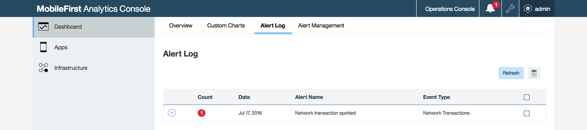

<!-- NLS_CHARSET=UTF-8 -->
## Übersicht
{: #overview }

Alerts ermöglichen eine Überwachung des Zustands Ihrer mobilen Apps, ohne regelmäßig in der
{{ site.data.keys.mf_analytics_console_full }}
nachschauen zu müssen.   
Sie können in der {{ site.data.keys.mf_analytics_console }} reaktive Schwellenwerte festlegen, um
Alerts auszulösen, wenn bestimmte Kriterien erfüllt sind. 

Sie können weniger differenzierte Schwellenwerte (für eine bestimmte App) oder stärker differenzierte Schwellenwerte (für eine bestimmte App-Instanz oder ein bestimmtes Gerät) festlegen. Sie können definieren, dass in der
{{ site.data.keys.mf_analytics_console_short }} Alertbenachrichtigungen angezeigt werden, die auch an einen vorkonfigurierten REST-Endpunkt oder einen kundenspezifischen Webhook gesendet werden können. 

Wenn Alerts ausgelöst werden, zeigt das Symbol **Alert** (in der Titelleiste
der {{ site.data.keys.mf_analytics_console_short }}) die Anleranzahl in rot an
(). Klicken Sie auf das Symbol **Alert**, um die Alerts zu sehen. 

Es gibt weitere Methoden, mit denen Alerts verteilt werden können. 

**Vorbedingung:** Stellen Sie sicher, dass {{ site.data.keys.mf_analytics_server }} gestartet wurde und für den Empfang von Clientprotokollen
bereit ist. 

## Alert-Management
{: #alert-management }

### Alert erstellen
{: #creating-an-alert }

Gehen Sie in der {{ site.data.keys.mf_analytics_console }} wie folgt vor:

1. Wählen Sie das Register **Dashboard → Alert-Management** aus. Klicken Sie auf die Schaltfläche **Alert erstellen**.


   

2. Geben Sie die folgenden Werte an: Alertname, Nachricht, Abfragehäufigkeit und Ereignistyp. Füllen Sie in die übrigen Testfelder die passenden Werte für den Ereignistyp ein. 
3. Klicken Sie nach Eingabe aller Werte auf **Weiter**. Das Register **Verteilungsmethode** wird angezeigt. 

### Register 'Verteilungsmethode'
{: #distribution-method-tab }

Der Alert wird standardmäßig in der {{ site.data.keys.mf_analytics_console_short }} angezeigt.

Sie können auch eine POST-Nachricht mit JSON-Nutzdaten an die {{ site.data.keys.mf_analytics_console_short }} und an eine angepasste ULR senden.
Wählen Sie dazu die Option **Analysekonsole und Netzbeitrag** aus. 

Bei Auswahl dieser Option sind die folgenden Felder verfügbar:


* Netzbeitrag-URL (*erforderlich*)
* Header (*optional*)
* Authentifizierungstyp (*erforderlich*)


## Kundenspezifischer Webhook
{: #custom-web-hook }

Sie können eine angepasste Verteilungsmethode für einen Alert einrichten. Defiieren Sie beispielsweise einen kundenspezifischen Webhook, an den beim Auslösen eines Alertschwellenwerts
Nutzdaten gesendet werden. 

Beispielnutzdaten: 

```json
{
  "timestamp": 1442848504431,
  "condition": {"value":5.0,"operator":"GTE"},
  "value": "CRASH",
  "offenders": [
    { "XXX 1.0": 5.0 },
    { "XXX 2.0": 1.0 }
  ],
  "property":"closedBy",
  "eventType":"MfpAppSession",
  "title":" Crash Count Alert for Application ABC",
  "message": "The crash count for a application ABC exceeded XYZ.
    View the Crash Summary table in the Crashes tab in the Apps
    section of the MobileFirst Analytics Console
    to see a detailed stacktrace of this crash instance."
}
```

Die POST-Anforderung enthält die folgenden Attribute: 

* **timestamp** - Zeit der Erstellung der Alertbenachrichtigung
* **condition** - vom Benutzer festgelegter Schwellenwert (z. B. größer-gleich 5)
* **eventType** - abgefragter Ereignistyp (eventType)
* **property** - Eigenschaft des abgefragten Ereignistyps 
* **value** - Wert der abgefragten Eigenschaft
* **offenders** - Liste der Apps oder Geräte, die den Alert ausgelöst haben
* **title** - benutzerdefinierter Titel 
* **message** - benutzerdefinierte Nachricht

## Alertdetails anzeigen
{: #viewing-alert-details }

Alertdetails können auf der Registerkarte **Dashboard → Alertprotokoll** der {{ site.data.keys.mf_analytics_console }} angezeigt werden.



Klicken Sie für jeden verfügbaren eingehenden Alert auf das Symbol **+**. Sie sehen daraufhin die Abschnitte **Alertdefinition** und **Alertinstanzen**. In der folgenden Abbildung sind die Abschnitte "Alertdefinition" und "Alertinstanzen" dargestellt.


