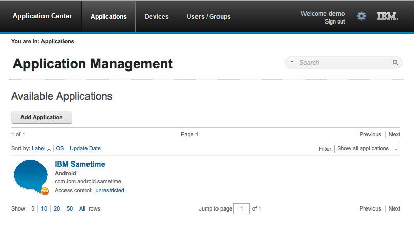

<!-- NLS_CHARSET=UTF-8 -->
## Übersicht
{: #overview }
Mit der Application-Center-Konsole können Sie das Repository des Application Center und Ihre Anwendungen verwalten.

Die Application-Center-Konsole ist eine Webanwendung für die Verwaltung des Application-Center-Repositorys. Das Application-Center-Repository
ist die zentrale Stelle, an der Sie die mobilen Anwendungen speichern, die auf mobilen Geräten installiert werden können. 

Verwenden Sie die Application-Center-Konsole für Folgendes:

* Hochladen von Anwendungen, die für die Betriebssysteme Android,
iOS, Windows 8 (nur Windows-Store-Pakete), Windows Phone 8 oder Windows 10 Universal geschrieben wurden
* Verwalten mehrerer verschiedener Versionen mobiler Anwendungen
* Prüfen von Rückmeldungen von Testern mobiler Anwendungen
* Definieren der Benutzer, die die Berechtigung haben, eine Anwendung auf den mobilen Geräten aufzulisten und zu installieren
* Verfolgen, welche Anwendungen auf welchen Geräten installiert sind

> **Hinweise:**
>
> * Nur Benutzer mit der Administratorrolle können sich bei der Application-Center-Konsole anmelden.
> * Unterstützung der Eignung für einen kulturübergreifenden Einsatz: Die Benutzerschnittstelle der Application-Center-Konsole ist nicht übersetzt.

#### Fahren Sie mit folgenden Abschnitten fort: 
{: #jump-to }
* [Application-Center-Konsole starten](#starting-the-application-center-console)
* [Fehlerkorrektur für beschädigte Anmeldeseite (Apache Tomcat)](#troubleshooting-a-corrupted-login-page-apache-tomcat)
* [Fehlerkorrektur für beschädigte Anmeldeseite in Safari-Browsern](#troubleshooting-a-corrupted-login-page-in-safari-browsers)
* [Anwendungsmanagement](#application-management)
* [Mobile Anwendung hinzufügen](#adding-a-mobile-application)
* [Anwendung aus einem öffentlichen App Store hinzufügen](#adding-an-application-from-a-public-app-store)
* [Anwendungseigenschaften](#application-properties)
* [Anwendungseigenschaften bearbeiten](#editing-application-properties)
* [Upgrade für eine mobile Anwendung
in {{ site.data.keys.mf_server }} und im Application Center](#upgrading-a-mobile-application-in-mobilefirst-server-and-the-application-center)
* [Anwendungsdatei herunterladen](#downloading-an-application-file)

In der Application-Center-Konsole können Sie von Benutzern gesendete Rezensionen
zu Versionen mobiler Anwendungen sehen.

* [Benutzer- und Gruppenverwaltung](#user-and-group-management)
* [Zugriffssteuerung](#access-control)
* [Zugriffssteuerung verwalten](#managing-access-control)
* [Geräteverwaltung](#device-management)
* [Token für Anwendungsregistrierung in Windows 8 Universal](#application-enrollment-tokens-in-windows-8-universal)
* [Abmeldung bei der Application-Center-Konsole](#signing-out-of-the-application-center-console)

## Application-Center-Konsole starten
{: #starting-the-application-center-console }
Sie können das Application Center mit Ihrem Webbrowser starten und sich anmelden, wenn Sie die Administratorrolle haben.

1. Starten Sie eine Webbrowsersitzung auf Ihrem Desktop.
2. Setzen Sie sich mit Ihrem Systemadministrator in Verbindung, um die Adresse und den Port des Servers zu erhalten, auf dem das Application Center installiert ist.
3. Geben Sie die URL `http://Server/appcenterconsole` ein. 
4. Hier steht **Server** für die Adresse und den Port des Servers, auf dem das Application Center installiert ist: `http://localhost:9080/appcenterconsole`.

Melden Sie sich bei der Application-Center-Konsole an. Setzen Sie sich mit Ihrem Systemadministrator in Verbindung, um Ihre Berechtigungsnachweise zu erhalten, damit
Sie sich bei der Application-Center-Konsole anmelden können.

> **Hinweis:** Nur Benutzer mit der Administratorrolle können sich bei der Application-Center-Konsole anmelden.

## Fehlerkorrektur für beschädigte Anmeldeseite (Apache Tomcat)
{: #troubleshooting-a-corrupted-login-page-apache-tomcat }
Sie können eine beschädigte Anmeldeseite in der Application-Center-Konsole wiederherstellen, wenn
das Application Center in Apache Tomcat ausgeführt wird.

Wenn das Application Center in Apache Tomcat ausgeführt wird, kann die Anmeldeseite der
Application-Center-Konsole bei Eingabe eines falschen Benutzernamens oder Kennworts
beschädigt werden.

Wenn Sie versuchen, sich bei der Konsole mit einem falschen Benutzernamen oder Kennwort anzumelden, empfangen Sie eine
Fehlernachricht. Korrigieren Sie daraufhin den Benutzernamen oder das Kennwort, erfolgt keine Anmeldung. Stattdessen tritt einer der folgenden
Fehler auf. Die angezeigte Nachricht ist vom verwendeten Web-Browser abhängig. 

* Es erscheint dieselbe Fehlernachricht wie zuvor.
* Es erscheint die Nachricht **Die Verbindung wurde zurückgesetzt**.
* Es erscheint die Nachricht **Die maximale Anmeldezeit wurde überschritten**.

Das genannte Verhalten hängt damit zusammen, wie
Apache Tomcat das Servlet j_security_check verwaltet.
Dieses Verhalten zeigt sich nur in Apache Tomcat und tritt in keinem der
WebSphere-Application-Server-Profile auf.

Als Ausweichlösung können Sie im Browser auf die Schaltfläche für Aktualisierung klicken, um die Webseite nach einem
Anmeldefehler zu aktualisieren. Geben Sie dann die richtigen Berechtigungsnachweise ein.

## Fehlerkorrektur für beschädigte Anmeldeseite in Safari-Browsern
{: #troubleshooting-a-corrupted-login-page-in-safari-browsers }
Sie können eine beschädigte Anmeldeseite in der Application-Center-Konsole wiederherstellen, wenn
Sie den Safari-Browser verwenden. 

Wenn die Application-Center-Konsole im Safari-Browser geöffnet ist, können Sie an eine Position außerhalb der Konsole navigieren. Wenn Sie
anschließend wieder zur Konsole navigieren, kann die Anmeldeseite angezeigt werden. Obwohl Sie die richtigen Anmeldedaten eingegeben haben, sehen Sie anstelle einer erfolgreichen Anmeldung die folgende
Nachricht: **HTTP Status 404 - appcenterconsole/j_security_check**. 

Dieses Verhalten steht im Zusammenhang mit einem Caching-Problem im Safari-Browser. 

Die Ausweichlösung besteht darin, ein erneutes Laden zu erzwingen, wenn die Anmeldeseite ohne eingegebene oder automatisch eingetragene Berechtigungsnachweise angezeigt wird. Gehen Sie dazu wie folgt vor: 

* Halten Sie auf einem Mac-Computer die Umschalttaste gedrückt, während Sie die Taste für Aktualisierung drücken. 
* Klicken bzw. tippen Sie auf einem iPad oder iPhone doppelt auf die Schaltfläche für Aktualisierung oder bereinigen Sie den Cache, indem
Sie Safari schließen. Klicken oder tippen Sie dazu doppelt auf die Schaltfläche "Home". Wischen Sie dann Safari zur Seite. 

## Anwendungsmanagement
{: #application-management }
Mithilfe des Anwendungsmanagements können Sie neue Anwendungen und Versionen hinzuzufügen und die hinzugefügten Anwendungen verwalten.  
Im Application Center können Sie neue Anwendungen und Versionen hinzuzufügen und die Anwendungen verwalten. 

Klicken Sie auf **Anwendungen**, um auf das Anwendungsmanagement zuzugreifen.

### In WebSphere Application Server Liberty Profile
oder Apache Tomcat installiertes Application Center
{: #application-center-installed-on-websphere-application-server-liberty-profile-or-on-apache-tomcat }
Bei Installation des Application Center
in diesen Anwendungsservern werden während der Installation der {{ site.data.keys.product_full }} mit dem
IBM Installation-Manager-Paket zwei verschiedene Benutzer definiert, die Sie für die ersten Schritte
verwenden können.

* Benutzer mit dem Anmeldenamen **demo** und dem Kennwort **demo**
* Benutzer mit dem Anmeldenamen **appcenteradmin** und dem Kennwort **admin**

### WebSphere Application Server Full Profile
{: #websphere-application-server-full-profile }
Wenn Sie das Application Center
in WebSphere Application Server
Full Profile installiert haben, wird standardmäßig ein Benutzer mit dem Namen appcenteradmin und dem vom Installationsprogramm
angegebenen Kennwort erstellt.

## Mobile Anwendung hinzufügen
{: #adding-a-mobile-application }
Sie können über die Application-Center-Konsole Anwendungen zum Repository auf dem Server hinzufügen. Diese Anwendungen können dann
mithilfe des mobilen Clients auf mobilen Geräten installiert werden.

In der Ansicht "Anwendungen" können Sie Anwendungen zum Application Center hinzufügen. Anfänglich ist die Liste der Anwendungen leer. Sie müssen eine Anwendungsdatei hochladen. Nachfolgend sind die
Anwendungsdateien beschrieben.

Gehen Sie wie folgt vor, wenn Sie eine Anwendung hinzufügen möchten, die für die Installation auf mobilen Geräten bereitgestellt
werden soll:

1. Klicken Sie auf **Anwendung hinzufügen**.
2. Klicken Sie auf **Hochladen**.
3. Wählen Sie die Anwendungsdatei aus, die in das Application-Center-Repository hochgeladen werden soll.

   ### Android
   {: #android }
   Die Anwendungsdateierweiterung ist **.apk**.

   ### iOS
   {: #ios }
   Die Anwendungsdateierweiterung ist **.ipa** für normale iOS-Anwendungen. 

   ### Windows Phone 8
   {: #windows-phone-8 }
   Die Anwendungsdateierweiterung ist **.xap**. Die Anwendung muss mit einem Unternehmenskonto
signiert werden. Das Anwendungsregistrierungstoken für dieses Unternehmenskonto muss für
Geräte mit Windows Phone 8 verfügbar sein, bevor die Anwendung auf den Geräten installiert wird. Einzelheiten finden Sie unter
[Token für Anwendungsregistrierung in
Windows 8 Universal](#application-enrollment-tokens-in-windows-8-universal). 

   ### Windows 8
   {: #windows-8 }
   Die Anwendung wird mit der Erweiterung **.appx** als Windows-Store-Paket bereitgestellt.

   Windows-Store-Pakete (.appx) können von
Windows-Komponenten oder Bibliotheks-App-Paketen (die auch als
"Frameworkpakete" bezeichnet werden) abhängig sein. MobileFirst-Hybridanwendungen
für Windows 8
hängen vom Frameworkpaket Microsoft.WinJS
ab. Wenn Sie das Anwendungspaket in Microsoft Visual
Studio generieren, werden die vorausgesetzten Pakete ebenfalls als gesonderte .appx-Dateien generiert. Um solche Anwendungen erfolgreich mit dem mobilen Client
installieren zu können, müssen Sie das Anwendungspaket (.appx) und alle anderen vorausgesetzten Pakete auf
den Application-Center-Server hochladen.
Ein hochgeladenes vorausgesetztes Paket erscheint
in der Application-Center-Konsole als inaktiv. Dieses Verhalten ist zu erwarten, denn das Frameworkpaket soll nicht als im Client installierbare Anwendung
angezeigt werden. Installiert ein Benutzer später eine solche Anwendung, überprüft der mobile Client, ob die Abhängigkeiten bereits auf dem Gerät installiert sind. Wenn das vorausgesetzte Paket
nicht installiert ist, ruft der Client dieses Paket automatisch vom Application-Center-Server ab und installiert es auf dem Gerät. Weitere Informationen
zu Abhängigkeiten finden Sie in der
Windows-Entwicklerdokumentation zu Paketen und zur Anwendungsimplementierung im Abschnitt
[Abhängigkeiten](http://msdn.microsoft.com/library/windows/apps/hh464929.aspx#dependencies). 

   ### Windows 10 Universal
   {: windows-10-universal}
   Die Anwendungsdateierweiterung ist **.appx**.
   

4. Klicken Sie auf **Weiter**, um auf die Eigenschaften zuzugreifen und die Anwendungsdefinition zu vervollständigen.
5. Legen Sie die Eigenschaften für die Anwendungsdefinition fest. Im Artikel
[Anwendungseigenschaften](#application-properties) finden Sie Informationen zu den Eigenschaftswerten.
6. Klicken Sie auf
**Fertigstellen**.

## Anwendung aus einem öffentlichen App Store hinzufügen
{: #adding-an-application-from-a-public-app-store }
Das Application Center unterstützt das Hinzufügen von Kataloganwendungen, die in Application Stores anderer Anbieter wie
Google
Play oder Apple iTunes gespeichert sind.

Anwendungen aus App Stores anderer Anbieter erscheinen im Application-Center-Katalog wie alle anderen Anwendungen. Für die Installation solcher Anwendungen
werden Benutzer jedoch zum entsprechenden öffentlichen App Store weitergeleitet.
Eine Anwendung aus einem öffentlichen App Store fügen Sie in der Konsole
an derselben Stelle wie eine im eigenen Unternehmen erstellte Anwendung hinzu
(siehe [Mobile Anwendung hinzufügen](#adding-a-mobile-application)).

> **Hinweis:** Zurzeit unterstützt das
Application Center nur Google Play und Apple iTunes. Windows Phone Store und Windows Store
werden noch nicht unterstützt.

Anstelle der ausführbaren Datei
der Anwendung müssen Sie eine URL für den Application Store des anderen Anbieters bereitstellen, in dem
die Anwendung gespeichert ist. Damit Sie den richtigen Anwendungslink leichter finden, stellt die Konsole auf der Seite
**Add an application** direkte Links zu den Websites unterstützter Application Stores von anderen Anbietern bereit.

Die Adresse des Stores Google Play lautet [https://play.google.com/store/apps](https://play.google.com/store/apps).

Die Adresse des Stores
Apple iTunes lautet [https://linkmaker.itunes.apple.com/](https://linkmaker.itunes.apple.com/).
Sie sollten anstelle der iTunes-Site die linkmaker-Site verwenden, weil Sie dort nach allen Arten von
iTunes-Artikeln suchen können, z. B. nach Songs, Podcasts und anderen von Apple unterstützten Artikeln. Wenn Sie nur "iOS Apps" auswählen, werden kompatible Links für die Erstellung
von Anwendungslinks angezeigt.

1. Klicken Sie auf die URL des öffentlichen App Stores, den Sie durchsuchen möchten.
2. Kopieren Sie die Anwendungs-URL aus dem App Store des anderen Anbieters in das Textfeld **Application URL** auf der Seite
**Add an application** der Application-Center-Konsole.
    * **Google Play:**
        * Wählen Sie im Store eine Anwendung aus.
        * Klicken Sie auf die Detailseite der Anwendung.
        * Kopieren Sie die URL aus der Adresszeile.
    * **Apple iTunes:**
        * Wenn im Suchergebnis die Liste der Artikel angezeigt wird, wählen Sie den gewünschten Artikel aus.

        * Klicken Sie unter der ausgewählten Anwendung auf **Direct Link**, um die Seite mit den Anwendungsdetails zu öffnen. 

        * Kopieren Sie die URL aus der Adresszeile.

          **Hinweis:** Kopieren Sie nicht den direkten Link (**Direct Link**) zum Application Center. Der **direkte Link** ist eine URL mit Umleitung. Sie benötigen die Ziel-URL dieser Umleitung. 

3. Wenn Sie den Anwendungslink in das Textfeld **Application URL** der Konsole kopiert haben,
klicken Sie auf **Next**, um die Erstellung des Anwendungslinks zu überprüfen.
    * Bei nicht erfolgreicher Überprüfung wird auf der Seite
**Add an application** eine Fehlernachricht angezeigt. Sie können es mit einem anderen Link versuchen oder die versuchte
Linkerstellung abbrechen.
    * Wenn die Überprüfung erfolgreich verläuft, werden die Anwendungseigenschaften angezeigt.
Anschließend können Sie die Anwendungsbeschreibung in den Anwendungseigenschaften modifizieren, bevor Sie
mit dem nächsten Schritt fortfahren. 

    

4. Klicken Sie auf **Done**, um den Anwendungslink zu erstellen.

    Damit wird die Anwendung für die entsprechende Version des mobilen
Application-Center-Clients verfügbar. Für das Anwendungssymbol erscheint ein kleines Linksymbol, um anzuzeigen, dass diese Anwendung
in einem öffentlichen App Store gespeichert und anders als eine Binär-App ist.

    

## Anwendungseigenschaften
{: #application-properties }
Anwendungen haben ihre eigenen Eigenschaften, die vom Betriebssystem auf dem mobilen Gerät abhängen und nicht bearbeitet werden können.
Anwendungen haben
auch eine gemeinsame Eigenschaft und editierbare Eigenschaften.

Die Werte der folgenden Felder werden von der Anwendung übernommen und können nicht bearbeitet werden.

* **Package**.
* **Internal Version**.
* **Commercial Version**.
* **Label**.
* **External URL** (Diese Eigenschaft wird für Anwendungen unterstützt, die unter
Android, iOS und Windows Phone 8 ausgeführt werden.)

### Eigenschaften von Android-Anwendungen
{: #properties-of-android-applications }
Weitere Informationen zu den folgenden Eigenschaften finden Sie in der Android-SDK-Dokumentation. 

* **Package** gibt den Paketnamen der Anwendung an, der vom Attribut **package** im Element "manifest" der Anwendungsmanifestdatei festgelegt wird. 
* **Internal Version** gibt die interne Versions-ID der Anwendung an, die vom Attribut **android:versionCode** im Element
**manifest** der Anwendungsmanifestdatei festgelegt wird. 
* **Commercial Version** gibt die veröffentlichte Version der Anwendung an.
* **Label** gibt die Bezeichnung der Anwendung an, die vom Attribut **android:label** im Element "application" der **Anwendungsmanifestdatei** festgelegt wird. 
* **External URL** ist eine URL, die den mobilen
Application-Center-Client automatisch in der Detailansicht der neuesten Version der aktuellen Anwendung startet. 

### Eigenschaften von iOS-Anwendungen
{: #properties-of-ios-applications }
Weitere Informationen zu den folgenden Eigenschaften finden Sie in der iOS-SDK-Dokumentation. 

* **Package** gibt die Unternehmenskennung und den Produktnamen an, die vom Schlüssel **CFBundleIdentifier** festgelegt werden. 
* **Internal Version** gibt die Buildnummer der Anwendung an, die vom Schlüssel **CFBundleVersion** der Anwendung festgelegt wird.

* **Commercial Version** gibt die veröffentlichte Version der Anwendung an.
* **Label** gibt die Bezeichnung der Anwendung an, die vom Schlüssel **CFBundleDisplayName** der Anwendung
festgelegt wird. 
* **External URL** ist eine URL, die den mobilen
Application-Center-Client automatisch in der Detailansicht der neuesten Version der aktuellen Anwendung startet. 

### Eigenschaften von Windows-Phone-8-Anwendungen
{: #properties-of-windows-phone-8-applications }
Weitere Informationen zu den folgenden Eigenschaften finden Sie in der Windows-Phone-Dokumentation. 

* **Package** gibt die Produkt-ID der Anwendung an, die vom Attribut **ProductID** im Element
"App" der Anwendungsmanifestdatei festgelegt wird. 
* **Internal Version** gibt die Versions-ID der Anwendung an, die vom Attribut **Version** im Element
"App" der Anwendungsmanifestdatei festgelegt wird. 
* **Commercial Version** gibt wie **Internal
Version** die Version der Anwendung an.
* **Label** gibt den Titel der Anwendung an, der vom Attribut **Title**
im Element **App** der Anwendungsmanifestdatei festgelegt wird. 
* **Vendor** gibt den Anbieter/Hersteller der Anwendung an, der vom Attribut **Publisher** im
Element **App** der Anwendungsmanifestdatei festgelegt wird. 
* **External URL** ist eine URL, die den mobilen
Application-Center-Client automatisch in der Detailansicht der neuesten Version der aktuellen Anwendung startet. 
* **Commercial Version** gibt wie **Internal
Version** die Version der Anwendung an.

### Eigenschaften von Windows-Store-Anwendungen
{: #properties-of-windows-store-applications }
Weitere Informationen zu den folgenden Eigenschaften finden Sie in der Windows-Store-Dokumentation im Abschnitt zur Anwendungsentwicklung. 

* **Package** gibt die Produkt-ID der Anwendung an, die vom Namensattribut **Package** in der Manifestdatei der
Anwendung festgelegt wird. 
* **Internal Version** gibt die Versions-ID der Anwendung an, die vom Attribut **Version**
der Anwendungsmanifestdatei festgelegt wird. 
* **Commercial Version** gibt wie **Internal
Version** die Version der Anwendung an.
* **Label** gibt den Titel der Anwendung an, der vom Anzeigenamensattribut **Package**
der Anwendungsmanifestdatei festgelegt wird. 
* **Vendor** gibt den Anbieter/Hersteller der Anwendung an, der vom Attribut **Publisher**
der Anwendungsmanifestdatei festgelegt wird. 

### Eigenschaften von universellen Windows-10-Anwendungen
{: #properties-of-windows-10-universal-applications}

* **Package** gibt die Produkt-ID der Anwendung an, die vom Namensattribut **Package** in der Manifestdatei der
Anwendung festgelegt wird. 
* **Internal Version** gibt die Versions-ID der Anwendung an, die vom Attribut **Version**
der Anwendungsmanifestdatei festgelegt wird. 
* **Commercial Version** gibt wie **Internal
Version** die Version der Anwendung an.
* **Label** gibt den Titel der Anwendung an, der vom Anzeigenamensattribut **Package**
der Anwendungsmanifestdatei festgelegt wird. 
* **Vendor** gibt den Anbieter/Hersteller der Anwendung an, der vom Attribut **Publisher** der Anwendungsmanifestdatei festgelegt wird.

### Allgemeine Eigenschaft 'Author'
{: #common-property-author }
Das Feld **Author** ist schreibgeschützt. Es zeigt
den Namen des Benutzers (**username**) an, der die Anwendung hochlädt. 

### Editierbare Eigenschaften
{: #editable-properties }
Sie können die folgenden Felder bearbeiten:

**Description**  
In diesem
Feld können Sie die Anwendung für den mobilen Benutzer beschreiben.

**Recommended**  
Wählen Sie **Recommended** aus,
um anzuzeigen, dass Sie Benutzer zur Installation dieser Anwendung auffordern. Empfohlene Anwendungen erscheinen in einer besonderen Liste
im mobilen Client.

**Installer**  
Nur für den Administrator:
Diese Eigenschaft zeigt an, dass die Anwendung verwendet wird, um andere Anwendungen auf dem mobilen Gerät zu installieren
und Rückmeldungen zu einer Anwendung vom mobilen Gerät an das Application Center zu senden. Üblicherweise wird nur eine
Anwendung als **Installer** qualifiziert und als mobiler Client bezeichnet. Diese Anwendung ist im Artikel [Mobiler Client](../mobile-client) dokumentiert.

**Active**  
Wählen
Sie "Active" aus, um anzuzeigen, dass eine Anwendung auf einem mobilen Gerät installiert werden kann. 

* Wenn Sie **Active** nicht
auswählen, sieht der mobile Benutzer die Anwendung nicht in der Liste verfügbarer Anwendungen, die auf dem Gerät angezeigt wird, und die Anwendung ist inaktiv. 
* Im Anwendungsmanagement ist die Anwendung in der Liste
verfügbarer Anwendungen inaktiviert, wenn Sie **Show inactive** auswählen. Wenn **Show inactive** nicht ausgewählt
wird, erscheint die Anwendung nicht in der Liste verfügbarer Anwendungen.

**Ready for production**  
Wählen Sie
**Ready for production** aus, um anzugeben, dass eine Anwendung für die Implementierung in einer Produktionsumgebung bereit ist
und daher mit dem Application Store von Tivoli Endpoint Manager verwaltet werden kann. Anwendungen, für die diese Eigenschaft ausgewählt ist,
sind die einzigen für Tivoli Endpoint Manager markierten Anwendungen. 

## Anwendungseigenschaften bearbeiten
{: #editing-application-properties }
Sie können die Eigenschaften einer Anwendung, die in der Liste der hochgeladenen Anwendungen enthalten ist, bearbeiten.  
Gehen Sie wie folgt vor, um die Eigenschaften einer hochgeladenen Anwendung zu bearbeiten:

1. Wählen Sie **Anwendungen** aus, um  die Liste der hochgeladenen Anwendungen unter **Verfügbare Anwendungen** zu sehen.
2. Klicken Sie auf die Version der Anwendung, deren Eigenschaften Sie unter "Anwendungsdetails" bearbeiten möchten.
3. Bearbeiten Sie die gewünschten editierbaren Eigenschaften. Ausführliche Informationen zu diesen Eigenschaften finden Sie im Artikel [Anwendungseigenschaften](#application-properties). Der Name der aktuellen Anwendungsdatei wird nach den Eigenschaften angezeigt.

    > **Wichtiger Hinweis:** Wenn Sie die Datei aktualisieren wollen, muss sie zum gleichen Paket gehören und die gleiche Versionsnummer haben. Stimmt eine
dieser Eigenschaften nicht überein, müssen Sie zur Anwendungsliste zurückkehren und zuerst die neue Version hinzufügen.

4. Klicken Sie auf **OK**, um Ihre Änderungen zu speichern
und zu den verfügbaren Anwendungen zurückzukehren, oder auf **Apply**, um die Anwendungsdetails geöffnet zu lassen.

## Upgrade für eine mobile Anwendung in {{ site.data.keys.mf_server }} und im Application Center
{: #upgrading-a-mobile-application-in-mobilefirst-server-and-the-application-center }

> Diese Funktion wird nur für Android, iOS und Windows Phone unterstützt und derzeit nicht für Windows 10 Universal, Blackberry oder Windows 8 Universal unterstützt.

Für implementierte mobile Anwendungen können Sie ohne großen Aufwand ein Upgrade durchführen, indem Sie
die {{ site.data.keys.mf_console }} mit dem
Application Center kombinieren.

Der mobile Application-Center-Client muss auf dem mobilen Gerät installiert sein. Die Anwendung HelloWorld muss auf dem mobilen
Gerät installiert sein und bei ihrer Ausführung eine Verbindung
zu {{ site.data.keys.mf_server }}
herstellen.

Mit dieser Prozedur können Sie Android-, iOS- und Windows-Phone-Anwendungen aktualisieren, die
in
{{ site.data.keys.mf_server }} und auch im
Application
Center implementiert sind. Bei der Beschreibung dieser Aufgabe wird davon ausgegangen, dass Version 1.0 der Anwendung HelloWorld bereits in
{{ site.data.keys.mf_server }} und im
Application
Center implementiert ist.

HelloWorld Version 2.0 wurde freigegeben und Sie möchten, dass Benutzer von Version 1.0 ein Upgrade auf die neuere Version
durchführen. Gehen Sie wie folgt vor, um die neue Version der Anwendung zu implementieren: 

1. Implementieren Sie HelloWorld 2.0 im Application Center (siehe [Mobile Anwendung hinzufügen](#adding-a-mobile-application)).
2. Kopieren Sie auf der Seite "Anwendungsdetails" die Einstellung für die externe URL.

    

3. Wenn Sie die externe URL in die Zwischenablage kopiert haben, öffnen Sie die
{{ site.data.keys.mf_console }}.
4. Ändern Sie die Zugriffsregel für HelloWorld Version 1.0 in "Zugriff
inaktiviert".
5. Kopieren Sie die externe URL in das URL-Feld. 

    Ausführung des Clients: Wenn ein mobiles Gerät eine Verbindung
zu {{ site.data.keys.mf_server }} herstellt und versucht,
HelloWorld Version 1.0 auszuführen, wird der Gerätebenutzer aufgefordert, ein Upgrade auf die neue Anwendungsversion durchzuführen. 

    

6. Klicken Sie auf **Upgrade**, um den Application-Center-Client zu öffnen. Bei richtiger Angabe der Anmeldedetails können Sie direkt auf die Seite "Details" von HelloWorld Version 2.0 zugreifen.

    

## Anwendungsdatei herunterladen
{: #downloading-an-application-file }
Sie können die Datei einer im Application Center registrierten Anwendung herunterladen.

1. Wählen Sie **Anwendungen** aus, um  die Liste der hochgeladenen Anwendungen unter **Verfügbare Anwendungen** zu sehen.
2. Tippen Sie auf die Anwendungsversion unter **Anwendungsdetails**.
3. Tippen Sie im Abschnitt "Anwendungsdatei" auf den Dateinamen.

## Rezensionen zu Anwendungen anzeigen
{: #viewing-application-reviews }
In der Application-Center-Konsole können Sie von Benutzern gesendete Rezensionen
zu Versionen mobiler Anwendungen sehen.

Benutzer mobiler Anwendungen können eine Rezension mit einer Bewertung und einem Kommentar schreiben
und die Rezension über den Application-Center-Client abschicken. Rezensionen sind in der Application-Center-Konsole und im Client verfügbar. Einzelne
Rezensionen sind immer mit einer bestimmten Version einer Anwendung verknüpft.

Gehen Sie wie folgt vor, um Rezensionen
von Benutzern oder Testern mobiler Anwendungen zu einer Anwendungsversion anzuzeigen:

1. Wählen Sie **Anwendungen** aus, um  die Liste der hochgeladenen Anwendungen unter **Verfügbare Anwendungen** zu sehen.
2. Wählen Sie die Anwendungsversion aus.
3. Wählen Sie im Menü **Rezensionen** aus.

    

    Die Bewertung ist der Durchschnitt aller Bewertungen in den erfassten Rezensionen. Sie wird durch bis zu fünf Sterne ausgedrückt, wobei
ein Stern die geringste Zufriedenheit repräsentiert und fünf Sterne die größte Zufriedenheit. Der Client kann keine Bewertung mit null Sternen senden.

    Die durchschnittliche Bewertung ist ein Hinweis darauf, in wie weit der bestimmungsgemäße Gebrauch der Anwendung für Benutzer zufridenstellend ist.

4. Klicken Sie auf die beiden Pfeilspitzen
(), um den
Kommentar der Rezension einzublenden und die Details des mobilen Geräts zu sehen, auf dem die Rezension generiert wurde.

    Im Kommentar kann beispielsweise ein Grund für das Abschicken der Rezension angegeben sein (z. B. eine fehlgeschlagene Installation).Wenn Sie die Rezension löschen wollen, klicken Sie rechts neben der zu löschenden Rezension auf den Papierkorb.

## Benutzer- und Gruppenverwaltung
{: #user-and-group-management }
Für den Zugriff auf einige Features des Application Center, z. B. das Feature für die Installation von Anwendungen auf mobilen Geräten,
können Sie Benutzer und Gruppen definieren.  
Verwenden Sie Benutzer und Gruppen in der Definition von Zugriffssteuerungslisten.

### Registrierte Benutzer verwalten
{: #managing-registered-users }
Klicken Sie zum Verwalten registrierter Benutzer auf
**Users/Groups** und wählen Sie **Registered
users** aus. Sie erhalten eine Liste
registrierter Benutzer des Application Center mit folgenden Einträgen:

* Benutzer des mobilen Clients
* Konsolenbenutzer
* Lokale Gruppenmitglieder
* Einträge in einer Zugriffssteuerungsliste

Wenn das Application Center mit einem LDAP-Repository verbunden
ist, können Sie die Anzeigenamen von Benutzern nicht bearbeiten. Wenn das Repository kein LDAP-Repository ist, können
Sie den Anzeigenamen eines Benutzers ändern. Dazu müssen Sie den Namen auswählen und bearbeiten.

Sie können neue Benutzer registrieren, indem
Sie auf **Register User** klicken, den Anmelde- und Anzeigenamen eingeben und
auf **OK** klicken.  
Klicken Sie zum Aufheben der Registrierung eines Benutzers
auf das Papierkorbsymbol neben dem Benutzernamen. 

* Rückmeldungen des Benutzers werden entfernt.
* Der Benutzer wird aus Zugriffssteuerungslisten entfernt.
* Der Benutzer wird aus lokalen Gruppen entfernt.

> **Hinweis:** Wenn Sie die Registrierung eines Benutzers aufheben, wird der Benutzer nicht aus dem Anwendungsserver oder dem LDAP-Repository entfernt.

### Lokale Gruppen verwalten
{: #managing-local-groups }
Klicken Sie zum Verwalten lokaler Gruppen auf
**Users/Groups** und wählen Sie **User
group** aus.  
Klicken Sie zum
Erstellen einer lokalen Gruppe auf **Create
group**. Geben Sie den Namen der neuen Gruppe ein und klicken Sie auf **OK**.

Wenn das Application
Center mit einem LDAP-Repository verbunden ist, bezieht die Suche lokale Gruppen sowie die im LDAP-Repository definierten Gruppen ein. Wenn das Repository
kein LDAP-Repository ist, sind für die Suche nur lokale Gruppen verfügbar.

Klicken Sie zum
Löschen einer Gruppe
auf das Papierkorbsymbol neben dem Gruppennamen. Die Gruppe wird auch aus den Zugriffssteuerungslisten entfernt.  
Wenn Sie
Mitglieder einer Gruppe hinzuzufügen oder entfernen möchten, klicken Sie für die Gruppe auf den Link **Edit members**.

Wenn Sie ein neues Mitglied hinzuzufügen möchten, geben Sie den Anzeigenamen des Benutzers für die Suche ein,
wählen Sie den Benutzer aus und klicken Sie auf **Add**. 

Wenn das Application Center mit einem LDAP-Repository verbunden ist,
erfolgt die Suche nach dem Benutzer im LDAP-Repository. Wenn das Repository kein LDAP-Repository ist,
wird die Suche in der Liste registrierter Benutzer ausgeführt.

Wenn Sie
ein Mitglied aus einer Gruppe entfernen möchten, klicken Sie rechts neben dem Benutzernamen auf das Kreuz.

## Zugriffssteuerung
{: #access-control }
Sie können entscheiden, ob die Installation einer Anwendung auf mobilen Geräten allen
Benutzern möglich sein soll oder ob die Möglichkeit einer Anwendungsinstallation eingeschränkt sein soll.

Die Installation von Anwendungen auf einem mobilen Gerät kann auf bestimmte Benutzer beschränkt oder allen Benutzern möglich sein.

Die Zugriffssteuerung wird auf der Anwendungsebene und nicht auf Versionsebene definiert.

Nach dem Hochladen einer Anwendung hat ein Benutzer standardmäßig das Recht, die Anwendung auf einem mobilen Gerät zu installieren.

Die aktuelle Zugriffssteuerung für eine Anwendung wird für jede Anwendung unter "Verfügbare Anwendungen" angezeigt. Der uneingeschränkte oder
eingeschränkte Installationszugriff wird als ein Link zu der Seite für die Bearbeitung der Zugriffssteuerung angezeigt.

Installationsrechte gelten nur für die Installation der Anwendung auf dem mobilen Gerät. Wenn die Zugriffssteuerung nicht aktiviert ist,
hat jeder Zugriff auf die Anwendung.

## Zugriffssteuerung verwalten
{: #managing-access-control }
Sie können Zugriffsrechte für die Installation einer Anwendung auf mobilen Geräten
für Benutzer oder Gruppen hinzufügen oder entfernen.   
Sie können die Zugriffssteuerung wie folgt bearbeiten:

1. Klicken Sie im Anwendungsmanagement unter "Verfügbare Anwendungen" auf den Installationszustand "unrestricted" oder "restricted" für eine Anwendung.

    

2. Wählen Sie **Access control enabled** aus, um die Zugriffssteuerung zu aktivieren.
3. Fügen Sie Benutzer oder Gruppen zur Zugriffsliste hinzu.

Wenn Sie einen einzelnen Benutzer oder eine Gruppe hinzufügen möchten,
geben Sie einen Namen ein, wählen Sie den Eintrag in den gefundenen übereinstimmenden Einträgen aus und klicken Sie auf **Add**. 

Wenn das Application Center mit einem LDAP-Repository verbunden ist, können Sie nach Benutzern und Gruppen im Repository
und nach lokal definierten Gruppen suchen. Wenn das Repository kein LDAP-Repository ist, können Sie nur lokale Gruppen und registrierte Benutzer durchsuchen. Lokale
Gruppen sind ausschließlich auf der Registerkarte **Users/Groups** definiert. Wenn Sie die eingebundene Registry
des Liberty-Profils verwenden, können Sie nur mit dem Anmeldenamen nach Benutzern suchen. Das Ergebnis ist auf maximal
15 Benutzer und 15 Gruppen (statt 50 Benutzer und 50 Gruppen) beschränkt. 

Wenn Sie einen einen Benutzer beim Hinzufügen zur Zugriffsliste gleichzeitig registrieren möchten, geben
Sie den Namen ein und klicken Sie auf **Add**. Dann müssen Sie den Anmeldenamen und den Anzeigenamen des Benutzers angeben.

Wenn Sie alle Benutzer einer Anwendung hinzufügen möchten, klicken Sie auf **Add users from application**
und wählen Sie die zutreffende Anwendung aus.  
Wenn Sie das Zugriffsrecht für einen Benutzer oder eine Gruppe entfernen möchten, klicken Sie rechts neben dem Namen auf das Kreuz. 

## Geräteverwaltung
{: #device-management }
Im mobilen Application-Center-Client können Sie mit dem Application
Center verbundene Geräte und ihre Eigenschaften sehen.

Im **Device Management** wird unter **Registered
Devices** die Liste der Geräte angezeigt, die mindestens einmal über den mobilen Application-Center-Client eine Verbindung zum
Application Center hergestellt haben.

### Geräteeigenschaften
{: #device-properties }
Klicken Sie in der Geräteliste auf ein Gerät,
um die Eigenschaften des Geräts oder die auf dem Gerät installierten Anwendungen anzuzeigen.

Wählen Sie **Properties** aus, um die Geräteeigenschaften zu sehen.

**Name**  
Name des Geräts. Sie können diese Eigenschaft
bearbeiten. 

> **Hinweis:** Unter iOS kann der Benutzer diesen Namen in den Geräteeinstellungen
unter "Einstellungen" > "Allgemein" > "Informationen" > "Name" bearbeiten. Der Name wird
in
iTunes angezeigt.

**User Name**  
Name des ersten Benutzers, der sich bei dem Gerät angemeldet hat.

**Manufacturer**  
Hersteller des Geräts

**Model**  
Modell-ID

**Operating System**  
Betriebssystem
des mobilen Geräts

**Unique Identifier**  
Eindeutige Kennung des mobilen Geräts

Wenn Sie den Gerätenamen
bearbeiten, klicken Sie auf **OK**, um den Namen zu speichern und zu den registrierten Geräten zurückzukehren, oder auf **Apply**, um das Fenster "Edit Device Properties" offen zu halten.

### Auf dem Gerät installierte Anwendungen
{: #applications-installed-on-device }
Wählen Sie **Applications installed on device** aus,
wenn Sie alle auf dem Gerät installierten Anwendungen auflisten möchten.

## Token für Anwendungsregistrierung in Windows 8 Universal
{: #application-enrollment-tokens-in-windows-8-universal }
Unter dem Betriebssystem Windows
8 Universal ist es notwendig, dass Benutzer jedes Gerät beim Unternehmen registrieren, bevor sie Unternehmensanwendungen auf ihren Geräten installieren. Eine Art der Geräteregistrierung ist die
Verwendung eines Anwendungsregistrierungstokens.

Anwendungsregistrierungstoken ermöglichen Ihnen, Unternehmensanwendungen auf einem Gerät mit
Windows 8 Universal zu installieren. Sie müssen zuerst das Registrierungstoken eines bestimmten Unternehmens auf dem Gerät installieren, um das Gerät beim
Unternehmen zu registrieren. Anschließend können Sie Anwendungen installieren, die von diesem Unternehmen erstellt und signiert wurden.Die Bereitstellung des
Registrierungstokens wird durch das Application
Center vereinfacht. In Ihrer Rolle als Administrator des
Application-Center-Katalogs können Sie die Registrierungstoken in der Application-Center-Konsole
verwalten. Sobald die Registrierungstoken in der Application-Center-Konsole deklariert sind, stehen sie Application-Center-Benutzern für die Registrierung ihrer
Geräte zur Verfügung.

Die in der Application-Center-Konsole in der Ansicht "Settings" verfügbare Schnittstelle für
Registrierungstoken ermöglicht die Verwaltung von Anwendungsregistrierungstoken für Windows 8 Universal, d. h. das Registrieren, Aktualisieren
oder Löschen von Registrierungstoken. 

### Anwendungsregistrierungstoken verwalten
{: #managing-application-enrollment-tokens }
In Ihrer Rolle als Administrator des Application Center können Sie die Liste
der registrierten Token aufrufen, indem Sie
in der Kopfzeile der Anwendung auf das Zahnradsymbol
klicken. Wählen Sie
dann **Enrollment Tokens** aus, um die Liste registrierter Token anzuzeigen.

Zum Registrieren eines Geräts muss der Gerätebenutzer die Tokendatei
hochladen und installieren. Erst dann kann er den mobilen Application-Center-Client installieren. Der mobile Client ist auch eine Unternehmensanwendung. Das Gerät muss daher vor der Installation des mobilen Clients
registriert sein.

Die registrierten Token
sind auf der Bootstrap-Seite unter `http://Hostname:Portnummer/applicationcenter/installers.html` verfügbar.
Hier steht **Hostname** für den Hostnamen des Servers mit dem Application Center und **Portnummer** für die entsprechende Portnummer.

Klicken Sie zum Registrieren eines Tokens in der Application-Center-Konsole auf
**Upload Token** und wählen Sie eine Tokendatei aus. Die Tokendateierweiterung ist aetx.  
Um das Zertifikatsubjekt
eines Tokens zu aktualisieren, wählen Sie den Tokennamen in der Liste aus, ändern Sie den Wert und klicken Sie auf OK.  
Um ein Token zu
löschen, klicken Sie rechts neben dem Tokeneintrag in der Liste auf den Papierkorb.

## Abmeldung bei der Application-Center-Konsole
{: #signing-out-of-the-application-center-console }
Aus Sicherheitsgründen müssen Sie sich bei der Konsole abmelden, wenn Sie Ihre administrativen
Aufgaben abgeschlossen haben.

Abmeldung nach sicherer Anmeldung bei der
Application-Center-Konsole:   
Klicken Sie neben der Willkommensnachricht, die auf jeder Seite im Banner angezeigt wird,
auf **Sign out**, um sich bei der Application-Center-Konsole abzumelden.
