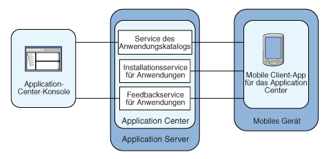

<!-- NLS_CHARSET=UTF-8 -->
## Übersicht
{: #overview }
Hier können Sie sich über das {{ site.data.keys.mf_app_center_full }} informieren und erfahren, wofür das Application Center bestimmt ist, welche verschiedenen
Komponenten und Features zum Application Center gehören und wie die Konsole und der Client verwendet werden. 

Der Umsatz mit mobilen Geräten übersteigt bereits den mit Personal Computern.
Für unternehmen werden mobile Anwendungen damit zu einem kritischen Faktor.   
Das Application Center ist ein Tool, das die gemeinsame Nutzung mobiler Anwendungen innerhalb einer Organisation
vereinfacht. 

Sie haben die Möglichkeit, das Application Center als Speicher
für Unternehmensanwendungen zu nutzen. Mit dem Application Center können Sie mobile Anwendungen für bestimmte Benutzergruppen
innerhalb des Unternehmens vorsehen. 

Ein Entwicklerteam kann das Application Center in der Entwicklungsphase einer Anwendung einsetzen, um Anwendungen mit
Testern, Designern oder Entscheidungsträgern im Unternehmen zu teilen. Bei dieser Art des Einsatzes erleichtert das Application Center
die Onlinezusammenarbeit aller am Entwicklungsprozess beteiligten Personen. 

> Sie können auch das Lernprogramm zum [Application Center](app-center-tutorial) durcharbeiten.

#### Fahren Sie mit folgenden Abschnitten fort: 
{: #jump-to }
* [Konzept des Application Center](#concept-of-application-center)
* [Voraussetzungen der Plattformen](#specific-platform-requirements)
* [Allgemeine Architektur](#general-architecture)
* [Vorläufige Informationen](#preliminary-information)
* [Weitere Schritte](#whats-next)

## Konzept des Application Center
{: #concept-of-application-center }
Das Application Center kann als Store für Unternehmensanwendungen verwendet werden
und bietet verschiedenen Teammitgliedern innerhalb eines Unternehmens die Möglichkeit, Informationen auszutauschen.

Das Konzept des Application Center ist mit dem Konzept
des öffentlichen App Store von Apple oder des Android Market vergleichbar. Das Application Center ist allerdings nur
für den privaten Gebrauch innerhalb eines Unternehmens bestimmt.

Über das Application Center, das als zentrales Repository für mobile Anwendungen dient,
laden Benutzer des Unternehmens oder der Organisation
Anwendungen auf Mobiltelefone oder Tablets herunter.

Das Application Center stellt mobile Anwendungen bereit, die auf dem Gerät selbst installiert werden. Diese Anwendungen können native Anwendungen sein,
die mit dem SDK des Geräts erstellt wurden, oder Hybridanwendungen mit nativen Inhalten und Webinhalten. Das Application Center
stellt keine mobilen Webanwendungen bereit. Solche Anwendungen werden wie eine Website über eine URL an den Web-Browser des mobilen Geräts gesendet.

In der aktuellen Version unterstützt das Application Center
Anwendungen, die für die Google-Android-Plattform, die Apple-iOS-Plattform, die Windows-Phone-8-Plattform und die
Windows-8-Plattform
erstellt wurden. 

Für Windows Phone wird zurzeit nur das Format von Windows-Phone-Anwendungspaketdateien
(.xap) unterstützt. Das App-Paketdateiformat bzw. universelle App-Format (.appx) wird nicht unterstützt. Für den Windows Store (Desktop-Anwendungen)
wird das App-Paketdateiformat (.appx) unterstützt. 

Windows Phone 7, Windows RT und BlackBerry OS werden von der aktuellen
Version des Application Center nicht unterstützt.

Das Application Center verwaltet mobile Anwendungen. Es unterstützt alle Arten
von Android-, iOS-, Windows-Phone-8- oder Windows-8-Anwendungen, einschließlich Anwendungen, die
mit der {{ site.data.keys.product }} erstellt wurden.

Sie können das Application Center im Rahmen des Entwicklungsprozesses für eine Anwendung nutzen. In einem typischen Szenario für die Verwendung des
Application Center erstellt ein Team eine mobile Anwendung (d. h. eine neue Version einer
Android-, iOS-, Windows-Phone- oder Windows-8-Anwendung). Das Entwicklerteam möchte, dass diese neue Version vom erweiterten Team überprüft und getestet wird. Ein
Entwickler lädt über die Application-Center-Konsole die neue Version der Anwendung in das Application Center hoch. Dabei kann der
Entwickler eine Beschreibung der Anwendungsversion eingeben. In der Beschreibung könnten beispielsweise Elemente erwähnt werden,
die das Entwicklerteam hinzugefügt hat, oder Elemente aus der Vorgängerversion, die korrigiert wurden. Die neue Version der Anwendung ist
dann für die anderen Teammitglieder verfügbar.

Eine andere Person, zum Beispiel ein Beta-Tester, kann das Application-Center-Installationsprogramm (d. h. den mobilen Client) starten, um diese
neue Version der mobilen Anwendung in der Liste der verfügbaren Anwendungen zu finden und auf seinem mobilen Gerät zu installieren. Nachdem der
Beta-Tester die neue Version getestet hat, kann er die Anwendung bewerten und Rückmeldungen geben. Die Rückmeldungen sind für den Entwickler
in der Application-Center-Konsole sichtbar. 

Das Application Center bietet die Möglichkeit, mobile Anwendungen innerhalb eines Unternehmens oder einer Gruppe komfortabel gemeinsam zu nutzen und Informationen
unter Teammitgliedern auszutauschen.

## Voraussetzungen der Plattformen
{: #specific-platform-requirements }
Unter den verschiedenen Betriebssystemen gelten spezifische Anforderungen an die Implementierung, Installation oder Verwendung von Anwendungen
auf den entsprechenden mobilen Geräten. 

### Android
{: #android }
Das mobile Gerät muss für die Installation von unbekannten Quellen konfiguriert sein. Den entsprechenden Schalter finden Sie
in den Android-Einstellungen.
Einzelheiten sind im Artikel [User Opt-in for apps from unknown sources](http://developer.android.com/distribute/open.html#unknown-sources) beschrieben.  

Im Application Center haben Anwendungen eine
interne und eine kommerzielle Versionsnummer. Anhand der internen Versionsnummer wird die Aktualität der Versionen unterschieden. Die kommerzielle Versionsnummer wird nur als
Anzeigezeichenfolge zur Information verwendet. Bei Android-Anwendungen ist die interne Version
der [versionCode](http://developer.android.com/guide/topics/manifest/manifest-element.html#vcode) aus dem Anwendungsmanifest. Es muss sich um eine
ganze Zahl handeln. 

### iOS
{: #ios }
Alle über das Application Center verwalteten Anwendungen müssen für die
"Ad-Hoc-Distribution" gepackt sein.
Wenn Sie über einen iOS-Entwickleraccount verfügen, können Sie Ihre Anwendung für
bis zu 100 iOS-Geräte freigeben. Mit einem iOS-Unternehmensaccount können Sie Ihre hausinterne Anwendung für eine unbegrenzte Anzahl
von iOS-Geräten freigeben.
Einzelheiten finden Sie in den Artikeln [iOS Developer Program](https://developer.apple.com/programs/ios/distribute.html)
und [iOS Enterprise Program](https://developer.apple.com/programs/ios/enterprise/).Im Application Center haben Anwendungen eine
interne und eine kommerzielle Versionsnummer. Anhand der internen Versionsnummer wird die Aktualität der Versionen unterschieden. Die kommerzielle Versionsnummer wird nur als
Anzeigezeichenfolge zur Information verwendet. Bei iOS-Anwendungen ist die interne Version die CFBundleVersion
aus dem Anwendungsmanifest **Info.plist**. Die Versionsnummer muss das Format
`a` oder `a.b` oder `a.b.c` haben. Hier stehen
`a`, `b` und `c` für nicht negative ganze Zahlen. Außerdem muss
`a` ungleich `0` sein.

### Windows Phone 8
{: #windows-phone-8 }
Anwendungen werden nicht vom Windows Store, sondern vom Application Center installiert.
Das Application Center übernimmt damit eine Funktion, die in der Microsoft-Dokumentation
als **Unternehmens-Hub** bezeichnet wird. Einzelheiten enthält der Artikel
[Company app distribution for Windows Phone](http://msdn.microsoft.com/en-us/library/windowsphone/develop/jj206943%28v=vs.105%29.aspx).
Für die Verwendung eines Unternehmens-Hubs
erfordert Windows Phone,
dass Sie ein Unternehmenskonto bei Microsoft registrieren und alle Anwendungen, auch den
Application-Center-Client, mit dem Unternehmenszertifikat signieren.
Im Application Center können nur signierte Anwendungen verwaltet werden.

Sie müssen alle mobilen Geräte mit einem Anwendungsregistrierungstoken, das
Ihrem Unternehmenskonto zugeordnet ist, registrieren.

Das Application Center vereinfacht die Verteilung des Anwendungsregistrierungstokens und unterstützt Sie so
bei der Registrierung von Geräten. Einzelheiten finden Sie unter
[Token für Anwendungsregistrierung in Windows 8 Universal](appcenter-console/#application-enrollment-tokens-in-windows-8-universal).

Das
Application Center unterstützt die Verteilung von Anwendungen in Form von Windows-Phone-Anwendungspaketdateien (.xap) für
Microsoft Windows Phone 8.0 und Microsoft Windows Phone 8.1. In Microsoft Windows Phone 8.1
hat Microsoft ein neues universelles Format für Anwendungspaketdateien (.appx) eingeführt.
Das
Application Center unterstützt zurzeit nicht die Verteilung von Anwendungspaketdateien (.appx) für Microsoft Windows Phone 8.1. Es ist auf
Windows-Phone-Anwendungspaketdateien (.xap) beschränkt. 

Im
Application Center haben
Anwendungen nur eine Versionsnummer zur Unterscheidung der Aktualität von Versionen. Bei Windows-Phone-8-Anwendungen befindet sich
die Versionsnummer im Feld **Version** der Datei **WMAppManifest.xml**.
Diese Versionsnummer muss das Format `a.b.c.d` haben. Hier stehen
`a`, `b`, `c` und `d` für nicht negative ganze Zahlen. 

### Windows 8
{: #windows-8 }
Der mobile Application-Center-Client wird als normale ausführbare Desktopdatei
(.exe) bereitgestellt. Verwenden Sie den Client, um auf dem Gerät als .appx-Dateien gepackte Windows-Store-Anwendungen
zu installieren. Die Installation einer Datei vom Typ
appx auf Ihrem Gerät ohne Verwendung des Windows Store wird als das Querladen einer App
bezeichnet. Für das Querladen einer App müssen Sie die
in [Prepare to Sideload Apps](http://technet.microsoft.com/fr-fr/library/dn613842.aspx) beschriebenen Voraussetzungen erfüllen. Mit dem Update auf Windows 8.1 gelten
weniger strenge Vorbedingungen für das
Querladen. Weitere Informationen finden Sie unter
[Sideloading Store Apps to Windows 8.1 Devices](http://blogs.msdn.com/b/micham/archive/2014/05/30/sideloading-store-apps-to-windows-8-1-devices.aspx).

Dateien vom Typ
.exe können auf
ARM-basierten Tablets nicht ausgeführt werden. Das Application Center
unterstützt daher nur Windows 8 und Windows 8.1, aber nicht Windows RT.

Zum Ausführen des Appliction-Center-Clients benötigt
der Gerätebenutzer die Administratorberechtigung für das Gerät. 

Das Application
Center gibt keinen Weg für die Verteilung des mobilen Clients vor.

Im
Application Center haben
Anwendungen nur eine Versionsnummer zur Unterscheidung der Aktualität von Versionen. Bei Windows-8-Anwendungen befindet sich
die Versionsnummer im Feld
"Version" der Datei AppxManifest.xml.
Diese Versionsnummer muss das Format a.b.c.d haben. Hier stehen
a, b, c und d für nicht negative ganze Zahlen. 

## Allgemeine Architektur
{: #general-architecture }
Das Application Center setzt sich aus folgenden Hauptelementen zusammen:
einer serverseitigen Komponente, einem Repository, einer Administrationskonsole und einer mobilen Clientanwendung.

### Serverseitige Komponente
{: #server-side-component }
Die serverseitige Komponente ist eine Java™-Unternehmensanwendung, die
in einem Webanwendungsserver wie IBM WebSphere oder Apache Tomcat implementiert sein muss. 

Die serverseitige Komponente
umfasst eine Administrationskonsole und eine mobile Anwendung. Mithilfe dieser mobilen Anwendung werden die verfügbaren mobilen Anwendungen in der clientseitigen Komponente installiert.

Die Webkonsole
und das Installationsprogramm kommunizieren über REST-Services mit der Serverkomponente.

Zur serverseitigen Komponente des Application Center
gehören diverse Services, z. B. ein Service, der die verfügbaren Anwendungen auflistet, ein Service, der die binären Anwendungsdateien für die mobilen
Geräte bereitstellt, oder ein Service, der Rückmeldungen und Bewertungen registriert.

### Repository
{: #repository }
Das Repository ist eine Datenbank, in der Informationen gespeichert werden, z. B. dazu, welche Anwendungen auf welchen Geräten
installiert sind, Rückmeldungen zu Anwendungen und die Binärdateien mobiler Anwendungen. Das Application Center
ist mit der Datenbank verknüpft, wenn Sie das Application Center für einen bestimmten Webanwendungsserver und eine unterstützte Datenbank konfigurieren.

### Administrationskonsole
{: #administration-console }
Die Administrationskonsole ist eine Webkonsole, in der Administratoren Anwendungen, Benutzerzugriffsrechte für die Installation von Anwendungen, Benutzerrückmeldungen
zu mobilen Anwendungen und Details zu Anwendungen, die auf Geräten installiert sind, verwalten können (siehe [Application-Center-Konsole](appcenter-console)). 

### Mobile Clientanwendung
{: #mobile-client-application }
Mit dem mobilen Client können Sie Anwendungen auf einem mobilen Gerät installieren und Rückmeldungen zu einer Anwendung an den Server
senden (siehe [Mobiler Client](mobile-client)). 

Die folgende Abbildung gibt einen Überblick über die
Architektur.



Von
der Application-Center-Konsole aus können Sie folgende Aufgaben ausführen:

* Andere Versionen mobiler Anwendungen hochladen
* Nicht erwünschte Anwendungen entfernen
* Zugriff auf Anwendugnen steuerun: Jede Anwendung
ist mit der Liste der Personen verknüpft, die die Anwendung installieren können.
* Rückmeldungen anzeigen, die Benutzer mobiler Geräte zu einer Anwendung gesendet haben
* Informationen zu den auf einem Gerät installierten Anwendungen abrufen
* Eine Anwendung inaktivieren, sodass sie nicht in der Liste der zum Download verfügbaren Anwendungen sichtbar ist

Vom
mobilen Client aus können Sie folgende Aufgaben ausführen:

* Verfügbare mobile Anwendungen auflisten
* Eine neue Anwendung auf einem Gerät installieren
* Rückmeldungen zu einer Anwendung senden

Das Application Center unterstützt
Anwendungen für Android-, iOS-,
Windows-Phone-8- und Windows-8-Geräte. Deswegen wird
der mobile Client in separaten Versionen für Android, iOS, Windows Phone 8 und Windows 8 geliefert. 

Die Android-, iOS- und Windows-Phone-8-Version des
mobilen Clients setzt auf der
{{ site.data.keys.product }} auf. Unter [Application Center-Server
nach der Installation konfigurieren](../installation-configuration/production/appcenter) erfahren Sie,
wie die serverseitige Application-Center-Komponente nach Installation des Produkts
in verschiedenen Java-Anwendungsservern konfiguriert wird
und wie
{{ site.data.keys.product_adj }}-Anwendungen für den Application-Center-Client erstellt werden. 

## Vorläufige Informationen
{: #preliminary-information }
Für die Verwendung des Application Center müssen Sie Sicherheitseinstellungen konfigurieren,
den Webanwendungsserver, auf dem die {{ site.data.keys.product }}
installiert ist,
und die Application-Center-Konsole starten und sich anmelden.

Wenn Sie die {{ site.data.keys.product }}
installieren, wird
das Application Center automatisch im angegebenen Anwendungsserver installiert.

Wenn Sie
das Application Center in  WebSphere Application Server Liberty Profile installieren, wird der Server im Verzeichnis **Installationsverzeichnis/server** erstellt.

Nach
Abschluss der Installation müssen Sie die Sicherheitseinstellungen für die Anwendungen konfigurieren. Lesen Sie dazu
den Artikel [Benutzerauthentifizierung für das
Application Center konfigurieren](../installation-configuration/production/appcenter#configuring-user-authentication-for-application-center) oder, wenn Sie die
LDAP-Authentifizierung verwenden, den Artikel [Benutzer mit LDAP verwalten](../installation-configuration/production/appcenter/#managing-users-with-ldap).

### Beispiel: Server und Application-Center-Konsole in Liberty Profile starten
{: #example-starting-the-server-and-the-application-center-console-on-liberty-profile}

1. Starten Sie den Liberty-Server mit dem Befehl **server** im Verzeichnis **Installationsverzeichnis/server/wlp/bin**. 

   ```bash
   server start worklightServer
   ```
    
2. Wenn der Server aktiv ist, starten Sie die Application-Center-Konsole, indem Sie in Ihrem Browser folgende Adresse eingeben: `http://localhost:9080/appcenterconsole/`.
3. Melden Sie sich an. Für die Installation des
Application Center
in Apache Tomcat oder WebSphere Application Server Liberty Profile sind standardmäßig zwei Benutzer definiert:
    * **demo** mit dem Kennwort **demo**
    * **appcenteradmin** mit dem Kennwort **admin**

### Weitere Informationen
{: #for-more-information }
Informationen zur Verwendung der Application-Center-Konsole finden Sie unter
[Application-Center-Konsole](appcenter-console).

Informationen zur Installation und Ausführung des mobilen Clients unter den verschiedenen Betriebssystemen finden Sie unter: 

* Android: Weitere Informationen finden Sie unter [Client auf einem mobilen Android-Gerät installieren](mobile-client/#installing-an-application-on-an-android-device).
* iOS: Weitere Informationen finden Sie unter [Client auf einem mobilen iOS-Gerät installieren](mobile-client/#installing-an-application-on-an-ios-device).
* Windows Phone 8: Weitere Informationen finden Sie unter
[Client unter Windows 8 Universal installieren](mobile-client/#installing-the-client-on-a-windows-phone-8-universal-mobile-device).
* Windows 8: Der mobile Client für
Windows 8 wird nicht im Application Center implementiert und nicht über das Application Center verteilt (siehe [Microsoft Windows 8: Projektbuild erstellen](preparations/#microsoft-windows-8-building-the-project)). 

## Weitere Schritte
{: #whats-next }
Informieren Sie sich anhand der folgenden Abschnitte über die Verwendung des mobilen Application-Center-Clients.
Erfahren Sie, wie die Application-Center-Konsole,
das Befehlszeilentool und der mobile Client verwendet werden und wie Protokollstufen festgelegt werden. 


