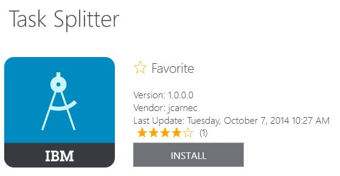

<!-- NLS_CHARSET=UTF-8 -->
## Übersicht
{: #overview }
Mit dem mobilen
Application-Center-Client können Sie Anwendungen auf Ihrem mobilen Gerät installieren.

Der mobile Application-Center-Client ist die Anwendung, die auf Ihrem
Android-, iOS-, Windows-Phone- oder Windows-Gerät ausgeführt wird. Von der aktullen Version des
Application Center wird nur Windows Phone 8 unterstützt. Mit dem
mobilen Client können Sie den Katalog verfügbarer Anwendungen im Application Center auflisten. Sie können diese Anwendungen auf Ihrem
Gerät installieren. Manchmal wird der mobile Client auch als Application-Center-Installationsprogramm bezeichnet. Diese Anwendung
muss auf Ihrem Gerät vorhanden sein, wenn Sie auf Ihrem Gerät Anwendungen aus Ihrem privaten Anwendungsrepository installieren wollen.

### Voraussetzungen
{: #prerequisites }
Ihr Systemadministrator muss Ihnen einen Benutzernamen und ein Kennwort geben,
damit Sie den mobilen Client herunterladen und installieren können. Sie benötigen den Benutzernamen und
das Kennwort immer, wenn Sie den mobilen Client auf Ihrem Gerät starten. Für Windows-Store-Anwendungen
benötigen Sie den Benutzernamen und das Kennwort für den mobilen Client nur in der Laufzeit. Geben Sie diese Berechtigungsnachweise aus Sicherheitsgründen nicht
weiter. Diese Berechtigungsnachweise werden auch für die Anmeldung bei der Application-Center-Konsole
verwendet.

#### Fahren Sie mit folgenden Abschnitten fort: 
{: #jump-to }
* [Client auf einem mobilen Android-Gerät installieren](#installing-the-client-on-an-android-mobile-device)
* [Client auf einem mobilen iOS-Gerät installieren](#installing-the-client-on-an-ios-mobile-device)
* [Client auf einem mobilen Gerät mit Windows Phone 8 Universal installieren](#installing-the-client-on-a-windows-phone-8-universal-mobile-device)
* [Windows-10-UWP-Client auf einem Windows-10-Gerät installieren](#installing-windows-10-uwp-client-on-windows-10-device)
* [Windows-10-UWP-Anwendung installieren und Kommentare hinzufügen](#installing-a-windows-10-uwp-application-and-adding-review-comments)
* [Anmeldeansicht](#the-login-view)
* [Ansichten im Application-Center-Client](#views-in-the-application-center-client)
* [Anwendung auf einem Android-Gerät installieren](#installing-an-application-on-an-android-device)
* [Anwendung auf einem iOS-Gerät installieren](#installing-an-application-on-an-ios-device)
* [Anwendung auf einem Windows-Phone-Gerät
installieren](#installing-an-application-on-a-windows-phone-device)
* [Windows-Store-Anwendung auf einem
Windows-Gerät installieren](#installing-a-windows-store-application-on-a-windows-device)
* [Anwendungen aus öffentlichen App Stores installieren](#installing-applications-through-public-app-stores)
* [Installierte Anwendung entfernen](#removing-an-installed-application)
* [Details einer bestimmten Anwendungsversion anzeigen](#showing-details-of-a-specific-application-version)
* [Anwendung aktualisieren](#updating-an-application)
* [Automatisches Upgrade für den Application-Center-Client](#upgrading-the-application-center-client-automatically)
* [Installierte Anwendung zurücksetzen](#reverting-an-installed-application)
* [App-Favorit festlegen oder löschen](#marking-or-unmarking-a-favorite-app)
* [Rezension zu einer installierten Anwendung abschicken](#submitting-a-review-for-an-installed-application)
* [Rezensionen anzeigen](#viewing-reviews)

## Client auf einem mobilen Android-Gerät installieren
{: #installing-the-client-on-an-android-mobile-device }
Sie können den mobilen Client oder eine signierte Anwendung, die mit der Installationsmarkierung versehen ist,
auf Ihrem mobilen Android-Gerät installieren, indem Sie die Zugriffs-URL in Ihrem Browser eingeben, Ihre Berechtigungsnachweise eingeben und die erforderlichen Schritte ausführen.

1. Starten Sie den Browser auf Ihrem mobilen Gerät.
2. Geben Sie die folgende Zugriffs-URL im Adresstextfeld ein: `http://Hostname:Portnummer/applicationcenter/installers.html`.

    Hier steht "Hostname" für die Adresse des Servers und "Portnummer" für die Nummer des Ports der Application-Center-Installation. Ihr Systemadministrator kann diese Informationen bereitstellen.

    Es gibt auch eine alternative Application-Center-URL für die Installation des Clients auf einem mobilen Gerät:
`http://Hostname:Portnumber/applicationcenter/inst.html`. Die Seite mit dieser URL funktioniert besser bei einigen älteren Web-Browsern und solchen Web-Browsern, die keine
Standardbrowser für mobile Geräte sind. Falls die Seite installers.html auf Ihrem mobilen Gerät nicht funktioniert, können Sie
inst.html verwenden. Diese Seite wird nur auf Englisch bereitgestellt. Sie ist nicht in andere Sprachen übersetzt.

    Wenn Sie versuchen, die Seite mit HTTPS zu öffnen,
und selbst signierte Zertifikate verwenden, können ältere Android-Browser die Seite nicht öffnen. In diesem Fall müssen Sie ein nicht selbst signiertes
Zertifikat oder einen anderen Browser auf dem Android-Gerät verwenden, z. B. Firefox, Chrome oder Opera. Ab Android 4
zeigt der Android-Browser eine Sicherheitswarnung zum SSL-Zertifikat an.
Nachdem Sie einer nicht sicheren Verbindung zugestimmt haben, ruft der Browser die Website auf. 

3. Geben Sie Ihren Benutzernamen und Ihr Kennwort ein. Nach der Validierung Ihres Benutzernamens und Ihres Kennworts wird im Browser die Liste kompatibler Installationsprogramme für Ihr Gerät angezeigt. Normalerweise erscheint in dieser Liste nur eine Anwendung (der mobile Client).

4. Wenn der Web-Server ein selbst signiertes Zertifikat einer Zertifizierungsstelle verwendet, installieren Sie das Zertifikat mindestens einmal auf dem Gerät. Der Application-Center-Administrator sollte das Zertifikat bereitstellen.
Details finden Sie unter [Selbst
signierte Zertifikate einer Zertifizierungsstelle in einer Application-Center-Testumgebung verwalten und installieren](../../installation-configuration/production/appcenter/#managing-and-installing-self-signed-ca-certificates-in-an-application-center-test-environment). 
    * Tippen Sie auf das Register **SSL-Zertifikate** und wählen Sie das Zertifikat
aus. 
    * Tippen Sie auf **Installieren**. Diese Aktion muss pro Gerät nur einmal ausgeführt werden. Auf dem Gerät können Sie
unter **Einstellungen → Sicherheit → Vertrauenswürd. Berechtigungen** überprüfen, ob das Zertifikat auf dem Gerät installiert ist. In der Ansicht sehen Sie die
SSL-Zertifikate, die der Benutzer auf dem Gerät installiert hat. Wenn das selbst signierte Zertifikat einer Zertifizierungsstelle nicht auf dem Gerät installiert ist, hindert das Betriebssystem Android Sie daran, in den folgenden Schritten den mobilen Client herunterzuladen.

    Bevor Sie den mobilen Client in der Liste der verfügbaren Anwendungen sehen können, muss der Application-Center-Administrator die mobile Clientanwendung installieren. Der Administrator lädt den mobilen Client in das Application Center hoch und setzt die Eigenschaft **Installer** auf **true** (siehe [Anwendungseigenschaften](../appcenter-console/#application-properties)).

    

5. Wählen Sie einen Listeneintrag aus, um die Anwendungsdetails anzuzeigen.Zu diesen Details gehören üblicherweise der Anwendungsname und die Nummer der Anwendungsversion.

    

6. Tippen Sie auf **Install Now**, um den mobilen Client herunterzuladen. Auf neueren Android-Geräten können Sie gefragt werden, ob
Chrome berechtigt ist, auf Mediendateien des Geräts zuzugreifen. Wählen Sie JA aus.
Möglicherweise erscheint eine Warnung zu potenziell gefährlichen Dateien. Geben Sie an, dass Sie die APK-Datei in jedem Fall behalten möchten. 

7. Starten Sie den **Android-Download**.
8. Wählen Sie das Application-Center-Clientinstallationsprogramm aus. Sie können die der Anwendung erteilten Zugriffsrechte sehen, wenn Sie die Anwendung zur Installation auswählen.

    

9. Wählen Sie **Installieren** aus, um den mobilen Client zu installieren.
10. Wenn die Anwendung installiert ist, wählen Sie **Öffnen** aus, um den mobilen Client zu öffnen, oder **Fertig**, um die Anwendung "Downloads" zu schließen.

Der Download der APK-Datei könnte aus folgenden Gründen fehlschlagen. 

* Der Hauptspeicher des Gerätes reicht nicht aus. 
* Das SSL-Zertifikat des Servers ist auf dem Gerät unbekannt. 

Wenn Sie zum ersten Mal über die Anwendung "Downloads" eine App installieren, können Sie gefragt werden, ob
Google die Geräteaktivitäten regelmäßig auf Sicherheitsprobleme überprüfen soll. Sie können dieser Überprüfung zustimmen oder sie ablehnen. Auf den Application-Center-Client hat Ihre Entscheidung keinen Einfluss. 

Die Installation könnte aus folgenden Gründen blockiert werden: 

* Das Gerät erlaubt keine Installation von unbekannten Quellen.
Wählen Sie auf dem Gerät **Einstellungen → Sicherheit** aus, und aktivieren Sie
**Unbekannte Quellen (Installation von Anwendungen aus unbekannten Quellen zulassen)**.
* Auf dem Gerät ist die Anwendung bereits installiert. Sie wurde jedoch mit einem anderen Zertifikat signiert. In dem Fall müssen Sie die App entfernen, bevor Sie sie mit einem anderen Zertifikat signiert auf dem Gerät
installieren. 

## Client auf einem mobilen iOS-Gerät installieren
{: #installing-the-client-on-an-ios-mobile-device }
Sie können den mobilen Client oder eine signierte Anwendung, die mit der Installationsmarkierung versehen ist,
auf Ihrem mobilen iOS-Gerät installieren, indem Sie die Zugriffs-URL in Ihrem Browser eingeben, Ihre Berechtigungsnachweise eingeben und die erforderlichen Schritte ausführen.

> **Wichtiger Hinweis:** Bevor Sie Anwendungen auf iOS-Geräten installieren, müssen Sie den Application-Center-Server mit SSL konfigurieren (siehe [Secure Sockets Layer (SSL) konfigurieren](../../installation-configuration/production/appcenter/#configuring-secure-sockets-layer-ssl)).

Die JNDI-Eigenschaft **ibm.appcenter.ios.plist.onetimeurl** der
IBM Application-Center-Services steuert, ob bei Installation des mobilen Clients auf einem mobilen iOS-Gerät Einmal-URLs verwendet werden. Setzen Sie diese Eigenschaft auf "false", um die maximale Sicherheit zu gewährleisten. Wenn Sie diese Eigenschaft auf "false" setzen, müssen Benutzer ihre Berechtigungsnachweise bei Installation des mobilen Clients mehrfach angeben,
einmal bei Auswahl des Clients und einmal bei Installation des Clients.

Wenn Sie die Eigenschaft auf "true" setzen, geben Benutzer ihre Berechtigungsnachweise nur einmal ein. Eine temporäre
Download-URL mit einem kryptografischen Hashwert wird generiert, wenn der Benutzer die Berechtigungsnachweise eingibt.
Diese temporäre Download-URL ist für eine Stunde gültig und erfordert
keine weitere Authentifizierung. Bei dieser Kompromisslösung sind Sicherheit und Ergonomie gleichermaßen berücksichtigt.

Die Schritte für die Angabe
der JNDI-Eigenschaft **ibm.appcenter.ios.plist.onetimeurl** sind mit den Schritten für die Eigenschaft **ibm.appcenter.proxy.host** vergleichbar.
Lesen Sie hierzu
den Artikel [Endpunkt der Anwendungsressourcen
definieren](../../installation-configuration/production/appcenter/#defining-the-endpoint-of-the-application-resources).

Die Installation des mobilen Clients auf einem iOS-Gerät erfolgt ganz ähnlich wie die Installation unter Android. Einige Unterschiede gibt es jedoch. Das Installationsprogramm wird nach dem Download automatisch direkt gestartet. Ihr Benutzername und Ihr Kennwort sind für fast alle Installationsschritte erforderlich.

1. Starten Sie den Browser auf Ihrem mobilen Gerät.
2. Geben Sie die folgende Zugriffs-URL im Adressfeld ein: `http://Hostname:Portnummer/applicationcenter/installers.html`.

    Hier steht "Hostname" für die Adresse des Servers und "Portnummer" für die Nummer des Ports der Application-Center-Installation. Ihr Systemadministrator kann diese Informationen bereitstellen.

    Es gibt auch eine alternative Application-Center-URL für die Installation des Clients auf einem mobilen Gerät:
`http://Hostname:Portnumber/applicationcenter/inst.html`. Die Seite mit dieser URL funktioniert besser bei einigen älteren Web-Browsern und solchen Web-Browsern, die keine
Standardbrowser für mobile Geräte sind. Falls die Seite **installers.html** auf Ihrem mobilen Gerät nicht funktioniert, können Sie
**inst.html** verwenden. Die Seite wird nur auf Englisch bereitgestellt. Sie ist nicht in andere Sprachen übersetzt.

    Wenn Sie die Seite mit HTTPS öffnen und selbst signierte Zertifikate verwenden, zeigt der Browser eine Sicherheitswarnung zum SSL-Zertifikat an.
Nachdem Sie einer nicht sicheren Verbindung zugestimmt haben, ruft der Browser die Website auf. 

3. Geben Sie Ihren Benutzernamen und Ihr Kennwort ein. Lesen Sie sich die Voraussetzungen unter [Mobiler Client](../preparations) durch.

    Nach der Validierung Ihres Benutzernamens und Ihres Kennworts wird im Browser die Liste kompatibler Installationsprogramme für Ihr Gerät angezeigt. Normalerweise erscheint in dieser Liste nur eine Anwendung (der mobile Client).

    Wenn Sie die
Seite mit https öffnen:
    * Wenn der Web-Server ein echtes SSL-Zertifikat von einer anerkannten Zertifizierungsstelle verwendet, fahren Sie mit Schritt
5 fort.
    * Wenn der Web-Server ein selbst signiertes Zertifikat einer Zertifizierungsstelle verwendet, fahren Sie mit Schritt
4 fort.

4. Wenn der Web-Server ein selbst signiertes Zertifikat einer Zertifizierungsstelle verwendet, installieren Sie das Zertifikat mindestens einmal auf dem Gerät. 

    Der Application-Center-Administrator stellt das Zertifikat bereit.
Details finden Sie unter [Selbst
signierte Zertifikate einer Zertifizierungsstelle in einer Application-Center-Testumgebung verwalten und installieren](../../installation-configuration/production/appcenter/#managing-and-installing-self-signed-ca-certificates-in-an-application-center-test-environment). 

    * Tippen Sie auf das Register "SSL-Zertifikate" und wählen Sie das Zertifikat aus.
    * Tippen Sie auf "Installieren". Pro Gerät muss dieser Schritt nur einmal ausgeführt werden. Auf dem Gerät können Sie unter
**Einstellungen → Allgemein → Profile** überprüfen, ob das Zertifikat auf dem Gerät installiert ist. In der Ansicht sehen Sie die
SSL-Zertifikate, die der Benutzer auf dem Gerät installiert hat. Wenn das selbst signierte Zertifikat einer Zertifizierungsstelle nicht auf dem Gerät installiert ist, hindert das Betriebssystem iOS Sie daran,
in den folgenden Schritten den mobilen Client herunterzuladen.

    Bevor Sie den mobilen Client in der Liste der verfügbaren Anwendungen sehen können, muss der Application-Center-Administrator die mobile Clientanwendung installieren. Der Administrator lädt den mobilen Client in das Application Center hoch und setzt die Eigenschaft **Installer** auf **true** (siehe [Anwendungseigenschaften](../appcenter-console/#application-properties)).

5. Tippen Sie auf das Register **Installationsprogramme** und wählen Sie einen Listeneintrag aus, um die Anwendungsdetails anzuzeigen.
6. Tippen Sie auf **Installieren**, um den mobilen Client herunterzuladen. 
7. Geben Sie Ihre Berechtigungsnachweise ein, um die Downloader-Transaktion zu autorisieren.
8. Tippen Sie zum Autorisieren des Downloads auf **Install**.

    

9. Geben Sie Ihre Berechtigungsnachweise ein, um die Installation zu autorisieren.
10. Schließen Sie den Browser. 

    In der Hauptanzeige, wo Sie den Download-Fortschritt verfolgen können, erscheint das App-Symbol. 

> **Hinweis:** Für die Installation einer Anwendung auf einem Gerät wird eine Bereitstellungsdatei benötigt. Wenn Sie versehentlich eine Anwendung installieren möchten, die für Ihr Gerät nicht gültig ist,
kann es bei einigen iOS-Versionen
geschehen, dass in einer Endlosschleife versucht wird, die Anwendung zu installieren. Während der Endlosschleife wird kein
Fehler angezeigt. Aufgrund der Endlosschleife ist es schwierig, das in der Hauptanzeige erscheinende Anwendungssymbol mit dem Fortschritt der Installation
zu löschen und damit gleichzeitig die Endlosschleife zu stoppen. Eine Ausweichlösung besteht darin, das Gerät in den Flugzeugmodus zu versetzen. In diesem Modus wird die
Endlosschleife gestoppt, sodass Sie die normalen Schritte für das Löschen von Apps auf
iOS-Geräten ausführen können.Die Installation könnte aus folgenden Gründen blockiert werden: 

* Das Bereitstellungsprofil der Anwendung ist für das Gerät nicht gültig. Die Anwendung muss mit einem anderen Bereitstellungsprofil signiert
werden. 
* Das Gerät hat keinen Zugriff auf Apple-Server, um die Gültigkeit des Bereitstellungsprofils zu bestätigen. 
* Das SSL-Zertifikat des Servers ist auf dem Gerät unbekannt. 

Generell können iOS-Anwendungen nur auf dem Gerät installiert werden, wenn sie mit einem Bereitstellungsprofil signiert sind
(siehe [Projekt importieren und erstellen (Android, iOS, Windows Phone)](../preparations/#importing-and-building-the-project-android-ios-windows-phone)).

Wenn unter iOS ab Version 9 eine Unternehmensanwendung geöffnet wird, kann abhängig vom Bereitstellungsprofil die Nachricht Untrusted Enterprise Developer angezeigt werden, um anzugeben, dass das Bereitstellungsprofil auf diesem Gerät noch nicht anerkannt wird. Die Anwendung wird in dem Fall erst geöffnet, wenn dieses Bereitstellungsprofil anerkannt ist. Die Anerkennung ist pro Bereitstellungsprofil einmal erforderlich. 

Gehen Sie für die Anerkennung eines Bereitstellungsprofils nach Installation der Anwendung wie folgt vor: 

#### iOS bis Version 9.1
{: #until-ios-91 }
1. Navigieren Sie zu **Einstellungen → Allgemein → Profile**. Unter der Überschrift
**Unternehmens-Apps** sehen Sie das Bereitstellungsprofil für die App. 
2. Tippen Sie auf das Profil und bestätigen Sie dessen Anerkennung. 

#### iOS ab Version 9.2
{: #since-ios-92 }
1. Navigieren Sie zu **Einstellungen → Allgemein → Profile → Gerätemanagement** oder **Profile &amp; Gereätemanagement**. Unter der Überschrift
**Unternehmens-Apps** sehen Sie das Bereitstellungsprofil für die App. 
2. Tippen Sie auf das Profil und bestätigen Sie dessen Anerkennung. 

Nach Bestätigung der Anerkennung wird für keine Anwendung, die dieses Bereitstellungsprofil verwendet, die Nachricht Untrusted Enterprise Developer angezeigt. Weitere Informatinen finden Sie auf der
Apple-Website unter [https://support.apple.com/en-us/HT204460](https://support.apple.com/en-us/HT204460).

## Client auf einem mobilen Gerät mit Windows Phone 8 Universal installieren
{: #installing-the-client-on-a-windows-phone-8-universal-mobile-device }
Sie können den mobilen Client oder eine signierte Anwendung, die mit der Installationsmarkierung versehen ist,
unter Windows 8 Universal installieren, indem Sie die Zugriffs-URL in Ihrem Browser eingeben, Ihre Berechtigungsnachweise eingeben
und die erforderlichen Schritte ausführen. Das Unternehmenskonto muss bereits auf Ihrem mobilen Gerät installiert sein.

Sie können erst von Ihrem Unternehmen veröffentlichte Apps installieren, nachdem Sie das Unternehmenskonto zu Ihrem mobilen Gerät
hinzugefügt haben. Sie müssen ein Anwendungsregistrierungstoken
auf Ihr Windows-Phone-Gerät herunterladen. Dieses Token muss bereits im
{{ site.data.keys.mf_server }} vorhanden sein.
Es wird über die Application-Center-Konsole auf den {{ site.data.keys.mf_server }}
hochgeladen. Einzelheiten finden Sie unter
[Token für Anwendungsregistrierung in
Windows 8 Universal](../appcenter-console/#application-enrollment-tokens-in-windows-8-universal). 

1. Starten Sie den Browser auf Ihrem mobilen Gerät.
2. Geben Sie die folgende Zugriffs-URL im Adresstextfeld ein: `http://Hostname:Portnummer/applicationcenter/installers.html`.

    Hier steht **Hostname** für die Adresse des Servers und **Portnummer** für die Nummer des Ports der Application-Center-Installation. Ihr Systemadministrator kann diese Informationen bereitstellen.

    Es gibt auch eine alternative Application-Center-URL für die Installation des Clients auf einem mobilen Gerät:
`http://Hostname:Portnumber/applicationcenter/inst.html`. Die Seite mit dieser URL funktioniert besser bei einigen älteren Web-Browsern und solchen Web-Browsern, die keine
Standardbrowser für mobile Geräte sind. Falls die Seite **installers.html** auf Ihrem mobilen Gerät nicht funktioniert, können Sie
**inst.html** verwenden. Diese Seite wird nur auf Englisch bereitgestellt. Sie ist nicht in andere Sprachen übersetzt.

3. Geben Sie Ihre Berechtigungsnachweise ein, um den Zugriff auf den Server zu autorisieren.Im unteren Teil der Anzeige gibt es eine Symbolleiste mit den Registern **Installationsprogramme** und
**Token**.

    

4. Tippen Sie auf **Token** und wählen Sie in der Liste der verfügbaren Token ein Anwendungsregistrierungstoken
aus, um die Tokendetails anzuzeigen.

    

5. Tippen Sie auf **Hinzufügen**, um das Anwendungsregistrierungstoken herunterzuladen.
6. Tippen Sie auf **Hinzufügen**, um das Unternehmenskonto hinzuzufügen.

    

    Windows Phone 8
gibt keine Rückmeldung zum Hinzufügen des Unternehmenskontos.

7. Tippen Sie auf das Symbol "Zurück", um zu den Details der Anwendungsregistrierungstoken zurückzukehren.
8. Tippen Sie auf **Installationsprogramme** und wählen Sie in der Liste der verfügbaren Anwendungen die mobile Clientanwendung aus.Die Anwendungsdetails werden angezeigt.
9. Tippen Sie auf **Installieren**, um die ausgewählte Anwendung herunterzuladen.

    

10. Tippen Sie auf **Installieren**, um die Anwendung zu installieren.

    

    Windows 8 Universal
gibt keine Rückmeldung zur Installation der Anwendung.

> **Tipp:** Wenn Sie eine Unternehmensanwendung auf einem Gerät installieren, muss das Gerät eine Verbindung zum
Microsoft-Server herstellen, damit die Anwendungssignatur verifiziert werden kann. Manchmal reagiert der
Microsoft-Server nicht. Versuchen Sie in dem Fall, die Installation ein paar Minuten später erneut auszuführen. Unter "Anwendung auf einem Windows-Phone-Gerät installieren" finden Sie mögliche
Fehlernachrichten.
Nach Abschluss der Installation sollte die mobile Clientanwendung unter
Windows Phone in Ihrer Anwendungsliste verfügbar sein.

## Windows-10-UWP-Client auf einem Windows-10-Gerät installieren
{: #installing-windows-10-uwp-client-on-windows-10-device }

Sie können den mobilen Client oder eine signierte Anwendung, die mit der Installationsmarkierung versehen ist, unter Windows 10 installieren, indem Sie die Zugriffs-URL in Ihrem Browser eingeben, Ihre Berechtigungsnachweise eingeben und die erforderlichen Schritte ausführen. 

1. Starten Sie den Browser auf Ihrem mobilen Gerät.

2. Geben Sie die folgende Zugriffs-URL im Adresstextfeld ein: `http://Hostname:Portnummer/applicationcenter/installers.html?os=Windows`. Hier steht `Hostname` für die Adresse des Servers und `Portnummer` für die Nummer des Ports der Application-Center-Installation. Ihr Systemadministrator kann diese Informationen bereitstellen.

    Es gibt auch eine alternative Application-Center-URL für die Installation des Clients auf einem mobilen Gerät: `http://Hostname:Portnumber/applicationcenter/inst.html?os=Windows`. Die Seite mit dieser URL funktioniert besser bei einigen älteren Web-Browsern und solchen Web-Browsern, die keine
Standardbrowser für mobile Geräte sind. Falls die Seite *installers.html* auf Ihrem mobilen Gerät nicht funktioniert, können Sie
*inst.html* verwenden. Diese Seite wird nur auf Englisch bereitgestellt. Sie ist nicht in andere Sprachen übersetzt.

3.  Geben Sie Ihre Berechtigungsnachweise ein, um den Zugriff auf den Server zu autorisieren.

    

4.  Wählen Sie in der Liste verfügbarer Anwendungen einen Eintrag aus, um die Anwendungsdetails anzuzeigen.

    

5.  Tippen Sie auf **Installieren**, um den mobilen Client herunterzuladen und zu installieren. 

    

> **Hinweis:** Zum Auflisten der Windows-10-UWP-Apps müssen Sie die Abfragezeichenfolge `os=Windows` übergeben. 

## Windows-10-UWP-Anwendung installieren und Kommentare hinzufügen
{:  #installing-a-windows-10-uwp-application-and-adding-review-comments}

1. Melden Sie sich beim Application Center an.

    

2. Wählen Sie im Katalog in der Liste der verfügbaren Anwendungen die zu installierende Anwendung aus. 

    

3. Tippen Sie auf **Installieren**, um die Anwendung herunterzuladen und zu installieren. 

    

4. Erstellen Sie eine Rezension zur Anwendung, indem Sie eine Bewertung abgeben und Kommentare hinzufügen. 

    

## Anmeldeansicht
{: #the-login-view }
In der Anmeldeansicht können Sie auf die Felder für die Verbindung zum Server
zugreifen, um die Liste der für Ihr Gerät verfügbaren Anwendungen anzuzeigen.  
Geben Sie in der Anmeldeansicht Ihre Berechtigungsnachweise ein, um eine Verbindung zum
Application-Center-Server herzustellen und die Liste der Anwendungen anzuzeigen, die für Ihr Gerät verfügbar sind.

Die Anmeldeansicht enthält alle Pflichtfelder für Angaben, die für die Verbindung zum Server
erforderlich sind.  
Wenn die Anwendung gestartet wird, wird die Anmeldeseite angezeigt. Die Berechtigungsnachweise für die Anmeldung sind für die Verbindung
zum Server erforderlich.

Auf iOS-Geräten werden die Berechtigungsnachweise in einer Keychain gespeichert. Wenn Sie nach erfolgreicher Anmeldung beim
Application-Center-Server die Anwendung starten, wird die Anmeldeseite nicht angezeigt und es werden die bisherigen Berechtigungsnachweise verwendet. Wenn die Anmeldung fehlschlägt,
erscheint die Anmeldeansicht. 

#### Benutzername und Kennwort
{: #user-name-and-password }
Geben Sie Ihre Berechtigungsnachweise für den Zugriff auf den Server ein. Diesen Benutzernamen und dieses Kennwort
haben Sie von Ihrem Systemadministrator für das Herunterladen und Installieren des mobilen Clients erhalten. 

#### Adresse des Application-Center-Servers
{: #application-center-server-address }
Die Adresse des Application-Center-Servers setzt sich wie folgt zusammen:

* Hostname oder IP-Adresse
* Port (optional bei Verwendung des Standard-Ports)
* Kontext (optional, wenn das Application Center im Stammverzeichnis des
Servers installiert ist)

Auf einem Telefon ist für jeden Abschnitt der Adresse ein Feld verfügbar.

Auf einem Tablet wird
ein einzelnes Feld mit einer vorformatierten Beispieladresse angezeigt. Verwenden Sie die Adresse als Modell für die richtige Eingabe
der Serveradresse, um Formatierungsfehler zu vermeiden. Im Artikel [Vorbereitungen für die Verwendung des mobilen Clients](../preparations) erfahren Sie,
wie Abschnitte der Adresse vorab eingetragen werden können oder wie die Adresse fest codiert werden kann, um die zugehörigen Felder auszublenden.

#### Secure Sockets Layer (SSL)
{: #secure-socket-layer-ssl }
SSL ist auf iOS-Geräten obligatorisch. Daher wird diese Option nicht in der Anmeldeansicht angezeigt. Wählen Sie unter den anderen unterstützten
Betriebssystemen SSL aus, um das SSL-Protokoll für die Kommunikation über das Netz zu aktivieren. Wenn Sie bei ausgewähltem SSL erneut auf dieses Feld tippen,
wird SSL inaktiviert. 

Die SSL-Auswahl ist für Fälle verfügbar, in denen der Application-Center-Server für die Verwendung
einer SSL-Verbindung konfiguriert ist. Wenn Sie für einen Server, der nicht für die Handhabung einer SSL-Schicht konfiguriert ist,
SSL auswählen, können Sie keine Verbindung zum Server herstellen. Ihr Systemadministrator kann Ihnen mitteilen,
ob das Application Center über eine SSL-Verbindung ausgeführt wird.

### Verbindung zum Server herstellen
{: #connecting-to-the-server }
Gehen Sie wie folgt vor, um eine Verbindung zum Server
herzustellen:

1. Geben Sie Ihren Benutzernamen und Ihr Kennwort ein.
2. Geben Sie die Adresse Ihres Application-Center-Servers ein.
3. Wenn Ihre Konfiguration des Application Center mit dem SSL-Protokoll ausgeführt wird, wählen Sie **SSL** aus.
4. Tippen Sie auf **Anmelden**, um eine Verbindung zum Server herzustellen.

Wenn diese
Anmeldung erfolgreich ist, werden der Benutzername und die Serveradresse gespeichert und bei nachfolgenden Starts des Clients in die Felder eingetragen.

## Ansichten im Application-Center-Client
{: #views-in-the-application-center-client }
Der Client stellt Ansichten bereit, die an die verschiedenen Aufgaben, die Sie ausführen können, angepasst sind.  
Nach einer erfolgreichen Anmeldung können Sie unter diesen Ansichten auswählen.

Diese Ansichten ermöglichen Ihnen, mit einem Server zu kommunizieren, um
Informationen über Anwendungen zu senden oder abzurufen oder die Anwendungen auf Ihrem Gerät zu verwalten. 

Die Hauptanzeige des Windows-8-Clients
enthält in jeder Kategorie bis zu sechs Anwendungen.
Wenn Sie auf einem Windows-8-Client die vollständige Liste der Anwendungen für eine Kategorie sehen möchten, müssen
Sie auf den Titel der Kategorie klicken.

Nachfolgend sind die verschiedenen
Ansichten beschrieben:

* **Katalog**: In dieser Ansicht werden die Anwendungen angezeigt, die auf einem Gerät installiert werden können.
* **Favoriten**: In dieser Ansicht wird die Liste der Anwendungen angezeigt, die Sie als Favoriten markiert haben.
* **Aktualisierungen**: In dieser Ansicht werden alle Anwendungen angezeigt,
die Sie als bevorzugte Apps markiert haben und für die im Application Center eine aktuellere Version als die ggf. auf dem Gerät installierte Version verfügbar ist.

Wenn Sie den mobilen Client zum ersten Mal starten,
wird die Anmeldeansicht angezeigt, damit Sie Ihren Benutzernamen, Ihr Kennwort und
die Adresse des Application-Center-Servers eingeben können. Diese Angaben sind obligatorisch.

### Anzeigen auf verschiedenen Gerätetypen
{: #displays-on-different-device-types }
Der Aufbau der Ansichten ist
spezifisch für die Android-, iOS-, Windows-Phone- oder Windows-8-Umgebung. Dennoch können Sie
unter allen Betriebssystemen dieselben allgemeinen Funktionen in den Ansichten ausführen. Verschiedene Gerätetypen können
eine sehr unterschiedliche Seitenanzeige haben. Auf einem Telefon wird eine Liste angezeigt. Auf einem Tablet wird ein Anwendungsraster verwendet.

### Ansichtenfeatures
{: #features-of-the-views }
Auf einem Android- oder iOS-Tablet können
Sie die Listen durch das Antippen eines Sortierkriteriums sortieren.  
Auf einem Windows-Phone-, Android-, iOS-Mobiltelefon
sind Sortierbegriffe über die Sortierschaltfläche
verfügbar.
  
Im Windows-8-Client können Sie die Liste der Anwendungen
innerhalb einer Kategorie sortieren. Treffen Sie dazu im Feld
**Sortieren nach** eine Auswahl aus der Liste der Sortierkriterien.

Anwendungen, die als Favoriten markiert sind, werden mit einem Stern, der das Anwendungssymbol überlagert, angezeigt.

Die durchschnittliche Bewertung der neuesten Version einer Anwendung
wird durch eine Reihe von Sternen und die Anzahl der empfangenen Bewertungen angezeigt. Im Artikel
[Vorbereitungen für die Verwendung des mobilen Clients](../preparations) erfahren Sie,
wie die Bewertung aller Versionen der Anwendung und nicht nur
der neuesten Version angezeigt wird.

Wenn Sie auf eine Anwendung in der Liste tippen, wird die
Detailansicht der aktuellsten installierten Version dieser Anwendung geöffnet.

Tippen Sie zum Aktualisieren der Anzeige auf die entsprechende Schaltfläche () oder unter Windows 8 auf die Schaltfläche .

Gehen Sie wie folgt vor, um zur Anmeldeseite zurückzukehren:

* Tippen Sie in Android-, iOS- und Windows-Phone-Anwendungen auf die Abmeldeschaltfläche
(). 
* Tippen Sie in der Windows-8-Version des
Clients auf die Abmeldeschaltfläche (). 

### Detailansicht
{: #the-details-view }
Wenn Sie in der Ansicht "Katalog", "Favoriten" oder "Aktualisierungen" auf eine Anwendung tippen,
wird die Detailansicht geöffnet, in der Sie Details der Anwendungseigenschaften sehen. In dieser Ansicht werden Details
zur Anwendungsversion angezeigt. 

In Android-, iOS- und Windows-Phone-Clients
werden die folgenden Details zur Anwendungsversion angezeigt:

* Name der Anwendung
* Kommerzielle Version (veröffentlichte Anwendungsversion)
* Interne Version: unter Android die interne Versions-ID der Anwendung, unter iOS die Nummer des Anwendungsbuilds (Die technischen Details dieser Eigenschaft unter allen Betriebssystemen sind im Artikel
[Anwendungseigenschaften](../appcenter-console/#application-properties) beschrieben.)
* Aktualisierungsdatum
* Ungefähre Größe der Anwendungsdatei
* Bewertung der Version und Anzahl empfangener Bewertungen
* Beschreibung der Anwendung

Im Windows-8-Client
werden die folgenden Details zur Anwendungsversion angezeigt:

* Anwendungsname
* Version
* Name des Anbieters
* Aktualisierungsdatum
* Bewertung der Version und Anzahl empfangener Bewertungen
* Rezensionen zur aktuellen Version oder zu allen Versionen der aktuellen Anwendung

Sie können in dieser Ansicht die folgenden Aktionen ausführen.

* Installation oder Deinstallation einer Anwendung und Upgrade oder Downgrade für eine Anwendung
* Abbruch der aktuellen Operation (sofern verfügbar)
* Bewertung der Anwendungsversion, sofern sie auf dem Gerät installiert ist
* Auflistung der Rezensionen zu dieser Version oder zu allen Versionen der Anwendung
* Anzeige von Details einer früheren Version
* Markierung der Anwendung als bevorzugte App oder Löschen dieser Markierung
* Aktualisierung der Ansicht mit den neuesten Änderungen vom Application-Center-Server

## Anwendung auf einem Android-Gerät installieren
{: #installing-an-application-on-an-android-device }
Von der Ansicht
**Details** aus können Sie eine Anwendung auf Ihrem Android-Gerät installieren.  
Wenn noch keine Version einer Anwendung installiert ist, können Sie diese Anwendung von der Ansicht "Details" aus
auf Ihrem Android-Gerät installieren.

1. Tippen Sie in der Ansicht **Details** auf **Installieren**.

    Die Anwendung wird heruntergeladen. Sie können während des Downloads in der Ansicht **Details** jederzeit auf
**Abbrechen** tippen, um den Download abzubrechen. (Die Schaltfläche
**Abbrechen** erscheint nur während der Installationsschritte.) Wenn Sie zulassen, dass die Anwendung vollständig
heruntergeladen wird, sehen Sie die Berechtigungen, die für die Anwendung erteilt werden.

    

2. Tippen Sie auf **Installieren**, um die Installation der Anwendung
zu bestätigen, oder auf **Abbrechen**, um die Installation abzubrechen.

    Die Anwendung wird je nach ausgeführter Aktion installiert oder nicht. Wenn die Anwendung erfolgreich installiert wurde, wird sie als bevorzugte
App markiert.

    Wenn Sie in der Bestätigungsanzeige für die Anwendungsberechtigungen **Abbrechen** ausgewählt haben, können Sie
in der Ansicht **Details** jederzeit auf **Abbrechen** tippen,
um die Anwendung zu benachrichtigen, dass die Installation abgebrochen wurde. Die Schaltfläche
**Abbrechen** erscheint nur während der Installationsschritte in der Ansicht "Details".

## Anwendung auf einem iOS-Gerät installieren
{: #installing-an-application-on-an-ios-device }
Von der Ansicht
**Details** aus können Sie eine Anwendungsversion auf Ihrem mobilen iOS-Gerät installieren.

> **Wichtiger Hinweis:** Bevor Sie Anwendungen auf iOS-Geräten installieren, müssen Sie den Application-Center-Server mit SSL konfigurieren (siehe [Secure Sockets Layer (SSL) konfigurieren](../../installation-configuration/production/appcenter/#configuring-secure-sockets-layer-ssl)).

1. Tippen Sie in der Ansicht **Details** auf **Installieren**. Sie werden aufgefordert, das Herunterladen und die Installation der Anwendungsversion zu bestätigen.
2. Tippen Sie auf **Installieren**, um das Herunterladen und die Installation der Anwendungsversion
zu bestätigen, oder auf **Abbrechen**, um die Installation abzubrechen.

    

    Die Anwendung wird je nach ausgeführter Aktion installiert oder nicht. Wenn die Anwendung erfolgreich installiert wurde, wird sie als bevorzugte
App markiert.

    Für die Installation einer Anwendung auf einem Gerät wird eine Bereitstellungsdatei benötigt. Wenn Sie versehentlich versuchen, eine für Ihr Gerät nicht gültige
Anwendung zu installieren, erscheint unter iOS
bis Version 6 (nicht weiter unterstützt) eine Fehlernachricht. 

Im Gegensatz zum
Android-Client ändert sich die Beschriftung der Schaltfläche **Installieren** in der Ansicht
**Details** nicht in
**Deinstallieren**. Unter iOS gibt es keine Schaltfläche **Deinstallieren**.
Anwendungen können von der Hauptanzeige aus deinstalliert werden. 

Bei einigen Varianten von iOS
7 kann es sein, dass versucht wird, die Anwendung zu installieren. Dieser Versucht läuft jedoch als Endlosschleife und es wird kein
Fehler angezeigt. Aufgrund der Endlosschleife ist es schwierig, das in der Hauptanzeige erscheinende Anwendungssymbol mit dem Fortschritt der Installation
zu löschen und damit gleichzeitig die Endlosschleife zu stoppen. Eine Ausweichlösung besteht darin, das Gerät in den Flugzeugmodus zu versetzen. In diesem Modus wird die
Endlosschleife gestoppt, sodass Sie die normalen Schritte für das Löschen von Apps auf
iOS-Geräten ausführen können.

Wenn die Anwendung auf dem Gerät installiert ist, können Sie sie öffnen. 

Generell können iOS-Anwendungen nur auf dem Gerät installiert werden, wenn sie mit einem Bereitstellungsprofil signiert sind
(siehe [Projekt importieren und erstellen (Android, iOS, Windows Phone)](../preparations/#importing-and-building-the-project-android-ios-windows-phone)).

Wenn unter iOS ab Version 9 eine Unternehmensanwendung geöffnet wird, kann abhängig vom Bereitstellungsprofil die Nachricht Untrusted Enterprise Developer angezeigt werden, um anzugeben, dass das Bereitstellungsprofil auf diesem Gerät noch nicht anerkannt wird. Die Anwendung wird in dem Fall erst geöffnet, wenn dieses Bereitstellungsprofil anerkannt ist. Die Anerkennung ist pro Bereitstellungsprofil einmal erforderlich. 

Gehen Sie für die Anerkennung eines Bereitstellungsprofils nach Installation der Anwendung wie folgt vor: 

#### iOS bis Version 9.1
{: #until-ios-91-app }
1. Navigieren Sie zu **Einstellungen → Allgemein → Profile**. Unter der Überschrift
**Unternehmens-Apps** sehen Sie das Bereitstellungsprofil für die App. 
2. Tippen Sie auf das Profil und bestätigen Sie dessen Anerkennung. 

#### iOS ab Version 9.2
{: #since-ios-92-app }
1. Navigieren Sie zu **Einstellungen → Allgemein → Profile → Gerätemanagement** oder **Profile &amp; Gereätemanagement**. Unter der Überschrift
**Unternehmens-Apps** sehen Sie das Bereitstellungsprofil für die App. 
2. Tippen Sie auf das Profil und bestätigen Sie dessen Anerkennung. 

Nach Bestätigung der Anerkennung wird für keine Anwendung, die dieses Bereitstellungsprofil verwendet, die Nachricht Untrusted Enterprise Developer angezeigt. Weitere Informatinen finden Sie auf der
Apple-Website unter [https://support.apple.com/en-us/HT204460](https://support.apple.com/en-us/HT204460).

## Anwendung auf einem Windows-Phone-Gerät
installieren
{: #installing-an-application-on-a-windows-phone-device }
Von der Ansicht
**Details** aus können Sie eine Unternehmensanwendung auf Ihrem Windows-Phone-Gerät installieren.  
In der Ansicht **Details** der ausgewählten Anwendung werden Informationen zu der Anwendung angezeigt, die Sie installieren
möchten.

1. Tippen Sie in der Ansicht **Details** auf **Installieren**. Die Anwendung wird heruntergeladen und installiert. Sie können während des Downloads der Anwendung jederzeit auf
**Abbrechen** tippen, um den Prozess abzubrechen. Während der Installation erscheint die Option
**Abbrechen** nur, solange der Downloadschritt ausgeführt wird.

    Zu Beginn der Installation werden Sie aufgefordert, das
Hinzufügen der Unternehmensanwendung zu den auf Ihrem mobilen Gerät installierten Anwendungen zu bestätigen.

2. Tippen Sie auf **Installieren**, um die Installation der Anwendung
zu bestätigen, oder auf **Abbrechen**, um die Installation abzubrechen. Die Anwendung wird als bevorzugte App markiert.

    

> **Tipp:** Wenn Sie eine Unternehmensanwendung auf einem Gerät installieren, muss das Gerät eine Verbindung zum
Microsoft-Server herstellen, damit die Anwendungssignatur verifiziert werden kann. Manchmal reagiert der
Microsoft-Server nicht. Versuchen Sie in dem Fall, die Installation ein paar Minuten später erneut auszuführen. Folgende Fehlernachrichten können angezeigt werden:

* **Bei der Unternehmens-App liegt ein Problem vor. Bitten Sie den Support
um Unterstützung.**

    Wahrscheinlich verwenden Sie eine nicht
signierte Windows-Phone-Anwendungspaketdatei
(.xap). Sie müssen Anwendungspaketdateien (.xap) signieren, bevor Sie sie im Application Center
verwenden. Diese Nachricht kann auch angezeigt werden, wenn der
Microsoft-Server nicht reagiert und die Signatur der Unternehmensanwendung
nicht überprüft werden kann. Versuchen Sie in dem Fall, die Installation ein paar Minuten später erneut auszuführen.

* **Before you install this app, you need to add ... company
account.**

    Die
Windows-Phone-Anwendungspaketdatei
(.xap) ist signiert, aber das Gerät ist nicht für Unternehmensanwendungen registriert. Sie müssen zuerst das Anwendungsregistrierungstoken des Unternehmens
auf dem Gerät installieren.

* **Leider konnten wir keine Verbindung mit dem Unternehmenskonto herstellen, um sicherzustellen, dass Sie diese App installieren können...**

    Das Unternehmenskonto ist abgelaufen oder blockiert. Es kann auch sein, dass
der Microsoft-Server vorübergehend nicht antwortet.
Stellen Sie sicher, dass Ihr Gerät mit dem Internet und dem
Microsoft-Server verbunden ist.
Versuchen Sie es dann erneut.

> **Hinweis:** Wenn ein Gerät mit mehreren Unternehmenskonten registriert ist, kann es sein, dass das Betriebssystem
Windows Phone in der Nachricht
**Möchten Sie
"Anwendung" von "Firmenname" installieren?** das falsche Unternehmenskonto anzeigt.
Das Application Center hat keine Kontrolle über diese Nachricht. Es handelt sich um ein Anzeigeproblem, das keinen Einfluss auf die
Funktionalität hat.Die Anwendung wird je nach ausgeführter Aktion installiert oder nicht.

> **Tipp:** Der Installationsprozess funktioniert nicht, wenn das
PFX-Zertifikat abgelaufen ist, mit dem die Anwendungspaketdatei (.xap)
der zu installierenden Anwendung digital signiert wurde. Das Betriebssystem Windows Phone gibt einen
Fehler mit **HRESULT 0x81030110** zurück. Wenn Sie das
PFX-Zertifikat erneuern, müssen Sie mit diesem neuen Zertifikat nochmals alle entwickelten Anwendungen
in Ihrem Application-Center-Katalog digital signieren.
>
Wenn Sie Ihr digitales
PFX-Signaturzertifikat erneuern, müssen Sie auch das Registrierungstoken erneuern und in der Application-Center-Konsole
implementieren.
Geräte müssen ebenfalls mit diesem neuen Token erneut unter dem Unternehmenkonto registriert werden. Benutzer von Geräten, die mit einem abgelaufenen Token
registriert wurden, können keine Anwendungen installieren. 

Wenn ein Application-Center-Client unter Windows Phone
8.1 nicht digital signiert ist (beispielsweise beim Debuggen in
Visual Studio), können Sie mit diesem nicht signierten Client keine Anwendungen installieren. Das Betriebssystem Windows Phone gibt in dem Fall einen
Fehler mit **HRESULT 0x800703F0** zurück. Vor der Installation von Anwendungen unter
Windows Phone
8.1 müssen Sie die Anwendungspaketdatei (.xap) des Clients digital signieren. 

## Windows-Store-Anwendung auf einem
Windows-Gerät installieren
{: #installing-a-windows-store-application-on-a-windows-device }
Nutzen Sie das Querladen, wenn Sie Windows-Store-Apps
über das Application Center installieren möchten.

Sie müssen überprüfen, ob Ihre Konfiguration die Voraussetzungen für das Querladen erfüllt, die in
"Prepare to Sideload Apps" beschrieben sind.  
Zum Ausführen des Appliction-Center-Clients benötigt
der Gerätebenutzer die Administratorberechtigung für das Gerät. 

Die Installation von APPX-Paketen über das Application Center erfolgt mit einem
Prozess, der als Querladen bezeichnet wird. Mit dem Update auf Windows 8.1 ist das Querladen für alle
Geräte mit Windows 8.1 Pro in einer Active-Directory-Domäne aktiviert. Dies entspricht dem aktuellen Verhalten
unter
Windows 8.1 Enterprise.
Wenn Sie eine dieser Produktversionen verwenden und das Gerät zu einer Active-Directory-Domäne gehört, müssen Sie sich über das Querladen von Schlüsseln oder
die Aktivierung des Querladens keine Gedanken machen.

Wenn Sie eine Windows-Store-Anwendung entwickeln,
generiert Microsoft Visual Studio
automatisch ein selbst signiertes Zertifikat, um damit das Anwendungspaket digital zu signieren. Sie müssen dieses Zertifikat
auf dem "lokalen Computer" in den Store "Vertrauenswürdige Stammzertifizierungsstellen" importieren, damit Sie die Anwendung später über das
Application Center installieren
können. Der Import des Zertifikats ist ein manueller Prozess. 

> **Hinweis:** Die manuelle Installation eines Zertifikats
ist nur in der Entwicklungsphase erforderlich, weil für das Signieren von APPX-Code
ein von Microsoft Visual Studio generiertes, selbst signiertes Zertifikat notwendig ist. In der Produktion
muss Ihre APPX-Datei mit einem echten Zertifikat signiert werden, das Sie bei einer anerkannten Stammzertifizierungsstelle erworben haben. Im ersten Schritt dieser Prozedur wird Ihnen mitgeteilt, wie das Zertifikat installiert wird, bevor Sie
die Anwendung über das
Application Center installieren.

1. Importieren Sie dieses Zertifikat in die vertrauenswürdigen Stammzertifizierungsstellen des
lokalen Computers. 
    * Wenn Sie in Visual Studio eine APPX-Datei generiert haben, stellen Sie diese Datei in Ihr Dateisystem. Im Ordner mit der
APPX-Datei sehen Sie eine Zertifikatdatei (.cer)
mit dem selbst signierten Zertifikat, das Sie importieren müssen.

    * Klicken Sie zum Öffnen des Zertifikats doppelt auf die CER-Datei. 
    * Klicken Sie auf "Zertifikat installieren".     
    * Wählen Sie "Lokaler Computer" aus und klicken Sie auf **Weiter**.     
    * Wählen Sie "Alle Zertifikate in folgendem Speicher speichern" aus. Navigieren Sie dann zu
"Vertrauenswürdige Stammzertifizierungsstellen" und wählen Sie diese Option aus. 
    * Klicken Sie auf **Weiter** und dann auf **Fertigstellen**.Der erfolgreiche Import des Zertifikats müsste bestätigt werden. 

In den folgenden Schritten ist beschrieben, wie eine
Windows-Store-Anwendung
über das Application Center auf einem
Windows-Gerät installiert wird. 

1. Melden Sie sich beim mobilen Application-Center-Client für
Windows-Store-Anwendungen an.
2. Wählen Sie die zu installierende Anwendung aus, um Zugriff auf die Details zu erhalten.

    

3. Tippen Sie auf **Installieren**, um die Anwendung zu installieren.Wenn die Anwendung bereits installiert ist und andere Versionen verfügbar sind, können Sie ein Update auf eine aktuellere Version durchführen oder zu einer
älteren Version zurückkehren.

## Anwendungen aus öffentlichen App Stores installieren
{: #installing-applications-through-public-app-stores }
Sie können den mobilen Client mit Anwendungen verlinken, die in unterstützten öffentlichen App Stores
gespeichert sind, und diese Anwendungen mit dem normalen Verfahren des öffentlichen App Store auf Ihrem kompatiblen Gerät
installieren.

Der Administrator des Application Center kann Links zu ausgewählten Anwendungen, die in unterstützten öffentlichen App Stores gespeichert sind, erstellen
und die Anwendungen für Benutzer des mobilen
Application-Center-Clients unter den passenden Betriebssystemen verfügbar machen (siehe
[Anwendung aus öffentlichem App Store hinzufügen](../appcenter-console/#adding-an-application-from-a-public-app-store)). Sie können diese Anwendungen über den
mobilen Client auf Ihrem kompatiblen Gerät installieren.

In der Anwendungsliste auf dem Gerät werden neben den Binärdateien von privaten Anwendungen, die in Ihrem
Unternehmen erstellt wurden, Links zu Android-Anwendungen in Google
Play und zu iOS-Anwendungen in Apple iTunes angezeigt.

1. Wählen Sie in der Anwendungsliste eine Anwendung aus, die in einem öffentlichen App Store gespeichert ist, um die
Anwendungsdetails zu sehen.Anstelle von "Installieren" sehen Sie "Zum Store".
2. Tippen Sie auf **Zum Store**, um Google Play oder Apple iTunes zu öffnen.

    **Android**
    

    **iOS**
    

3. Installieren Sie die Anwendung mit dem üblichen Verfahren des öffentlichen App Store.

## Installierte Anwendung entfernen
{: #removing-an-installed-application }
Sie können eine Anwendung entfernen, die auf Ihrem mobilen Gerät installiert ist.

1. Starten Sie die Deinstallationsprozedur, die für das Betriebssystem Ihres Gerätes gültig ist.
    * **Android**: Lesen Sie die Informationen in Schritt 2.
    * **iOS**: Sie können Anwendungen nur im Home Screen von iOS entfernen und nicht über den
Application-Center-Client. Verwenden Sie die normale iOS-Prozedur zum Entfernen einer Anwendung.
    * **Windows Phone**: Sie können Anwendungen nur in der Startanzeige von Windows Phone entfernen und nicht über den
Application-Center-Client. Verwenden Sie die normale Windows-Phone-Prozedur zum Entfernen einer Anwendung.
    * **Windows Store**: Sie können Anwendungen im mobilen Application-Center-Client oder in der
Windows-Hauptanzeige entfernen. 
2. **Nur Android**: Entfernen Sie eine Anwendung von einem Android-Gerät.
    * Tippen Sie in der Ansicht **Details** einer beliebigen Version der Anwendung auf
**Deinstallieren**.Die Schaltfläche **Deinstallieren** erscheint nur in der Ansicht **Details**, wenn eine Anwendungsversion installiert ist.Sie werden aufgefordert, die Deinstallation der Anwendungsversion zu bestätigen.
        * Tippen Sie auf **Deinstallieren**, um die Anwendungsversion zu deinstallieren, oder auf **Abbrechen**,
um der Anwendung mitzuteilen, dass der Deinstallationbefehl abgebrochen wurde.

## Details einer bestimmten Anwendungsversion anzeigen
{: #showing-details-of-a-specific-application-version }
Sie können die Details der ausgewählten Anwendungsversion gemäß den Anweisungen für ein Android- oder iOS-Telefon bzw. -Tablet oder
für ein Gerät mit Windows Phone oder Windows anzeigen. 

1. Wählen Sie die entsprechende Vorgehensweise für Ihr mobiles Gerät aus, um die Details einer bestimmten Anwendungsversion
anzuzeigen.
    * Windows-Phone-, Android- oder iOS-Telefon: siehe Schritt 2
    * Windows-Gerät: siehe Schritt 3
    * Tablet: siehe Schritt 4
2. **Nur Windows Phone, Android und iOS**: Zeigen Sie Details
einer bestimmten Anwendungsversion auf einem Windows-Phone-, Android- oder
iOS-Telefon an. 
    * Tippen Sie auf **Version auswählen**, um zur Ansicht mit der Versionsliste zu navigieren.
    
    * Tippen Sie auf die betreffende Anwendungsversion.Die Ansicht **Details** wird aktualisiert und zeigt die Details der ausgewählten Anwendungsversion an.
3. Nur Windows:
Zeigen Sie die Details einer bestimmten Version einer Windows-Store-Anwendung
auf einem Windows-Gerät an. Falls mehrere Versionen der Windows-Store-Anwendung verfügbar sind, wählen Sie die
zu installierende Version aus. 
    * Tippen Sie auf die betreffende Anwendungsversion.Die Ansicht **Details** wird aktualisiert und zeigt die Details der ausgewählten Anwendungsversion an.
4. Nur Tablets: Zeigen Sie die Details einer bestimmten Anwendungsversion auf einem Tablet an.
    * Tippen Sie auf **Version auswählen**.
    * Wählen Sie im Menü die betreffende Anwendungsversion aus. Die Ansicht **Details** wird aktualisiert und zeigt die Details der ausgewählten Anwendungsversion an.

## Anwendung aktualisieren
{: #updating-an-application }
Gehen Sie wie nachfolgend beschrieben vor,
um auf Ihrem Gerät die neueste Version bevorzugter und empfohlener Apps auf Ihrem Gerät verfügbar zu machen. Anwendungen, die als Favorit
markiert sind und für die es eine aktualisierte Version gibt, sind in der Ansicht **Aktualisierungen** aufgelistet. Die Anwendungen,
die vom Application-Center-Serveradministrator als empfohlene Anwendungen markiert sind,
werden in der Ansicht **Aktualisierungen** aufgelistet, auch wenn sie keine Favoriten sind. 

Wenn eine aktuellere Version
einer installierten Anwendung auf dem Server verfügbar ist, wird sie unter **Update or Recommended** aufgelistet.

1. Navigieren Sie in der Ansicht **Aktualisierungen** zur
Ansicht **Details**.
2. Wählen Sie in der Ansicht **Details**
eine neuere Anwendungsversion aus oder übernehmen Sie die aktuellste verfügbare Version.
3. **Android und Windows 8 Universal**: Tippen Sie auf Android- und
Windows-8-Universal-Geräten auf
**Aktualisieren**.
4. **Nur iOS**: Tippen Sie auf iOS-Geräten auf **Neueste installieren**.
5. Folgen Sie dem zutreffenden Anwendungsinstallationsverfahren.
    * [Anwendung auf einem Android-Gerät installieren](#installing-an-application-on-an-android-device)
    * [Anwendung auf einem iOS-Gerät installieren](#installing-an-application-on-an-ios-device)
    * [Anwendung auf einem Windows-Phone-Gerät
installieren](#installing-an-application-on-a-windows-phone-device)
    * [Windows-Store-Anwendung auf einem
Windows-Gerät installieren](#installing-a-windows-store-application-on-a-windows-device)

## Automatisches Upgrade für den Application-Center-Client
{: #upgrading-the-application-center-client-automatically }
Sie können die automatische Erkennung neuer Versionen für die Clientanwendung aktivieren. Anschließend können Sie wählen, ob Sie die neue Version
auf Ihr mobiles Gerät herunterladen und dort installieren möchten. Dieses Feature wird für
iOS, Android und Windows Phone unterstützt.

Auf dem
Application-Center-Server verfügbare neue Versionen der mobilen Clientanwendung können automatisch erkannt werden. Wenn dieses Feature
aktiviert ist, kann beim Start oder bei jeder Aktualisierung der Ansicht "Verfügbare Anwendungen" festgestellt werden, ob es eine neuere Version der Anwendung gibt. 

Wenn eine aktuellere Version der Anwendung
gefunden wird, werden Sie aufgefordert, diese herunterzuladen und zu installieren.

Standardmäßig ist das automatische Upgrade
der Application-Center-Clientanwendung aktiviert, d. h., die Eigenschaft
**appCenterAutoUpgrade** ist auf
**true** gesetzt. Diese Eigenschaft ist im
IBM MobileFirst-Foundation-Projekt für das Application Center enthalten: **IBMAppCenter/apps/AppCenter/common/js/appcenter/config.json**.

Wenn Sie das automatische
Upgrade inaktivieren möchten, müssen Sie diese Eigenschaft auf
"false" setzen und das Projekt für die erforderlichen Plattformen neu erstellen.

1. Wenn eine neuere Version des Clients gefunden wird, tippen Sie auf **OK**, um mit dem Download und
dem Installationsablauf zu beginnen.

    

2. Tippen Sie auf **Installieren**, um die neuere Version der Anwendung zu installieren.

    

3. Tippen Sie auf **Öffnen**, um die aktualisierte Anwendung zu starten.

    

Sie müssen sich bei der aktualisierten Anwendungsversion anmelden, um sie ausführen zu können.

**Hinweis:** Für ein Upgrade des Application-Center-Clients gelten die folgenden Bedingungen:

1. Der neue Application-Center-Client muss denselben Paketnamen oder dieselbe Bundle-ID wie der alte Client verwenden. 
2. Unter iOS muss der neue Application-Center-Client mit demselben Bereitstellungsprofil wie der alte Client signiert werden. 
3. Unter Android muss der neue Application-Center-Client dieselbe Signatur wie der alte Client haben. 
4. Unter Windows Phone muss der neue Application-Center-Client mit demselben Unternehmenskonto wie der alte Client signiert werden. 

## Installierte Anwendung zurücksetzen
{: #reverting-an-installed-application }
Sie können die Version einer installierten Anwendung zurücksetzen, wenn eine frühere Version auf dem Server existiert.

Wenn Sie die derzeit installierte Version einer Anwendung durch eine frühere Version der Anwendung
ersetzen möchten, navigieren Sie von der Ansicht **Katalog**, **Aktualisierungen**
oder **Favoriten** aus zur Ansicht "Details". Wählen Sie in der Ansicht **Details** eine
frühere Version aus.
Im Artikel [Details einer bestimmten Anwendungsversion anzeigen](#showing-details-of-a-specific-application-version) erfahren Sie, wie die Details einer bestimmten Anwendungsversion
auf einem mobilen Gerät angezeigt werden. 

### Android
{: #on-android }
Wenn eine ältere Version des
Android-Betriebssystems als Version 4.2.2 installiert ist, tippen Sie auf **Zurücksetzen**.  
Wenn das
Android-Betriebssystem ab Version 4.2.2 installiert ist, müssen Sie die aktuelle Version deinstallieren, bevor Sie die
frühere Version installieren.

Folgen Sie dann der dokumentierten Prozedur im Artikel [Anwendung auf einem Android-Gerät installieren](#installing-an-application-on-an-android-device). 

### iOS
{: #on-ios }
Verwenden Sie die normale Betriebssystemprozedur zum Entfernen der Anwendung.  
Tippen Sie auf
**Installieren**, um die frühere Anwendungsversion zu installieren. Folgen Sie der dokumentierten Prozedur im Artikel [Anwendung auf einem iOS-Gerät installieren](#installing-an-application-on-an-ios-device). 

### Windows Phone
{: #on-windows-phone }
Tippen Sie auf **Zurücksetzen**. Folgen Sie der dokumentierten Prozedur im Artikel [Anwendung auf einem Windows-Phone-Gerät installieren](#installing-an-application-on-a-windows-phone-device). 

## App-Favorit festlegen oder löschen
{: #marking-or-unmarking-a-favorite-app }
Sie können Ihre bevorzugten Apps als Favoriten markieren oder markierte Apps aus der Favoritenliste entfernen.

Eine Anwendung, die auf Ihrem Gerät als Favorit markiert ist, zeigt Ihr Interesse an dieser Anwendung. Diese Anwendung wird dann in der Liste
der bevorzugten Apps aufgeführt und kann so leichter gefunden werden. Diese Anwendung wird auf jedem Ihrer Geräte angezeigt,
das mit der Anwendung kompatibel ist. Wenn eine aktuellere Version der App im Application Center verfügbar ist, wird
die Anwendung in der Ansicht **Aktualisierungen** aufgelistet.

Tippen Sie in der Kopfzeile der Ansicht **Details** auf das Favoritensymbol
(), um eine Anwendung als bevorzugte App zu markieren oder die Markierung als bevorzugte
App zu löschen.   

Eine installierte Anwendung ist automatisch als bevorzugte App markiert.

## Rezension zu einer installierten Anwendung abschicken
{: #submitting-a-review-for-an-installed-application }
Sie können eine auf Ihrem mobilen Gerät installierte Anwendungsversion rezensieren.
Die Rezension muss eine Bewertung und einen Kommentar enthalten. Eine Rezension zu einer Anwendungsversion können Sie nur abschicken, wenn diese Version auf Ihrem mobilen Gerät installiert ist.

1. Starten Sie Ihre Rezension wie folgt in der Ansicht **Details**.
    * Tippen Sie auf iOS-Telefonen und -Tablets auf **Rezension zu Version X**.
    * Tippen Sie auf Android-Telefonen und -Tablets auf **Rezension zu Version X**.
2. Geben Sie eine Bewertung mit mindestens einem Stern ein. 

    Tippen Sie auf mobilen Geräten mit Touchscreen auf bis zu fünf Sterne, um den Grad Ihrer Zustimmung zu der Anwendungsversion
anzugeben. Ein Stern repräsentiert die geringste Zufriedenheit und fünf Sterne die größte Zufriedenheit.

3. Geben Sie einen Kommentar zu dieser Anwendungsversion ein.
4. Tippen Sie auf **Abschicken**, um Ihre Rezension an das Application Center zu senden.

## Rezensionen anzeigen
{: #viewing-reviews }
Sie können Rezensionen zu einer bestimmten Version einer Anwendung oder zu allen Versionen einer Anwendung anzeigen.  

Rezensionen werden in absteigender Reihenfolge, beginnend bei der jüngsten Rezension, angezeigt.
Wenn die Anzahl der Rezensionen mehr als eine Anzeige füllt, tippen Sie auf **Mehr
laden**, um weitere Rezensionen zu sehen. Auf Android-, iOS- und Windows-Phone-Geräten sind die Rezensionsdetails in der Liste sichtbar. 

### Rezensionen zu einer bestimmten Version anzeigen
{: #viewing-reviews-of-a-specific-version }
In der Ansicht **Details**
werden immer die Details einer bestimmten Version angezeigt. Auf einem Telefon beziehen sich die Rezensionen auf diese Version.  
Gehen Sie in der Ansicht
**Details** für eine Anwendungsversion
wie folgt vor:

* Tippen Sie auf einem Windows-Phone-, Android- oder iOS-Mobiltelefon auf **Rezensionen anzeigen**, um zur Ansicht
"Rezensionen" zu gelangen. 
* Tippen Sie auf einem Tablet auf **Rezensionen zu xx**. Hier steht xx für die angezeigte
Anwendungsversion.

### Rezensionen zu allen Versionen einer Anwendung anzeigen
{: #viewing-reviews-of-all-versions-of-an-application }
Gehen Sie in der Ansicht
**Details** für eine Anwendungsversion
wie folgt vor:

* Tippen Sie auf einem Windows-Phone-, Android- oder iOS-Mobiltelefon auf **Rezensionen anzeigen**, um zur Ansicht
**Rezensionen** zu gelangen. Tippen Sie dann auf das Einstellungssymbol. Tippen Sie auf **Alle Versionen** und bestätigen Sie die Auswahl. 
* Tippen Sie auf einem Tablet auf **Alle Rezensionen**.
