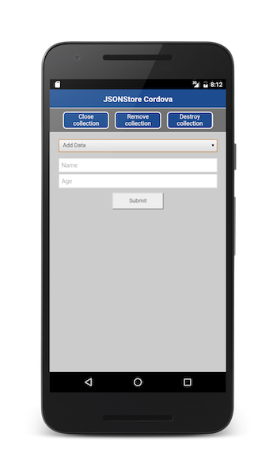

<!-- NLS_CHARSET=UTF-8 -->
## Voraussetzungen
{: #prerequisites }
* Gehen Sie das übergeordnete Lernprogramm zu [JSONStore](../) durch.
* Stellen Sie sicher, dass das {{ site.data.keys.product_adj }}-Cordova-SDK zum Projekt hinzugefügt wurde. Folgen Sie dabei dem Lernprogramm [SDK der {{ site.data.keys.product }} zu Cordova-Anwendungen hinzufügen](../../../application-development/sdk/cordova/).  

#### Fahren Sie mit folgenden Abschnitten fort: 
{: #jump-to}
* [JSONStore hinzufügen](#adding-jsonstore)
* [Grundlegende Verwendung](#basic-usage)
* [Erweiterte Verwendung](#advanced-usage)
* [Beispielanwendung](#sample-application)

## JSONStore hinzufügen
{: #adding-jsonstore }
Gehen Sie wie folgt vor, um das JSONStore-Plug-in zu Ihrer Cordova-Anwendung hinzuzufügen:

1. Öffnen Sie ein **Befehlszeilenfenster** und navigieren Sie zu Ihrem Cordova-Projektordner. 
2. Führen Sie den Befehl `cordova plugin add cordova-plugin-mfp-jsonstore` aus.


## Grundlegende Verwendung
{: #basic-usage }
### Initialisieren
{: #initialize }
Starten Sie mit `init` mindestens ene JSONStore-Sammlung.   

Sammlungen zu starten oder bereitzustellen bedeutet, dass der persistente Speicher für die Sammlung und für Dokumente erstellt wird, wenn er nicht vorhanden ist. Wenn der Speicher verschlüsselt ist und das richtige
Kennwort übergeben wird, werden die erforderlichen Sicherheitsprozeduren ausgeführt, um die Daten zugänglich zu machen. 

```javascript
var collections = {
    people : {
        searchFields: {name: 'string', age: 'integer'}
    }
};

WL.JSONStore.init(collections).then(function (collections) {
    // Erfolg behandeln - collection.people (Sammlung "people")
}).fail(function (error) {
    // Feler behandeln
});
```

> Informationen zu optionalen Features, die Sie während der Initialisierung aktivieren können, finden Sie im zweiten Teil dieses Lernprogramms unter
**Sicherheit**, **Unterstützung für mehrere Benutzer**
und **{{ site.data.keys.product_adj }}-Adapter integrieren**.


### Get
{: #get }
Mit `get` können Sie einen Mechanismus für den Zugriff auf die Sammlung erstellen. Sie müssen `init` aufrufen, bevor Sie "get" aufrufen. Andernfalls ist das Ergebnis von `get` undefiniert. 

```javascript
var collectionName = 'people';
var people = WL.JSONStore.get(collectionName);
```

Die Variable `people` kann jetzt verwendet werden, um Operationen für die Sammlung `people` auszuführen (z. B.
`add`, `find` und `replace`).

### Add
{: #add }
Verwenden Sie `add`, um Daten als Dokumente innerhalb einer Sammlung zu speichern. 

```javascript
var collectionName = 'people';
var options = {};
var data = {name: 'yoel', age: 23};

WL.JSONStore.get(collectionName).add(data, options).then(function () {
    // Erfolg behandeln
}).fail(function (error) {
    // Feler behandeln
});
```

### Find
{: #find }
* Verwenden Sie `find`, um mit einer Abfrage ein Dokument in einer Sammlung zu finden.   
* Verwenden Sie `findAll`, um alle Dokumente aus einer Sammlung abzurufen.   
* Verwenden Sie `findById`, um mit der eindeutigen Dokument-ID nach einem Dokument zu suchen.   

Das Standardverhalten für "find" ist eine Suche nach grober Übereinstimmung. 

```javascript
var query = {name: 'yoel'};
var collectionName = 'people';
var options = {
  exact: false, // Standardwert
  limit: 10 // Rückgabe von maximal 10 Dokumenten. Standardeinstellung: Rückgabe aller Dokumente
};

WL.JSONStore.get(collectionName).find(query, options).then(function (results) {
    // Erfolg behandeln - results (Array der gefundenen Dokumente)
}).fail(function (error) {
    // Feler behandeln
});
```

```javascript
var age = document.getElementById("findByAge").value || '';

if(age == "" || isNaN(age)){
  alert("Please enter a valid age to find");
}
else {
  query = {age: parseInt(age, 10)};
  var options = {
    exact: true,
    limit: 10 // Rückgabe von maximal 10 Dokumenten
  };
  WL.JSONStore.get(collectionName).find(query, options).then(function (res) {
    // Erfolg behandeln - results (Array der gefundenen Dokumente)
}).fail(function (errorObject) {
    // Fehler behandeln
  });
}
```

### Replace
{: #replace }
Verwenden Sie `replace`, um Dokumente in einer Sammlung zu modifizieren. Das Feld für die Ersetzung ist die eindeutige ID des Dokuments (`_id`). 

```javascript
var document = {
  _id: 1, json: {name: 'chevy', age: 23}
};
var collectionName = 'people';
var options = {};

WL.JSONStore.get(collectionName).replace(document, options).then(function (numberOfDocsReplaced) {
    // Erfolg behandeln
}).fail(function (error) {
    // Feler behandeln
});
```

In den vorliegenden Beispielen wird davon ausgegangen, dass das Dokument (`{_id: 1, json: {name: 'yoel', age: 23} }`) in der Sammlung enthalten ist. 

### Remove
{: #remove }
Verwenden Sie `remove`, um ein Dokument aus einer Sammlung zu löschen.   
Dokumente werden erst aus der Sammlung entfernt, wenn Sie "push" aufgerufen haben.   

> Weitere Informationen finden Sie im Abschnitt **{{ site.data.keys.product_adj }}-Adapter integrieren** weiter unten in diesem Lernprogramm. 

```javascript
var query = {_id: 1};
var collectionName = 'people';
var options = {exact: true};
WL.JSONStore.get(collectionName).remove(query, options).then(function (numberOfDocsRemoved) {
    // Erfolg behandeln
}).fail(function (error) {
    // Feler behandeln
});
```

### removeCollection
{: #remove-collection }
Verwenden Sie `removeCollection`, um alle Dokumente aus einer Sammlung zu löschen. Diese Operation ist mit dem Löschen einer Datenbanktabelle vergleichbar. 

```javascript
var collectionName = 'people';
WL.JSONStore.get(collectionName).removeCollection().then(function (removeCollectionReturnCode) {
    // Erfolg behandeln
}).fail(function (error) {
    // Feler behandeln
});
```

## Erweiterte Verwendung
{: #advanced-usage }
### Destroy
{: #destory }
Mit `destroy` können Sie die folgenden Daten entfernen: 

* Alle Dokumente
* Alle Sammlungen
* Alle Stores (siehe **Unterstützung für mehrere Benutzer** weiter unten in diesem Lernprogramm)
* Alle JSONStore-Metadaten und -Sicherheitsartefakte (siehe **Sicherheit** weiter unten in diesem Lernprogramm)

```javascript
var collectionName = 'people';
WL.JSONStore.destroy().then(function () {
    // Erfolg behandeln
}).fail(function (error) {
    // Feler behandeln
});
```

### Sicherheit
{: #security }
Sie können alle Sammlungen in einem Store schützen, indem Sie an die Funktion `init` ein Kennwort übergeben. Wenn kein Kennwort übergeben wird, wird keines
der Dokumente in den Sammlungen des Store verschlüsselt. 

Die Datenverschlüsselung ist nur
in Android-, iOS-, Windows-8.1-Universal- und
Windows-10-UWP-Umgebungen verfügbar.   
Einige Sicherheitsmetadaten werden in der *Keychain* (iOS), in den *Shared Preferences* (Android) oder
im *Schließfach für Anmeldeinformationen * (Windows 8.1) gespeichert.  
Der Store wird mit einem
256-Bit-Schlüssel gemäß Advanced Encryption Standard (AES) verschlüsselt. Alle Schlüssel werden durch
die Funktion
PBKDF2 (Password-Based Key Derivation Function 2) verstärkt.

Verwenden Sie `closeAll`, um den Zugriff auf alle Sammlungen bis zum erneuten Aufruf von `init` zu sperren. Wenn Sie sich
`init` als eine Art Anmeldefunktion vorstellen, wäre `closeAll` die entsprechende Abmeldefunktion. Verwenden Sie `changePassword`, um das Kennwort zu ändern. 

```javascript
var collections = {
  people: {
    searchFields: {name: 'string'}
  }
};
var options = {password: '123'};
WL.JSONStore.init(collections, options).then(function () {
    // Erfolg behandeln
}).fail(function (error) {
    // Feler behandeln
});
```

#### Verschlüsselung
{: #encryption }
*Nur iOS*: Standardmäßig ist das {{ site.data.keys.product_adj }}-Cordova-SDK für iOS für die Verschlüsselung auf iOS-APIs angewiesen. Wenn Sie lieber OpenSSL verwenden möchten, gehen Sie wie folgt vor: 

1. Fügen Sie das Plug-in cordova-plugin-mfp-encrypt-utils hinzu: `cordova plugin add cordova-plugin-mfp-encrypt-utils`.
2. Verwenden Sie in der applikativen Logik `WL.SecurityUtils.enableNativeEncryption(false)`, um die OpenSSL-Option zu aktivieren. 

### Unterstützung für mehrere Benutzer
{: #multiple-user-support }
Sie können mehrere Stores erstellen, die verschiedene Sammlungen in nur einer
{{ site.data.keys.product_adj }}-Anwendung enthalten. Die Funktion `init` kann mit einem Optionsobjekt mit einem Benutzernamen verwendet werden. Wenn kein Benutzername angegeben wird, wird der Standardbenutzername **jsonstore** verwendet.

```javascript
var collections = {
  people: {
    searchFields: {name: 'string'}
  }
};
var options = {username: 'yoel'};
WL.JSONStore.init(collections, options).then(function () {
    // Erfolg behandeln
}).fail(function (error) {
    // Feler behandeln
});
```

### {{ site.data.keys.product_adj }}-Adapter integrieren
{: #mobilefirst-adapter-integration }
In diesem Abschnitt wird vorausgesetzt, dass Sie sich mit Adaptern auskennen.   

Die Adapterintegration ist optional. Sie ermöglicht das Senden von Daten einer Sammlung an einen Adapter und das Abrufen von Daten eines Adapters in eine Sammlung.   
Sie können diese Ziele mit `WLResourceRequest` erreichen oder mit `jQuery.ajax`, falls Sie mehr Flexibilität benötigen. 

### Adapterimplementierung
{: #adapter-implementation }
Erstellen Sie einen Adapter mit dem Namen **People**.  
Definieren Sie für den Adapter die Prozeduren
`addPerson`, `getPeople`, `pushPeople`, `removePerson` und `replacePerson`.

```javascript
function getPeople () {
var data = { peopleList : [{name: 'chevy', age: 23}, {name: 'yoel', age: 23}] };
	WL.Logger.debug('Adapter: people, procedure: getPeople called.');
	WL.Logger.debug('Sending data: ' + JSON.stringify(data));
	return data;
}
function pushPeople(data) {
	WL.Logger.debug('Adapter: people, procedure: pushPeople called.');
	WL.Logger.debug('Got data from JSONStore to ADD: ' + data);
	return;
}
function addPerson(data) {
	WL.Logger.debug('Adapter: people, procedure: addPerson called.');
	WL.Logger.debug('Got data from JSONStore to ADD: ' + data);
	return;
}
function removePerson(data) {
	WL.Logger.debug('Adapter: people, procedure: removePerson called.');
	WL.Logger.debug('Got data from JSONStore to REMOVE: ' + data);
	return;
}
function replacePerson(data) {
	WL.Logger.debug('Adapter: people, procedure: replacePerson called.');
	WL.Logger.debug('Got data from JSONStore to REPLACE: ' + data);
	return;
}
```

#### Eine mit einem {{ site.data.keys.product_adj }}-Adapter verlinkte Sammlung initialisieren
{: #initialize-a-collection-linked-to-a-mobilefirst-adapter }
```javascript
var collections = {
  people : {
    searchFields : {name: 'string', age: 'integer'},
    adapter : {
      name: 'People',
      add: 'addPerson',
      remove: 'removePerson',
      replace: 'replacePerson',
      load: {
        procedure: 'getPeople',
        params: [],
        key: 'peopleList'
      }     
    }   
  }
}

var options = {};
WL.JSONStore.init(collections, options).then(function () {
    // Erfolg behandeln
}).fail(function (error) {
    // Feler behandeln
});
```

#### Daten von einem Adapter laden
{: #load-data-from-an-adapter }
Wenn `load` aufgerufen wird, verwendet JSONStore einige Adapter-Metadaten (**name** und **procedure**),
die Sie zuvor an `init` übergeben haben, um zu bestimmen, welche Daten vom Adapter abgerufen und dann gespeichert werden sollen. 

```javascript
var collectionName = 'people';
WL.JSONStore.get(collectionName).load().then(function (loadedDocuments) {
    // Erfolg behandeln
}).fail(function (error) {
    // Feler behandeln
});
```

#### getPushRequired (vorläufige Dokumente)
{: #get-push-required-dirty-documents }
Wenn Sie `getPushRequired` aufrufen, wird ein Array mit vorläufigen Dokumenten (*dirty documents*)
zurückgegeben. Diese Dokumente enthalten lokale Modifikationen, die es auf dem Back-End-System noch nicht gibt. Diese Dokumente werden an den Adapter gesendet, wenn
`push` aufgerufen wird. 

```javascript
var collectionName = 'people';
WL.JSONStore.get(collectionName).getPushRequired().then(function (dirtyDocuments) {
    // Erfolg behandeln
}).fail(function (error) {
    // Feler behandeln
});
```

Wenn Sie JSONStore daran hindern möchten, Dokumente als vorläufig zu markieren, übergeben Sie die Option `{markDirty:false}`
an `add`, `replace` und `remove`. 

Sie können auch die API `getAllDirty` verwenden, um die vorläufigen Dokumente abzurufen: 

```javascript
WL.JSONStore.get(collectionName).getAllDirty()
.then(function (dirtyDocuments) {
    // Erfolg behandeln
}).fail(function (errorObject) {
    // Feler behandeln
});
```

#### Push
{: #push }
Mit `push` werden Dokumente, die geändert wurden, an die richtige Adapterprozedur
gesendet (d. h. `addPerson` wird mit einem lokal hinzugefügten Dokument aufgerufen). Dieser Mechanismus basiert auf der letzten Operation im Zusammenhang mit dem geänderten Dokument, und
die Adaptermetadaten werden an `init` übergeben.

```javascript
var collectionName = 'people';
WL.JSONStore.get(collectionName).push().then(function (response) {
    // Erfolg behandeln
    // Die Antwort ist ein leeres Array, wenn alle Dokumente den Server erreicht haben.
    // Die Antwort ist ein Array mit Fehlerantworten, wenn einige Dokumente den Server nicht erreicht haben.
}).fail(function (error) {
    // Feler behandeln
});
```

### Enhance
{: #enhance }
Verwenden Sie `enhance`, um die Kern-API an Ihre Anforderungen anzupassen, indem Sie Funktionen zu einem Sammlungsprototyp hinzufügen.
Das folgende Beispiel (Code-Snippet) zeigt, wie mit `enhance` die Funktion `getValue` hinzugefügt wird, die für die Sammlung
`keyvalue` ausgeführt wird. Sie wird mit einer Schlüsselzeichenfolge (`key`) als einzigem Parameter verwendet und gibt ein Einzelergebnis zurück. 

```javascript
var collectionName = 'keyvalue';
WL.JSONStore.get(collectionName).enhance('getValue', function (key) {
    var deferred = $.Deferred();
    var collection = this;
    // Exakte Suche nach dem Schüssel
    collection.find({key: key}, {exact:true, limit: 1}).then(deferred.resolve, deferred.reject);
    return deferred.promise();
});

// Syntax:
var key = 'myKey';
WL.JSONStore.get(collectionName).getValue(key).then(function (result) {
    // Erfolg behandeln
    // Das Ergebnis ist ein Array mit Dokumenten mit den Ergebnissen der Suche.
}).fail(function () {
    // Feler behandeln
});
```

> Weitere Informationen zu JSONStore finden Sie in der Benutzerdokumentation. 


## Beispielanwendung
{: #sample-application }
Das JSONStoreSwift-Projekt enthält eine Cordova-Anwendung, die die JSONStore-APIs verwendet.   
Eingeschlossen ist ein JavaScript-Adapter-Maven-Projekt. 

[Klicken Sie hier](https://github.com/MobileFirst-Platform-Developer-Center/JSONStoreCordova/tree/release80), um das Cordova-Projekt herunterzuladen.   
[Klicken Sie hier](https://github.com/MobileFirst-Platform-Developer-Center/JSONStoreAdapter/tree/release80), um das Adapter-Maven-Projekt herunterzuladen.   

### Verwendung des Beispiels
{: #sample-usage }
Anweisungen finden Sie in der Datei README.md zum Beispiel. 
