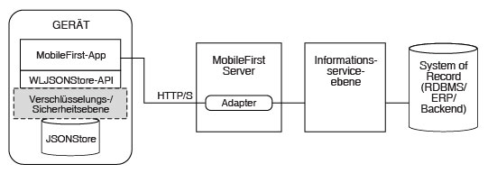

<!-- NLS_CHARSET=UTF-8 -->
## Übersicht
{: #overview }
{{ site.data.keys.product_full }} **JSONStore** ist eine optionale clientseitige API, die
ein schlankes, dokumentorientiertes Speichersystem bereitstellt. JSONStore ermglicht das persistente Speichern von **JSON-Dokumenten**. Dokumente in einer Anwendung sind auch dann im
JSONStore verfügbar, wenn das Gerät, auf dem die Anwendung ausgeführt wird, offline ist. Dieser persistente und immer verfügbare Store kann nützlich sein, da Benutzer auch dann Zugriff auf Dokumente
haben, wenn das Gerät keine Netzverbindung herstellen kann. 



In dieser Dokumentation wird zur Erläuterung von JSONStore an einigen Stellen auf die Terminologie für relationale Datenbanken zurückgegriffen, weil
Entwickler mit dieser Terminologie vertraut sind.
Es gibt allerdings zahlreiche Unterschiede zwischen einer relationalen Datenbank
und JSONStore. Das strikte Schema für die Speicherung von Daten in relationalen Datenbanken unterscheidet sich beispielsweise vom
JSONStore-Konzept, bei dem Sie jeden
JSON-Inhalt speichern und den Inhalt, der durchsucht werden muss, indexieren können.

#### Schlüsselfunktionen
{: #key-features }
* Datenindexierung für eine effiziente Suche
* Mechanismus für die Verfolgung rein lokaler Änderungen an den gespeicherten Daten
* Unterstützung für mehrere Benutzer
* AES-256-Verschlüsselung gespeicherter Daten für Sicherheit und
Vertraulichkeit. Wird ein Gerät von mehr als einem Benutzer verwendet, können Sie die Daten jedes Benutzers mit einem Kennwort schützen.

In einem Speicher kann es mehrere Sammlungen geben, die jeweils mehrere
Dokumente umfassen können. Es kann auch eine {{ site.data.keys.product_adj }}-Anwendung mit
mehreren Stores geben. Diesbezügliche Informationen finden Sie unter "JSONStore-Unterstützung für mehrere Benutzer". 

#### Support-Level
{: #support-level }
* JSONStore wird in nativen iOS- und Android-Anwendungen unterstützt. (Es gibt keine Unterstützung für native Windows-Anwendungen, d. h. weder für universelle Windows-Anwendungen noch für Windows-UWP-Anwendungen.) 
* JSONStore wird in Cordova-iOS-, Cordova-Android- und Windows-Anwendungen (universell und UWP) unterstützt. 

#### Fahren Sie mit folgenden Abschnitten fort: 
{: #jump-to }
* [Allgemeine JSONStore-Terminologie](#general-jsonstore-terminology)
* [Featuretabelle](#features-table)
* [Unterstützung für mehrere Benutzer](#multiple-user-support)
* [Sicherheit](#security)
* [Leistung](#performance)
* [Gemeinsamer Zugriff](#concurrency)
* [Analyse](#analytics)
* [Externe Daten verwenden](#working-with-external-data)
* [Fehlerbehebung](#troubleshooting)
* [API-Verwendung](#api-usage)

## Allgemeine JSONStore-Terminologie
{: #general-jsonstore-terminology }
### Dokument
{: #document }
Ein Dokument ist der Grundbaustein des JSONStore.

Ein JSONStore-Dokument ist ein
JSON-Objekt mit einer automatisch generierten
Kennung (`_id`) und JSON-Daten. Es ist mit einem Datensatz oder einer Zeile in der Datenbankterminologie
vergleichbar. Der Wert der `_id` ist immer eine eindeutige ganze Zahl innerhalb einer bestimmten Sammlung. Einige Funktionen
der Klasse `JSONStoreInstance` wie `add`, `replace` und
`remove` verwenden ein Array mit Dokumenten/Objekten. Diese Methoden sind hilfreich, wenn Operationen gleichzeitig für mehrere Dokumente/Objekte
ausgeführt werden sollen.

**Einzeldokument**  

```javascript
var doc = { _id: 1, json: {name: 'carlos', age: 99} };
```

**Dokument-Array**

```javascript
var docs = [
{ _id: 1, json: {name: 'carlos', age: 99} },
  { _id: 2, json: {name: 'tim', age: 100} }
]
```

### Sammlung
{: #collection }
Eine JSONStore-Sammlung ist mit einer Tabelle in der Datenbankterminologie vergleichbar.  
Das folgende Codebeispiel entspricht nicht dem von Dokumenten, die auf Platte gespeichert werden. Es vermittelt aber, wie eine Sammlung von einer höheren Ebene aus betrachtet aussieht.

```javascript
[
    { _id: 1, json: {name: 'carlos', age: 99} },
    { _id: 2, json: {name: 'tim', age: 100} }
]
```

### Store
{: #store }
Ein Store ist eine persistente JSONStore-Datei mit Sammlungen.  
Ein Store ist
mit einer relationalen Datenbank in der Datenbankterminologie vergleichbar. Dieser Store wird auch als
JSONStore bezeichnet.

### Suchfelder
{: #search-fields }
Ein Suchfeld enthält ein Schlüssel-Wert-Paar.  
Suchfelder sind Schlüssel, die ähnlich wie Spaltenfelder oder Attribute in der Datenbankterminologie indexiert werden,
um eine schnelle Suche zu ermöglichen.

Zusätzliche Suchfelder sind Schlüssel, die auch indexiert werden, aber nicht Teil der gespeicherten
JSON-Daten sind. Diese Felder definieren den Schlüssel, dessen Werte (in der JSON-Sammlung) indexiert werden und für eine
schnellere Suche verwendet werden können.

Gültige Datentypen sind String, Boolean, Number und Integer. Diese Angabe ist nur ein Hinweis zu den Datentypen. Es findet keine
Gültigkeitsprüfung statt. Diese Typen bestimmen außerdem, wie indexierbare Felder gespeichert werden. Bei Verwendung von `{age: 'number'}` wird 1 beispielsweise als 1.0 indexiert und bei Verwendung von
`{age: 'integer'}` als 1.

**Suchfelder und zusätzliche Suchfelder**

```javascript
var searchField = {name: 'string', age: 'integer'};
var additionalSearchField = {key: 'string'};
```

Es ist nur möglich, Schlüssel innerhalb eines
Objekts zu indexieren. Das Objekt selbst kann nicht indexiert werden. Bei Arrays erfolgt ein Durchgriff. Das bedeutet, Sie können ein Array oder einen bestimmten Index des Arrays
(arr[n]) nicht indexieren, aber Objekte innerhalb eines Arrays.

**Indexierung von Werten in einem Array**

```javascript

var searchFields = {
'people.name' : 'string', // stimmt mit carlos und tim in myObject überein
    'people.age' : 'integer' // stimmt mit 99 und 100 in myObject überein
};

var myObject = { 
people : [ 
{name: 'carlos', age: 99}, 
        {name: 'tim', age: 100}
    ] 
};
```

### Abfragen
{: #queries }
Abfragen sind Objekte, die für die Suche nach Dokumenten
Suchfelder oder zusätzliche Suchfelder verwenden.  
Für diese Beispiele wird davon ausgegangen, dass das Suchfeld "name" vom Typ String und das Suchfeld "age" vom Typ Integer ist.

**Suche nach Dokumenten mit dem Namen `carlos`**

```javascript
var query1 = {name: 'carlos'};
```

**Suche nach Dokumenten mit dem Namen `carlos` und der Altersangabe `99`**

```javascript
var query2 = {name: 'carlos', age: 99};
```

### Abfrageabschnitte
{: #query-parts }
Abfrageabschnitte werden verwendet, um erweiterte Suchläufe zu erstellen. Einige
JSONStore-Operationen, z. B. einige Versionen von
`find` oder `count`, verwenden Abfrageabschnitte. Alle Elemente eines Abfrageabschnitts
sind durch `AND`-Anweisungen verknüpft. Die Abfrageabschnitte selbst werden mit
`OR`-Anweisungen verknüpft.
Das Suchkriterium ergibt nur eine Übereinstimmung, wenn alle Elemente innerhalb eines Abfrageabschnitts wahr
(**true**) sind. Sie können mehrere Abfrageabschnitte verwenden, um nach Übereinstimmungen für einen oder mehrere der Abfrageabschnitte
zu suchen.

Suchläufe mit Abfrageabschnitten funktionieren nur für Suchfelder der Ausgangsebene, z. B. für `name`,
aber nicht für `name.first`. Umgehen Sie dies, indem Sie mehrere Sammlungen verwenden, bei denen alle Suchfelder Felder der Ausgangsebene sind. Abfrageabschnittsoperationen, die für
Suchfelder anderer Ebenen funktionieren, sind
`equal`, `notEqual`, `like`, `notLike`, `rightLike`, `notRightLike`, `leftLike`
und `notLeftLike`. Das Verhalten ist unbestimmt, wenn Sie Suchfelder verwenden, die keine Felder der Ausgangsebene sind.

## Featuretabelle
{: #features-table }
Hier werden JSONStore-Features
mit den Features anderer Datenspeichertechnologien und -formate verglichen.

JSONStore ist eine JavaScript-API zum Speichern von Daten in Cordova-Anwendungen, die das {{ site.data.keys.product_adj }}-Plug-in, eine Objective-C-API für native iOS-Anwendungen und eine Java-API für native Android-Anwendungen verwenden. Zur Information finden Sie
hier einen Vergleich von JSONStore mit verschiedenen JavaScript-Speichertechnologien.

JSONStore ist mit
Technologien wie
LocalStorage, IndexedDB, Cordova Storage API und Cordova File
API vergleichbar. Die Tabelle zeigt, wie einige
JSONStore-Features im Vergleich mit anderen Technologien aussehen. JSONStore ist nur für
iOS- und Android-Geräte bzw. -Simulatoren verfügbar.

|Feature |JSONStore      |LocalStorage |IndexedDB |Cordova-API Storage |Cordova-API File |
|----------------------------------------------------|----------------|--------------|-----------|---------------------|------------------|
|Android-Unterstützung (Cordova-Anwendungen &amp; native Anwendungen)|	     ✔ 	      |✔	      |✔	      |✔	    |✔	     |
|iOS-Unterstützung (Cordova-Anwendungen & native Anwendungen) |	     ✔ 	      |✔	      |✔	      |✔	    |✔	     |
|Windows 8.1 Universal und Windows 10 UWP (Cordova-Anwendungen)|	     ✔ 	      |✔	      |✔	      |        -	           |✔	      |
|Datenverschlüsselung |	     ✔ 	      |      -	    |     -	     |        -	           |         -	      |
|Maximaler Speicher |Verfügbarer Speicherplatz|~5 MB |~5 MB | Verfügbarer Speicherplatz | Verfügbarer Speicherplatz |
|Zuverlässiger Speicher (siehe Hinweis)|	     ✔ 	      |      -	    |     -	     |✔	      |✔	      |
|Verfolgung lokaler Änderungen |	     ✔ 	      |      -	    |     -	     |        -	           |         -	      |
|Mehrbenutzerunterstützung|	     ✔ 	      |      -	    |     -	     |        -	           |         -	      |
|Indexierung |	     ✔ 	      |      -	    |✔	      |✔	      |         -	      |
|Art der Speichers |JSON-Dokumente|Schlüssel-Wert-Paare|JSON-Dokumente|Relational (SQL)|Zeichenfolgen |

**Hinweis:** Zuverlässiger Speicher bedeutet, dass Ihre Daten erst gelöscht werden, wenn eines der folgenden Ereignisse eintritt:


* Die Anwendung wird vom Gerät entfernt.
* Eine der Methoden zum Entfernen von Daten wird aufgerufen.

## Unterstützung für mehrere Benutzer	
{: #multiple-user-support }
Mit JSONStore können Sie mehrere Stores erstellen, die verschiedene Sammlungen in nur einer
{{ site.data.keys.product_adj }}-Anwendung enthalten.

Die
API init (JavaScript) oder open (natives
iOS und Android) kann ein Optionsobjekt mit einem Benutzernamen verwenden. Verschiedene Speicher sind separate Dateien im Dateisystem. Der Benutzername wird als der Dateiname des Speichers verwendet. Diese separaten Speicher können mit verschiedenen Kennwörtern
verschlüsselt werden, um Zugriffsschutz und Datenschutz zu gewährleisten. Wenn die API closeAll aufgerufen wird, geht der Zugriff auf
alle Sammlungen verloren. Es ist auch möglich, das Kennwort eines verschlüsselten Speichers durch das Aufrufen der API changePassword zu ändern.

Ein Beispielanwendungsfall wären mehrere Mitarbeiter, die ein physisches Gerät, z. B. ein iPad oder ein
Android Tablet, und eine {{ site.data.keys.product_adj }}-Anwendung gemeinsam nutzen.
Wenn diese Mitarbeiter zudem in verschiedenen Schichten arbeiten und
in der
{{ site.data.keys.product_adj }}-Anwendung private Daten verschiedener Kunden bearbeiten, ist die Unterstützung für
mehrere Benutzer nützlich.

## Sicherheit
{: #security }
Sie können alle Sammlungen in einem Store schützen, indem Sie sie verschlüsseln.

Zum Verschlüsseln aller Sammlungen in einem Store müssen Sie ein Kennwort an die
API `init` (JavaScript) oder `open` (natives
iOS und Android) übergeben. Wenn kein Kennwort übergeben wird, wird keines
der Dokumente in den Speichersammlungen verschlüsselt. 

Einige Sicherheitsartefakte (z. B. das Salt) werden in der
Keychain (iOS), in den Shared Preferences (Android) oder
im Schließfach für Anmeldeinformationen (Windows Universal 8.1 und Windows 10 UWP) gespeichert. Der Store wird mit einem
256-Bit-Schlüssel gemäß Advanced Encryption Standard (AES) verschlüsselt. Alle Schlüssel werden durch
die Funktion
PBKDF2 (Password-Based Key Derivation Function 2) verstärkt. Sie können Datensammlungen für eine Anwendung verschlüsseln, aber nicht zwischen verschlüsseltem und Klartextformat umschalten oder beide Formate
innerhalb eines Stores kombinieren.

Der Schlüssel, der die Daten im Store schützt, basiert auf dem von Ihnen angegebenen Benutzerkennwort. Der Schlüssel verfällt nicht. Sie können ihn jedoch mit der API changePassword ändern.

Der Schutzschlüssel für Daten wird verwendet, um den Inhalt des Stores zu entschlüsseln. Dieser Schlüssel wird in der iOS-Keychain
aufbewahrt, auch wenn die Anwendung deinstalliert wird. Wenn Sie sowohl den Schlüssel in der Keychain als auch
alle anderen vom JSONStore in die Anwendung gestellten Daten entfernen möchten, verwenden Sie die API
destroy. Dieser Prozess
gilt nicht für Android, weil der Schutzschlüssel für verschlüsselte Daten in den Shared Preferences gespeichert wird und beim Deinstallieren der Anwendung gelöscht wird. 

Wenn JSONStore zum ersten Mal eine Sammlung mit einem Kennwort öffnet (d. h., dass der Entwickler Daten im Store verschlüsseln möchte), benötigt
er ein zufälliges Token. Dieses zufällige Token kann beim Client oder Server angefordert werden.

Wenn der Schlüssel localKeyGen in der JavaScript-Implementierung der JSONStore-API vorhanden und auf den Wert "true" gesetzt ist, wird lokal ein kryptografisch sicheres Token generiert. Andernfalls wird das Token über einen Kontakt zum Server generiert, sodass
eine Verbindung zum
{{ site.data.keys.mf_server }} möglich sein muss.
Dieses Token ist nur erforderlich, wenn ein Store zum ersten Mal mit einem Kennwort geöffnet wird. Die nativen Implementierungen
(Objective-C und Java) generieren standardmäßig ein kryptographisch sicheres Token. Sie können aber auch
ein Token mit der Option secureRandom übergeben. 

Es gilt, die weniger sichere Methode (Store offline öffnen und darauf vertrauen, dass der Client das zufällige Token generiert)
gegen die eher sichere Methode (Store mit Zugriff auf
{{ site.data.keys.mf_server }} öffnen, was eine Verbindung erfordert)
abzuwägen.

### Sicherheitsdienstprogramme
{: #security-utilities }
Die clientseitige {{ site.data.keys.product_adj }}-API stellt einige Sicherheitsdienstprogramme
für den Schutz Ihrer Benutzerdaten bereit.
Ein Feature wie JSONStore ist bestens geeignet, wenn Sie JSON-Objekte schützen möchten.
Für das Speichern großer Binärobjekte (BLOBs) in einer JSONStore-Sammlung ist es jedoch nicht
zu empfehlen.

Speichern Sie Binärdaten stattdessen im Dateisystem und die Dateipfade und andere Metadaten in einer
JSONStore-Sammlung. Wenn Sie beispielsweise Bilddateien schützen möchten, können Sie diese als Base64-Zeichenfolgen codieren, dann verschlüsseln und die Ausgabe
auf die Festplatte schreiben. Ist es notwendig, die Daten zu entschlüsseln, können Sie die Metadaten in einer
JSONStore-Sammlung finden, die verschlüsselten Daten von der Platte lesen und dann mit den gespeicherten Metadaten entschlüsseln. Zu diesen Metadaten können der Schlüssel, das Salt, der IV (Initialisierungsvektor),
der Dateityp, der Pfad zur Datei und andere gehören.

> Machen Sie sich mit den [JSONStore-Sicherheitsdienstprogrammen](security-utilities) vertraut. 

### Verschlüsselung in Windows 8.1 Universal und Windows 10 UWP
{: #windows-81-universal-and-windows-10-uwp-encryption }
Sie können alle Sammlungen in einem Store schützen, indem Sie sie verschlüsseln.

Die zugrunde liegende Datenbanktechnologie von JSONStore ist [SQLCipher](http://sqlcipher.net/). SQLCipher ist ein von Zetetic LLC erstellter SQLite-Build, der eine Verschlüsselungsschicht zur Datenbank hinzufügt.

JSONStore verwendet SQLCipher auf allen Plattformen. Für Android und iOS ist eine
freie Open-Source-Version von SQLCipher (die so genannte
Community Edition) verfügbar. Diese Version wurde in die JSONStore-Versionen in der
{{ site.data.keys.product }} integriert. Die Windows-Versionen von SQLCipher
sind nur mit einer kostenpflichtigen Lizenz verfügbar und können nicht direkt
über die {{ site.data.keys.product }} verteilt werden.

JSONStore für Windows 8
Universal verwendet stattdessen
SQLite als zugrunde liegende Datenbank. Wenn Sie Daten für eine dieser Plattformen verschlüsseln müssen, müssen Sie sich eine eigene Version von
SQLCipher beschaffen und die in der {{ site.data.keys.product }} enthaltene SQLite-Version austauschen.


Wenn Sie keine Verschlüsselung benötigen, ist JSONStore (abgesehen von der Verschlüsselung) mit der
SQLite-Version in der {{ site.data.keys.product }} voll funktionsfähig.

#### SQLite unter Windows 8 Universal und Windows 10 UWP durch SQLCipher ersetzen
{: #replacing-sqlite-with-sqlcipher-for-windows-universal-and-windows-uwp }
1. Führen Sie die Erweiterung SQLCipher für Windows Runtime
8.1/10 aus, die mit der SQLCipher für Windows Runtime Commercial Edition geliefert wird.
2. Suchen Sie nach der Installation der Erweiterung die neu erstellte SQLCipher-Version
der Datei **sqlite3.dll**.Es gibt eine Version für x86, eine für x64 und eine für
ARM.

   ```bash
   C:\Program Files (x86)\Microsoft SDKs\Windows\v8.1\ExtensionSDKs\SQLCipher.WinRT81\3.0.1\Redist\Retail\<Plattform>
   ```
    
3. Kopieren Sie diese Datei in ihre {{ site.data.keys.product_adj }}-Anwendung, um die vorhandene Datei zu ersetzen.

   ```bash
   <Worklight-Projektname>\apps\<Anwendungsname>\windows8\native\buildtarget\<Plattform>
   ```

## Leistung
{: #performance }
Die folgenden Faktoren haben Einfluss auf die JSONStore-Leistung: 

### Netz
{: #network }
* Überprüfen Sie die Netzkonnektivität, bevor Sie Operationen wie das Senden aller vorläufigen Dokumente an einen
Adapter ausführen.
* Die Leistung wird stark durch das Datenvolumen beeinflusst, das über das Netz an einen Client gesendet wird. Senden Sie nur die für die Anwendung erforderlichen Daten, anstatt alle Daten in Ihrer Back-End-Datenbank zu kopieren.
* Wenn Sie einen Adapter verwenden, können Sie die Option compressResponse auf "true" setzen. Antworten werden dann komprimiert, sodass generell weniger Bandbreite verwendet wird und die Übertragungszeit kürzer als beim Senden ohne
Komprimierung ist.

### Speicher
{: #memory }
* Wenn Sie die JavaScript-API verwenden,
werden JSONStore-Dokumente wischen der nativen Schicht
(Objective-C, Java
oder C#) und der JavaScript-Schicht als Zeichenfolgen serialisiert und deserialisiert. Eine Möglichkeit, eventuelle Speicherprobleme zu reduzieren,
ist die Verwendung von Limit und Offset, wenn Sie die API
find verwenden. Auf diese Weise beschränken Sie die für Ergebnisse zugeordnete Speicherkapazität
und können beispielsweise die Paginierung implementieren (x Ergebnisse pro Seite anzeigen).
* Anstatt lange Schlüsselnamen zu verwenden, die letztendlich als Zeichenfolgen serialisiert und deserialisiert werden, könnten Sie solche langen
Schlüsselnamen kürzeren Namen zuordnen (`myVeryVeryVerLongKeyName` könnten Sie beispielsweise `k` oder `key` zuordnen).
Im Idealfall ordnen Sie die langen Schlüsselnamen kurzen Schlüsselnamen zu, wenn Sie die Schlüssel vom Adapter an den Client senden, und wenn Sie Daten zurück an das Back-End senden, ordnen Sie die kurzen
Schlüsselnamen wieder den ursprünglichen langen Schlüsselnamen zu. 
* Erwägen Sie, die Daten innerhalb eines Stores in mehrere Sammlungen zu unterteilen.
Sie sollten kompakte Dokumente in mehreren Sammlungen anstelle von umfangreichen Dokumenten in nur einer Sammlung verwenden. Ob dies eine geeignete Vorgehensweise ist, hängt davon ab, wie eng die Daten zusammengehören
und wie die Anwendungsfälle für diese Daten aussehen.
* Wenn Sie die API add mit einem Objekt-Array verwenden, könnten Speicherprobleme auftreten. Um die Gefahr solcher Probleme zu verringern, sollten Sie diese
Methoden jeweils mit weniger JSON-Objekten aufrufen.
* In JavaScript und Java gibt es Garbage-Collectors. In
Objective-C gibt es dagegen ARC (Automatic Reference Counting). Sorgen Sie dafür, dass das Automatic Reference Counting funktioniert, aber verlassen Sie sich nicht
völlig darauf. Versuchen Sie, Referenzen, die nicht mehr verwendet werden, auf null zu reduzieren, und überprüfen Sie mit Profilerstellungstools, ob
die Speicherbelegung sinkt, wenn Sie dies erwarten. 

### CPU
{: #cpu }
* Die Anzahl der Suchfelder und der verwendeten zusätzlichen Suchfelder wirkt sich auf die Leistung aus, wenn Sie die Methode
add, die die Indexierung durchführt, aufrufen. Indexieren Sie nur die Werte, die in Abfragen für die Methode
find verwendet werden.
* JSONStore verfolgt standardmäßig lokale Änderungen an seinen Dokumenten. Sie können dieses Verhalten inaktivieren und damit einige Zyklen einsparen, indem Sie
die Option `markDirty` auf
**false** setzen, wenn Sie die APIs "add", "remove" und "replace" verwenden.
* Durch die Aktivierung der Sicherheit erhöht sich der Systemaufwand für die API `init` oder `open`
und für andere Operationen, die mit Dokumenten innerhalb der Sammlung arbeiten.
Überlegen Sie daher genau, wann Sicherheit wirklich benötigt wird. Die API open
funktioniert beispielsweise mit Verschlüsselung langsamer, denn sie muss die Chiffrierschlüssel für die Ver- und Entschlüsselung
generieren.
* Die APIs `replace` und `remove` sind von der Größe der Sammlung abhängig, denn
sie müssen die komplette Sammlung durchgehen, um alle Vorkommen des jeweiligen Elements zu ersetzen oder zu entfernen. Da die APIs jeden Datensatz durchgehen müssen,
müssen sie
jeden einzelnen Datensatz entschlüsseln. Dadurch werden die APIs bei Verschlüsselung deutlich langsamer. Bei größeren Sammlungen wird diese
Leistungseinbuße noch auffälliger.
* Die Verwendung der API `count` ist relativ aufwändig. Sie können jedoch eine Variable für den Zähler für diese Sammlung
verwenden. Aktualisieren Sie die Variable jedes Mal, wenn Sie Dokumente in der Sammlung speichern oder aus der Sammlung entfernen.
* Die `find`-APIs (`find`, `findAll`
und `findById`) sind von der Verschlüsselung betroffen, weil sie jedes Dokument entschlüsseln müssen, um feststellen zu können, ob es eine Übereinstimmung enthält oder nicht. Wenn beim Suchen mit einer Abfrage ein Limit übergeben wird, ist die
Suche potenziell schneller, weil sie stoppt, sobald eine bestimmte Anzahl von Ergebnissen erreicht ist. JSONStore muss die restlichen Dokumente nicht
entschlüsseln, um herauszufinden, ob noch weitere Suchergebnisse vorhanden sind.

## Gemeinsamer Zugriff
{: #concurrency }
### JavaScript
{: #javascript }
Die meisten für eine Sammlung ausführbaren Operationen wie
add und find
sind asynchron. Diese Operationen geben eine jQuery-Zusicherung (Promise) zurück, die eingelöst wird, wenn die Operation
erfolgreich abgeschlossen wird, und die zurückgewiesen wird, wenn ein Fehler auftritt. Diese Zusicherungen sind mit Callback-Funktionen bei Erfolg und Fehler
vergleichbar.

Ein jQuery-Aufschub (Deferred) ist eine Zusicherung, die eingelöst oder zurückgewiesen werden kann. Die folgenden
Beispiele sind keine spezifischen JSONStore-Beispiele, sondern sollen Ihnen helfen, ganz allgemein die Verwendung von Zusicherung (Promise) und Aufschub (Deferred)
zu verstehen.

Anstelle von Zusicherungen und Callback-Funktionen können Sie
auch die JSONStore-Ereignisse `success` und `failure`
überwachen.
Führen Sie Aktionen aus, die auf den an den Ereignislistener
übergebenen Argumenten basieren.

**Beispieldefinition für eine Zusicherung**

```javascript
var asyncOperation = function () {
// Vorausgesetzt wird, dass Sie jQuery über $ in der Umgebung definiert haben.
  var deferred = $.Deferred();

  setTimeout(function() {
deferred.resolve('Hello');
  }, 1000);

  return deferred.promise();
};
```

**Verwendungsbeispiel für eine Zusicherung**

```javascript
// Die an .then übergebene Funktion wird nach 1000 ms ausgeführt.
asyncOperation.then(function (response) {
// response = 'Hello'
});
```

**Beispieldefinition für eine Callback-Funktion**

```javascript
var asyncOperation = function (callback) {
setTimeout(function() {
callback('Hello');
  }, 1000);
};
```

**Verwendungsbeispiel für eine Callback-Funktion**

```javascript
// Die an asyncOperation übergebene Funktion wird nach 1000 ms ausgeführt.
asyncOperation(function (response) {
// response = 'Hello'
});
```

**Beispielereignisse**

```javascript
$(document.body).on('WL/JSONSTORE/SUCCESS', function (evt, data, src, collectionName) {
// evt - Enthält Informationen zum Ereignis
  // data - Daten, die nach Abschluss der Operation (add, find usw.) gesendet werden
  // src - Name der Operation (add, find, push usw.)
  // collectionName - Name der Sammlung
});
```

### Objective-C
{: #objective-c }
Wenn Sie die native iOS-API
für JSONStore verwenden, werden alle Operationen zu einer asynchronen Dispatchwarteschlange hinzugefügt. Dadurch wird sichergestellt,
dass Operationen mit Auswirkungen auf den Store der Reihe nach in einem Thread ausgeführt werden, der nicht der Hauptthread ist. Weitere Informationen finden Sie in der
Apple-Dokumentation unter [Grand Central Dispatch (GCD)](https://developer.apple.com/library/ios/documentation/Performance/Reference/GCD_libdispatch_Ref/Reference/reference.html#//apple_ref/c/func/dispatch_sync        ). 

### Java
{: #java }
Wenn Sie die native Android-API
für JSONStore verwenden, werden alle Operationen im Hauptthread ausgeführt. Für ein asynchrones Verhalten müssen Sie Threads erstellen oder Threadpools verwenden. Alle Store-Operationen
sind threadsicher. 

## Analyse 
{: #analytics }
Sie
können Sie wichtige Analysedaten mit Bezug zu JSONStore erfassen. 

### Dateiinformationen
{: #file-information }
Dateiinformationen werden einmal pro Anwendungssitzung erfasst, wenn die
JSONStore-API mit auf **true** gesetzter Option "analytics" aufgerufen wird.
Eine Anwendungssitzung ist als das Laden der Anwendung in den Speicher und das Entfernen der Anwendung aus dem Speicher
definiert. Anhand dieser Informationen können Sie feststellen, wie viel Speicher vom JSONStore-Inhalt der Anwendung belegt wird.

### Leistungsmessdaten
{: #performance-metrics }
Leistungsmessdaten werden jedes Mal erfasst, wenn eine JSONStore-API mit Informationen zur Start- und Endzeit einer Operation aufgerufen wird.
Anhand
dieser Informationen können Sie feststellen, wie lange bestimmte Operationen (in Millisekunden) dauern.

### Beispiele
{: #examples }
#### iOS
{: #ios-example}
```objc
JSONStoreOpenOptions* options = [JSONStoreOpenOptions new];
[options setAnalytics:YES];

[[JSONStore sharedInstance] openCollections:@[...] withOptions:options error:nil];
```

#### Android
{: #android-example }
```java
JSONStoreInitOptions initOptions = new JSONStoreInitOptions();
initOptions.setAnalytics(true);

WLJSONStore.getInstance(...).openCollections(..., initOptions);
```

#### JavaScript
{: #java-script-example }
```javascript
var options = {
  analytics : true
};

WL.JSONStore.init(..., options);
```

## Externe Daten verwenden
{: #working-with-external-data }
Für die Arbeit mit externen Daten können Sie die Konzepte **Pull** und **Push** nutzen.

### Pull
{: #pull }
Viele Systeme verwenden den Begriff Pull für das Abrufen von Daten von einer externen Quelle.  
Es gibt drei wichtige Komponenten:

#### Externe Datenquelle
{: #external-data-source }
Diese Quelle kann eine Datenbank, eine REST- oder SOAP-API oder Ähnliches sein. Die einzige Anforderung ist, dass die Quelle vom {{ site.data.keys.mf_server }} aus oder direkt von der Clientanwendung aus zugänglich sein muss. Im Idealfall werden Sie erwarten, dass diese Quelle Daten im JSON-Format zurückgibt.

#### Transportschicht
{: #transport-layer }
Diese Komponente bestimmt, wie Daten von der externen Quelle in Ihre interne Quelle, d. h. eine JSONStore-Sammlung innerhalb des Stores, gelangen. Eine Alternative ist ein Adapter.

#### Interne Datenquellen-API
{: #internal-data-source-api }
Diese Komponente umfasst die JSONStore-APIs, mit denen Sie JSON-Daten zu einer Sammlung hinzufügen können.

**Hinweis:** Sie können den internen Store mit Daten füllen, die aus einer Datei oder einem Eingabefeld gelesen werden, oder mit fest codierten Daten in einer Variablen. Die Daten müssen nicht ausschließlich von einer externen Quelle mit erforderlicher Netzkommunikation stammen.

Alle nachfolgenden Codebeispiele sind Pseudocode, der so ähnlich wie JavaScript aussieht.

**Hinweis:** Verwenden Sie für die Transportschicht Adapter. Zu den Vorteilen, die Sie
bei Verwendung von Adaptern haben, gehören die XML-JSON-Umsetzung, die Sicherheit, Filter und die Entkopplung
von server- und clientseitigem Code.

**Externe Datenquelle: Back-End-REST-Endpunkt**  
Stellen Sie sich vor, Sie hätten einen REST-Endpunkt, der Daten aus einer Datenbank liest und als Array mit JSON-Objekten zurückgibt.

```javascript
app.get('/people', function (req, res) {
var people = database.getAll('people');

  res.json(people);
});
```

Die zurückgegebenen Daten können wie im folgenden Beispiel aussehen:

```xml
[{id: 0, name: 'carlos', ssn: '111-22-3333'},
 {id: 1, name: 'mike', ssn: '111-44-3333'},
 {id: 2, name: 'dgonz' ssn: '111-55-3333')]
```

**Transportschicht: Adapter**  
Stellen Sie sich vor, Sie hätten einen Adapter people erstellt und eine Prozedur
getPeople definiert.
Die Prozedur ruft den REST-Endpunkt auf und gibt das Array mit JSON-Objekten an den Client zurück. Hier sind weitere Optionen möglich, z. B., dass nur ein Teil der Daten
an den Client zurückgegeben wird.

```javascript
function getPeople () {
var input = {
    method : 'get',
    path : '/people'
  };

  return MFP.Server.invokeHttp(input);
}
```

Auf dem Client können Sie die Daten mit der API WLResourceRequest abrufen. Zusätzlich könnten Sie einige Parameter
vom Client an den
Adapter übergeben.
Ein Beispiel wäre der Tag, an dem der Client zuletzt über den Adapter neue Daten von der externen Quelle abgerufen hat.

```javascript
var adapter = 'people';
var procedure = 'getPeople';
 
var resource = new WLResourceRequest('/adapters' + '/' + adapter + '/' + procedure, WLResourceRequest.GET);
resource.send()
.then(function (responseFromAdapter) {
// ...
});
```

**Hinweis:** Sie können auch von den Vorteilen profitieren, die mit der Übergabe von `compressResponse`, `timeout`
und anderen Parametern an die API `WLResourceRequest` verbunden sind.   
Alternativ können Sie den
Adapter übergehen und jQuery.ajax oder Ähnliches verwenden, um direkten Kontakt zu dem REST-Endpunkt
mit den Daten, die Sie speichern möchten, aufzunehmen.

```javascript
$.ajax({
  type: 'GET',
  url: 'http://example.org/people',
})
.then(function (responseFromEndpoint) {
// ...
});
```

**Interne Datenaquellen-API: JSONStore**
Wenn Sie die Antwort vom Back-End empfangen haben, können Sie JSONStore verwenden, um mit den Daten zu arbeiten.
In JSONStore gibt es eine Möglichkeit, lokale Änderungen zu verfolgen, nämlich APIs, die Dokumente als vorläufig markieren. Die API erfasst die letzte für das Dokument ausgeführte Operation und den Zeitpunkt, zu dem das Dokument als vorläufig markiert wurde. Diese Informationen können Sie nutzen, um Features wie die Datensynchronisation zu implementieren.

Die API change akzeptiert die Daten und einige Optionen:

**replaceCriteria**  
Diese Suchfelder sind Teil der Eingabedaten. Sie werden verwendet, um bereits in einer Sammlung enthaltene Dokumente zu finden. Beispiel:

```javascript
['id', 'ssn']
```

Dies ist Ihr ausgewähltes Ersetzungskriterium und Sie übergeben das folgende Array als Eingabedaten:

```javascript
[{id: 1, ssn: '111-22-3333', name: 'Carlos'}]
```

Die Sammlung `people` enthält bereits das folgende Dokument:

```javascript
{_id: 1,json: {id: 1, ssn: '111-22-3333', name: 'Carlitos'}}
```

Die Operation `change` sucht nach einem Dokument, das exakt mit der folgenden Abfrage übereinstimmt:

```javascript
{id: 1, ssn: '111-22-3333'}
```

Die Operation `change` führt dann eine Ersetzung mit den Eingabedaten durch, sodass die Sammlung Folgendes enthält:

```javascript
{_id: 1, json: {id:1, ssn: '111-22-3333', name: 'Carlos'}}
```

Der Name wurde von `Carlitos` in `Carlos` geändert. Wenn mehrere Dokumente das Ersetzungskriterium erfüllen, wird in allen diesen Dokumenten die Ersetzung mit den jeweiligen Eingabedaten durchgeführt.

**addNew**  
Wenn keine Dokumente den Ersetzungskriterien entsprechen, prüft die API change den Wert dieser Option. Ist die Option auf **true** gesetzt, erstellt die API change ein neues Dokument und fügt es zum Store hinzu. Andernfalls wird keine weitere Aktion ausgeführt.

**markDirty**  
Bestimmt, ob die API change ersetzte oder hinzugefügte Dokumente als vorläufig markiert.

Der Adapter gibt ein Daten-Array zurück:

```javascript
.then(function (responseFromAdapter) {
var accessor = WL.JSONStore.get('people');
var data = responseFromAdapter.responseJSON;
var changeOptions = {
replaceCriteria : ['id', 'ssn'],
    addNew : true,
    markDirty : false
  };

  return accessor.change(data, changeOptions);
})

.then(function() {
  // ...
})
```

Sie können andere APIs verwenden, um Änderungen an gespeicherten lokalen Dokumenten zu verfolgen. Verwenden Sie für die Sammlung, für die Sie Operationen ausführen, immer einen Zugriffsmechanismus.

```javascript
var accessor = WL.JSONStore.get('people')
```

Dann können Sie Daten (Array mit JSON-Objekten) hinzufügen und entscheiden, ob diese als vorläufig markiert werden sollen. Normalerweise werden Sie die Option markDirty auf "false" setzen, wenn Sie Änderungen von der externen Quelle abrufen. Setzen Sie die Option auf "true", wenn Sie Daten lokal hinzufügen.

```javascript
accessor.add(data, {markDirty: true})
```

Sie können auch ein Dokument ersetzen und bei Bedarf entscheiden, das Dokument mit den Ersetzungen als vorläufig zu markieren.

```javascript
accessor.replace(doc, {markDirty: true})
```

Auf die gleiche Weise können Sie ein Dokument entfernen und das Entfernen bei Bedarf als vorläufig markieren. Dokumente, die entfernt und als vorläufig markiert wurden, werden nicht angezeigt, wenn Sie die API find verwenden. Sie befinden sich aber noch in der Sammlung, bis Sie die API `markClean` verwenden, die die Dokumente physisch aus der Sammlung entfernt. Wenn das Dokument nicht als vorläufig markiert ist, wird es physisch aus der Sammlung entfernt.

```javascript
accessor.remove(doc, {markDirty: true})
```


### Automatische Synchronisation mit der Cloudant-DB
Ab Mobile Foundation [CD Update 2](https://mobilefirstplatform.ibmcloud.com/blog/2018/07/24/8-0-cd-update-release) können Sie das MFP-JSONStore-SDK verwenden, um die Datensynchronisation einer JSONStore-Sammlung auf einem Gerät mit jeder CouchD-Datenbank, einschließlich Cloudant, zu automatisieren. Dieses Feature ist für iOS, Android, Cordova-Android und Cordova-iOS verfügbar.

#### Synchronisierung von JSONStore und Cloudant einrichten
Führen Sie die folgenden Schritte aus, um die automatische Synchronisation von JSONStore und Cloudant einzurichten:

1. Definieren Sie die Synchronisationsrichtlinie für Ihre mobile App.
2. Implementieren Sie den Synchronisationsadapter in der IBM Mobile Foundation.

#### Synchronisationsrichtlinie definieren
Die Synchronisationsrichtlinie legt die Methode der Synchronisation einer JSONStore-Sammlung mit einer Cloudant-Datenbank fest. Sie können die Synchronisationsrichtlinie in Ihrer App für jede Sammlung angeben. 

Eine JSONStore-Sammlung kann mit einer Synchronisationsrichtlinie initialisiert werden. Als Synchronisationsrichtlinie kommt eine der drei folgenden Richtlinien infrage: 

<b>SYNC_DOWNSTREAM:</b>
Verwenden Sie diese Richtlinie, wenn Sie Daten von Cloudant in die JSONStore-Sammlung herunterladen möchten. Diese Richtlinie wird normalerweise für statische Daten verwendet, die für einen Offlinespeicher erforderlich sind, z. B. die Preisliste für Artikel in einem Katalog. Jedes Mal, wenn die Sammlung auf dem Gerät initialisiert wird, werden die Daten aus der fernen Cloudant-Datenbank aktualisiert. Beim ersten Mal wird die gesamte Datenbank heruntergeladen. Bei nachfolgenden Aktualisierungen wird dagegen nur das Delta heruntergeladen, d. h. die Änderungen, die an der fernen Datenbank vorgenommen wurden. 


Android:
```
initOptions.setSyncPolicy(JSONStoreSyncPolicy.SYNC_DOWNSTREAM);
```

iOS:
```
openOptions.syncPolicy = SYNC_DOWNSTREAM;
```

Cordova:
```
collection.sync = {
	syncPolicy:WL.JSONStore.syncOptions.SYNC_DOWNSTREAM
}
```

<b>SYNC_ UPSTREAM: </b>
Verwenden Sie diese Richtlinie, wenn Sie lokale Daten per Push-Operation in eine Cloudant-Datenbank übertragen möchten. Sie könnten beispielsweise offline erfasste Verkaufsdaten in eine Cloudant-Datenbank hochladen. Wenn für eine Sammlung die Richtlinie SYNC_UPSTREAM definiert ist, bewirkt das Hinzufügen eines neuen Datensatzes zu der Sammlung die Erstellung eines neuen Datensatzes in Cloudant. Analog dazu bewirkt jedes modifizierte Dokument in der Sammlung auf dem Gerät eine Modifikation des Dokuments in Cloudant. Aus der Sammlung gelöschte Dokumente werden ebenso aus der Cloudant-Datenbank gelöscht. 


Android:
```
initOptions.setSyncPolicy(JSONStoreSyncPolicy.SYNC_UPSTREAM);
```

iOS:
```
openOptions.syncPolicy = SYNC_UPSTREAM;
```

Cordova:
```
collection.sync = {
	syncPolicy:WL.JSONStore.syncOptions.SYNC_UPSTREAM
}
```

<b>SYNC_NONE: </b>
Dies ist die Standardrichtlinie. Wählen Sie diese Richtlinie, wenn keine Synchronisation stattfinden soll. 

<b><i>Wichtiger Hinweis:</i></b> Die Synchronisationsrichtlinie wird einer JSONStore-Sammlung zugeordnet. Sobald eine Sammlung mit einer bestimmten Synchronisationsrichtlinie initialisiert wurde, sollte die Richtlinie nicht geändert werden. Das Modifizieren der Synchronisationsrichtlinie kann zu unerwünschten Ergebnissen führen.

<b>syncAdapterPath</b>

Dies ist der Name des Adapters, der implementiert wird.


Android:
```
// Hier ist "JSONStoreCloudantSync" der Name des in MFP Server implementierten Synchronisationsadapters.
initOptions.syncAdapterPath = "JSONStoreCloudantSync"; 
```

iOS:
```
openOptions.syncAdapterPath = "JSONStoreCloudantSync"; 
```

Cordova:
```
collection.sync = {
	syncPolicy:// eine der drei Synchronisationsrichtlinien
	syncAdapterPath : 'JSONStoreCloudantSync'
}
```

#### Synchronisierungsadapter implementieren
Laden Sie <a href="https://github.com/MobileFirst-Platform-Developer-Center/JSONStoreCloudantSync/">hier</a> den Adapter JSONStoreSync herunter, konfigurieren Sie Cloudant-Berechtigungsnachweise in ‘src/main/adapter-resources/adapter.xml’ und implementieren Sie den Adapter in Ihrem MobileFirst Server.
Konfigurieren Sie außerdem die Berechtigungsnachweise für die Back-End-Cloudant-Datenbank. Verwenden Sie dazu wie folgt die MPF-Konsole:

|---------------------------|-------------------------|
|    |   |

#### Wichtige Hinweise zur Verwendung dieses Features
Dieses Feature ist nur für Android, iOS, Cordova-Android und Cordova-iOS verfügbar.

Der Name der JSONStore-Sammlung muss mit dem der CouchDB-Datenbank übereinstimmen. Informieren Sie sich gründlich über die Syntax für die Benennung Ihrer CouchDB-Datenbank, bevor Sie Ihrer JSONStore-Sammlung einen Namen geben. 

In Android müssen Sie wie folgt den Callback-Listener für die Synchronisation als Teil der *init*-Optionen definieren: 

```
// import com.worklight.jsonstore.api.JSONStoreSyncListener;
JSONStoreSyncListener syncListener = new JSONStoreSyncListener() {
	@Override
	public void onSuccess(JSONObject json) {
		// Erfolgsaktion implementieren
	}

	@Override
	public void onFailure(JSONStoreException ex) {
		// Fehleraktion implementieren
	}

};
initOptions.setSyncListener(syncListener);
```

Verwenden Sie in iOS zum Aktivieren der Synchronistion mit Callbacks wie folgt die überladene API `opencollections`, die über einen Completion-Handler verfügt:

```
JSONStore.sharedInstance().openCollections([collections], with: options, completionHandler: { (success, msg) in
	self.logMessage("msg is : " + msg!);
	// Das Flag success hat den Wert 'true', wenn die Synchronisation erfolgreich ist. Andernfalls hat das Flag den Wert 'false' und die Nachricht vom SDK ist über das Argument 'msg' verfügbar.
})
```

Definieren Sie in Cordova wie folgt Ihre Erfolgs- und Fehler-Callbacks als Teil der Synchronisationsobjekte:

```
function onsuccess(msg) {
// Erfolgsaktion implementieren
}

function onfailure(msg) {
// Fehleraktion implementieren
}

collection.sync = {
	syncPolicy : WL.JSONStore.syncOptions.SYNC_UPSTREAM, 
	syncAdapterPath : 'JSONStoreCloudantSync',
	onSyncSuccess : onsuccess,
	onSyncFailure : onfailure
};
```

Eine JSONStoreCollection kann mit nur einer der zulässigen Synchronisationsrichtlinien definiert werden, d. h. mit SYNC_DOWNSTREAM, SYNC_UPSTREAM oder SYNC_NONE.

Falls nach der Initialisierung explizit eine Upstream- oder Downstream-Synchronisation durchgeführt werden muss, kann die folgende API verwendet werden:

`sync()`

Die API führt eine Downstream-Synchronisation durch, wenn die aufrufende Sammlung mit SYNC_DOWNSTREAM definiert ist. Ist SYNC_UPSTREAM als Richtlinie festgelegt, wird eine Upstream-Synchronisation für hinzugefügte, gelöschte und ersetzte JSONStore-Dokumente in der Cloudant-Datenbank durchgeführt.  


Android:   
```
WLJSONStore.getInstance(context).getCollectionByName(collection_name).sync();
```

iOS:
```
collection.sync(); // Hier steht collection für das initialisierte JSONStore-Sammlungsobjekt
```

Cordova:
```
WL.JSONStore.get(collectionName).sync();
```
>**Hinweis:** Die Erfolgs- und Fehler-Callbacks für die Synchronisations-API werden (in Android) über den Synchronisations-Listener, (in iOS= über den Completion-Handler und (in Cordova) über definierte Callbacks ausgelöst, die während der Initialisierung der Sammlung deklariert wurden.

### Push
{: #push }
Viele Systeme verwenden den Begriff Push für das Senden von Daten an eine externe Quelle.

Es gibt drei wichtige Komponenten:

#### Interne Datenquellen-API
{: #internal-data-source-api-push }
Diese Komponente ist die JSONStore-API, die Dokumente mit nur lokalen (vorläufigen) Änderungen zurückgibt.

#### Transportschicht
{: #transport-layer-push }
Diese Komponente definiert, wie Sie Kontakt mit der externen Datenquelle aufnehmen möchten, um die Änderungen zu senden.

#### Externe Datenquelle
{: #external-data-source-push }
Diese Quelle ist in der Regel eine Datenbank, ein REST- oder SOAP-Endpunkt oder Ähnliches, die bzw. der die vom Client an den Daten vorgenommenen Aktualisierungen empfängt.

Alle nachfolgenden Codebeispiele sind Pseudocode, der so ähnlich wie JavaScript aussieht.

>**Hinweis:** Verwenden Sie für die Transportschicht Adapter. Zu den Vorteilen, die Sie
bei Verwendung von Adaptern haben, gehören die XML-JSON-Umsetzung, die Sicherheit, Filter und die Entkopplung
von server- und clientseitigem Code.

**Interne Datenquellen-API: JSONStore**  
Wenn Sie einen Zugriffsmechanismus für die Sammlung haben, können Sie die API `getAllDirty` aufrufen, um alle als vorläufig markierten
Dokumente abzurufen. Diese Dokumente enthalten nur lokale Änderungen, die Sie über eine Transportschicht an die
externe Datenquelle senden möchten.

```javascript
var accessor = WL.JSONStore.get('people');
accessor.getAllDirty()
.then(function (dirtyDocs) {
// ...
});
```

Das Argument `dirtyDocs` sieht wie im folgenden Beispiel aus:

```javascript
[{_id: 1,
  json: {id: 1, ssn: '111-22-3333', name: 'Carlos'},
  _operation: 'add',
  _dirty: '1395774961,12902'}]
```

Die Felder sind:
* `_id`: Internes Feld, das von JSONStore verwendet wird. Jedem Dokument ist eine eindeutige ID zugeordnet.
* `json`: Daten, die gespeichert wurden
* `_operation`: Letzte Operation, die für das Dokument ausgeführt wurde. Gültige Werte sind
add, store, replace
und remove.
* `_dirty`: Zeitmarke, die als Zahl gespeichert wird, um anzugeben, wann das Dokument als vorläufig markiert wurde

**Transportschicht: MobileFirst-Adapter**  
Sie können entscheiden, vorläufige Dokumente an einen
Adapter zu senden.
Nehmen wir an, Sie haben einen Adapter
`people`, der mit einer Prozedur `updatePeople` definiert ist.

```javascript
.then(function (dirtyDocs) {
var adapter = 'people',
  procedure = 'updatePeople';
 
  var resource = new WLResourceRequest('/adapters/' + adapter + '/' + procedure, WLResourceRequest.GET)
  resource.setQueryParameter('params', [dirtyDocs]);
  return resource.send();
})
 
.then(function (responseFromAdapter) {
// ...
})
```

>**Hinweis:** Sie können auch von den Vorteilen profitieren, die mit der Übergabe von `compressResponse`, `timeout`
und anderen Parametern an die API `WLResourceRequest` verbunden sind. 

Im
{{ site.data.keys.mf_server }} gibt es für den Adapter
die Prozedur `updatePeople`, die wie im folgenden Beispiel aussehen könnte:

```javascript
function updatePeople (dirtyDocs) {
var input = {
    method : 'post',
    path : '/people',
    body: {
      contentType : 'application/json',
      content : JSON.stringify(dirtyDocs)
    }
  };

  return MFP.Server.invokeHttp(input);
}
```

Sie müssen sich nicht auf die Ausgabe der API `getAllDirty` auf dem Client verlassen.
Vielleicht müssen Sie die Nutzdaten aktualisieren, sodass sie ein vom Back-End erwartetes Format haben. Es kann auch sein, dass Sie
die Ersetzungs-, Lösch- und Einschlussoperationen auf separate Back-End-API-Aufrufe aufteilen müssen.

Alternativ können Sie über das
Array `dirtyDocs` iterieren und das Feld
`_operation` überprüfen. Senden Sie dann Ersetzungsoperationen an eine Prozedur, Löschoperationen an eine andere Prozedur und
Einschlussoperationen an wieder eine andere Prozedur. Im obigen Beispiel werden alle vorläufigen Dokumente in einem Schritt an den
Adapter gesendet.

```javascript
var len = dirtyDocs.length;
var arrayOfPromises = [];
var adapter = 'people';
var procedure = 'addPerson';
var resource;
 
while (len--) {
var currentDirtyDoc = dirtyDocs[len];
switch (currentDirtyDoc._operation) {
case 'add':
    case 'store':
 
    resource = new WLResourceRequest('/adapters/people/addPerson', WLResourceRequest.GET);
    resource.setQueryParameter('params', [currentDirtyDoc]);
 
      arrayOfPromises.push(resource.send());
break;
case 'replace':
    case 'refresh':
 
    resource = new WLResourceRequest('/adapters/people/replacePerson', WLResourceRequest.GET);
    resource.setQueryParameter('params', [currentDirtyDoc]);
 
 
      arrayOfPromises.push(resource.send());
break;
case 'remove':
    case 'erase':
 
    resource = new WLResourceRequest('/adapters/people/removePerson', WLResourceRequest.GET);
    resource.setQueryParameter('params', [currentDirtyDoc]);
 
      arrayOfPromises.push(resource.send());
  }
}
 
$.when.apply(this, arrayOfPromises)
.then(function () {
  var len = arguments.length;
while (len--) {
// Antworten in arguments[len] ansehen
}
});
```

Alternativ können Sie den Adapter übergehen und
direkt Kontakt zum REST-Endpunkt aufnehmen.

```javascript
.then(function (dirtyDocs) {
return $.ajax({
    type: 'POST',
    url: 'http://example.org/updatePeople',
    data: dirtyDocs
  });
})

.then(function (responseFromEndpoint) {
// ...
});
```

**Externe Datenquelle: Back-End-REST-Endpunkt**  
Das Back-End akzeptiert Änderungen oder lehnt sie ab und übermittelt dann eine Antwort an den Client. Wenn der Client die Antwort sieht, kann er Dokumente, die aktualisiert
wurden, an die API
markClean übergeben.

```javascript
.then(function (responseFromAdapter) {
if (responseFromAdapter is successful) {
WL.JSONStore.get('people').markClean(dirtyDocs);
  }
})

.then(function () {
  // ...
})
```

Dokumente, die als bereinigt markiert sind, werden in der Ausgabe der API
`getAllDirty` nicht angezeigt.

## Fehlerbehebung
{: #troubleshooting }
Weitere Informationen finden Sie im Abschnitt [JSONStore-Fehlerbehebung](../../troubleshooting/jsonstore). 

## API-Verwendung
{: #api-usage }
Wählen Sie eine Plattform aus: 
