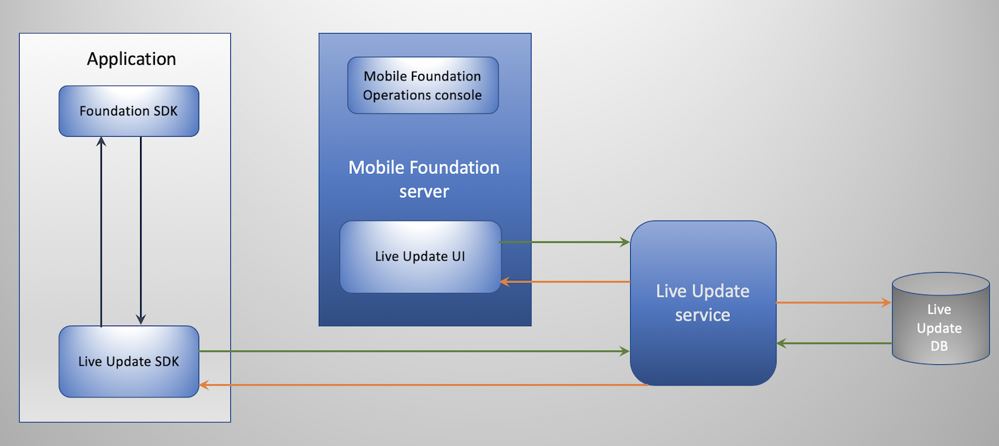
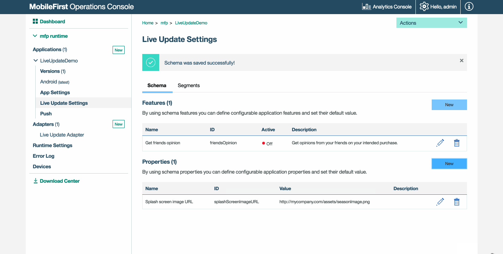

<!-- NLS_CHARSET=UTF-8 -->
## Übersicht
{: #overview }

Mithilfe des Liveaktualisierungsfeatures der {{ site.data.keys.product }} können auf einfache Weise
verschiedene Konfigurationen für Benutzer einer Anwendung definiert und bereitgestellt werden. In der
{{ site.data.keys.mf_console }} gibt es eine Komponente zum Definieren der Konfigurationsstruktur und der Konfigurationswerte. Es gibt ein Client-SDK (für **native** Android- und iOS-Anwendungen und für Cordova-Anwendungen),
das die Konfiguration einliest. 

>**Hinweis**: Ausführliche Informationen zur Verwendung der Liveaktualisierung
mit einem lokalen {{ site.data.keys.mf_server }} finden Sie [hier](live-update/) in der Dokumentation.


### Gängige Anwendungsfälle
{: #common-use-cases }
Die Liveaktualisierung unterstützt das Definieren und Konsumieren von Konfigurationen und vereinfacht so Anpassungen der Anwendung. Es folgt ein Beispiel für einen gängigen Fall:

* Release Trains und Feature Flipping

In künftigen Releases werden die folgenden Anwendungsfälle unterstützt. 

* A/B-Tests
* Kontextbasierte Anpassung der Anwendung (z. B. bei der geografischen Segmentierung)

### Fahren Sie mit folgenden Abschnitten fort:
{: #jump-to }
* [Konzept](#concept)
* [Architektur für Liveaktualisierung](#live-update-architecture)
* [Liveaktualisierung zu {{ site.data.keys.mf_server }} hinzufügen](#adding-live-update-to-mobilefirst-server)
* [Anwendungssicherheit konfigurieren](#configuring-application-security)
* [SDK für Liveaktualisierung zu Anwendungen hinzufügen](#adding-live-update-sdk-to-applications)
* [SDK für Liveaktualisierung](#using-the-live-update-sdk)
* [Themen für Fortgeschrittene](#advanced-topics)

## Konzept
{: #concept }

Der Service für Liveaktualisierung fügt die folgenden Funktionen zu jeder Anwendung hinzu:

1. **Features** - Mit "Features" können Sie konfigurierbare Anwendungsfeatures definieren und deren Standardwerte festlegen.
2. **Properties** - Mit "Properties" können Sie konfigurierbare Anwendungseigenschaften definieren und deren Standardwerte festlegen.

Das Entwickler- oder Anwendungsmanagementteam muss über die folgenden Punkte entscheiden.
* Features, bei denen eine Liveaktualisierung angewendet werden kann, und ihr Standardstatus
* Konfigurierbare Zeichenfolgeeigenschaften und ihre Standardwerte

Sobald über die Parameter entschieden wurde, können Sie die Features und Eigenschaften (Properties) im Abschnitt für Liveaktualisierung zu der App hinzufügen.

<div class="panel-group accordion" id="terminology" role="tablist" aria-multiselectable="false">
    <div class="panel panel-default">
        <div class="panel-heading" role="tab" id="schema">
            <h4 class="panel-title">
                <a class="preventScroll" role="button" data-toggle="collapse" data-parent="#terminology" data-target="#collapseSchema" aria-expanded="false" aria-controls="collapseSchema">Zum Anzeigen der Terminologie hier klicken</a>
            </h4>
        </div>

        <div id="collapseSchema" class="panel-collapse collapse" role="tabpanel" aria-labelledby="schema">
            <div class="panel-body">
                <ul>
                    <li><b>Feature:</b> Ein Feature bestimmt, ob eine Anwendungsfunktion aktiviert oder inaktiviert ist. Wenn in einer Anwendung ein Feature definiert wird, müssen folgende Elemente angegeben werden:
                        <ul>
                            <li><i>id</i> – Eindeutige Feature-ID; nicht editierbare Zeichenfolge</li>
                            <li><i>name</i> - Beschreibender Name des Features; editierbare Zeichenfolge</li>
                            <li><i>description</i> – Kurzbeschreibung des Features; editierbare Zeichenfolge</li>
                            <li><i>defaultValue</i> – Standardwert des Features, der gilt, bis er im Segment überschrieben wird (siehe "Segment" weiter unten); editierbarer boolescher Wert</li>
                        </ul>
                    </li>
                    <li><b>Property:</b> Eine Eigenschaft ist eine Schlüssel-Wert-Entität, mit der Anwendungen angepasst werden können. Wenn eine Eigenschaft definiert wird, müssen folgende Elemente angegeben werden:
                        <ul>
                            <li><i>id</i> – Eindeutige Eigenschafts-ID; nicht editierbare Zeichenfolge</li>
                            <li><i>name</i> - Beschreibender Name der Eigenschaft; editierbare Zeichenfolge</li>
                            <li><i>description</i> – Kurzbeschreibung der Eigenschaft; editierbare Zeichenfolge</li>
                            <li><i>defaultValue</i> – Standardwert der Eigenschaft, der gilt, bis er im Segment überschrieben wird (siehe "Segment" weiter unten); editierbare Zeichenfolge</li>
                        </ul>
                    </li>
                </ul>
            </div>
        </div>
    </div>
</div>


## Architektur für Liveaktualisierung
{: #live-update-architecture }
Die folgenden Systemkomponenten stellen zusammen die Funktionalität für Liveaktualisierungen bereit. 



* **Service für Liveaktualisierung:** Dieser unabhängige Service ermöglicht Folgendes: 
   - Anwendungsmanagement
   - Bereitstellung von Konfigurationen für Anwendungen
* **Clientseitiges SDK:** Das SDK für Liveaktualisierung wird verwendet, um
Konfigurationselemente wie Funktionen und Eigenschaften von {{ site.data.keys.mf_server }} abzurufen und auf diese Elemente zuzugreifen.
* **{{ site.data.keys.mf_console }}:** In der Konsole werden der Adapter für Liveaktualisierung und die zugehörigen Einstellungen konfiguriert. 

## Liveaktualisierung zu {{ site.data.keys.mf_server }} hinzufügen
{: #adding-live-update-to-mobilefirst-server }
Der Service für Liveaktualisierung ist standardmäßig im Paket mit dem Mobile Foundation Developer Kit enthalten.

> Für eine OCP-Installation (OpenShift Container Platform) können Sie sich [hier](../../ibmcloud/mobilefoundation-on-openshift/) in der Dokumentation informieren.  

Wenn der Service für Liveaktualisierung betriebsbereit ist, wird für jede registrierte Anwendung die Anzeige **Einstellungen für
Liveaktuaisierung** angezeigt.

## Anwendungssicherheit konfigurieren
{: #configuring-application-security }
Für die Integration der Liveaktualisierung ist ein Bereichselement erforderlich. Ohne das Bereichselement weist der Service Anforderungen von Clientanwendungen zurück.  

1. Laden Sie die {{ site.data.keys.mf_console }}.
2. Klicken Sie auf **[Ihre Anwendung] → Registerkarte 'Sicherheit' → Zuordnung von Bereichselementen**.
3. Klicken Sie auf **Neu** und geben Sie das Bereichselement `liveupdate.mobileclient` ein.
4. Klicken Sie auf **Hinzufügen**.

Wenn Sie in Ihrer Anwendung eine Sicherheitsüberprüfung verwenden, können Sie das Bereichselement dieser Überprüfung zuordnen. 

> Machen Sie sich mit dem [{{ site.data.keys.product_adj }}-Sicherheitsframework](../../authentication-and-security/) vertraut. 


<br/>

## Features und Eigenschaften mit Standardwerten definieren
{: #define-features-and-properties-with-values }

Nachfolgend sehen Sie, wie Features und Eigenschaften mit Werten definiert werden.



## SDK für Liveaktualisierung zu Anwendungen hinzufügen
{: #adding-live-update-sdk-to-applications}
Das SDK für Liveaktualisierung stellt Entwicklern eine API zur Verfügung, mit der Konfigurationsfeatures und -eigenschaften abgefragt werden, die in der {{ site.data.keys.mf_console }} in der Anwendungsanzeige "Einstellungen für Liveaktualisierung" definiert wurden.

Verwenden Sie für **Cordova** das SDK bis Version *8.0.202003051505*.
* [Dokumentation zum Cordova-Plug-in](https://github.com/mfpdev/mfp-live-update-cordova-plugin)

Verwenden Sie für **Android** die SDK-Version *8.0.202003051505*.
* [Dokumentation zum Android-SDK](https://github.com/mfpdev/mfp-live-update-android-sdk)

Verwenden Sie für **iOS** das SDK bis Version *8.0.202003051505*.
* [Dokumentation zum iOS-Swift-SDK](https://github.com/mfpdev/mfp-live-update-ios-sdk)

### Cordova-Plug-in hinzufügen
{: #adding-the-cordova-plugin }

Führen Sie in Ihrer Cordova-Anwendung den folgenden Befehl aus: 

```bash
cordova plugin add cordova-plugin-mfp-liveupdate
```

### iOS-SDK hinzufügen
{: #adding-the-ios-sdk }
1. Bearbeiten Sie die Podfile Ihrer Anwendung. Fügen Sie den Pod `IBMMobileFirstPlatformFoundationLiveUpdate` hinzu.   
Beispiel: 

   ```xml
   use_frameworks!

   target 'your-Xcode-project-target' do
      pod 'IBMMobileFirstPlatformFoundation'
      pod 'IBMMobileFirstPlatformFoundationLiveUpdate'
   end
   ```

2. Navigieren Sie in einem **Befehlszeilenfenster** zum Stammordner des Xcode-Projekts und führen Sie den folgenden Befehl aus.
  ```bash
  pod install
  ```

### Android-SDK hinzufügen
{: #adding-the-android-sdk }
1. Wählen Sie in Android Studio **Android → Gradle Scripts** aus. Wählen Sie dann die Datei **build.gradle (Module: app)** aus. 
2. Fügen Sie innerhalb von `dependencies` den Eintrag `ibmmobilefirstplatformfoundationliveupdate` hinzu:


   ```xml
   dependencies {
        compile group: 'com.ibm.mobile.foundation',
        name: 'ibmmobilefirstplatformfoundation',
        version: '8.0.+',
        ext: 'aar',
        transitive: true

        compile group: 'com.ibm.mobile.foundation',
        name: 'ibmmobilefirstplatformfoundationliveupdate',
        version: '8.0.0',
        ext: 'aar',
        transitive: true
   }   
   ```

## SDK für Liveaktualisierung
{: #using-the-live-update-sdk }
Es gibt verschiedene Einsatzstrategien für das SDK für Liveaktualisierung. 

### Konfiguration abrufen
{: #obtain-config }
Sie können Logik zum Abrufen der Konfiguration implementieren.   
Ersetzen Sie `property-name` und `feature-name` durch eigene Angaben.

#### Cordova
{: #cordova }
```javascript
    var input = { };
    LiveUpdateManager.obtainConfiguration({useClientCache :false },function(configuration) {
        // Aktion für das Konfigurationsobjekt (JSON) ausführen, wenn Sie beispielsweise
        // im Server ein Feature mit dem Namen 'feature-name' definiert haben:
        // if (configuration.features.feature-name) {
        //   console.log(configuration.properties.property-name);
	// }
    } ,
    function(err) {
        if (err) {            
alert('liveupdate error:'+err);
        }
  });

```

#### iOS
{: #ios }
```swift
LiveUpdateManager.sharedInstance.obtainConfiguration(completionHandler: { (configuration, error) in
  if error == nil {
    print (configuration?.getProperty("property-name"))
    print (configuration?.isFeatureEnabled("feature-name"))
  } else {
    print (error)
  }
})

```

#### Android
{: #android }
```java
LiveUpdateManager.getInstance().obtainConfiguration(new ConfigurationListener() {

    @Override
    public void onSuccess(final Configuration configuration) {
        Log.i("LiveUpdateDemo", configuration.getProperty("property-name"));
        Log.i("LiveUpdateDemo", configuration.isFeatureEnabled("feature-name").toString());
    }

    @Override
    public void onFailure(WLFailResponse wlFailResponse) {
        Log.e("LiveUpdateDemo", wlFailResponse.getErrorMsg());
    }
});

```

Wenn die Konfiguration für Liveaktualisierung abgerufen wurde, können die applikative Logik und der Anwendungsablauf auf der Basis des Zustands von Features und Eigenschaften etabliert werden. Sie können beispielsweise an einem nationalen Feiertag eine neue Werbeaktion in der Anwendung lancieren. 

## Themen für Fortgeschrittene
{: #advanced-topics }

### Caching
{: #caching }
Das Caching ist standardmäßig aktiviert, um Netzlatenzzeiten zu vermeiden. Aktualisierungen werden daher möglicherweise nicht sofort ausgeführt.   
Sie können das Caching inaktivieren, wenn häufigere Aktualisierungen erforderlich sind. 

#### Cordova
{: #cordova-caching }
Den clientseitigen Cache können Sie mit einem optionalen booleschen Flag (_useClientCache_) steuern: 

```javascript
var input = {useClientCache : false };
      LiveUpdateManager.getConfiguration(input,function(configuration) {
              // Aktion für die resultierende Konfiguration ausführen. Beispiel:
                // console.log(configuration.data.properties.property-name);
                // console.log(configuration.data.features.feature-name);
        } ,
        function(err) {
                if (err) {            
alert('liveupdate error:'+err);
                }
  });

```

#### iOS
{: #ios-caching }
```swift
LiveUpdateManager.sharedInstance.obtainConfiguration(useCache: false, completionHandler: { (configuration, error) in
  if error == nil {
    print (configuration?.getProperty("property-name"))
    print (configuration?.isFeatureEnabled("feature-name"))
  } else {
    print (error)
  }
})

```

#### Android
{: #android-caching }
```java
LiveUpdateManager.getInstance().obtainConfiguration(false, new ConfigurationListener() {

    @Override
    public void onSuccess(final Configuration configuration) {
      Log.i("LiveUpdateSample", configuration.getProperty("property-name"));
      Log.i("LiveUpdateSample", configuration.isFeatureEnabled("feature-name").toString());
    }

    @Override
    public void onFailure(WLFailResponse wlFailResponse) {
        Log.e("LiveUpdateSample", wlFailResponse.getErrorMsg());
    }
});

```

### Cacheverfallszeit
{: #cache-expiration }
Der Wert `expirationPeriod` liegt bei 30 Minuten, was der Verfallszeit für den Cache entspricht.
