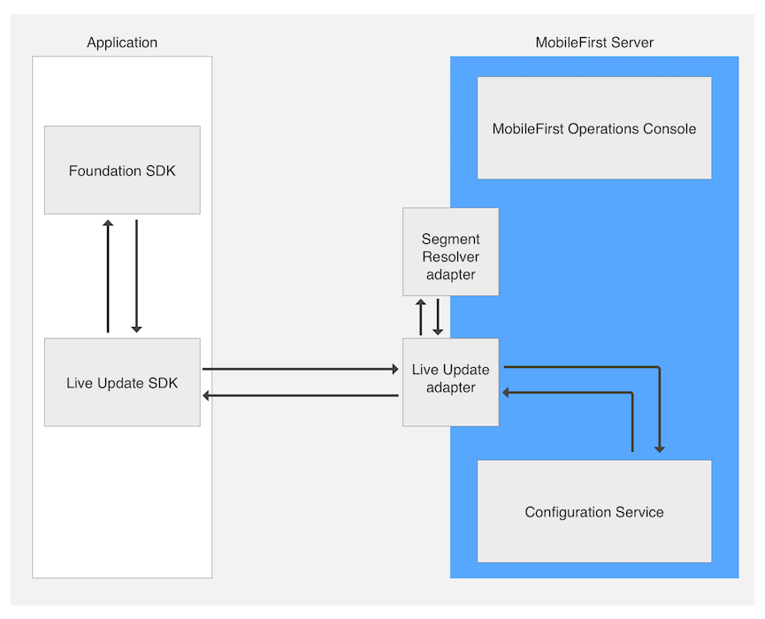

<!-- NLS_CHARSET=UTF-8 -->
## Übersicht
{: #overview }
Benutzersegmente sind Benutzergruppen, die Benutzer mit jeweils ähnlichen Eigenschaften enthalten. Ein allgemeines Beispiel für die Erstellung von Benutzersegmenten ist die
[geografische Segmentierung](https://en.wikipedia.org/wiki/Market_segmentation#Geographic_segmentation), bei der Benutzer
ausgehend von der Geografie in Gruppen unterteilt werden. Ziel solcher Benutzersegmente ist es, den Wert für die Benutzer der einzelnen Segmente zu optimieren. 

Mithilfe des Liveaktualisierungsfeatures der {{ site.data.keys.product }} können auf einfache Weise
verschiedene Konfigurationen für einzelne Benutzersegmente einer Anwendung definiert und bereitgestellt werden. In der
{{ site.data.keys.mf_console }} gibt es eine Komponente zum Definieren der Konfigurationsstruktur und der Konfigurationswerte
für jedes Segment. Darüber hinaus gibt es ein Client-SDK (für **native** Android- und iOS-Anwendungen und für Cordova-Anwendungen),
das die Konfiguration einliest. 

#### Gängige Anwendungsfälle
{: #common-use-cases }
Die Liveaktualisierung unterstützt das Definieren und Konsumieren von Segmentkonfigurationen und vereinfacht so segmentgerechte Anpassungen der Anwendung. Allgemeine Anwendungsfälle sind: 

* Release Trains und Feature Flipping
* A/B-Tests
* Kontextbasierte Anpassung der Anwendung (z. B. bei der geografischen Segmentierung)

#### Demonstration
{: #demonstration }
Im folgenden Video wird das Feature für Liveaktualisierung demonstriert. 

<div class="sizer">
    <div class="embed-responsive embed-responsive-16by9">
        <iframe src="https://www.youtube.com/embed/TjbC9thSfmM"></iframe>
    </div>
</div>

#### Fahren Sie mit folgenden Abschnitten fort: 
{: #jump-to }
* [Architektur für Liveaktualisierung](#live-update-architecture)
* [Liveaktualisierung zu {{ site.data.keys.mf_server }} hinzufügen](#adding-live-update-to-mobilefirst-server)
* [Anwendungssicherheit konfigurieren](#configuring-application-security)
* [Schema und Segmente](#schema-and-segments)
* [SDK für Liveaktualisierung zu Anwendungen hinzufügen](#adding-live-update-sdk-to-applications)
* [SDK für Liveaktualisierung](#using-the-live-update-sdk)
* [Themen für Fortgeschrittene](#advanced-topics)
* [Beispielanwendung](#sample-application)


## Architektur für Liveaktualisierung
{: #live-update-architecture }
Die folgenden Systemkomponenten stellen zusammen die Funktionalität für Liveaktualisierungen bereit. 



* **Adapter für Liveaktualisierung:** Dieser Adapter ermöglicht Folgendes: 
 - Verwaltung von Anwendungsschema und Segmenten
 - Bereitstellung von Konfigurationen für Anwendungen
* **Segment-Resolver-Adapter:** Dieser angepasste (und *optionale*) Adapter wird vom Entwickler implementiert. Der Adapter empfängt einen Anwendungskontext (z. B. einen Geräte- und Benutzerkontext mit angepassten Parametern)
und gibt die ID eines Segments zurück, das mit dem Kontext korrespondiert. 
* **Clientseitiges SDK:** Das SDK für Liveaktualisierung wird verwendet, um
Konfigurationselemente wie Funktionen und Eigenschaften von {{ site.data.keys.mf_server }} abzurufen und auf diese Elemente zuzugreifen.
* **{{ site.data.keys.mf_console }}:** In der Konsole werden der Adapter für Liveaktualisierung und die zugehörigen Einstellungen konfiguriert. 
* **Konfigurationsservice:** Dieser *interne* Service ermöglicht die Verwaltung der Konfiguration des Adapters für Liveaktualisierung. 

## Liveaktualisierung zu {{ site.data.keys.mf_server }} hinzufügen
{: #adding-live-update-to-mobilefirst-server }
Standardmäßig werden die Einstellungen für Liveaktualisierung in der {{ site.data.keys.mf_console }} ausgeblendet. Zum Aktivieren der Einstellungen muss der Adapter für Liveaktualisierung implementiert werden.   

1. Öffnen Sie die {{ site.data.keys.mf_console }}. Klicken Sie im Seitenleistennavigator auf **Download-Center** und dann auf das Register **Tools**. 
2. Laden Sie den Adapter für Liveaktualisierung herunter und implementieren Sie ihn. 

Nach der Implementierung können Sie für jede registrierte Anwendung die Anzeige **Einstellungen für
Liveaktuaisierung** sehen. 


## Anwendungssicherheit konfigurieren
{: #configuring-application-security }
Für die Integration der Liveaktualisierung ist ein Bereichselement erforderlich. Ohne dieses Element weist der Adapter Anforderungen von Clientanwendungen zurück.   

Laden Sie die {{ site.data.keys.mf_console }} und klicken Sie auf **[Ihre Anwendung]**. Klicken Sie auf der Registerkarte **Sicherheit**
auf **Zuordnung von Bereichselementen**. Klicken Sie auf **Neu** und geben Sie das Bereichselement **configuration-user-login** ein. Klicken Sie dann auf **Hinzufügen**.

Wenn Sie in Ihrer Anwendung eine Sicherheitsüberprüfung verwenden, können Sie das Bereichselement dieser Überprüfung zuordnen. 

> Machen Sie sich mit dem [{{ site.data.keys.product_adj }}-Sicherheitsframework](../../authentication-and-security/) vertraut. 


## Schema und Segmente
{: #schema-and-segments }
Die Anzeige "Einstellungen für Liveaktualisierung" umfasst zwei Registerkarten: 

#### Schema
{: #schema }
In einem Schema sind Features und Eigenschaften definiert.   

* Mit "features" können Sie konfigurierbare Anwendungsfeatures definieren und deren Standardwerte festlegen.   
* Mit "properties" können Sie konfigurierbare Anwendungseigenschaften definieren und deren Standardwerte festlegen. 

#### Segmente
{: #segments }
Segmente definieren ein eindeutiges Anwendungsverhalten, das durch eine Anpassung der im Schema definierten Standardfeatures und Standardeigenschaften entsteht. 

### Schema und Segmente hinzufügen
{: #adding-schema-and-segments }
Bevor das Entwickler- oder Produktmanagementteam ein Schema und Segmente hinzufügt, muss eine Entscheidung bezüglich verschiedener Punkte getroffen werden: 

* Features (**features**), die die Liveaktualisierung nutzen sollen, und der Standardzustand dieser Features
* Konfigurierbare Zeichenfolgen (**properties**) und ihre Standardwerte
* Marktsegmente für die Anwendung

Für jedes Marktsegment muss Folgendes entschieden werden: 

* Zustand der einzelnen Features und mögliche Änderungen dieses Zustands wählrend der Anwendungslaufzeit
* Wert der einzelnen Eigenschaften und mögliche Änderungen dieses Wertes wählrend der Anwendungslaufzeit

<br/>
Sobald über die Parameter entschieden wurde, können Schemafeatures und -eigenschaften und Segmente hinzugefügt werden.   
Klicken Sie dazu auf **Neu** und geben Sie die erforderlichen Werte an.

<div class="panel-group accordion" id="terminology" role="tablist" aria-multiselectable="false">
    <div class="panel panel-default">
        <div class="panel-heading" role="tab" id="schema">
            <h4 class="panel-title">
                <a class="preventScroll" role="button" data-toggle="collapse" data-parent="#terminology" data-target="#collapseSchema" aria-expanded="false" aria-controls="collapseSchema">Zum Anzeigen der Schematerminologie hier klicken</a>
            </h4>
        </div>

        <div id="collapseSchema" class="panel-collapse collapse" role="tabpanel" aria-labelledby="schema">
            <div class="panel-body">
                <ul>
                    <li><b>Feature:</b> Ein Feature bestimmt, ob eine Anwendungsfunktion aktiviert oder inaktiviert ist. Wenn im Schema einer Anwendung ein Feature definiert wird, müssen folgende Elemente angegeben werden:
                        <ul>
                            <li><i>id</i> – Eindeutige Feature-ID; nicht editierbare Zeichenfolge</li>
                            <li><i>name</i> - Beschreibender Name des Features; editierbare Zeichenfolge</li>
                            <li><i>description</i> – Kurzbeschreibung des Features; editierbare Zeichenfolge</li>
                            <li><i>defaultValue</i> – Standardwert des Features, der gilt, bis er im Segment überschrieben wird (siehe "Segment" weiter unten); editierbarer boolescher Wert</li>
                        </ul>
                    </li>
                    <li><b>Property:</b> Eine Eigenschaft ist eine Schlüssel-Wert-Entität, mit der Anwendungen angepasst werden können. Wenn im Schema einer Anwendung eine Eigenschaft definiert wird, müssen folgende Elemente angegeben werden:
                        <ul>
                            <li><i>id</i> – Eindeutige Eigenschafts-ID; nicht editierbare Zeichenfolge</li>
                            <li><i>name</i> - Beschreibender Name der Eigenschaft; editierbare Zeichenfolge</li>
                            <li><i>description</i> – Kurzbeschreibung der Eigenschaft; editierbare Zeichenfolge</li>
                            <li><i>defaultValue</i> – Standardwert der Eigenschaft, der gilt, bis er im Segment überschrieben wird (siehe "Segment" weiter unten); editierbare Zeichenfolge</li>
                        </ul>
                    </li>
                </ul>
            </div>
        </div>
    </div>

    <div class="panel panel-default">
        <div class="panel-heading" role="tab" id="segment">
            <h4 class="panel-title">
                <a class="preventScroll" role="button" data-toggle="collapse" data-parent="#terminology" data-target="#collapseSegment" aria-expanded="false" aria-controls="collapseSegment">Zum Anzeigen der Segmentterminologie hier klicken</a>
            </h4>
        </div>

        <div id="collapseSegment" class="panel-collapse collapse" role="tabpanel" aria-labelledby="segment">
            <div class="panel-body">
                <ul>
                    <li><b>Segment:</b> Eine Entität, die einem Marktsegment entspricht und die im Schema definierten Features und Eigenschaften sowie ggf. Vorrangwerte enthält. Wenn ein Segment definiert wird, müssen folgende Elemente angegeben werden:
                        <ul>
                            <li><i>id</i> – Eindeutige Segmentkennung; nicht editierbare Zeichenfolge</li>
                            <li><i>name</i> - Beschreibender Name des Segments; editierbare Zeichenfolge</li>
                            <li><i>description</i> – Kurzbeschreibung des Segments; editierbare Zeichenfolge</li>
                            <li><i>Features</i>  - Liste der im Schema definierten Features. Der Benutzer kann ein vom Standardwert im Schema abweichenden statischen Wert für ein Feature festlegen.</li>
                            <li><i>Properties</i>  - Liste der im Schema definierten Eigenschaften. Der Benutzer kann ein vom Standardwert im Schema abweichenden statischen Wert für eine Eigenschaft festlegen.</li>
                        </ul>
                    </li>
                </ul>

                <blockquote><b>Hinweis:</b><br/>
                    <ul>
                        <li>Wenn ein Feature oder eine Eigenschaft zum Schema hinzugefügt wird, wird automatisch zu allen Segmenten einer Anwendung ein entsprechendes Feature oder eine entsprechende Eigenschaft (mit dem Standardwert) hinzugefügt.</li>
                        <li>Wenn ein Feature oder eine Eigenschaft aus dem Schema entfernt wird, wird das entsprechende Feature oder die entsprechende Eigenschaft automatisch aus allen Segmenten einer Anwendung entfernt.</li>
                    </ul>
                </blockquote>
            </div>
        </div>
    </div>
</div>

#### Schemafeatures und -eigenschaften mit Standardwerten definieren
{: #define-schema-features-and-properties-with-default-values }


#### Marktsegmente definieren
{: #define-degments-that-correspond-to-market-segments }


#### Standardwert von Features und Eigenschaften überschreiben
{: #override-default-values-of-features-and-properties }
Sie können ein Feature aktivieren und den Standardzustand des Features ändern. 


Sie können den Standardwert einer Eigenschaft überschreiben. 


## SDK für Liveaktualisierung zu Anwendungen hinzufügen
{: #adding-live-update-sdk-to-applications}
Das SDK für Liveaktualisierung stellt Entwicklern eine API zur Verfügung, mit der Konfigurationsfeatures und -eigenschaften abgefragt werden, die in der {{ site.data.keys.mf_console }} in der Anwendungsanzeige "Einstellungen für Liveaktualisierung" definiert wurden.

* [Dokumentation zum Cordova-Plug-in](https://github.com/mfpdev/mfp-live-update-cordova-plugin)
* [Dokumentation zum iOS-Swift-SDK](https://github.com/mfpdev/mfp-live-update-ios-sdk)
* [Dokumentation zum Android-SDK](https://github.com/mfpdev/mfp-live-update-android-sdk)

### Cordova-Plug-in hinzufügen
{: #adding-the-cordova-plugin }
Führen Sie in Ihrer Cordova-Anwendung den folgenden Befehl aus: 

```bash
cordova plugin add cordova-plugin-mfp-liveupdate
```

### iOS-SDK hinzufügen
{: #adding-the-ios-sdk }
1. Bearbeiten Sie die Podfile Ihrer Anwendung. Fügen Sie den Pod `IBMMobileFirstPlatformFoundationLiveUpdate` hinzu.   
Beispiel: 

   ```xml
   use_frameworks!

   target 'your-Xcode-project-target' do
      pod 'IBMMobileFirstPlatformFoundation'
      pod 'IBMMobileFirstPlatformFoundationLiveUpdate'
   end
   ```

2. Navigieren Sie in einem **Befehlszeilenfenster** zum Stammordner des Xcode-Projekts und führen Sie den Befehl
`pod install` aus.

### Android-SDK hinzufügen
{: #adding-the-android-sdk }
1. Wählen Sie in Android Studio **Android → Gradle Scripts** aus. Wählen Sie dann die Datei **build.gradle (Module: app)** aus. 
2. Fügen Sie innerhalb von `dependencies` den Eintrag `ibmmobilefirstplatformfoundationliveupdate` hinzu:


   ```xml
   dependencies {
        compile group: 'com.ibm.mobile.foundation',
        name: 'ibmmobilefirstplatformfoundation',
        version: '8.0.+',
        ext: 'aar',
        transitive: true

        compile group: 'com.ibm.mobile.foundation',
        name: 'ibmmobilefirstplatformfoundationliveupdate',
        version: '8.0.0',
        ext: 'aar',
        transitive: true
   }   
   ```

## SDK für Liveaktualisierung
{: #using-the-live-update-sdk }
Es gibt verschiedene Einsatzstrategien für das SDK für Liveaktualisierung. 

### Vordefiniertes Segment
{: #pre-determined-segment }
Sie können Logik zum Abrufen der Konfiguration eines relevanten Segments implementieren.   
Ersetzen Sie "segment-name", "property-name" und "feature-name" durch eigene Werte. 

#### Cordova
{: #cordova }
```javascript
    var input = { segmentId :'segment-name' };
    LiveUpdateManager.obtainConfiguration(input,function(configuration) {
        // Aktion für das Konfigurationsobjekt (JSON) ausführen, wenn Sie beispielsweise
        // im Server ein Feature mit dem Namen 'feature-name' definiert haben:
        // if (configuration.features.feature-name) {
        //   console.log(configuration.properties.property-name);
	// }
    } ,
    function(err) {
        if (err) {            
alert('liveupdate error:'+err);
        }
  });
```

#### iOS
{: #ios }
```swift
LiveUpdateManager.sharedInstance.obtainConfiguration("segment-name", completionHandler: { (configuration, error) in
  if error == nil {
    print (configuration?.getProperty("property-name"))
    print (configuration?.isFeatureEnabled("feature-name"))
  } else {
    print (error)
  }
})
```

#### Android
{: #android }
```java
LiveUpdateManager.getInstance().obtainConfiguration("segment-name", new ConfigurationListener() {

    @Override
    public void onSuccess(final Configuration configuration) {
        Log.i("LiveUpdateDemo", configuration.getProperty("property-name"));
        Log.i("LiveUpdateDemo", configuration.isFeatureEnabled("feature-name").toString());
    }

    @Override
    public void onFailure(WLFailResponse wlFailResponse) {
        Log.e("LiveUpdateDemo", wlFailResponse.getErrorMsg());
    }
});
```

Wenn die Konfiguration für Liveaktualisierung abgerufen wurde, können die applikative Logik und der Anwendungsablauf auf der Basis des Zustands von Features und Eigenschaften etabliert werden. Sie können beispielsweise an einem nationalen Feiertag eine neue Werbeaktion in der Anwendung lancieren. 

### Segment-Resolver-Adapter
{: #segment-resolver-adapter }
Im Abschnitt [Architektur für Liveaktualisierung](#live-update-architecture) wurde ein Segment-Resolver-Adapter erwähnt.   
Dieser Adapter hat die Aufgabe, angepasste Geschäftslogik bereitzustellen, die einen segmentbasierten Anwendungs-/Geräte-/Benutzerkontext und angepasste applikative Parameter abruft. 

Gehen Sie für die Verwendung eines Segment-Resolver-Adapters wie folgt vor: 

1. [Erstellen Sie einen neuen Java-Adapter](../../adapters/creating-adapters/).
2. Definieren Sie den Adapter unter **Adapters → Live Update adapter → segmentResolverAdapterName** als Segment-Resolver-Adapter.
3. Vergessen Sie nicht, [einen Adpaterbuild zu erstellen und den Adapter zu implementieren](../../adapters/creating-adapters/).

Der Segment-Resolver-Adapter definiert eine REST-Schnittstelle. Eine Anforderung an diesen Adapter enthält in ihrem Hauptteil alle Informationen, die benötigt werden,
um zu entscheiden, zu welchem Segment der Endbenutzer gehört. Das ermittelte Segment wird zurück an die Anwendung gesendet. 

Wenn Sie die einzelnen Konfigurationsparameter abrufen möchten, senden Sie die Anforderung über die API für Liveaktualisierung: 

#### Cordova
{: cordova-resolver }
```javascript
var input = { params : { 'paramKey': 'paramValue'} ,useClientCache : true };                                                                                                    
LiveUpdateManager.obtainConfiguration(input,function(configuration) {
        // Aktion für das Konfigurationsobjekt (JSON) ausführen, z. B.
        // console.log(configuration.properties.property-name);
        // console.log(configuration.data.features.feature-name);
    } ,
    function(err) {
        if (err) {            
alert('liveupdate error:'+err);
        }
  });
```

#### iOS
{: #ios-resolver }
```swift
LiveUpdateManager.sharedInstance.obtainConfiguration(["paramKey":"paramValue"], completionHandler: { (configuration, error) in
  if error == nil {
    print (configuration?.getProperty("property-name"))
    print (configuration?.isFeatureEnabled("feature-name"))
  } else {
    print (error)
  }
})
```

#### Android
{: #android-resolver }
```java
Map <String,String> params = new HashMap<>();
params.put("paramKey", "paramValue");

LiveUpdateManager.getInstance().obtainConfiguration(params , new ConfigurationListener() {

    @Override
    public void onSuccess(final Configuration configuration) {
        Log.i("LiveUpdateDemo", configuration.getProperty("property-name"));
        Log.i("LiveUpdateDemo", configuration.isFeatureEnabled("feature-name").toString());
    }

    @Override
    public void onFailure(WLFailResponse wlFailResponse) {
        Log.e("LiveUpdateDemo", wlFailResponse.getErrorMsg());
    }
});
```

#### Adapterimplementierung
{: #adapter-implementation }
Die von der Anwendung mithilfe des Client-SDK für Liveaktualisierung bereitgestellten Argumente werden dann an den Adapter für Liveaktualisierung und von dort an den
Segment-Resolver-Adapter übergeben. Diesen Schritt führt der Adapter für Liveaktualisierung automatisch aus. Eine Aktion des Entwicklers ist nicht erforderlich. 

Aktualisieren Sie die Immplementierung Ihres neu erstellten Segment-Resolver-Adapters, damit von diesen Argumenten das relevante Segment zurückgegeben wird.   
Dafür können Sie den folgenden Beispielcode verwenden. 

**Hinweis:** Sie müssen die Gson-Abhängigkeit zur Datei `pom.xml` Ihres Adapters hinzufügen. 

```xml
<dependency>
    <groupId>com.google.code.gson</groupId>
    <artifactId>gson</artifactId>
    <version>2.7</version>
</dependency>
```

**SampleSegmentResolverAdapterApplication.java**  

```java
@Api(value = "Sample segment resolver adapter")
@Path("/")
public class SampleSegmentResolverAdapter {

    private static final Gson gson = new Gson();
    private static final Logger logger = Logger.getLogger(SampleSegmentResolverAdapter.class.getName());

    @POST
    @Path("segment")
    @Produces("text/plain;charset=UTF-8")
    @OAuthSecurity(enabled = true, scope = "configuration-user-login")
    public String getSegment(String body) throws Exception {
        ResolverAdapterData data = gson.fromJson(body, ResolverAdapterData.class);
        String segmentName = "";

        // Angepasste Argumente abrufen
        Map<String, List<String>> arguments = data.getQueryArguments();

        // authenticatedUser-Objekt abrufen
        AuthenticatedUser authenticatedUser = data.getAuthenticatedUser();
        String name = authenticatedUser.getDisplayName();

        // Registrierungsdaten abrufen (z. B. Gerät und Anwendung)
        RegistrationData registrationData = data.getRegistrationData();
        ApplicationKey application = registrationData.getApplication();
        DeviceData deviceData = registrationData.getDevice();

        // Segmentnamen auf der Basis des obigen Kontextes (arguments, authenticatedUser und registrationData) auflösen.
        // Angepasste Logik zur Auflösung des Segmentnamens schreiben

        return segmentName;
    }
}
```

**SampleSegmentResolverAdapter.java**

```java
public class ResolverAdapterData {
    public ResolverAdapterData() {
    }

    public ResolverAdapterData(AdapterSecurityContext asc, Map<String, List<String>> queryArguments)
    {
        ClientData cd = asc.getClientRegistrationData();

        this.authenticatedUser = asc.getAuthenticatedUser();
        this.registrationData = cd == null ? null : cd.getRegistration();
        this.queryArguments = queryArguments;
    }

    public AuthenticatedUser getAuthenticatedUser() {
        return authenticatedUser;
    }

    public RegistrationData getRegistrationData() {
        return registrationData;
    }

    public Map<String, List<String>> getQueryArguments() {
        return queryArguments;
    }

    private AuthenticatedUser authenticatedUser;
    private RegistrationData registrationData;
    private Map<String, List<String>> queryArguments;
}
```

#### REST-Schnittstelle des Segment-Resolver-Adapters
{: #rest-interface-of-the-segment-resolver-adapter }
**Anforderung**

| **Attribut** |  **Wert**                                                                                     |  
|:----------------|:--------------------------------------------------------------------------------------------------|
| *URL*           | /segment                                                                                          |
| *Method*        | POST                                                                                              |               
| *Content-type*  | application/json                                                                                  |
| *Body*          | &lt;JSON-Objekt mit allen erforderlichen Informationen für die Segmentauflösung&gt;                     |

**Antwort**

|  **Attribut**   |  **Wert**                                |
|:-------------------|:--------------------------------------------|
| *Content-type*     | text/plain                                  |                                                                          
| *Body*             |  &lt;Zeichenfolge mit einer Beschreibung der Segment-ID&gt;   |


## Themen für Fortgeschrittene
{: #advanced-topics }
### Import/Export
{: #importexport }
Der Systemadministrator kann definierte Schemata und Segmente exportieren und in andere Serverinstanzen importieren. 

#### Schema exportieren
{: #export-schema }
```bash
curl --user admin:admin http://localhost:9080/mfpadmin/management-apis/2.0/runtimes/mfp/admin-plugins/liveUpdateAdapter/com.sample.HelloLiveUpdate/schema > schema.txt
```

#### Schema importieren
{: #import-schema }
```bash
curl -X PUT -d @schema.txt --user admin:admin -H "Content-Type:application/json" http://localhost:9080/mfpadmin/management-apis/2.0/runtimes/mfp/admin-plugins/liveUpdateAdapter/com.sample.HelloLiveUpdate/schema
```

* Ersetzen Sie "admin:admin" durch Ihre eigenen Werte. (Der Standardwert ist "admin".)
* Ersetzen Sie "localhost" und die Portnummer ggf. durch eigene Werte. 
* Ersetzen Sie die Anwendungskennung "com.sample.HelloLiveUpdate" durch die Kennung Ihrer eigenen Anwendung. 

#### Segment(e) exportieren
{: #export-segments }
```bash
curl --user admin:admin http://localhost:9080/mfpadmin/management-apis/2.0/runtimes/mfp/admin-plugins/liveUpdateAdapter/com.sample.HelloLiveUpdate/segment?embedObjects=true > segments.txt
```

#### Segment(e) importieren
{: #import-segments }
```bash
#!/bin/bash
segments_number=$(python -c 'import json,sys;obj=json.load(sys.stdin);print len(obj["items"]);' < segments.txt)
counter=0
while [ $segments_number -gt $counter ]
do
    segment=$(cat segments.txt | python -c 'import json,sys;obj=json.load(sys.stdin);data_str=json.dumps(obj["items"]['$counter']);print data_str;')
    echo $segment | curl -X POST -d @- --user admin:admin --header "Content-Type:application/json" http://localhost:9080/mfpadmin/management-apis/2.0/runtimes/mfp/admin-plugins/liveUpdateAdapter/com.sample.HelloLiveUpdate/segment
    ((counter++))
done
```

* Ersetzen Sie "admin:admin" durch Ihre eigenen Werte. (Der Standardwert ist "admin".)
* Ersetzen Sie "localhost" und die Portnummer ggf. durch eigene Werte. 
* Ersetzen Sie die Anwendungskennung "com.sample.HelloLiveUpdate" durch die Kennung Ihrer eigenen Anwendung. 

### Caching
{: #caching }
Das Caching ist standardmäßig aktiviert, um Netzlatenzzeiten zu vermeiden. Aktualisierungen werden daher möglicherweise nicht sofort ausgeführt.   
Sie können das Caching inaktivieren, wenn häufigere Aktualisierungen erforderlich sind. 

#### Cordova
{: #cordova-caching }
Den clientseitigen Cache können Sie mit einem optionalen booleschen Flag (*useClientCache*) steuern: 

```javascript
	var input = { segmentId :'18' ,useClientCache : false };
        LiveUpdateManager.getConfiguration(input,function(configuration) {
                // Aktion für die resultierende Konfiguration ausführen. Beispiel:
                // console.log(configuration.data.properties.property-name);
                // console.log(configuration.data.features.feature-name);
        } ,
        function(err) {
                if (err) {            
alert('liveupdate error:'+err);
                }
  });
```

#### iOS
{: #ios-caching }
```swift
LiveUpdateManager.sharedInstance.obtainConfiguration("segment-name", useCache: false, completionHandler: { (configuration, error) in
  if error == nil {
    print (configuration?.getProperty("property-name"))
    print (configuration?.isFeatureEnabled("feature-name"))
  } else {
    print (error)
  }
})
```

#### Android
{: #android-caching }
```java
LiveUpdateManager.getInstance().obtainConfiguration("segment-name", false, new ConfigurationListener() {

    @Override
    public void onSuccess(final Configuration configuration) {
      Log.i("LiveUpdateSample", configuration.getProperty("property-name"));
      Log.i("LiveUpdateSample", configuration.isFeatureEnabled("feature-name").toString());
    }

    @Override
    public void onFailure(WLFailResponse wlFailResponse) {
        Log.e("LiveUpdateSample", wlFailResponse.getErrorMsg());
    }
});
```

### Cacheverfallszeit
{: #cache-expiration }
Der Wert `expirationPeriod` wird unter **Adapters → Live Update adapter** definiert und gibt
die Verfallszeit für den Cache vor. 


## Beispielanwendung
{: #sample-application }
Wenn Sie in der Beispielanwendung ein Landesattribut auswählen und die Liveaktualisierung anwenden, gibt die App Text in der Sprache des ausgewählten Landes aus. Wenn Sie das Kartenfeature aktivieren und die Karte bereitstellen, wird eine Karte des entsprechenden Landes angezeigt. 

[Klicken Sie hier](https://github.com/MobileFirst-Platform-Developer-Center/LiveUpdateSwift/tree/release80), um das Xcode-Projekt herunterzuladen.   
[Klicken Sie hier](https://github.com/MobileFirst-Platform-Developer-Center/LiveUpdateAndroid/tree/release80), um das Android-Studio-Projekt herunterzuladen. 

### Verwendung des Beispiels
{: #sample-usage }
Anweisungen finden Sie in der Datei README.md zum Beispiel. 

#### Einstellungen für Liveaktualisierung ändern
{: #changing-live-update-settings }
Jedes Segment emfpängt den Standardwert aus dem Schema. Ändern Sie die einzelnen Segmente entsprechend der Sprache. Fügen Sie für Französich beispielsweise Folgendes hinzu: **helloText** - **Bonjour le monde**.

Klicken Sie in der {{ site.data.keys.mf_console }} unter **[Ihre Anwendung] → Einstellungen für Liveaktualisierung** auf der Registerkarte
**Segmente** auf den Link **Eigenschaften** für die Sprache, z. B. für **FR**.

* Klicken Sie auf das Symbol **Bearbeiten** und stellen Sie einen Link zu einem Bild bereit, das beispielsweise die Landkarte für Frankreich zeigt. 
* Wenn Sie die Karte sehen möchten, während Sie die App verwenden, müssen Sie das Feature `includeMap` aktivieren. 
