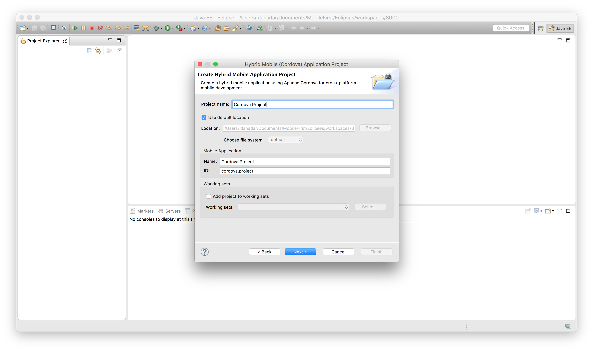

<!-- NLS_CHARSET=UTF-8 -->
## Übersicht
{: #overview }
Mit der Cordova-CLI können Sie Ihre Cordova-Anwendungen erstellen und verwalten. Für denselben Zweck können Sie die Eclipse-IDE nutzen. Verwenden Sie in dem Fall
das Plug-in [THyM](https://www.eclipse.org/thym/). 

THyM bietet Unterstützung für den Import und die Verwaltung von Cordova-Projekten in Eclipse. Sie können sowohl neue Cordova-Projekte erstellen als auch vorhandene Cordova-Projekte importieren. Über das genannte Plug-in können Sie zudem Cordova-Plug-ins in Ihrem Projekt installieren. 

Machen Sie sich auf der [offiziellen Website](https://www.eclipse.org/thym/) mit THyM vertraut.

Das MobileFirst-Studio-Plug-in für Eclipse macht {{ site.data.keys.product_adj }}-Befehle in der Eclipse-IDE verfügbar.
Namentlich werden die folgenden Befehle bereitgestellt: Open Server Console, Preview App, Register App, Encrypt App, Pull App, Push App, Update App.

In diesem Lernprogramm werden wir uns mit der Installation des Plug-ins THyM und des MobileFirst-Eclipse-Plug-ins beschäftigen.

**Voraussetzungen:**

* {{ site.data.keys.mf_server }} wird lokal oder fern ausgeführt. 
* Die {{ site.data.keys.mf_cli }} ist auf der Entwicklerworkstation installiert. 

#### Fahren Sie mit folgenden Abschnitten fort: 
{: #jump-to }
* [MobileFirst-Plug-in installieren](#installing-the-mobilefirst-studio-plug-in)
* [Plug-in THyM installieren](#installing-the-thym-plug-in)
* [Cordova-Projekt erstellen](#creating-a-cordova-project)
* [Vorhandenes Cordova-Projekt importieren](#importing-an-existing-cordova-project)
* [{{ site.data.keys.product_adj }}-SDK zu einem Cordova-Projekt hinzufügen](#adding-the-mobilefirst-sdk-to-cordova-project)
* [{{ site.data.keys.product_adj }}-Befehle](#mobilefirst-commands)
* [Tipps und Tricks](#tips-and-tricks)

## MobileFirst-Plug-in installieren
{: #installing-the-mobilefirst-studio-plug-in}
1. Klicken Sie in Eclipse auf **Hilfe → Eclipse Marketplace...**
2. Suchen Sie nach "{{ site.data.keys.product_adj }}" und klicken Sie auf "Go". 
3. Klicken Sie auf "Install". 

	

4. Schließen Sie den Installationsprozess ab. 
5. Starten Sie Eclipse neu, damit die Installation wirksam wird. 

## Plug-in THyM installieren
{: #installing-the-thym-plug-in }
**Hinweis:** Wenn Sie THyM ausführen möchten, müssen Sie mit Eclipse Mars oder einer neueren Eclipse-Version arbeiten. 

1. Klicken Sie in Eclipse auf **Hilfe → Eclipse Marketplace...**
2. Suchen Sie nach "thym" und klicken Sie auf "Go". 
3. Klicken Sie für "Eclipse Thym" auf "Install". 

	

4. Schließen Sie den Installationsprozess ab. 
5. Starten Sie Eclipse neu, damit die Installation wirksam wird. 

## Cordova-Projekt erstellen
{: #creating-a-cordova-project }
In diesem Abschnitt geht es um die Ertellung eines neuen Cordova-Projekts unter Verwendung von THyM.

1. Klicken Sie in Eclipse auf **Datei → Neu → Andere...**
2. Grenzen Sie die Optionen ein, indem Sie nach "Cordova" suchen. Wählen Sie unter **Mobile** den Eintrag **Hybrid Mobile (Cordova) Application Project** aus und klicken Sie auf **Next**.

	

3. Benennen Sie das Projekt und klicken Sie auf **Next**.

	

4. Fügen Sie die gewünschte Plattform zu Ihrem Projekt hinzu und klicken Sie auf **Finish**.

**Hinweis**: Wenn Sie nach der Erstellung zusätzliche Plattformen benötigen, lesen Sie die Informationen unter [Plattformen hinzufügen](#adding-platforms). 

## Vorhandenes Cordova-Projekt importieren
{: #importing-an-existing-cordova-project }
In diesem Abschnitt geht es um den Import eines vorhandenen Cordova-Projekts, das unter Verwendung der Cordova-CLI erstellt wurde. 

1. Klicken Sie in Eclipse auf **Datei → Importieren...**
2. Wählen Sie unter **Mobile** den Eintrag **Cordova-Projekt importieren** aus und klicken Sie auf **Weiter >**.
3. Klicken Sie auf **Durchsuchen...** und wählen Sie das Stammverzeichnis des vorhandenen Cordova-Projekts aus. 
4. Vergewissern Sie sich, dass das Projekt im Abschnitt "Projekte:" markiert ist. Klicken Sie dann auf **Fertigstellen**.
	

Wenn Sie ein Projekt ohne Plattformen importieren, wird der folgende Fehler angezeigt. Im Abschnitt [Plattformen hinzufügen](#adding-platforms) erfahren Sie, wie dieser Fehler behoben wird.

**Hinweis**: Wenn Sie nach einem Import zusätzliche Plattformen benötigen, lesen Sie die Informationen unter [Plattformen hinzufügen](#adding-platforms). 

## {{ site.data.keys.product_adj }}-SDK zu einem Cordova-Projekt hinzufügen
{: #adding-the-mobilefirst-sdk-to-cordova-project }
Wenn Sie [THyM](#installing-the-thym-plug-in) und das
[MobileFirst-Studio-Plug-in](#installing-the-mobilefirst-studio-plug-in) in Eclipse installiert
und ein [Cordova-Projekt erstellt](#creating-a-cordova-project) oder
[importiert](#importing-an-existing-cordova-project) haben, können Sie die folgenden Schritte ausführen, um mit dem Cordova-Plug-in das
{{ site.data.keys.product_adj }}-SDK zu installieren. 

1. Klicken Sie im Projektexplorer mit der rechten Maustaste auf den Ordner
**plugins** und wählen Sie **Install Cordova Plug-in** aus. 
2. Suchen Sie im angezeigten Dialogfenster auf der Registerkarte "Registry" nach **mfp**
und wählen Sie **cordova-plugin-mfp** aus. Klicken Sie dann auf **Finish**. 

	

## {{ site.data.keys.product_adj }}-Befehle
{: #mobilefirst-commands }
Für den Zugriff auf die Direktaufrufe der {{ site.data.keys.product }} klicken Sie mit der rechten Maustaste auf das Projektstammverzeichnis
und navigieren Sie zu **IBM MobileFirst Foundation**.

Die folgenden Befehle stehen zur Auswahl: 

| Menüoption| Aktion| Äquivalent auf der MobileFirst-Befehlszeilenschnittstelle|
|---------------------|----------------------------------------------------------------------------------------------------------------------------------------------|-----------------------------------------------|
| Open Server Console| Wenn die Serverdefinition bereits vorhanden ist, wird die Konsole geöffnet, sodass Sie die Aktionen des angegebenen Servers sehen können. | mfpdev server console
|
| Preview App| Öffnet die App im Browservorschaumodus | mfpdev app preview|
| Register App| Registriert die App bei dem in Ihren Serverdefinitionen angegebenen Server | mfpdev app register                           |
| Encrypt App| Führt für Ihre App das Verschlüsselungstool für Webressourcen aus| mfpdev app webencrypt|
| Pull App| Ruft die vorhandene App-Konfiguration von dem in der Serverdefinition angegebenen Server ab| mfpdev app pull
|
| Push App| Sendet die Konfiguration Ihrer aktuellen App an den in der Builddefinition angegebenen Server, sodass Sie sie für eine andere App wiederverwenden können | mfpdev app push
|
| Update App| Packt den Inhalt des Ordners "www" zu einer ZIP-Datei und ersetzt die Version auf dem Server durch das Paket| mfpdev app webupdate                          |

## Tipps und Tricks
{: #tips-and-tricks }

### Externe IDEs
{: #external-ides }
Wenn Sie Tests oder Implementierungen auf einem Gerät über eine externe IDE (Android Studio oder Xcode) ausführen möchten, verwenden Sie das Kontextmenü. 

**Hinweis**: Sie müssen Ihr Projekt manuell in Android Studio impotieren, um die Gradle-Konfiguration zu definieren, bevor Sie das Projekt in Eclipse starten. Tun Sie dies nicht, können unnötige Schritte erforderlich sein oder Fehler auftreten. Wählen Sie in Android Studio **Import project (Eclipse ADT Gradle, etc.)** aus und navigieren Sie zu Ihrem Projekt.
Wählen Sie im Ordner **platforms** das Verzeichnis **android** aus. 

Klicken Sie im Eclipse-Projektexplorer mit der rechten Maustaste auf die gewünschte Plattform
(d. h. **android** oder **ios** im Ordner **platforms**). Bewegen Sie den
Mauszeiger im Kontextmenü auf **Ausführen als** und wählen Sie die entsprechende externe IDE aus. 

### Plattformen hinzufügen
{: #adding-platforms }

Das Hinzufügen weiterer Plattformen ist ein einfacher Prozess, der im Plug-in
THyM nicht intuitiv ist. Es gibt daher die beiden folgenden zusätzlichen Möglichkeiten, Plattformen hinzufügen: 

1. Mithilfe von Eigenschaften
	1. Klicken Sie mit der rechten Maustaste auf das Projekt und wählen Sie im Kontextmenü **Eigenschaften** aus. 
	1. Im daraufhin erscheinenden Dialogfenster müssen Sie im linken Menü **Hybrid Mobile Engine** auswählen. 
	1. Nun erscheint ein Fenster, in dem Sie die gewünschten Plattformen auswählen oder herunterladen können. 

1. Mithilfe eines Terminals
	1. Klicken Sie mit der rechten Maustaste auf Ihr Projekt und bewegen Sie den Mauszeiger auf **Anzeigen in**. Wählen Sie im Kontextmenü
**Terminal** aus. 
	1. Nun müssten Sie neben der Konsole in Eclipse eine neue Registerkarte sehen. 
	1. Auf dieser Registerkarte können Sie Cordova-CLI-Befehle ausführen, um manuell Plattformen hinzuzufügen. 
		*  Mit `cordova platform ls` können Sie die installierten und verfügbaren Plattformen auflisten. 
		*  Mit `cordova platform add <Plattform>` wird die angegebene Plattform zum Projekt hinzugefügt. Hier steht *<Plattform>* für die gewünschte Plattform. 
		*  Informationen zu plattformspezifischen Cordova-Befehlen finden Sie
in der Dokumentation <a href="https://cordova.apache.org/docs/en/latest/reference/cordova-cli/#cordova-platform-command" target="blank">Cordova platform command</a>.

### Debugmodus
{: #debug-mode }
Wenn Sie den Debugmodus aktivieren und in einem Browser die Anwendungsvorschau anzeigen, werden in der Eclipse-Konsole Protokolle mit Debugstufe angezeigt. Gehen Sie zum Aktivieren des Debugmodus wie folgt vor: 

1. Öffnen Sie die Eclipse-Benutzervorgaben. 
2. Wählen Sie **MobileFirst-Studio-Plug-ins** aus, um die Seite mit den Plug-in-Vorgaben anzuzeigen. 
3. Vergewissern Sie sich, dass das Kontrollkästchen **Debugmodus aktivieren** ausgewählt ist. Klicken Sie dann auf **Anwenden → OK**. 

### Liveaktualisierung
{: #live-update }
Während einer Anwendungsvorschau ist die Liveaktualisierung der Anwendung möglich. Sie können Aktualisierungen vornehmen, Ihre Änderungen speichern und sie in der Vorschau sehen, nachdem Sie die Anzeige aktualisiert haben. 

### {{ site.data.keys.mf_server }} in Eclipse integrieren
{: #integrating-mobilefirst-server-into-eclipse }
Sie können das {{ site.data.keys.mf_dev_kit }} nutzen, um die obigen Schritte
mit der
[Ausführung von {{ site.data.keys.mf_server }} in Eclipse](../../installation-configuration/development/mobilefirst/using-mobilefirst-server-in-eclipse) zu verbinden
und so eine integrierte Entwicklungsumgebung erzeugen. 

### Demo-Video
{: #demo-video }

	

   		<iframe src="https://www.youtube.com/embed/yRe2AprnUeg"></iframe>
	

