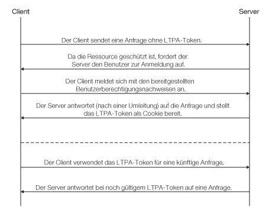
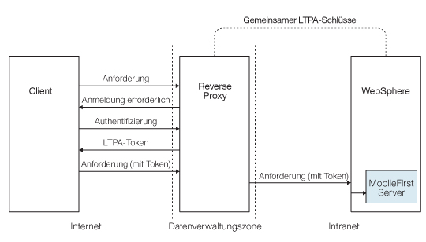
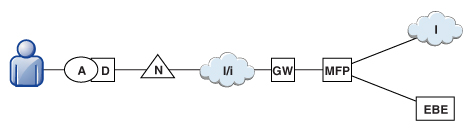
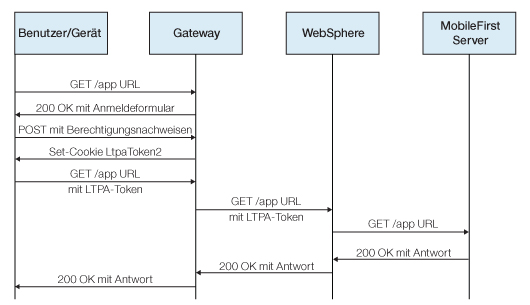

<!-- NLS_CHARSET=UTF-8 -->
## Übersicht
{: #overview }
Ein LTPA-Token (Lightweight Third-Party Authentication) ist eine Art Sicherheitstoken, das von
IBM WebSphere Application Server
und anderen
IBM Produkten verwendet wird. Mit LTPA
können die Berechtigungsnachweise eines authentifizierten Benutzers an Back-End-Services
gesendet werden. Ein LTPA-Token kann auch als SSO-Token (Single Sign-on) des Benutzers für mehrere
Server verwendet werden.

Einfacher Client < - > Serverablauf mit LTPA:

Nach der Anmeldung eines Benutzers beim Server
generiert der Server ein LTPA-Token, bei dem es sich um einen verschlüsselten Hash-Wert mit
authentifizierten Benutzerdaten handelt.
Das Token wird mit einem privaten Schlüssel signiert, über den alle Server verfügen, die den Wert entschlüsseln wollen. Das Token hat in der Regel die Form eines
Cookies für HTTP-Services. Wenn das Token als Cookie gesendet wird, sind keine weiteren Benutzerinteraktionen erforderlich.

LTPA-Token haben eine Verfallszeit, die konfiguriert werden kann, um die Möglichkeit einer Sitzungsübernahme
einzuschränken.

## Reverse Proxy mit LTPA
{: #reverse-proxy-with-ltpa }
In Ihrer Infrastruktur können Sie das LTPA-Token auch für die Kommunikation mit einem Back-End-Server verwenden, der dann
im Auftrag des Benutzers handelt. In einer Topologie mit Reverse Proxy hat der Benutzer keinen direkten Zugriff auf den Back-End-Server. Der
Reverse Proxy kann für die Authentifizierung der Benutzeridentität eingesetzt werden und
das LTPA-Token des authentifizierten Benutzers an Back-End-Server senden. Bei dieser Konfiguration ist sichergestellt,
dass der Zugriff auf {{ site.data.keys.mf_server }}
erst nach einer Benutzerauthentifizierung möglich ist. Dies ist beispielsweise sinnvoll, wenn Sie nicht möchten, dass die
{{ site.data.keys.product }} geschäftskritische
Verwendungen bearbeitet, oder wenn Sie eine vorhandene Authentifizierungskonfiguration nutzen wollen. In Unternehmensumgebungen sollte ein
Reverse Proxy wie IBM WebSphere DataPower oder IBM Security Access Manager in der Datenverwaltungszone verwendet und der
{{ site.data.keys.mf_server }} im Intranet platziert werden. 

In einer Implementierung mit Reverse Proxy
muss die
MobileFirst-Server-Instanz
für die LTPA-Authentifizierung konfiguriert werden, damit sie die Benutzeridentität feststellen kann. 

LTPA-Ablauf für einen Client und einen Back-End-Server mit einem Reverse Proxy: 

## Integration eines Reverse Proxy in {{ site.data.keys.product_adj }}
{: #mobilefirst-integration-with-a-reverse-proxy }
Mit einem Reverse Proxy können Sie die Unternehmenskonnektivität in einer
{{ site.data.keys.product_adj }}-Umgebung aktivieren und Authentifizierungsservices für die
{{ site.data.keys.product }} bereitstellen.

### Allgemeine Architektur
{: #general-architecture }
Reverse Proxys werden bei der Implementierung in der Regel und wie in
der folgenden Abbildung dargestellt
MobileFirst-Server-Instanzen vorgeschaltet und
folgen dem Gateway-Muster.

Das **MFP**-Symbol repräsentiert
eine Instanz von {{ site.data.keys.mf_server }}. Das **GW**-Symbol
repräsentiert ein Reverse-Proxy-Gateway wie WebSphere
DataPower. Der Reverse Proxy schützt nicht nur {{ site.data.keys.product_adj }}-Ressourcen vor dem Internet, sondern
bildet auch die Endstelle für HTTPS-Verbindungen (SSL) und Authentifizierung. Der Reverse Proxy kann auch als Richtliniendurchsetzungspunkt (RDP) genutzt werden.

Bei Verwendung eines Gateways
verwendet die Anwendung (**A**) auf dem Gerät (**G**) anstelle der internen URI von
{{ site.data.keys.mf_server }} die vom Gateway zugänglich gemachte öffentliche URI.
Die öffentliche URI kann
als Einstellung in der Anwendung verfügbar gemacht werden oder vor der Bereitstellung der Anwendung in öffentlichen oder privaten App Stores
in die Anwendung integriert werden.

### Authentifizierung am Gateway
{: #authentication-at-the-gateway }
Wenn das Gateway die Endstelle für die Authentifizierung ist, kann die
{{ site.data.keys.product }} durch einen gemeinsamen Kontext, z. B.
mithilfe eines angepassten HTTP-Headers oder eines Cookies, über den authentifizierten Benutzer informiert werden. Sie können die
{{ site.data.keys.product }} unter Verwendung des erweiterbaren Authentifizierungsframeworks für die Verwendung der Benutzer-ID aus
einem solchen Header oder Cookie konfigurieren, sodass eine erfolgreiche Anmeldung möglich ist. Die folgende Abbildung zeigt einen typischen Authentifizierungsablauf
für diese Gateway-Topologie. 

Diese Konfiguration wurde erfolgreich mit
WebSphere DataPower für die LTPA-basierte Authentifizierung getestet.
Bei erfolgreicher Authentifizierung leitet das Gateway ein LTPA-Token
(in Form eines HTTP-Cookies) an den
WebSphere Application Server
weiter, der das LTPA-Token validiert und einen Aufrufprinzipal erstellt. Die {{ site.data.keys.product }} kann
diesen Aufrufprinzipal nach Bedarf verwenden. 

## {{ site.data.keys.product_adj }}-Sicherheitsüberprüfung des
LTPA-basierten
SSO
{: #the-mobilefirst-ltpa-based-sso-security-check }
Die vordefinierte {{ site.data.keys.product_adj }}-Sicherheitsüberprüfung des
LTPA-basierten Single Sign-on
(**LtpaBasedSSO**)
ermöglicht die Integration des LTPA-Protokolls von WebSphere Application Server
in die {{ site.data.keys.product }}. Mit dieser Sicherheitsüberprüfung
können eine LTPA-basierte Gateway-Topologie für Instanzen
von {{ site.data.keys.mf_server }} integrieren (siehe vorherige Abschnitte) und
über ein SSO-LTPA-Token Back-End-Services für die Benutzerauthentifizierung nutzen. 

Diese vordefinierte Sicherheitsüberprüfung
kann wie jede andere Sicherheitsüberprüfung des
{{ site.data.keys.product_adj }}-Sicherheitsframeworks
verwendet werden. Sie können dieser Überprüfung ein angepasstes Bereichselement
zuordnen und die Überprüfung (oder ein Breichselement mit dieser Überprüfung) in einem Ressourcenschutzbereich oder
in einem obligatorischen Anwendungsbereich
nutzen. 

Sie können das Verhalten dieser Sicherheitsüberprüfung für Ihre Anwendung konfigurieren. 

## Sicherheitsüberprüfung für LTPA-basiertes SSO konfigurieren
{: #configuring-the-ltpa-based-sso-security-check }
Die vordefinierte Sicherheitsüberprüfung für LTPA-basiertes Single Sign-on
(**LtpaBasedSSO**) hat eine konfigurierbare Eigenschaft mit dem Namen **expirationSec**.
Mit dieser Eigenschaft wird der Ablaufzeitraum für eine erfolgreiche Sicherheitsprüfung festgelegt. Der Ablaufzeitraum definiert das Mindestintervall für einen erneuten Aufruf der Überprüfung nach einer erfolgreichen Ausführung. 

> **Hinweis:** Nachstehend ist die Verwendung der
{{ site.data.keys.mf_console }} für das Konfigurieren des Eigenschaftswerts
erklärt. Sie können den Eigenschaftswert auch direkt in der **Anwendungsdeskriptordatei** festlegen. Ausführliche Informationen finden Sie unter
"Eigenschaften für die Sicherheitsüberprüfung von Anwendungen konfigurieren".

1. Öffnen Sie ein Fenster mit der {{ site.data.keys.mf_console }}.
Wählen Sie in der **Navigationsseitenleiste** Ihre Anwendungsversion und dann das Register
**Sicherheit** aus. 
2. Klicken Sie im Abschnitt **Konfigurationen für Sicherheitsüberprüfungen** auf
**Neu**. 
3. Konfigurieren Sie die Sicherheitsüberprüfung für **LTPA-basiertes SSO** wie folgt im Fenster **Eigenschaften für Sicherheitsüberprüfungen konfigurieren**: 
    * Wählen Sie in der Liste für das Feld **Sicherheitsüberprüfung** den Eintrag
**LtpaBasedSSO** aus. 
    * Legen Sie im Feld **Expiration Period Successful State
(seconds)** Ihren Ablaufzeitraum in Sekunden fest, innerhalb dessen die Sicherheitsüberprüfung als erfolgreich gilt. 

Im Anschluss können Sie Ihre Sicherheitsprüfungskonfiguration LtpaBasedSSO in der Tabelle
"Konfigurationen für Sicherheitsüberprüfungen" auf der Registerkarte
"Sicherheit" der Anwendung anzeigen und bearbeiten. 
