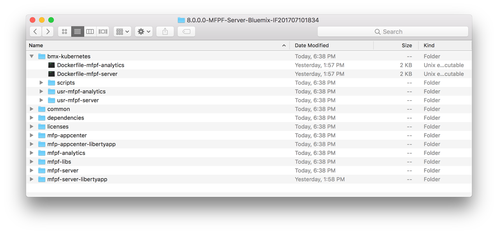

<!-- NLS_CHARSET=UTF-8 -->
## Übersicht
{: #overview }
Folgen Sie den nachstehenden Anweisungen, um eine MobileFirst-Server-Instanz in einer Liberty-for-Java-Laufzeit für Bluemix zu konfigurieren. (Instanzen von {{ site.data.keys.mf_analytics }} können nur in IBM Containern ausgeführt werden.) Gehen Sie dazu die folgenden Schritte durch: 

* Statten Sie Ihren Host-Computer mit den erforderlichen Tools aus (Cloud-Foundry-CLI). 
* Richten Sie Ihr Bluemix-Konto ein.
* Erstellen Sie einen {{ site.data.keys.mf_server }} und übertragen Sie ihn als Cloud-Foundry-Anwendung in Bluemix. 

Abschließend werden Sie Ihre mobilen Apps registrieren und Ihre Adapter implementieren. 

**Hinweise:**  

* Das Windows-Betriebssystem wird derzeit nicht für die Ausführung dieser Scripts unterstützt.   
* Die MobileFirst-Server-Konfigurationstools können nicht für die Implementierung in Bluemix genutzt werden. 

#### Fahren Sie mit folgenden Abschnitten fort: 
{: #jump-to }

* [Konto in Bluemix registrieren](#register-an-account-at-bluemix)
* [Hostmaschine einrichten](#set-up-your-host-machine)
* [Archiv {{ site.data.keys.mf_bm_pkg_name }} herunterladen](#download-the-ibm-mfpf-container-8000-archive)
* [Informationen zum Analytics-Server hinzufügen](#adding-analytics-server-configuration-to-mobilefirst-server)
* [Fixes für {{ site.data.keys.mf_server }} anwenden](#applying-mobilefirst-server-fixes)
* [Datenbankservicekonfiguration aus Bluemix entfernen](#removing-the-database-service-configuration-from-bluemix)

## Konto in Bluemix registrieren
{: #register-an-account-at-bluemix }
Falls Sie noch kein Konto haben, öffnen Sie die [Bluemix-Website](https://bluemix.net) und klicken Sie auf **Kostenloses
Konto erstellen** oder auf **Anmeldung**. Sie müssen das Registrierungsformular ausfüllen, bevor Sie mit dem nächsten Schritt fortfahren können. 

### Bluemix-Dashboard
{: #the-bluemix-dashboard }
Nachdem Sie sich bei Bluemix angemeldet haben, wird das Bluemix-Dashboard angezeigt, das Ihnen einen Überblick über den aktiven Bluemix-Bereich gibt. Standardmäßig hat dieser Arbeitsbereich den Namen "dev". Bei Bedarf können Sie mehrere Arbeitsbereiche erstellen. 

## Hostmaschine einrichten
{: #set-up-your-host-machine }
Für die Verwaltung der Bluemix-Cloud-Foundry-App müssen Sie die Cloud-Foundry-CLI installieren.  
Die Scripts können Sie mit der Terminal.app unter macOS oder einer Linux-Bash-Shell ausführen. 

Installieren Sie die [Cloud-Foundry-CLI](https://github.com/cloudfoundry/cli/releases?cm_mc_uid=85906649576514533887001&cm_mc_sid_50200000=1454307195).

## Archiv {{ site.data.keys.mf_bm_pkg_name }} herunterladen
{: #download-the-ibm-mfpf-container-8000-archive}
Wenn Sie die {{ site.data.keys.product }} in Liberty on Java einrichten möchten, müssen Sie zunächst ein Dateilayout erstellen, das später per Push-Operation in Bluemix übertragen wird.   
<a href="http://www-01.ibm.com/support/docview.wss?uid=swg2C7000005" target="blank">Folgen Sie den Anweisungen auf dieser Seite</a>, um das Archiv mit {{ site.data.keys.mf_server }} 8.0 für IBM Container (ZIP-Datei) herunterzuladen (suchen Sie nach *CNBL0EN*).

Die Archivdatei enthält die Dateien für die Erstellung eines Dateilayouts (**dependencies** und **mfpf-libs**), die Dateien für die Erstellung und Implementierung eines Containers mit {{ site.data.keys.mf_analytics }} (**mfpf-analytics**) und Dateien zum Konfigurieren einer MobileFirst-Server-Cloud-Foundry-App (**mfpf-server-libertyapp**).

<div class="panel-group accordion" id="terminology" role="tablist" aria-multiselectable="false">
    <div class="panel panel-default">
        <div class="panel-heading" role="tab" id="zip-file">
            <h4 class="panel-title">
                <a class="preventScroll" role="button" data-toggle="collapse" data-parent="#zip-file" data-target="#collapse-zip-file" aria-expanded="false" aria-controls="collapse-adapter-xml"><b>Für mehr Informationen zum Inhalt der Archivdatei hier klicken</b></a>
            </h4>
        </div>

        <div id="collapse-zip-file" class="panel-collapse collapse" role="tabpanel" aria-labelledby="zip-file">
            <div class="panel-body">
                
                <h4>Ordner 'dependencies'</h4>
                <p>Enthält die Laufzeit der {{ site.data.keys.product }} und IBM Java JRE 8</p>

                <h4>Ordner 'mfpf-libs'</h4>
                <p>Enthält die Bibliotheken für die {{ site.data.keys.product_adj }}-Produktkomponenten und die CLI</p>

                <h4>Ordner 'mfpf-server-libertyapp'</h4>

                <ul>

                    <li>Ordner <b>scripts</b>: Dieser Ordner enthält den Ordner <b>args</b> mit einer Reihe von Konfigurationsdateien. Er enthält außerdem die Scripts für die Anmeldung bei Blumix, die Erstellung einer MobileFirst-Foundation-App für die Push-Übertragung in Bluemix und die Ausführung in Bluemix. Sie können diese Scripts interaktiv ausführen oder die Konfigurationsdateien wie nachfolgend erläutert für die Ausführung der Scripts vorkonfigurieren. Anders als bei den anpassbaren Dateien args/*.properties dürfen Sie in diesem Ordner keine Elemente modifizieren. Verwenden Sie das Befehlszeilenargument <code>-h</code> oder <code>--help</code>, um einen Hilfetext zur Scriptsyntax abzurufen (z. B. <code>Scriptname.sh --help</code>).</li>
                    <li>Ordner <b>usr</b>:
                        <ul>
                            <li>Ordner <b>config</b>: Für {{ site.data.keys.mf_server }} verwendete Serverkonfigurationsfragmente (Keystore, Servereigenschaften, Benutzerregistry)</li>
                            <li><b>keystore.xml</b>: Konfiguration des Repositorys mit Sicherheitszertifikaten für die SSL-Verschlüsselung. Im Ordner ./usr/security muss auf die aufgelisteten Dateien verwiesen werden.</li>
                            <li><b>mfpfproperties.xml</b> - Konfigurationseigenschaften für {{ site.data.keys.mf_server }}. Informieren Sie sich anhand der folgenden Dokumentationsabschnitte über die unterstützten Eigenschaften:<ul>
                                <li><a href="../../installation-configuration/production/server-configuration/#list-of-jndi-properties-for-mobilefirst-server-administration-service">Liste der JNDI-Eigenschaften für den MobileFirst-Sever-Verwaltungsservice</a></li>
                                    <li><a href="../../installation-configuration/production/server-configuration/#list-of-jndi-properties-for-mobilefirst-runtime">Liste der JNDI-Eigenschaften für die {{ site.data.keys.product_adj }}-Laufzeit</a></li>
                                </ul>
                            </li>
                            <li><b>registry.xml</b>: Benutzerregistrykonfiguration. Als Standardkonfiguration wird eine auf XML basierende Basisbenutzerregistrykonfiguration (basicRegistry) bereitgestellt. Sie können Namen und Kennwörter für basicRegistry konfigurieren oder ldapRegistry konfigurieren.</li>
                        </ul>
                    </li>
                    <li>Ordner <b>env</b>: Enthält die Umgebungseigenschaften für die Serverinitialisierung (server.env) sowie angepasste JVM-Optionen (jvm.options).<br/>
                    </li>

                    <li>Ordner <b>security</b>: Wird verwendet, um die Keystore-Datei, die Truststore-Datei und die LTPA-Schlüsseldatei (ltpa.keys) zu speichern.</li>

                </ul>
				<br/>
                <a class="preventScroll" role="button" data-toggle="collapse" data-parent="#zip-file" data-target="#collapse-zip-file" aria-expanded="false" aria-controls="collapse-zip-file"><b>Abschnitt schließen</b></a>
            </div>
        </div>
    </div>
</div>


## {{ site.data.keys.mf_server }} einrichten
{: #setting-up-the-mobilefirst-server }
Sie können die Scripts interaktiv ausführen oder die Konfigurationsdateien verwenden.
Ein guter Ausgangspunkt ist die einmalige interaktive Ausführung der Scripts, wobei auch die Argumente erfasst werden (**recorded-args**). Später können Sie die Dateien mit den Argumenten verwenden, um die Scripts in einem nicht interkativen Modus auszuführen. 

> **Hinweis:** Kennwörter werden nicht aufgezeichnet. Sie müssen die Kennwörter manuell zu den Dateien mit Argumenten hinzufügen. 

* Verwendung der Konfigurationsdateien: Führen Sie die Scripts aus und übergeben Sie die entsprecvhende Konfigurationsdatei als Argument. 
* Interaktiv: Führen Sie die Scripts ohne Argumente aus. 

Wenn Sie sich entschließen, die Scripts interaktiv auszuführen, können Sie die Konfiguration übergehen. Wir empfehlen Ihnen jedoch, sich wenigstens mit den Argumenten, die angegeben werden müssen, zu beschäftigen. 

### {{ site.data.keys.mf_server }}
{: #mobilefirst-server }
<div class="panel-group accordion" id="scripts2" role="tablist" aria-multiselectable="false">
    <div class="panel panel-default">
        <div class="panel-heading" role="tab" id="step-foundation-1">
            <h4 class="panel-title">
                <a class="preventScroll" role="button" data-toggle="collapse" data-parent="#scripts2" data-target="#collapse-step-foundation-1" aria-expanded="false" aria-controls="collapse-step-foundation-1">Konfigurationsdateien verwenden</a>
            </h4>
        </div>

        <div id="collapse-step-foundation-1" class="panel-collapse collapse" role="tabpanel" aria-labelledby="setupCordova">
            <div class="panel-body">
            Der Ordner <b>args</b> enthält Konfigurationsdateien mit den Argumenten, die zum Ausführen der Scripts erforderlich sind. Die leeren Schablonendateien und eine Erläuterung der Argumente finden Sie im Ordner <b>args</b> oder nach einer interaktiven Ausführung der Scripts im Ordner <b>recorded-args</b>. Es handelt sich um folgende Dateien:<br/>

              <h4>initenv.properties</h4>
              Diese Datei enhält Eigenschaften zum Ausführen der Umgebungsinitialisierung.
              <h4>prepareserverdbs.properties</h4>
              Der {{ site.data.keys.mf_bm_short }} Service erfordert eine externe <a href="https://console.ng.bluemix.net/catalog/services/dashdb/" target="\_blank">dashDB-Enterprise-Transactional-Datenbankinstanz</a> (einen mit "OLTP" oder "Transactional" bezeichneten Plan).<br/>
              <b>Hinweis:</b> Die Implementierung der dashDB-Enterprise-Transactional-Pläne erfolgt sofort, wenn die Pläne mit "pay as you go" gekennzeichnet sind. Vergewissern Sie sich, dass Sie einen passenden Plan ausgewählt haben, z. B. <i>Enterprise for Transactions High Availability 2.8.500 (Pay per use)</i>. <br/><br/>
              Wenn Sie Ihre dashDB-Instanz eingerichtet haben, geben Sie die erforderlichen Argumente an. 

              <h4>prepareserver.properties</h4>
              Diese Datei wird für das Script prepareserver.sh verwendet. Sie erstellt das Serverdateilayout und überträgt es per Push-Operation als Cloud-Foundry-App in Bluemix.
              <h4>startserver.properties</h4>
              Diese Datei konfiguriert die Laufzeitattribute des Servers und startet den Server. Es wird dringend empfohlen, für die hohe Verfügbarkeit mindestens 1024 MB (<b>SERVER_MEM=1024</b>) und 3 Knoten (<b>INSTANCES=3</b>) zu verwenden. 

            </div>
        </div>
    </div>

    <div class="panel panel-default">
        <div class="panel-heading" role="tab" id="step-foundation-2">
            <h4 class="panel-title">
                <a class="preventScroll" role="button" data-toggle="collapse" data-parent="#scripts2" data-target="#collapse-step-foundation-2" aria-expanded="false" aria-controls="collapse-step-foundation-2">Scripts ausführen</a>
            </h4>
        </div>

        <div id="collapse-step-foundation-2" class="panel-collapse collapse" role="tabpanel" aria-labelledby="setupCordova">
            <div class="panel-body">
              <p>Die folgenden Anweisungen demonstrieren die Ausführung der Scripts unter Verwendung der Konfigurationsdateien. Eine Liste mit Befehlszeilenargumenten, die Sie für die Ausführung in einem nicht interaktiven Modus auswählen sollten, wird ebenfalls bereitgestellt. </p>
              <ol>
                  <li><b>initenv.sh – Anmeldung bei Bluemix </b><br />
                      Führen Sie das Script <b>initenv.sh</b> für die Anmeldung bei Bluemix aus. Führen Sie das Script für die Organisation und den Bereich aus, an die Ihr dashDB-Service gebunden ist:

./initenv.sh args/initenv.properties


                        Sie können die Parameter auch in der Befehlszeile übergeben. 


initenv.sh --user Bluemix-Benutzer-ID --password Bluemix-Kennwort --org Bluemix-Organisationsname --space Bluemix-Bereichsname


                        Wenn Sie sich über alle unterstützten Parameter und ihre Dokumentation informieren möchten, füren Sie die Option "help" aus. 


./initenv.sh --help

                  </li>
                  <li><b>prepareserverdbs.sh - Erstellung der MobileFirst-Server-Datenbank</b><br />
                  Das Script <b>prepareserverdbs.sh</b> wird verwendet, um Ihren {{ site.data.keys.mf_server }} mit dem dashDB-Datenbankservice
oder einem zugänglichen DB2-Datenbankserver zu konfigurieren. Die DB2-Option kommt insbesondere infrage, wenn Sie Bluemix lokal in dem Rechenzentrum ausführen, in dem der DB2-Server installiert ist. Wenn Sie den dashDB-Service verwenden, muss die Instanz des dashDB-Service in der Organisation und dem Bereich verfügbar sein, bei denen Sie sich in Schritt 1 angemeldet haben. Führen Sie Folgendes aus:

./prepareserverdbs.sh args/prepareserverdbs.properties


                        Sie können die Parameter auch in der Befehlszeile übergeben. 


prepareserverdbs.sh --admindb MFPDashDBService


                        Wenn Sie sich über alle unterstützten Parameter und ihre Dokumentation informieren möchten, füren Sie die Option "help" aus. 


./prepareserverdbs.sh --help

</li>
                  <li><b>initenv.sh (optional) – Anmeldung bei Bluemix</b><br />
                      Dieser Schritt ist nur erforderlich, wenn Sie Ihren Server in einer Organisation und einem Breich erstellen müssen, in dem die dashDB-Serviceinstanz nicht verfügbar ist. Wenn das der Fall ist, aktualisieren Sie die Datei initenv.properties mit der neuen Organisation und dem neuen Bereich, in denen die Container erstellt (und gestartet) werden müssen. Führen Sie dann erneut das Script <b>initenv.sh</b> aus:

./initenv.sh args/initenv.properties

                  </li>
                  <li><b>prepareserver.sh - Erstellung eines {{ site.data.keys.mf_server }}</b><br />
                    Führen Sie das Script <b>prepareserver.sh</b> aus, um einen {{ site.data.keys.mf_server }} zu erstellen
und per Push-Operation als Cloud-Foundry-Anwendung in Bluemix zu übertragen. Führen Sie <code>cf apps</code> aus, um alle Cloud-Foundry-Anwendungen mit ihren URLs in der Organisation und in dem Bereich der Anmeldung zu sehen.<br/>



./prepareserver.sh args/prepareserver.properties


                        Sie können die Parameter auch in der Befehlszeile übergeben. 


prepareserver.sh --name APP_NAME


                        Wenn Sie sich über alle unterstützten Parameter und ihre Dokumentation informieren möchten, füren Sie die Option "help" aus. 


./prepareserver.sh --help
                  
</li>
                  <li><b>startserver.sh - Starten des Servers</b><br />
                  Das Script <b>startserver.sh</b> wird zum Starten von {{ site.data.keys.mf_server }} in der Cloud-Foundry-Anwendung für Liberty for Java zu starten. Führen Sie Folgendes aus: <p/>

./startserver.sh args/startserver.properties


                        Sie können die Parameter auch in der Befehlszeile übergeben. 


./startserver.sh --name APP_NAME 


                        Wenn Sie sich über alle unterstützten Parameter und ihre Dokumentation informieren möchten, füren Sie die Option "help" aus. 


./startserver.sh --help
   

                  </li>
              </ol>
            </div>
        </div>
    </div>
</div>


Starten Sie die {{ site.data.keys.mf_console }} über die URL `http://APP_HOST.mybluemix.net/mfpconsole`. (Der Start kann eine Weile dauern.)   
Fügen Sie den fernen Server hinzu. Folgen Sie dfür den Anweisungen
im Lernprogramm [{{ site.data.keys.mf_cli }} für die Verwaltung
von {{ site.data.keys.product_adj }}-Artefakten verwenden](../../application-development/using-mobilefirst-cli-to-manage-mobilefirst-artifacts/#add-a-new-server-instance). 

{{ site.data.keys.mf_server }} wird jetzt in IBM Bluemix ausgeführt, sodass Sie mit der Anwendungsentwicklung beginnen können. 

#### Änderungen anwenden
{: #applying-changes }
Nachdem Sie den Server implementiert haben, sind möglicherweise Änderungen am Serverlayout erforderlich. Es könnte beispielsweise sein,
dass Sie die Analytics-URL in **/usr/config/mfpfproperties.xml** aktualisieren möchten. Nehmen Sie die Änderungen vor und führen Sie dann die folgenden Scripts mit den gleichen Parametern erneut aus. 

1. ./prepareserver.sh
2. ./startserver.sh

### Analytics-Server-Konfiguration zu {{ site.data.keys.mf_server }} hinzufügen
{: #adding-analytics-server-configuration-to-mobilefirst-server }
Wenn Sie einen Analytics-Server eingerichtet haben und möchten, dass dieser Server eine Verbindung zu diesem {{ site.data.keys.mf_server }}
herstellen können soll, bearbeiten Sie die Datei **mfpfproperties.xml** im Ordner **package_root/mfpf-server-libertyapp/usr/config** wie unten angegeben. Ersetzen Sie die mit `<>` gekennzeichneten Token durch reale Werte Ihrer Implementierung. 

```xml
<jndiEntry jndiName="${env.MFPF_RUNTIME_ROOT}/mfp.analytics.url" value='"https://<AnalyticsContainerGroupRoute>:443/analytics-service/rest"'/>
<jndiEntry jndiName="${env.MFPF_RUNTIME_ROOT}/mfp.analytics.console.url" value='"https://<AnalyticsContainerPublicRoute>:443/analytics/console"'/>
<jndiEntry jndiName="${env.MFPF_RUNTIME_ROOT}/mfp.analytics.username" value='"<AnalyticsUserName>"'/>
<jndiEntry jndiName="${env.MFPF_RUNTIME_ROOT}/mfp.analytics.password" value='"<AnalyticsPassword>"'/>


<jndiEntry jndiName="${env.MFPF_PUSH_ROOT}/mfp.push.analytics.endpoint" value='"https://<AnalyticsContainerGroupRoute>:443/analytics-service/rest"'/>
<jndiEntry jndiName="${env.MFPF_PUSH_ROOT}/mfp.push.services.ext.analytics" value="com.ibm.mfp.push.server.analytics.plugin.AnalyticsPlugin"/>
<jndiEntry jndiName="${env.MFPF_PUSH_ROOT}/mfp.push.analytics.user" value='"<AnalyticsUserName>"'/>
<jndiEntry jndiName="${env.MFPF_PUSH_ROOT}/mfp.push.analytics.password" value='"<AnalyticsPassword>"'/>
```

## Fixes für {{ site.data.keys.mf_server }} anwenden
{: #applying-mobilefirst-server-fixes }
Vorläufige Fixes für {{ site.data.keys.mf_server }} in Bluemix können über [IBM Fix Central](http://www.ibm.com/support/fixcentral) abgerufen werden.  
Sichern Sie Ihre vorhandenen Konfigurationsdateien, bevor Sie einen vorläufigen Fix anwenden. Die Konfigurationsdateien befinden sich in den Ordnern unter
**package_root/mfpf-server-libertyapp/usr**. 

1. Laden Sie das Archiv mit dem vorläufigen Fix herunter und extrahieren Sie den Inhalt des Archivs in
Ihrem vorhandenen Installationsordner. Dabei werden in dem Ordner vorhandene Dateien überschrieben. 
2. Speichern Sie Ihre gesicherten Konfigurationsdateien zurück in die Ordner unter **/mfpf-server-libertyapp/usr**. Dabei werden
die neu installierten Konfigurationsdateien überschrieben. 

Jetzt können Sie den aktualisierten Server erstellen und implementieren. 

## Datenbankservicekonfiguration aus Bluemix entfernen
{: #removing-the-database-service-configuration-from-bluemix }
Wenn Sie während der Konfiguration des MobileFirst-Server-Image das Script **prepareserverdbs.sh** ausgeführt haben,
werden die für {{ site.data.keys.mf_server }} erforderlichen Konfigurationen und Datenbanktabellen erstellt. Das Script erstellt auch das Datenbankschema für {{ site.data.keys.mf_server }}. 

Sie können die Datenbankservicekonfiguration im Bluemix-Dashboard wie folgt entfernen.

1. Wählen Sie im Bluemix-Dashboard den dashDB-Service aus, den Sie verwendet haben. Wählen Sie den dashDB-Servicenamen aus, den Sie für die Ausführung des Scripts **prepareserverdbs.sh** als Parameter angegeben haben. 
2. Starten Sie die dashDB-Konsole, um mit den Schemata und Datenbankobjekten der ausgewählten dashDB-Serviceinstanz arbeiten zu können. 
3. Wählen Sie Schemata für die Konfiguration von IBM {{ site.data.keys.mf_server }} aus. Die Schemanamen sind die, die Sie bei Ausführung des Scripts **prepareserverdbs.sh** als Parameter angegeben haben. 
4. Untersuchen Sie die Schemanamen und die zugehörigen Objekte gründlich, bevor Sie die einzelnen Schemata löschen. Die Datenbankkonfigurationen wurden aus Bluemix entfernt.
