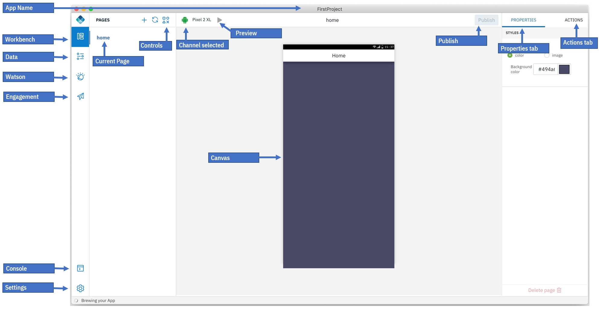
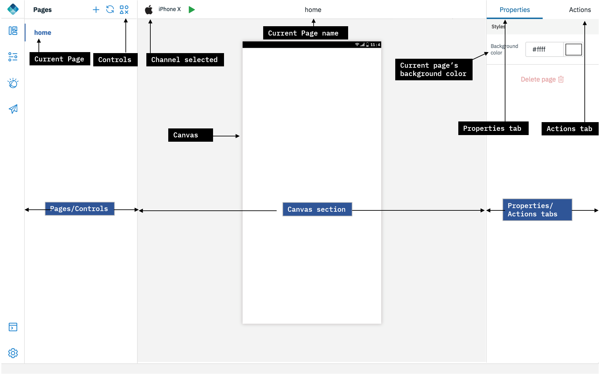
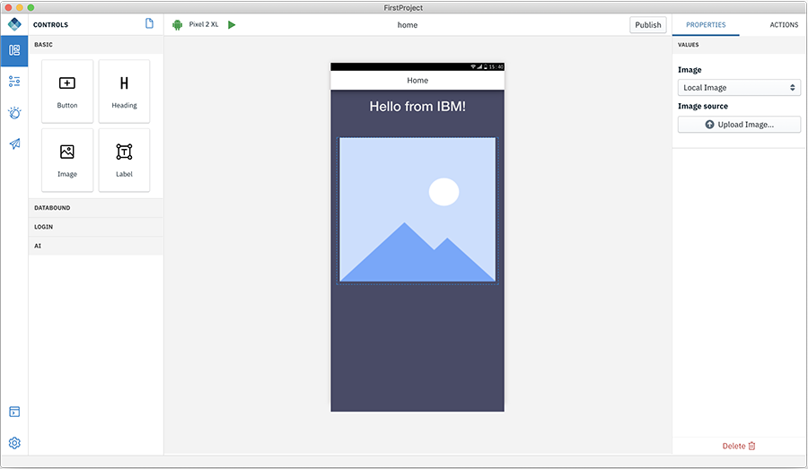
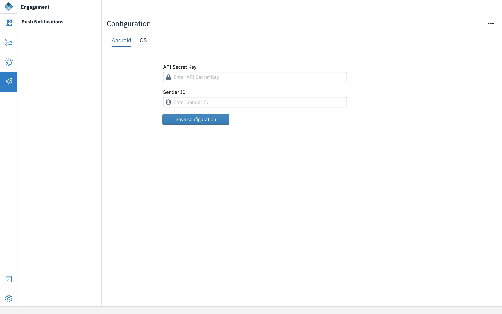

<!-- NLS_CHARSET=UTF-8 -->
## Übersicht
{: #digital-app-builder-interface }

Links im Navigationsfenster der Digital-App-Builder-Schnittstelle finden Sie Folgendes:

* **Workbench** - Blendet die Seitendetails ein oder aus
* **Daten** - Hilft Ihnen, ein Dataset durch Herstellen einer Verbindung zu einer vorhandenen Datenquelle hinzuzufügen oder eine Datenquelle für einen Mikroservice unter Verwendung eines Open-API-Dokuments zu erstellen. 
* **Watson** - Umfasst die Komponenten Image Recognition und Chatbot (Watson Assistant) zum Konfigurieren einer vorhandenen Instanz oder zum Erstellen einer neuen Instanz. 
* **Kundenprojekt** - Sie können die Verbundenheit mit den Benutzern Ihrer App stärken, indem Sie Services für Push-Benachrichtigungen zur App hinzufügen.
* **Konsole** - Zeigt die Konsole an, in der Sie die Aktivitäten und den Code der einzelnen Komponenten sehen können. 
* **Einstellungen** - Zeigt die App-Details, Serverinfos, Plug-ins und Projektreparaturen (wie die erneute Erstellung von Abhängigkeiten bzw. Plattformen oder die Zurücksetzung der IBM Cloud-Berechtigungsnachweise) an. 

### Workbench
{: #workbench }

Die Workbench hilft Ihnen bei der Gestaltung der Seiten. Sie besteht aus drei Arbeitsbereichen:

1. **Seiten/Steuerelemente**: In diesem Bereich wird der Name standardmäßig erstellter Seiten angezeigt. Verwenden Sie das Pluszeichen (**+**), um eine neue Seite zu erstellen. Wenn Sie auf das Symbol **Steuerelemente** klicken, werden Steuerelemente angezeigt, die Sie beim Hinzufügen von Funktionen zu einer Seite in einer App unterstützen. Sie können die Steuerelemente mit der Maus von der jeweiligen Steuerelementpalette in den Erstellungsbereich einer Seite ziehen und dort ablegen. Jedes Steuerelement verfügt über eine Gruppe von Eigenschaften und Aktionen.

    Im Folgenden sind die verfügbaren Steuerelemente aufgelistet:
    * **Basis**: Diese Basissteuerelemente (Schaltfläche, Überschrift, Bild und Bezeichnung) können Sie mit der Maus in den Erstellungsbereich ziehen, dort ablegen und die Eigenschaften und Aktionen konfigurieren.

        

        * **Schaltfläche** - Schaltflächen haben eine Eigenschaft für die Beschriftung. Auf der Registerkarte "Aktion" können Sie die Seite angeben, zu der per Klick auf die Schaltfläche navigiert werden soll.
        * **Überschrift** - Hilft Ihnen, eine Überschrift für die Anwendung hinzuzufügen, z. B. eine Seitenüberschrift.
        * **Bild** - Hilft Ihnen, ein lokales Bild hochzuladen oder eine Bild-URL anzugeben.
        * **Bezeichnung** - Hilft Ihnen, statischen Text zu Ihrem Seitenhauptteil hinzuzufügen. 
    * **Datengebunden** - Hilft Ihnen, eine Verbindung zu einem Dataset herzustellen und Operationen für die Entitäten in dem Dataset auszuführen. Zum Steuerelement "Datengebunden" gehören die beiden Komponenten **Liste** und **Bezeichnung 'Verbunden'**.

        

        * **Liste** - Sie können eine neue Seite erstellen und die Listenkomponente mit der Maus auf die Seite ziehen. Fügen Sie den Listentitel (**List Title**) hinzu. Wählen Sie den Typ der zu bearbeitenden Liste aus. Fügen Sie Inhalte zur Bearbeitung hinzu und wählen Sie das zu verwendende Dataset aus.

    * **Anmeldung** - Das Steuerelement "Anmeldung" besteht aus einem Anmeldeformular. Sie können das Formular mit der Maus auf die Seite ziehen.
 
        Mit dem Anmeldeformular können Sie eine Anmeldeseite für Ihre Anwendung erstellen, von der aus der Benutzer eine Verbindung zum Mobile Foundation Server herstellen kann. Der Mobile Foundation Server stellt ein Sicherheitsframework für die Authentifizierung von Benutzern und die Bereitstellung des Sicherheitskontextes für den Zugriff auf die Datasets zur Verfügung. Weitere Informationen finden Sie [hier](https://mobilefirstplatform.ibmcloud.com/tutorials/en/foundation/8.0/authentication-and-security/creating-a-security-check/).

        

        Gehen Sie zur Aktivierung des Anmeldeformulars wie folgt vor:

        1. Nehmen Sie die folgenden Änderungen in Mobile Foundation Server vor:
            * Implementieren Sie einen Adapter für Sicherheitsüberprüfungen, der einen Benutzernamen und ein Kennwort als Eingaben akzeptiert. Sie können den Beispieladapter von [hier](https://github.com/MobileFirst-Platform-Developer-Center/SecurityCheckAdapters/tree/release80) verwenden.
            * Öffnen Sie in der MFP-Konsole die Registerkarte "Sicherheit" für die App und fügen Sie unter "Obligatorischer Anwendungsbereich" die oben erstellte Sicherheitsdefinition als Bereichselement hinzu.
        2. Konfigurieren Sie wie folgt Ihre Anwendung mit dem Application Builder:
            * Fügen Sie zu einer Seite im Erstellungsbereich das Steuerelement **Anmeldung** (d. h. das Anmeldeformular) hinzu.
            * Geben Sie auf der Registerkarte **Eigenschaften** den **Namen der Sicherheitsüberprüfung** an sowie die Seite, zu der bei erfolgreicher Anmeldung navigiert werden soll.
            * Führen Sie die App aus.
    * **KI** - Mithilfe von KI-Steuerelementen können Sie Watson-KI-Leistungsmerkmale zu Ihrer App hinzufügen.

        * **Watson Chat** - Dieses Steuerelement stellt eine komplette Chatschnittstelle bereit, die mit dem Service Watson Assistant für IBM Cloud gesteuert werden kann. 

            

            * Wählen Sie im Eigenschaftenabschnitt den konfigurierten Service Watson Assistant aus. Wählen Sie dann den Arbeitsbereich aus, zu dem Sie eine Verbindung herstellen möchten. Wie ein Chatdialog definiert und trainiert wird, erfahren Sie in Watson unter [Chatbot](#chatbot).

        * **Watson Visual Recognition** - Mit diesem Steuerelement kann ein Foto gemacht werden, das dann vom Service Watson Visual Recognition identifiziert werden kann.
         
            
 
            *  Wählen Sie im Eigenschaftenabschnitt den konfigurierten Service Visual Recognition und das Klassifikationsmodell aus. Wie Sie zum Definieren und Trainieren Ihre eigenen Bilder verwenden können, erfahren Sie in Watson unter [Bilderkennung](#image-recognition).

2. Abschnitt **Erstellungsbereich** - Dieser Bereich besteht aus dem aktuell ausgewählten Kanal, dem Namen der aktuellen Seite, der Umschaltmöglichkeit zwischen Design und Code sowie dem eigentlichen Erstellungsbereich.

    * Symbol **Kanal** - Mithilfe dieses Symbols wird der derzeit ausgewählte Kanal angezeigt. Sie können weitere Kanäle hinzufügen. Wählen Sie dazu im Plattformabschnitt unter **Einstellungen > App > App-Details** die erforderlichen Kanäle aus.
    * Aktueller Seitenname - Es wird der Seitenname im Erstellungsbereich angezeigt. Nach einem Seitenwechsel wird der Name aktualisiert, sodass der Name der dann ausgewählten Seite angezeigt wird.
    * **Design/Code** - Mithilfe dieser Option kann die Codeeditoransicht zum Bearbeiten des Codes aufgerufen werden. Außerdem besteht die Möglichkeit, das Design anzuzeigen und Fehler zu debuggen. Im Erstellungsbereich können Sie vom Design auf den Code umschalten, um den Code einer bestimmten Datei im Projekteditor anzuzeigen. Bei einem Wechsel vom Design zum Code erscheint die folgende Anzeige:

        

        **WARNUNG** - Wenn Sie auf **Erstellen**klicken, wird lokal eine editierbare Version Ihrer Anwendung erstellt. Alle Änderungen, die Sie an der editierbaren Version vornehmen, spiegeln sich nicht in der ursprünglichen App wider und umgekehrt. Der Projektexplorer wird mit allen Projektdateien für die Anwendung angezeigt. 

    * **Erstellungsbereich** - Im Mittelpunkt dieses Abschnitts befindet sich der Erstellungsbereich, in dem entweder das Design oder der Code angezeigt wird. Sie können die Steuerelemente mit der Maus in den Erstellungsbereich ziehen und die App erstellen.

3. Registerkarte **Eigenschaften/Aktionen** - Auf der rechten Seite befindet sich die Registerkarte für Eigenschaften und Aktionen. Wenn ein Steuerelement im Erstellungsbereich abgelegt wird, können Sie die Eigenschaften des Steuerelements bearbeiten und modifizieren und ein Steuerelement mit einer auszuführenden Aktion verbinden.

### Daten
{: #dataset-integration}

Wenn Sie ein Dataset für einen Mikroservice erstellen möchten, müssen Sie die nachfolgend beschriebenen Schritte ausführen. Nach Erstellung des Datasets können Sie die datengebundenen Steuerelemente in Ihrer App verbinden.

#### Neues Dataset erstellen

1. Öffnen Sie auf der Landing-Page des Digital App Builder eine vorhandene App oder erstellen Sie eine App.
2. Klicken Sie im linken Fensterbereich auf **Daten**.

    

3. Klicken Sie auf **Neues Dataset hinzufügen**. Daraufhin wird das Fenster "Dataset hinzufügen" angezeigt.

    

4. Erstellen Sie ein Dataset. Für die Erstellung können Sie eine vorhandene Quelle verwenden (Standardoption). Sie können aber auch eine Datenquelle für einen Mikroservice unter Verwendung eines Open-API-Dokuments erstellen.
    * **Von vorhandener Datenquelle erstellen** (Standardoption) - Bei Auswahl dieser Option werden in die Dropdown-Liste alle Datenquellen (Adapter) von der konfigurierten Mobile-Foundation-Server-Instanz eingetragen. 
    * **Datenquelle für einen Mikroservice mit dem Open-API-Dokument erstellen** - Bei Auswahl dieser Option können Sie eine Datenquelle mithilfe einer Open-API-Spezifikation (Swagger-JSON/YAML-Datei) erstellen und daraus dann ein Dataset.

#### Dataset von einer vorhandenen Datenquelle erstellen

1. Wählen Sie die Datenquelle für die Erstellung des Datasets aus.
2. Daraufhin werden die verfügbaren Entitäten der Datenquelle aufgelistet. Wählen Sie die zu erstellende Entität aus.
3. Geben Sie dem Dataset einen Namen und klicken Sie auf die Schaltfläche **Hinzufügen**. Das Dataset wird damit hinzugefügt. Sie können die dem Dataset zugeordneten Attribute und Aktionen sehen.

    

4. Einige Attribute und Aktionen können je nach Verwendungszweck des Datasets ausgeblendet werden.
5. Sie können auch die **Anzeigebeschriftungen** für die Attribute bearbeiten.
6. Darüber hinaus können Sie die GET-Aktionen testen. Geben Sie dazu die erforderlichen Attribute an und klicken Sie auf **Diese Aktion ausführen** für die entsprechende Aktion. Denken Sie daran, dass Sie den Namen des vertraulichen Clients und das zugehörige Kennwort auf der Registerkarte **Einstellungen** angegeben haben müssen.

#### Datenquelle für einen Mikroservice mit einer Swagger-Datei erstellen

1. Wählen Sie die **JSON/YAML-Datei** aus, für die Sie eine Datenquelle erstellen möchten, und klicken Sie auf **Generieren**.
2. Daraufhin wird ein Adapter generiert, der ein Konfigurationsartefakt für den MF-Server ist, das Sie wiederverwenden und in der Mobile-Foundation-Server-Instanz implementieren können.
3. Wählen Sie die Entität aus, für die Sie die Datenquelle definieren möchten.
4. Geben Sie dem Dataset einen Namen und klicken Sie auf die Schaltfläche **Hinzufügen**.
5. Das Dataset wird damit hinzugefügt. Sie können die dem Dataset zugeordneten Attribute und Aktionen sehen.

Sie können dieses Dataset jetzt an eines der datengebundenen Steuerelemente binden.

### Watson
{: #integrating-with-watson-services}

Der Digital App Builder bietet die Möglichkeit, die App für eine Verbindung zu den verschiedenen, von IBM Cloud bereitgestellten Watson-Services zu konfigurieren.

#### Chatbot
{: #chatbot }

Chatbots werden vom Service Watson Assistant in IBM Cloud gesteuert. Erstellen Sie eine Watson-Assistant-Instanz in IBM Cloud. Weitere Informationen finden Sie [hier](https://cloud.ibm.com/catalog/services/watson-assistant-formerly-conversation).

Im Anschluss an die Konfiguration könne Sie einen neuen **Arbeitsbereich** erstellen. Der Arbeitsbereich umfasst eine Reihe von Dialogen, die einen Chatbot ausmachen. Nach Erstellung eines Arbeitsbereichs können Sie mit der Erstellung der Dialoge beginnen. Geben Sie für eine Absicht eine Reihe von Fragen an und legen Sie für diese Absicht eine Reihe von Antworten fest. Watson Assistant verwendet Natural Language Understanding, um die Absicht anhand der von Ihnen bereitgestellten Beispielfragen zu interpretieren. Anschließend kann Watson Assistant versuchen, die von einem Benutzer auf verschiedenen Wegen gestellte Frage zu interpretieren, und sie der Absicht zuordnen.

Gehen Sie wie folgt vor, um einen Chatbot in Ihrer App zu aktivieren:

1. Klicken Sie auf **Watson** und dann auf **Chatbot**. Daraufhin erscheint die Anzeige **Arbeiten mit Watson Assistant**.

    

2. Klicken Sie auf **Verbinden** für eine Verbindung zu Ihrer Watson-Assistant-Instanz.

    

3. Geben Sie die Details des **API-Schlüssels** ein und geben Sie die **URL** Ihrer Watson-Assistant-Instanz an. 
4. Geben Sie einen **Namen** für Ihren Chatbot an und klicken Sie auf **Verbinden**. Daraufhin wird Ihr Chat-Servicedashboard mit dem angegebenen **Namen** angezeigt.

    

5. Fügen Sie einen Arbeitsbereich hinzu. Klicken Sie dazu auf **Arbeitsbereich hinzufügen**. Daraufhin erscheint die Anzeige **Neues Modell erstellen**.

    

6. Geben Sie den **Arbeitsbereichsnamen** und die **Arbeitsbereichsbeschreibung** ein und klicken Sie auf **Erstellen**. Daraufhin werden drei **Dialogarbeitsbereiche** ("Willkommen", "Keine Übereinstimmung gefunden" und "Neuer Dialog") erstellt.

    

7. Klicken Sie auf **Neuer Dialog**, um das neue Chatbot-Modell zu trainieren. 

    

8. Fügen Sie Fragen und Antworten als CSV-Datei oder in Form von Einzelfragen mit den zugehörigen Antworten hinzu. Wählen Sie beispielsweise für "Wenn der Benutzer Folgendes fragt:" **Benutzeraussage hinzufügen** aus und dann für "Sollte der Bot wie folgt antworten:" **Bot-Antwort hinzufügen**. Sie können auch Fragen und die gewünschten Bot-Antworten hochladen.
9. Klicken Sie auf **Speichern**.
10. Klicken Sie unten rechts auf das Chatbot-Symbol, um den Chatbot zu testen.

    

#### Bilderkennung 
{: #image-recognition }

Die Bilderkennung erfolgt durch den Service Watson Visual Recognition in IBM Cloud. Erstellen Sie eine Watson-Visual-Recognition-Instanz in IBM Cloud. Weitere Informationen finden Sie [hier](https://cloud.ibm.com/catalog/services/visual-recognition).

Im Anschluss an die Konfiguration können Sie ein neues Modell erstellen und Klassen zu diesem hinzufügen. Sie können mit der Maus Bilder in den Application Builder ziehen und dann Ihr Modell mithilfe dieser Bilder trainieren. Nach Abschluss des Trainings können Sie das zentrale ML-Modell herunterladen oder das Modell in einem KI-Steuerelement in Ihrer App verwenden.

Gehen Sie wie folgt vor, um Visual Recognition für Ihre App zu aktivieren:

1. Klicken Sie auf **Watson** und dann auf **Bilderkennung**. Daraufhin erscheint die Anzeige **Arbeiten mit Watson Visual Recognition**.

    

2. Klicken Sie auf **Verbinden** für eine Verbindung zu Ihrer Watson-Visual-Recognition-Instanz.

    

3. Geben Sie die Details des **API-Schlüssels** ein und geben Sie die **URL** Ihrer Watson-Visual-Recognition-Instanz an. 
4. Geben Sie einen **Namen** für Ihre Bilderkennungsinstanz in der App an und klicken Sie auf **Verbinden**. Daraufhin wird das Dashboard für Ihr Modell angezeigt.

    

5. Klicken Sie auf **Neues Modell hinzufügen**, um ein neues Modell zu erstellen. Daraufhin erscheint die Anzeige **Neues Modell erstellen**.

    

6. Geben Sie den **Modellnamen** ein und klicken Sie auf **Erstellen**. Daraufhin werden die Klassen für dieses Modell und eine Klasse **Negative** angezeigt.

    

7. Klicken Sie auf **Neue Klasse hinzufügen**. Daraufhin erscheint eine Anzeige, in der Sie einen Namen für die neue Klasse angeben müssen.

    

8. Geben Sie den **Klassennamen** für die neue Klasse ein und klicken Sie auf **Erstellen**. Daraufhin erscheint der Arbeitsbereich, in dem Sie Ihre Bilder zum Trainieren des Modells hinzufügen können.

    

9. Fügen Sie die Bilder zu dem Modell hinzu, indem Sie sie mit der Maus in den Arbeitsbereich ziehen und dort ablegen. Sie können auch die Funktion "Durchsuchen" nutzen, um auf die Bilder zuzugreifen.

10. Nach dem Hinzufügen der Bilder können Sie auf **Modell testen** klicken, um für Tests zu Ihrem Arbeitsbereich zurückzukehren.

    

11. Fügen Sie im Abschnitt **Modell ausprobieren** ein Bild hinzu. Das Ergebnis wird dann angezeigt.

### Engagement
{: #engagement}

Sie können Push-Benachrichtigungen zu Ihrer App hinzufügen und die Benutzerbindung verbessern.

Gehen Sie wie folgt vor, um Push-Benachrichtigungen zu Ihrer App hinzuzufügen:

1. Wählen Sie **Engagement** aus. Daraufhin wird die Liste der verfügbaren Services angezeigt. Derzeit sind nur Services für Push-Benachrichtigungen verfügbar.

    

2. Klicken Sie für **Push-Benachrichtigungen** auf **Aktivieren**. Daraufhin wird die Konfigurationsseite für Push-Benachrichtigungen angezeigt.

3. Konfigurieren Sie Push-Benachrichtigungen für Android. Geben Sie dazu den **geheimen API-Schlüssel** und die **Absender-ID** an und klicken Sie auf **Konfiguration speichern**.

    

4. Navigieren Sie zur Registerkarte "iOS" und geben Sie Push-Konfigurationsdetails an. Wählen Sie die **Umgebung**aus, geben Sie die . p12-Datei mit Pfad an und geben Sie das **Kennwort** ein. Klicken Sie dann auf **Konfiguration speichern**.

    

5. Führen Sie die folgenden Schritte aus:
    a. Android-App: Kopieren Sie die Datei `google-services.json` (die Sie von Ihrem Firebase-Projekt herunterladen können) in den Ordner `<App-Pfad>/ionic/platforms/android/app`.
    b. iOS-App: Öffnen Sie das Xcode-Projekt `<App-Pfad>/ionic/platforms/ios/<app>.xcodeproj` und aktivieren Sie die Funktion für Push-Benachrichtigungen. Weitere Informationen finden Sie unter [https://help.apple.com/xcode/mac/current/#/devdfd3d04a1](https://help.apple.com/xcode/mac/current/#/devdfd3d04a1).

6. Gehen Sie für die Serverseite wie folgt vor:
 
    * Lesen Sie die Informationen unter [http://mobilefirstplatform.ibmcloud.com/tutorials/en/foundation/8.0/notifications/sending-notifications/#setting-up-notifications](http://mobilefirstplatform.ibmcloud.com/tutorials/en/foundation/8.0/notifications/sending-notifications/#setting-up-notifications) zum Aktivieren von Push-Benachrichtigungen auf der Serverseite.

    * Lesen Sie die Informationen unter [http://mobilefirstplatform.ibmcloud.com/tutorials/en/foundation/8.0/notifications/sending-notifications/#sending-notifications](http://mobilefirstplatform.ibmcloud.com/tutorials/en/foundation/8.0/notifications/sending-notifications/#sending-notifications) zum Senden von Benachrichtigungen vom Server.

**Hinweis**:
Push-Benachrichtigungen von MFP Server werden zum Aktivieren des Benachrichtigungsservice verwendet. Falls der IBM Cloud-Service für Push-Benachrichtigungen bereits verwendet wurde, folgen Sie dem Link, um Benachrichtigungen in MFP Server
einzurichten ([http://mobilefirstplatform.ibmcloud.com/tutorials/en/foundation/8.0/notifications/sending-notifications/#setting-up-notifications](http://mobilefirstplatform.ibmcloud.com/tutorials/en/foundation/8.0/notifications/sending-notifications/#setting-up-notifications)).

### Konsole
{: #console }

In der Konsole können Sie den Code für die einzelnen Komponenten anzeigen. Hier sehen Sie außerdem die Informationen zu verschiedenen Aktivitäten und Fehlern.

### Einstellungen
{: #settings}

Unter "Einstellungen" können Sie die App-Einstellungen verwalten und während des Erstellungsprozesses auftretende Fehler korrigieren. Zum Bereich der Einstellungen gehören die Registerkarten **App-Details**, **Server**, **Plug-ins** und **Projekt reparieren**.

#### **App-Details**
{: #app-details}

Die App-Details sind Informationen zu Ihrer App: **App-Symbol**, **Name**, **Position**, an der Dateien gespeichert werden, bei der Erstellung der App angegebene **Projekt/Bundle-ID**, ausgewählte **Plattformen** (Kanäle) und aktivierter **Service**. 

Sie können das **App-Symbol** ändern. Klicken Sie dazu auf das Symbol und laden Sie ein neues Symbol hoch. 

Sie können zusätzliche Plattformen hinzufügen/entfernen, indem Sie das zugehörige Markierungsfeld aus-/abwählen.

Klicken Sie auf **Speichern**, um die Änderungen zu übernehmen.

#### **Server**
{: #server }

Die Serverinformationen sind die **Serverdetails**, an denen Sie gerade arbeiten. Wenn Sie die Informationen bearbeiten möchten, klicken Sie auf den Link **Bearbeiten**. Sie können die Autorisierung für den vertraulichen Client hinzufügen oder modifizieren.

Auf der Registerkarte "Server" werden auch **Letzte Server**angezeigt.

>**Hinweis**: Sie können einen Server löschen, der zuvor beim Erstellen einer App mit Digital App Builder hinzugefügt wurde und nicht von keiner in Digital App Studio erstellten App verwendet wird. 

Wenn Sie einen neuen Server hinzufügen möchten, klicken Sie auf die Schaltfläche **Neu verbinden +**. Geben Sie in dem daraufhin erscheinenden Fenster **Verbindung zu neuem Server herstellen** die Details an und klicken Sie auf **Verbinden**.

#### **Plug-ins**
{: #plugins}

Es werden die im Digital App Builder verfügbaren Plug-ins aufgelistet. Folgende Aktionen können ausgeführt werden:

* **Neue installieren** - Sie können auf diese Schaltfläche klicken, um neue Plug-ins zu installieren. Daraufhin erscheint der Dialog **Neues Plug-in**. Geben Sie den **Plug-in-Namen** und optional die **Version** an. Wenn es sich um ein **lokales Plug-in** handelt, aktivieren Sie den entsprechenden Schalter und verweisen Sie auf die Position. Klicken Sie dann auf **Installieren**.

* In der Liste der bereits installierten Plug-ins können Sie die Version bearbeiten und ein Plug-in neu installieren oder deinstallieren. Wählen Sie dazu den Link für das betreffende Plug-in aus.

#### Projekt reparieren
{: #repair-project}

Auf der Registerkarte "Projekt reparieren" können Sie Probleme beheben. Klicken Sie dazu auf die entsprechenden Optionen.

* **Abhängigkeiten neu erstellen** - Wenn das Projekt instabil ist, können Sie versuchen, die Abhängigkeiten neu zu erstellen.
* **Plattformen neu erstellen** - Wenn Sie plattformspezifische Fehler in der Konsole sehen, versuchen Sie, die Plattformen erneut zu erstellen. Falls Sie Änderungen an den Kanälen vorgenommen oder zusätzliche Kanäle hinzugefügt haben, verwenden Sie diese Option.
* **IBM Cloud-Berechtigungsnachweise für Playground-Server zurücksetzen** - Sie können die IBM Cloud-Berechtigungsnachweise für die Anmeldung beim Playground-Server zurücksetzen. Wenn Sie den Cache für Berechtigungsnachweise zurücksetzen, werden auch alle Ihre Apps auf dem Playground-Server gelöscht. **DIESE OPERATION KANN NICHT RÜCKGÄNGIG GEMACHT WERDEN.**

 
