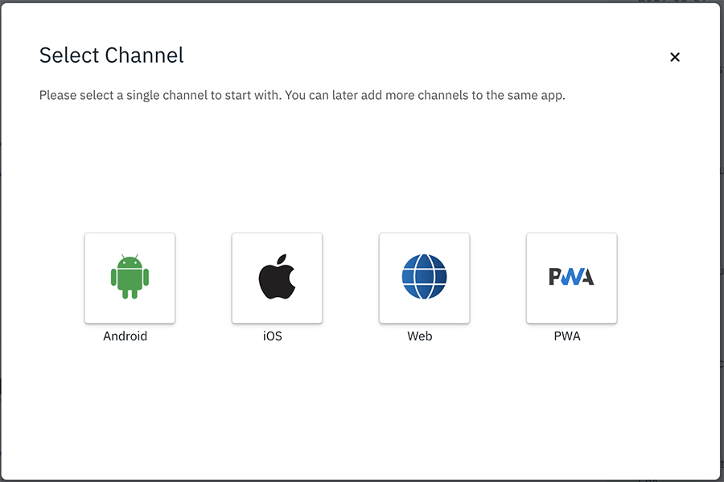

<!-- NLS_CHARSET=UTF-8 -->
## Übersicht
{: #getting-started }

Sie können den Digital App Builder wie folgt starten:

* Klicken Sie unter **Mac OS** doppelt auf das Symbol für **IBM Digital App Builder**, um den Digital App Builder zu öffnen.
* Starten Sie unter **Windows** den Digital App Builder, indem Sie **Start > Programme > IBM Digital App Builder** auswählen.

>**Hinweis**: Wenn Sie den Digital App Builder zum ersten Mal öffnen, müssen Sie die eingeblendete **Lizenz für die Verwendung von IBM Digital App Builder akzeptieren**, um fortfahren zu können. Nach dem Akzeptieren der Lizenzvereinbarung wird automatisch zum ersten Mal die **Prüfung der Voraussetzungen** durchgeführt. Wenn keine Fehler gefunden werden, klicken Sie auf **OK**. Korrigieren Sie andernfalls die Fehler und starten Sie den Digital App Builder neu.

Sie können die Option **Neue App erstellen** oder **App öffnen** auswählen oder die verfügbaren Vorlagen für die Erstellung der App nutzen. 
> **Hinweis**: Kürzlich erstellte Apps werden im Abschnitt **Letzte** angezeigt. Bei einer neuen Installation erscheint der Abschnitt **Letzte** nicht.

### Neue App erstellen
{: #create-new-app }

>**Hinweis**: Sie können eine neue App in zwei Modi erstellen, im **Entwurfsmodus** mit einer Drag-and-drop-Methode und im **Codemodus** unter Verwendung eines Codeeditors. 

Klicken Sie zum Erstellen einer neuen App im Builder-Dashboard auf das Symbol **Neue App erstellen**. 

1. Klicken Sie auf das Symbol **Neue App erstellen**, um das Fenster **Kanal auswählen** zu öffnen.

    

2. Wählen Sie den Kanal aus, für den die App entwickelt werden soll, indem Sie auf das entsprechende Symbol klicken. Sie können später weitere Kanäle zur selben App hinzufügen.

    * **Android**: Wählen Sie diese Option aus, wenn Sie eine Android-App erstellen.
    * **iOS**: Wählen Sie diese Option aus, wenn Sie eine iOS-App erstellen.
        >**Hinweis**: Sie können die iOS-Apps nur unter Mac OS erstellen und ausführen.
    * **Web**: Wählen Sie diese Option aus, wenn Sie die App für das Web erstellen.
    * **PWA**: Wählen Sie diese Option aus, wenn Sie eine Progressive Web App erstellen.

3. Das Auswahlfenster für den Typ des Servers, zu dem eine Verbindung hergestellt werden soll, wird angezeigt.

    

4. Sie können **Gemeinsam genutzter Playground-Server** oder **Angepasster professioneller Server** auswählen.

    * **Gemeinsam genutzter Playground-Server** – Dies ist ein gemeinsam genutzter Mobile Foundation Server für den Schnelleinstieg, der von IBM Cloud bereitgestellt wird.

        >**Warnung**: Der gemeinsam genutzte Playground-Server ist ein allgemeiner Server, der von vielen Entwicklern genutzt wird. Dieser Server sollte nicht für Produktions-Apps verwendet werden. Die Daten in diesem Server können ohne Vorankündigung gelöscht werden. Es gibt keine garantierte Verfügbarkeitszeit für den Server.

        

        * Geben Sie den **IBM Cloud-API-Schlüssel** ein. Informationen zu den Zugriffsdetails finden Sie im Abschnitt "Häufig gestellte Fragen" unter [**Vorgehensweise beim Erstellen eines Plattform-API-Schlüssels**](../faq/). 

        * Klicken Sie auf **Anmelden**, um eine Verbindung zum Server herzustellen. 

    * **Angepasster professioneller Server** – Sie können eine Verbindung zu Ihrem eigenen, lokal oder in IBM Cloud erstellten Mobile Foundation Server herstellen. Im Fenster **Instanz der IBM Mobile Foundation konfigurieren** können Sie einen vorhandenen Server auswählen oder einen neuen Server erstellen.

        >**Hinweis**: Sie können eine Instanz von Mobile Foundation Server in IBM Cloud bereitstellen, um ohne großen Aufwand auf diese zugreifen zu können. Wie Sie Mobile Foundation Server in IBM Cloud bereitstellen und verwenden können, erfahren Sie [hier](https://cloud.ibm.com/docs/services/mobilefoundation?topic=mobilefoundation-getting-started) in der Dokumentation.

        
 
        Im Fenster **Instanz der IBM Mobile Foundation konfigurieren** wird eine Liste der zuvor definierten Mobile-Foundation-Server-Instanzen angezeigt. Wenn Sie den Server auswählen, werden **Server-URL**, **Administratorbenutzername** und **Administratorkennwort** angezeigt. Zum Definieren eines neuen Servers können Sie auf den Link **Neuen Server erstellen** klicken. Daraufhin erscheint das neue Fenster **Instanz der IBM Mobile Foundation konfigurieren**.

        

        * Geben Sie die Details der neuen IBM Mobile-Foundation-Instanz ein, z. B. **Servername**, **Server-URL**, **Administratorbenutzername** und **Administratorkennwort**.
            >**Hinweis**: Die Server-URL und die Anmeldeberechtigungsnachweise finden Sie im Mobile-Foundation-Server-Dashboard für die ausgewählte Serverinstanz.
        * Geben Sie bei Bedarf einen **Benutzernamen** (für den vertraulichen Client) und ein **Administratorkennwort** an, um im Datenviewer eine Datenvorschau anzeigen zu können.
        * Klicken Sie auf **Verbinden**.

5. Nach erfolgreicher Anmeldung bzw. erfolgreichem Verbindungsaufbau wird das Fenster **App erstellen** angezeigt, in dem Sie eine vorhandene App-Definition auswählen können. Sie können auch eine neue Definition erstellen, indem Sie die erforderlichen Angaben machen. 
    * Geben Sie für eine neue App Folgendes an: 
        * Geben Sie den **Namen** der Anwendung, die **Position**, an der die Projektdateien gespeichert werden, die **Projekt/Bundle-ID** und die **Version** der Anwendung an. 
 
            

        * Klicken Sie auf **Erstellen**, um die Anwendung zu erstellen. Daraufhin werden die Fenster für die **Modusauswahl** angezeigt.

            

        * Wählen Sie den Entwurfs- oder Codemodus aus und klicken Sie auf **Starten**.
            * Im Entwurfsmodus können Sie die App erstellen, indem Sie Steuerelemente mit der Maus ziehen und im Erstellungsbereich ablegen.
            * Im Codemodus können Sie die App erstellen, indem Sie Code schreiben oder Code-Snippets verwenden.
        * Wenn Sie den Entwurfsmodus ausgewählt und auf **Starten** geklickt haben, erscheint die Anzeige **Willkommen bei der Workbench**.
            
        * Klicken Sie auf **Starten**, um den Arbeitsbereich des Digital App Builder für die Erstellung einer neuen Anwendung zu öffnen.

            

        * Wenn Sie den Codemodus ausgewählt und auf **Starten** geklickt haben, wird der Arbeitsbereich des Digital App Builder angezeigt, wo Sie eine neue Anwendung im Codemodus erstellen können.

            

### Vorhandene App öffnen
{: #open-an-existing-app }
 
>**Hinweis**: Sie können eine vorhandene App öffnen, die ausschließlich mit dem Digital App Builder entwickelt wurde. Standardmäßig wird die Anwendung im Entwurfsmodus geöffnet.

Sie können eine der folgenden Methoden zum Öffnen einer vorhandenen App nutzen:

* Wenn Sie auf der Homepage auf **App öffnen** klicken, wird der Dateiexplorer geöffnet. Navigieren Sie zu Ihrem App-Projektordner und klicken Sie auf **OK**, um die App zur weiteren Bearbeitung zu öffnen.
* Sie können die App auch aus der Liste der aktuellen Apps öffnen, sofern sie aufgelistet ist. Klicken Sie dazu doppelt auf den App-Namen.

    > **Hinweis**: Wenn Sie ein Projekt ausgewählt haben, das im Entwurfsmodus entwickelt wurde, wird dieses Projekt im Entwurfsmodus geöffnet. Falls Ihr Projekt im Codemodus entwickelt wurde, wird es im Codemodus geöffnet. 

* Wählen Sie eine vorhandene Anwendung aus, geben Sie die **Position** an, an der die Projektdateien gespeichert werden sollen, sowie die **Projekt/Bundle-ID** und die **Version** der Anwendung.
* Klicken Sie auf **Öffnen**. Daraufhin werden die Fenster für die **Modusauswahl** angezeigt.

    

* Wählen Sie den Entwurfs- oder Codemodus aus und klicken Sie auf **Starten**.
    * Im Entwurfsmodus können Sie die App erstellen, indem Sie Steuerelemente mit der Maus ziehen und im Erstellungsbereich ablegen.
    * Im Codemodus können Sie die App erstellen, indem Sie Code schreiben oder Code-Snippets verwenden.
* Wenn Sie den Entwurfsmodus ausgewählt und auf **Starten** geklickt haben, wird der Arbeitsbereich des Digital App Builder für die Aktualisierung einer vorhandenen Anwendung angezeigt.

    

* Wenn Sie den Codemodus ausgewählt und auf **Starten** geklickt haben, wird der Arbeitsbereich des Digital App Builder für die Aktualisierung einer vorhandenen Anwendung angezeigt.

    

### Vorlagen verwenden
{: #using-templates }

Mit Vorlagen können Sie Ihre Anwendung rasch erstellen. Die Vorlagen sind mit bestimmten Features versehen, die Sie bei der schnellen Modifikation und Entwicklung von Apps unterstützen. 

**Mod Resorts**: Diese Schablone stellt eine Beispiel-App für den Anwendungsfall einer Ferienziele-App bereit. Sie enthält für den Anfang das Anmeldemodul, das Chatmodul und das Modul für App-internes Feedback. Sie müssen die Anmeldung später implementieren und Ihre eigenen Chatbotberechtigungsnachweise konfigurieren.
