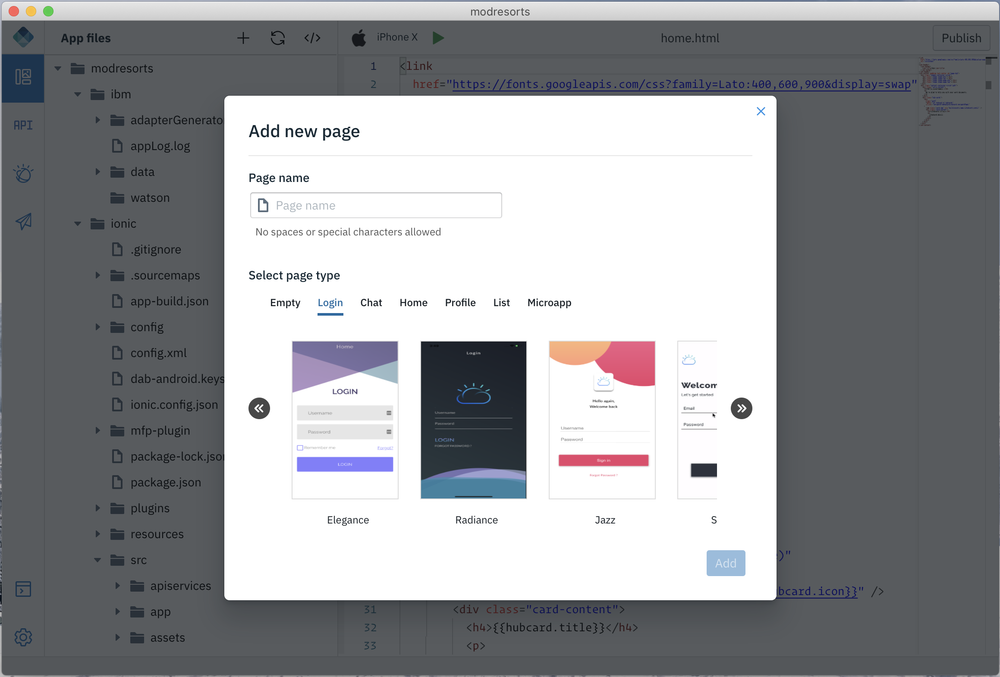

<!-- NLS_CHARSET=UTF-8 -->
## Seitenschablonen zur App hinzufügen
{: #dab-page-templates }

In IBM Digital App Builder gibt es die folgenden Seitenschablonen:
* Blank
* Login
* Chat
* Home
* Profile
* List
* Microapps

Diese Seitenschablonen sind nur für das Codeprojekt verfügbar. 

### Seitenschablonen im Codeprojekt hinzufügen
{: #adding-pg-template-code-project}

Gehen Sie wie folgt vor, um eine dieser Seitenschablonen zu Ihrer App hinzuzufügen:

1. Wählen Sie die Schaltfläche **+** bzw. **Neue Seite hinzufügen** aus, um zur Anzeige **Neue Seite hinzufügen** zu navigieren.

    

2. Geben Sie den **Seitennamen** ein.
3. Wählen Sie die Schablone für den Seitentyp und den anzuwendenden Stil aus.

    
    

4. Klicken Sie auf **Hinzufügen**.   
