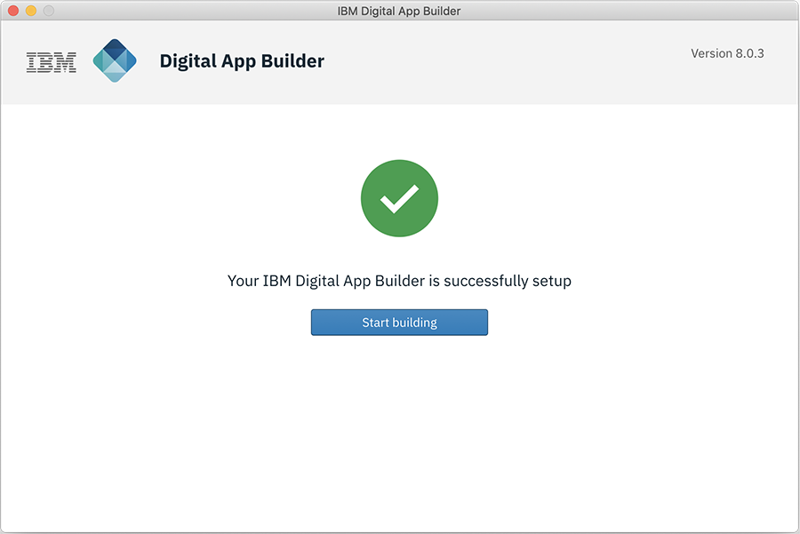

<!-- NLS_CHARSET=UTF-8 -->
## Übersicht
{: #installation-and-configuration }

Sie können den Digital App Builder auf den Plattformen Mac OS und Windows installieren. Bei der Erstinstallation wird gleichzeitig geprüft, ob vorausgesetzte Software vorhanden ist. Diese wird ggf. mit installiert. Installieren Sie Java, Xcode und Android Studio zum Generieren von Adaptern und für eine App-Vorschau während der Entwicklung. 

### Installation unter Mac OS
{: #installing-on-macos }

1. Laden Sie die .dmg-Datei (**IBM.Digital.App.Builder-n.n.n.dmg**, wobei `n.n.n` die Versionsnummer ist) über [IBM Passport Advantage](https://www.ibm.com/software/passportadvantage/) oder von [hier](https://github.com/MobileFirst-Platform-Developer-Center/Digital-App-Builder/releases) herunter.
2. Klicken Sie doppelt auf die .dmg-Datei, um das Installationsprogramm anzuhängen.
3. Ziehen Sie in dem vom Installationsprogramm geöffneten Fenster IBM Digital App Builder mit der Maus in den Ordner **Applications** und legen Sie den App Builder dort ab.
4. Klicken Sie doppelt auf das Symbol für IBM Digital App Builder oder auf die ausführbare Datei, um den Digital App Builder zu öffnen.
    > **Hinweis**: Wenn der Digital App Builder zum ersten Mal installiert wird, öffnet er die Schnittstelle für die Installation von vorausgesetzter Software. Falls bereits eine Vorgängerversion des Digital App Builder vorhanden ist, wird eine Überprüfung der vorausgesetzten Software durchgeführt. Möglicherweise müssen Sie ein Upgrade oder Downgrade für bestimmte Software durchführen, um die Voraussetzungen zu erfüllen.
    
    > Ab Version 8.0.6 umfasst das Installationsprogramm den Mobile Foundation Development Server. Während der Installation wird der Development Server mit anderen vorausgesetzten Produkten installiert. Der Lebenszyklus des Development Server (wie das Starten/Stoppen des Servers) wird im Digital App Builder gehandhabt.
    
    

5. Klicken Sie auf **Start setup**. Daraufhin erscheint die Anzeige mit der Lizenzvereinbarung.

    

6. Akzeptieren Sie die Lizenzvereinbarung und klicken Sie auf **Next**. Daraufhin erscheint die Anzeige **Install Pre-requisites**.
    >**Hinweis**: Es wird überprüft, ob vorausgesetzte Software bereits installiert ist. Für jede dieser Softwarekomponenten wird der Status angezeigt.

    

7. Klicken Sie auf **Install**, um die Softwarevoraussetzungen zu installieren, für die der Status **To be installed** ("zu installieren") angezeigt wird.

    

8. *Optional* - Nach Installation der Softwarevoraussetzungen überprüft das Installationsprogramm, ob JAVA vorhanden ist, weil der Digital App Builder JAVA für die Arbeit mit Datasets benötigt.
    > **Hinweis**: Wenn Java noch nicht installiert ist, kann eine manuelle Installation erforderlich sein. Informationen zur Installation von Java finden Sie unter [Installing Java](https://www.java.com/en/download/help/download_options.xml).

9. Nach der Installation der erforderlichen Software erscheint die Startanzeige des Digital App Builder. Klicken Sie auf **Start building**.

    

10. *Optional* - Das Installationsprogramm überprüft, ob die optionalen Komponenten Xcode (für die Voranzeige der App in einem iOS-Simulator während der Mac-OS-Entwicklung) und Android Studio (für die Voranzeige Ihrer Android-App unter Mac OS und Windows) installiert sind.
    > **Hinweis**: Möglicherweise müssen Sie Xcode und Android Studio manuell installieren. Informationen zur Cocoapods-Installation finden Sie unter [Using CocoaPods](https://guides.cocoapods.org/using/using-cocoapods). Hinweise zur Installation von Android Studio finden Sie unter [Installing Android Studio](https://developer.android.com/studio/). 

>**Hinweis**: Sie können jederzeit eine [Prüfung der Voraussetzungen](#prerequisites-check) durchführen, um sicherzustellen, dass die Installation für die Entwicklung der App vollständig ist. Falls Fehler auftreten, korrigieren Sie diese und starten Sie den Digital App Builder neu, bevor Sie eine App erstellen. 

### Installation unter Windows
{: #installing-on-windows }

1. Laden Sie die .exe-Datei (**IBM.Digital.App.Builder.Setup.n.n.n.exe**, wobei `n.n.n` die Versionsnummer ist) über [IBM Passport Advantage](https://www.ibm.com/software/passportadvantage/) oder von [hier](https://github.com/MobileFirst-Platform-Developer-Center/Digital-App-Builder/releases) herunter.
2. Führen Sie die heruntergeladene ausführbare Datei (**IBM.Digital.App.Builder.Setup.n.n.n.exe**) im Verwaltungsmodus aus.> **Hinweis**: Wenn der Digital App Builder zum ersten Mal installiert wird, öffnet er die Schnittstelle für die Installation von vorausgesetzter Software. Falls bereits eine Vorgängerversion des Digital App Builder vorhanden ist, wird eine Überprüfung der vorausgesetzten Software durchgeführt. Möglicherweise müssen Sie ein Upgrade oder Downgrade für bestimmte Software durchführen, um die Voraussetzungen zu erfüllen.
    
    > Ab Version 8.0.6 umfasst das Installationsprogramm den Mobile Foundation Development Server. Während der Installation wird der Development Server mit anderen vorausgesetzten Produkten installiert. Der Lebenszyklus des Development Server (wie das Starten/Stoppen des Servers) wird im Digital App Builder gehandhabt.

    

3. Klicken Sie auf **Start setup**. Daraufhin erscheint die Anzeige mit der Lizenzvereinbarung.

    

4. Akzeptieren Sie die Lizenzvereinbarung und klicken Sie auf **Next**. Daraufhin erscheint die Anzeige **Install Pre-requisites**.
    >**Hinweis**: Es wird überprüft, ob vorausgesetzte Software bereits installiert ist. Für jede dieser Softwarekomponenten wird der Status angezeigt.

    

5. Klicken Sie auf **Install**, um die Softwarevoraussetzungen zu installieren, für die der Status **To be installed** ("zu installieren") angezeigt wird.

    

6. *Optional* - Nach Installation der Softwarevoraussetzungen überprüft das Installationsprogramm, ob JAVA vorhanden ist, weil der Digital App Builder JAVA für die Arbeit mit Ihren Datasets benötigt.
    > **Hinweis**: Wenn Java noch nicht installiert ist, kann eine manuelle Installation erforderlich sein. Informationen zur Installation von Java finden Sie unter [Installing Java](https://www.java.com/en/download/help/download_options.xml).

7. Nach der Installation der Softwarevoraussetzungen erscheint die Startanzeige des Digital App Builder. Klicken Sie auf **Start building**.

    

    > **Hinweis**: Auf dem Desktop wird unter **Start > Programme** eine Verknüpfung erstellt. Der Standardinstallationsordner ist `<AppData>\Local\IBMDigitalAppBuilder\app-8.0.3`.

8. *Optional* - Das Installationsprogramm überprüft, ob die optionalen Komponenten Xcode (für die Voranzeige Ihrer App in einem iOS-Simulator während der Mac-OS-Entwicklung) und Android Studio (für die Voranzeige Ihrer Android-App unter Mac OS und Windows) installiert sind.
    > **Hinweis**: Installieren Sie Android Studio manuell. Hinweise zur Installation von Android Studio finden Sie unter [Installing Android Studio](https://developer.android.com/studio/). 

>**Hinweis**: Sie können jederzeit eine [Prüfung der Voraussetzungen](#prerequisites-check) durchführen, um sicherzustellen, dass die Installation für die Entwicklung der App vollständig ist. Falls Fehler auftreten, korrigieren Sie diese und starten Sie den Digital App Builder neu, bevor Sie eine App erstellen. 

### Prüfung der Voraussetzungen
{: #prerequisites-check }

Bevor Sie eine App entwickeln, können Sie **Hilfe > Prüfung der Voraussetzungen** auswählen, um eine Überprüfung der Voraussetzungen durchzuführen.

Falls Fehler auftreten, korrigieren Sie diese und starten Sie den Digital App Builder neu, bevor Sie eine App erstellen. 

>**Hinweis**: [CocoaPods](https://guides.cocoapods.org/using/using-cocoapods) ist nur für Mac OS erforderlich.
