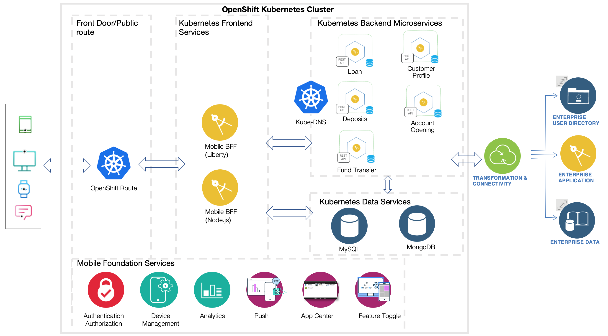

<!-- NLS_CHARSET=UTF-8 -->

> **HINWEIS:** Diese Einführung bezieht sich auf eine OpenShift-Containerplattform, die als Teil oder separat und außerhalb von IBM Cloud Pak for Applications installiert ist.

* [Einführung](#introduction)
* [Architektur](#architecture)
* [Mobile Foundation installieren](#install-mf)
* [Anwendungen entwickeln](#develop-apps)
* [Anwendungen implementieren](#deploying-apps)

## Einführung
IBM Mobile Foundation Version 8 kann jetzt in Red Hat Openshift ab Version 3.11 installiert und ausgeführt werden. Red Hat OpenShift ist eine Kubernetes-Unternehmensplattform, die speziell für die komplexe Realität der Containerkoordination in Produktionssystemen konzipiert ist.

Während Unternehmen ihr Geschäft weiter digitalisieren, ermöglichen PaaS-Anwendungsentwicklungsumgebungen, einschließlich Container- und Mikroservicearchitekturen, eine stärkere Fokussierung auf die Erstellung und Aufwertung von Anwendungsfunktionen und weniger Augenmerk auf die Verwaltung der zugrunde liegenden Betriebssysteme und Infrastruktur zu legen. Red Hat OpenShift ist für diesbezügliche Erleichterungen in Kubernetes-Umgebungen durch automatische Installation, Korrektur und Aktualisierung für jede Ebene des Container-Stacks vom Betriebssystem bis hin zu Anwendungsservices ausgelegt. 

Die Mobile Foundation ist eine branchenführende geschützte Plattform, auf der Entwickler in kurzer Zeit die nächste Generation digitaler Mehrkanal-Apps für mobile Geräte, Wearables, Chats und das Web sowie Progressive Web Apps (PWAs) entwickeln können. Die Entwicklung und Implementierung von leistungsstarken und faszinierenden digitalen Apps wird durch Folgendes beschleunigt:
* Containerisierte mobile Back-End-Services für die OpenShift-Containerplattform, zu denen Services für eine umfassende Sicherheit, die Verwaltung des Anwendungslebenszyklus, die Synchronisation von Offlinedaten und die Back-End-Integration gehören.
* Studio für die Erstellung digitaler Apps mit wenig Code und funktionale SDKs für Entwickler, die verbreitete Frameworks für mobile native Anwendungen und Hybridanwendungen nutzen.
* Ein privater App Store, in dem Sie Ihre Apps für Benutzer veröffentlichen können.
* Einbeziehung der Benutzer durch einen Analyseservice für Einblicke in die Anwendung, durch App-internes Feedback, durch Push-Benachrichtigungen, durch die Möglichkeit, Features ein- und auszuschalten und durch A/B-Tests.

## Architektur
{: #architecture}

Die folgende Abbildung gibt einen Überblick über die Architektur der Mobile-Foundation-Implementierung in einem Red-Hat-OpenShift-Cluster.

## Mobile Foundation installieren
{: #install-mf}

Führen Sie die [hier](../mobilefoundation-on-openshift) beschriebenen Anweisungen aus, um die Mobile Foundation in einem vorhandenen OpenShift-Cluster zu installieren.

>**Hinweis:** Wenn Sie die Mobile Foundation für die Containerplattform Red Hat OpenShift in IBM Cloud installieren möchten, folgen Sie den [hier](../deploy-mf-on-ibmcloud-ocp) beschriebenen Anweisungen.

## Anwendungen entwickeln
{: #develop-apps}

Mit dem Tool IBM Digital App Builder (DAB) können Sie schnell und einfach mobile Anwendungen entwickeln, die das Lebenszyklusmanagement, die Sicherheit, die Benutzereinbindung und Analysen der Mobile Foundation nutzen. DAB bietet außerdem Akzeleratoren für mobile Anwendungen für eine sichere Konnektivität zu Back-End-Mikroservices.   

* Erstellen und testen Sie Ihre erste Mobile-Foundation-Anwendung binnen Minuten: [Erste Schritte mit IBM Digital App Builder](https://github.com/MobileFirst-Platform-Developer-Center/IBMDigitalAppBuilderGettingStarted).

## Anwendungen implementieren
{: #deploying-apps}
Bei jeder Mobile-Foundation-Anwendung gibt es zwei implementierbare Ressourcen:
* Mobile Clientanwendungen, die im Mobile Foundation Application Center oder in einem anderen öffentlichen App Store implementiert werden können
* Mobile-Foundation-Service-Konfigurationen für den Anwendungslebenszyklus, für Sicherheit, für Push-Benachrichtigungen und für Liveaktualisierungen. Diese Konfigurationen können aus der Mobile-Foundation-Entwicklungsumgebung exportiert und in eine Mobile-Foundation-Bereitstellungsumgebung oder -Produktionsumgebung importiert werden.  

Weitere Informationen zum implementierungsübergreifenden Export und Import von Mobile-Foundation-Service-Konfigurationen finden Sie im Artikel [Different ways of exporting and importing Mobile Foundation server artifacts](http://mobilefirstplatform.ibmcloud.com/blog/2016/07/25/how-to-replicate-mobilefirst-environment/).
