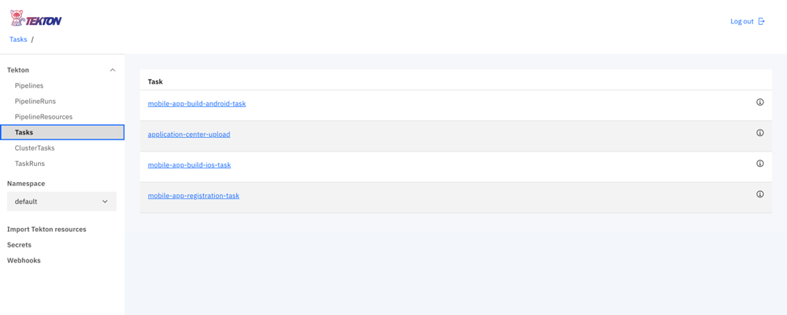
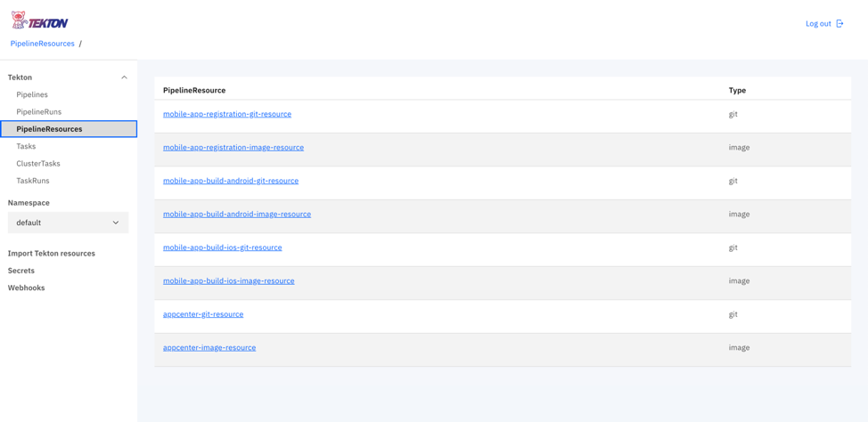
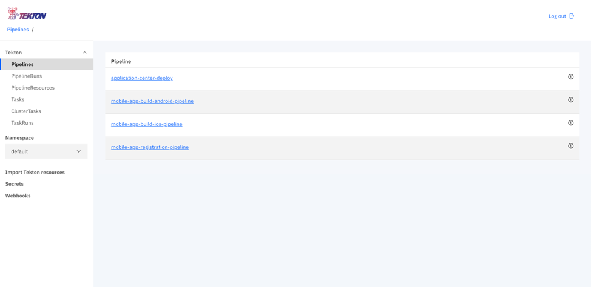
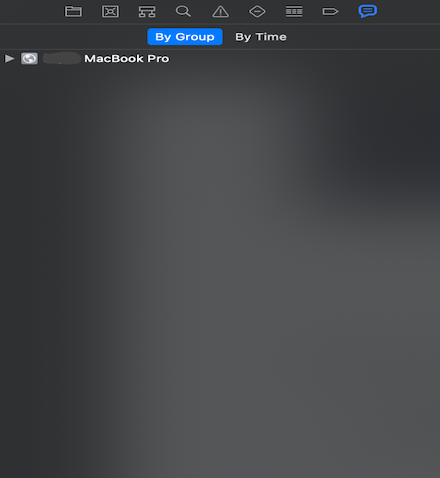
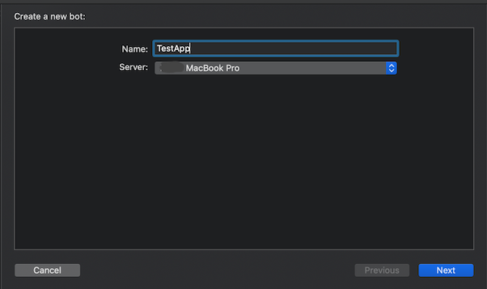
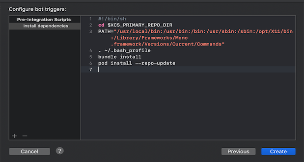
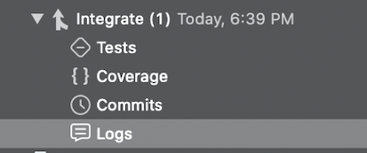

<!-- NLS_CHARSET=UTF-8 -->

Das Bundle für die Mobile Foundation in Cloud Pak for Apps enthält Tekton-Pipelines für die Automation allgemeiner DevOps-Aufgaben im Rahmen der Mobile Foundation.

>Die Implementierung der Mobile Foundation auf der OCP (OpenShift Container Platform) erfolgt unabhängig von den Nutzungsrechten für die OCP immer gleich.

## Voraussetzungen
{: #prereqs}

Bevor Sie mit der Installation der Mobile-Foundation-Instanz unter Verwendung des Mobile Foundation Operator beginnen, müssen die folgenden Voraussetzungen erfüllt sein.

- Instanz von [Cloud Pak For Apps](https://cloud.ibm.com/catalog/content/ibm-cp-applications) mit installierter Mobile Foundation
- [OpenShift-CLI](https://docs.openshift.com/enterprise/3.1/cli_reference/get_started_cli.html#installing-the-cli) (`oc`)
- Tekton (als Teil von Cloud Pak for Apps verfügbar)


## Tekton-Pipelines
{: #tekton-pipelines}

Mit der Mobile Foundation on Cloud Pak for Apps werden die folgenden Tekton-Pipelines bereitgestellt.

1.	Pipeline für die Konfiguration mobiler Apps (*mobile-app-registration-pipeline*)
2.	Pipeline für die Erstellung mobiler Apps für Android (*mobile-app-build-android-pipeline*)
3.	Pipeline für die Erstellung mobiler Apps für iOS (*mobile-app-build-ios-pipeline*)
4.	Pipeline für die Verteilung mobiler Apps (*application-center-deploy*)


### Schritte für die Ausführung der Pipelines
{: #steps-for-running-the-pipelines}

* [Laden Sie das Passport-Advantage-Archiv für die Mobile Foundation herunter](https://www.ibm.com/software/passportadvantage/pao_customer.html).
* Extrahieren Sie die Datei `IBM-MobileFoundation-Openshift-Pak-<Version>.tar.gz`.
* Wechseln Sie mit `cd` zur Position des extrahierten Ordners.
* Melden Sie sich mit dem folgenden Befehl bei der Instanz von Cloud Pak for Apps an.
  ```bash
  oc login --token=<Zugriffstoken> --server=<Serverinstanz>
  ```


#### Pipeline für die Konfiguration mobiler Apps
{: #mobile-app-configuration-pipeline}

Führen Sie den folgenden Befehl aus. 
```bash
oc apply -f pipeline/mobile-app-registration -n <Projektname>
```

Die folgende Ausgabe wird erzeugt.

```text
pipelineresource.tekton.dev/mobile-app-registration-git-resource created
pipelineresource.tekton.dev/mobile-app-registration-image-resource created
pipeline.tekton.dev/mobile-app-registration-pipeline created
task.tekton.dev/mobile-app-registration-task created
```

#### Pipeline für die Erstellung mobiler Apps für Android
{: #mobile-app-build-pipeline-android}

**Voraussetzungen**
Bevor Sie Pipelines für Android-Builds verwenden, muss ein GitHub-Token (*github-token*) zu den Build-Tasks hinzugefügt werden. Öffnen Sie die Datie `pipeline/mobile-app-build-android/buildandroidapptask.yaml` und ersetzen Sie den Platzhalter *{GITHUB_TOKEN}* im Schritt **create-release** durch ein gültiges GitHub-Token (*github-token*).

```yaml
  - name: create-release
    image: jimdo/github-release
    env:
      - name: "GITHUB_TOKEN"
        value: "{GITHUB_TOKEN}"
    command: ['/bin/bash']
```

Führen Sie den folgenden Befehl aus, wenn die Voraussetzung erfüllt ist.
```bash
oc apply -f pipeline/mobile-app-build-android -n <Projektname>
```

Die folgende Ausgabe wird erzeugt.

```text
pipelineresource.tekton.dev/mobile-app-build-android-git-sresource created
pipeline.tekton.dev/mobile-app-build-android-pipeline created
task.tekton.dev/mobile-app-build-android-task created
pipelineresource.tekton.dev/mobile-app-build-android-image-resource created
```

#### Pipeline für die Erstellung mobiler Apps für iOS
{: #mobile-app-build-pipeline-ios}

**Voraussetzungen**
1. Ähnlich wie bei Android muss ein GitHub-Token in der Datei `pipeline/mobile-app-build-ios/buildiosapptask.yaml` zum Schritt *create-release* hinzugefügt werden.
2. Sie benötigen ein Xcode-Server-Setup auf einem öffentlich zugänglichen Mac-System. Lesen Sie den Abschnitt *Xcode-Server-Setup für die Erstellung von iOS-Apps*.

Führen Sie den folgenden Befehl aus, wenn die Voraussetzung erfüllt ist.
```bash
oc apply -f pipeline/mobile-app-build-ios -n <Projektname>
```

Die folgende Ausgabe wird erzeugt.

```text
pipeline.tekton.dev/mobile-app-build-ios-pipeline created
task.tekton.dev/mobile-app-build-ios-task created
pipelineresource.tekton.dev/mobile-app-build-ios-git-resource created
pipelineresource.tekton.dev/mobile-app-build-ios-image-resource created
```

#### Pipeline für die Verteilung mobiler Apps
{: #mobile-app-dist-pipeline}

Führen Sie den folgenden Befehl aus. 
```bash
oc apply -f pipeline/mobile-app-publish -n <Projektname>
```

Die folgende Ausgabe wird erzeugt.

```text
pipelineresource.tekton.dev/appcenter-git-resource created
pipelineresource.tekton.dev/appcenter-image-resource created
pipeline.tekton.dev/application-center-deploy created
task.tekton.dev/application-center-upload created
```

Mit den obigen Befehlen werden die Tasks, Pipelines und Ressourcen erstellt.
Sie können die Tasks, Ressourcen und Pipelines im Tekton-Dashboard anzeigen. 







### Pipeline mit entsprechenden Ressourcen vom Tekton-Dashboard ausführen
{: #running-tekton-pipelines}

Bearbeiten Sie die Ressourcendatei mit der richtigen Git-Repository-URL der Anwendung.

```text
pipeline/mobile-app-registration/appregistrationgitresource.yaml
pipeline/mobile-app-build-android/ buildandoridgitresource.yaml
pipeline/mobile-app-build-ios/ buildiosgitresource.yaml
pipeline/mobile-app-publish/mobileapppublishgitresource.yaml
```

Führen Sie den Befehl aus, um die Ressourcen der Tekton-Pipeline zu aktualisieren.

```bash
oc apply -f pipeline/mobile-app-registration/appregistrationgitresource.yaml -n <Projektname>
```
Die folgende Ausgabe wird erzeugt.

```text
pipelineresource.tekton.dev/mobile-app-registration-git-resource configured
```

Führen Sie den Befehl aus, um die Ressourcen der Tekton-Pipeline zu aktualisieren.

```bash
oc apply -f pipeline/mobile-app-build-andorid/buildandoridgitresource -n <Projektname>
```
Die folgende Ausgabe wird erzeugt.

```text
pipelineresource.tekton.dev/mobile-app-build-android-git-resource configured
```

Führen Sie den Befehl aus, um die Ressourcen der Tekton-Pipeline zu aktualisieren.

```bash
oc apply -f pipleline/mobile-app-build-ios/buildiosgitresource -n <Projektname>
```
Die folgende Ausgabe wird erzeugt.

```text
pipelineresource.tekton.dev/mobile-app-build-ios-git-resource configured
```

Führen Sie den Befehl aus, um die Ressourcen der Tekton-Pipeline zu aktualisieren.

```bash
oc apply -f pipeline/mobile-app-publish/mobileapppublishgitresource.yaml -n <Projektname>
```

Die folgende Ausgabe wird erzeugt.

```text
pipelineresource.tekton.dev/appcenter-git-resource configured
```

### Pipelines mit einem PipelineRun ausführen
{: #running-pipelines-pipelinerun}

Öffnen Sie das Anwendungs-Git-Repository und bearbeiten Sie die Pipelinekonfigurationsdatei (d. h. die Datei `pipelineconfig.json` im Stammordner des Projekts). Wenn diese Datei nicht vorhanden ist, erstellen Sie (im Stammverzeichnis des GitHub-Repositorys) eine JSON-Datei `pipelineconfig.json` mit dem Hostnamen, dem Port, der Umgebungsauswahl, den Xcode-Serverdetails und den GitHub-Details.

Die Pipelinekonfigurationsdatei sollte in etwa wie folgt aussehen:

```json
{
	  "env_choice": "default",
	  "development": {
	    "hostname": "184.173.5.44",
	    "port": "30989",
	    "servercred": "admin:admin"
	  },
	  "production": {
	    "hostname": "184.173.5.44",
	    "port": "30989",
	    "servercred": "admin:admin"
	  },
	  "default": {
	    "hostname": "184.173.5.44",
	    "port": "30989",
	    "servercred": "admin:admin"
	  },
	  "userName":"github_user_name",
	  "repoName": "github_repo_name",
	  "ios": {
	     "host": "9.109.199.108",
	     "botId": "1f4a17d56578a822a49567af88000ead"
	  }
	}
```

Öffnen Sie das Tekton-Dashboard und klicken Sie auf den Abschnitt **Pipelines**.

1. Klicken Sie auf die auszuführende Pipeline.
   

2. Klicken Sie auf **Create PipelineRun**.
   

3. Wählen Sie die oben erstellte Git-Ressource **PipelineResources** aus.
4. Wählen Sie das oben erstellte Docker-Image **PipelineResources** aus.
5. Klicken Sie auf **Create PipelineRun**.
   
6. Wenn Sie die Protokolle und Status von PipelineRuns anzeigen möchten, wählen Sie im Tekton-Dashboard **PipelineRuns** aus.
   

### Pipelines mit einem Webhook auslösen
{: #trigger-pipelines-webhook}

Führen Sie die Pipeline mit einem Webhook aus, um den *PipelineRun* automatisch auszulösen, sobald es Änderungen am Anwendungs-Git-Repository gibt.

#### Erstellung von Webhooks
{: #creation-of-webhooks}

1. Klicken Sie links im Navigationsbereich des Tekton-Dashboards auf **Webhooks**.
2. Klicken Sie auf **Add Webhook**.
  
3. Geben Sie den Namen (**Name**) des Webhooks ein sowie einen wahlfreien Namen, der im Tekton-Dashboard angezeigt werden soll.
4. Geben Sie die URL des Anwendungsrepositorys (**Repository URL**) ein.
5. Geben Sie das Zugriffstoken (**Access Token**) des Git-Repositorys an.
6. Wählen Sie den **Namespace** aus, in dem alle Pipelines erstellt werden.
7. Wählen Sie die **Pipeline** aus, die ausgelöst werden soll.
8. Wählen Sie das Servicekonto (**Service Account**) als Standard aus, wenn Sie kein anderes Konto verwenden.
9. Machen Sie Angaben zur Docker-Registry (**Docker Registry**) des Clusters.
  
10. Klicken Sie auf **Create**.

Jede Pull-Anforderung an das Git-Repository sollte die Erstellung eines PipelineRun für die registrierte Pipeline auslösen.
Wenn Sie die Protokolle und Status von PipelineRuns anzeigen möchten, wählen Sie im Tekton-Dashboard **PipelineRuns** aus.

### XCode-Server-Setup für die Erstellung von iOS-Apps
{: #xcode-setup-ios-apps}

1. Richten Sie auf einem Mac-System Xcode ein.
2. Öffnen Sie Xcode.
3. Wählen Sie oben im Menü **Xcode Server** aus.

4. Aktivieren Sie Xcode Server, um die Integration durchführen zu können.

5. Wenn der Server aktiviert ist, setzen Sie im Abschnitt **Permissions** die Option **Create and View Bots** auf `all users`.

6. Fügen Sie im Abschnitt **Accounts** ein neues Konto mit dem Kontotyp `Xcode Server` hinzu. Wählen Sie dann den verfügbaren Server aus.
  
  
7. Wenn Xcode Server eingerichtet ist, muss der Bot konfiguriert werden, damit er die Integrationen durchführen und eine `ipa`-Datei generieren kann. Öffnen Sie das iOS-Projekt, das in Xcode erstellt werden soll.
8. Navigieren Sie zum Buildprotokoll für das Projekt und wählen Sie die Option **By Group** aus. Der konfigurierte Server müsste sichtbar sein.

9. Klicken Sie mit der rechten Maustaste auf den Server und wählen Sie **Create Bot** aus.

10. Geben Sie dem Bot einen Namen und klicken Sie auf **Next**. Stellen Sie sicher, dass der Botname keine Leerzeichen enthält. Konfigurieren Sie die Quellcodeverwaltung für den Bot und klicken Sie auf **Next**.

11. Stellen Sie sicher, dass in der Buildkonfiguration im Abschnitt **Actions** die Option **Archive** ausgewählt ist. Wählen Sie für die Option **Export** die Einstellung *Use Custom Export Options Plist* aus. Sie müssen eine `plist`-Datei im folgenden Format haben.

12. Wählen Sie im Abschnitt **Schedule bot integrations** die manuelle Integrationsdurchführung (*Manually*) aus. Klicken Sie dann auf **Next**.

13. Wählen Sie die relevanten Buildoptionen für Ihr Projekt aus und klicken Sie auf **Next**.
14. Vergewissern Sie sich, dass in den Abschnitten **Certificates and Profiles** relevante Zertifikate und Profile, die für die Generierung der `ipa`-Datei erforderlich sind, zum Server hinzugefügt wurden. Klicken Sie dann auf **Next**.
15. Klicken Sie im Abschnitt **Arguments and Environment Variables** auf **Next**. Klicken Sie im Abschnitt **Triggers** auf **Add** und wählen Sie *Pre-Integration script* aus. Geben Sie dem Script einen Namen und fügen Sie das folgende Script zum Scriptabschnitt hinzu. Dieses Script lädt die (ggf. vorhandenen) CocoaPod-Abhängigkeiten für die App herunter. Klicken Sie dann auf **Create**.
    ```bash
    #!/bin/sh
    cd $XCS_PRIMARY_REPO_DIR
    PATH="/usr/local/bin:/usr/bin:/bin:/usr/sbin:/sbin:/opt/X11/bin:/Library/Frameworks/Mono.framework/Versions/Current/Commands"
    . ~/.bash_profile
    bundle install
    pod install --repo-update
    ```

16. Wenn der Bot erfolgreich erstellt wurde, warten Sie auf die Durchführung der Integration. Navigieren Sie nach erfolgreicher Integration zu den Protokollen (**Logs**) für die Integration. In den Protokollen müssten Sie die Bot-ID (*botId*) sehen können. Die *botId* wird für die Durchführung der Integration von den Tekton-Pipelines aus benötigt.


   
17. Das Xcode-Server-Setup wurde erfolgreich abgeschlossen. Aktualisieren Sie die Pipelinekonfigurationsdatei der Anwendung (`pipelineconfig.json`) mit der Bot-ID (*botId*) und dem Xcode-Server-Host (*host*) im iOS-Teil der JSON-Struktur. Sie können nun `ipa`-Dateien von den Tekton-Pipelines aus generieren.  
    ```json
    "ios": {
      "host": "9.109.199.108",
      "botId": "1f4a17d56578a822a49567af88000ead"
    }
    ```
