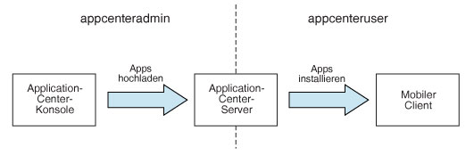
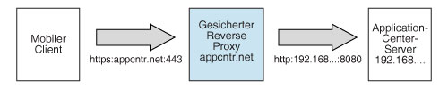

<!-- NLS_CHARSET=UTF-8 -->
## Übersicht
{: #overview }
Sie installieren das Application Center im Rahmen der Installation von {{ site.data.keys.mf_server }}. Sie können das Application Center mit einer der folgenden Methoden installieren: 

* Installation mit IBM Installation
Manager
* Installation mit Ant-Tasks
* Manuelle Installation

Wenn Sie möchten, können Sie vor der Installation von
{{ site.data.keys.mf_server }} mit dem Application Center die Datenbank Ihrer Wahl erstellen.   
Wenn Sie das Application Center im Webanwendungsserver Ihrer Wahl installiert haben, sind zusätzliche Konfigurationsschritte
erforderlich. Weitere Informationen finden Sie unten im Abschnitt "Application Center nach der Installation konfigurieren". Wenn Sie im Installationsprogramm das manuelle Setup auswählen, lesen Sie die Dokumentation zu dem Server, den Sie verwenden.

> **Hinweis:** Wenn Sie beabsichtigen, über das Application Center Anwendungen auf iOS-Geräten zu installieren, müssen Sie den Application-Center-Server zuerst mit SSL konfigurieren.


Eine Liste der installierten Dateien und Tools finden Sie unter
[Verteilerweg von {{ site.data.keys.mf_server }}](../installation-manager/#distribution-structure-of-mobilefirst-server).

#### Fahren Sie mit folgenden Abschnitten fort:
{: #jump-to }

* [Application Center mit IBM Installation Manager installieren](#installing-application-center-with-ibm-installation-manager)
* [Application Center
mit Ant-Tasks installieren](#installing-the-application-center-with-ant-tasks)
* [Application Center manuell installieren](#manually-installing-application-center)
* [Application Center nach der Installation konfigurieren](#configuring-application-center-after-installation)

## Application Center mit IBM Installation Manager installieren
{: #installing-application-center-with-ibm-installation-manager }
Mit IBM Installation Manager können Sie
das Application Center installieren, die zugehörige Datenbank erstellen und das Application Center in einem
Anwendungsserver implementieren.  
Vergewissern Sie sich vor Beginn, dass der Benutzer, der IBM Installation Manager ausführt, über die in den [Dateisystemvoraussetzungen](../appserver/#file-system-prerequisites) beschriebenen Zugriffsrechte verfügt.

Führen Sie zum Installieren des
IBM Application Center mit IBM Installation Manager
die folgenden Schritte aus.

1. Optional: Sie können Datenbanken für das Application Center gemäß der Beschreibung im Abschnitt [Optionale Datenbankerstellung](#optional-creation-of-databases) manuell erstellen. IBM Installation Manager kann automatisch Application-Center-Datenbanken
mit Standardeinstellungen erstellen.
2. Führen Sie IBM Installation Manager gemäß der Beschreibung im Abschnitt
[IBM Installation Manager ausführen](../installation-manager) aus.
3. Beantworten Sie die Frage **IBM Application Center installieren?** mit **Ja**.

#### Fahren Sie mit folgenden Abschnitten fort:
{: #jump-to-1 }
* [Optionale Datenbankerstellung](#optional-creation-of-databases)
* [Application Center in WebSphere Application Server Network Deployment installieren](#installing-application-center-in-websphere-application-server-network-deployment)
* [Installation abschließen](#completing-the-installation)
* [Von IBM Installation Manager für das Application Center erstellte Namen und Kennwörter für Standardanmeldungen](#default-logins-and-passwords-created-by-ibm-installation-manager-for-the-application-center)

### Optionale Datenbankerstellung
{: #optional-creation-of-databases }
Wenn Sie bei Ausführung des Installationsprogramms für {{ site.data.keys.mf_server }} die Option zum Installieren des Application Center aktivieren möchten, müssen Sie bestimmte Datenbankzugriffsrechte haben, damit Sie die für das Application Center erforderlichen Tabellen erstellen können.

Wenn Sie über die erforderlichen Berechtigungsnachweise zur Datenbankverwaltung verfügen und bei entsprechender Aufforderung
im Installationsprogramm
den Administratornamen und das Administratorkennwort eingeben, kann das Installationsprogramm die Datenbank für Sie erstellen. Andernfalls müssen Sie Ihren Datenbankadministrator bitten, die erforderliche Datenbank für Sie zu erstellen. Die Datenbank muss vor dem Start des
Installationsprogramms für {{ site.data.keys.mf_server }} erstellt werden.

In den folgenden Abschnitten sind die Prozeduren zum Erstellen der Datenbank für die unterstützten Datenbankmanagementsysteme beschrieben.

#### Fahren Sie mit folgenden Abschnitten fort:
{: #jump-to-2 }

* [DB2-Datenbank für das Application Center erstellen](#creating-the-db2-database-for-application-center)
* [MySQL-Datenbank für das Application Center erstellen](#creating-the-mysql-database-for-application-center)
* [Oracle-Datenbank für das Application Center erstellen](#creating-the-oracle-database-for-application-center)

#### DB2-Datenbank für das Application Center erstellen
{: #creating-the-db2-database-for-application-center }
Während der
Installation der IBM MobileFirst Foundation
kann das Installationsprogramm die Application-Center-Datenbank für Sie erstellen. 

Das Installationsprogramm
kann die Application-Center-Datenbank für Sie erstellen, wenn Sie einen Benutzernamen und ein Kennwort für einen
Benutzeraccount auf dem Datenbankserver angeben, dem die
DB2-Berechtigung SYSADM oder SYSCTRL zugeordnet ist, und wenn über SSH auf
den Benutzeraccount zugegriffen werden kann. Andernfalls kann der Datenbankadministrator die Application-Center-Datenbank für Sie erstellen.
Weitere Informationen finden Sie in der
Benutzerdokumentation zu [DB2 Solution](http://ibm.biz/knowctr#SSEPGG_9.7.0/com.ibm.db2.luw.admin.sec.doc/doc/c0055206.html). 

Wenn Sie die Datenbank
manuell erstellen, können Sie den Datenbanknamen (hier
APPCNTR) und das Kennwort durch einen Datenbanknamen und ein Kennwort Ihrer Wahl ersetzen.

> **Wichtiger Hinweis:** Sie können für die Datenbank und den Benutzer andere Namen
festlegen oder ein anderes Kennwort angeben. Achten Sie jedoch darauf, dass Sie anschließend
in der gesamten
DB2-Datenbankkonfiguration die richtigen Angaben für Datenbankname, Benutzername und Kennwort machen. In
DB2 gilt
auf allen Plattformen eine Begrenzung von Datenbanknamen
auf 8 Zeichen und
eine Benutzernamen- und Kennwortlängenbegrenzung
auf 8 Zeichen für UNIX- und
Linux-Systeme bzw. auf
30 Zeichen für
Windows.


1. Erstellen Sie mit den entsprechenden Befehlen Ihres Betriebssystems einen Systembenutzernamen, z. B.
**wluser**, in einer DB2-Admin-Gruppe wie z. B.
**DB2USERS**. Legen Sie dafür ein Kennwort fest, z. B.
**wluser**. Wenn Sie möchten,
dass mehrere Instanzen von IBM {{ site.data.keys.mf_server }}
eine Verbindung zu derselben Datenbank herstellen,
verwenden Sie für jede Verbindung einen anderen Benutzernamen. Jeder Datenbankbenutzer verfügt über ein Standardschema. Weitere Informationen zu Datenbankbenutzern
finden Sie in der DB2-Dokumentation und in der Dokumentation zu Ihrem Betriebssystem.

2. Öffnen Sie wie folgt einen
DB2-Befehlszeilenprozessor. Verwenden Sie dabei einen
Benutzer mit der Berechtigung **SYSADM** oder **SYSCTRL**. 

    * Klicken Sie auf Windows-Systemen auf **Start → IBM DB2 → Befehlszeilenprozessor**. 
    * Navigieren Sie auf Linux- oder UNIX-Systemen zu **~/sqllib/bin** und geben Sie `./db2` ein.
    * Geben Sie Datenbankmanager- und SQL-Anweisungen wie im folgenden Beispiel an,
um die Application-Center-Datenbank zu erstellen. Ersetzen Sie dabei
den Benutzernamen
**wluser** durch den Benutzernamen, den Sie gewählt haben:

      ```bash
      CREATE DATABASE APPCNTR COLLATE USING SYSTEM PAGESIZE 32768
      CONNECT TO APPCNTR
      GRANT CONNECT ON DATABASE TO USER wluser
      DISCONNECT APPCNTR
      QUIT
      ```

3. Das Installationsprogramm kann die Datenbanktabellen und -objekte für
das Application Center in einem bestimmten Schema erstellen. Dadurch können Sie dieselbe Datenbank
für das Application Center und für ein
MobileFirst-Projekt verwenden. Wenn dem in Schritt 1 erstellten Benutzer
die Berechtigung IMPLICIT\_SCHEMA zugewiesen ist (die Standardeinstellung im Datenbankerstellungsscript in Schritt 2), sind keine weiteren Aktionen erforderlich.
Wenn der Benutzer nicht
über die Berechtigung IMPLICIT\_SCHEMA verfügt, müssen Sie
ein SCHEMA für die Application-Center-Datenbanktabellen und -objekte erstellen.

#### MySQL-Datenbank für das Application Center erstellen
{: #creating-the-mysql-database-for-application-center }
Während der
MobileFirst-Installation
kann das Installationsprogramm die Application-Center-Datenbank für Sie erstellen. 

Das Installationsprogramm kann die Datenbank für Sie erstellen, wenn Sie den Namen und das Kennwort des Superuser-Accounts angeben. Weitere Informationen dazu finden Sie auf der Website
[Securing
the Initial MySQL Accounts](http://dev.mysql.com/doc/refman/5.1/en/default-privileges.html) zu Ihrem
MySQL-Datenbankserver. Die Datenbanken können auch von Ihrem Datenbankadministrator erstellt werden. Wenn die Datenbank manuell erstellt wird, können Sie den Datenbanknamen
(hier APPCNTR) und das Kennwort durch einen Datenbanknamen und ein Kennwort Ihrer Wahl ersetzen. Beachten Sie bitte, dass bei Namen von MySQL-Datenbanken
unter UNIX die Groß-/Kleinschreibung beachtet werden muss.

1. Starten Sie das
MySQL-Befehlszeilentool.
2. Geben Sie die folgenden Befehle ein:

   ```bash
   CREATE DATABASE APPCNTR CHARACTER SET utf8 COLLATE utf8_general_ci;
   GRANT ALL PRIVILEGES ON APPCNTR.* TO 'worklight'@'Worklight-Host' IDENTIFIED BY 'Kennwort';
   GRANT ALL PRIVILEGES ON APPCNTR.* TO 'worklight'@'localhost' IDENTIFIED BY 'Kennwort';
   FLUSH PRIVILEGES;
   ```

   In diesen Befehlen müssen Sie Worklight-Host durch
den Namen des Hosts ersetzen, auf dem
die IBM MobileFirst Foundation ausgeführt wird. 

#### Oracle-Datenbank für das Application Center erstellen
{: #creating-the-oracle-database-for-application-center }
Während der Installation kann das Installationsprogramm die Application-Center-Datenbank (mit Ausnahme des Datenbanktyps von
Oracle 12c) oder für eine vorhandene Datenbank den Benutzer und das Schema für Sie erstellen. 

Das Installationsprogramm kann die Datenbank (mit Ausnahme des Oracle-12c-Datenbanktyps) oder den Benutzer und das Schema in einer vorhandenen Datenbank erstellen,
wenn Sie den Namen und das Kennwort des Oracle-Administrators auf dem Datenbankserver eingeben und wenn über SSH auf den Account zugegriffen werden kann. Andernfalls kann der Datenbankadministrator die Datenbank für Sie erstellen. Wenn Sie die Datenbank oder den Benutzer
manuell erstellen, können Sie Datenbanknamen, Benutzernamen oder
ein Kennwort Ihrer Wahl verwenden. Beachten Sie jedoch, dass die Verwendung von Kleinbuchstaben in Oracle-Benutzernamen Probleme verursachen kann.

1. Falls noch keine Datenbank mit dem Namen
**ORCL** existiert, können Sie den Oracle Database Configuration Assistant (DBCA) verwenden und die Schritte in diesem Assistenten befolgen,
um eine neue Universaldatenbank mit dem Namen **ORCL** zu erstellen: 
    * Verwenden Sie den globalen Datenbanknamen **ORCL\_Ihre\_Domäne** und die System-ID (SID) **ORCL**.
    * Führen Sie auf der Registerkarte **Custom Scripts**
des Schritts
**Database Content** nicht die SQL-Scripts aus, da Sie zunächst einen Benutzeraccount erstellen müssen.
    * Wählen Sie auf der Registerkarte **Character Sets**
beim Schritt **Initialization Parameters** die Option
**Use Unicode (AL32UTF8) character set and UTF8 - Unicode 3.0 UTF-8 national character set** aus.
    * Schließen Sie das Verfahren ab, indem Sie die Standardwerte übernehmen.
2. Erstellen Sie mit **Oracle Database Control** oder mit dem Befehlszeileninterpreter **Oracle SQLPlus** einen Datenbankbenutzer.
    * **Oracle Database Control**:
        * Stellen Sie eine Verbindung als **SYSDBA** her.
        * Rufen Sie wie folgt die Seite
**Users** auf: Klicken Sie auf **Server** und anschließend im Abschnitt
**Security** auf **Users**.
        * Erstellen Sie einen Benutzer, z. B. einen Benutzer mit dem Namen
**APPCENTER**.
Wenn mehrere
Instanzen von IBM {{ site.data.keys.mf_server }} eine Verbindung zu derselben
Universaldatenbank herstellen sollen, die Sie in Schritt 1 erstellt haben, verwenden Sie
für jede Verbindung einen anderen Benutzernamen.
Jeder Datenbankbenutzer verfügt über ein Standardschema. 
        * Weisen Sie die folgenden Attribute zu:
            * Profile: **DEFAULT**
            * Authentication: **password**
            * Default tablespace: **USERS**
            * Temporary tablespace: **TEMP**
            * Status: **Unlocked**
            * Add system privilege: **CREATE SESSION**
            * Add system privilege: **CREATE SEQUENCE**
            * Add system privilege: **CREATE TABLE**
            * Add quota: **Unlimited for tablespace USERS**
    * Mit dem Befehlszeileninterpreter **Oracle SQLPlus**:   
Die Befehle im folgenden Beispiel erstellen einen Benutzer mit dem Namen
APPCENTER für die Datenbank:

        ```bash
        CONNECT SYSTEM/<SYSTEM-Kennwort>@ORCL
        CREATE USER APPCENTER IDENTIFIED BY Kennwort DEFAULT TABLESPACE USERS QUOTA UNLIMITED ON USERS;
        GRANT CREATE SESSION, CREATE SEQUENCE, CREATE TABLE TO APPCENTER;
        DISCONNECT;
        ```

### Application Center in WebSphere Application Server Network Deployment installieren
{: #installing-application-center-in-websphere-application-server-network-deployment }
Wenn das Application Center
auf mehreren Servern mit
WebSphere Application Server Network Deployment installiert werden soll, führen Sie
IBM Installation
Manager auf der Maschine aus, auf der der Deployment Manager ausgeführt wird. 

1. Wenn IBM Installation
Manager Sie zur Angabe des Datenbanktyps auffordert, wählen Sie
eine beliebige Option mit Ausnahme von
**Apache Derby** aus. Die IBM MobileFirst Foundation
unterstützt Apache Derby nur im eingebetteten Modus, und diese Option ist nicht mit der Implementierung über
WebSphere Application Server Network Deployment kompatibel. 
2. Wählen Sie in der Anzeige des Installationsprogramms,
in der das Installationsverzeichnis für WebSphere Application Server
festgelegt werden muss, das Deployment-Manager-Profil aus. 

    > **Achtung:** Wählen Sie nicht ein Anwendungsserverprofil und anschließend einen einzelnen verwalteten Server aus,
da der Deployment Manager in diesem Fall die Konfiguration des Servers überschreibt,
unabhängig davon, ob Sie die Installation auf der Maschine ausführen, auf der der Deployment Manager ausgeführt wird, oder auf einer anderen Maschine.


3. Wählen Sie den erforderlichen Geltungsbereich aus, in dem das Application Center installiert werden soll. In der folgenden Tabelle sind die verfügbaren Geltungsbereiche aufgelistet:

    | Bereich | Erläuterung |
    |--------|-------------|
    | Zelle | Installiert das Application Center in allen Anwendungsservern der Zelle |
    | Cluster | Installiert das Application Center in allen Anwendungsservern des angegebenen Clusters |
    | Knoten | Installiert das Application Center in allen Anwendungsservern des angegebenen Knotens, die nicht Teil eines Clusters sind |
    | Server | Installiert das Application Center im angegebenen Server, der nicht Teil eines Clusters ist |

4. Starten Sie die Zielserver erneut. Führen Sie dazu die unter [Installation abschließen](#completing-the-installation) beschriebene Prozedur aus.

Die Installation hat außerhalb der im angegebenen Geltungsbereich enthaltenen Server keinerlei Auswirkungen. Die JDBC-Provider und JDBC-Datenquellen werden im angegebenen Geltungsbereich definiert. Die Entitäten mit zellenweitem Geltungsbereich (die Anwendungen und für
DB2 der Authentifizierungsalias) enthalten ein Suffix in Ihrem Namen, durch das sie eindeutig gekennzeichnet werden. So können Sie
das Application Center in verschiedenen Konfigurationen oder sogar
verschiedenen Versionen in unterschiedlichen Clustern derselben
Zelle installieren. 

> **Hinweis:** Da der JDBC-Treiber nur in der angegebenen Gruppe von Anwendungsservern
installiert wird, funktioniert möglicherweise die Schaltfläche Verbindung testen in der Administrationskonsole von WebSphere Application Server
nicht für die JDBC-Datenquellen.


Wenn Sie einen Front-End-HTTP-Server verwenden, müssen Sie auch die öffentlich zugängliche URI konfigurieren.

### Installation abschließen
{: #completing-the-installation }
Nach Abschluss der Installation muss der Webanwendungsserver in bestimmten Fällen erneut gestartet werden.  
Der Webanwendungsserver muss erneut gestartet werden, wenn eine der folgenden Bedingungen vorliegt:

* Sie verwenden WebSphere Application Server
mit DB2 als Datenbanktyp.

* Sie verwenden WebSphere Application Server
und haben den Anwendungsserver ohne aktivierte Anwendungssicherheit
vor der Installation des IBM MobileFirst Application Center oder
von {{ site.data.keys.mf_server }}
geöffnet.


Zum Installieren des Application Center muss das
MobileFirst-Installationsprogramm
die Anwendungssicherheit von WebSphere Application Server aktivieren, falls
diese noch nicht aktiv ist.
Starten Sie dann nach Abschluss der Installation von {{ site.data.keys.mf_server }}
den Anwendungsserver erneut, damit diese Aktivierung stattfindet.


* Sie verwenden
WebSphere Application Server Liberty oder Apache Tomcat.

* Sie haben ein Upgrade von einer früheren Version von {{ site.data.keys.mf_server }} durchgeführt.

Wenn Sie
WebSphere Application Server Network Deployment verwenden und eine Installation über den Deployment Manager durchführen, gilt Folgendes:

* Sie müssen die Server, die während der Installation aktiv waren und in
denen die Webanwendungen für {{ site.data.keys.mf_server }} installiert sind, erneut starten.


Zum Neustart dieser Server über die Deployment-Manager-Konsole wählen Sie **Anwendungen → Anwendungstypen → WebSphere-Unternehmensanwendungen → IBM_Application\_Center\_Services → Zielspezifischer Anwendungsstatus** aus.

* Der Deployment Manager oder die Node Agents müssen nicht erneut gestartet werden.

> **Hinweis:** Es wird nur das Application Center im Anwendungsserver installiert. 

### Von IBM Installation Manager für das Application Center erstellte Namen und Kennwörter für Standardanmeldungen
{: #default-logins-and-passwords-created-by-ibm-installation-manager-for-the-application-center }
IBM Installation
Manager erstellt die Anmeldungen für das Application Center standardmäßig und entsprechend Ihrem Anwendungsserver. Sie können diese
Anmeldungen zum Testen des
Application Center verwenden.

#### WebSphere Application Server Full Profile
{: #websphere-application-server-full-profile }
Der Anmeldename **appcenteradmin** wird mit einem Kennwort erstellt, das während der Installation generiert und angezeigt wird.

Alle gegenüber dem Anwendungsrealm authentifizierten Benutzer verfügen gleichzeitig über
den Zugang zur Rolle
**appcenteradmin**. Diese Anmeldung ist nicht für eine Produktionsumgebung bestimmt. Dies gilt in besonderem Maße, wenn
WebSphere Application Server mit nur einer Sicherheitsdomäne
konfiguriert ist.

Wie Sie diese Anmeldungen modifizieren können, erfahren Sie unter
[Java-EE-Sicherheitsrollen in WebSphere Application Server Full Profile konfigurieren](#configuring-the-java-ee-security-roles-on-websphere-application-server-full-profile).


#### WebSphere Application Server Liberty Profile
{: #websphere-application-server-liberty-profile }
* Der Anmeldename demo wird in der Basisregistry (basicRegistry) mit dem Kennwort
demo erstellt.
* Der Anmeldename appcenteradmin wird in der Basisregistry (basicRegistry) mit dem Kennwort
admin erstellt.

Wie Sie diese Anmeldungen modifizieren können, erfahren Sie unter
[Java-EE-Sicherheitsrollen in WebSphere Application Server Liberty Profile konfigurieren](#configuring-the-java-ee-security-roles-on-websphere-application-server-liberty-profile).


#### Apache Tomcat
{: #apache-tomcat }
* Der Anmeldename demo wird mit dem Kennwort
demo erstellt.
* Der Anmeldename guest wird mit dem Kennwort
guest erstellt.
* Der Anmeldename appcenteradmin wird mit dem Kennwort
admin erstellt.

Wie Sie diese Anmeldungen modifizieren können, erfahren Sie unter
[Java-EE-Sicherheitsrollen in Apache Tomcat konfigurieren](#configuring-the-java-ee-security-roles-on-apache-tomcat).


## Application Center mit Ant-Tasks installieren
{: #installing-the-application-center-with-ant-tasks }
Nachfolgend sind die Ant-Tasks beschrieben, die Sie zum Installieren des
Application Center verwenden.

#### Fahren Sie mit folgenden Abschnitten fort:
{: #jump-to-3 }

* [Datenbank für das Application Center mit Ant-Tasks erstellen und konfigurieren](#creating-and-configuring-the-database-for-application-center-with-ant-tasks)
* [Application-Center-Konsole und -Services mit Ant-Tasks implementieren](#deploying-the-application-center-console-and-services-with-ant-tasks)

### Datenbank für das Application Center mit Ant-Tasks erstellen und konfigurieren
{: #creating-and-configuring-the-database-for-application-center-with-ant-tasks }
Wenn Sie die Datenbank nicht manuell erstellt haben, können Sie
Ihre Datenbank für das Application Center
mit Ant-Tasks erstellen und konfigurieren. Wenn es Ihre Datenbank bereits gibt, können Sie die Konfigurationsschritte nur mit Ant-Tasks ausführen. 

Stellen Sie zu Beginn sicher, dass auf einem Datenbankserver ein Datenbankmanagementsystem (DBMS) installiert und aktiv ist.
Der Datenbankserver kann derselbe oder ein anderer Computer sein. 

Die Ant-Tasks für das Application Center
befinden sich im Verzeichnis **ApplicationCenter/configuration-samples**
der MobileFirst-Server-Verteilung. 

Falls Sie die Ant-Task von einem Computer starten möchten,
auf dem {{ site.data.keys.mf_server }} nicht installiert ist,
müssen Sie die folgenden Dateien auf diesen Computer kopieren: 

* Bibliothek **MF-Server-Installationsverzeichnis/MobileFirstServer/mfp-ant-deployer.jar**
* Verzeichnis mit Binärdateien des Programms aapt aus dem Plattformtoolpaket des Android SDK (**MF-Server-Installationsverzeichnis/ApplicationCenter/tools/android-sdk**)
* Ant-Beispieldateien aus dem Verzeichnis **MF-Server-Installationsverzeichnis/ApplicationCenter/configuration-samples**

> **Hinweis:** Der Platzhalter **MF-Server-Installationsverzeichnis** steht für
das Verzeichnis, indem Sie {{ site.data.keys.mf_server }} installiert haben.


Führen Sie die Schritte 1 bis 3 aus,
wenn Sie Ihre Datenbank nicht wie unter [Optionale Datenbankerstellung](#optional-creation-of-databases)
beschrieben manuell erstellt haben. Wenn es Ihre Datenbank bereits gibt, müssen Sie nur die Datenbanktabellen erstellen. Führen Sie dazu die
Schritte 4 bis 7 aus.

1. Kopieren Sie die Ant-Beispieldatei für Ihr DBMS. Die Dateien für die Erstellung einer Datenbank sind nach folgendem Muster benannt:

    ```bash
    create-appcenter-database-<DBMS>.xml
    ```

2. Bearbeiten Sie die Ant-Datei. Ersetzen Sie die Platzhalterwerte durch die Eigenschaften am Anfang der Datei.
3. Führen Sie die folgenden Befehle aus, um die Application-Center-Datenbank zu erstellen:

    ```bash
    ant -f create-appcenter-database-<DBMS>.xml databases
    ```

    Der Ant-Befehl ist in **MF-Server-Installationsverzeichnis/shortcuts** enthalten.

    Wenn die Datenbank schon vorhanden ist, müssen Sie nur die Datenbanktabellen erstellen. Führen Sie dazu die folgenden Schritte aus: 

4. Kopieren Sie die Ant-Beispieldatei für Ihren Anwendungsserver und Ihr DBMS. Die Dateien zum Konfigurieren einer vorhandenen Datenbank sind nach folgendem Muster benannt:

    ```bash
    configure-appcenter-<App-Server>-<DBMS>.xml
    ```

5. Bearbeiten Sie die Ant-Datei. Ersetzen Sie die Platzhalterwerte durch die Eigenschaften am Anfang der Datei.
6. Führen Sie die folgenden Befehle aus, um die Datenbank zu konfigurieren:

    ```bash
    ant -f configure-appcenter-<App-Server>-<DBMS>.xml databases
    ```

    Der Ant-Befehl ist in **MF-Server-Installationsverzeichnis/shortcuts** enthalten.

7. Speichern Sie die Ant-Datei, damit sie Ihnen später für die Anwendung eines Fixpacks oder für ein Upgrade zur Verfügung steht.

Wenn Sie die Kennwörter nicht speichern möchten, können Sie sie durch "************" (12 Sterne) ersetzen und eine interaktive Aufforderung zur Kennworteingabe verwenden.

### Application-Center-Konsole und -Services mit Ant-Tasks implementieren
{: #deploying-the-application-center-console-and-services-with-ant-tasks }
Mithilfe von Ant-Tasks können Sie die
Application-Center-Konsole und -Services
in einem Anwendungsserver
implementieren und Datenquellen, Eigenschaften und Datenbanktreiber für
das Application Center konfigurieren. 

Vorbereitungen:

* Führen Sie die Prozedur unter [Datenbank für das Application Center
mit Ant-Tasks
erstellen und konfigurieren](#creating-and-configuring-the-database-for-application-center-with-ant-tasks) aus. 
* Sie müssen die Ant-Task auf dem Computer ausführen, auf dem der
Anwendungsserver oder der Network
Deployment Manager für
WebSphere Application Server Network Deployment installiert ist. Falls Sie die Ant-Task von einem Computer starten möchten,
auf dem {{ site.data.keys.mf_server }} nicht installiert ist,
müssen Sie die folgenden Dateien und Verzeichnisse auf diesen Computer kopieren: 

    * Bibliothek **MF-Server-Installationsverzeichnis/MobileFirstServer/mfp-ant-deployer.jar**
    * Webanwendungen (WAR- und EAR-Dateien) in **MF-Server-Installationsverzeichnis/ApplicationCenter/console**
    * Verzeichnis mit den Binärdateien des Programms aapt aus dem Plattformtoolpaket des Android SDK (**MF-Server-Installationsverzeichnis/ApplicationCenter/tools/android-sdk**)
    * Ant-Beispieldateien aus dem Verzeichnis **MF-Server-Installationsverzeichnis/ApplicationCenter/configuration-samples**

> **Hinweis:** Der Platzhalter MF-Server-Installationsverzeichnis steht für
das Verzeichnis, indem Sie {{ site.data.keys.mf_server }} installiert haben. 

1. Kopieren Sie die Ant-Datei für Ihren Anwendungsserver und Ihr DBMS. Die Dateien zum Konfigurieren des
Application Center
sind nach folgendem Muster benannt: 

    ```bash
    configure-appcenter-<App-Server>-<DBMS>.xml
    ```

2. Bearbeiten Sie die Ant-Datei. Ersetzen Sie die Platzhalterwerte durch die Eigenschaften am Anfang der Datei.
3. Führen Sie den folgenden Befehl aus, um die
Application-Center-Konsole und Application-Center-Services in einem Anwendungsserver
zu implementieren: 

    ```bash
    ant -f configure-appcenter-<App-Server>-<DBMS>.xml install
    ```

    Der Ant-Befehl ist in **MF-Server-Installationsverzeichnis/shortcuts** enthalten.

    > **Hinweis:** Sie können diese Ant-Dateien auch für folgende Aktionen verwenden:

    >
    > * Application Center mit dem Ziel **uninstall** deinstallieren
    > * Application Center mit dem Ziel **minimal-update** aktualisieren, um ein Fixpack anzuwenden

4. Speichern Sie die Ant-Datei, damit sie Ihnen später für die Anwendung eines Fixpacks oder für ein Upgrade zur Verfügung steht. Wenn Sie die Kennwörter nicht speichern möchten, können Sie sie durch "************" (12 Sterne) ersetzen und eine interaktive Aufforderung zur Kennworteingabe verwenden.
5. Überprüfen Sie bei einer Installation in WebSphere Application Server Liberty Profile oder Apache Tomcat, ob das Programm aapt von allen Benutzern ausgeführt werden kann. Gegebenenfalls müssen Sie die entsprechenden Benutzerrechte festlegen. Beispiel für UNIX/Linux-Systeme:

    ```bash
    chmod a+x MF-Server-Installationsverzeichnis/ApplicationCenter/tools/android-sdk/*/aapt*
    ```

## Application Center manuell installieren
{: #manually-installing-application-center }
{{ site.data.keys.mf_server }} muss rekonfiguriert werden,
wenn Sie von den Festlegungen während der Installation abweichen und eine andere Datenbank oder ein anderes Schema verwenden möchten. Diese Rekonfiguration richtet sich nach dem Typ der Datenbank und dem Typ
des Anwendungsservers.

In Anwendungsservern mit Ausnahme von Apache Tomcat können Sie das
Application Center mit zwei
WAR-Dateien oder einer EAR-Datei implementieren. 

> **Einschränkung:** Unabhängig davon, ob Sie das
Application Center im Rahmen der MobileFirst-Server-Installation mit IBM Installation Manager oder
manuell installieren, müssen Sie beachten, dass schrittweise Aktualisierungen
des Application Center nicht unterstützt
werden. Dies bedeutet, dass in derselben Datenbank nicht zwei verschiedene Versionen des
Application Center (z. B. Version 5.0.6 und Version 6.0.0) verwendet werden können.


#### Fahren Sie mit folgenden Abschnitten fort:
{: #jump-to-4 }

* [DB2-Datenbank für das Application Center manuell konfigurieren](#configuring-the-db2-database-manually-for-application-center)
* [Apache-Derby-Datenbank für das Application Center manuell konfigurieren](#configuring-the-apache-derby-database-manually-for-application-center)
* [MySQL-Datenbank für das Application Center manuell konfigurieren](#configuring-the-mysql-database-manually-for-application-center)
* [Oracle-Datenbank für das Application Center manuell konfigurieren](#configuring-the-oracle-database-manually-for-application-center)
* [Application-Center-WAR-Dateien implementieren und Anwendungsserver manuell konfigurieren](#deploying-the-application-center-war-files-and-configuring-the-application-server-manually)
* [Application-Center-EAR-Datei implementieren und Anwendungsserver manuell konfigurieren](#deploying-the-application-center-ear-file-and-configuring-the-application-server-manually)

### DB2-Datenbank für das Application Center manuell konfigurieren
{: #configuring-the-db2-database-manually-for-application-center }
Bei der manuellen Konfiguration der
DB2-Datenbank erstellen Sie die Datenbank und die Datenbanktabellen und konfigurieren anschließend den relevanten Anwendungsserver
für die Verwendung dieser Datenbankkonfiguration.


1. Erstellen Sie die Datenbank. Dieser Schritt ist unter [DB2-Datenbank für das Application Center erstellen](#creating-the-db2-database-for-application-center) beschrieben.
2. Erstellen Sie die Tabellen in der Datenbank. Dieser Schritt ist unter [DB2-Datenbank für das Application Center manuell einrichten](#setting-up-your-db2-database-manually-for-application-center) beschrieben.
3. Führen Sie das anwendungsserverspezifische Setup entsprechend der
folgenden Liste aus.

#### Fahren Sie mit folgenden Abschnitten fort:
{: #jump-to-5 }

* [DB2-Datenbank für das Application Center manuell einrichten](#setting-up-your-db2-database-manually-for-application-center)
* [DB2 für das Application Center manuell in Liberty Profile konfigurieren](#configuring-liberty-profile-for-db2-manually-for-application-center)
* [DB2 für das Application Center manuell in WebSphere Application Server konfigurieren](#configuring-websphere-application-server-for-db2-manually-for-application-center)
* [DB2 für das Application Center manuell in Apache Tomcat konfigurieren](#configuring-apache-tomcat-for-db2-manually-for-application-center)

##### DB2-Datenbank für das Application Center manuell einrichten
{: #setting-up-your-db2-database-manually-for-application-center }
Erstellen Sie das Datenbankschema, um Ihre
DB2-Datenbank für
das Application Center einzurichten.

1. Erstellen Sie mit den entsprechenden Befehlen für Ihr Betriebssystem
einen Systembenutzer mit dem Namen
**worklight** in einer DB2-Admin-Gruppe wie **DB2USERS**. Legen Sie für den Benutzer
das Kennwort **worklight** fest. Weitere Informationen finden Sie in
der DB2-Dokumentation und in der Dokumentation zu Ihrem Betriebssystem.


> **Wichtiger Hinweis:** Sie können für den Benutzer auch einen anderen Namen oder ein anderes Kennwort angeben.
Achten Sie jedoch darauf, dass Sie anschließend
in der gesamten
DB2-Datenbankkonfiguration die richtigen Angaben für Benutzername und Kennwort machen. In DB2 gilt eine Benutzernamen- und Kennwortlängenbegrenzung von 8 Zeichen für UNIX- und Linux-Systeme bzw. von 30 Zeichen für Windows.

2. Öffnen Sie wie folgt einen
DB2-Befehlszeilenprozessor. Verwenden Sie dabei einen
Benutzer mit der Berechtigung **SYSADM** oder **SYSCTRL**. 
    * Klicken Sie auf Windows-Systemen auf **Start → IBM DB2 → Befehlszeilenprozessor**.
    * Navigieren Sie auf Linux- oder UNIX-Systemen zu **~/sqllib/bin** und geben Sie `./db2` ein.

3. Geben Sie die folgenden Datenbankmanager- und SQL-Anweisungen ein, um die Datenbank mit dem Namen **APPCNTR** zu erstellen: 

   ```bash
   CREATE DATABASE APPCNTR COLLATE USING SYSTEM PAGESIZE 32768
   CONNECT TO APPCNTR
   GRANT CONNECT ON DATABASE TO USER worklight
   QUIT
   ```

4. Führen Sie
DB2 mit folgenden Befehlen aus, um
die **APPCNTR**-Tabellen in einem Schema
mit dem Namen **APPSCHM** zu erstellen (der Schemaname kann geändert werden). Dieser Befehl kann für eine vorhandene Datenbank ausgeführt werden, deren Seitengröße mit der in Schritt 3 definierten kompatibel ist.

   ```bash
   db2 CONNECT TO APPCNTR
   db2 SET CURRENT SCHEMA = 'APPSCHM'
   db2 -vf Produktinstallationsverzeichnis/ApplicationCenter/databases/create-appcenter-db2.sql -t
   ```

##### DB2 für das Application Center manuell in Liberty Profile konfigurieren
{: #configuring-liberty-profile-for-db2-manually-for-application-center }
Sie können Ihre DB2-Datenbank für das Application Center manuell in
WebSphere Application Server Liberty Profile einrichten und
konfigurieren.  
Führen Sie die Setup-Prozedur für die
DB2-Datenbank aus, bevor Sie fortfahren.

1. Fügen Sie die JAR-Datei des DB2-JDBC-Treiber zu **$LIBERTY\_HOME/wlp/usr/shared/resources/db2** hinzu. 

    Wenn dieses Verzeichnis nicht existiert, erstellen Sie es. Sie haben zwei Möglichkeiten, die Datei abzurufen: 
    * Laden Sie sie
von der Seite [DB2 JDBC Driver Versions](http://www.ibm.com/support/docview.wss?uid=swg21363866) herunter.
    * Rufen Sie sie aus dem Verzeichnis **DB2-Installationsverzeichnis/java** von DB2 Server ab. 

2. Konfigurieren Sie die Datenquelle in der Datei **$LIBERTY_HOME/wlp/usr/servers/worklightServer/server.xml** wie folgt: 

   Sie können
**worklightServer** im Pfad durch den Namen Ihres Servers ersetzen. 

   ```xml
   <library id="DB2Lib">
        <fileset dir="${shared.resource.dir}/db2" includes="*.jar"/>
   </library>

   <!-- IBM Application-Center-Datenbank deklarieren -->
   <dataSource jndiName="jdbc/AppCenterDS" transactional="false">
      <jdbcDriver libraryRef="DB2Lib"/>
      <properties.db2.jcc databaseName="APPCNTR"  currentSchema="APPSCHM"
            serverName="db2server" portNumber="50000"
            user="worklight" password="worklight"/>
   </dataSource>
   ```

   Der Platzhalter
**worklight** hinter **username=** ist der Name des
Systembenutzers mit Verbindungszugriff (**CONNECT**) auf die zuvor erstellte Datenbank **APPCNTR**.
  

   Der Platzhalter **worklight** hinter **password=** ist das Benutzerkennwort. Wenn Sie einen anderen Benutzer und/oder ein anderes Kennwort definiert haben, ersetzen Sie **worklight** durch die entsprechende Angabe. Ersetzen Sie außerdem **db2server** durch den Hostnamen Ihres DB2 Server (z. B. **localhost**, wenn sich der Server auf demselben Computer befindet).

   In DB2 gilt eine Benutzernamen- und Kennwortlängenbegrenzung von 8 Zeichen für UNIX- und Linux-Systeme bzw. von 30 Zeichen für Windows.

3. Sie können das Datenbankkennwort mit dem Programm securityUtility im Verzeichnis **Liberty-Installationsverzeichnis/bin** verschlüsseln.

##### DB2 für das Application Center manuell in WebSphere Application Server konfigurieren
{: #configuring-websphere-application-server-for-db2-manually-for-application-center }
Sie können Ihre DB2-Datenbank für das Application Center manuell in
WebSphere Application Server einrichten und
konfigurieren.

1. Bestimmen Sie ein geeignetes Verzeichnis für die JAR-Datei des JDBC-Treibers
im Installationsverzeichnis von WebSphere Application Server. 
    * Für einen eigenständigen Server können Sie ein Verzeichnis wie **WAS-Installationsverzeichnis/optionalLibraries/IBM/Worklight/db2** verwenden.
    * Verwenden Sie für die Implementierung in einer WebSphere-Application-Server-ND-Zelle **WAS-Installationsverzeichnis/profiles/Profilname/config/cells/Zellenname/Worklight/db2**.
    * Verwenden Sie für die Implementierung in einem WebSphere-Application-Server-ND-Cluster **WAS-Installationsverzeichnis/profiles/Profilname/config/cells/Zellenname/clusters/Clustername/Worklight/db2**.
    * Verwenden Sie für die Implementierung auf einem WebSphere-Application-Server-ND-Knoten **WAS-Installationsverzeichnis/profiles/Profilname/config/cells/Zellenname/nodes/Knotenname/Worklight/db2**.
    * Verwenden Sie für die Implementierung auf einem Server mit WebSphere Application Server ND **WAS-Installationsverzeichnis/profiles/Profilname/config/cells/Zellenname/nodes/Knotenname/servers/Servername/Worklight/db2**.

    Falls dieses Verzeichnis nicht vorhanden ist, erstellen Sie es. 

2. Fügen Sie die JAR-Datei für den DB2-JDBC-Treiber
sowie ggf. die zugehörigen Lizenzdateien dem in Schritt 1 bestimmten Verzeichnis hinzu.   
Sie haben zwei Möglichkeiten, die Treiberdatei abzurufen:
    * Laden Sie sie
von der Seite [DB2 JDBC Driver Versions](http://www.ibm.com/support/docview.wss?uid=swg21363866) herunter.
    * Rufen Sie sie aus dem Verzeichnis **DB2-Installationsverzeichnis/java** von DB2 Server ab. 

3. Klicken Sie in der WebSphere-Application-Server-Konsole auf **Ressourcen → JDBC → JDBC-Provider**.  
    * Wählen Sie im Kombinationsfeld **Bereich** den entsprechenden Bereich aus. 
    * Klicken Sie auf **Neu**.
    * Setzen Sie den **Datenbanktyp** auf **DB2**.
    * Setzen Sie den **Providertyp** auf **DB2
Using IBM JCC Driver**.
    * Setzen Sie den **Implementierungstyp** auf **Datenquelle des Verbindungspools**.
    * Setzen Sie die Option **Name** auf **DB2 Using IBM JCC Driver**.
    * Klicken Sie auf
**Weiter**.
    * Setzen Sie den Klassenpfad auf die JAR-Dateien in dem in Schritt 1 bestimmten Verzeichnis und ersetzen Sie dabei **WAS-Installationsverzeichnis/profiles/Profilname** durch den Verweis auf die WebSphere-Application-Server-Variable `${USER_INSTALL_ROOT}`.
    * Geben Sie keinen **Pfad der nativen Bibliothek** an.
    * Klicken Sie auf
**Weiter**.
    * Klicken Sie auf
**Fertigstellen**.
    * Der JDBC-Provider wird erstellt.
    * Klicken Sie auf **Speichern**.

4. Erstellen Sie wie folgt eine Datenquelle für die
Application-Center-Datenbank:
    * Klicken Sie auf **Ressourcen → JDBC → Datenquellen**.
    * Wählen Sie im Kombinationsfeld **Bereich** den entsprechenden Bereich aus. 
    * Klicken Sie auf
**Neu**, um eine neue Datenquelle zu erstellen.
    * Geben Sie
**Application-Center-Datenbank** als **Name der Datenquelle** an.
    * Setzen Sie **JNDI-Name** auf **jdbc/AppCenterDS**.
    * Klicken Sie auf
**Weiter**.
    * Geben Sie Eigenschaften für die Datenquelle ein. Beispiel: 
        * **Treibertyp**: 4
        * **Datenbankname**: APPCNTR
        * **Servername**: localhost
        * **Portnummer**: 50000 (Standard)
    * Klicken Sie auf
**Weiter**.
    * Erstellen Sie JAAS-J2C-Authentifizierungsdaten, wobei Sie für die Containerverbindung
den DB2-Benutzernamen und das DB2-Kennwort als Eigenschaften angeben. Falls erforderlich, rufen Sie erneut
den Assistenten für die Datenquellenerstellung auf. Wiederholen Sie dazu die Schritte
4.a bis 4.h. 
    * Wählen Sie den Authentifizierungsalias aus, den Sie im Kombinationsfeld
**Alias für komponentengesteuerte Authentifizierung** (nicht im Kombinationsfeld
**Alias für containergesteuerte Authentifizierung**) erstellt haben. 
    * Klicken Sie auf
**Weiter** und dann auf **Fertigstellen**.
    * Klicken Sie auf **Speichern**.
    * Wählen Sie unter **Ressourcen → JDBC → Datenquellen** die neue Datenquelle aus. 
    * Klicken Sie auf
**Eigenschaften für WebSphere-Datenquelle**.
    * Wählen Sie das Kontrollkästchen **Nicht transaktionsorientierte Datenquelle** aus.
    * Klicken Sie auf **OK**. 
    * Klicken Sie auf **Speichern**.
    * Klicken Sie für die Datenquelle auf
**Angepasste Eigenschaften**, wählen Sie die Eigenschaft
**currentSchema** aus und legen Sie als Wert für die Eigenschaft das zum Erstellen der Application-Center-Tabellen
verwendete Schema fest (in diesem Beispiel
APPSCHM).
5. Testen Sie die Datenquellenverbindung, indem Sie
**Datenquelle** auswählen und auf
**Verbindung testen** klicken.

Übernehmen Sie die Auswahl von **Diese Datenquelle für containergesteuerte Persistenz (CMP) verwenden**. 

##### DB2 für das Application Center manuell in Apache Tomcat konfigurieren
{: #configuring-apache-tomcat-for-db2-manually-for-application-center }
Verwenden Sie die folgende Vorgehensweise, um Ihre
DB2-Datenbank für
das Application Center manuell
im Apache-Tomcat-Server einzurichten und zu konfigurieren.  
Führen Sie die Setup-Prozedur für die
DB2-Datenbank aus, bevor Sie fortfahren.

1. Fügen Sie die JAR-Datei des DB2-JDBC-Treibers
hinzu.

    Sie können diese JAR-Datei auf eine der folgenden Arten abrufen:
    * Laden Sie sie
von der Seite [DB2 JDBC Driver Versions](http://www.ibm.com/support/docview.wss?uid=swg21363866) herunter.
    * Sie können sie auch aus dem Verzeichnis **DB2-Installationsverzeichnis/java** von DB2 Server
abrufen und in das Verzeichnis **$TOMCAT_HOME/lib** stellen.

2. Erstellen Sie eine XML-Anweisung, die die Datenquelle definiert. Sehen Sie sich dazu das folgende Codebeispiel an. 

   ```xml
   <Resource auth="Container"
            driverClassName="com.ibm.db2.jcc.DB2Driver"
            name="jdbc/AppCenterDS"
            username="worklight"
            password="password"
            type="javax.sql.DataSource"
            url="jdbc:db2://server:50000/APPCNTR:currentSchema=APPSCHM;"/>
   ```

   Der Parameter
**worklight** hinter **username=** ist der Name des
Systembenutzers mit Verbindungszugriff (CONNECT) auf die zuvor erstellte
Datenbank **APPCNTR**. Der Parameter **password** hinter **password=** ist das
Benutzerkennwort. Wenn Sie entweder einen anderen Benutzernamen und/oder
ein anderes Kennwort definiert haben, ersetzen Sie diese Angaben dementsprechend.

   DB2 erzwingt eine Begrenzung der Länge von Benutzernamen und Kennwörtern.
    * UNIX- und Linux-Systeme: 8 Zeichen
    * Windows: 30 Zeichen

3. Fügen Sie diese Anweisung wie unter [Apache Tomcat für das Application Center manuell konfigurieren](#configuring-apache-tomcat-for-application-center-manually) angegeben in die Datei server.xml ein.

### Apache-Derby-Datenbank für das Application Center manuell konfigurieren
{: #configuring-the-apache-derby-database-manually-for-application-center }
Bei der manuellen Konfiguration
der Apache Derby-Datenbank erstellen Sie die Datenbank und Datenbanktabellen und konfigurieren anschließend den relevanten Anwendungsserver für die Verwendung dieser Datenbankkonfiguration.

1. Erstellen Sie die Datenbank und die darin enthaltenen Tabellen. Dieser Schritt ist unter [Apache-Derby-Datenbank für das Application Center manuell einrichten](#setting-up-your-apache-derby-database-manually-for-application-center) beschrieben.
2. Konfigurieren Sie den Anwendungsserver für die Verwendung dieser Datenbankkonfiguration. Fahren Sie mit einem der folgenden Abschnitte fort.

#### Fahren Sie mit folgenden Abschnitten fort:
{: #jump-to-6 }

* [Apache-Derby-Datenbank für das Application Center manuell einrichten](#setting-up-your-apache-derby-database-manually-for-application-center)
* [Derby für das Application
Center manuell in Liberty Profile konfigurieren](#configuring-liberty-profile-for-derby-manually-for-application-center)
* [Derby für das Application Center manuell in WebSphere Application Server konfigurieren](#configuring-websphere-application-server-for-derby-manually-for-application-center)
* [Derby für das Application Center manuell in Apache Tomcat konfigurieren](#configuring-apache-tomcat-for-derby-manually-for-application-center)

##### Apache-Derby-Datenbank für das Application Center manuell einrichten
{: #setting-up-your-apache-derby-database-manually-for-application-center }
Erstellen Sie das Datenbankschema, um Ihre
Apache-Derby-Datenbank für
das Application Center einzurichten.

1. Führen Sie an der Position, an der die Datenbank erstellt werden soll,
**ij.bat** (auf Windows-Systemen) bzw.
**ij.sh** (auf UNIX- und
Linux-Systemen) aus. 

   > **Hinweis:** Das Programm ij ist Teil von Apache Derby. Wenn Sie es noch nicht installiert haben, können Sie es von
der Webseite [Apache
Derby: Downloads](http://db.apache.org/derby/derby_downloads) herunterladen.


   Unterstützte Versionen von Apache Derby
sind in den
[Systemvoraussetzungen](../../../product-overview/requirements) angegeben.  
Das Script zeigt die Versionsnummer von ij an.

2. Geben Sie an der Eingabeaufforderung die folgenden Befehle ein:

   ```bash
   connect 'jdbc:derby:APPCNTR;user=APPCENTER;create=true';
   run '<Produktinstallationsverzeichnis>/ApplicationCenter/databases/create-appcenter-derby.sql';
   quit;
   ```

##### Derby für das Application Center manuell in Liberty Profile konfigurieren
{: #configuring-liberty-profile-for-derby-manually-for-application-center }
Verwenden Sie die folgende Vorgehensweise, um Ihre
Apache-Derby-Datenbank für
das Application Center manuell in
WebSphere Application Server Liberty Profile einzurichten und zu konfigurieren. Beenden Sie das Apache-Derby-Datenbank-Setup, bevor Sie fortfahren.

Konfigurieren Sie die Datenquelle
in der Datei $LIBERTY_HOME/usr/servers/worklightServer/server.xml wie folgt (worklightServer kann in diesem Pfad
durch den Namen Ihres Servers ersetzt werden):

```xml
<!-- JAR-Dateien für Derby-Zugriff über JDBC deklarieren -->
<library id="derbyLib">
  <fileset dir="C:/Drivers/derby" includes="derby.jar" />
</library>

<!-- IBM Application-Center-Datenbank deklarieren -->
<dataSource jndiName="jdbc/AppCenterDS" transactional="false" statementCacheSize="10">
  <jdbcDriver libraryRef="derbyLib"
              javax.sql.ConnectionPoolDataSource="org.apache.derby.jdbc.EmbeddedConnectionPoolDataSource40"/>
  <properties.derby.embedded databaseName="DERBY_DATABASES_DIR/APPCNTR" user="APPCENTER"
                             shutdownDatabase="false" connectionAttributes="upgrade=true"/>
  <connectionManager connectionTimeout="180"
                     maxPoolSize="10" minPoolSize="1"
                     reapTime="180" maxIdleTime="1800"
                     agedTimeout="7200" purgePolicy="EntirePool"/>
</dataSource>
```

##### Derby für das Application Center manuell in WebSphere Application Server konfigurieren
{: #configuring-websphere-application-server-for-derby-manually-for-application-center }
Sie können Ihre Apache-Derby-Datenbank für das Application Center manuell in
WebSphere Application Server einrichten und
konfigurieren. Beenden Sie das Apache-Derby-Datenbank-Setup, bevor Sie fortfahren.

1. Bestimmen Sie ein geeignetes Verzeichnis für die JAR-Datei des JDBC-Treibers
im Installationsverzeichnis von WebSphere Application Server. Falls dieses Verzeichnis nicht vorhanden ist, erstellen Sie es. 
    * Für einen eigenständigen Server können Sie ein Verzeichnis wie **WAS-Installationsverzeichnis/optionalLibraries/IBM/Worklight/db2** verwenden.
    * Verwenden Sie für die Implementierung in einer WebSphere-Application-Server-ND-Zelle **WAS-Installationsverzeichnis/profiles/Profilname/config/cells/Zellenname/Worklight/derby**.
    * Verwenden Sie für die Implementierung in einem WebSphere-Application-Server-ND-Cluster **WAS-Installationsverzeichnis/profiles/Profilname/config/cells/Zellenname/clusters/Clustername/Worklight/derby**.
    * Verwenden Sie für die Implementierung auf einem WebSphere-Application-Server-ND-Knoten **WAS-Installationsverzeichnis/profiles/Profilname/config/cells/Zellenname/nodes/Knotenname/Worklight/derby**.
    * Verwenden Sie für die Implementierung auf einem Server mit WebSphere Application Server ND **WAS-Installationsverzeichnis/profiles/Profilname/config/cells/Zellenname/nodes/Knotenname/servers/Servername/Worklight/derby**.
2. Fügen Sie die **Derby**-JAR-Datei (**Produktinstallationsverzeichnis/ApplicationCenter/tools/lib/derby.jar**)
zu dem in Schritt 1 ermittelten Verzeichnis
hinzu. 
3. Führen Sie die folgenden Schritte aus, um den JDBC-Provider einzurichten.
    * Klicken Sie in der WebSphere-Application-Server-Konsole auf **Ressourcen → JDBC → JDBC-Provider**.
    * Wählen Sie im Kombinationsfeld **Bereich** den entsprechenden Bereich aus. 
    * Klicken Sie auf **Neu**.
    * Setzen Sie den **Datenbanktyp** auf **Benutzerdefiniert**.
    * Setzen Sie **Name der Implementierungsklasse** auf **org.apache.derby.jdbc.EmbeddedConnectionPoolDataSource40**.
    * Setzen Sie **Name** auf **Worklight
- Derby JDBC Provider**.
    * Setzen Sie **Beschreibung** auf **Derby
JDBC provider for Worklight**.
    * Klicken Sie auf
**Weiter**.
    * Setzen Sie den **Klassenpfad** auf die JAR-Datei in dem in Schritt 1 bestimmten
Verzeichnis und ersetzen Sie dabei **WAS-Installationsverzeichnis/profiles/Profilname** durch
den Verweis auf die WebSphere-Application-Server-Variable **${USER\_INSTALL\_ROOT}**.
    * Klicken Sie auf
**Fertigstellen**.
4. Erstellen Sie die Datenquelle für die **Worklight**-Datenbank.
    * Klicken Sie in der WebSphere-Application-Server-Konsole auf **Ressourcen → JDBC → Datenquellen**.
    * Wählen Sie im Kombinationsfeld **Bereich** den entsprechenden Bereich aus. 
    * Klicken Sie auf **Neu**.
    * Setzen Sie **Name der Datenquelle** auf **Application-Center-Datenbank**.
    * Setzen Sie **JNDI-Name** auf **jdbc/AppCenterDS**.
    * Klicken Sie auf
**Weiter**.
    * Wählen Sie den vorhandenen JDBC-Provider mit dem Namen **Worklight - Derby JDBC Provider** aus.
    * Klicken Sie auf
**Weiter**.
    * Klicken Sie auf
**Weiter**.
    * Klicken Sie auf
**Fertigstellen**.
    * Klicken Sie auf **Speichern**.
    * Klicken Sie in der Tabelle auf die Datenquelle des Typs **Application-Center-Datenbank**, die Sie erstellt haben. 
    * Klicken Sie unter **Weitere Eigenschaften** auf
**Angepasste Eigenschaften**. 
    * Klicken Sie auf **databaseName**. 
    * Setzen Sie das Feld **Wert** auf den Pfad zu der **APPCNTR**-Datenbank, die
Sie im Abschnitt [Apache-Derby-Datenbank für das Application Center manuell einrichten](#setting-up-your-apache-derby-database-manually-for-application-center) erstellt haben. 
    * Klicken Sie auf **OK**. 
    * Klicken Sie auf **Speichern**.
    * Klicken Sie oben auf der Seite auf **Application-Center-Datenbank**. 
    * Klicken Sie unter **Weitere Eigenschaften** auf **Eigenschaften der WebSphere Application Server-Datenquelle**.
    * Wählen Sie **Nicht transaktionsorientierte Datenquelle** aus.
    * Klicken Sie auf **OK**. 
    * Klicken Sie auf **Speichern**.
    * Wählen Sie in der Tabelle die von Ihnen erstellte Datenquelle des Typs **Application-Center-Datenbank** aus. 
    * Optional: Klicken Sie nur, wenn Sie nicht in der Konsole eines
WebSphere Application Server Deployment Manager arbeiten, auf **Verbindung testen**. 

##### Derby für das Application Center manuell in Apache Tomcat konfigurieren
{: #configuring-apache-tomcat-for-derby-manually-for-application-center }
Sie können Ihre Apache-Derby-Datenbank manuell im Apache Tomcat Application Server
einrichten und für das
Application Center konfigurieren. Beenden Sie das Apache-Derby-Datenbank-Setup, bevor Sie fortfahren.

1. Fügen Sie die **Derby**-JAR-Datei (**Produktinstallationsverzeichnis/ApplicationCenter/tools/lib/derby.jar**)
zum Verzeichnis **$TOMCAT\_HOME/lib** hinzu. 
2. Erstellen Sie eine XML-Anweisung, die die Datenquelle definiert. Sehen Sie sich dazu das folgende Codebeispiel an. 

   ```xml
   <Resource auth="Container"
            driverClassName="org.apache.derby.jdbc.EmbeddedDriver"
            name="jdbc/AppCenterDS"
            username="APPCENTER"
            password=""
            type="javax.sql.DataSource"
            url="jdbc:derby:DERBY_DATABASES_DIR/APPCNTR"/>
   ```

3. Fügen Sie diese Anweisung wie unter [Apache Tomcat für das Application Center manuell konfigurieren](#configuring-apache-tomcat-for-application-center-manually) angegeben in die Datei **server.xml** ein.

### MySQL-Datenbank für das Application Center manuell konfigurieren
{: #configuring-the-mysql-database-manually-for-application-center }
Bei der manuellen Konfiguration der MySQL-Datenbank
erstellen Sie die Datenbank und die Datenbanktabellen und konfigurieren anschließend den relevanten Anwendungsserver
für die Verwendung dieser Datenbankkonfiguration.


1. Erstellen Sie die Datenbank. Dieser Schritt ist unter [MySQL-Datenbank für das Application Center erstellen](#creating-the-mysql-database-for-application-center) beschrieben.
2. Erstellen Sie die Tabellen in der Datenbank. Dieser Schritt ist unter [MySQL-Datenbank für das Application Center manuell einrichten](#setting-up-your-mysql-database-manually-for-application-center) beschrieben.
3. Führen Sie das anwendungsserverspezifische Setup entsprechend der
folgenden Liste aus.

#### Fahren Sie mit folgenden Abschnitten fort:
{: #jump-to-7 }

* [MySQL-Datenbank für das Application Center manuell einrichten](#setting-up-your-mysql-database-manually-for-application-center)
* [MySQL für das Application Center manuell in Liberty Profile konfigurieren](#configuring-liberty-profile-for-mysql-manually-for-application-center)
* [MySQL für das Application Center manuell in WebSphere Application Server konfigurieren](#configuring-websphere-application-server-for-mysql-manually-for-application-center)
* [MySQL für das Application Center manuell in Apache Tomcat konfigurieren](#configuring-apache-tomcat-for-mysql-manually-for-application-center)

##### MySQL-Datenbank für das Application Center manuell einrichten
{: #setting-up-your-mysql-database-manually-for-application-center }
Gehen Sie folgendermaßen vor, um Ihre MySQL-Datenbank
zu konfigurieren.

1. Erstellen Sie das Datenbankschema.
    * Führen Sie einen MySQL-Befehlszeilenclient mit der Option `-u
root` aus.
    * Geben Sie die folgenden Befehle ein:

   ```bash
   CREATE DATABASE APPCNTR CHARACTER SET utf8 COLLATE utf8_general_ci;
   GRANT ALL PRIVILEGES ON APPCNTR.* TO 'worklight'@'Worklight-Host'IDENTIFIED BY 'worklight';
   GRANT ALL PRIVILEGES ON APPCNTR.* TO 'worklight'@'localhost' IDENTIFIED BY 'worklight';
   FLUSH PRIVILEGES;

   USE APPCNTR;
   SOURCE Produktinstallationsverzeichnis/ApplicationCenter/databases/create-appcenter-mysql.sql;
   ```

   Die Angabe **worklight** vor dem
Zeichen "@" ist der Benutzername, die Angabe **worklight** hinter `IDENTIFIED
BY` ist das zugehörige Kennwort und die Angabe **Worklight-Host** ist der Name des Hosts, auf dem IBM MobileFirst Foundation ausgeführt wird.

2. Fügen Sie Ihrer MySQL-Optionsdatei die folgende Eigenschaft hinzu: max_allowed_packet=256M  
    Weitere Informationen zu Optionsdateien finden Sie in der MySQL-Dokumentation unter MySQL.

3. Fügen Sie der MySQL-Optionsdatei folgende Eigenschaft hinzu: innodb_log_file_size = 250M.  
    Weitere Informationen zur Eigenschaft innodb_log_file_size finden Sie im Abschnitt innodb_log_file_size der MySQL-Dokumentation.

##### MySQL für das Application Center manuell in Liberty Profile konfigurieren
{: #configuring-liberty-profile-for-mysql-manually-for-application-center }
Verwenden Sie die folgende Vorgehensweise, um Ihre
MySQL-Datenbank für
das Application Center manuell in
WebSphere Application Server Liberty Profile einzurichten und zu konfigurieren. Beenden Sie das MySQL-Datenbank-Setup, bevor Sie fortfahren.

> **Hinweis:** MySQL
in Kombination mit WebSphere Application Server Liberty
Profile oder WebSphere Application Server Full Profile ist keine unterstützte Konfiguration. Weitere Informationen finden Sie unter [WebSphere Application Server Support Statement](http://www.ibm.com/support/docview.wss?uid=swg27004311). Sie können IBM
DB2 oder
eine andere von WebSphere Application Server unterstützte Datenbank
verwenden, um die Vorteile
einer Konfiguration zu nutzen, die vollständig vom IBM Support unterstützt wird.


1. Fügen Sie die JAR-Datei des MySQL JDBC-Treibers dem Verzeichnis **$LIBERTY_HOME/wlp/usr/shared/resources/mysql** hinzu.
Wenn dieses Verzeichnis nicht existiert, erstellen Sie es. 
2. Konfigurieren Sie die Datenquelle
in der Datei **$LIBERTY_HOME/usr/servers/worklightServer/server.xml** wie folgt (**worklightServer** kann in diesem Pfad
durch den Namen Ihres Servers ersetzt werden):

   ```xml
   <!-- JAR-Dateien für MySQL-Zugriff über JDBC deklarieren -->
   <library id="MySQLLib">
      <fileset dir="${shared.resource.dir}/mysql" includes="*.jar"/>
   </library>

   <!-- IBM Application-Center-Datenbank deklarieren -->
   <dataSource jndiName="jdbc/AppCenterDS" transactional="false">
      <jdbcDriver libraryRef="MySQLLib"/>
   <properties databaseName="APPCNTR"
              serverName="mysqlserver" portNumber="3306"
              user="worklight" password="worklight"/>
   </dataSource>
   ```

   Die Angabe
**worklight** nach **user=** ist der Benutzername,
die Angabe **worklight** nach **password=** ist das Benutzerkennwort
und die Angabe **mysqlserver** ist der Hostname Ihres
MySQL-Servers (z. B. "localhost", wenn sich der Server auf derselben Maschine befindet).

3. Sie können das Datenbankkennwort mit dem Programm SecurityUtility im Verzeichnis `<Liberty-Installationsverzeichnis>/bin` verschlüsseln. 

##### MySQL für das Application Center manuell in WebSphere Application Server konfigurieren
{: #configuring-websphere-application-server-for-mysql-manually-for-application-center }
Verwenden Sie die folgende Vorgehensweise, um Ihre
MySQL-Datenbank für
das Application Center manuell in
WebSphere Application Server einzurichten und zu konfigurieren. Beenden Sie das MySQL-Datenbank-Setup, bevor Sie fortfahren.

> **Hinweis:** MySQL
in Kombination mit WebSphere Application Server Liberty
Profile oder WebSphere Application Server Full Profile ist keine unterstützte Konfiguration. Weitere Informationen finden Sie unter [WebSphere Application Server Support Statement](http://www.ibm.com/support/docview.wss?uid=swg27004311). Es wird empfohlen, IBM DB2 oder eine andere
von WebSphere Application Server unterstützte Datenbank zu verwenden, um die Vorteile einer Konfiguration mit vollständiger Unterstützung durch den
IBM Support zu nutzen.


1. Bestimmen Sie ein geeignetes Verzeichnis für die JAR-Datei des JDBC-Treibers
im Installationsverzeichnis von WebSphere Application Server. 
    * Für einen eigenständigen Server können Sie ein Verzeichnis wie **WAS-Installationsverzeichnis/optionalLibraries/IBM/Worklight/mysql** verwenden.
    * Verwenden Sie für die Implementierung in einer WebSphere-Application-Server-ND-Zelle **WAS-Installationsverzeichnis/profiles/Profilname/config/cells/Zellenname/Worklight/mysql**.
    * Verwenden Sie für die Implementierung in einem WebSphere-Application-Server-ND-Cluster **WAS-Installationsverzeichnis/profiles/Profilname/config/cells/Zellenname/clusters/Clustername/Worklight/mysql**.
    * Verwenden Sie für die Implementierung auf einem WebSphere-Application-Server-ND-Knoten **WAS-Installationsverzeichnis/profiles/Profilname/config/cells/Zellenname/nodes/Knotenname/Worklight/mysql**.
    * Verwenden Sie für die Implementierung auf einem Server mit WebSphere Application Server ND **WAS-Installationsverzeichnis/profiles/Profilname/config/cells/Zellenname/nodes/Knotenname/servers/Servername/Worklight/mysql**.

    Falls dieses Verzeichnis nicht vorhanden ist, erstellen Sie es. 

2. Fügen Sie die JAR-Datei für den MySQL-JDBC-Treiber, die Sie von der Webseite
[Download Connector/J](http://dev.mysql.com/downloads/connector/j/) heruntergeladen haben, dem in Schritt 1 bestimmten Verzeichnis hinzu.
3. Führen Sie die folgenden Schritte aus, um den JDBC-Provider einzurichten:
    * Klicken Sie in der WebSphere-Application-Server-Konsole auf **Ressourcen → JDBC → JDBC-Provider**.
    * Wählen Sie im Kombinationsfeld **Bereich** den entsprechenden Bereich aus. 
    * Klicken Sie auf **Neu**.
    * Erstellen Sie einen
**JDBC-Provider** mit dem Namen
**MySQL**.
    * Setzen Sie den **Datenbanktyp** auf **Benutzerdefiniert**.
    * Setzen Sie den
**Geltungsbereich** auf **Zelle**.
    * Geben Sie für
die **Implementierungsklasse** den Namen
**com.mysql.jdbc.jdbc2.optional.MysqlConnectionPoolDataSource** an.
    * Setzen Sie den Klassenpfad der Datenbank auf die **JAR-Datei** in dem in Schritt 1 bestimmten Verzeichnis und ersetzen Sie dabei
**WAS-Installationsverzeichnis/profiles/Profilname** durch die
WebSphere-Application-Server-Variablenreferenz **${USER_INSTALL_ROOT}**.
    * Speichern Sie die Änderungen.
4. Erstellen Sie wie folgt eine Datenquelle für die
IBM Application-Center-Datenbank:
    * Klicken Sie auf **Ressourcen → JDBC → Datenquellen**.
    * Wählen Sie im Kombinationsfeld **Bereich** den entsprechenden Bereich aus. 
    * Klicken Sie auf
**Neu**, um eine neue Datenquelle zu erstellen.
    * Geben Sie einen beliebigen Namen ein,
z. B. Application-Center-Datenbank.
    * Setzen Sie **JNDI-Name** auf **jdbc/AppCenterDS**.
    * Verwenden Sie den im vorherigen Schritt definierten
JDBC-Provider MySQL.
    * Setzen Sie den
**Geltungsbereich** auf **Neu**.
    * Wählen Sie auf der Registerkarte **Konfiguration** die Option **Nicht transaktionsorientierte Datenquelle** aus.
    * Klicken Sie mehrere Male auf
**Weiter** und übernehmen Sie für die übrigen Einstellungen die Standardwerte.
    * Speichern Sie die Änderungen.
5. Geben Sie die angepassten Eigenschaften der neuen Datenquelle an.
    * Wählen Sie die neue Datenquelle aus.
    * Klicken Sie auf
**Angepasste Eigenschaften**. Legen Sie die folgenden Eigenschaften fest:

    ```xml
    portNumber = 3306
    relaxAutoCommit=true
    databaseName = APPCNTR
    serverName = Hostname des MySQL-Servers
    user = Benutzername für den MySQL-Server
    password = Kennwort zum Benutzernamen
    ```

6. Geben Sie die angepassten WebSphere-Application-Server-Eigenschaften der neuen Datenquelle an.
    * Wählen Sie unter **Ressourcen → JDBC → Datenquellen** die **neue Datenquelle** aus. 
    * Klicken Sie auf
**Eigenschaften für WebSphere-Datenquelle**.
    * Wählen Sie **Nicht transaktionsorientierte Datenquelle** aus.
    * Klicken Sie auf **OK**. 
    * Klicken Sie auf **Speichern**.

##### MySQL für das Application Center manuell in Apache Tomcat konfigurieren
{: #configuring-apache-tomcat-for-mysql-manually-for-application-center }
Verwenden Sie die folgende Vorgehensweise, um Ihre
MySQL-Datenbank für
das Application Center manuell
im Apache-Tomcat-Server einzurichten und zu konfigurieren. Beenden Sie das MySQL-Datenbank-Setup, bevor Sie fortfahren.

1. Fügen Sie die Datei MySQL Connector/J JAR zum Verzeichnis
**$TOMCAT_HOME/lib** hinzu. 
2. Erstellen Sie eine XML-Anweisung, die die Datenquelle definiert. Sehen Sie sich dazu das folgende Codebeispiel an. Fügen Sie diese Anweisung wie unter [Apache Tomcat für das Application Center manuell konfigurieren](#configuring-apache-tomcat-for-application-center-manually) angegeben in die Datei server.xml ein.

```xml
<Resource name="jdbc/AppCenterDS"
            auth="Container"
            type="javax.sql.DataSource"
            maxActive="100"
            maxIdle="30"
            maxWait="10000"
            username="worklight"
            password="worklight"
            driverClassName="com.mysql.jdbc.Driver"
            url="jdbc:mysql://server:3306/APPCNTR"/>
```

### Oracle-Datenbank für das Application Center manuell konfigurieren
{: #configuring-the-oracle-database-manually-for-application-center }
Bei der manuellen Konfiguration der Oracle-Datenbank
erstellen Sie die Datenbank und die Datenbanktabellen und konfigurieren anschließend den relevanten Anwendungsserver
für die Verwendung dieser Datenbankkonfiguration.


1. Erstellen Sie die Datenbank. Dieser Schritt ist unter [Oracle-Datenbank für das Application Center erstellen](#creating-the-oracle-database-for-application-center) beschrieben.
2. Erstellen Sie die Tabellen in der Datenbank. Dieser Schritt ist unter [Oracle-Datenbank für das Application Center manuell einrichten](#setting-up-your-oracle-database-manually-for-application-center) beschrieben.
3. Führen Sie das anwendungsserverspezifische Setup entsprechend der
folgenden Liste aus.

#### Fahren Sie mit folgenden Abschnitten fort:
{: #jump-to-8 }

* [Oracle-Datenbank für das Application Center manuell einrichten](#setting-up-your-oracle-database-manually-for-application-center)
* [Oracle für das Application Center manuell in Liberty Profile konfigurieren](#configuring-liberty-profile-for-oracle-manually-for-application-center)
* [Oracle für das Application Center manuell in WebSphere Application Server konfigurieren](#configuring-websphere-application-server-for-oracle-manually-for-application-center)
* [Oracle für das Application Center manuell in Apache Tomcat konfigurieren](#configuring-apache-tomcat-for-oracle-manually-for-application-center)

##### Oracle-Datenbank für das Application Center manuell einrichten
{: #setting-up-your-oracle-database-manually-for-application-center }
Gehen Sie folgendermaßen vor, um Ihre Oracle-Datenbank einzurichten.

1. Vergewissern Sie sich, dass mindestens eine Oracle-Datenbank definiert ist. 

    In vielen Oracle-Installationen hat die Standarddatenbank die SID (den Namen) ORCL. Die besten Ergebnisse erzielen Sie, indem Sie **Unicode (AL32UTF8)** als Zeichensatz für die Datenbank angeben.

    Wenn die Oracle-Installation auf einem UNIX- oder Linux-Computer durchgeführt wird, stellen Sie sicher, dass die Datenbank beim nächsten Neustart der Oracle-Installation gestartet wird. Stellen Sie dazu sicher, dass die Zeile in /etc/oratab, die der Datenbank entspricht, mit einem Y und nicht mit einem N endet.

2. Erstellen Sie mit Oracle Database Control oder mit dem SQLPlus-Befehlszeileninterpreter von Oracle einen Benutzer mit dem Namen APPCENTER.
    * Gehen Sie wie folgt vor, um den Benutzer der Application-Center-Datenbank bzw. des Application-Center-Schemas mithilfe von Oracle Database Control zu erstellen:
        * Stellen Sie eine Verbindung als **SYSDBA** her.
        * Öffnen Sie die Seite "Users". 
        * Klicken Sie im Abschnitt "Security" auf **Server** und dann auf **Users**.
        * Erstellen Sie einen Benutzer mit dem Namen **APPCENTER** mit folgenden Attributen:

      ```bash
      Profile: DEFAULT
      Authentication: password
      Default tablespace: USERS
      Temporary tablespace: TEMP
      Status: Unlocked
      Add system privilege: CREATE SESSION
      Add system privilege: CREATE SEQUENCE
      Add system privilege: CREATE TABLE
      Add quota: Unlimited for tablespace USERS
      ```
    * Um den Benutzer
mit Oracle
SQLPlus zu erstellen, geben Sie die folgenden Befehle ein:

      ```bash
        CONNECT SYSTEM/<SYSTEM-Kennwort>@ORCL
        CREATE USER APPCENTER IDENTIFIED BY Kennwort DEFAULT TABLESPACE USERS QUOTA UNLIMITED ON USERS;
        GRANT CREATE SESSION, CREATE SEQUENCE, CREATE TABLE TO APPCENTER;
        DISCONNECT;
        ```

3. Erstellen Sie die Tabellen für die Application-Center-Datenbank: 
    * Erstellen Sie mit dem Oracle-SQLPlus-Befehlszeileninterpreter die Tabellen für die
Application-Center-Datenbank. Führen Sie dazu die Datei
**create-appcenter-oracle.sql** aus.

   ```bash
   CONNECT APPCENTER/APPCENTER-Kennwort@ORCL
   @Produktinstallationsverzeichnis/ApplicationCenter/databases/create-appcenter-oracle.sql
   DISCONNECT;
   ```

4. Laden Sie den Oracle-JDBC-Treiber herunter und konfigurieren Sie ihn.
    * Laden Sie den JDBC-Treiber von der Oracle-Website
([Oracle: JDBC, SQLJ, Oracle JPublisher and Universal
Connection Pool (UCP)](http://www.oracle.com/technetwork/database/features/jdbc/index-091264.html)) herunter. 
    * Stellen Sie sicher, dass der Oracle-JDBC-Treiber im Systempfad enthalten ist. Die Treiberdatei ist **ojdbc6.jar**.

##### Oracle für das Application Center manuell in Liberty Profile konfigurieren
{: #configuring-liberty-profile-for-oracle-manually-for-application-center }
Sie können Ihre Oracle-Datenbank für
das Application Center
in WebSphere Application Server Liberty Profile
konfigurieren, indem Sie die JAR-Datei des Oracle-JDBC-Treibers hinzufügen. Richten Sie die Oracle-Datenbank ein, bevor Sie fortfahren. 

1. Fügen Sie die JAR-Datei des Oracle-JDBC-Treibers zu **$LIBERTY_HOME/wlp/usr/shared/resources/oracle** hinzu. Wenn dieses Verzeichnis nicht existiert, erstellen Sie es. 
2. Wenn Sie
JNDI verwenden, konfigurieren Sie die Datenquellen
in der Datei **$LIBERTY_HOME/wlp/usr/servers/mobileFirstServer/server.xml** wie im folgenden JNDI-Codebeispiel gezeigt.


   **Hinweis:** Sie können
mobileFirstServer im Pfad durch den Namen Ihres Servers ersetzen. 

   ```xml
   <!-- JAR-Dateien für Oracle-Zugriff über JDBC deklarieren -->
   <library id="OracleLib">
      <fileset dir="${shared.resource.dir}/oracle" includes="*.jar"/>
   </library>

   <!-- IBM Application-Center-Datenbank deklarieren -->
   <dataSource jndiName="jdbc/AppCenterDS" transactional="false">
      <jdbcDriver libraryRef="OracleLib"/>
      <properties.oracle driverType="thin"
                         serverName="oserver" portNumber="1521"
                         databaseName="ORCL"
                         user="APPCENTER" password="APPCENTER-Kennwort"/>
   </dataSource>
   ```

   Für diese Angabe gilt Folgendes: 
    * **APPCENTER** hinter **user=** ist der Benutzername. 
    * **APPCENTER-Kennwort** hinter **password=** ist das Kennwort des Benutzers. 
    * Der Name **oserver** ist der Hostname Ihres Oracle-Servers (z. B. localhost, wenn er sich auf derselben Maschine befindet).

    > **Hinweis:** Weitere Informationen zum Herstellen einer Verbindung vom Liberty-Server zur Oracle-Datenbank mithilfe eines Servicenamens oder einer URL finden Sie in der [Dokumentation zu WebSphere Application Server Liberty Core 8.5.5](http://www-01.ibm.com/support/knowledgecenter/SSD28V_8.5.5/com.ibm.websphere.wlp.core.doc/autodita/rwlp_metatype_core.html?cp=SSD28V_8.5.5%2F1-5-0) im Abschnitt **properties.oracle**.


3. Sie können das Datenbankkennwort mit dem Programm securityUtility im Verzeichnis **Liberty-Installationsverzeichnis/bin** verschlüsseln.

##### Oracle für das Application Center manuell in WebSphere Application Server konfigurieren
{: #configuring-websphere-application-server-for-oracle-manually-for-application-center }
Verwenden Sie die folgende Vorgehensweise, um Ihre
Oracle-Datenbank für
das Application Center manuell in
WebSphere Application Server einzurichten und zu konfigurieren. Führen Sie die Setup-Prozedur für die
Oracle-Datenbank aus, bevor Sie fortfahren.

1. Bestimmen Sie ein geeignetes Verzeichnis für die JAR-Datei des JDBC-Treibers
im Installationsverzeichnis von WebSphere Application Server. 
    * Für einen eigenständigen Server können Sie ein Verzeichnis wie WAS-Installationsverzeichnis/optionalLibraries/IBM/Worklight/oracle verwenden. 
    * Verwenden Sie für die Implementierung in einer WebSphere-Application-Server-ND-Zelle **WAS-Installationsverzeichnis/profiles/Profilname/config/cells/Zellenname/Worklight/oracle**.
    * Verwenden Sie für die Implementierung in einem WebSphere-Application-Server-ND-Cluster **WAS-Installationsverzeichnis/profiles/Profilname/config/cells/Zellenname/clusters/Clustername/Worklight/oracle**.
    * Verwenden Sie für die Implementierung auf einem WebSphere-Application-Server-ND-Knoten **WAS-Installationsverzeichnis/profiles/Profilname/config/cells/Zellenname/nodes/Knotenname/Worklight/oracle**.
    * Verwenden Sie für die Implementierung auf einem Server mit WebSphere Application Server ND **WAS-Installationsverzeichnis/profiles/Profilname/config/cells/Zellenname/nodes/Knotenname/servers/Servername/Worklight/oracle**.

    Falls dieses Verzeichnis nicht vorhanden ist, erstellen Sie es. 

2. Fügen Sie die Oracle-Datei **ojdbc6.jar**, die Sie von der Webseite
[JDBC and Universal Connection Pool (UCP)](http://www.oracle.com/technetwork/database/features/jdbc/index-091264.html) heruntergeladen haben, dem in
Schritt 1 bestimmten Verzeichnis hinzu.

3. Führen Sie die folgenden Schritte aus, um den JDBC-Provider einzurichten:
    * Klicken Sie in der WebSphere-Application-Server-Konsole auf **Ressourcen → JDBC → JDBC-Provider**.
    * Wählen Sie im Kombinationsfeld **Bereich** den entsprechenden Bereich aus. 
    * Klicken Sie auf **Neu**.
    * Füllen Sie die Felder für den **JDBC-Provider** wie in der folgenden Tabelle angegeben aus:

        | Feld | Wert |
        |-------|-------|
        | Datenbanktyp | Oracle |
        | Providertyp | Oracle-JDBC-Treiber |
        | Implementierungstyp | Datenquelle des Verbindungspools |
        | Name | Oracle-JDBC-Treiber |
    * Klicken Sie auf
**Weiter**.
    * Setzen Sie den **Klassenpfad** der Datenbank auf die JAR-Datei in dem in Schritt 1 bestimmten Verzeichnis und ersetzen Sie dabei **WAS-Installationsverzeichnis/profiles/Profilname** durch die WebSphere-Application-Server-Variablenreferenz **${USER_INSTALL_ROOT}**.
    * Klicken Sie auf
**Weiter**.

    Der JDBC-Provider wird erstellt.

4. Erstellen Sie eine Datenquelle für die Worklight-Datenbank:
    * Klicken Sie auf **Ressourcen → JDBC → Datenquellen**.
    * Wählen Sie im Kombinationsfeld **Bereich** den entsprechenden Bereich aus. 
    * Klicken Sie auf **Neu**.
    * Setzen Sie den **Datenquellennamen** auf **Oracle
JDBC Driver DataSource**.
    * Setzen Sie
**JNDI-Name** auf **jdbc/AppCenterDS**.
    * Klicken Sie auf
**Weiter**.
    * Klicken Sie auf
**Vorhandenen JDBC-Provider auswählen** und wählen Sie in der Liste
**Oracle JDBC driver** aus.
    * Klicken Sie auf
**Weiter**.
    * Setzen Sie die **URL** auf den Wert **jdbc:oracle:thin:@oserver:1521:ORCL**.
Hier steht **oserver** für den Hostnamen Ihres Oracle-Servers
(z. B. **localhost**, wenn sich der Server auf derselben Maschine befindet).
    * Klicken Sie zweimal auf
**Weiter**.
    * Navigieren Sie zu **Ressourcen → JDBC → Datenquellen → Oracle JDBC Driver DataSource → Angepasste Eigenschaften**.
    * Setzen Sie **oracleLogPackageName** auf **oracle.jdbc.driver**.
    * Geben Sie Folgendes an: **user = APPCENTER**.
    * Geben Sie Folgendes an: **password = APPCENTER-Kennwort**.
    * Klicken Sie auf **OK** und speichern Sie die Änderungen.
    * Wählen Sie unter **Ressourcen → JDBC → Datenquellen** die neue Datenquelle aus. 
    * Klicken Sie auf
**Eigenschaften für WebSphere-Datenquelle**.
    * Wählen Sie das Kontrollkästchen **Nicht transaktionsorientierte Datenquelle** aus.
    * Klicken Sie auf **OK**. 
    * Klicken Sie auf **Speichern**.

##### Oracle für das Application Center manuell in Apache Tomcat konfigurieren
{: #configuring-apache-tomcat-for-oracle-manually-for-application-center }
Verwenden Sie die folgende Vorgehensweise,
um Ihre Oracle-Datenbank für
das Application Center manuell im Apache-Tomcat-Server einzurichten und zu konfigurieren. Führen Sie die Setup-Prozedur für die
Oracle-Datenbank aus, bevor Sie fortfahren.

1. Fügen Sie die
JAR-Datei des Oracle-JDBC-Treibers dem Verzeichnis
**$TOMCAT_HOME/lib** hinzu.
2. Erstellen Sie eine XML-Anweisung, die die Datenquelle definiert. Sehen Sie sich dazu das folgende Codebeispiel an. Fügen Sie diese Anweisung wie unter [Apache Tomcat für das Application Center manuell konfigurieren](#configuring-apache-tomcat-for-application-center-manually) angegeben in die Datei server.xml ein.

```xml
<Resource name="jdbc/AppCenterDS"
        auth="Container"
        type="javax.sql.DataSource"
        driverClassName="oracle.jdbc.driver.OracleDriver"
        url="jdbc:oracle:thin:@oserver:1521:ORCL"
        username="APPCENTER"
        password="APPCENTER-Kennwort"/>
```

Die Angabe
**APPCENTER** nach **username=** ist der Name des
Systembenutzers mit Verbindungszugriff ("CONNECT") auf die zuvor erstellte
Datenbank **APPCNTR** und die Angabe
**APPCENTER-Kennwort** nach **password=** ist das Kennwort des Benutzers. Wenn Sie einen anderen Benutzer und/oder ein anderes Kennwort definiert haben,
ändern Sie diese Werte entsprechend. 

### Application-Center-WAR-Dateien implementieren und Anwendungsserver manuell konfigurieren
{: #deploying-the-application-center-war-files-and-configuring-the-application-server-manually }
Die Prozedur für die manuelle Implementierung von
Application-Center-WAR-Dateien in einem Anwendungsserver hängt vom Typ des zu konfigurierenden Anwendungsservers ab.  
Diese manuellen Anweisungen setzen voraus, dass Sie mit Ihrem Anwendungsserver vertraut sind. 

> **Hinweis:** Die Installation des Application Center mit dem MobileFirst-Server-Installationsprogramm ist gegenüber der manuellen Installation die zuverlässigere Methode, die nach Möglichkeit verwendet werden sollte.

Wenn Sie jedoch den manuellen Prozess vorziehen,
führen Sie die folgenden Schritte aus, um Ihren Anwendungsserver für das Application Center zu konfigurieren.
Sie müssen die Dateien
appcenterconsole.war und applicationcenter.war im Application Center implementieren.
Die Dateien befinden sich im Ordner **Produktinstallationsverzeichnis/ApplicationCenter/console**.

#### Fahren Sie mit folgenden Abschnitten fort:
{: #jump-to-9 }

* [Liberty Profile für das Application Center manuell konfigurieren](#configuring-the-liberty-profile-for-application-center-manually)
* [WebSphere Application Server für das Application Center manuell konfigurieren](#configuring-websphere-application-server-for-application-center-manually)
* [Apache Tomcat für das Application Center manuell konfigurieren](#configuring-apache-tomcat-for-application-center-manually)

##### Liberty Profile für das Application Center manuell konfigurieren
{: #configuring-the-liberty-profile-for-application-center-manually }
Wenn Sie WebSphere Application Server Liberty Profile für das Application Center manuell konfigurieren möchten, müssen Sie die Datei **server.xml** modifizieren.   
Zusätzlich zu den in
[Application Center manuell installieren](#manually-installing-application-center) beschriebenen Änderungen müssen Sie die folgenden Änderungen in der Datei **server.xml** vornehmen.

1. Vergewissern Sie sich, dass das Element `<featureManager>` mindestens folgende `<feature>`-Elemente enthält:

   ```xml
   <feature>jdbc-4.0</feature>
   <feature>appSecurity-2.0</feature>
   <feature>servlet-3.0</feature>
   <feature>usr:MFPDecoderFeature-1.0</feature>
   ```

2. Fügen Sie die folgenden Deklarationen für das Application Center hinzu:

   ```xml
   <!-- Verzeichnis mit Binärdateien des Programms 'aapt' aus dem Paket platform-tools des Android-SDK -->
   <jndiEntry jndiName="android.aapt.dir" value="Produktinstallationsverzeichnis/ApplicationCenter/tools/android-sdk"/>
   <!-- Anwendung für die Application-Center-Konsole deklarieren -->
   <application id="appcenterconsole"
                 name="appcenterconsole"
                 location="appcenterconsole.war"
                 type="war">
      <application-bnd>
        <security-role name="appcenteradmin">
          <group name="appcentergroup"/>
        </security-role>
      </application-bnd>
      <classloader delegation="parentLast">
      </classloader>
   </application>

   <!-- Anwendung für IBM Application-Center-Services deklarieren -->
   <application id="applicationcenter"
                 name="applicationcenter"
                 location="applicationcenter.war"
                 type="war">
      <application-bnd>
        <security-role name="appcenteradmin">
          <group name="appcentergroup"/>
        </security-role>
      </application-bnd>
      <classloader delegation="parentLast">           
      </classloader>
   </application>

   <!-- Benutzerregistry für das IBM Application Center deklarieren -->
   <basicRegistry id="applicationcenter-registry"
                   realm="ApplicationCenter">
      <!-- Die hier definierten Benutzer gehören zur Gruppe "appcentergroup",
           haben somit die Rolle "appcenteradmin" und können daher Verwaltungs-
           aufgaben in der Application-Center-Konsole ausführen. -->
      <user name="appcenteradmin" password="admin"/>
      <user name="demo" password="demo"/>
      <group name="appcentergroup">
        <member name="appcenteradmin"/>
        <member name="demo"/>
      </group>
   </basicRegistry>
   ```

   Die in der Basisregistry
(`basicRegistry`) definierten Gruppen und Benutzer sind für Beispielanmeldungen bestimmt, die Sie zum Testen des
Application Center verwenden können.
Die in `<security-role name="appcenteradmin">` für die Application-Center-Konsole
und den Application-Center-Service definierten Gruppen sind ebenfalls
Beispiele. Wie Sie diese Gruppen modifizieren können, erfahren Sie unter
[Java-EE-Sicherheitsrollen in WebSphere Application Server Liberty Profile konfigurieren](#configuring-the-java-ee-security-roles-on-websphere-application-server-liberty-profile).


3. Wenn die Datenbank eine Oracle-Datenbank ist, fügen Sie das Attribut **commonLibraryRef** zum Klassenlader des
Application-Center-Service hinzu. 

   ```xml
   ...
   <classloader delegation="parentLast"  commonLibraryRef="OracleLib">
   ...
   ```

   Der Name der Bibliotheksreferenz (in diesem Beispiel `OracleLib`) muss die ID der Bibliothek
mit der JDBC-JAR-Datei sein, die in der in
[Oracle für das Application Center manuell in Liberty Profile konfigurieren](#configuring-liberty-profile-for-oracle-manually-for-application-center) beschriebenen Prozedur deklariert ist.

4. Kopieren Sie die Application-Center-WAR-Dateien in Ihren Liberty-Server. 
    * Auf UNIX- und Linux-Systemen:

      ```bash
      mkdir -p LIBERTY_HOME/wlp/usr/servers/Servername/apps
      cp Produktinstallationsverzeichnis/ApplicationCenter/console/*.war LIBERTY_HOME/wlp/usr/servers/Servername/apps/
      ```
    * Auf Windows-Systemen:

      ```bash
      mmkdir LIBERTY_HOME\wlp\usr\servers\Servername\apps
      copy /B Produktinstallationsverzeichnis\ApplicationCenter\console\appcenterconsole.war
      LIBERTY_HOME\wlp\usr\servers\Servername\apps\appcenterconsole.war
      copy /B Produktinstallationsverzeichnis\ApplicationCenter\console\applicationcenter.war
      LIBERTY_HOME\wlp\usr\servers\Servername\apps\applicationcenter.war
      ```

5. Kopieren Sie den Kennwort-Decoder.
    * Auf UNIX- und Linux-Systemen:

      ```bash
      mkdir -p LIBERTY_HOME/wlp/usr/extension/lib/features
      cp Produktinstallationsverzeichnis/features/com.ibm.websphere.crypto_1.0.0.jar LIBERTY_HOME/wlp/usr/extension/lib/
      cp Produktinstallationsverzeichnis/features/MFPDecoderFeature-1.0.mf LIBERTY_HOME/wlp/usr/extension/lib/features/
      ```
    * Auf Windows-Systemen:

      ```bash
      mkdir LIBERTY_HOME\wlp\usr\extension\lib
      copy /B Produktinstallationsverzeichnis\features\com.ibm.websphere.crypto_1.0.0.jar
      LIBERTY_HOME\wlp\usr\extension\lib\com.ibm.websphere.crypto_1.0.0.jar
      mkdir LIBERTY_HOME\wlp\usr\extension\lib\features
      copy /B Produktinstallationsverzeichnis\features\MFPDecoderFeature-1.0.mf
      LIBERTY_HOME\wlp\usr\extension\lib\features\MFPDecoderFeature-1.0.mf
      ```

6. Starten Sie den Liberty-Server.

##### WebSphere Application Server für das Application Center manuell konfigurieren
{: #configuring-websphere-application-server-for-application-center-manually }
Wenn Sie WebSphere Application Server für das Application Center manuell konfigurieren möchten, müssen Sie Variablen, angepasste Eigenschaften und Klassenladerrichtlinien konfigurieren. Vergewissern Sie sich, dass es ein WebSphere-Application-Server-Profil gibt. 

1. Melden Sie sich in der Administrationskonsole von WebSphere Application Server bei IHrem IBM MobileFirst Server an. 
2. Aktivieren Sie die Anwendungssicherheit.
    * Klicken Sie auf **Sicherheit → Globale Sicherheit**. 
    * Stellen Sie sicher, dass die Option **Verwaltungssicherheit aktivieren** ausgewählt ist. Die Anwendungssicherheit kann nur aktiviert werden, wenn die Verwaltungssicherheit aktiviert ist.

    * Stellen Sie sicher, dass die Option **Anwendungssicherheit aktivieren** ausgewählt ist.
    * Klicken Sie auf **OK**. 
    * Speichern Sie die Änderungen.

    Weitere Informationen finden Sie im Artikel
[Sicherheit aktivieren](http://ibm.biz/knowctr#SSEQTP_7.0.0/com.ibm.websphere.base.doc/info/aes/ae/tsec_csec2.html).

3. Erstellen Sie die JDBC-Datenquelle und den JDBC-Provider für das Application Center.
Lesen Sie den entsprechenden Abschnitt unter
[Application Center manuell installieren](#manually-installing-application-center). 
4. Installieren Sie die WAR-Datei für die Application-Center-Konsole.
    * Klicken Sie abhängig von Ihrer Version von WebSphere Application Server auf folgende Optionen:
        * **Anwendungen → Neu → Neue Unternehmensanwendung**
        * **Anwendungen → Neue Anwendung → Neue Unternehmensanwendung**
    * Navigieren Sie zum Installationsverzeichnis von {{ site.data.keys.mf_server }}
(**MF-Server-Installationsverzeichnis/ApplicationCenter/console**).
    * Wählen Sie **appcenterconsole.war** aus und klicken Sie auf **Weiter**.
    * Klicken Sie auf der Seite **Wie soll die Anwendung installiert werden?**
auf **Detailliert** und dann auf **Weiter**.
    * Klicken Sie auf der Seite **Sicherheitswarnungen der Anwendung** auf
**Weiter**.
    * Klicken Sie so oft auf
**Weiter**, bis die Seite Kontextstammverzeichnisse für Webmodule zuordnen angezeigt wird.
    * Geben Sie **/appcenterconsole** im Feld
**Kontextstammverzeichnis** ein.
    * Klicken Sie auf **Weiter**, bis die Seite Sicherheitsrollen zu Benutzern oder Gruppen zuordnen angezeigt wird. 
    * Wählen Sie alle Rollen aus, klicken Sie auf **Sondersubjekte zuordnen** und wählen Sie
**Alle Authentifizierten im Realm der Anwendung** aus.
    * Klicken Sie auf **Weiter**, bis die Übersichtsseite angezeigt wird. 
    * Klicken Sie auf
**Fertigstellen** und speichern Sie die Konfiguration. 

5. Konfigurieren Sie die Richtlinien für Klassenladeprogramme und starten Sie dann die Anwendung:
    * Klicken Sie auf **Anwendungen → Anwendungstypen → Websphere-Unternehmensanwendungen**.
    * Klicken Sie in der Liste
der Anwendungen auf **appcenterconsole_war**.
    * Klicken Sie im Abschnitt **Detaileigenschaften** auf den Link
**Laden von Klassen und Erkennung von Dateiaktualisierungen**. 
    * Klicken Sie im Fenster
**Reihenfolge der Klassenlader** auf **Mit dem lokalen Klassenlader geladene Klassen zuerst (übergeordneter zuletzt)**. 
    * Klicken Sie auf **OK**. 
    * Klicken Sie im Abschnitt **Module** auf **Module verwalten**.
    * Klicken Sie in der Liste der Module auf **ApplicationCenterConsole**.
    * Klicken Sie im Fenster
**Reihenfolge der Klassenlader** auf **Mit dem lokalen Klassenlader geladene Klassen zuerst (übergeordneter zuletzt)**. 
    * Klicken Sie zweimal auf **OK**.
    * Klicken Sie auf **Speichern**.
    * Wählen Sie **appcenterconsole_war** aus und klicken Sie auf
"Starten".

6. Installieren Sie die WAR-Datei für die Application-Center-Services. 
    * Klicken Sie abhängig von Ihrer Version von WebSphere Application Server auf folgende Optionen:
        * **Anwendungen → Neu → Neue Unternehmensanwendung**
        * **Anwendungen → Neue Anwendung → Neue Unternehmensanwendung**
    * Navigieren Sie zum Installationsverzeichnis von {{ site.data.keys.mf_server }}
(**MF-Server-Installationsverzeichnis/ApplicationCenter/console**).
    * Wählen Sie **applicationcenter.war** aus und klicken Sie auf **Weiter**.
    * Klicken Sie auf der Seite **Wie soll die Anwendung installiert werden?**
auf **Detailliert** und dann auf **Weiter**.
    * Klicken Sie auf der Seite **Sicherheitswarnungen der Anwendung** auf
**Weiter**.
    * Klicken Sie auf **Weiter**, bis die Seite Ressourcenreferenzen zu Ressourcen zuordnen angezeigt wird. 
    * Klicken Sie auf **Durchsuchen** und wählen Sie die Datenquelle mit dem JNDI-Namen
**jdbc/AppCenterDS** aus. 
    * Klicken Sie auf **Anwenden**.
    * Geben Sie **/applicationcenter** im Feld
**Kontextstammverzeichnis** ein.
    * Klicken Sie auf **Weiter**, bis die Seite Sicherheitsrollen zu Benutzern oder Gruppen zuordnen angezeigt wird. 
    * Wählen Sie alle Rollen aus, klicken Sie auf **Sondersubjekte zuordnen** und wählen Sie
**Alle Authentifizierten im Realm der Anwendung** aus.
    * Klicken Sie auf **Weiter**, bis die Übersichtsseite angezeigt wird. 
    * Klicken Sie auf
**Fertigstellen** und speichern Sie die Konfiguration. 

7. Wiederholen Sie Schritt 5.
    * Wählen Sie in den Teilschritten b und k in der Liste der Anwendungen **applicationcenter.war** aus. 
    * Wählen Sie im Teilschritt g **ApplicationCenterServices** aus. 

8. Überprüfen Sie die Klassenladerrichtlinie des Servers. Abhängig von Ihrer Version von
müssen Sie dazu auf **Server → Servertypen → Anwendungsserver** oder
**Server → Servertypen → WebSphere-Anwendungsserver** klicken und dann den Server auswählen.
    * Wenn die Klassenladerrichtlinie auf **Mehrere** gesetzt ist, müssen Sie nichts tun. 
    * Wenn die Klassenladerrichtlinie auf **Einer** und der **Modus für das Laden von Klassen** auf
**Mit dem lokalen Klassenlader geladene Klassen zuerst (übergeordneter zuletzt)** gesetzt ist, müssen Sie nichts tun. 
    * Wenn die **Klassenladerrichtlinie** auf **Einer** und der **Modus für das Laden von
Klassen** auf **Mit dem übergeordneten Klassenlader geladene Klassen zuerst** gesetzt
ist, ändern Sie die **Klassenladerrichtlinie** in **Mehrere**. Setzen Sie außerdem die **Klassenladerrichtlinie** aller Anwendungen mit Ausnahme von
MobileFirst-Anwendungen auf **Mit dem übergeordneten Klassenlader geladene Klassen zuerst**.

9. Speichern Sie die Konfiguration.

10. Konfigurieren Sie einen JNDI-Umgebungseintrag, der das Verzeichnis mit den Binärdateien
des Programms aapt aus dem Paket
platform-tools des Android SDK angibt.

    * Bestimmen Sie ein geeignetes Verzeichnis für die aapt-Binärdateien
im Installationsverzeichnis von WebSphere Application Server. 
        * Für einen eigenständigen Server können Sie ein Verzeichnis wie **WAS-Installationsverzeichnis/optionalLibraries/IBM/mobilefirst/android-sdk** verwenden.
        * Verwenden Sie für die Implementierung in einer WebSphere-Application-Server-Network-Deployment-Zelle **WAS-Installationsverzeichnis/profiles/Profilname/config/cells/Zellenname/mobilefirst/android-sdk**.
        * Verwenden Sie für die Implementierung in einem WebSphere-Application-Server-Network-Deployment-Cluster **WAS-Installationsverzeichnis/profiles/Profilname/config/cells/Zellenname/clusters/Clustername/mobilefirst/android-sdk**.
        * Verwenden Sie für die Implementierung auf einem WebSphere-Application-Server-Network-Deployment-Knoten **WAS-Installationsverzeichnis/profiles/Profilname/config/cells/Zellenname/nodes/Knotenname/mobilefirst/android-sdk**.
        * Verwenden Sie für die Implementierung auf einem Server mit WebSphere Application Server Network Deployment **WAS-Installationsverzeichnis/profiles/Profilname/config/cells/Zellenname/nodes/Knotenname/servers/Servername/mobilefirst/android-sdk**.
    * Kopieren Sie das Verzeichnis **Produktinstallationsverzeichnis/ApplicationCenter/tools/android-sdk** in das Verzeichnis,
das Sie im Teilschritt a ermittelt
haben.
    * Klicken Sie für WebSphere Application Server Network Deployment
auf
**Systemverwaltung → Knoten**, wählen Sie die Knoten aus
und klicken Sie auf **Vollständig synchronisieren**.
    * Konfigurieren Sie den Umgebungseintrag (die JNDI-Eigenschaft) android.aapt.dir. Setzen Sie den Wert der Eigenschaft
auf das Verzeichnis, das Sie im Teilschritt a ermittelt haben.
Das Profil **WAS-Installationsverzeichnis/profiles/Profilname** wird durch einen Verweis auf die
WebSphere-Application-Server-Variable **${USER\_INSTALL\_ROOT}** ersetzt.

Jetzt können Sie das Application Center über `http://<Server>:<Port>/appcenterconsole` aufrufen, wobei "Server" der Hostname Ihres Servers und "Port" die Portnummer ist (Standardport: 9080). 

##### Apache Tomcat für das Application Center manuell konfigurieren
{: #configuring-apache-tomcat-for-application-center-manually }
Zum manuellen Konfigurieren von Apache Tomcat für das Application Center müssen Sie die JAR- und WAR-Dateien
in Tomcat kopieren, Datenbanktreiber hinzufügen, die Datei **server.xml** bearbeiten und dann Tomcat starten.

1. Fügen Sie die Datenbanktreiber dem Tomcat-Verzeichnis lib hinzu. Lesen Sie dazu die Anweisungen zum geeigneten Datenbankmanagementsystem unter [Application Center manuell installieren](#manually-installing-application-center). 
2. Bearbeiten Sie die Datei **Tomcat-Installationsverzeichnis/conf/server.xml**.
    * Entfernen Sie die Kommentarzeichen vor dem folgenden Element, das ursprünglich auf Kommentar gesetzt ist: `<Valve className="org.apache.catalina.authenticator.SingleSignOn" />`.
    * Deklarieren Sie die Application-Center-Konsole und die Application-Center-Services sowie eine Benutzerregistry:

      ```xml
      <!-- Anwendung für IBM Application-Center-Konsole deklarieren -->
      <Context path="/appcenterconsole" docBase="appcenterconsole">

          <!-- AppCenter-Services-Endpunkt deklarieren, damit die AppCenter-
               Konsole den REST-Service aufrufen kann.
               Sie müssen diese Eigenschaft aktivieren, wenn sich der Server hinter
               einem Reverse Proxy befindet oder das Kontextstammverzeichnis der
               Application-Center-Services nicht '/applicationcenter' lautet. -->
          <!-- <Environment name="ibm.appcenter.services.endpoint"
                            value="http://Proxy-Host:Proxy-Port/applicationcenter"
                            type="java.lang.String" override="false"/>
          -->

      </Context>

      <!-- Anwendung für IBM Application-Center-Services deklarieren -->
      <Context path="/applicationcenter" docBase="applicationcenter">
          <!-- Verzeichnis mit Binärdateien des Programms 'aapt' aus dem Paket platform-tools des Android-SDK -->
          <Environment name="android.aapt.dir"
                       value="Produktinstallationsverzeichnis/ApplicationCenter/tools/android-sdk"
                       type="java.lang.String" override="false"/>
          <!-- Protokoll der Anwendungsressourcen-URI.
               Diese Eigenschaft ist optional. Sie ist nur dann erforderlich,
               wenn das Protokoll der externen URI von dem der internen URI abweicht. -->
          <!-- <Environment name="ibm.appcenter.proxy.protocol"
                            value="http" type="java.lang.String" override="false"/>
          -->

          <!-- Hostname der Anwendungsressourcen-URI -->
          <!-- <Environment name="ibm.appcenter.proxy.host"
                            value="proxy-host"
                            type="java.lang.String" override="false"/>
          -->

          <!-- Port der Anwendungsressourcen-URI.
               Diese Eigenschaft ist optional. -->
          <!-- <Environment name="ibm.appcenter.proxy.port"
                            value="proxy-port"
                            type="java.lang.Integer" override="false"/> -->

          <!-- Datenbank für IBM Application-Center-Services deklarieren -->
          <!-- <Resource name="jdbc/AppCenterDS" type="javax.sql.DataSource" ... -->

      </Context>

      <!-- Benutzerregistry für das IBM Application Center deklarieren.
             Das MemoryRealm erkennt die in conf/tomcat-users.xml definierten Benutzer.
             Weitere Optionen finden Sie auf der Apache-Tomcat-Seite "Realm Configuration HOW-TO"
             unter http://tomcat.apache.org/tomcat-7.0-doc/realm-howto.html. -->
      <Realm className="org.apache.catalina.realm.MemoryRealm"/>
      ```

    Das Element `<Resource>` muss hier wie in einem der folgenden Abschnitte beschrieben angegeben werden:

    * [DB2 für das Application Center manuell in Apache Tomcat konfigurieren](#configuring-apache-tomcat-for-db2-manually-for-application-center)
    * [Derby für das Application Center manuell in Apache Tomcat konfigurieren](#configuring-apache-tomcat-for-derby-manually-for-application-center)
    * [MySQL für das Application Center manuell in Apache Tomcat konfigurieren](#configuring-apache-tomcat-for-mysql-manually-for-application-center)
    * [Oracle für das Application Center manuell in Apache Tomcat konfigurieren](#configuring-apache-tomcat-for-oracle-manually-for-application-center)

3. Kopieren Sie die Application-Center-WAR-Dateien in Tomcat.
    * Auf UNIX- und Linux-Systemen:

      ```bash
      cp Produktinstallationsverzeichnis/ApplicationCenter/console/*.war TOMCAT_HOME/webapps/
      ```
    * Auf Windows-Systemen:

      ```bash
      copy /B Produktinstallationsverzeichnis\ApplicationCenter\console\appcenterconsole.war Tomcat-Installationsverzeichnis\webapps\appcenterconsole.war
      copy /B Produktinstallationsverzeichnis\ApplicationCenter\console\applicationcenter.war Tomcat-Installationsverzeichnis\webapps\applicationcenter.war
      ```

4. Starten Sie Tomcat.

### Application-Center-EAR-Dateien implementieren und Anwendungsserver manuell konfigurieren
{: #deploying-the-application-center-ear-file-and-configuring-the-application-server-manually }
Wenn Sie das Installationsprogramm für {{ site.data.keys.mf_server }}
nicht verwenden möchten, können Sie die EAR-Datei für das
Application Center manuell implementieren und Ihren
WebSphere-Anwendungsserver manuell konfigurieren. Diese manuellen Anweisungen setzen voraus, dass Sie mit Ihrem Anwendungsserver vertraut sind. 

Die Prozedur für die manuelle Implementierung der
Application-Center-EAR-Dateien in einem Anwendungsserver hängt vom Typ des Anwendungsservers ab. Die manuelle Implementierung
wird nur für WebSphere Application Server Liberty Profile
und WebSphere Application Server unterstützt. 

> **Tipp:** Aus Sicherheitsgründen ist die Verwendung des
Installationsprogramms für
{{ site.data.keys.mf_server }} der manuellen Installation des
Application Center vorzuziehen. Verwenden Sie daher soweit möglich das Instalaltionsprogramm für
{{ site.data.keys.mf_server }}.
Wenn Sie das manuelle Verfahren bevorzugen, implementieren Sie die Datei **appcentercenter.ear**
aus dem Verzeichnis
**Produktinstallationsverzeichnis/ApplicationCenter/console**.


#### Liberty Profile für das Application Center manuell konfigurieren
{: #configuring-the-liberty-profile-for-application-center-manually-1 }
Wenn Sie WebSphere Application Server Liberty Profile nach der Implementierung der Application-Center-EAR-Datei für das Application Center manuell konfigurieren möchten, müssen Sie die Datei server.xml modifizieren. 

Zusätzlich zu den in
[Application Center manuell installieren](#manually-installing-application-center) beschriebenen Änderungen müssen Sie die folgenden Änderungen in der Datei **server.xml** vornehmen.

1. Vergewissern Sie sich, dass das Element `<featureManager>` mindestens folgende `<feature>`-Elemente enthält:

   ```xml
   <feature>jdbc-4.0</feature>
   <feature>appSecurity-2.0</feature>
   <feature>servlet-3.0</feature>
   <feature>usr:MFPDecoderFeature-1.0</feature>
   ```

2. Fügen Sie die folgenden Deklarationen für das Application Center hinzu:

   ```xml
   <!-- Verzeichnis mit Binärdateien des Programms 'aapt' aus dem Paket platform-tools des Android-SDK -->
   <jndiEntry jndiName="android.aapt.dir" value="Produktinstallationsverzeichnis/ApplicationCenter/tools/android-sdk"/>

   <!-- Anwendung für das IBM Application Center deklarieren -->
   <application id="applicationcenter"
                 name="applicationcenter"
                 location="applicationcenter.ear"
                 type="ear">
      <application-bnd>
        <security-role name="appcenteradmin">
          <group name="appcentergroup"/>
        </security-role>
      </application-bnd>
      <classloader delegation="parentLast">           
      </classloader>
   </application>

   <!-- Benutzerregistry für das IBM Application Center deklarieren -->
   <basicRegistry id="applicationcenter-registry"
                   realm="ApplicationCenter">
      <!-- Die hier definierten Benutzer gehören zur Gruppe "appcentergroup",
           haben somit die Rolle "appcenteradmin" und können daher Verwaltungs-
           aufgaben in der Application-Center-Konsole ausführen. -->
      <user name="appcenteradmin" password="admin"/>
      <user name="demo" password="demo"/>
      <group name="appcentergroup">
        <member name="appcenteradmin"/>
        <member name="demo"/>
      </group>
   </basicRegistry>
   ```

   Die in der Basisregistry
(im Element **basicRegistry**) definierten Gruppen und Benutzer sind für Beispielanmeldungen bestimmt, die Sie zum Testen des
Application Center verwenden können.
Die im Element `<security-role name="appcenteradmin">` definierten Gruppen sind ebenfalls Beispiele. Wie Sie diese Gruppen modifizieren können, erfahren Sie unter
[Java-EE-Sicherheitsrollen in WebSphere Application Server Liberty Profile konfigurieren](#configuring-the-java-ee-security-roles-on-websphere-application-server-liberty-profile).


3. Wenn die Datenbank eine Oracle-Datenbank ist, fügen Sie das Attribut **commonLibraryRef** zum Klassenlader des
Application Center hinzu. 

   ```xml
   ...
   <classloader delegation="parentLast"  commonLibraryRef="OracleLib">
   ...
   ```

   Der Name der Bibliotheksreferenz (in diesem Beispiel **OracleLib**) muss die ID der Bibliothek
mit der JDBC-JAR-Datei sein, die in der in
[Oracle für das Application Center manuell in Liberty Profile konfigurieren](#configuring-liberty-profile-for-oracle-manually-for-application-center) beschriebenen Prozedur deklariert ist.

4. Kopieren Sie die Application-Center-EAR-Dateien in Ihren Liberty-Server. 
    * Auf UNIX- und Linux-Systemen:

       ```bash
      mkdir -p LIBERTY_HOME/wlp/usr/servers/Servername/apps
      cp Produktinstallationsverzeichnis/ApplicationCenter/console/*.ear LIBERTY_HOME/wlp/usr/servers/Servername/apps/
      ```

    * Auf Windows-Systemen:

       ```bash
       mkdir LIBERTY_HOME\wlp\usr\servers\Servername\apps
       copy /B Produktinstallationsverzeichnis\ApplicationCenter\console\applicationcenter.ear
       LIBERTY_HOME\wlp\usr\servers\Servername\apps\applicationcenter.ear
       ```

5. Kopieren Sie den Kennwort-Decoder.
    * Auf UNIX- und Linux-Systemen:

      ```bash
      mkdir -p LIBERTY_HOME/wlp/usr/extension/lib/features
      cp Produktinstallationsverzeichnis/features/com.ibm.websphere.crypto_1.0.0.jar LIBERTY_HOME/wlp/usr/extension/lib/
      cp Produktinstallationsverzeichnis/features/MFPDecoderFeature-1.0.mf LIBERTY_HOME/wlp/usr/extension/lib/features/
      ```
    * Auf Windows-Systemen:

      ```bash
      mkdir LIBERTY_HOME\wlp\usr\extension\lib
      copy /B Produktinstallationsverzeichnis\features\com.ibm.websphere.crypto_1.0.0.jar
      LIBERTY_HOME\wlp\usr\extension\lib\com.ibm.websphere.crypto_1.0.0.jar
      mkdir LIBERTY_HOME\wlp\usr\extension\lib\features
      copy /B Produktinstallationsverzeichnis\features\MFPDecoderFeature-1.0.mf
      LIBERTY_HOME\wlp\usr\extension\lib\features\MFPDecoderFeature-1.0.mf
      ```

6. Starten Sie den Liberty-Server.

#### WebSphere Application Server für das Application Center manuell konfigurieren
{: #configuring-websphere-application-server-for-application-center-manually-1 }
Wenn Sie das WebSphere-Application-Server-Profil nach der Implementierung der Application-Center-EAR-Datei für das Application Center manuell konfigurieren möchten, müssen Sie Variablen, angepasste Eigenschaften und Richtlinien für Klassenladeprogramme konfigurieren. Vergewissern Sie sich, dass es ein WebSphere-Application-Server-Profil gibt. 

1. Melden Sie sich in der Administrationskonsole von WebSphere Application Server bei IHrem IBM MobileFirst Server an. 
2. Aktivieren Sie die Anwendungssicherheit.
    * Klicken Sie auf **Sicherheit → Globale Sicherheit**. 
    * Stellen Sie sicher, dass die Option **Verwaltungssicherheit aktivieren** ausgewählt ist. Die Anwendungssicherheit kann nur aktiviert werden, wenn die Verwaltungssicherheit aktiviert ist.

    * Stellen Sie sicher, dass die Option **Anwendungssicherheit aktivieren** ausgewählt ist.
    * Klicken Sie auf **OK**. 
    * Speichern Sie die Änderungen.

    Weitere Informationen finden Sie im Artikel
[Sicherheit aktivieren](http://ibm.biz/knowctr#SSEQTP_7.0.0/com.ibm.websphere.base.doc/info/aes/ae/tsec_csec2.html).

3. Erstellen Sie die JDBC-Datenquelle und den JDBC-Provider für das Application Center.
Lesen Sie den entsprechenden Abschnitt unter
[Application Center manuell installieren](#manually-installing-application-center). 
4. Installieren Sie die WAR-Datei für die Application-Center-Konsole.
    * Klicken Sie abhängig von Ihrer Version von WebSphere Application Server auf folgende Optionen:
        * **Anwendungen → Neu → Neue Unternehmensanwendung**
        * **Anwendungen → Neue Anwendung → Neue Unternehmensanwendung**
    * Navigieren Sie zum Installationsverzeichnis von {{ site.data.keys.mf_server }}
(**MF-Server-Installationsverzeichnis/ApplicationCenter/console**).
    * Wählen Sie **appcenterconsole.war** aus und klicken Sie auf **Weiter**.
    * Klicken Sie auf der Seite **Wie soll die Anwendung installiert werden?**
auf **Detailliert** und dann auf **Weiter**.
    * Klicken Sie auf der Seite **Sicherheitswarnungen der Anwendung** auf
**Weiter**.
    * Klicken Sie so oft auf
**Weiter**, bis die Seite Kontextstammverzeichnisse für Webmodule zuordnen angezeigt wird.
    * Geben Sie **/appcenterconsole** im Feld
**Kontextstammverzeichnis** ein.
    * Klicken Sie auf **Weiter**, bis die Seite Sicherheitsrollen zu Benutzern oder Gruppen zuordnen angezeigt wird. 
    * Wählen Sie alle Rollen aus, klicken Sie auf **Sondersubjekte zuordnen** und wählen Sie
**Alle Authentifizierten im Realm der Anwendung** aus.
    * Klicken Sie auf **Weiter**, bis die Übersichtsseite angezeigt wird. 
    * Klicken Sie auf
**Fertigstellen** und speichern Sie die Konfiguration. 

5. Konfigurieren Sie die Richtlinien für Klassenladeprogramme und starten Sie dann die Anwendung:
    * Klicken Sie auf **Anwendungen → Anwendungstypen → Websphere-Unternehmensanwendungen**.
    * Klicken Sie in der Liste
der Anwendungen auf **AppCenterEAR**.
    * Klicken Sie im Abschnitt **Detaileigenschaften** auf den Link
**Laden von Klassen und Erkennung von Dateiaktualisierungen**. 
    * Klicken Sie im Fenster
**Reihenfolge der Klassenlader** auf **Mit dem lokalen Klassenlader geladene Klassen zuerst (übergeordneter zuletzt)**. 
    * Klicken Sie auf **OK**. 
    * Klicken Sie im Abschnitt **Module** auf **Module verwalten**.
    * Klicken Sie in der Liste der Module auf **ApplicationCenterConsole**.
    * Klicken Sie im Fenster
**Reihenfolge der Klassenlader** auf **Mit dem lokalen Klassenlader geladene Klassen zuerst (übergeordneter zuletzt)**. 
    * Klicken Sie auf **OK**. 
    * Klicken Sie in der Liste der Module auf **ApplicationCenterServices**.
    * Klicken Sie im Fenster
**Reihenfolge der Klassenlader** auf **Mit dem lokalen Klassenlader geladene Klassen zuerst (übergeordneter zuletzt)**. 
    * Klicken Sie zweimal auf **OK**.
    * Klicken Sie auf **Speichern**.
    * Wählen Sie **appcenterconsoleEAR** aus und klicken Sie auf
**Starten**.
6. Überprüfen Sie die Serverrichtlinie für Klassenlader: 

    Abhängig von Ihrer Version von
müssen Sie dazu auf **Server → Servertypen → Anwendungsserver** oder
**Server → Servertypen → WebSphere-Anwendungsserver** klicken und dann den Server auswählen.
        * Wenn die Klassenladerrichtlinie auf **Mehrere** gesetzt ist, müssen Sie nichts tun. 
        * Wenn die Klassenladerrichtlinie auf **Einer** und der **Modus für das Laden von Klassen** auf
**Mit dem lokalen Klassenlader geladene Klassen zuerst (übergeordneter zuletzt)** gesetzt ist, müssen Sie nichts tun. 
        * Wenn die **Klassenladerrichtlinie** auf **Einer** und der **Modus für das Laden von
Klassen** auf **Mit dem übergeordneten Klassenlader geladene Klassen zuerst** gesetzt
ist, ändern Sie die **Klassenladerrichtlinie** in **Mehrere**. Setzen Sie außerdem die **Klassenladerrichtlinie** aller Anwendungen mit Ausnahme von
MobileFirst-Anwendungen auf **Mit dem übergeordneten Klassenlader geladene Klassen zuerst**.

7. Speichern Sie die Konfiguration.
8. Konfigurieren Sie einen JNDI-Umgebungseintrag, der das Verzeichnis mit den Binärdateien
des Programms **aapt** aus dem Paket
**platform-tools** des Android SDK angibt.

    * Bestimmen Sie ein geeignetes Verzeichnis für die aapt-Binärdateien
im Installationsverzeichnis von WebSphere Application Server. 
        * Für einen eigenständigen Server können Sie ein Verzeichnis wie **WAS-Installationsverzeichnis/optionalLibraries/IBM/mobilefirst/android-sdk** verwenden.
        * Verwenden Sie für die Implementierung in einer WebSphere-Application-Server-Network-Deployment-Zelle **WAS-Installationsverzeichnis/profiles/Profilname/config/cells/Zellenname/mobilefirst/android-sdk**.
        * Verwenden Sie für die Implementierung in einem WebSphere-Application-Server-Network-Deployment-Cluster **WAS-Installationsverzeichnis/profiles/Profilname/config/cells/Zellenname/clusters/Clustername/mobilefirst/android-sdk**.
        * Verwenden Sie für die Implementierung auf einem WebSphere-Application-Server-Network-Deployment-Knoten **WAS-Installationsverzeichnis/profiles/Profilname/config/cells/Zellenname/nodes/Knotenname/mobilefirst/android-sdk**.
        * Verwenden Sie für die Implementierung auf einem Server mit WebSphere Application Server Network Deployment **WAS-Installationsverzeichnis/profiles/Profilname/config/cells/Zellenname/nodes/Knotenname/servers/Servername/mobilefirst/android-sdk**.
    * Kopieren Sie das Verzeichnis **Produktinstallationsverzeichnis/ApplicationCenter/tools/android-sdk** in das Verzeichnis,
das Sie im Teilschritt a ermittelt
haben.
    * Klicken Sie für WebSphere Application Server Network Deployment
auf
**Systemverwaltung → Knoten**, wählen Sie die Knoten aus
und klicken Sie auf **Vollständig synchronisieren**.
    * Konfigurieren Sie den Umgebungseintrag (die JNDI-Eigenschaft) **android.aapt.dir** Setzen Sie den Wert der Eigenschaft
auf das Verzeichnis, das Sie im Teilschritt a ermittelt haben.
Das Profil **WAS-Installationsverzeichnis/profiles/Profilname** wird durch einen Verweis auf die
WebSphere-Application-Server-Variable **${USER\_INSTALL\_ROOT}** ersetzt.

    Jetzt können Sie das Application Center über `http://<Server>:<Port>/appcenterconsole` aufrufen, wobei "Server" der Hostname Ihres Servers und "Port" die Portnummer ist (Standardport: 9080). 

## Application Center nach der Installation konfigurieren
{: #configuring-application-center-after-installation }
Wenn Sie das Application Center in dem dafür vorgesehenen Webanwendungsserver installiert haben, sind zusätzliche Konfigurationsschritte
erforderlich. 

#### Fahren Sie mit folgenden Abschnitten fort:
{: #jump-to-10 }
* [Benutzerauthentifizierung für das Application Center konfigurieren](#configuring-user-authentication-for-application-center)
* [Benutzer mit LDAP verwalten](#managing-users-with-ldap)
* [Eigenschaften des DB2-JDBC-Treibers in WebSphere Application Server konfigurieren](#configuring-properties-of-db2-jdbc-driver-in-websphere-application-server)
* [Größe des DB2-Transaktionsprotokolls steuern](#managing-the-db2-transaction-log-size)
* [Endpunkt der Anwendungsressourcen definieren](#defining-the-endpoint-of-the-application-resources)
* [Secure Sockets Layer (SSL) konfigurieren](#configuring-secure-sockets-layer-ssl)
* [JNDI-Eigenschaften für das Application Center](#jndi-properties-for-application-center)
* [WebSphere Application Server für die Unterstützung von Anwendungen in öffentlichen App Stores konfigurieren](#configuring-websphere-application-server-to-support-applications-in-public-app-stores)

### Benutzerauthentifizierung für das Application Center konfigurieren
{: #configuring-user-authentication-for-application-center }
Sie konfigurieren die Benutzerauthentifizierung und wählen eine Authentifizierungsmethode aus. Die Konfigurationsprozedur
richtet sich nach dem Webanwendungsserver, den Sie verwenden. **Für das Application Center ost doe Benutzerauthentifizierung erfprderlich.**

Nachdem das Installationsprogramm die
Application-Center-Webanwendungen im Webanwendungsserver implementiert hat, müssen Sie einige Konfigurationsschritte ausführen. Im Application Center sind zwei Java-EE-Sicherheitsrollen
(Java Platform,
Enterprise Edition) definiert:  

* Die Rolle
**appcenteruser** stellt einen Standardbenutzer des
Application Center dar. Dieser Benutzer kann
mobile Anwendungen aus einem Katalog auf dem mobilen Gerät installieren, das ihm selbst gehört.
* Die Rolle **appcenteradmin** stellt einen Benutzer dar, der Verwaltungsaufgaben über die Application-Center-Konsole ausführen kann.

Diese Rollen müssen den entsprechenden Benutzergruppen zugeordnet werden. 



Wenn Sie eine Authentifizierungsmethode mit einem Benutzerrepository wie LDAP verwenden möchten,
können Sie
das Application Center so konfigurieren,
dass Sie die
Benutzer und Gruppen mit dem Benutzerrepository verwenden können, um die Zugriffskontrollliste (Access Control List, ACL) des Application Center
zu definieren. Die erforderliche Vorgehensweise ist abhängig vom Typ und von der Version des verwendeten Webanwendungsservers.
Informationen zur Verwendung von LDAP mit dem Application Center finden Sie unter
[Benutzer mit LDAP verwalten](#managing-users-with-ldap). 

Nachdem Sie die Authentifizierung der Benutzer des
Application Center konfiguriert haben, wozu auch die Konfiguration von LDAP gehört (falls Sie LDAP verwenden möchten),
können Sie ggf. den Endpunkt der Anwendungsressourcen definieren.
Anschließend müssen Sie den mobilen Application-Center-Client erstellen. Der mobile Client wird verwendet, um Anwendungen auf mobilen Geräten zu installieren. Weitere Informationen zum Erstellen des mobilen Application-Center-Clients
finden Sie unter
[Vorbereitungen
für die Verwendung des mobilen Clients](../../../appcenter/preparations/).

#### Fahren Sie mit folgenden Abschnitten fort:
{: #jump-to-11 }
* [Java-EE-Sicherheitsrollen in WebSphere Application Server Full Profile konfigurieren](#configuring-the-java-ee-security-roles-on-websphere-application-server-full-profile)
* [Java-EE-Sicherheitsrollen in WebSphere Application Server Liberty Profile konfigurieren](#configuring-the-java-ee-security-roles-on-websphere-application-server-liberty-profile)
* [Java-EE-Sicherheitsrollen in Apache Tomcat konfigurieren](#configuring-the-java-ee-security-roles-on-apache-tomcat)

##### Java-EE-Sicherheitsrollen in WebSphere Application Server Full Profile konfigurieren
{: #configuring-the-java-ee-security-roles-on-websphere-application-server-full-profile }
Konfigurieren Sie die Sicherheit, indem Sie für beide Webanwendungen
die Java-EE-Rollen der MobileFirst-Server-Verwaltung einer Gruppe von Benutzern zuordnen.

Die grundlegenden Informationen für die Benutzerkonfiguration
werden in der Konsole
von WebSphere Application Server definiert. Die Konsole wird normalerweise über die Adresse `https://localhost:9043/ibm/console/` aufgerufen. 

1. Wählen Sie **Sicherheit → Globale Sicherheit** aus.
2. Wählen Sie
**Assistent für die Sicherheitskonfiguration** aus, um die Benutzer zu konfigurieren.   
Sie können einzelne Benutzeraccounts verwalten, wenn Sie
**Benutzer und Gruppen → Benutzer verwalten** auswählen.

3. Wenn Sie WAR-Dateien implementiert haben, ordnen Sie die Rollen **appcenteruser** und **appcenteradmin** wie folgt Benutzern zu: 
    * Wählen Sie **Server → Servertypen → WebSphere-Anwendungsserver** aus.
    * Wählen Sie den Server aus.
    * Wählen Sie auf der Registerkarte
**Konfiguration** die Optionen **Anwendungen → Unternehmensanwendungen** aus.

        
    * Wählen Sie
**IBM\_Application\_Center\_Services** aus.
    * Wählen Sie auf der Registerkarte **Konfiguration** die Optionen **Details → Zuordnung von Sicherheitsrollen zu Benutzern/Gruppen** aus.
            
    * Passen Sie die Angaben nach Bedarf an.
    * Klicken Sie auf **OK**. 
    * Wiederholen Sie die Schritte
für die Zuordnung der Rollen für die Konsolenwebanwendung. Wählen Sie **IBM\_Application\_Center\_Console** aus.
    * Klicken Sie auf
**Speichern**, um die Änderungen zu speichern.

4. Wenn Sie eine EAR-Datei implementiert haben, ordnen Sie die Rollen appcenteruser und appcenteradmin wie folgt Benutzern zu: 
    * Wählen Sie **Anwendungen → Anwendungstypen → WebSphere-Anwendungsserver** aus.
    * Klicken Sie auf **AppCenterEAR**.
    * Klicken Sie im Abschnitt **Detaileigenschaften** auf **Zuordnung von Sicherheitsrollen zu Benutzern/Gruppen**. 
    * Nehmen Sie ggf. Anpassungen vor. 
    * Klicken Sie auf **OK**. 
    * Klicken Sie auf **Speichern**.    

##### Java-EE-Sicherheitsrollen in WebSphere Application Server Liberty Profile konfigurieren
{: #configuring-the-java-ee-security-roles-on-websphere-application-server-liberty-profile }
Konfigurieren Sie die Java-EE-Sicherheitsrollen des Application Center
und die Datenquelle in der Datei
**server.xml**. 

Sie müssen die Datei
**server.xml** bearbeiten, um die Sicherheitsrollen zu konfigurieren.
Erstellen Sie im Element `<application-bnd>` eines jeden `<application>`-Elements zwei Elemente des Typs `<security-role>`. Das eine `<security-role>`-Element ist für die Rolle **appcenteruser** vorgesehen und das andere für die Rolle **appcenteradmin**. Ordnen Sie die Rollen dem passenden Benutzergruppennamen
**appcenterusergroup** oder **appcenteradmingroup** zu.
Diese Gruppen werden mit dem Element `<basicRegistry>` definiert. Sie können dieses Element entweder anpassen oder ganz durch ein `<ldapRegistry>`-Element oder ein `<safRegistry>`-Element ersetzen.

Anschließend
sollten Sie einen Verbindungspool für die Application-Center-Datenbank konfigurieren,
um bei einer großen Anzahl von installierten Anwendungen (z. B. 80 Anwendungen) eine gute Antwortzeit zu erhalten.

1. Bearbeiten Sie die Datei
**server.xml**. Beispiel:

   ```xml
   <security-role name="appcenteradmin">
      <group name="appcenteradmingroup"/>
   </security-role>
   <security-role name="appcenteruser">
      <group name="appcenterusergroup"/>
   </security-role>
   ```

   Sie müssen dieses Beispiel an folgender Position aufnehmen:   

   * Wenn Sie WAR-Dateien implementiert haben: im Element `<application-bnd>` jedes `<application>`-Elements (Anwendungen **appcenterconsole** und **applicationcenter**)
   * Wenn Sie eine EAR-Datei implementiert haben: im Element `<application-bnd>` der Anwendung **applicationcenter**

   Ersetzen Sie die `<security-role>`-Elemente, die während der Installation zu Testzwecken erstellt wurden. 

   ```xml
   <basicRegistry id="appcenter">
      <user name="admin" password="admin"/>
      <user name="guest" password="guest"/>
      <user name="demo" password="demo"/>
      <group name="appcenterusergroup">
        <member name="guest"/>
        <member name="demo"/>
      </group>
      <group name="appcenteradmingroup">
        <member name="admin" id="admin"/>
      </group>
   </basicRegistry>
   ```

   Dieses Beispiel zeigt eine Definition von Benutzern und Gruppen in der Basisregistry
(`basicRegistry`) von WebSphere Application Server Liberty.
Weitere Informationen zum Konfigurieren einer Benutzerregistry für WebSphere Application Server Liberty Profile finden Sie unter
[Benutzerregistry für Liberty Profile konfigurieren](http://www-01.ibm.com/support/knowledgecenter/SSD28V_8.5.5/com.ibm.websphere.wlp.core.doc/ae/twlp_sec_registries.html). 

2. Bearbeiten Sie die Datei
**server.xml**, um die Größe für
`AppCenterPool` festzulegen. 

   ```xml
   <connectionManager id="AppCenterPool" minPoolSize="10" maxPoolSize="40"/>
   ```

3. Definieren Sie im Element `<dataSource>` eine Referenz auf den Verbindungsmanager:

   ```xml
   <dataSource id="APPCNTR" jndiName="jdbc/AppCenterDS" connectionManagerRef="AppCenterPool">
   ...
   </dataSource>
   ```

##### Java-EE-Sicherheitsrollen in Apache Tomcat konfigurieren
{: #configuring-the-java-ee-security-roles-on-apache-tomcat }
Die Java-EE-Sicherheitsrollen für das Application
Center müssen im Apache-Tomcat-Webanwendungsserver konfiguriert werden.

1. Im Apache Tomcat-Webanwendungsserver müssen die Rollen
**appcenteruser** und **appcenteradmin** in der Datei
**conf/tomcat-users.xml** konfiguriert werden.Die Installation erstellt die folgenden Benutzer:


   ```xml
   <user username="appcenteradmin" password="admin" roles="appcenteradmin"/>
   <user username="demo" password="demo" roles="appcenteradmin"/>
   <user username="guest" password="guest" roles="appcenteradmin"/>
   ```

2. Sie können die Benutzer wie in der Apache Tomcat-Dokumentation
unter [Realm Configuration HOW-TO](http://tomcat.apache.org/tomcat-7.0-doc/realm-howto.html) beschrieben definieren.

### Benutzer mit LDAP verwalten
{: #managing-users-with-ldap }
Verwenden Sie die LDAP-Registry (Lightweight Directory Access Protocol) zum Verwalten der Benutzer.

LDAP ist eine Möglichkeit, die Benutzerverwaltung für mehrere Webanwendungen in einem LDAP-Server
zu zentralisieren, der eine Benutzerregistry verwendet. Diese Möglichkeit kann verwendet werden, anstatt für
die Benutzer einzeln die Sicherheitsrollen
**appcenteradmin** und **appcenteruser** anzugeben.

Wenn Sie eine LDAP-Registry mit dem Application Center verwenden möchten, müssen Sie WebSphere Application Server oder den Apache Tomcat-Server so konfigurieren, dass eine LDAP-Registry zum Authentifizieren der Benutzer verwendet wird.

Wenn Sie
das Application
Center für LDAP konfigurieren, können Sie nicht nur Benutzer authentifizieren, sondern über LDAP auch
Benutzer und Gruppen definieren,
die mobile Anwendungen über das Application
Center installieren können. Sie definieren diese Benutzer und Gruppen über eine so genannte Zugriffskontrollliste (Access
Control List (ACL).

Ab IBM Worklight Version 6.0 werden JNDI-Umgebungseinträge verwendet, um
die LDAP-Konfigurationseigenschaften zu definieren.

Erfahrene Benutzer könnten
die Anwendungsserver mit den
in den Releases vor
IBM Worklight Version 6.0 dokumentierten Methoden
für die Verwendung der LDAP-Authentifizierung konfigurieren.

#### Fahren Sie mit folgenden Abschnitten fort:
{: #jump-to-12 }
* [LDAP mit WebSphere Application Server Version 8.x](#ldap-with-websphere-application-server-v8x)
* [LDAP mit Liberty Profile](#ldap-with-liberty-profile)
* [LDAP mit Apache Tomcat](#ldap-with-apache-tomcat)

##### LDAP mit WebSphere Application Server Version 8.x
{: #ldap-with-websphere-application-server-v8x }
Die LDAP-Authentifizierung basiert
auf der Konfiguration des eingebundenen Repositorys.
Die Verwaltung von Zugriffskontrolllisten für das Application
Center verwendet die API von Virtual Member Manager.

Sie müssen LDAP basierend auf der Konfiguration des eingebundenen Repositorys konfigurieren.
Die eigenständige LDAP-Registry wird nicht unterstützt.

Im eingebundenen Repository können mehrere unterschiedliche Repositorys konfiguriert werden, sowohl LDAP-Repositorys als auch Nicht-LDAP-Repositorys.

Informationen zum Konfigurieren eingebundener Repositorys finden Sie je nach Ihrer Anwendungsserverversion entweder in der Benutzerdokumentation zu [WebSphere Application Server
Version 8.0](http://ibm.biz/knowctr#/SSEQTP_8.0.0/as_ditamaps/welcome_base.html) oder in der Benutzerdokumentation zu [WebSphere
Application
Server Version 8.5](http://ibm.biz/knowctr#SSEQTP_8.5.5/as_ditamaps/was855_welcome_base_dist_iseries.html).  

##### Konfiguration des Application Center für die Verwaltung von Zugriffskontrolllisten mit LDAP
{: #configuration-of-the-application-center-for-acl-management-with-ldap }
Einige Konfigurationsdetails der Verwaltung von Zugriffskontrolllisten sind spezifisch für
das Application Center, weil die API von Virtual Member
Manager (VMM) verwendet wird.

Das Application Center verwendet folgende VMM-Attribute für Benutzer:

* **uid** stellt den Benutzeranmeldenamen dar.
* **sn** stellt den vollständigen Namen des Benutzers dar.
* Für Gruppen verwendet
das Application Center nur das VMM-Attribut **cn**. 

Wenn die VMM-Attribute
nicht identisch mit LDAP-Attributen sind, müssen Sie die VMM-Attribute den entsprechenden LDAP-Attributen zuordnen.

* [LDAP-Authentifizierung für WebSphere Application Server Version 8.x konfigurieren](#configuring-ldap-authentication-for-websphere-application-server-v8x)
* [LDAP-Verwaltung der Zugriffskontrollliste für WebSphere Application Server Version 8.x konfigurieren](#configuring-ldap-acl-management-for-websphere-application-server-v8x)

##### LDAP-Authentifizierung für WebSphere Application Server Version 8.x konfigurieren
{: #configuring-ldap-authentication-for-websphere-application-server-v8x }
Sie können
LDAP nur basierend auf der Konfiguration des eingebundenen Repositorys konfigurieren. Diese Prozedur zeigt, wie Sie die Rollen
appcenteradmin und appcenteruser in WebSphere Application Server
Version 8.x mit LDAP definieren.

1. Melden Sie sich bei der WebSphere-Application-Server-Konsole an. 
2. Wählen Sie
**Sicherheit → Globale Sicherheit** aus und prüfen Sie, ob die Verwaltungssicherheit und
die Anwendungssicherheit aktiviert sind.
3. Wählen Sie im Abschnitt
"Repository für Benutzeraccounts" den Eintrag **Eingebundene
Repositorys** aus.
4. Klicken Sie auf
**Konfigurieren**.
5. Fügen Sie ein Repository hinzu und konfigurieren Sie es. 
    * Klicken Sie auf **Basiseintrag zum Realm hinzufügen**.
    * Geben Sie den Wert für
**Definierter Name (DN) eines Basiseintrags, der diese Gruppe von Einträgen im Realm eindeutig identifiziert** an und klicken Sie auf
**Repository hinzufügen**.
    * Wählen Sie **LDAP-Repository** aus.
    * Legen Sie für dieses Repository einen Namen fest und geben Sie die erforderlichen Werte ein, um
eine Verbindung zum LDAP-Server herzustellen.
    * Klicken Sie unter
**Weitere Eigenschaften**
auf **LDAP-Entitätstypen**.
    * Konfigurieren Sie die Eigenschaften
**Group**, **OrgContainer** und
**PersonAccount**. Diese Konfigurationsdetails sind abhängig vom verwendeten LDAP-Server.
6. Speichern Sie die Konfiguration, melden Sie sich ab, und starten Sie den Server erneut.
7. Wenn Sie WAR-Dateien implementiert haben, verwenden Sie die
WebSphere-Application-Server-Konsole, um die Sicherheitsrollen den Benutzern und Gruppen zuzuordnen.
    * Wählen Sie auf der Registerkarte
**Konfiguration** die Optionen **Anwendungen → WebSphere-Unternehmensanwendungen** aus.
    * Wählen Sie
**IBM_Application_Center_Services** aus.
    * Wählen Sie auf der Registerkarte
**Konfiguration** die Optionen
**Details → Zuordnung von Sicherheitsrollen zu Benutzern/Gruppen** aus.
    * Wählen Sie für die Rollen
**appcenteradmin** und **appcenteruser** den Eintrag
**Gruppen zuordnen** aus. Über diese Auswahl können Sie Benutzer und Gruppen im
WebSphere-Benutzerrepository auswählen, einschließlich LDAP-Benutzer und -Gruppen. Die ausgewählten Benutzer können in der Rolle
**appcenteradmin** oder **appcenteruser** auf das Application Center zugreifen.
Sie können die Rollen auch den
**Sondersubjekten** "Alle authentifizierten im Anwendungsrealm"
zuordnen, um allen
Benutzern im WebSphere-Benutzerrepository, einschließlich allen in der LDAP-Registry registrierten Benutzern,
Zugriff auf
das Application Center zu erteilen.
8. Wiederholen Sie Schritt 7 für **IBM_Application_Center_Console**.

    Achten Sie darauf, dass Sie in Schritt 7.b
**IBM_Application_Center_Console** anstatt
**IBM_Application_Center_Services** auswählen.

9. Wenn Sie eine EAR-Datei implementiert haben, verwenden Sie die
WebSphere-Application-Server-Konsole, um die Sicherheitsrollen den Benutzern und Gruppen zuzuordnen.
    * Klicken Sie auf **Anwendungen → Anwendungstypen → Websphere-Unternehmensanwendungen**.
    * Klicken Sie in der Liste
der Anwendungen auf **AppCenterEAR**.
    * Klicken Sie im Abschnitt **Detaileigenschaften** auf **Zuordnung von Sicherheitsrollen zu Benutzern/Gruppen**. 
    * Wählen Sie für die Rollen **appcenteradmin** und **appcenteruser** die Option
**Gruppen zuordnen** oder **Benutzer zuordnen** aus, um Benutzer oder Gruppen aus dem
WebSphere-Benutzerrepository auszuwählen (einschließlich LDAP-Benutzer und -Gruppen). 

    Die ausgewählten Benutzer können in der Rolle
**appcenteradmin** oder **appcenteruser** auf das Application Center zugreifen.
Sie können die Rollen auch den
**Sondersubjekten** "Alle authentifizierten im Anwendungsrealm"
zuordnen, um allen
Benutzern im WebSphere-Benutzerrepository, einschließlich allen in der LDAP-Registry registrierten Benutzern,
Zugriff auf
das Application Center zu gewähren. 

10. Klicken Sie auf
**Speichern**, um die Änderungen zu speichern.

##### LDAP-Verwaltung der Zugriffskontrollliste für WebSphere Application Server Version 8.x konfigurieren
{: #configuring-ldap-acl-management-for-websphere-application-server-v8x }
Definieren Sie die folgenden drei Eigenschaften, um ACL mit LDAP
zu konfigurieren: **uid**, **sn**
und **cn**. Wenn Sie diese Eigenschaften festlegen, können der Anmeldename und der vollständige Name
der Benutzer und der Name der Benutzergruppe im
Application Center ermittelt werden. Aktivieren Sie anschließend die Verwaltung von Zugriffskontrolllisten mit
VMM. Sie können
LDAP nur basierend auf der Konfiguration des eingebundenen Repositorys konfigurieren. 

1. Melden Sie sich bei der WebSphere-Application-Server-Konsole an. 
2. Wählen Sie **Sicherheit → Globale Sicherheit** aus.
3. Wählen Sie im Abschnitt
**Repository für Benutzeraccounts** die Option **Konfigurieren** aus.
4. Wählen Sie Ihren LDAP-Repository-Eintrag aus.
5. Wählen Sie unter
**Weitere Eigenschaften** die Option
**LDAP-Attribute** (WebSphere Application
Server Version 8.0) oder **Zuordnung von Eigenschaftsnamen des eingebundenen Repositorys zu LDAP-Attributen** (WebSphere Application Server Version 8.5) aus.
6. Wählen Sie **Hinzufügen → Unterstützt** aus.
7. Geben Sie diese Eigenschaftswerte ein:
    * Geben Sie für
**Name** das LDAP-Anmeldeattribut ein.
    * Geben Sie für **Eingenschaftsname** die Angabe **uid** ein.
    * Geben Sie für
**Entitätstypen** den LDAP-Entitätstyp ein.
    * Klicken Sie auf **OK**. 

    

8. Wählen Sie **Hinzufügen → Unterstützt** aus.
    * Geben Sie für
**Name** das LDAP-Attribut für den vollständigen Benutzernamen ein.
    * Geben Sie für **Eingenschaftsname** die Angabe **sn** ein.
    * Geben Sie für
**Entitätstypen** den LDAP-Entitätstyp ein.
    * Klicken Sie auf **OK**. 

    

9. Wählen Sie
**Hinzufügen → Unterstützt** aus, um einen Gruppennamen zu konfigurieren:
    * Geben Sie für
**Name** das LDAP-Attribut für Ihren Gruppennamen ein.
    * Geben Sie für **Eingenschaftsname** die Angabe **cn** ein.
    * Geben Sie für
**Entitätstypen** den LDAP-Entitätstyp ein.
    * Klicken Sie auf **OK**. 

10. Aktivieren Sie die Verwaltung von Zugriffskontrolllisten mit LDAP:
    * Wählen Sie **Server → Servertypen → WebSphere-Anwendungsserver** aus.
    * Wählen Sie den geeigneten Anwendungsserver aus.   
In Clusterumgebungen müssen Sie alle Server im Cluster auf dieselbe Art und Weise konfigurieren.
    * Klicken Sie auf der Registerkarte
**Konfiguration** unter **Serverinfrastruktur** auf das Register
**Java- und Prozessverwaltung** und wählen Sie
**Prozessdefinition** aus.
    * Wählen Sie in der Registerkarte
**Konfiguration** unter **Weitere Eigenschaften** den Eintrag
**Java Virtual Machine** aus.
    * Wählen Sie in der Registerkarte
**Konfiguration** unter **Weitere Eigenschaften** den Eintrag
**Angepasste Eigenschaften** aus.
    * Geben Sie die erforderlichen Eigenschaft-Wert-Paare im Formular ein. Zum Eingeben der einzelnen Paare klicken Sie jeweils auf **Neu**, geben Sie die Eigenschaft und ihren Wert ein, und klicken Sie auf **OK**.  
        Eigenschaft-Wert-Paare:
        * ibm.appcenter.ldap.vmm.active = true
        * ibm.appcenter.ldap.active = true
        * ibm.appcenter.ldap.cache.expiration.seconds = Verzögerung_in_Sekunden
    * Geben Sie die Verzögerungszeit in Sekunden ein, nach deren Ablauf der LDAP-Cache verfällt. Wenn Sie keinen Wert eingeben, wird der Standardwert 86400, d. h. 24 Stunden, verwendet.

    Änderungen an den Benutzern und Gruppen auf dem LDAP-Server werden im Application Center nach einer mit **ibm.appcenter.ldap.cache.expiration.seconds** angegebenen Verzögerung sichtbar. Das Application Center verwaltet einen Cache mit LDAP-Daten, und Änderungen werden erst sichtbar, wenn der Cache abgelaufen ist. Standardmäßig liegt die Verzögerung bei 24 Stunden. Wenn Sie diese zeitliche Verzögerung nicht abwarten möchten, nachdem Sie Benutzer oder Gruppen geändert haben,
können Sie die LDAP-Daten im Cache mit dem folgenden Befehl löschen:

    ```xml
    acdeploytool.sh -clearLdapCache -s Server-URL -c Kontext -u Benutzer -p Kennwort
    ```

    Weitere Informationen finden Sie unter
[Inhalt des LDAP-Cache mit eigenständigem Tool
löschen](../../../appcenter/command-line/#using-the-stand-alone-tool-to-clear-the-ldap-cache).

Die folgende Abbildung zeigt ein Beispiel für angepasste Eigenschaften mit den richtigen Einstellungen.


**Nächste Schritte**  

1. Speichern Sie die Konfiguration und starten Sie den Server erneut.
2. Damit die VMM-API verwendet werden kann,
müssen Sie den Benutzern, die den VMM-Code ausführen, oder der Gruppe, die Eigner dieser Benutzer ist,
die Rolle **IdMgrReader** zuweisen.
Diese Rolle muss allen Benutzern und Gruppen zugewiesen werden, die die Rolle
**appcenteruser** oder **appcenteradmin** haben.
3. Führen Sie im Verzeichnis
**WAS-Ausgangsverzeichnis\bin** den Befehl **wsadmin** aus.
**WAS-Ausgangsverzeichnis** ist das Ausgangsverzeichnis für Ihre Instanz von
WebSphere Application Server.
4. Nachdem die Verbindung vom Benutzer mit Verwaltungsaufgaben in WebSphere Application Server hergestellt wurde, führen Sie den folgenden Befehl aus:

    ```bash
    $AdminTask mapIdMgrGroupToRole {-roleName IdMgrReader -groupId Ihre_LDAP-Gruppen-ID}
    ```

5. Führen Sie diesen Befehl für alle Gruppen aus, die den Rollen **appcenteruser** und **appcenteradmin** zugeordnet sind. Führen Sie für einzelne Benutzer, die nicht zu einer Gruppe gehören, den folgenden Befehl aus:

    ```bash
    $AdminTask mapIdMgrUserToRole {-roleName IdMgrReader -userId Ihre_LDDAP-Benutzer-ID}
    ```

    Sie können
das Sondersubjekt "Alle Authentifizierten im Realm der Anwendung" als Rollen für
appcenteruser und appcenteradmin zuweisen.
Wenn Sie dieses Sondersubjekt zuweisen möchten, muss
IdMgrReader wie folgt konfiguriert sein:

    ```bash
    $AdminTask mapIdMgrGroupToRole {-roleName IdMgrReader -groupId ALLAUTHENTICATED}
    ```

6. Geben Sie
**exit** ein, um den Befehl
**wsadmin** zu beenden.

##### LDAP mit Liberty Profile
{: #ldap-with-liberty-profile }
Verwenden Sie LDAP, um Benutzer zu authentifizieren und um über die JNDI-Umgebung die Benutzer und Gruppen
zu definieren, die mobile Anwendungen mit dem Application
Center installieren können.

Damit
LDAP mit Liberty Profile verwendet werden kann, müssen Sie die LDAP-Authentifizierung und die LDAP-Verwaltung von Zugriffskontrolllisten konfigurieren.

* [LDAP-Authentifizierung für Liberty Profile konfigurieren](#configuring-ldap-authentication-for-the-liberty-profile)
* [LDAP-Verwaltung von Zugriffskontrolllisten konfigurieren (Liberty Profile)](#configuring-ldap-acl-management-liberty-profile)

##### LDAP-Authentifizierung für Liberty Profile konfigurieren
{: #configuring-ldap-authentication-for-the-liberty-profile }
Sie können die LDAP-Authentifizierung der Benutzer und Gruppen in der Datei
**server.xml** konfigurieren, indem Sie
eine LDAP-Registry definieren. Ab
WebSphere Application Server Liberty Profile Version 8.5.5 können Sie auch eine eingebundene (föderierte) Registry
definieren, die mehrere LDAP-Registrys verwendet. Anschließend können Sie die Benutzer und Gruppen
den Application-Center-Rollen zuordnen. Die Zuordnungskonfiguration ist für die LDAP-Authentifizierung und die Basisauthentifizierung identisch.

1. Zum Öffnen der Deskriptordatei
**server.xml** geben Sie
**{server.config.dir}/server.xml** ein.
2. Fügen Sie nach dem Element `<httpEndpoint>` eine oder mehrere LDAP-Registry-Definitionen ein. Beispiel für die LDAP-Registry: 

   ```xml
   <ldapRegistry baseDN="o=ibm.com" host="employees.com" id="Employees"
                  ldapType="IBM Tivoli Directory Server" port="389" realm="AppCenterLdap"
                  recursiveSearch="true">
      <idsFilters
          groupFilter="(&amp;(cn=%v)(|(objectclass=groupOfNames)(objectclass=groupOfUniqueNames))) " id="Employees"
          userFilter="(&amp;(emailAddress=%v)(objectclass=ibmPerson))"
          groupMemberIdMap="ibm-allGroups:member;ibm-allGroups:uniqueMember"
          userIdMap="*:emailAddress"/>
   </ldapRegistry>
   ```

   Informationen zu den in diesem Beispiel verwendeten Parametern finden Sie in der Benutzerdokumentation zu
[WebSphere Application
Server Version 8.5](http://ibm.biz/knowctr#SSEQTP_8.5.5/as_ditamaps/was855_welcome_base_dist_iseries.html). 

3. Fügen Sie nach jeder Application-Center-Anwendungsdefinition eine Sicherheitsrollendefinition
ein.

   * Wenn Sie WAR-Dateien implementiert haben: **applicationcenter** und **appcenterconsole**
   * Wenn Sie eine EAR-Datei implementiert haben: **applicationcenter**

   **Eindeutige Gruppennamen in LDAP**  
Dieser Beispielcode zeigt, wie die Gruppennamen **ldapGroupForAppcenteruser** und **ldapGroupForAppcenteradmin** verwendet werden, wenn sie existieren und in LDAP eindeutig sind.

   ```xml
   <application-bnd>
         <security-role name="appcenteruser" id="appcenteruser">
           <group name="ldapGroupForAppcenteruser" />
         </security-role>
         <security-role name="appcenteradmin" id="appcenteradmin">
           <group name="ldapGroupForAppcenteradmin" />
         </security-role>
   </application-bnd>
   ```

   **Nicht eindeutige Gruppennamen in LDAP**  
Dieser Beispielcode zeigt, wie die Zuordnung codiert wird, wenn die Gruppennamen in LDAP nicht eindeutig sind. Die Gruppen müssen mit dem Attribut **access-id** angegeben werden. Das Attribut **access-id** muss auf den Realmnamen verweisen, der das LDAP-Realm angibt. In diesem Beispielcode lautet der Realmname **AppCenterLdap**. Der restliche Teil des Attributs **access-id** definiert eine LDAP-Gruppe mit dem Namen **ldapGroup** in der Weise, dass diese eindeutig festgelegt wird.

   ```xml
   <application-bnd>
         <security-role name="appcenteruser" id="appcenteruser">
           <group name="ldapGroup"
                  id="ldapGroup"
                  access-id="group:AppCenterLdap/CN=ldapGroup,OU=myorg,
                             DC=mydomain,DC=AD,DC=myco,DC=com"/>
         </security-role>
         ...
   </application-bnd>
   ```

   Verwenden Sie ggf. einen ähnlichen Code, um die Rolle **appcenteradmin** zuzuordnen.

##### LDAP-Verwaltung von Zugriffskontrolllisten konfigurieren (Liberty Profile)
{: #configuring-ldap-acl-management-liberty-profile }
Sie können die Verwaltung von Zugriffskontrolllisten aktivieren, nachdem Sie LDAP konfiguriert und die Benutzer und Gruppen den Application-Center-Rollen zugeordnet haben. Nur der einfache Typ der LDAP-Authentifizierung wird unterstützt.

Damit JNDI-Einträge definiert werden können, muss das folgende Feature
in der Datei **server.xml** definiert sein:

```xml
<feature>jndi-1.0</feature>
```

Fügen Sie für jede Eigenschaft im Abschnitt `<server>` der Datei **server.xml** einen Eintrag hinzu. Dieser Eintrag sollte die folgende Syntax haben:

```xml
<jndiEntry jndiName="JNDI-Eigenschaftsname" value="Eigenschaftswert"/>
```

Für diese Angabe gilt Folgendes: 

* **JNDI-Eigenschaftsname** ist der Name der Eigenschaft, die Sie hinzufügen.
* **Eigenschaftswert** ist der Wert der Eigenschaft, die Sie hinzufügen.

| Eigenschaft | Beschreibung |
|----------|-------------|
| ibm.appcenter.ldap.active| Setzen Sie diese Eigenschaft auf true, um LDAP zu aktivieren, und auf false, um LDAP zu inaktivieren.|
| ibm.appcenter.ldap.federated.active| Ab WebSphere Application Server Liberty Profile Version 8.5.5: Setzen Sie die Eigenschaft auf true, um die Verwendung der eingebundenen Registry zu aktivieren, oder auf die Standardeinstellung false, um die Verwendung der eingebundenen Registry zu inaktivieren.|
| ibm.appcenter.ldap.connectionURL| LDAP-Verbindungs-URL|
| ibm.appcenter.ldap.user.base| Suchbasis der Benutzer|
| ibm.appcenter.ldap.user.loginName| LDAP-Anmeldeattribut|
| ibm.appcenter.ldap.user.displayName| LDAP-Attribut für den Benutzernamen, der angezeigt werden soll, z. B. den vollständigen Namen einer Person|
| ibm.appcenter.ldap.group.base| Suchbasis der Gruppen|
| ibm.appcenter.ldap.group.name| LDAP-Attribut für den Gruppennamen|
| ibm.appcenter.ldap.group.uniquemember| LDAP-Attribut, das die Mitglieder einer Gruppe angibt|
| ibm.appcenter.ldap.user.groupmembership| LDAP-Attribut, das die Gruppen angibt, zu denen ein Benutzer gehört|
| ibm.appcenter.ldap.group.nesting| Verwaltung verschachtelter Gruppen: Werden keine verschachtelten Gruppen verwaltet, setzen Sie den Wert auf false.|
| ibm.appcenter.ldap.user.filter|  LDAP-Benutzersuchfilter für das Attribut des Benutzeranmeldenamens. Verwenden Sie %v als Platzhalter für das Attribut des Anmeldenamens. Diese Eigenschaft ist nur dann erforderlich, wenn LDAP-Benutzer und -Gruppen in derselben untergeordneten Baumstruktur definiert sind, d. h., wenn die Eigenschaften **ibm.appcenter.ldap.user.base** und **ibm.appcenter.ldap.group.base** denselben Wert haben.|
| ibm.appcenter.ldap.displayName.filter| LDAP-Benutzersuchfilter für das Attribut des Benutzeranzeigenamens. Verwenden Sie %v als Platzhalter für das Attribut des Anzeigenamens. Diese Eigenschaft ist nur dann erforderlich, wenn LDAP-Benutzer und -Gruppen in derselben untergeordneten Baumstruktur definiert sind, d. h., wenn die Eigenschaften **ibm.appcenter.ldap.user.base** und **ibm.appcenter.ldap.group.base** denselben Wert haben.|
| ibm.appcenter.ldap.group.filter| LDAP-Gruppensuchfilter. Verwenden Sie %v als Platzhalter für das Gruppenattribut. Diese Eigenschaft ist nur dann erforderlich, wenn LDAP-Benutzer und -Gruppen in derselben untergeordneten Baumstruktur definiert sind, d. h., wenn die Eigenschaften **ibm.appcenter.ldap.user.base** und **ibm.appcenter.ldap.group.base** denselben Wert haben.|
| ibm.appcenter.ldap.security.sasl| Der Wert des Sicherheitsauthentifizierungsmechanismus, wenn der LDAP-Authentifizierungsmechanismus External SASL an den LDAP-Server gebunden werden muss. Der Wert ist abhängig vom LDAP-Server. Normalerweise ist die Eigenschaft auf "EXTERNAL" (extern) gesetzt.|
| ibm.appcenter.ldap.security.binddn| Eine Eigenschaft, die den definierten Namen (DN) des Benutzers angibt, der zum Durchsuchen des LDAP-Verzeichnisses berechtigt ist. Verwenden Sie diese Eigenschaft nur dann, wenn eine Sicherheitsbindung erforderlich ist. |
| ibm.appcenter.ldap.security.bindpwd| Diese Eigenschaft gibt das Kennwort des Benutzers an, der berechtigt ist, das LDAP-Verzeichnis zu durchsuchen. Verwenden Sie diese Eigenschaft nur dann, wenn eine Sicherheitsbindung erforderlich ist. Das Kennwort kann mit dem Tool "Liberty Profile securityUtility" verschlüsselt werden. Führen Sie das Tool aus und setzen Sie den Wert dieser Eigenschaft auf das vom Tool generierte verschlüsselte Kennwort. Die unterstützten Codierungstypen sind xor und aes. Bearbeiten Sie die Datei server.xml für Liberty Profile, um zu prüfen, ob classloader aktiviert ist, sodass die JAR-Datei, die das Kennwort entschlüsselt, geladen wird.|
| ibm.appcenter.ldap.cache.expiration.seconds| Die Verzögerung in Sekunden, nach deren Ablauf der LDAP-Cache verfällt. Wenn Sie keinen Wert eingeben, wird der Standardwert 86400, d. h. 24 Stunden, verwendet. Änderungen an den Benutzern und Gruppen auf dem LDAP-Server werden im Application Center nach einer mit **ibm.appcenter.ldap.cache.expiration.seconds** angegebenen Verzögerung sichtbar. Das Application Center verwaltet einen Cache mit LDAP-Daten, und Änderungen werden erst sichtbar, wenn der Cache abgelaufen ist. Standardmäßig liegt die Verzögerung bei 24 Stunden. Wenn Sie diese zeitliche Verzögerung nicht abwarten möchten, nachdem Sie Benutzer oder Gruppen geändert haben, können Sie die LDAP-Daten im Cache mit dem folgenden Befehl löschen: `acdeploytool.sh -clearLdapCache -s Server-URL -c Kontext -u Benutzer -p Kennwort`. Einzelheiten finden Sie unter [LDAP-Cache mit eigenständigem Tool läschen](../../../appcenter/command-line/#using-the-stand-alone-tool-to-clear-the-ldap-cache).|
| ibm.appcenter.ldap.referral| Eine Eigenschaft, die angibt, ob die JNDI-API Verweise unterstützt. Wird kein Wert festgelegt, werden LDAP-Verweise von der JNDI-API nicht verarbeitet. Gültige Werte:{::nomarkdown}<ul><li>ignore: Die im LDAP-Server gefundenen Verweise werden ignoriert.</li><li>follow: Allen im LDAP-Server gefundenen Verweisen wird automatisch gefolgt.</li><li>throw: Für jeden im LDAP-Server gefundenen Verweis wird eine Ausnahme ausgelöst.</li></ul>{:/} |

Unter [JNDI-Eigenschaften für das Application Center](#jndi-properties-for-application-center) sind alle LDAP-Eigenschaften aufgeführt, die Sie festlegen können.

**Beispiel für die Einstellung von Eigenschaften für die Verwaltung von Zugriffskontrolllisten mit
LDAP**  
Dieses Beispiel zeigt die Einstellungen für die Eigenschaften in der Datei
server.xml, die für die Verwaltung von Zugriffskontrolllisten mit
LDAP erforderlich sind.

```xml
<jndiEntry jndiName="ibm.appcenter.ldap.active" value="true"/>
<jndiEntry jndiName="ibm.appcenter.ldap.connectionURL" value="ldap://employees.com:636"/>
<jndiEntry jndiName="ibm.appcenter.ldap.user.loginName" value="uid"/>
<jndiEntry jndiName="ibm.appcenter.ldap.user.base" value="dc=ibm,dc=com"/>
<jndiEntry jndiName="ibm.appcenter.ldap.group.base" value="dc=ibm,dc=com"/>
<jndiEntry jndiName="ibm.appcenter.ldap.user.displayName" value="sn"/>
<jndiEntry jndiName="ibm.appcenter.ldap.group.name" value="cn"/>
<jndiEntry jndiName="ibm.appcenter.ldap.group.uniquemember" value="uniqueMember"/>
<jndiEntry jndiName="ibm.appcenter.ldap.user.groupmembership" value="ibm-allGroups"/>
<jndiEntry jndiName="ibm.appcenter.ldap.cache.expiration.seconds" value="43200"/>
<jndiEntry jndiName="ibm.appcenter.ldap.security.sasl" value='"EXTERNAL"'/>
<jndiEntry jndiName="ibm.appcenter.ldap.referral" value='"follow"'/>
<jndiEntry jndiName="ibm.appcenter.ldap.user.filter" value='"(&amp;(uid=%v)(objectclass=inetOrgPerson))"'/>
<jndiEntry jndiName="ibm.appcenter.ldap.user.displayName.filter" value='"(&amp;(cn=%v)(objectclass=inetOrgPerson))"'/>
<jndiEntry jndiName="ibm.appcenter.ldap.group.filter" value='"(&amp;(cn=%v)(|(objectclass=groupOfNames)(objectclass=groupOfUniqueNames)))"'/>
```

#### LDAP mit Apache Tomcat
{: #ldap-with-apache-tomcat }
Konfigurieren Sie den Apache Tomcat Application Server für die LDAP-Authentifizierung und konfigurieren Sie die Sicherheit (Java™ Platform, Enterprise Edition) in der Application-Center-Datei web.xml.

Zum Konfigurieren der Verwaltung von Zugriffskontrolllisten für das Application Center gehen Sie wie folgt vor: Konfigurieren Sie
LDAP für die Benutzerauthentifizierung, ordnen Sie die Java-EE-Rollen
des Application Center den LDAP-Rollen zu und konfigurieren
Sie die Application-Center-Eigenschaften für die LDAP-Authentifizierung.
Nur der einfache Typ der LDAP-Authentifizierung wird unterstützt.

* [LDAP-Authentifizierung konfigurieren (Apache Tomcat)](#configuration-of-ldap-authentication-apache-tomcat)
* [LDAP-Verwaltung von Zugriffskontrolllisten konfigurieren (Apache Tomcat)](#configuring-ldap-acl-management-apache-tomcat)

##### LDAP-Authentifizierung konfigurieren (Apache Tomcat)
{: #configuration-of-ldap-authentication-apache-tomcat }
Definieren Sie die Benutzer, die auf die Application-Center-Konsole zugreifen können, und die Benutzer, die sich über den mobilen Client anmelden können, indem Sie die JEE-Rollen (Java Platform, Enterprise Edition) den LDAP-Rollen zuordnen.

Gehen Sie wie folgt vor, um die Verwaltung der Zugriffssteuerungsliste für das
Application Center
zu konfigurieren: 

* Konfigurieren Sie LDAP für die Benutzerauthentifizierung. 
* Ordnen Sie den LDAP-Rollen die Java-EE-Rollen
(Java Platform, Enterprise Edition) des
Application Center zu. 
* Konfigurieren Sie die Application-Center-Eigenschaften für die
LDAP-Authentifizierung. 

**Einschränkung:** Nur der einfache Typ der LDAP-Authentifizierung wird unterstützt.

Sie konfigurieren
Apache Tomcat Server für die LDAP-Authentifizierung und die Sicherheit
(Java™ Platform, Enterprise Edition) in der Datei
web.xml der
Application-Center-Services (**applicationcenter.war**)
und der Application-Center-Konsole (**appcenterconsole.war**). 

**LDAP-Benutzerauthentifizierung**  
Sie müssen einen **JNDIRealm** im Element `<Host>` in der Datei **server.xml** konfigurieren. Weitere Informationen zur Konfiguration eines Realms finden Sie auf der Apache-Tomcat-Website
The Realm Component.

**Beispiel für die Apache-Tomcat-Konfiguration für die Authentifizierung mit einem LDAP-Server**  
Dieses Beispiel zeigt, wie die Benutzerauthentifizierung auf einem Apache Tomcat Server im Vergleich
zur Berechtigung dieser Benutzer auf einem Server mit
LDAP-Authentifizierung
konfiguriert werden muss.

```xml
<Host appBase="webapps" autoDeploy="true" name="localhost" unpackWARs="true">
 ...
<Realm className="org.apache.catalina.realm.JNDIRealm"
       connectionURL="ldap://bluepages.ibm.com:389"
       userSubtree="true"
       userBase="ou=bluepages,o=ibm.com"
       userSearch="(emailAddress={0})"
       roleBase="ou=ibmgroups,o=ibm.com"
       roleName="cn"
       roleSubtree="true"
       roleSearch="(uniqueMember={0})"
       allRolesMode="authOnly"
       commonRole="appcenter"/>
 ...
</Host>
```

Der Wert für
**connectionURL** ist die LDAP-URL Ihres LDAP-Servers.

Die Attribute **userSubtree**, **userBase** und **userSearch** definieren, wie der für das Application Center im Anmeldeformular (im Browsernachrichtenfeld) angegebene Name für die Zuordnung eines LDAP-Benutzereintrags verwendet wird.

In diesem Beispiel legt die Definition von
**userSearch** fest, dass der Benutzername verwendet wird, um die
e-Mail-Adresse eines LDAP-Benutzereintrags zuzuordnen.

Die Basis oder der Geltungsbereich für die Suche wird
mit dem Wert des Attributs **userBase** definiert.
In LDAP wird eine Informationsbaumstruktur definiert. Die Benutzerbasis gibt den Knoten in der betreffenden Baumstruktur an.

Setzen Sie
**userSubtree** auf den Wert
"true". Bei Verwendung des Wertes **false** wird die Suche nur für die direkt untergeordneten Knoten der
Benutzerbasis ausgeführt. Es ist wichtig, dass die Suche die untergeordnete Baumstruktur
durchläuft und nicht auf der ersten Ebene stoppt.

Für die Authentifizierung definieren Sie lediglich die Attribute
**userSubtree**, **userBase** und
**userSearch**. Application Center verwendet auch Java-EE-Sicherheitsrollen. Daher müssen Sie die LDAP-Attribute bestimmten Java-EE-Rollen zuordnen. Die folgenden Attribute werden für die Zuordnung
von LDAP-Attribute zu Sicherheitsrollen verwendet:

* **roleBase**
* **roleName**
* **roleSubtree**
* **roleSearch**

In diesem Beispiel stimmt der Wert des Attributs
**roleSearch** mit allen LDAP-Einträgen überein,
die ein **uniqueMember**-Attribut enthalten, dessen Wert der **definierte Name (DN)**
des authentifizierten Benutzers ist.

* Das Attribut
**roleBase** gibt einen Knoten in der LDAP-Baumstruktur an, unter dem die Rollen definiert sind.
* Das Attribut
**roleSubtree** gibt an, ob bei der
LDAP-Suche die gesamte Unterverzeichnisstruktur der Baumstruktur
durchsucht werden soll, deren Stammverzeichnis mit dem Wert
für **roleBase** festgelegt ist, oder ob nur die untergeordneten Knoten durchsucht werden sollen.
* Das Attribut
**roleName** definiert den Namen des LDAP-Attributs.
* Das Attribut
**allRolesMode** gibt an, dass ein Stern
(\*) als Wert für
**role-name** in der Datei
**web.xml** verwendet werden kann.
Dieses
Attribut ist optional. 
* Das Attribut
**commonRole** fügt eine Rolle hinzu, die von allen authentifizierten Benutzern gemeinsam genutzt wird. Dieses
Attribut ist optional. 

**LPDAP-Rollen die Java-EE-Rollen des Application Center zuordnen**  
Nachdem Sie die LDAP-Anforderung für die JEE-Rollen definiert haben, müssen Sie die Datei **web.xml** der Webanwendungen für die Application-Center-Services (**applicationcenter.war**) und die Application-Center-Konsole (**appcenterconsole.war**) so ändern, dass die Java-EE-Rollen **appcenteradmin** und **appcenteruser** den LDAP-Rollen zugeordnet werden.

In diesen Beispielen, in denen den LDAP-Benutzern
die LDAP-Rollen
**MyLdapAdmin** und **MyLdapUser** zugewiesen sind, wird gezeigt, welche Stellen in der Datei
web.xml in welcher Weise geändert werden müssen. Ersetzen Sie die Namen
**MyLdapAdmin** und **MyLdapUser** durch Rollen, die in Ihrem LDAP definiert sind. Modifizieren Sie die folgenden Dateien:


* **Tomcat-Installationsverzeichnis/webapps/appcenterconsole/WEB-INF/web.xml**
* **Tomcat-Installationsverzeichnis/webapps/applicationcenter/WEB-INF/web.xml**

**Element 'security-role-ref' im JAX_RS-Servlet**  

```xml
<servlet>
    <servlet-name>...</servlet-name>
    <servlet-class>...</servlet-class>
        <init-param>
            ...		
        </init-param>
       <load-on-startup>1</load-on-startup>
       <security-role-ref>
           <role-name>appcenteradmin</role-name>
           <role-link>MyLdapAdmin</role-link>
       </security-role-ref>
       <security-role-ref>
           <role-name>appcenteruser</role-name>
           <role-link>MyLdapUser</role-link>
       </security-role-ref>
</servlet>
```

**Element 'security-role'**  

```xml
<security-role>
    <role-name>MyLdapAdmin</role-name>
</security-role>
<security-role>
    <role-name>MyLdapUser</role-name>
</security-role>
```

**Element 'auth-constraint'**  
Nachdem Sie die Elemente
**security-role-ref** und **security-role** bearbeitet haben, können Sie
die in den **auth-constraint**-Elementen definierten Rollen verwenden, um die Webressourcen zu schützen. Bearbeiten Sie diese Rollen
für das Element **appcenteradminConstraint**
in der Datei **web.xml** unter **appcenterconsole** und
**applicationcenter** sowie für das Element **appcenteruserConstraint** in der Datei
**web.xml** unter **appcenterconsole**.


```xml
<security-constraint>
        <display-name>appcenteradminConstraint</display-name>
        <web-resource-collection>
            ...
        </web-resource-collection>
        <auth-constraint>
            <role-name>MyLdapAdmin</role-name>
        </auth-constraint>
        <user-data-constraint>
            ...
        </user-data-constraint>
</security-constraint>
```

und

```xml
<security-constraint>
        <display-name>appcenteruserConstraint</display-name>
        <web-resource-collection>
            ...
        </web-resource-collection>
        <auth-constraint>
            <role-name>MyLdapUser</role-name>
        </auth-constraint>
        <user-data-constraint>
            ...
        </user-data-constraint>
</security-constraint>
```

#### LDAP-Verwaltung von Zugriffskontrolllisten konfigurieren (Apache Tomcat)
{: #configuring-ldap-acl-management-apache-tomcat }
Verwenden Sie
LDAP, um die Benutzer und Gruppen zu definieren, die mobile Anwendungen mit
dem Application Center installieren können, indem Sie die
Application-Center-LDAP-Eigenschaften über JNDI definieren.

Zum Konfigurieren der LDAP-Verwaltung von Zugriffskontrolllisten für das Application Center fügen Sie für jede Eigenschaft im Abschnitt `<context>` der Anwendung für die IBM Application-Center-Services in der Datei server.xml einen Eintrag hinzu. Dieser Eintrag sollte die folgende Syntax haben:

```xml
<Environment name="JNDI-Eigenschaftsname" value="Eigenschaftswert" type="java.lang.String" override="false"/>
```

Für diese Angabe gilt Folgendes: 

* **JNDI-Eigenschaftsname** ist der Name der Eigenschaft, die Sie hinzufügen.
* **Eigenschaftswert** ist der Wert der Eigenschaft, die Sie hinzufügen.

| Eigenschaft | Beschreibung |
|----------|-------------|
| ibm.appcenter.ldap.active| Setzen Sie diese Eigenschaft auf true, um LDAP zu aktivieren, und auf false, um LDAP zu inaktivieren.|
| ibm.appcenter.ldap.federated.active| Ab WebSphere Application Server Liberty Profile Version 8.5.5: Setzen Sie die Eigenschaft auf true, um die Verwendung der eingebundenen Registry zu aktivieren, oder auf die Standardeinstellung false, um die Verwendung der eingebundenen Registry zu inaktivieren.|
| ibm.appcenter.ldap.connectionURL| LDAP-Verbindungs-URL|
| ibm.appcenter.ldap.user.base| Suchbasis der Benutzer|
| ibm.appcenter.ldap.user.loginName| LDAP-Anmeldeattribut|
| ibm.appcenter.ldap.user.displayName| LDAP-Attribut für den Benutzernamen, der angezeigt werden soll, z. B. den vollständigen Namen einer Person|
| ibm.appcenter.ldap.group.base| Suchbasis der Gruppen|
| ibm.appcenter.ldap.group.name| LDAP-Attribut für den Gruppennamen|
| ibm.appcenter.ldap.group.uniquemember| LDAP-Attribut, das die Mitglieder einer Gruppe angibt|
| ibm.appcenter.ldap.user.groupmembership| LDAP-Attribut, das die Gruppen angibt, zu denen ein Benutzer gehört|
| ibm.appcenter.ldap.group.nesting| Verwaltung verschachtelter Gruppen: Werden keine verschachtelten Gruppen verwaltet, setzen Sie den Wert auf false.|
| ibm.appcenter.ldap.user.filter|  LDAP-Benutzersuchfilter für das Attribut des Benutzeranmeldenamens. Verwenden Sie %v als Platzhalter für das Attribut des Anmeldenamens. Diese Eigenschaft ist nur dann erforderlich, wenn LDAP-Benutzer und -Gruppen in derselben untergeordneten Baumstruktur definiert sind, d. h., wenn die Eigenschaften **ibm.appcenter.ldap.user.base** und **ibm.appcenter.ldap.group.base** denselben Wert haben.|
| ibm.appcenter.ldap.displayName.filter| LDAP-Benutzersuchfilter für das Attribut des Benutzeranzeigenamens. Verwenden Sie %v als Platzhalter für das Attribut des Anzeigenamens. Diese Eigenschaft ist nur dann erforderlich, wenn LDAP-Benutzer und -Gruppen in derselben untergeordneten Baumstruktur definiert sind, d. h., wenn die Eigenschaften **ibm.appcenter.ldap.user.base** und **ibm.appcenter.ldap.group.base** denselben Wert haben.|
| ibm.appcenter.ldap.group.filter| LDAP-Gruppensuchfilter. Verwenden Sie %v als Platzhalter für das Gruppenattribut. Diese Eigenschaft ist nur dann erforderlich, wenn LDAP-Benutzer und -Gruppen in derselben untergeordneten Baumstruktur definiert sind, d. h., wenn die Eigenschaften **ibm.appcenter.ldap.user.base** und **ibm.appcenter.ldap.group.base** denselben Wert haben.|
| ibm.appcenter.ldap.security.sasl| Der Wert des Sicherheitsauthentifizierungsmechanismus, wenn der LDAP-Authentifizierungsmechanismus External SASL an den LDAP-Server gebunden werden muss. Der Wert ist abhängig vom LDAP-Server. Normalerweise ist die Eigenschaft auf "EXTERNAL" (extern) gesetzt.|
| ibm.appcenter.ldap.security.binddn| Eine Eigenschaft, die den definierten Namen (DN) des Benutzers angibt, der zum Durchsuchen des LDAP-Verzeichnisses berechtigt ist. Verwenden Sie diese Eigenschaft nur dann, wenn eine Sicherheitsbindung erforderlich ist. |
| ibm.appcenter.ldap.security.bindpwd| Diese Eigenschaft gibt das Kennwort des Benutzers an, der berechtigt ist, das LDAP-Verzeichnis zu durchsuchen. Verwenden Sie diese Eigenschaft nur dann, wenn eine Sicherheitsbindung erforderlich ist. Das Kennwort kann mit dem Tool "Liberty Profile securityUtility" verschlüsselt werden. Führen Sie das Tool aus und setzen Sie den Wert dieser Eigenschaft auf das vom Tool generierte verschlüsselte Kennwort. Die unterstützten Codierungstypen sind xor und aes. Bearbeiten Sie die Datei server.xml für Liberty Profile, um zu prüfen, ob classloader aktiviert ist, sodass die JAR-Datei, die das Kennwort entschlüsselt, geladen wird.|
| ibm.appcenter.ldap.cache.expiration.seconds| Die Verzögerung in Sekunden, nach deren Ablauf der LDAP-Cache verfällt. Wenn Sie keinen Wert eingeben, wird der Standardwert 86400, d. h. 24 Stunden, verwendet. Änderungen an den Benutzern und Gruppen auf dem LDAP-Server werden im Application Center nach einer mit **ibm.appcenter.ldap.cache.expiration.seconds** angegebenen Verzögerung sichtbar. Das Application Center verwaltet einen Cache mit LDAP-Daten, und Änderungen werden erst sichtbar, wenn der Cache abgelaufen ist. Standardmäßig liegt die Verzögerung bei 24 Stunden. Wenn Sie diese zeitliche Verzögerung nicht abwarten möchten, nachdem Sie Benutzer oder Gruppen geändert haben, können Sie die LDAP-Daten im Cache mit dem folgenden Befehl löschen: `acdeploytool.sh -clearLdapCache -s Server-URL -c Kontext -u Benutzer -p Kennwort`. Einzelheiten finden Sie unter [LDAP-Cache mit eigenständigem Tool läschen](../../../appcenter/command-line/#using-the-stand-alone-tool-to-clear-the-ldap-cache).|
| ibm.appcenter.ldap.referral| Eine Eigenschaft, die angibt, ob die JNDI-API Verweise unterstützt. Wird kein Wert festgelegt, werden LDAP-Verweise von der JNDI-API nicht verarbeitet. Gültige Werte:{::nomarkdown}<ul><li>ignore: Die im LDAP-Server gefundenen Verweise werden ignoriert.</li><li>follow: Allen im LDAP-Server gefundenen Verweisen wird automatisch gefolgt.</li><li>throw: Für jeden im LDAP-Server gefundenen Verweis wird eine Ausnahme ausgelöst.</li></ul>{:/} |

Unter [JNDI-Eigenschaften für das Application Center](#jndi-properties-for-application-center) sind alle LDAP-Eigenschaften aufgeführt, die Sie festlegen können.

Dieses Beispiel zeigt in der Datei
**server.xml** definierte Eigenschaften.

```xml
<Environment name="ibm.appcenter.ldap.active" value="true" type="java.lang.String" override="false"/>
<Environment name="ibm.appcenter.ldap.connectionURL" value="ldaps://employees.com:636" type="java.lang.String" override="false"/>
<Environment name="ibm.appcenter.ldap.user.base" value="dc=ibm,dc=com" type="java.lang.String" override="false"/>
<Environment name="ibm.appcenter.ldap.user.loginName" value="uid" type="java.lang.String" override="false"/>
<Environment name="ibm.appcenter.ldap.user.displayName" value="cn" type="java.lang.String" override="false"/>
<Environment name="ibm.appcenter.ldap.user.groupmembership" value="ibm-allGroups" type="java.lang.String" override="false"/>
<Environment name="ibm.appcenter.ldap.group.base" value="dc=ibm,dc=com" type="java.lang.String" override="false"/>
<Environment name="ibm.appcenter.ldap.group.name" value="cn" type="java.lang.String" override="false"/>
<Environment name="ibm.appcenter.ldap.group.uniquemember" value="uniquemember" type="java.lang.String" override="false"/>
<Environment name="ibm.appcenter.ldap.cache.expiration.seconds" value="43200" type="java.lang.String" override="false"/>
<Environment name="ibm.appcenter.ldap.security.sasl" value="EXTERNAL" type="java.lang.String" override="false"/>
<Environment name="ibm.appcenter.ldap.security.referral" value="follow" type="java.lang.String" override="false"/>
<Environment name="ibm.appcenter.ldap.user.filter" value="(&amp;(uid=%v)(objectclass=inetOrgPerson))" type="java.lang.String" override="false"/>
<Environment name="ibm.appcenter.ldap.user.displayName.filter" value="(&amp;(cn=%v)(objectclass=inetOrgPerson))" type="java.lang.String" override="false"/>
<Environment name="ibm.appcenter.ldap.group.filter" value="(&amp;(cn=%v)(|(objectclass=groupOfNames)(objectclass=groupOfUniqueNames)))" type="java.lang.String" override="false"/>
```

### Eigenschaften des DB2-JDBC-Treibers in WebSphere Application Server konfigurieren
{: #configuring-properties-of-db2-jdbc-driver-in-websphere-application-server }
Fügen Sie einige angepasste
JDBC-Eigenschaften hinzu, um
DB2-Ausnahmen zu vermeiden, wenn
WebSphere Application Server mit der IBM DB2-Datenbank verwendet wird.

Wenn Sie WebSphere Application Server mit einer
IBM DB2-Datenbank verwenden, kann die folgende Ausnahme auftreten:

```bash
Invalid operation: result set is closed. ERRORCODE=-4470, SQLSTATE=null
```

Um solche Ausnahmen zu vermeiden,
müssen Sie auf der Application-Center-Datenquellenebene
in WebSphere
Application Server angepasste Eigenschaften hinzufügen.

1. Melden Sie sich bei der Administrationskonsole von WebSphere Application Server an. 
2. Wählen Sie **Ressourcen → JDBC → Datenquellen → Name der Application-Center-Datenquelle → Angepasste Eigenschaften** aus und klicken Sie auf **Neu**.
3. Geben Sie im Feld
**Name** den Eintrag **allowNextOnExhaustedResultSet** ein.
4. Geben Sie im Feld **Wert** die Zahl **1** ein. 
5. Ändern Sie den Typ in **java.lang.Integer**.
6. Klicken Sie auf **OK**. 
7. Klicken Sie auf **Neu**.
8. Geben Sie im Feld
**Name** den Eintrag **resultSetHoldability** ein.
9. Geben Sie im Feld **Wert** die Zahl **1** ein. 
10. Ändern Sie den Typ in **java.lang.Integer**.
11. Klicken Sie auf **OK** und speichern Sie Ihre Änderungen.

### Größe des DB2-Transaktionsprotokolls steuern
{: #managing-the-db2-transaction-log-size }
Wenn Sie eine Anwendung mit einer Größe von
mindestens 40 MB über die Konsole des IBM MobileFirst Foundation Application Center hochladen, könnten Sie
einen Fehler transaction log full empfangen.

Die folgende Systemausgabe ist ein Beispiel für den Fehlercode **transaction
log full**.

```bash
DB2 SQL Error: SQLCODE=-964, SQLSTATE=57011
```

Der Inhalt jeder Anwendung ist in der
Application-Center-Datenbank gespeichert.

Die Anzahl der aktiven Protokolldateien wird von den
Datenbankkonfigurationsparametern **LOGPRIMARY** und **LOGSECOND** definiert und die Größe der Protokolldateien vom
Datenbankkonfigurationsparameter **LOGFILSIZ**. Eine Transaktion darf keinen größeren Protokollspeicherbereich als
**LOGFILSZ * (LOGPRIMARY + LOGSECOND)
* 4096 KB** belegen.

Der Befehl `DB2 GET DATABASE CONFIGURATION` liefert unter anderem Informationen zur Größe der Protokolldateien
und zur Anzahl der primären und sekundären Protokolldateien.

Möglicherweise müssen Sie den
DB2-Protokollspeicherbereich ausgehend von der größten implementierten MobileFirst-Anwendung vergrößern.

Erhöhen Sie mit dem Befehl `DB2 update db cfg` den Wert des Parameters
**LOGSECOND**. Speicherbereich wird nicht bei Aktivierung der Datenbank, sondern bei Bedarf zugeordnet.

### Endpunkt der Anwendungsressourcen definieren
{: #defining-the-endpoint-of-the-application-resources }
Wenn Sie eine mobile Anwendung
aus der Application-Center-Konsole hinzufügen, erstellt die serverseitige Komponente URIs
(Uniform Resource Identifiers) für die Anwendungsressourcen (Pakete und Symbole).
Der mobile
Client verwendet diese URI zum Verwalten der Anwendungen auf Ihrem Gerät.

Damit die Application-Center-Konsole die Anwendungen auf Ihrem Gerät verwalten kann,
muss sie in der Lage sein, die Application-Center-REST-Services zu lokalisieren und die erforderliche Anzahl URIs
zu generieren, über die der mobile Client die Application-Center-REST-Services finden kann. 

Standardmäßig werden für das URI-Protokoll, den Hostnamen und den Port die Werte des Webanwendungsservers
verwendet, mit dem die Application-Center-Konsole aufgerufen wird. Das Kontextstammverzeichnis
der Application-Center-REST-Services ist **applicationcenter**. Wenn das Kontextstammverzeichnis
der Application-Center-REST-Services geändert wird oder wenn die interne URI des Webanwendungsservers
von der externen URI, die der mobile Client verwenden kann, abweicht,
dann muss der extern zugängliche Endpunkt (Protokoll, Hostname und Port) der Anwendungsressourcen
definiert werden, indem der Webanwendungsserver konfiguriert wird.
(Gründe für getrennte interne und externe URIs können z. B. eine Firewall sein oder ein gesicherter Reverse Proxy, der die HTTP-Umleitung verwendet.)

Die folgende Abbildung zeigt eine Konfiguration mit einem gesicherten Reverse Proxy, der die
interne Adresse (192.168...) verbirgt. Der mobile Client muss die externe Adresse
(**appcntr.net**) verwenden.



#### Endpunkteigenschaften
{: #endpoint-properties }

| Eigenschaftsname| Zweck| Beispiel|
|---------------|---------|---------|
| ibm.appcenter.services.endpoint| Diese Eigenschaft ermöglicht der Application-Center-Konsole, die Application-Center-REST-Services zu lokalisieren. Der Wert dieser Eigenschaft muss als externe Adresse und Kontextstammverzeichnis der Webanwendung applicationcenter.war angegeben werden. Sie können den Stern (\*) als Platzhalterzeichen verwenden, wenn Sie angeben möchten, dass die Application-Center-REST-Services denselben Wert wie die Application-Center-Konsole verwenden sollen. Die Angabe *://*:*/appcenter bedeutet beispielsweise, dass die Services dasselbe Protokoll, denselben Host und denselben Port wie die Application-Center-Konsole verwenden, aber appcenter als Kontextstammverzeichnis. Diese Eigenschaft muss für die Application-Center-Konsole angegeben werden. | https://appcntr.net:443/applicationcenter|
| ibm.appcenter.proxy.protocol| Diese Eigenschaft gibt das Protokoll an, das erforderlich ist, damit externe Anwendungen eine Verbindung mit
dem Application Center herstellen können.| https|
| ibm.appcenter.proxy.host| Diese Eigenschaft gibt den Hostnamen an, der erforderlich ist, damit externe Anwendungen eine Verbindung
mit dem Application Center herstellen können.| appcntr.net|
| ibm.appcenter.proxy.port| Diese Eigenschaft gibt den Port an, der erforderlich ist, damit externe Anwendungen eine Verbindung mit dem Application Center herstellen können.| 443|

#### Fahren Sie mit folgenden Abschnitten fort:
{: #jump-to-13 }
* [Endpunkt von Anwendungsressourcen konfigurieren (Full Profile)](#configuring-the-endpoint-of-application-resources-full-profile)
* [Endpunkt von Anwendungsressourcen konfigurieren (Liberty Profile)](#configuring-the-endpoint-of-the-application-resources-liberty-profile)
* [Endpunkt von Anwendungsressourcen konfigurieren (Apache Tomcat)](#configuring-the-endpoint-of-the-application-resources-apache-tomcat)

#### Endpunkt von Anwendungsressourcen konfigurieren (Full Profile)
{: #configuring-the-endpoint-of-application-resources-full-profile }
Für WebSphere Application Server Full Profile
konfigurieren Sie den Endpunkt der Anwendungsressourcen in den Umgebungseinträgen für die
Application-Center-Services und die Application-Center-Konsole. Abhängig davon, ob Sie WAR-Dateien oder eine EAR-Datei implementiert haben, ist die Vorgehensweise jeweils eine andere. 

##### Implementierte WAR-Dateien
{: #if-you-deployed-war-files }
Gehen Sie folgendermaßen vor, wenn Sie das URI-Protokoll, den Hostnamen und den Port ändern müssen, die
der mobile Client zum Verwalten der Anwendungen auf Ihrem Gerät verwendet. Ab IBM Worklight Version 6.0 werden JNDI-Umgebungseinträge verwendet.


Eine vollständige Liste der JNDI-Eigenschaften finden Sie unter [JNDI-Eigenschaften für das Application Center](#jndi-properties-for-application-center). 

1. Melden Sie sich bei der WebSphere-Application-Server-Konsole an. 
2. Wählen Sie **Anwendungen → Anwendungstypen → Websphere-Unternehmensanwendungen** aus.
3. Klicken Sie auf
**IBM Application-Center-Services**.
4. Wählen Sie im Abschnitt **Eigenschaften des Webmoduls** den Eintrag **Umgebungseinträge für Webmodule** aus.
5. Geben Sie die richtigen Werte für die folgenden Umgebungseinträge an:
    * Für **ibm.appcenter.proxy.host** geben Sie den Hostnamen an.

    * Für **ibm.appcenter.proxy.port** geben Sie die Portnummer an.
    * Für **ibm.appcenter.proxy.protocol** geben Sie das externe Protokoll an.
    * Klicken Sie auf **OK** und speichern Sie die Konfiguration.
6. Wählen Sie **Anwendungen → Anwendungstypen → Websphere-Unternehmensanwendungen** aus.
7. Klicken Sie auf **IBM Application-Center-Konsole**.
8. Wählen Sie im Abschnitt **Eigenschaften des Webmoduls** den Eintrag **Umgebungseinträge für Webmodule** aus.
9. Geben Sie für **ibm.appcenter.services.endpoint** die vollständige URI der Application-Center-REST-Services an (die URI der Datei **applicationcenter.war**).
    * In einem Szenario mit einer Firewall oder einem geschützten Reverse Proxy muss diese URI die externe URI, nicht die interne URI im lokalen Netz sein.
    * Sie können den Stern (\*) als Platzhalterzeichen verwenden, wenn Sie angeben möchten, dass die Application-Center-REST-Services denselben Wert wie die Application-Center-Konsole verwenden sollen.

    Die Angabe `*://*:*/appcenter` bedeutet beispielsweise, dass die Services dasselbe Protokoll, denselben Host und denselben Port wie die Application-Center-Konsole verwenden, aber **appcenter** als Kontextstammverzeichnis.
10. Klicken Sie auf **OK** und speichern Sie die Konfiguration.

##### Implementierte EAR-Datei
{: #if-you-deployed-an-ear-file }

1. Melden Sie sich bei der WebSphere-Application-Server-Konsole an. 
2. Wählen Sie **Anwendungen → Anwendungstypen → Websphere-Unternehmensanwendungen** aus.
3. Klicken Sie auf **AppCenterEAR**.
4. Wählen Sie im Abschnitt **Eigenschaften des Webmoduls** den Eintrag **Umgebungseinträge für Webmodule** aus.
5. Geben Sie die richtigen Werte für die folgenden Umgebungseinträge an:
    * Für **ibm.appcenter.proxy.host** geben Sie den Hostnamen an.

    * Für **ibm.appcenter.proxy.port** geben Sie die Portnummer an.
    * Für **ibm.appcenter.proxy.protocol** geben Sie das externe Protokoll an.
6. Geben Sie für **ibm.appcenter.services.endpoint** die vollständige URI der Application-Center-REST-Services an (die URI der Datei **applicationcenter.war**).
    * In einem Szenario mit einer Firewall oder einem geschützten Reverse Proxy muss diese URI die externe URI, nicht die interne URI im lokalen Netz sein.
    * Sie können den Stern (\*) als Platzhalterzeichen verwenden, wenn Sie angeben möchten, dass die Application-Center-REST-Services denselben Wert wie die Application-Center-Konsole verwenden sollen.

    Die Angabe `*://*:*/appcenter` bedeutet beispielsweise, dass die Services dasselbe Protokoll, denselben Host und denselben Port wie die Application-Center-Konsole verwenden, aber **appcenter** als Kontextstammverzeichnis.
7. Klicken Sie auf OK und speichern Sie die Konfiguration.

#### Endpunkt von Anwendungsressourcen konfigurieren (Liberty Profile)
{: #configuring-the-endpoint-of-the-application-resources-liberty-profile }
Konfigurieren Sie für Liberty Profile
den Endpunkt der Anwendungsressourcen über die JNDI-Umgebung.

Befolgen Sie für IBM Worklight ab Version 6.0 diese Prozedur, wenn Sie das URI-Protokoll, den Hostnamen und den Port ändern müssen, die der Application-Center-Client zum Verwalten der Anwendungen auf Ihrem Gerät verwendet.

Bearbeiten Sie die Datei
**server.xml**. Damit JNDI-Einträge definiert werden können, muss das Element `<feature>` in der Datei **server.xml** korrekt definiert sein:

```xml
<feature>jndi-1.0</feature>
```

Fügen Sie für jede Eigenschaft im Abschnitt `<server>` der Datei **server.xml** einen Eintrag hinzu. Dieser Eintrag sollte die folgende Syntax haben:

```xml
<jndiEntry jndiName="JNDI-Eigenschaftsname" value="Eigenschaftswert"/>
```

Für diese Angabe gilt Folgendes: 

* **JNDI-Eigenschaftsname** ist der Name der Eigenschaft, die Sie hinzufügen. 
* **Eigenschaftswert** ist der Wert der Eigenschaft, die Sie hinzufügen. 

| Eigenschaft | Beschreibung |
|----------|-------------|
| ibm.appcenter.services.endpoint| URI der Application-Center-REST-Services. In einem Szenario mit einer Firewall oder einem geschützten Reverse Proxy muss diese URI die externe URI, nicht die interne URI im lokalen Netz sein. |
| ibm.appcenter.proxy.protocol	| Das Protokoll der Anwendungsressourcen-URI. Diese Eigenschaft ist optional. Sie ist nur dann erforderlich, wenn das Protokoll der externen URI von dem der internen URI abweicht.|
| ibm.appcenter.proxy.host| Hostname der Anwendungsressourcen-URI|
| ibm.appcenter.proxy.port| Der Port der Anwendungsressourcen-URI. Diese Eigenschaft ist optional. Sie ist nur dann erforderlich, wenn das Protokoll der externen URI von dem der internen URI abweicht.|

Eine vollständige Liste der LDAP-Eigenschaften, die Sie definieren können, finden Sie unter [JNDI-Eigenschaften für das Application Center](#jndi-properties-for-application-center).

##### Beispiel für die Definition der Eigenschaften zum Konfigurieren des Endpunkts
{: #example-of-setting-properties-for-configuring-the-endpoint }
Dieses Beispiel zeigt die Einstellungen für die Eigenschaften
in der Datei
**server.xml**, die erforderlich sind, um den Endpunkt für die Anwendungsressource zu konfigurieren.

```xml
<jndiEntry jndiName="ibm.appcenter.services.endpoint" value=" https://appcntr.net:443/applicationcenter" />
<jndiEntry jndiName="ibm.appcenter.proxy.protocol" value="https" />
<jndiEntry jndiName="ibm.appcenter.proxy.host" value="appcntr.net" />
<jndiEntry jndiName="ibm.appcenter.proxy.port"  value=" 443"/>
```

Sie können den Stern (\*) als Platzhalterzeichen verwenden, wenn Sie angeben möchten, dass die Application-Center-REST-Services denselben Wert wie die Application-Center-Konsole verwenden sollen. Die Angabe `*://*:*/appcenter` bedeutet beispielsweise, dass die Services dasselbe Protokoll, denselben Host und denselben Port
wie die Application-Center-Konsole verwenden, aber **appcenter** als Kontextstammverzeichnis. 

#### Endpunkt von Anwendungsressourcen konfigurieren (Apache Tomcat)
{: #configuring-the-endpoint-of-the-application-resources-apache-tomcat }
Konfigurieren Sie für den Apache Tomcat-Server
den Endpunkt der Anwendungsressourcen in der Datei
**server.xml**.

Befolgen Sie für IBM Worklight ab Version 6.0 diese Prozedur, wenn Sie das URI-Protokoll, den Hostnamen und den Port ändern müssen, die der Application-Center-Client zum Verwalten der Anwendungen auf Ihrem Gerät verwendet.

Bearbeiten Sie die Datei
**server.xml** im Verzeichnis
conf der Apache Tomcat-Installation.  
Fügen Sie einen Eintrag für jede Eigenschaft im Abschnitt `<context>` der entsprechenden Anwendung hinzu.
Dieser Eintrag sollte die folgende Syntax haben:

```xml
<Environment name="JNDI-Eigenschaftsname" value="Eigenschaftswert" type="Eigenschaftstyp" override="false"/>
```

Für diese Angabe gilt Folgendes: 

* **JNDI-Eigenschaftsname** ist der Name der Eigenschaft, die Sie hinzufügen.
* **Eigenschaftswert** ist der Wert der Eigenschaft, die Sie hinzufügen.
* **Eigenschaftstyp** ist der Typ der Eigenschaft, die Sie hinzufügen.

| Eigenschaft | Typ | Beschreibung |
|----------|------|-------------|
| ibm.appcenter.services.endpoint| java.lang.String| Die URI der Application-Center-REST-Services (applicationcenter.war). In einem Szenario mit einer Firewall oder einem geschützten Reverse Proxy muss diese URI die externe URI, nicht die interne URI im lokalen Netz sein. |
| ibm.appcenter.proxy.protocol| java.lang.String| Das Protokoll der Anwendungsressourcen-URI. Diese Eigenschaft ist optional. Sie ist nur dann erforderlich, wenn das Protokoll der externen URI von dem der internen URI abweicht.|
| ibm.appcenter.proxy.host| java.lang.String| Hostname der Anwendungsressourcen-URI|
| ibm.appcenter.proxy.port| java.lang.Integer| Der Port der Anwendungsressourcen-URI. Diese Eigenschaft ist optional. Sie ist nur dann erforderlich, wenn das Protokoll der externen URI von dem der internen URI abweicht.|

Eine vollständige Liste der JNDI-Eigenschaften, die Sie definieren können, finden Sie unter [JNDI-Eigenschaften für das Application Center](#jndi-properties-for-application-center). 

##### Beispiel für die Definition der Eigenschaften in der Datei server.xml zum Konfigurieren des Endpunkts
{: #example-of-setting-serverxml-properties-for-configuring-the-endpoint }
Dieses Beispiel zeigt die Einstellungen für die Eigenschaften
in der Datei
**server.xml**, die erforderlich sind, um den Endpunkt für die Anwendungsressource zu konfigurieren.

Im Abschnitt `<context>` der Application-Center-Konsole können Sie Folgendes angeben: 

```xml
<Environment name="ibm.appcenter.services.endpoint" value="https://appcntr.net:443/applicationcenter" type="java.lang.String" override="false"/>
```

Sie können den Stern (\*) als Platzhalterzeichen verwenden, wenn Sie angeben möchten, dass die Application-Center-REST-Services denselben Wert wie die Application-Center-Konsole verwenden sollen. Die Angabe `*://*:*/appcenter` bedeutet beispielsweise, dass die Services dasselbe Protokoll, denselben Host und denselben Port
wie die Application-Center-Konsole verwenden, aber **appcenter** als Kontextstammverzeichnis. 

Im Abschnitt `<context>` der Application-Center-Services können Sie Folgendes angeben: 

```xml
<Environment name="ibm.appcenter.services.endpoint" value="https://appcntr.net:443/applicationcenter" type="java.lang.String" override="false"/>
<Environment name="ibm.appcenter.proxy.protocol" value="https" type="java.lang.String" override="false"/>
<Environment name="ibm.appcenter.proxy.host" value="appcntr.net" type="java.lang.String" override="false"/>
<Environment name="ibm.appcenter.proxy.port"  value="443" type="java.lang.Integer" override="false"/>
```

### Secure Sockets Layer (SSL) konfigurieren
{: #configuring-secure-sockets-layer-ssl }
Hier erfahren Sie, wie Sie SSL für
das Application Center auf unterstützten Anwendungsservern konfigurieren können
und welche Einschränkungen bezüglich der Zertifikatsprüfung auf Betriebssystemen für mobile Geräte bestehen.

Das Application Center kann mit SSL oder ohne SSL konfiguriert werden, **sofern Sie nicht vorhaben**, Anwendungen auf iOS-Geräten zu installieren. Für iOS-Anwendungen müssen Sie den Application-Center-Server mit SSL konfigurieren. 

SSL überträgt Daten über das Netz in einem geschützten Kanal. Sie müssen ein offizielles SSL-Zertifikat von einer SSL-Zertifizierungsstelle erwerben.
Das SSL-Zertifikat muss mit Android und iOS kompatibel sein. Selbst signierte Zertifikate funktionieren nicht für das Application
Center. 

Wenn der Client über SSL auf den Server zugreift, prüft er den Server mittels des SSL-Zertifikats. Wenn die Serveradresse mit dem Adressenfeld
im SSL-Zertifikat übereinstimmt, akzeptiert der Client die Verbindung.
Damit die Prüfung erfolgreich ist, muss der Client das Stammzertifikat der Zertifizierungsstelle kennen. Viele Stammzertifikate sind auf
Android- und iOS-Geräten vorinstalliert. Die genaue Liste der vorinstallierten Stammzertifikate
variiert je nach Version des Betriebssystems für mobile Geräte.

Fragen Sie bei der SSL-Zertifizierungsstelle nach, welche
Betriebssystemversionen für mobile Geräte SSL-Zertifikate unterstützen.

Wenn die SSL-Zertifikatsprüfung fehlschlägt, fordert ein normaler Web-Browser die
Bestätigung an, dass er eine Verbindung zu einer nicht vertrauenswürdigen Site herstellen darf. Dieses Verhalten tritt auch dann auf, wenn Sie ein selbst signiertes Zertifikat verwenden, das nicht von einer Zertifizierungsstelle erworben wurde. Wenn mobile Anwendungen installiert sind, wird dieser Kontrollmechanismus
nicht von einem normalen Web-Browser ausgeführt, sondern von Betriebssystemaufrufen.

Von einigen Versionen der Betriebssysteme Android, iOS und Windows Phone
wird dieser Bestätigungsdialog in den Systemaufrufen nicht unterstützt. Diese Einschränkung ist ein Grund dafür, weshalb selbst signierte Zertifikate oder SSL-Zertifikate, die nicht für
Betriebssysteme für mobile Geräte geeignet sind,
vermieden werden sollten.
Unter den Betriebssystemen Android, iOS und Windows Phone
können Sie ein selbst signiertes CA-Zertifikat auf dem Gerät installieren, um dem Gerät die Verarbeitung von Systemaufrufen
in Bezug auf dieses selbst signierte Zertifikat zu ermöglichen. Dieses Verfahren ist für das Application Center in einer Produktionsumgebung nicht angemessen, kann aber in der Testperiode
geeignet sein. Ausführliche Informationen finden Sie unten im Abschnitt
[Selbst signierte Zertifikate einer Zertifizierungsstelle in einer Application-Center-Testumgebung verwalten und installieren](#managing-and-installing-self-signed-ca-certificates-in-an-application-center-test-environment). 

#### Fahren Sie mit folgenden Abschnitten fort:
{: #jump-to-14 }
* [SSL für WebSphere Application Server Full Profile konfigurieren](#configuring-ssl-for-websphere-application-server-full-profile)
* [SSL für Liberty Profile konfigurieren](#configuring-ssl-for-liberty-profile)
* [SSL für Apache Tomcat konfigurieren](#configuring-ssl-for-apache-tomcat)
* [Selbst signierte Zertifikate einer Zertifizierungsstelle in einer Application-Center-Testumgebung verwalten und installieren](#managing-and-installing-self-signed-ca-certificates-in-an-application-center-test-environment)

##### SSL für WebSphere Application Server Full Profile konfigurieren
{: #configuring-ssl-for-websphere-application-server-full-profile }
Fordern Sie ein SSL-Zertifikat (Secure Sockets Layer) an und verarbeiten Sie die Dokumente, die Sie erhalten,
um sie in den Keystore zu importieren.  
Diese Prozedur zeigt, wie Sie ein SSL-Zertifikat anfordern und dieses Zertifikat sowie das verkettete Zertifikat in Ihren Keystore importieren.

1. Erstellen Sie eine Anforderung für eine Zertifizierungsstelle.
Wählen Sie dazu in der
WebSphere-Administrationskonsole
**Sicherheit → Verwaltung von SSL-Zertifikaten und Schlüsseln → Keystores und Zertifikate → Keystore → Persönliche Zertifikatsanforderungen → Neu** aus. Hier steht **Keystore** für Ihren Keystore.

    Die Anforderung wird an die Zertifizierungsstelle gesendet.

2. Wenn Sie das SSL-Zertifikat erhalten, importieren Sie dieses und das zugehörige verkettete Zertifikat
anhand der von der Zertifizierungsstelle bereitgestellten Anweisungen
in Ihren Keystore.In der
WebSphere-Administrationskonsole finden Sie die entsprechende Option
unter **Sicherheit → Verwaltung von SSL-Zertifikaten und Schlüsseln → Sicherheitskonfigurationen für
Endpunkte verwalten → SSL-Einstellungen für Knoten → Keystores und
Zertifikate → Keystore → Persönliche
Zertifikate → Zertifikat → Von einer Zertifizierungsstelle empfangen**.


    Für diese Angabe gilt Folgendes:   
    * **SSL-Einstellungen für Knoten** sind die SSL-Einstellungen für die Knoten in Ihrer Konfiguration.
    * **Keystore** ist Ihr Keystore.
    * **Zertifikat** ist das Zertifikat, das Sie erhalten haben.

3. Erstellen Sie eine SSL-Konfiguration. Sehen Sie sich die Anweisungen in der
Benutzerdokumentation zu der Version von
WebSphere Application Server Full Profile an, die Ihre Anwendungen unterstützt.


Konfigurationsdetails finden Sie in der WebSphere-Administrationskonsole unter
**Sicherheit → Verwaltung von SSL-Zertifikaten und Schlüsseln → Sicherheitskonfigurationen für
Endpunkte verwalten → SSL-Konfigurationen**.

##### SSL für Liberty Profile konfigurieren
{: #configuring-ssl-for-liberty-profile }
Erstellen Sie einen Keystore, importieren
Sie das SSL-Zertifikat
(Secure Sockets Layer) und bearbeiten Sie die
Datei server.xml, um SSL in Liberty Profile zu konfigurieren.  
Führen Sie die Schritte in dieser Prozedur aus, um SSL in Liberty Profile zu konfigurieren.

1. Erstellen Sie einen Keystore für Ihren Web-Server.
Verwenden Sie dazu das Dienstprogramm
**securityUtility** mit der Option
**createSSLCertificate**. Weitere Informationen finden Sie unter
[SSL-Kommunikation für das Liberty-Profil aktivieren](http://www-01.ibm.com/support/knowledgecenter/SSAW57_8.5.5/com.ibm.websphere.wlp.nd.doc/ae/twlp_sec_ssl.html?cp=SSAW57_8.5.5%2F1-3-11-0-4-1-0).
2. Importieren Sie
das SSL-Zertifikat
und das zugehörige verkettete Zertifikat anhand der von der Zertifizierungsstelle bereitgestellten Anweisungen
in Ihren Keystore.
3. Aktivieren Sie das Liberty-Feature
"ssl-1.0" in der Datei **server.xml**.

   ```xml
   <featureManager>
      <feature>ssl-1.0</feature>
   </featureManager>
   ```

4. Fügen Sie den Keystore-Serviceobjekteintrag
der Datei server.xml hinzu. Das
**keyStore**-Element hat den Namen
**defaultKeyStore** und enthält das Keystore-Kennwort. Beispiel:

   ```xml
   <keyStore id="defaultKeyStore" location="/path/to/myKeyStore.p12"
          password="myPassword" type="PKCS12"/>
   ```

5. Stellen Sie sicher,
dass der Wert des Elements **httpEndpoint** in der Datei
**server.xml** das Attribut httpsPort definiert. Beispiel:

   ```xml
   <httpEndpoint id="defaultHttpEndpoint” host="*" httpPort="9080” httpsPort="9443" >
   ```

6. Starten Sie den Web-Server erneut. Jetzt können Sie den Web-Server
über `https://Ihr_Server:9443/...` aufrufen.

##### SSL für Apache Tomcat konfigurieren
{: #configuring-ssl-for-apache-tomcat }
Erstellen Sie einen Keystore, importieren Sie das SSL-Zertifikat (Secure Socket Layer) und bearbeiten Sie die Datei
**conf/server.xml**, um einen Connector für SSL in Apache Tomcat zu definieren. Führen Sie die Schritte in dieser Prozedur aus, um SSL unter Apache Tomcat zu konfigurieren. Weitere Informationen und Beispiele zur Konfiguration von SSL für Apache Tomcat finden Sie unter
[SSL Configuration HOW-TO](http://tomcat.apache.org/tomcat-7.0-doc/ssl-howto.html).

1. Erstellen Sie einen Keystore für Ihren Web-Server. Sie können den
Java-Befehl
**keytool** verwenden, um einen Keystore zu erstellen.


   ```bash
   keytool -genkey -alias tomcat -keyalg RSA -keystore /Pfad/zu/keystore.jks
   ```

2. Importieren Sie
das SSL-Zertifikat
und das zugehörige verkettete Zertifikat anhand der von der Zertifizierungsstelle bereitgestellten Anweisungen
in Ihren Keystore.
3. Bearbeiten Sie die Datei
**conf/server.xml**, um einen Connector für die Verwendung von SSL zu definieren. Dieser Connector muss auf Ihren Keystore verweisen.


   ```xml
   <Connector port="8443" protocol="HTTP/1.1" SSLEnabled="true"
               maxThreads="150" scheme="https" secure="true"
               clientAuth="false" sslProtocol="TLS"
               keystoreFile="/path/to/keystore.jks"
               keystorePass="mypassword" />
   ```

4. Starten Sie den Web-Server erneut. Jetzt können Sie den Web-Server
über `https://Ihr_Server:8443/...` aufrufen.

##### Selbst signierte Zertifikate einer Zertifizierungsstelle in einer Application-Center-Testumgebung verwalten und installieren
{: #managing-and-installing-self-signed-ca-certificates-in-an-application-center-test-environment }
Wenn Sie in Testumgebungen Anwendungen von einem sicheren Server mit dem
Application Center auf einem mobilen Gerät installieren, verwenden Sie
selbst signierte Zertifikate einer Zertifizierungsstelle.

**Zertifikat hochladen oder löschen**  
Wenn Sie den mobilen Application-Center-Client über eine Funkverbindung
(von der Bootstrap-Seite) installieren, muss der Gerätebenutzer die Datei mit dem selbst signierten Zertifikat einer Zertifizierungsstelle
hochladen und installieren, bevor der mobile Application-Center-Client installiert wird.

Wenn Sie das Application Center für eine Testinstallation nutzen,
kann der Administrator möglicherweise kein echtes SSL-Zertifikat bereitstellen. In dem Fall könnten Sie ein selbst signiertes Zertifikat einer Zertifizierungsstelle
verwenden. Wird ein solches Zertifikat auf dem Gerät installiert, fungiert es als Stammzertifikat. Als Administrator können Sie ohne großen Aufwand selbst signierte Zertifikate einer Zertifizierungsstelle
auf Geräte verteilen.

In der Beschreibung der folgenden Prozedur geht es vorrangig um die iOS- und Android-Umgebung. Die Unterstützung der X.509-Zertifikate wird von den einzelnen mobilen Plattformen, nicht von
der IBM MobileFirst Foundation bereitgestellt.
Weitere Informationen zu den speziellen Voraussetzungen
für die X.509-Zertifikate finden Sie in der Dokumentation zur betreffenden mobilen Plattform.

Verwaltung selbst signierter Zertifikate: In Ihrer Rolle als Administrator des
Application Center können Sie auf die Liste registrierter
selbst signierter Zertifikate von Zertifizierungsstellen zugreifen und Zertifikate hochladen oder löschen.

1. Wenn Sie die Einstellungen des Application Center anzeigen möchten, klicken Sie auf das
Zahnradsymbol (Symbol für Zugriff auf Application-Center-Einstellungen).
2. Wählen Sie zum Anzeige der Liste registrierter Zertifikate **Self signed Certificates** aus.
3. Laden Sie ein Zertifikat hoch oder löschen Sie ein Zertifikat.
    * Wenn Sie ein selbst signiertes Zertifikat einer Zertifizierungsstelle hochladen möchten, klicken Sie in der Application-Center-Konsole
auf
**Upload a certificate** und wählen Sie eine Zertifikatdatei aus.

    **Hinweis:** Die Zertifikatdatei muss im PEM-Dateiformat vorliegen. Typische Dateinamenssuffixe für diesen Dateityp sind
**.pem**, **.key**, **.cer** und
**.cert**. Das Zertifikat muss selbst signiert sein. Der Wert im Feld
**Issuer** muss also mit dem Wert im Feld **Subject** übereinstimmen. Außerdem muss es sich um ein Zertifikat einer Zertifizierungsstelle
handeln, bei dem die X509-Erweiterung
**BasicConstraint** auf **CA:TRUE** gesetzt ist.

* Wenn Sie ein Zertifikat löschen möchten, klicken Sie in der Liste rechts neben dem Namen der Zertifikatdatei auf das Papierkorbsymbol.

**Selbst signiertes Zertifikat einer Zertifizierungsstelle auf einem Gerät installieren**  
Registrierte selbst signierte Zertifikate von Zertifizierungsstellen sind auf der Bootstrap-Seite unter
`http://Hostname:Portnummer/appcenterconsole/installers.html` verfügbar. 

Für diese Angabe gilt Folgendes: 

* **Hostname** ist der Name des Servers, der die Application-Center-Konsole
bereitstellt. 
* **Portnummer** ist die entsprechende Portnummer.

1. Klicken Sie auf die Registerkarte **SSL Certificates**.
2. Wenn Sie die Details eines Zertifikats anzeigen möchten, wählen Sie das entsprechende registrierte Zertifikat aus.
3. Wenn Sie das Zertifikat auf das Gerät herunterladen und installieren möchten, klicken Sie auf
**Install**.

### JNDI-Eigenschaften für das Application Center
{: #jndi-properties-for-application-center }
Sie können JNDI-Eigenschaften für das Application Center konfigurieren.

| Eigenschaft | Beschreibung |
|----------|-------------|
| appcenter.database.type| Der Datenbanktyp. Diese Eigenschaft ist nur erforderlich, wenn die Datenbank nicht mit appcenter.jndi.name angegeben wird.|
| appcenter.jndi.name| Der JNDI-Name der Datenbank. Dieser Parameter ist der normale Mechanismus für die Angabe der Datenbank. Der Standardwert ist java:comp/env/jdbc/AppCenterDS.|
| appcenter.openjpa.ConnectionDriverName| Der vollständig qualifizierte Klassenname der Treiberklasse der Datenbankverbindung. Diese Eigenschaft ist nur erforderlich, wenn die Datenbank nicht mit appcenter.jndi.name angegeben wird.|
| appcenter.openjpa.ConnectionPassword| Das Kennwort für die Datenbankverbindung. Legen Sie diese Eigenschaft nur fest, wenn die Datenbank nicht mit appcenter.jndi.name angegeben wird.|
| appcenter.openjpa.ConnectionURL| URL für die Treiberklasse für die Datenbankverbindung. Legen Sie diese Eigenschaft nur fest, wenn die Datenbank nicht mit appcenter.jndi.name angegeben wird.|
| appcenter.openjpa.ConnectionUserName| Der Benutzername für die Datenbankverbindung. Legen Sie diese Eigenschaft nur fest, wenn die Datenbank nicht mit appcenter.jndi.name angegeben wird.|
| ibm.appcenter.apns.p12.certificate.isDevelopmentCertificate| Setzen Sie diese Eigenschaft auf true, um anzugeben dass das Zertifikat, das dem Application Center ermöglicht, Push-Benachrichtigungen zur Aktualisierung von iOS-Anwendungen zu senden, ein Entwicklungszertifikat ist. Setzen Sie die Eigenschaft auf **false**, wenn es kein Entwicklungszertifikat ist. Weitere Informationen finden Sie unter [Application-Center-Server für die Verbindung zum Apple Push Notification Service konfigurieren](../../../appcenter/push-notifications/#apns).|
| ibm.appcenter.apns.p12.certificate.location| Der Pfad zur Datei des Entwicklungszertifikats, das dem Application Center ermöglicht, Push-Benachrichtigungen über Aktualisierungen von iOS-Anwendungen zu senden, z. B. **/Users/irgendein_Benutzer/irgendein_Verzeichnis/apache-tomcat/conf/AppCenter_apns_dev_cert.p12**. Weitere Informationen finden Sie unter [Application-Center-Server für die Verbindung zum Apple Push Notification Service konfigurieren](../../../appcenter/push-notifications/#apns).|
| ibm.appcenter.apns.p12.certificate.password| Das Kennwort für das Entwicklungszertifikat, das dem Application Center ermöglicht, Push-Benachrichtigungen zur Aktualisierung von iOS-Anwendungen zu senden. Weitere Informationen finden Sie unter [Application-Center-Server für die Verbindung zum Apple Push Notification Service konfigurieren](../../../appcenter/push-notifications/#apns).|
| ibm.appcenter.forceUpgradeDBTo60| Die Datenbankgestaltung wurde ab IBM Worklight Version 6.0 geändert. Die Datenbank wird beim Start der Application-Center-Webanwendung automatisch aktualisiert. Wenn Sie diese Aktualisierung wiederholen möchten, können Sie diesen Parameter auf **true** setzen und die Webanwendung anschließend erneut starten. Später können Sie diesen Parameter auf **false** setzen.|
| ibm.appcenter.gcm.signature.googleapikey| Der Google API Key, der dem Application Center ermöglicht, Push-Benachrichtigungen zur Aktualisierung von Android-Anwendungen zu senden, z. B. AIxaScCHg0VSGdgfOZKtzDJ44-oi0muUasMZvAs (siehe [Application-Center-Server für eine Verbindung zum Google Cloud Messaging konfigurieren](../../../appcenter/push-notifications/#gcm)).|
| ibm.appcenter.ios.plist.onetimeur| Diese Eigenschaft gibt an, ob in iOS-pList-Manifesten gespeicherte URLs den Mechanismus für Einmal-URLs ohne Berechtigungsnachweise verwenden. Wenn Sie diese Eigenschaft auf true setzen, ist die Sicherheitsebene mittel, weil die Einmal-URLs mit einem Verschlüsselungsmechanismus generiert werden, damit niemand die URL erraten kann, aber dennoch keine Benutzeranmeldung erforderlich ist. Durch das Festlegen des Wertes false für diese Eigenschaft wird eine maximale Sicherheit erreicht, weil der Benutzer sich in diesem Fall für jede URL anmelden muss. Die Benutzererfahrung kann jedoch beeinträchtigt werden, wenn der Benutzer bei der Installation einer iOS-Anwendung mehrfach aufgefordert wird, sich anzumelden. Weitere Informationen finden Sie unter [Client auf einem mobilen iOS-Gerät installieren](../../../appcenter/mobile-client/#installing-the-client-on-an-ios-mobile-device).|
| ibm.appcenter.ldap.active| Diese Eigenschaft gibt an, ob das Application Center für LDAP konfiguriert wird. Setzen Sie diese Eigenschaft auf true, um LDAP zu aktivieren, oder auf false, um LDAP zu inaktivieren (siehe [Benutzer mit LDAP verwalten](#managing-users-with-ldap)).|
| ibm.appcenter.ldap.cache.expiration.seconds| Das Application Center verwaltet einen Cache mit LDAP-Daten, und Änderungen werden erst sichtbar, wenn der Cache abgelaufen ist. Geben Sie Gültigkeitsdauer (in Sekunden) für Einträge im LDAP-Cache an. Setzen Sie diese Eigenschaft auf einen höheren Wert als 3600 (1 Stunde), um die Anzahl der LDAP-Anforderungen zu reduzieren. Wenn Sie keinen Wert eingeben, wird der Standardwert 86400, d. h. 24 Stunden, verwendet. Wenn Sie den Cache mit den LDAP-Daten manuell löschen müssen, geben Sie den folgenden Befehl ein: `acdeploytool.sh -clearLdapCache -s Server-URL -c Kontext -u Benutzer -p Kennwort`. Lesen Sie hierzu die Informationen unter [LDAP-Cache mit eigenständigem Tool löschen](../../../appcenter/command-line/#using-the-stand-alone-tool-to-clear-the-ldap-cache).|
| ibm.appcenter.ldap.connectionURL| Die URL für den Zugriff auf den LDAP-Server, wenn VMM (Virtual Member Manager) nicht verwendet wird. Lesen Sie hierzu die Abschnitte [LDAP-Verwaltung von Zugriffskontrolllisten konfigurieren (Liberty Profile)](#configuring-ldap-acl-management-liberty-profile) und [LDAP-Verwaltung von Zugriffskontrolllisten konfigurieren (Apache Tomcat)](#configuring-ldap-acl-management-apache-tomcat).|
| ibm.appcenter.ldap.federated.active| Diese Eigenschaft gibt an, ob das Application Center für LDAP mit eingebundenen Repositorys konfiguriert wird. Setzen Sie diese Eigenschaft für WebSphere Application Server Liberty Profile ab Version 8.5.5 auf true, um die Verwendung der eingebundenen Registry zu aktivieren. Setzen Sie diese Eigenschaft auf false, um die Verwendung der eingebundenen Registry zu inaktivieren. Dies ist die Standardeinstellung (siehe [Benutzer mit LDAP verwalten](#managing-users-with-ldap)).|
| ibm.appcenter.ldap.group.base| Die Suchbasis für die Suche von Gruppen, wenn Sie LDAP ohne VMM (Virtual Member Manager) verwenden. Lesen Sie hierzu die Abschnitte [LDAP-Verwaltung von Zugriffskontrolllisten konfigurieren (Liberty Profile)](#configuring-ldap-acl-management-liberty-profile) und [LDAP-Verwaltung von Zugriffskontrolllisten konfigurieren (Apache Tomcat)](#configuring-ldap-acl-management-apache-tomcat).|
| ibm.appcenter.ldap.group.filter| LDAP-Gruppensuchfilter. Verwenden Sie **%v** als Platzhalter für das Gruppenattribut. Diese Eigenschaft ist nur dann erforderlich, wenn LDAP-Benutzer und -Gruppen in derselben untergeordneten Baumstruktur definiert sind, d. h., wenn die Eigenschaften **ibm.appcenter.ldap.user.base** und **ibm.appcenter.ldap.group.base** denselben Wert haben.|
| ibm.appcenter.ldap.group.name| Das Gruppennamensattribut, wenn Sie LDAP ohne VMM (Virtual Member Manager) verwenden. Lesen Sie hierzu die Abschnitte [LDAP-Verwaltung von Zugriffskontrolllisten konfigurieren (Liberty Profile)](#configuring-ldap-acl-management-liberty-profile) und [LDAP-Verwaltung von Zugriffskontrolllisten konfigurieren (Apache Tomcat)](#configuring-ldap-acl-management-apache-tomcat).|
| ibm.appcenter.ldap.group.nesting| Diese Eigenschaft gibt an, ob LDAP verschachtelte Gruppen (d. h. Gruppen in Gruppen) enthält, wenn Sie LDAP ohne VMM (Virtual Member Manager) verwenden. Die Festlegung des Werts false für diese Eigenschaft beschleunigt den LDAP-Zugriff, weil die Gruppen in diesem Fall nicht rekursiv durchsucht werden. Lesen Sie hierzu die Abschnitte [LDAP-Verwaltung von Zugriffskontrolllisten konfigurieren (Liberty Profile)](#configuring-ldap-acl-management-liberty-profile) und [LDAP-Verwaltung von Zugriffskontrolllisten konfigurieren (Apache Tomcat)](#configuring-ldap-acl-management-apache-tomcat).|
| ibm.appcenter.ldap.group.uniquemember| Diese Eigenschaft gibt die Mitglieder einer Gruppe an, wenn Sie LDAP ohne VMM (Virtual Member Manager) verwenden. Diese Eigenschaft ist das Gegenteil der Eigenschaft ibm.appcenter.ldap.user.groupmembership. Lesen Sie hierzu die Abschnitte [LDAP-Verwaltung von Zugriffskontrolllisten konfigurieren (Liberty Profile)](#configuring-ldap-acl-management-liberty-profile) und [LDAP-Verwaltung von Zugriffskontrolllisten konfigurieren (Apache Tomcat)](#configuring-ldap-acl-management-apache-tomcat).|
| ibm.appcenter.ldap.referral| Diese Eigenschaft gibt an, ob Verweise von der JNDI-API unterstützt werden. Wenn Sie keinen Wert angeben, verarbeitet die JNDI-API keine LDAP-Bezugsdaten. Im Folgenden sind die gültigen Werte beschrieben: {::nomarkdown}<ul><li>ignore: Im LDAP-Server gefundene Verweise werden ignoriert.</li><li>follow: Im LDAP-Server gefundene Bezugsdaten werden automatisch verfolgt.</li><li>throw: Für jeden im LDAP-Server gefundenen Verweis wird eine Ausnahme ausgelöst.</li></ul>{:/} |
| ibm.appcenter.ldap.security.binddn| Der definierte Name des Benutzers, der das LDAP-Verzeichnis durchsuchen darf. Verwenden Sie diese Eigenschaft nur dann, wenn eine Sicherheitsbindung erforderlich ist. |
| ibm.appcenter.ldap.security.bindpwd| Das Kennwort des Benutzers, der das LDAP-Verzeichnis durchsuchen darf. Verwenden Sie diese Eigenschaft nur dann, wenn eine Sicherheitsbindung erforderlich ist.<br><br>Das Kennwort kann mit dem Liberty-Profile-Tool securityUtility verschlüsselt werden. Führen Sie das Tool aus und setzen Sie den Wert dieser Eigenschaft auf das vom Tool generierte verschlüsselte Kennwort.<br><br>Bearbeiten Sie die Datei server.xml für Liberty Profile, um zu prüfen, ob classloader aktiviert ist, sodass die JAR-Datei, die das Kennwort entschlüsselt, geladen wird.<br><br>Lesen Sie hierzu den Abschnitt [LDAP-Verwaltung von Zugriffskontrolllisten konfigurieren (Apache Tomcat)](#configuring-ldap-acl-management-apache-tomcat).|
| ibm.appcenter.ldap.security.sasl| Diese Eigenschaft gibt den Sicherheitsauthentifizierungsmechanismus an, wenn der LDAP-externe SASL-Authentifizierungsmechanismus eine Bindung zum LDAP-Server herstellen muss. Der Wert richtet sich nach dem LDAP-Server, ist aber gewöhnlich EXTERNAL. Wenn diese Eigenschaft definiert ist, ist für die Verbindung zu LDAP ohne Virtual Member Manager (VMM) eine Sicherheitsauthentifizierung erforderlich. Lesen Sie hierzu die Abschnitte [LDAP-Verwaltung von Zugriffskontrolllisten konfigurieren (Liberty Profile)](#configuring-ldap-acl-management-liberty-profile) und [LDAP-Verwaltung von Zugriffskontrolllisten konfigurieren (Apache Tomcat)](#configuring-ldap-acl-management-apache-tomcat).|
| ibm.appcenter.ldap.user.base| Die Suchbasis für die Suche von Benutzern, wenn Sie LDAP ohne VMM (Virtual Member Manager) verwenden. Lesen Sie hierzu die Abschnitte [LDAP-Verwaltung von Zugriffskontrolllisten konfigurieren (Liberty Profile)](#configuring-ldap-acl-management-liberty-profile) und [LDAP-Verwaltung von Zugriffskontrolllisten konfigurieren (Apache Tomcat)](#configuring-ldap-acl-management-apache-tomcat).|
| ibm.appcenter.ldap.user.displayName| Das Attribut für den Anzeigenamen, z. B. den realen Namen, wenn Sie LDAP ohne VMM (Virtual Member Manager) verwenden. Lesen Sie hierzu die Abschnitte [LDAP-Verwaltung von Zugriffskontrolllisten konfigurieren (Liberty Profile)](#configuring-ldap-acl-management-liberty-profile) und [LDAP-Verwaltung von Zugriffskontrolllisten konfigurieren (Apache Tomcat)](#configuring-ldap-acl-management-apache-tomcat).|
| ibm.appcenter.ldap.displayName.filter| Der LDAP-Benutzersuchfilter für das Attribut ibm.appcenter.ldap.user.displayName. Verwenden Sie %v als Platzhalter für das Attribut des Anzeigenamens. <br><br>Diese Eigenschaft ist nur dann erforderlich, wenn LDAP-Benutzer und -Gruppen in derselben untergeordneten Baumstruktur definiert sind, d. h., wenn die Eigenschaften ibm.appcenter.ldap.user.base und ibm.appcenter.ldap.group.base denselben Wert haben.|
| ibm.appcenter.ldap.user.filter| Der LDAP-Benutzersuchfilter für das Attribut ibm.appcenter.ldap.user.loginName. Verwenden Sie **%v** als Platzhalter für das Attribut des Anmeldenamens. <br><br>Diese Eigenschaft ist nur dann erforderlich, wenn LDAP-Benutzer und -Gruppen in derselben untergeordneten Baumstruktur definiert sind, d. h., wenn die Eigenschaften ibm.appcenter.ldap.user.base und ibm.appcenter.ldap.group.base denselben Wert haben.|
| ibm.appcenter.ldap.user.groupmembership| Gibt die Gruppen eines Members an, wenn Sie LDAP ohne VMM (Virtual Member Manager) verwenden. Diese Eigenschaft ist das Gegenteil von ibm.appcenter.ldap.group.uniquemember. Diese Eigenschaft ist optional, aber wenn sie angegeben wird, ist der LDAP-Zugriff schneller. Lesen Sie hierzu die Abschnitte [LDAP-Verwaltung von Zugriffskontrolllisten konfigurieren (Liberty Profile)](#configuring-ldap-acl-management-liberty-profile) und [LDAP-Verwaltung von Zugriffskontrolllisten konfigurieren (Apache Tomcat)](#configuring-ldap-acl-management-apache-tomcat).|
| ibm.appcenter.ldap.user.loginName| Das Anmeldenamensattribut, wenn Sie LDAP ohne VMM (Virtual Member Manager) verwenden. Lesen Sie hierzu die Abschnitte [LDAP-Verwaltung von Zugriffskontrolllisten konfigurieren (Liberty Profile)](#configuring-ldap-acl-management-liberty-profile) und [LDAP-Verwaltung von Zugriffskontrolllisten konfigurieren (Apache Tomcat)](#configuring-ldap-acl-management-apache-tomcat).|
| ibm.appcenter.ldap.vmm.active| Setzen Sie diese Eigenschaft auf true, um anzugeben, dass LDAP mit VMM (Virtual Member Manager) verwendet wird. Legen Sie andernfalls den Wert false fest (siehe [LDAP-Verwaltung von Zugriffskontrolllisten für WebSphere Application Server Version 8.x konfigurieren](#configuring-ldap-acl-management-for-websphere-application-server-v8x)).|
| ibm.appcenter.ldap.vmm.adminpwd| Das Kennwort, wenn LDAP mit VMM (Virtual Member Manager) verwendet wird (siehe [LDAP-Verwaltung von Zugriffskontrolllisten für WebSphere Application Server Version 8.x konfigurieren](#configuring-ldap-acl-management-for-websphere-application-server-v8x)).|
| ibm.appcenter.ldap.vmm.adminuser| Der Benutzer, wenn LDAP mit VMM (Virtual Member Manager) verwendet wird (siehe [LDAP-Verwaltung von Zugriffskontrolllisten für WebSphere Application Server Version 8.x konfigurieren](#configuring-ldap-acl-management-for-websphere-application-server-v8x)).|
| ibm.appcenter.logging.formatjson| Diese Eigenschaft hat nur Wirkung, wenn ibm.appcenter.logging.tosystemerror auf true gesetzt ist. Wenn diese Eigenschaft aktiviert ist, formatiert sie JSON-Antworten in den Protokollierungsnachrichten, die an System.Error übertragen werden. Die Definition dieser Eigenschaft ist hilfreich, wenn Sie den Server debuggen. |
| ibm.appcenter.logging.tosystemerror| Gibt an, ob alle Protokollierungsnachrichten auch an System.Error übertragen werden. Die Definition dieser Eigenschaft ist hilfreich, wenn Sie den Server debuggen. |
| ibm.appcenter.openjpa.Log| Diese Eigenschaft wird an OpenJPA übergeben und aktiviert die JPA-Protokollierung. Weitere Einzelheiten finden Sie in der Veröffentlichung [Apache OpenJPA User's Guide](http://openjpa.apache.org/builds/1.2.2/apache-openjpa-1.2.2/docs/manual/manual.html).|
| ibm.appcenter.proxy.host| Wenn sich der Application-Center-Server hinter einer Firewall oder einem Reverse Proxy befindet, gibt diese Eigenschaft die Adresse des Hosts an. Definieren Sie diese Eigenschaft, wenn Sie einem Benutzer außerhalb der Firewall ermöglichen möchten, den Application-Center-Server zu erreichen. Gewöhnlich wird mit dieser Eigenschaft die Adresse des Proxys angegeben. Lesen Sie hierzu den Artikel [Endpunkt der Anwendungsressourcen definieren](#defining-the-endpoint-of-the-application-resources).|
| ibm.appcenter.proxy.port| Wenn sich der Application-Center-Server hinter einer Firewall oder einem Reverse Proxy befindet, gibt diese Eigenschaft die Adresse des Hosts an. Definieren Sie diese Eigenschaft, wenn Sie einem Benutzer außerhalb der Firewall ermöglichen möchten, den Application-Center-Server zu erreichen. Gewöhnlich wird mit dieser Eigenschaft der Port des Proxys angegeben, z. B. 443. Sie ist nur dann erforderlich, wenn das Protokoll der externen URI von dem der internen URI abweicht. Lesen Sie hierzu den Artikel [Endpunkt der Anwendungsressourcen definieren](#defining-the-endpoint-of-the-application-resources).|
| ibm.appcenter.proxy.protocol| Wenn sich der Application-Center-Server hinter einer Firewall oder einem Reverse Proxy befindet, gibt diese Eigenschaft das Protokoll an (http oder https). Definieren Sie diese Eigenschaft, wenn Sie einem Benutzer außerhalb der Firewall ermöglichen möchten, den Application-Center-Server zu erreichen. Gewöhnlich wird diese Eigenschaft auf das Protokoll des Proxys gesetzt, z. B. appcntr.net. Diese Eigenschaft ist nur dann erforderlich, wenn das Protokoll der externen URI von dem der internen URI abweicht. Lesen Sie hierzu den Artikel [Endpunkt der Anwendungsressourcen definieren](#defining-the-endpoint-of-the-application-resources).|
| ibm.appcenter.proxy.scheme| Diese Eigenschaft ist lediglich ein alternativer Name für ibm.appcenter.proxy.protocol.|
| ibm.appcenter.push.schedule.period.amount| Gibt den Zeitplan an, wenn Sie Push-Benachrichtigungen über Anwendungsaktualisierungen senden. Wenn Anwendungen auf dem Server häufig geändert werden, definieren Sie diese Eigenschaft so, dass Stapel von Benachrichtigungen gesendet werden. Senden Sie beispielsweise alle Benachrichtigungen der vergangenen Stunde zusammen, anstatt Benachrichtigung einzeln zu senden. |
| ibm.appcenter.push.schedule.period.unit| Gibt die Einheit für den Zeitplan an, wenn Sie Push-Benachrichtigungen über Anwendungsaktualisierungen senden.|
| ibm.appcenter.services.endpoint| Diese Eigenschaft ermöglicht der Application-Center-Konsole, die Application-Center-REST-Services zu lokalisieren. Geben Sie die externe Adresse und das Kontextstammverzeichnis der Webanwendung applicationcenter.war an. In einem Szenario mit einer Firewall oder einem geschützten Reverse Proxy muss diese URI die externe URI, nicht die interne URI im lokalen Netz sein. Beispiel: https://appcntr.net:443/applicationcenter. Lesen Sie hierzu den Artikel [Endpunkt der Anwendungsressourcen definieren](#defining-the-endpoint-of-the-application-resources).|
| ibm.appcenter.services.iconCacheMaxAge| Gibt an, wie viele Sekunden zwischengespeicherte Symbole für die Application-Center-Konsole und den Client gültig bleiben. Anwendungssymbole ändern sich selten und werden deshalb zwischengespeichert. Geben Sie einen höheren Wert als 600 (10 Minuten) an, um die Anzahl der Datenübertragungen für die Symbole zu reduzieren.|
| mfp.jndi.configuration| Wenn die JNDI-Konfiguration in die WAR-Dateien injiziert oder als gemeinsam genutzte Bibliothek bereitgestellt wird, ist der Wert dieser Eigenschaft der Name der JNDI-Konfiguration (optional). Dieser Wert kann auch als Systemeigenschaft angegeben werden.|
| mfp.jndi.file| Wenn die JNDI-Konfiguration als externe Datei gespeichert wird, ist der Wert dieser Eigenschaft der Pfad zu einer Datei, in der die JNDI-Konfiguration beschrieben ist (optional). Dieser Wert kann auch als Systemeigenschaft angegeben werden.|

### WebSphere Application Server für die Unterstützung von Anwendungen in öffentlichen App Stores konfigurieren
{: #configuring-websphere-application-server-to-support-applications-in-public-app-stores }
Sie können
WebSphere Application Server Full Profile
und Liberty Profile bei Verwendung von SSL-Verbindungen
für den Zugriff auf öffentliche App Stores über Anwendungslinks konfigurieren.

Aufgrund der Einschränkung, die die Verwendung von
SSL-Verbindungen mit sich bringt, müssen die Stammzertifikate öffentlicher App Stores
im WebSphere-Truststore existieren, bevor über
Anwendungslinks auf diese öffentlichen Stores zugegriffen werden kann. Diese Konfigurationsanforderung gilt für
WebSphere Application Server Full Profile
und Liberty Profile.

Das Stammzertifikat von Google Play muss in den WebSphere-Truststore importiert werden,
bevor Sie die Anwendungslinks zu Google Play verwenden können.   
Das Stammzertifikat von Apple iTunes muss in den WebSphere-Truststore importiert werden,
bevor Sie die Anwendungslinks zu iTunes verwenden können.

#### Fahren Sie mit folgenden Abschnitten fort:
{: #jump-to-15 }
* [WebSphere Application
Server für die Unterstützung von Anwendungen in
Google Play konfigurieren](#configuring-websphere-application-server-to-support-applications-in-google-play)
* [WebSphere Application
Server für die Unterstützung von Anwendungen in
Apple iTunes konfigurieren](#configuring-websphere-application-server-to-support-applications-in-apple-itunes)
* [Liberty Profile bei Verwendung des IBM JDK konfigurieren](#configuring-liberty-profile-when-ibm-jdk-is-used)

#### WebSphere Application Server für die Unterstützung von Anwendungen in Google Play konfigurieren
{: #configuring-websphere-application-server-to-support-applications-in-google-play }
WebSphere Application Server kann so konfiguriert werden, dass in der Application-Center-Konsole über Links auf Anwendungen in Google Play zugegriffen werden kann.

Befolgen Sie diese Vorgehensweise, um das Stammzertifikat von Google Play
in den WebSphere-Truststore zu importieren. Dieses Zertifikat muss importiert werden, bevor
das Application Center Links zu den in Google Play gespeicherten Anwendungen unterstützen kann.

1. Melden Sie sich bei der
WebSphere-Application-Server-Konsole an und wählen Sie
**Sicherheit → Verwaltung von SSL-Zertifikaten und Schlüsseln → Keystores und Zertifikate → NodeDefaultTrustStore → Unterzeichnerzertifikate** aus.
2. Klicken Sie auf
**Vom Port abrufen**.
3. Geben Sie im Feld
**Host** den Eintrag **play.google.com** ein.
4. Geben Sie im Feld
**Port** den Wert **443** ein.
5. Geben Sie im Feld
**Alias** den Eintrag **play.google.com** ein.
6. Klicken Sie auf **Unterzeichnerdaten abrufen**.
7. Klicken Sie auf **OK** und speichern Sie die Konfiguration.

#### WebSphere Application Server für die Unterstützung von Anwendungen in Apple iTunes konfigurieren
{: #configuring-websphere-application-server-to-support-applications-in-apple-itunes }
WebSphere Application Server kann so konfiguriert werden, dass in der Application-Center-Konsole über Links auf Anwendungen in Apple iTunes zugegriffen werden kann.

Befolgen Sie diese Vorgehensweise, um das Stammzertifikat von Apple iTunes
in den WebSphere-Truststore zu importieren. Dieses Zertifikat muss importiert werden, damit das Application Center Links zu den in iTunes gespeicherten Anwendungen unterstützen kann.

1. Melden Sie sich bei der
WebSphere-Application-Server-Konsole an und wählen Sie
**Sicherheit → Verwaltung von SSL-Zertifikaten und Schlüsseln → Keystores und Zertifikate → NodeDefaultTrustStore → Unterzeichnerzertifikate** aus.
2. Klicken Sie auf
**Vom Port abrufen**.
3. Geben Sie im Feld
**Host** den Eintrag **itunes.apple.com** ein.
4. Geben Sie im Feld
**Port** den Wert **443** ein.
5. Geben Sie im Feld
**Alias** den Eintrag **itunes.apple.com** ein.
6. Klicken Sie auf **Unterzeichnerdaten abrufen**.
7. Klicken Sie auf **OK** und speichern Sie die Konfiguration.

#### Liberty Profile bei Verwendung des IBM JDK konfigurieren
{: #configuring-liberty-profile-when-ibm-jdk-is-used }
Hier erfahren Sie, wie Sie Liberty Profile für die Verwendung
der Standard-JSSE-Socket-Factorys anstelle der
SSL-Socket-Factorys von WebSphere Application Server
konfigurieren, wenn das
IBM JDK verwendet wird.

Die SSL-Factorys des IBM JDK sollen so konfiguriert werden, dass sie mit
Liberty Profile kompatibel sind. Diese Konfiguration ist nur dann erforderlich, wenn das
IBM JDK verwendet wird. Die Konfiguration
gilt nicht für die Verwendung mit dem Oracle JDK. Standardmäßig
verwendet das
IBM JDK die SSL-Socket-Factorys von WebSphere Application Server.
Diese Factorys werden von Liberty Profile nicht unterstützt.

##### Ausnahme bei Verwendung der SSL-Socket-Factorys von WebSphere Application Server
{: #exception-when-websphere-application-server-ssl-socket-factories-are-used }
Wenn Sie das
IBM JDK von WebSphere Application Server verwenden,
kann diese Ausnahme eintreten, weil dieses JDK SSL-Socket-Factorys verwendet, die von Liberty Profile nicht unterstützt
werden. Folgen Sie in dem Fall den Anforderungen im Dokument
[Tipps zur Fehlerbehebung](http://www.ibm.com/support/knowledgecenter/SSD28V_8.5.5/com.ibm.websphere.wlp.core.doc/ae/rwlp_trouble.html?view=kc).

```bash
java.net.SocketException: java.lang.ClassNotFoundException: Cannot find the specified class com.ibm.websphere.ssl.protocol.SSLSocketFactory
      at javax.net.ssl.DefaultSSLSocketFactory.a(SSLSocketFactory.java:11)
      at javax.net.ssl.DefaultSSLSocketFactory.createSocket(SSLSocketFactory.java:6)
      at com.ibm.net.ssl.www2.protocol.https.c.afterConnect(c.java:161)
      at com.ibm.net.ssl.www2.protocol.https.d.connect(d.java:36)
      at sun.net.www.protocol.http.HttpURLConnection.getInputStream(HttpURLConnection.java:1184)
      at java.net.HttpURLConnection.getResponseCode(HttpURLConnection.java:390)
      at com.ibm.net.ssl.www2.protocol.https.b.getResponseCode(b.java:75)
      at com.ibm.ws.jmx.connector.client.rest.internal.RESTMBeanServerConnection.loadJMXServerInfo(RESTMBeanServerConnection.java:142)
      at com.ibm.ws.jmx.connector.client.rest.internal.RESTMBeanServerConnection.<init>(RESTMBeanServerConnection.java:114)
      at com.ibm.ws.jmx.connector.client.rest.internal.Connector.connect(Connector.java:315)
      at com.ibm.ws.jmx.connector.client.rest.internal.Connector.connect(Connector.java:103)
```
