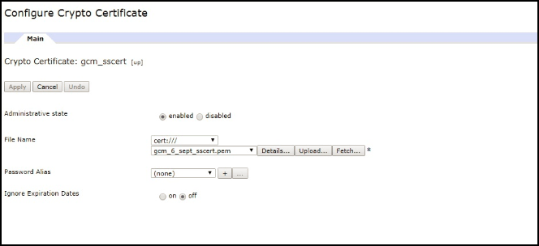

<!-- NLS_CHARSET=UTF-8 -->
## Übersicht
{: #overview }
Benachrichtigungen ermöglichen einem mobilen Gerät, Nachrichten zu empfangen, die ein Server mit einer Push-Operation gesendet hat.   
Benachrichtigungen werden unabhängig davon empfangen, ob die Anwendung im Vordergrund oder im Hintergrund ausgeführt wird.   

Die {{ site.data.keys.product_full }} stellt einheitliche API-Methoden zum Senden von Push- oder
SMS-Benachrichtigungen an iOS-, Android-, universelle Windows-8.1-, Windows-10-UWP- und Cordova-Anwendungen (iOS, Android) bereit. Die Benachrichtigungen
werden von {{ site.data.keys.mf_server }} an die Anbieterinfrastruktur (Apple, Google, Microsoft, SMS-Gateways)
gesendet und von dort an die betreffenden Geräte. Der einheitliche Benachrichtigungsmechanismus
macht den gesamten Prozess der Kommunikation
mit Benutzern und Geräten für den Entwickler vollkommen transparent. 

#### Geräteunterstützung
{: #device-support }
Push- und SMS-Benachrichtigungen in der {{ site.data.keys.product }} werden für die folgenden Plattformen unterstützt:

* iOS ab Version 8.x
* Android ab Version 4.x
* Windows 8.1, Windows 10

#### Fahren Sie mit folgenden Abschnitten fort: 
{: #jump-to }
* [Push-Benachrichtigungen](#push-notifications)
* [SMS-Benachrichtigungen](#sms-notifications)
* [Proxy-Einstellungen](#proxy-settings)
* [Nächste Lernprogramme](#tutorials-to-follow-next)

## Push-Benachrichtigungen
{: #push-notifications }
Es gibt verschiedene Arten von Benachrichtigungen: 

* **Alert (iOS, Android, Windows)** -  Popup-Textnachricht
* **Sound (iOS, Android, Windows)** - Audiodatei, die beim Empfang einer Benachrichtigung abgespielt wird
* **Badge (iOS), Tile (Windows)** - grafische Darstellung für einen kurzen Text oder ein Bild 
* **Banner (iOS), Toast (Windows)** - Popup-Textnachricht oben in der Geräteanzeige, die wieder ausgeblendet wird
* **Interactive (iOS ab Version 8)** - Aktionsschaltflächen im Banner einer empfangenen Benachrichtigung
* **Silent (iOS ab Version 8)** - Senden von Benachrichtigungen, ohne den Benutzer zu stören

### Arten von Push-Benachrichtigungen
{: #push-notification-types }
#### Tagbasierte Benachrichtigungen
{: #tag-notifications }
Tagbasierte Benachrichtigungen sind Hinweisnachrichten, die an alle Geräte gesendet werden, die einen bestimmten Tag abonniert haben.   

Bei tagbasierten Benachrichtigungen ist es möglich, die Benachrichtigungen ausgehend von Themenbereichen oder Topics bestimmten Segmenten zuzuordnen. Empfänger der Benachrichtigungen
können angeben, dass sie nur Benachrichtigungen zu einem bestimmten Thema oder einem sie interessierenden Topic empfangen möchten. Bei tagbasierten Benachrichtigungen gibt es zu diesem Zweck
eine Möglichkeit, Empfänger Segmenten zuzuordnen. Mit diesem Feature können Tags definiert werden, um
dann Nachrichten auf der Basis von Tags zu senden und zu empfangen. Eine Nachricht wird nur an die Geräte gesendet, die einen Tag abonniert haben. 

#### Broadcastbenachrichtigungen
{: #broadcast-notifications }
Broadcastbenachrichtigungen sind eine Form der tagbasierten Push-Benachrichtigungen, die an alle eingeschriebenen Geräte gesendet werden und standardmäßig
für alle Push-fähigen {{ site.data.keys.product_adj }}-Anwendungen
durch das Abonnement eines reservierten Tags `Push.all` aktiviert werden. (Der Tag wird automatisch für jedes Gerät erstellt.) Broadcastbenachrichtigungen können inaktiviert werden, indem
das Abonnement des reservierten Tags `Push.all` beendet wird. 

#### Unicastbenachrichtigungen
{:# unicast-notifications }
Unicastbenachrichtigungen oder mit OAuth geschützte authentifizierte Benachrichtigungen sind Benachrichtigungen, die an ein bestimmtes Gerät oder an bestimmte Benutzer-IDs gesendet werden. Die Benutzer-ID (userID) im Benutzerabonnement kann aus dem
zugrunde liegenden Sicherheitskontext stammen. 

#### Interaktive Benachrichtigungen
{: #interactive-notifications }
Wenn eine interaktive Benachrichtigung eingeht, können Benutzer Aktionen ausführen, ohne die Anwendung zu öffnen. Beim Eintreffen einer interaktiven Benachrichtigung zeigt das Gerät die Nachricht und Aktionsschaltflächen an. Interaktive Benachrichtigungen werden zurzeit auf Geräten mit iOS ab Version 8 unterstützt. Wenn eine interaktive Benachrichtigung an ein iOS-Gerät mit einer älteren Version als Version 8 gesendet wird, werden die Benachrichtigungsaktionen nicht angezeigt. 

> Informieren Sie sich über die Handhabung [interaktiver Benachrichtigungen](handling-push-notifications/interactive).

#### Benachrichtigungen im Hintergrund
{: #silent-notifications }
Die Benachrichtigung im Hintergrund erfolgt ohne Anzeige von Alerts oder andere Störungen des Benutzers. Wenn eine Benachrichtigung im Hintergrund eingeht,
wird der Handling-Code der Anwendung im Hintergrund ausgeführt, ohne die Anwendung in den Vordergrund zu bringen. Zurzeit werden Benachrichtigungen im Hintergrund auf
iOS-Geräten der Version 7 oder einer aktuelleren Version unterstützt. Wenn die Benachrichtigung im Hintergrund an iOS-Geräte mit einer älteren Version als Version 7
gesendet wird und die Anwendung im Hintergrund ausgeführt wird, wird die Benachrichtigung ignoriert. Falls
die Anwendung im Vordergrund ausgeführt wird, wird die Callback-Methode für Benachrichtigungen aufgerufen.

> Informieren Sie sich über die Handhabung von [Benachrichtigungen im Hintergrund](handling-push-notifications/silent).

**Hinweis:** Unicastbenachrichtigungen enthalten keinen Tag in den Nutzdaten. Die Benachrichtigung kann an mehrere Geräte oder Benutzer
gesendet werden, wenn im Zielblock der API "Message (POST)"
mehrere deviceIDs bzw. userIDs angegeben werden.

## SMS-Benachrichtigungen
{: #sms-notifications }
Für eine Anwendung muss zunächst das Abonnement von SMS-Benachrichtigungen registriert sein, damit sie SMS-Benachrichtigungen empfangen kann. Für das Abonnement von SMS-Benachrichtigungen gibt der Benutzer eine
Handynummer an und bestätigt das Abonnement von Benachrichtigungen. Bei Empfang der Benutzerbestätigung wird eine Abonnementanforderung an
{{ site.data.keys.mf_server }} gesendet. Wenn eine Benachrichtigung von der
{{ site.data.keys.mf_console }} empfangen wird, wird sie verarbeitet und über ein vorkonfiguriertes SMS-Gateway gesendet. 

Informationen zum Konfigurieren eines Gateways enthält das Lernprogramm [Benachrichtigungen senden](sending-notifications). 

## Proxy-Einstellungen
{: #proxy-settings }
In den Proxy-Einstellungen können Sie den optionalen Proxy festlegen, über den Benachrichtigungen an APNS und FCM gesendet werden. Verwenden Sie die Konfigurationseigenschaften **push.apns.proxy.*** und **push.gcm.proxy.***, um den Proxy festzulegen. Weitere Informationen
finden Sie in der [Liste der
JNDI-Eigenschaften für den MobileFirst-Server-Push-Service](../installation-configuration/production/server-configuration/#list-of-jndi-properties-for-mobilefirst-server-push-service).

> **Hinweis:** WNS bietet keine Proxyunterstützung. 

### WebSphere DataPower als Endpunkt für Push-Benachrichtigungen verwenden
{: #proxy-settings-datapower }

Sie können DataPower so einrichten, dass Anforderungen von MobileFirst Server akzeptiert und dann an FCM, SMS und WNS weitergeleitet werden.

Beachten Sie, dass APNS nicht unterstützt wird. 

#### MobileFirst Server konfigurieren
{: #proxy-settings-datapower-1 }

Konfigurieren Sie in der Datei `server.xml` die folgende JNDI-Eigenschaft:
```
<jndiEntry jndiName="imfpush/mfp.push.dp.endpoint" value = '"https://Host"' />
<jndiEntry jndiName="imfpush/mfp.push.dp.gcm.port" value = '"Port"' />
<jndiEntry jndiName="imfpush/mfp.push.dp.wns.port" value = '"Port"' />
```

Hier steht `Host` für den DataPower-Hostnamen und `Port` für die Portnummer, die für den HTTPS-Front-Side-Handler für FCM und WNS konfiguriert ist. 

Konfigurationseinstellungen für SMS werden im Rahmen eines REST-API-Aufrufs bereitgestellt. Es müssen keine JNDI-Eigenschaften angegeben werden. 

#### DataPower konfigurieren
{: #proxy-settings-datapower-2 }

1. Melden Sie sich beim DataPower-Gerät an.
2. Navigieren Sie zu **Services** > **Multi-Protocol Gateway** > **New Multi-Protocol Gateway**.
3. Geben Sie einen Namen für die Identifikation der Konfiguration an. 
4. Wählen Sie den XML-Manager aus, geben Sie "Multi-Protocol Gateway Policy" als Standard an und setzen Sie "URL Rewrite Policy" auf "none". 
5. Wählen Sie das Optionsfeld **static-backend** aus. Wählen Sie für **set Default Backend URL** die folgenden Optionen aus:
	- FCM:	`https://gcm-http.googleapis.com`
	- SMS:	`http://<Beispiel-Gateway>/gateway`
	- WNS:	`https://hk2.notify.windows.com`
6. Wählen Sie für "Response Type" und "Request Type" die Option "pass through" aus.

#### Zertifikat generieren
{: #proxy-settings-datapower-3 }

Wählen Sie aus folgenden Optionen, um das Zertifikat zu generieren: 

- FCM:
	1. Setzen Sie in der Befehlszeile `Openssl` ab, um die FCM-Zertifikate zu erhalten. 
	2. Führen Sie den folgenden Befehl aus:
		```
		openssl s_client -connect gcm-http.googleapis.com:443
		```
	3. Kopieren Sie den Inhalt von -----BEGIN CERTIFICATE-----  bis -----END CERTIFICATE----- und speichern Sie ihn in einer Datei mit der Erweiterung `.pem`. 

- Für SMS sind keine Zertifikate erforderlich.
- WNS:
	1. Verwenden Sie in der Befehlszeile den Befehl `Openssl`, um die WNS-Zertifikate zu erhalten. 
	2. Führen Sie den folgenden Befehl aus:
		```
		openssl s_client -connect https://hk2.notify.windows.com:443
		```
	3. Kopieren Sie den Inhalt von -----BEGIN CERTIFICATE-----  bis -----END CERTIFICATE----- und speichern Sie ihn in einer Datei mit der Erweiterung `.pem`. 

#### Backside-Einstellungen
{: #proxy-settings-datapower-4 }


- FCM und WNS:

	1. Erstellen Sie ein Crypto-Zertifikat: 

		a. Navigieren Sie zu **Objects** > **Crypto Configuration** und klicken Sie auf **Crypto certificate**.

		b. Geben Sie einen Namen für die Identifikation des Crypto-Zertifikats an. 

		c. Klicken Sie auf **Upload**, um das generierte FCM-Zertifikat hochzuladen. 

		d. Geben Sie für **Password Alias** "none" an. 

		e. Klicken Sie auf **Generate key**.
		

	2. Erstellen Sie einen Berechtigungsnachweis für die Crypto-Validierung:

		a. Navigieren Sie zu **Objects** > **Crypto Configuration** und klicken Sie auf **Crypto Validation Credential**.

		b. Geben Sie einen eindeutigen Namen an.

		c. Wählen Sie für "Certificates" das im vorherigen Schritt (Schritt 1) erstellte Crypto-Zertifikat aus. 

		d. Wälen Sie für **Certificate Validation Mode** die Option "Match exact certificate" oder "Immediate issuer" aus.

		e. Klicken Sie auf **Apply**.
		

	3. Erstellen Sie ein Crypto-Profil: 

		a. Navigieren Sie zu **Objects** > **Crypto Configuration** und klicken Sie auf **Crypto Profile**.

		b. Klicken Sie auf **Add**.

		c. Geben Sie einen eindeutigen Namen an.

		d. Wählen Sie für **Validation Credentials** im Dropdown-Menü den im vorherigen Schritt (Schritt 2) erstellten Berechtigungsnachweis für die Validierung aus und setzen Sie "Identification Credentials" auf **None**.

		e. Klicken Sie auf **Apply**.
		

	4. Erstellen Sie ein SSL-Proxy-Profil:

		a. Navigieren Sie zu **Objects** > **Crypto Configuration** > **SSL Proxy Profile**.

		b. Wählen Sie eine der folgenden Optionen aus:

		- SMS: Wählen Sie für **SSL Proxy Profile** "None" aus. 
		- Führen Sie für FCM und WNS mit geschützter Back-End-URL (HTTPS) die folgenden Schritte aus: 
			1.	Klicken Sie auf **Add**.

			2.	Geben Sie einen Namen für die spätere Identifizierung des SSL-Proxy-Profils an. 

			3.	Wählen Sie für **SSL Direction** im Dropdown-Menü **Forward** aus. 

			4.	Wählen Sie für "Forward (Client) Crypto Profile" das in Schritt 3 erstellte Crypto-Profil aus. 

			5.	Klicken Sie auf **Apply**.
			

	5. Wählen Sie im Fenster "Multi-Protocol Gateway" unter **Back side settings** für **SSL client type** die Option **Proxy Profile** aus. Wählen Sie dann das in Schritt 4 erstellte SSL-Proxy-Profil aus.
	 

- Für SMS sind keine Back-Side-Einstellungen erforderlich. 

#### Front-Side-Einstellungen
{: #proxy-settings-datapower-5 }

- FCM, WNS und SMS:


	1. Erstellen Sie ein Schlüssel-Zertifikat-Paar und geben Sie als allgemeinen Namen (CN, Common Name) den DataPower-Hostnamen an:

		a. Navigieren Sie zu **Administration** > **Miscellaneous** und klicken Sie auf **Crypto Tools**.

		b. Geben Sie den DataPower-Hostnamen als Wert für den allgemeinen Namen (CN) an.

		c. Wählen Sie **Export private key** aus, wenn Sie den privaten Schlüssel später exportieren möchten, und klicken Sie auf **Generate Key**.
		

	2. Erstellen Sie einen Berechtigungsnachweis für die Crypto-Identifikation:

		a. Navigieren Sie zu **Objects** > **Crypto Configuration** und klicken Sie auf **Crypto Identification Credentials**.

		b. Klicken Sie auf **Add**.

		c. Geben Sie einen eindeutigen Namen an.

		d. Wählen Sie für "Crypto Key" und "Certificate" im Listenfeld den im vorherigen Schritt (d. h. Schritt 1) generierten Schlüssel sowie das generierte Zertifikat aus. 

		e. Klicken Sie auf **Apply**.
		

	3. Erstellen Sie ein Crypto-Profil:

		a. Navigieren Sie zu **Objects** > **Crypto Configuration** und klicken Sie auf **Crypto Profile**.

		b. Klicken Sie auf **Add**.

		c. Geben Sie einen eindeutigen Namen an.

		d. Wählen Sie für "Identification Credentials" im Listenfeld den im vorherigen Schritt (Schritt 2) erstellten Berechtigungsnachweis für die Identifikation aus. Setzen Sie "Validation credentials" auf "none".

		e. Klicken Sie auf **Apply**.
		

	4. Erstellen Sie ein SSL-Proxy-Profil:

		a. Navigieren Sie zu **Objects** > **Crypto Configuration** > **SSL Proxy Profile**.

		b. Klicken Sie auf **Add**.

		c. Geben Sie einen eindeutigen Namen an.

		d. Wählen Sie für "SSL Direction" im Listenfeld **Reverse** aus.

		e. Wählen Sie für "Reverse (Server) Crypto Profile" das im vorherigen Schritt (Schritt 3) erstellte Crypto-Profil aus.  

		f. Klicken Sie auf **Apply**.
		

	5. Erstellen Sie einen HTTPS-Front-Side-Handler:

		a. Navigieren Sie zu **Objects** > **Protocol Handlers** > **HTTPS Front Side Handler**.

		b. Klicken Sie auf **Add**.

		c. Geben Sie einen eindeutigen Namen an.

		d. Wählen Sie für **Local IP address** den korrekten Alias aus oder übernehmen Sie den Standardwert (0.0.0.0).

		e. Geben Sie einen verfügbaren Port an.

		f. Wählen Sie für **Allowed methods and versions** "HTTP 1.0", "HTTP 1.1", "POST method", "GET method", "URL with ?", "URL with #", "URL with ." aus.

		g. Wählen Sie **Proxy Profile** als SSL-Servertyp aus.

		h. Wählen Sie für "SSL proxy profile (deprecated)" das im vorherigen Schritt (Schritt 4) erstellte SSL-Proxy-Profil aus.

		i. Klicken Sie auf **Apply**.
		

	6. Wählen Sie auf der Seite "Configure Multi-Protocol Gateway" unter **Front side settings** den in Schritt 5 erstellten HTTPS-Front-Side-Handler als **Front Side Protocol** aus und klicken Sie auf **Apply**.

	

	Das von DataPower in den Front-Side-Einstellungen verwendete Zertifikat ist selbst signiert. Verbindungen zu DataPower können erst hergestellt werden, wenn dieses Zertifikat zu dem von MobileFirst verwendeten JRE-Keystore hinzugefügt wurde. 

	Gehen Sie zum Hinzufügen des selbst signierten Zertifikats zum JRE-Keystore gemäß den Anweisungen im folgenden Dokument vor: [IBM Worklight Server and self-signed certificates](https://www.ibm.com/support/knowledgecenter/SSZH4A_5.0.5/com.ibm.worklight.help.doc/admin/t_ibm_worklight_server_and_self-signed_certificates.html).


## Nächste Lernprogramme
{: #tutorials-to-follow-next }
Führen Sie die folgenden Schritte für das erforderliche server- und clientseitige Setup aus, damit Sie Push-Benachrichtigungen senden und empfangen können. 
