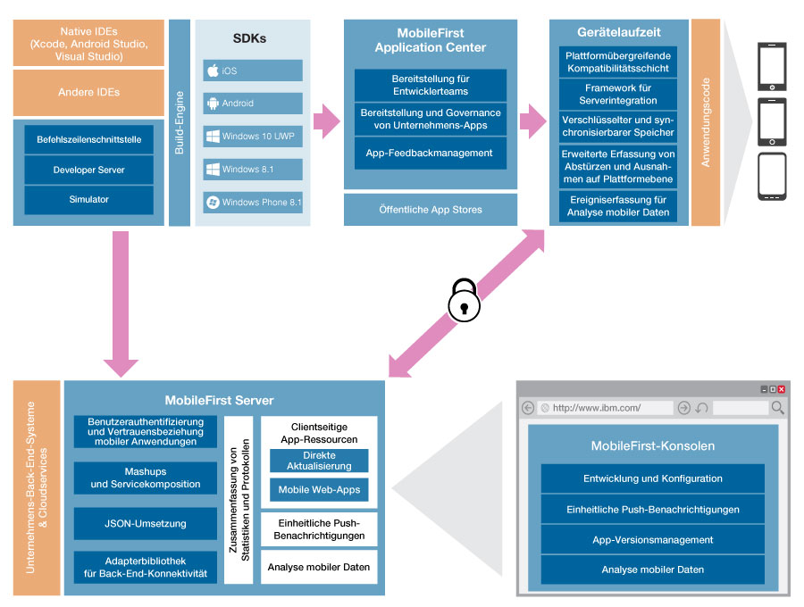

<!-- NLS_CHARSET=UTF-8 -->
## Übersicht
{: #overview }
Zur {{ site.data.keys.product_full }} gehören die folgenden Komponenten:
{{ site.data.keys.mf_cli }}, {{ site.data.keys.mf_server }}, clientseitige Laufzeitkomponenten,
{{ site.data.keys.mf_console }}, {{ site.data.keys.mf_app_center }} und {{ site.data.keys.mf_system_pattern }}.

Die folgende Abbildung zeigt die Komponenten
der {{ site.data.keys.product }}:

### {{ site.data.keys.mf_cli }}
{: #mobilefirst-cli }
Sie können die
{{ site.data.keys.mf_cli_full }} zusätzlich zur
IBM {{ site.data.keys.mf_console }} nutzen, um Anwendungen zu entwickeln und zu verwalten.
Für einige Aspekte des {{ site.data.keys.product_adj }}-Entwicklungsprozesses ist die
CLI erforderlich. 

Die Befehle, die alle mit **mfpdev** beginnen, unterstützen folgende Arten von Aufgaben: 

* Apps bei {{ site.data.keys.mf_server }} registrieren
* Apps konfigurieren
* Adapter erstellen und implementieren
* Cordova-Apps voranzeigen und aktualisieren
* Weitere Informationen enthält das Lernprogramm [{{ site.data.keys.product_adj }}-Artefakte über die CLI verwalten](../../application-development/using-mobilefirst-cli-to-manage-mobilefirst-artifacts/). 

### {{ site.data.keys.mf_server }}
{: #mobilefirst-server }
{{ site.data.keys.mf_server }}
ermöglicht eine geschützte Back-End-Anbindung, die Verwaltung von Anwendungen, die Unterstützung von Push-Benachrichtigungen sowie Analyse- und Überwachungsfunktionen für
{{ site.data.keys.product_adj }}-Anwendungen. Es handelt sich nicht um einen Anwendungsserver im Sinne der Java-EE-Definition
(Java Platform,
Enterprise Edition). Der als ein Container für
Anwendungspakete der
{{ site.data.keys.product }} verwendete Server
ist eigentlich eine Sammlung von Webanwendungen, die auch als EAR-Datei (Unternehmensarchiv) gepackt sein können, die
aufgesetzt auf traditionellen Anwendungsservern ausgeführt werden.

{{ site.data.keys.mf_server }} kann in Ihre Unternehmensumgebung
integriert werden und vorhandene Ressourcen sowie die vorhandene Infrastruktur nutzen. Die Integration erfolgt über Adapter, die
serverseitige Softwarekomponenten für die Datenübermittlung von
Back-End-Unternehmenssystemen und cloudbasierten Services zum Benutzergerät sind. Mithilfe von Adaptern können Sie Daten aus Informationsquellen abrufen und Daten in Informationsquellen aktualisieren, sodass
Benutzer Transaktionen ausführen und andere Services und Anwendungen starten können.

[Informieren Sie sich über {{ site.data.keys.mf_server }}](server).

### Clientseitige Laufzeitkomponenten
{: #client-side-runtime-components }
Die {{ site.data.keys.product }}
stellt
clientseitigen Laufzeitcode bereit, der Serverfunktionen in die Zielumgebung implementierter Apps einbettet. Diese Laufzeitclient-APIs sind Bibliotheken, die in den
lokal gespeicherten App-Code integriert werden. Mit Ihnen können Sie
{{ site.data.keys.product_adj }}-Features zu Ihren Client-Apps hinzufügen. Die APIs und
Bibliotheken können mit dem {{ site.data.keys.mf_dev_kit_full }} installiert werden. Sie können sie aber auch aus Repositorys für Ihre
Entwicklungsplattform herunterladen. 

### {{ site.data.keys.mf_console }}
{: #mobilefirst-operations-console }
Mit der
{{ site.data.keys.mf_console }} werden mobile Anwendungen gesteuert und verwaltet. Die {{ site.data.keys.mf_console }} ist
gleichzeitig ein Einstiegspunkt, um sich über die Entwicklung mit der
{{ site.data.keys.product }} zu informieren.
In der Konsole können Sie Codebeispiele, Tools und SDKs herunterladen. 

Sie können
die {{ site.data.keys.mf_console }} für die folgenden Aufgaben verwenden:

* Überwachen und Konfigurieren aller implementierten Anwendungen, Adapter und Regeln für Push-Benachrichtigungen in einer zentralen webbasierten Konsole
* Fernes Inaktivieren der Konnektivität zum {{ site.data.keys.mf_server }} mit vorkonfigurierten Regeln für App-Version und Gerätetyp
* Anpassung von Nachrichten, die beim Anwendungsstart an Benutzer gesendet werden
* Erfassung von Benutzerstatistiken für alle aktiven Anwendungen
* Generierung integrierter und vorkonfigurierter Akzeptanz- und Nutzungsberichte (Anzahl der Benutzer, die über Anwendungen auf den Server zugreifen, und Häufigkeit der
Zugriffe)
* Konfigurieren von Datenerfassungsregeln für anwendungsspezifische Ereignisse
* [Informieren Sie sich über {{ site.data.keys.mf_console }}](console).

### {{ site.data.keys.mf_analytics }}
{: #mobilefirst-analytics }
In der {{ site.data.keys.product }} gibt es
ein skalierbares Feature für Betriebsanalysen, auf das Sie
über die {{ site.data.keys.mf_console }} zugreifen können.
Mit dem {{ site.data.keys.mf_analytics_short }}-Feature können Unternehmen
von Geräten, Apps und Servern erfasste Protokolle und Ereignisse durchsuchen, um Muster und Probleme zu finden und Statistiken zur Plattformnutzung
zu erstellen. 

Daten für {{ site.data.keys.mf_analytics }} werden aus folgenden Quellen bezogen: 

* Absturzereignisse einer Anwendung auf iOS- und Android-Geräten (Absturzereignisse für nativen Code und JavaScript-Fehler)
* Interaktionen zwischen Anwendung und Server (soweit vom Client-Server-Protokoll der
{{ site.data.keys.mf_cli }} unterstützt, einschließlich
Push-Benachrichtigungen)
* Serverseitige Protokolle, die in konventionellen {{ site.data.keys.product_adj }}-Protokolldateien
erfasst werden 

[Informieren Sie sich über {{ site.data.keys.mf_analytics }}](../../analytics).

### Application Center
{: #application-center }
Das Application
Center ist ein Repository mit mobilen Anwendungen, über das Sie mobile Anwendungen, die gerade entwickelt werden, gemeinsam
nutzen können.
Mitglieder von Entwicklerteams können das Application Center verwenden, um Anwendungen für andere Teammitglieder
freizugeben. Dadurch wird die Zusammenarbeit aller an der Entwicklung einer Anwendung beteiligten Personen erleichtert.

Eine typische Verwendung
des Application Center in Ihrem Unternehmen
könnte wie folgt aussehen:

1. Das Entwicklerteam erstellt eine Version einer Anwendung.
2. Das Entwicklerteam lädt die Anwendung in das Application
Center hoch, gibt eine Beschreibung ein und bittet das Team, die Anwendung zu überprüfen und zu testen.
3. Wenn die neue Version der Anwendung verfügbar ist, führt ein Tester das
Application-Center-Installationsprogramm (d. h. den mobilen Client) aus. Der Tester sucht dann diese neue Anwendungsversion, installiert sie auf seinem
mobilen Gerät und testet sie.
4. Nach den Tests bewertet der Tester die Anwendung und gibt Feedback, das die Entwickler in der
Application-Center-Konsole sehen können.

Das Application Center ist für die private Nutzung innerhalb eines Unternehmens
bestimmt. Sie können einige mobile Anwendungen für bestimmte Benutzergruppen vorsehen. Sie haben die Möglichkeit, das Application Center als Speicher
für Unternehmensanwendungen zu nutzen.

### {{ site.data.keys.mf_system_pattern }}
{: #mobilefirst-system-pattern }
Mit {{ site.data.keys.mf_system_pattern_full }} können Sie
{{ site.data.keys.mf_server }} in IBM
PureApplication System oder IBM PureApplication Service on SoftLayer implementieren. Diese Muster (Patterns) ermöglichen
Administratoren und Unternehmen, von lokalen Cloudtechnologien zu profitieren und so
schnell auf Änderungen des Geschäftsumfeldes zu reagieren. Bei Anwendung dieser Strategie wird der Implementierungsprozess vereinfacht und
die betriebliche Effizienz gesteigert, sodass Sie mit der gestiegenen Nachfrage nach mobilen Anwendungen
Schritt halten können. Der steigende Bedarf beschleunigt die Iteration von Lösungen, die über herkömmliche
Nachfragezyklen hinausreichen. Wenn Sie {{ site.data.keys.mf_server }} Pattern verwenden,
haben Sie auch Zugriff auf bewährte Verfahren und integriertes Fachwissen, z. B. auf integrierte
Skalierungsrichtlinien. 

#### PureApplication System
{: #pureapplication-system }
IBM
PureApplication System
ist ein integriertes und höchst skalierbares System, das auf
IBM X-Architecture basiert und ein anwendungszentriertes
Datenverarbeitungsmodell in einer Cloudumgebung bereitstellt. 

Ein anwendungszentriertes
System ist effektiv, wenn es darum geht, komplexe Anwendungen und die von diesen aufgerufenen Tasks und Prozesse
zu verwalten. Das gesamte System implementiert eine breitgefächerte virtuelle Datenverarbeitungsumgebung, in der
verschiedene Ressourcenkonfigurationen automatisch an unterschiedliche Anwendungsprozesse
angepasst werden. Mit den Anwendungsmanagementfunktionen der Plattform
IBM PureApplication System
wird die Implementierung von Middleware und anderen Komponenten schnell, einfach und reproduzierbar. 

IBM
PureApplication System stellt virtualisierte
Arbeitslasten und eine skalierbare Infrastruktur in einem integrierten System bereit. 

#### Muster für virtuelle Systeme
{: #virtual-system-patterns }
Muster für virtuelle Systeme sind eine logische Darstellung einer wiederholt vorkommenden Topologie für eine Reihe von
Implementierungsanforderungen. 

Mit Mustern für virtuelle Systeme sind effiziente und reproduzierbare Implementierungen von
Systemen möglich, die VM-Instanzen und die darin ausgeführten Anwendungen enthalten. Sie können die Implementierung vollständig
automatisieren, sodass die manuelle Ausführung mehrerer zeitraubender Aufgaben entfallen kann. Bei einer solchen Implementierung
werden Probleme ausgeräumt, die durch fehlerträchtige manuelle Konfigurationsprozesse entstehen, insbesondere in
komplexen Produktionstopologien wie Server-Farmen. Zudem wird die Lösungsimplementierung beschleunigt. 
