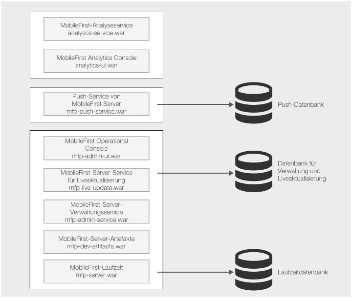

<!-- NLS_CHARSET=UTF-8 -->
## Übersicht
{: #overview }
{{ site.data.keys.mf_server }} umfasst mehrere Komponenten. Hier finden Sie eine Übersicht über die
MobileFirst-Server-Architektur, die Ihnen helfen soll, die Funktion der einzelnen Komponenten besser zu verstehen. 

Anders als bei {{ site.data.keys.mf_server }} bis Version 7.1
ist der Installationsprozess für Version 8.0.0 von den Operationen für die Entwicklung und Implementierung mobiler Apps getrennt. Wenn die Serverkomponenten und die Datenbank für Version
8.0.0 installiert und konfguriert sind, kann
{{ site.data.keys.mf_server }} für die meisten Operationen eingesetzt werden, ohne dass
auf die Anwendungsserver- oder Datenbankkonfiguration zugegriffen werden muss. 

Die Verwaltungs- und Implementierungsoperationen für
die {{ site.data.keys.product_adj }}-Artefakte werden in der
{{ site.data.keys.mf_console }} oder über die REST-API des
MobileFirst-Server-Verwaltungsservice ausgeführt. Sie können für diese Operationen auch Befehlszeilentools verwenden, in die diese REST-API eingebunden ist, z. B.
mfpdev oder mfpadm. Autorisierte Benutzer von
{{ site.data.keys.mf_server }}
können die serverseitige Konfiguration mobiler Anwendungen modifizieren, serverseitigen Code (Adapter)
hochladen oder konfigurieren, neue Webressourcen für mobile Cordova-Apps hochladen, Operationen für die Anwendungsverwaltung ausführen usw. 

{{ site.data.keys.mf_server }} stellt zusätzliche Sicherheitsschichten bereit, die
die Sicherheitsschichten der Netzinfrastruktur und des
Anwendungsservers ergänzen. Zu den Sicherheitsfeatures gehören die Kontrolle der Anwendungsauthentizität
und die Steuerung des Zugriffs auf serverseitige Ressourcen und Adapter. Die Sicherheitskonfigurationen können von den autorisierten Benutzern der
{{ site.data.keys.mf_console }} und des Verwaltungsservice erstellt werden. Sie legen die
Autorisierung der {{ site.data.keys.product_adj }}-Administratoren fest, indem Sie sie
Sicherheitsrollen zuordnen (siehe
[Benutzerauthentifizierung für die MobileFirst-Server-Verwaltung konfigurieren](../../../installation-configuration/production/server-configuration)). 

Für Entwickler gibt es eine vereinfachte Version von
{{ site.data.keys.mf_server }}, die voronfiguriert ist und für die keine Software
wie eine Datenbank oder ein Anwendungsserver
vorausgesetzt wird (siehe [{{ site.data.keys.product_adj }} Development Server einrichten](../../../installation-configuration/development)). 

## Komponenten von {{ site.data.keys.mf_server }}
{: #mobilefirst-server-components }
Die Architektur der MoibleFirst-Server-Komponenten ist in der folgenden Abbildung
dargestellt: 

### Kernkomponenten von {{ site.data.keys.mf_server }}
{: #core-components-of-mobilefirst-server }
Für eine Minimalinstallation müssen die Komponenten {{ site.data.keys.mf_console }}, MobileFirst-Server-Verwaltungsservice,
MobileFirst-Server-Liveaktualisierungsservice, MobileFirst-Server-Artefakte und
{{ site.data.keys.product_adj }}-Laufzeit installiert werden.  

* Die Laufzeit
stellt die {{ site.data.keys.product_adj }}-Services für die mobilen Apps bereit, die auf den mobilen
Geräten ausgeführt werden. 
* Der Verwaltungsservice stellt die Konfigurations- und Verwaltungsfunktionen bereit. Sie können den Verwaltungsservice über
die {{ site.data.keys.mf_console }}, die REST-API des Liveaktualisierungsservice
oder Befehlszeilentools wie mfpadm und
mfpdev nutzen.  
* Der Liveaktualisierungsservice verwaltet Konfigurationsdaten und wird vom Verwaltungsservice verwendet. 

Für diese Komponenten ist eine
Datenbank erforderlich. Bei den Datenbanktabellennamen für die einzelnen Komponenten gibt es keine Überschneidungspunkte. Sie können daher
eine Datenbank und sogar ein Schema verwenden, um alle Tabellen für diese Komponenten zu speichern. Weitere Informationen finden Sie unter
[Datenbanken einrichten](../../../installation-configuration/production/server-configuration). 

Sie haben die Möglichkeit, mehr als eine Instanz der Laufzeit
zu installieren. In dem Fall benötigen Sie für jede Instanz eine eigene Datenbank. Die Artefaktkomponente stellt Ressourcen für die
{{ site.data.keys.mf_console }} bereit. Sie erfordert keine Datenbank. 

### Optionale Komponenten von {{ site.data.keys.mf_server }}
{: #optional-components-of-mobliefirst-server }
Mit dem MobileFirst-Server-Push-Service werden Push-Benachrichtigungsfunktionen bereitgestellt. Der Service muss installiert sein, damit mobile Apps
die {{ site.data.keys.product_adj }}-Push-Funktionen nutzen können. Aus Sicht der mobilen Apps ist die URL des
Push-Service, abgesehen vom Kontextstammverzeichnis `/imfpush`), die gleiche wie die URL der Laufzeit. 

Wenn Sie den Push-Service
und die Laufzeit auf verschiedenen Servern oder in verschiedenen Clustern installieren möchten, müssen Sie die Routing-Regeln Ihres HTTP-Servers
konfigurieren. Diese Konfiguration soll sicherstellen, dass Anforderungen an den Push-Service und an die Laufzeit ordnungsgemäß weitergeleitet werden.  

Für den Push-Service ist eine
Datenbank erforderlich. Die Tabellen des Push-Service haben keinen Überschneidungspunkt mit den Tabellen der Laufzeit, des Verwaltungsservice und des
Liveaktualisierungsservice. Sie können die Tabellen daher in derselben Datenbank oder gemäß demselben Schema installieren. 

Der {{ site.data.keys.mf_analytics }}
Service und die {{ site.data.keys.mf_analytics_console }}
stellen Überwachungs- und Analysedaten zur Nutzung der mobilen Apps bereit. Mit dem
Logger-SDK können Sie weitere Einblicke in die mobilen
Apps erhalten.
Für den {{ site.data.keys.mf_analytics }}
Service ist keine Datenbank erforderlich. Der Service speichert seine Daten mit
Elasticsearch lokal auf einer Platte. Die Daten sind in Shards strukturiert, die von den Membern eines Analytics-Service-Clusters
repliziert werden können.

Weitere Informationen zu den Netzabläufen und zu den Topologiebeschränkungen für diese Komponenten finden Sie unter
[Topologien und Netzabläufe](../../../installation-configuration/production/server-configuration). 

### Installationsprozess
{: #installation-process }
Eine MobileFirst-Server-Installation vor Ort kann auf einem der folgenden Wege ausgeführt werden: 

* mit dem Server Configuration Tool (einem grafisch orientierten Assistenten)
* mit Ant-Tasks über die Befehlszeilentools
* manuelle Installation

Weitere Informationen zu einer lokalen Installation von {{ site.data.keys.mf_server }} enthalten die folgenden Quellen: 

* Der [Leitfaden für eine vollständige Installation](../../../installation-configuration/production/) einer
MobileFirst-Server-Farm in WebSphere Application Server Liberty Profile. Im Leitfaden wird ein einfaches Szenario vorgestellt, anhand dessen Sie die Installation im Grafikmodus oder im Befehlszeilenmodus
ausprobieren können. 
* Der [ausführliche Abschnitt](../../../installation-configuration/production/), in dem Sie Details zu den Installationsvoraussetzungen, zum Datenbank-Setup, zu Servertopologien, zur Implementierung der Komponenten im Anwendungsserver
und zur Serverkonfiguration finden. 

