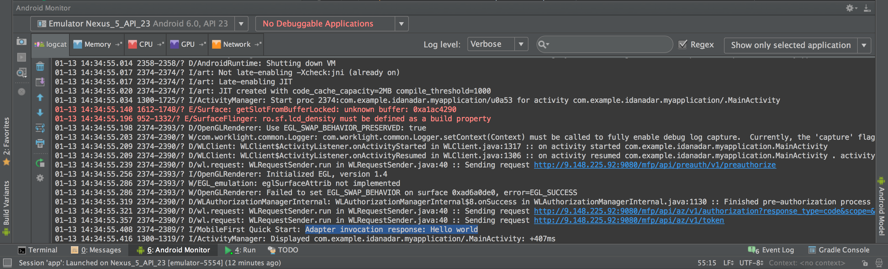

<!-- NLS_CHARSET=UTF-8 -->
## Übersicht
{: #overview }
Bei der folgende Demonstration geht es darum, einen End-to-End-Ablauf zu veranschaulichen:

1. Eine im Lieferumfang des {{ site.data.keys.product_adj }}-Client-SDK enthaltene Beispielanwendung wird in der {{ site.data.keys.mf_console }} registriert und heruntergeladen.
2. Ein neuer oder bereitgestellter Adapter wird über die {{ site.data.keys.mf_console }} implementiert.  
3. Die Anwendungslogik wird geändert, um eine Ressourcenanforderung zu ermöglichen.

**Endergebnis**:

* Erfolgreiches Absetzen eines Pingsignals an {{ site.data.keys.mf_server }}
* Erfolgreiches Abrufen von Daten mit einem Adapter

#### Voraussetzungen:
{: #prerequisites }
* Android Studio
* *Optional*: {{ site.data.keys.mf_cli }} ([Download]({{site.baseurl}}/downloads))
* *Optional*: Eigenständiger {{ site.data.keys.mf_server }} ([Download]({{site.baseurl}}/downloads))

### 1. {{ site.data.keys.mf_server }} starten
{: #1-starting-the-mobilefirst-server }
Stellen Sie sicher, dass eine [Mobile-Foundation-Instanz erstellt](../../bluemix/using-mobile-foundation) wurde oder,  
falls Sie das [{{ site.data.keys.mf_dev_kit }}](../../installation-configuration/development/mobilefirst) verwenden, navigieren Sie zum Ordner des Servers und führen Sie unter Mac und Linux den Befehl `./run.sh` oder unter Windows den Befehl `run.cmd` aus.

### 2. Anwendung erstellen
{: #2-creating-an-application }
Öffnen Sie in einem Browser die {{ site.data.keys.mf_console }}. Laden Sie dazu die URL `http://your-server-host:server-port/mfpconsole`. Wenn Sie die Konsole lokal ausführen, verwenden Sie [http://localhost:9080/mfpconsole](http://localhost:9080/mfpconsole). Geben Sie für Benutzername/Kennwort die Werte *admin/admin* an.
 
1. Klicken Sie neben **Anwendungen** auf die Schaltfläche **Neu**.
    * Wählen Sie die **Android**-Plattform aus.
    * Geben Sie als **Anwendungs-ID** den Wert **com.ibm.mfpstarterandroid** ein.
    * Geben Sie für die **Version** den Wert **1.0** ein.
    * Klicken Sie auf **Anwendung registrieren**.

    
 
2. Klicken Sie auf die Kachel **Startercode abrufen** und wählen Sie die Beispielanwendung für Android zum Download aus.

    

### 3. Anwendungslogik bearbeiten
{: #3-editing-application-logic }
1. Öffnen Sie Android Studio und importieren Sie das Projekt.

2. Wählen Sie im Seitenleistenmenü **Project** die Datei **app → java → com.ibm.mfpstarterandroid → ServerConnectActivity.java** aus. Gehen Sie dann wie folgt vor:

* Fügen Sie die folgenden Importe hinzu:

  ```java
  import java.net.URI;
  import java.net.URISyntaxException;
  import android.util.Log;
  ```
    
* Fügen Sie das folgende Code-Snippet als Ersatz für den Aufruf von `WLAuthorizationManager.getInstance().obtainAccessToken` ein:

  ```java
  WLAuthorizationManager.getInstance().obtainAccessToken("", new WLAccessTokenListener() {
                @Override
                public void onSuccess(AccessToken token) {
                    System.out.println("Received the following access token value: " + token);
                    runOnUiThread(new Runnable() {
                        @Override
                        public void run() {
                            titleLabel.setText("Yay!");
                            connectionStatusLabel.setText("Connected to {{ site.data.keys.mf_server }}");
                        }
                    });

                    URI adapterPath = null;
                    try {
                        adapterPath = new URI("/adapters/javaAdapter/resource/greet");
                    } catch (URISyntaxException e) {
                        e.printStackTrace();
                    }

                    WLResourceRequest request = new WLResourceRequest(adapterPath, WLResourceRequest.GET);
                    
                    request.setQueryParameter("name","world");
                    request.send(new WLResponseListener() {
                        @Override
                        public void onSuccess(WLResponse wlResponse) {
                            // Gibt "Hello world" in LogCat aus
                            Log.i("MobileFirst Quick Start", "Success: " + wlResponse.getResponseText());
                        }

                        @Override
                        public void onFailure(WLFailResponse wlFailResponse) {
                            Log.i("MobileFirst Quick Start", "Failure: " + wlFailResponse.getErrorMsg());
                        }
                    });
                }

                @Override
                public void onFailure(WLFailResponse wlFailResponse) {
                    System.out.println("Did not receive an access token from server: " + wlFailResponse.getErrorMsg());
                    runOnUiThread(new Runnable() {
                        @Override
                        public void run() {
                            titleLabel.setText("Bummer...");
                            connectionStatusLabel.setText("Failed to connect to {{ site.data.keys.mf_server }}");
                        }
                    });
                }
            });
  ```

### 4. Adapter implementieren
{: #4-deploy-an-adapter }
Laden Sie [dieses vorbereitete Adapterartefakt](../javaAdapter.adapter) herunter und implementieren Sie es über die {{ site.data.keys.mf_console }}, indem Sie **Aktionen → Adapter implementieren** auswählen.

Alternativ können Sie neben **Adapter** auf die Schaltfläche **Neu** klicken.  
        
1. Wählen Sie **Aktionen → Beispiel herunterladen** aus. Laden Sie das **Java**-Adapterbeispiel "Hello World" herunter.

   > Wenn Maven und die {{ site.data.keys.mf_cli }} nicht installiert sind, folgen Sie den auf dem Bildschirm angezeigten Anweisungen unter **Entwicklungsumgebung einrichten**.


2. Navigieren Sie in einem **Befehlszeilenfenster** zum Stammverzeichnis des Adapter-Maven-Projekts und führen Sie den folgenden Befehl aus:

   ```bash
   mfpdev adapter build
   ```

3. Wenn der Build fertiggestellt ist, implementieren Sie den Adapter über die {{ site.data.keys.mf_console }}, indem Sie **Aktionen → Adapter implementieren** auswählen. Sie finden den Adapter im Ordner **[adapter]/target**.
    
       


### 5. Awendung testen
{: #5-testing-the-application }

1. Wählen Sie in Android Studio im Seitenleistenmenü **Project** die Datei **app → src → main →assets → mfpclient.properties** aus und bearbeiten Sie die Eigenschaften **protocol**, **host** und **port**. Geben Sie die entsprechenden Werte für Ihren {{ site.data.keys.mf_server }} an.
    * Wenn Sie einen lokalen {{ site.data.keys.mf_server }} verwenden, lauten die Werte normalerweise **http**, **localhost** und **9080**.
    * Wenn Sie einen fernen {{ site.data.keys.mf_server }} (für Bluemix) verwenden, lauten die Werte in der Regel **https**, **your-server-address** und **443**.

    Wenn Sie die {{ site.data.keys.mf_cli }} installiert haben, können Sie alternativ zum Projektstammverzeichnis navigieren und den Befehl `mfpdev app register` ausführen. Bei Verwendung eines fernen {{ site.data.keys.mf_server }} müssen Sie den [Befehl `mfpdev server add` ausführen](../../application-development/using-mobilefirst-cli-to-manage-mobilefirst-artifacts/#add-a-new-server-instance), um den Server hinzuzufügen, gefolgt beispielsweise von `mfpdev app register myBluemixServer`.

2. Klicken Sie auf die Schaltfläche **App ausführen**.  

<br clear="all"/>
### Ergebnisse
{: #results }
* Wenn Sie auf die Schaltfläche **Ping {{ site.data.keys.mf_server }}** klicken, wird **Connected to {{ site.data.keys.mf_server }}** angezeigt.
* Wenn die Anwendung eine Verbindung zu {{ site.data.keys.mf_server }} herstellen konnte, findet ein Ressourcenanforderungsaufruf unter Verwendung des implementierten Java-Adapters statt.

Die Antwort des Adapters wird in der LogCat-Ansicht von Android Studio ausgegeben.



## Nächste Schritte
{: #next-steps }
Informieren Sie sich über die Verwendung von Adaptern in Anwendungen und über die Integration von zusätzlichen Services wie Push-Benachrichtigungen mithilfe des {{ site.data.keys.product_adj }}-Sicherheitsframeworks. Weitere Möglichkeiten sind:

- Gehen Sie die Lernprogramme zur [Anwendungsentwicklung](../../application-development/) durch.
- Gehen Sie die Lernprogramme zur [Adapterentwicklung](../../adapters/) durch.
- Gehen Sie die Lernprogramme zu [Authentifizierung und Sicherheit](../../authentication-and-security/) durch.
- Gehen Sie die Lernprogramme zu [Benachrichtigungen](../../notifications/) durch.
- Sehen Sie sich [alle Lernprogramme](../../all-tutorials) an.
