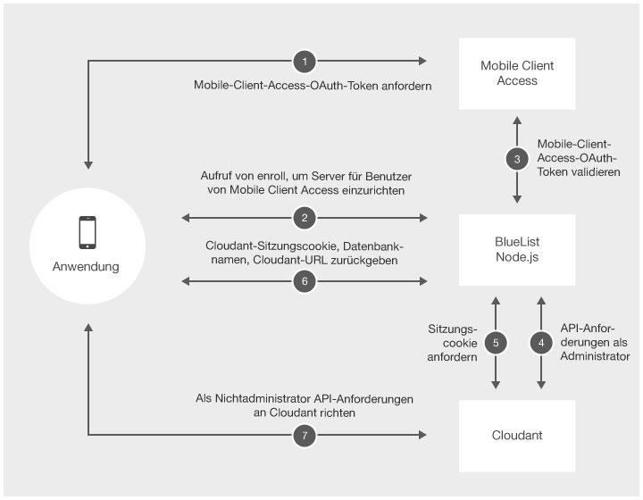

<!-- NLS_CHARSET=UTF-8 -->
## Übersicht
{: #overview }
Sie können Daten für Ihre mobile Anwendung
in einer Cloudant-Datenbank speichern. Cloudant ist eine innovative NoSQL-Datenbank, die eine Vielzahl von Datentypen handhaben kann, z. B. JSON, Volltext und Geodaten. Das
SDK ist für
Java, Objective-C und Swift verfügbar. 

> Doe Frameworks CloudantToolkit und IMFData werden in {{ site.data.keys.product_full }} Version 8.0 nicht weiter verwendet. 

* Verwenden Sie für iOS das [CDTDatastore](https://github.com/cloudant/CDTDatastore)-SDK als Ersatz für das CloudantToolkit- und IMFData-Framework.
* Verwenden Sie für Android das [Cloudant Sync Android SDK](https://github.com/cloudant/sync-android) als Ersatz für das CloudantToolkit- und IMFData-Framework. Mit Cloudant Sync können Sie alle Daten lokal persistent speichern und mit einem fernen Datastore replizieren.

Wenn Sie direkt auf ferne Stores zugreifen möchten, verwenden Sie in Ihrer Anwendung REST-Aufrufe. Lesen Sie dazu die Informationen unter [Cloudant API Reference](https://docs.cloudant.com/api.html). 

### Cloudant und JSONStore im Vergleich
{: #cloudant-versus-jsonstore }
In folgenden Szenarien könnten Sie JSONStore anstelle von
Cloudant verwenden: 

* Sie speichern auf dem mobilen Gerät Daten, die auf eine mit FIPS 140-2 konforme Weise gespeichert werden müssen. 
* Sie müssen die Daten auf dem Gerät und im Unternehmen synchronisieren.
* Sie entwickeln eine Hybridanwendung.

Weitere Informationen zu JSONStore finden Sie unter
[JSONStore](../../application-development/jsonstore).

#### Fahren Sie mit folgenden Abschnitten fort: 
{: #jump-to }
* [Kombination von {{ site.data.keys.product_adj }}-Sicherheit und Cloudant-Sicherheit](#integrating-mobilefirst-and-cloudant-security)
* [Datenbanken erstellen](#creating-databases)
* [Daten auf dem Gerät verschlüsseln](#encrypting-data-on-the-device)
* [Benutzerberechtigungen festlegen](#setting-user-permissions)
* [Daten modellieren](#modeling-data)
* [CRUD-Operationen (Create, Remove, Update, Delete) ausführen](#performing-crud-operations)
* [Indizes erstellen](#creating-indexes)
* [Daten abfragen](#querying-data)
* [Unterstützung für Offlinespeicher und Synchronisation](#supporting-offline-storage-and-synchronization)

## Kombination von {{ site.data.keys.product_adj }}-Sicherheit und Cloudant-Sicherheit
{: #integrating-mobilefirst-and-cloudant-security }
### Adapterbeispiel
{: #adapter-sample }
Von der Seite [mfp-bluelist-on-premises](https://github.com/MobileFirst-Platform-Developer-Center/BlueList-On-Premise) können Sie das Beispiel herunterladen.

Wenn Sie den -Adapter aus dem BlueList-Beispiel verstehen wollen, müssen Sie
die
[Cloudant-Sicherheit](https://cloudant.com/for-developers/faq/auth/) und das [{{ site.data.keys.product_adj }}-Sicherheitsframework](../../authentication-and-security) verstehen.

Das BlueList-Adapterbeispiel hat zwei Hauptfunktionen: 

* Austausch von {{ site.data.keys.product_adj }}-OAuth-Token
für Cloudant-Sitzungscookies
* Anforderungen mit erforderlichem admin-Zugriff für das BlueList-Beispiel an Cloudant richten

Das Beispiel demonstriert die Ausführung von API-Anforderungen, für die admin-Zugriff auf dem Server erforderlich ist. Es besteht die Möglichkeit, Ihre Administratorberechtigungsnachweise auf dem mobilen Gerät zu speichern.
Empfehlenswert ist allerdings, den Zugriff für mobile Geräte einzuschränken. 

Das BlueList-Beispiel kombiniert
die {{ site.data.keys.product_adj }}-Sicherheit und die Cloudant-Sicherheit. Das
Adapterbeispiel ordnet
einer Cloudant-Identität
eine {{ site.data.keys.product_adj }}-Identität zu. Das mobile Gerät empfängt
ein Cloudant-Sitzungscookie für die Ausführung von API-Anforderungen ohne Administratorzugriff. Das Beispiel verwendet
das Couch-Security-Modell. 

### REST-Endpunkt registrieren
{: #enroll-rest-endpoint }
Die folgende Abbildung zeigt die vom Endpunkt **/enroll** des BlueList-Adapterbeispiels durchgeführte Integration.




1. Das mobile Gerät erhält das
{{ site.data.keys.product_adj }}-OAuth-Token
vom {{ site.data.keys.mf_server }}.
2. Das mobile Gerät ruft den Endpunkt **/enroll** des Adapters auf. 
3. Das Adapterbeispiel
validiert das {{ site.data.keys.product_adj }}-OAuth-Token
in {{ site.data.keys.mf_server }}. 
4. Wenn das Token gültig ist, werden API-Anforderungen mit admin-Zugriff
an Cloudant gerichtet. Das Beispiel überprüft, ob es in der **_users**-Datenbank einen Cloudant-Benutzer gibt. 
    * Ist der Benutzer vorhanden, wird in der **_users**-Datenbank nach den Berechtigungsnachweisen für den Cloudant-Benutzer gesucht. 
    * Wenn ein neuer Benutzer übergeben wird, wird unter Verwendung der
Cloudant-Administratorberechtigungsnachweise ein neuer
Cloudant-Benutzer erstellt und in der **_users**-Datenbank gespeichert. 
    * Für den Benutzer wird ein eindeutiger Datenbankname generiert. Außerdem wird in
Cloudant eine ferne Datenbank mit diesem Namen erstellt. 
    * Der Cloudant-Benutzer erhält die Berechtigung, in der neu erstellten Datenbank zu lesen und zu schreiben. 
    * Die erforderlichen Indizes für die BlueList-Anwendung werden erstellt. 
5. Ein neues Cloudant-Sitzungscookie wird angefordert. 
6. Das -Adapterbeispiel
gibt ein Cloudant-Sitzungscookie, den Namen der fernen Datenbank
und eine Cloudant-URL an das mobile Gerät zurück. 
7. Das mobile Gerät richtet Anforderungen direkt an
Cloudant, bis das Sitzungscookie abläuft. 

### REST-Endpunkt sessioncookie
{: #sessioncookie-rest-endpoint }
Wenn ein Sitzungscookie abgelaufen ist, kann
das mobile Gerät über den Endpunkt **/sessioncookie** ein gültiges {{ site.data.keys.product_adj }}-OAuth-Token gegen
ein Cloudant-Sitzungscookie tauschen. 

## Datenbanken erstellen
{: #creating-databases }
### Zugriff auf lokale Datastores
{: #accessing-local-data-stores }
Für einen schnellen Zugriff, selbst im Offlinemodus, können Sie
Daten in einem lokalen Datastore auf dem Clientgerät ablegen.  
Wenn Sie Store-Objekte für den Zugriff auf eine lokale Datenbank erstellen möchten, geben Sie einen
Namen für den Datastore an.

> **Wichtiger Hinweis:** Der Datenbankname darf nur Kleinbuchstaben enthalten. 

#### iOS
{: #ios }
##### VORHER (mit IMFData/CloudantToolkit):
{: #before-with-imdata-cloudanttoolkit }

**Objective-C**  

```objc
// Verweis auf den Datenmanager abrufen
IMFDataManager *manager = [IMFDataManager sharedInstance];
NSString *name = @"automobiledb";
NSError *error = nil;
```
**Swift**

```swift
// Lokalen Store erstellen
CDTStore *store = [manager localStore:name error:&error];
let manager = IMFDataManager.sharedInstance()
let name = "automobiledb"

var store:CDTStore?
do {
    store = try manager.localStore(name)
} catch let error as NSError {
    // Fehler behandeln
}
```

##### NACHHER (mit Cloudant Sync):
{: #after-with-cloudant-sync }

**Objective-C**  

```objc
// Verweis auf DatastoreManager abrufen
CDTDatastoreManager *datastoreManager = existingDatastoreManager;
NSString *name = @"automobiledb";
NSError *error = nil;

// Datastore erstellen
CDTDatastore *datastore = [datastoreManager datastoreNamed:name error:&error];
```

**Swift**

```swift
// Verweis auf DatastoreManager abrufen
let datastoreManager:CDTDatastoreManager = existingDatastoreManager
let name:String  = "automobiledb"

// Lokalen Store erstellen
var datastore:CDTDatastore?
do{
    datastore = try datastoreManager.datastoreNamed(name)
}catch let error as NSError{
    // Fehler behandeln
}
```

#### Android
{: #android }
##### VORHER (mit IMFData/CloudantToolkit):
{: before-with-imfdata-cloudanttoolkit }

```java
// Verweis auf DataManager abrufen
DataManager manager = DataManager.getInstance();

// Lokalen Store erstellen
String name = "automobiledb";

Task<Store> storeTask = manager.localStore(name);
storeTask.continueWith(new Continuation<Store, Void>() {
    @Override
    public Void then(Task<Store> task) throws Exception {
        if(task.isFaulted()){
            // Fehler behandeln
        }else{
            // Aktionen für Store ausführen
            Store store = task.getResult();
        }
        return null;
    }
});
```

##### NACHHER (mit Cloudant Sync) - Android:
{: #after-with-cloudant-sync-android }
```java
// DatastoreManager erstellen
   File path = context.getDir("databasedir", Context.MODE_PRIVATE);
   DatastoreManager manager = new DatastoreManager(path.getAbsolutePath());

   // Datastore erstellen
       String name = "automobiledb";
       Datastore datastore = manager.openDatastore(name);
```

### Ferne Datastores erstellen
{: #creating-remote-data-stores }
Wenn Sie Daten im fernen Store speichern möchten, geben Sie den Namen des Datastore an. 

#### iOS
{: #for-ios }
##### VORHER (mit IMFData/CloudantToolkit) - iOS:
{: #before-with-imfdata-cloudanttoolkit-for-ios }

**Objective-c**

```objc
// Verweis auf den Datenmanager abrufen
IMFDataManager *manager = [IMFDataManager sharedInstance];
NSString *name = @"automobiledb";

// Fernen Store erstellen
[manager remoteStore:name completionHandler:^(CDTStore *createdStore, NSError *error) {
    if(error){
        // Fehler behandeln
    }else{
        CDTStore *store = createdStore;
        NSLog(@"Successfully created store: %@", store.name);
    }
}];
```

**Swift**

```swift
let manager = IMFDataManager.sharedInstance()
let name = "automobiledb"

manager.remoteStore(name, completionHandler: { (createdStore:CDTStore!, error:NSError!) -> Void in
    if nil != error {
        // Fehler behandeln
    } else {
        let store:CDTStore = createdStore
        print("Successfully created store: \(store.name)")
    }
})
```

##### NACHHER (mit Cloudant Sync) - iOS:
{: #after-with-cloudant-sync-for-ios }
**Objective-c**

```objc
```

**Swift**

```swift
```

#### Android
{: #for-android }
##### VORHER (mit IMFData/CloudantToolkit) - Android:
{: #before-with-imfdata-cloudanttoolkit-for-android }

```java
```

##### NACHHER (mit Cloudant Sync) - Android:
{: #after-with-cloudant-sync-for-android }
```java
```

## Daten auf dem Gerät verschlüsseln
{: #encrypting-data-on-the-device }
Um die Verschlüsselung lokaler Datastores auf mobilen Geräten zu ermöglichen,
müssen Sie Ihre Anwendung aktualisieren. Nehmen Sie Verschlüsselungsfunktionen auf und erstellen Sie
verschlüsselte Datastores. 

### Daten auf iOS-Geräten verschlüsseln
{: #encrypting-data-on-ios-devices }
1. Fordern Sie mit CocoaPods die Verschlüsselungsfunktionen an.
   * Öffnen Sie Ihre Podfile und fügen Sie die folgende Zeile hinzu: 

   ##### VORHER (mit IMFData/CloudantToolkit): 
   {: #before-with-imfdata-cloudanttoolkit }    
   ```xml
   pod 'IMFDataLocal/SQLCipher'
   ```

   ##### NACHHER (mit Cloudant Sync) - Daten auf iOS-Geräten verschlüsseln: 
   {: after-with-cloudant-sync-encrypt-ios-devices }
   ```xml
   pod 'CDTDatastore/SQLCipher'
   ```        

   Weitere Informationen finden Sie in der
Dokumentation unter
[CDTDatastore Encryption](https://github.com/cloudant/CDTDatastore/blob/master/doc/encryption.md).

   * Führen Sie den folgenden Befehl aus, um die Abhängigkeiten zu Ihrer Anwendung hinzuzufügen. 

     ```bash
     pod install
     ```

2. Wenn Sie die Verschlüsselungsfunktion in einer Swift-Anwendung verwenden möchten, fügen
Sie die folgenden Importe zum zugehörigen Bridging-Header für die Anwendung hinzu: 

   ##### VORHER (mit IMFData/CloudantToolkit) - Daten auf iOS-Geräten verschlüsseln: 
   {: #before-with-imfdata-cloudanttoolkit-encrypt-ios-devices}
   ```objc
   #import <CloudantSync.h>
   #import <CloudantSyncEncryption.h>
   #import <CloudantToolkit/CloudantToolkit.h>
   #import <IMFData/IMFData.h>
   ```

   ##### NACHHER (mit Cloudant Sync) - Daten auf iOS-Geräten verschlüsseln (Swift): 
   {: #after-with-cloudant-sync-encrypt-ios-swift }
   ```objc
   #import <CloudantSync.h>
   #import <CloudantSyncEncryption.h>
   ```

3. Initialisieren Sie Ihren lokalen Store für die Verschlüsselung mit einem Schlüsselprovider.

   > **Warnung:** Wenn Sie nach Erstellung der Datenbank das Kennwort ändern, tritt ein Fehler auf, weil die vorhandene Datenbank nicht verschlüsselt werden kann. Sie können Ihr Kennwort nicht ändern, nachdem die Datenbank verschlüsselt wurde. Wenn Sie Kennwörter ändern möchten, müssen Sie die Datenbank löschen.


   ##### VORHER (mit IMFData/CloudantToolkit) - Lokalen Store für Verschlüsselung initialisieren:
   {: #before-with-imfdata-cloudanttoolkit-initialize-local-store }
   **Objective-C**

   ```objc
   // Verweis auf den Datenmanager abrufen
   IMFDataManager *manager = [IMFDataManager sharedInstance];
   NSString *name = @"automobiledb";
   NSError *error = nil;

   // Schlüsselprovider initialisieren
   id<CDTEncryptionKeyProvider> keyProvider = [CDTEncryptionKeychainProvider providerWithPassword: @"passw0rd" forIdentifier: @"identifier"];

   // Lokalen Store initialisieren
   CDTStore *localStore = [manager localStore: name withEncryptionKeyProvider: keyProvider error: &error];
   ```

   **Swift**

   ```swift
   let manager = IMFDataManager.sharedInstance()
   let name = "automobiledb"

   let keyProvider = CDTEncryptionKeychainProvider(password: "passw0rd", forIdentifier: "identifier")
   var store:CDTStore?
   do {
        store = try manager.localStore(name, withEncryptionKeyProvider: keyProvider)
   } catch let error as NSError {
        // Fehler behandeln
   }
   ```

   ##### NACHHER (mit Cloudant Sync) - Lokalen Store für Verschlüsselung initialisieren:
   {: #after-with-cloudant-sync-initialize-local-store }
   **Objective-C**

   ```objc
   // Verweis auf DatastoreManager abrufen
   CDTDatastoreManager *datastoreManager = existingDatastoreManager;
   NSString *name = @"automobiledb";
   NSError *error = nil;

   // KeyProvider erstellen
   id<CDTEncryptionKeyProvider> keyProvider = [CDTEncryptionKeychainProvider providerWithPassword: @"passw0rd" forIdentifier: @"identifier"];

   // Lokalen Store erstellen
   CDTDatastore *datastore = [datastoreManager datastoreNamed:name withEncryptionKeyProvider:keyProvider error:&error];
   ```

   **Swift**

   ```swift
   // Verweis auf DatastoreManager abrufen
   let datastoreManager:CDTDatastoreManager = existingDatastoreManager
   let name:String  = "automobiledb"

   // Lokalen Store erstellen
   var datastore:CDTDatastore?
   let keyProvider = CDTEncryptionKeychainProvider(password: "passw0rd", forIdentifier: "identifier")
   do{
        datastore = try datastoreManager.datastoreNamed(name, withEncryptionKeyProvider: keyProvider)
   }catch let error as NSError{
        // Fehler behandeln
   }
   ```

4. Wenn Sie für die Datenreplikation einen verschlüsselten lokalen Store verwenden, müssen Sie die Methoden CDTPullReplication und CDTPushReplication mit einem Schlüsselprovider initialisieren.

   ##### VORHER (mit IMFData/CloudantToolkit) - Initialisierung mit dem Schlüsselprovider:    
   {: #before-with-imfdata-cloudanttoolkit-initialize-with-key-provider }
   **Objective-C**

   ```objc
   // Verweis auf den Datenmanager abrufen
   IMFDataManager *manager = [IMFDataManager sharedInstance];
   NSString *databaseName = @"automobiledb";

   // Schlüsselprovider initialisieren
   id<CDTEncryptionKeyProvider> keyProvider = [CDTEncryptionKeychainProvider providerWithPassword:@"password" forIdentifier:@"identifier"];

   // Replikation mit Pull übertragen
   CDTPullReplication *pull = [manager pullReplicationForStore: databaseName withEncryptionKeyProvider: keyProvider];

   // Replikation mit Push übertragen
   CDTPushReplication *push = [manager pushReplicationForStore: databaseName withEncryptionKeyProvider: keyProvider];
   ```

   **Swift**

   ```swift
   // Verweis auf einen Datenmanager abrufen
   let manager = IMFDataManager.sharedInstance()
   let databaseName = "automobiledb"

   // Schlüsselprovider initialisieren
   let keyProvider = CDTEncryptionKeychainProvider(password: "password", forIdentifier: "identifier")

   // Replikation mit Pull übertragen
   let pull:CDTPullReplication = manager.pullReplicationForStore(databaseName, withEncryptionKeyProvider: keyProvider)

   // Replikation mit Push übertragen
   let push:CDTPushReplication = manager.pushReplicationForStore(databaseName, withEncryptionKeyProvider: keyProvider)
   ```

   ##### NACHHER (mit Cloudant Sync) - Initialisierung mit dem Schlüsselprovider: 
   {: #after-with-cloudant-sync-initialize-with-key-provider }
   Für die Replikation mit einer verschlüsselten Datenbank sind keine Änderungen gegenüber einer Replikation mit nicht verschlüsselter Datenbank erforderlich.

### Daten auf Android-Geräten verschlüsseln
{: #encrypting-data-on-android-devices }
Wenn Sie Daten auf einem Android-Gerät verschlüsseln möchten, fordern Sie
Verschlüsselungsfunktionen an, indem Sie die richtigen Bibliotheken in Ihre Anwendung aufnehmen.
Dann können Sie Ihren lokalen Store für die Verschlüsselung initialisieren und Daten replizieren. 

1. Fügen Sie die Cloudant-Toolkit-Bibliothek als Abhängigkeit zu Ihrer Datei
build.gradle hinzu. 

   ##### VORHER (mit IMFData/CloudantToolkit) - Daten auf Android-Geräten verschlüsseln:
   {: #before-with-imfdata-cloudanttoolkit-encrypt-android-devices }
   ```xml
   repositories {
   mavenCentral()
   }

   dependencies {
       compile 'com.ibm.mobile.services:cloudant-toolkit-local:1.0.0'
   }
   ```

   ##### NACHHER (mit Cloudant Sync) - Daten auf Android-Geräten verschlüsseln:
   {: #after-with-cloudant-sync-encrypt-android-devices }
    ```xml
    repositories {
        mavenLocal()
        maven { url "http://cloudant.github.io/cloudant-sync-eap/repository/" }
        mavenCentral()
    }

    dependencies {
        compile group: 'com.cloudant', name: 'cloudant-sync-datastore-core', version:'0.13.2'
        compile group: 'com.cloudant', name: 'cloudant-sync-datastore-android', version:'0.13.2'
        compile group: 'com.cloudant', name: 'cloudant-sync-datastore-android-encryption', version:'0.13.2'
    }
    ```

2. Laden Sie die **.jar**- und
**.so**-Binärdateien
von [SQLCipher for Android v3.2](https://www.zetetic.net/sqlcipher/open-source/) herunter und nehmen Sie sie
in die entsprechenden Ordner in Ihrer App-Struktur auf. 
    * Fügen Sie Bibliotheken hinzu. Fügen Sie die gemeinsam genutzten Bibliotheksdateien und das SQLCipher-Archiv
zum Ordner **jniLibs** in Ihrem Android-App-Verzeichnis hinzu.
    * Fügen Sie die erforderliche komprimierte ICU-Datei zum Ordner assets Ihrer App
hinzu. 
    * Fügen Sie **sqlcipher.jar** als eine Dateiabhängigkeit hinzu. Wählen Sie in Android Studio im App-Ordnermenü
unter
**Open
Module Settings** das Register **Dependencies** aus.
3. Initialisieren Sie Ihren lokalen Store für die Verschlüsselung mit einem Schlüsselprovider.

   > **Warnung:** Wenn Sie nach Erstellung der Datenbank das Kennwort ändern, tritt ein Fehler auf, weil die vorhandene Datenbank nicht verschlüsselt werden kann. Sie können Ihr Kennwort nicht ändern, nachdem die Datenbank verschlüsselt wurde. Wenn Sie Kennwörter ändern möchten, müssen Sie die Datenbank löschen.


   ##### VORHER (mit IMFData/CloudantToolkit) - Lokalen Store initialisieren (Android):
   {: #before-with-imfdata-cloudanttoolkit-initialize-local-store-android }
   ```java
   // Verweis auf DataManager abrufen
   DataManager manager = DataManager.getInstance();

   // Schlüsselprovider initialisieren
   KeyProvider keyProvider = new AndroidKeyProvider(getContext(),"password","identifier");

   // Lokalen Store erstellen
   String databaseName = "automobiledb";
   Task<Store> storeTask = manager.localStore(databaseName, keyProvider);
   storeTask.continueWith(new Continuation<Store, Void >() {
        @Override
        public Void then(Task<Store> task) throws Exception {
            if (task.isFaulted()) {
                // Fehler behandeln
    } else {
        // Aktionen für Store ausführen
                Store store = task.getResult();
            }
            return null;
         }
   });
   ```

   ##### NACHHER (mit Cloudant Sync) - Lokalen Store initialisieren (Android):
   {: #after-with-cloudant-sync-initialize-local-store-android }   
   ```java
   // SQLCipher-Bibliotheken laden
   SQLiteDatabase.loadLibs(context);

   // DatastoreManager erstellen
   File path = context.getDir("databasedir", Context.MODE_PRIVATE);
   DatastoreManager manager = new DatastoreManager(path.getAbsolutePath());

   // Verschlüsselten lokalen Store erstellen
   String name = "automobiledb";

   KeyProvider keyProvider = new AndroidKeyProvider(context,"passw0rd","identifier");
   Datastore datastore = manager.openDatastore(name, keyProvider);
   ```

4. Wenn Sie für die Replikation einen verschlüsselten lokalen Store verwenden, müssen Sie ein KeyProvider-Objekt an die Methode `pullReplicationForStore()` oder `pushReplicationForStore()` übergeben.

   ##### VORHER (mit IMFData/CloudantToolkit) - Initialisierung mit dem Schlüsselprovider (Android):
   {: #before-with-imfdata-cloudanttoolkit-initialize-with-key-provider-android }
   ```java
   // Verweis auf einen Datenmanager abrufen
   DataManager manager = DataManager.getInstance();
   String databaseName = "automobiledb";

   // Schlüsselprovider initialisieren
   KeyProvider keyProvider = new AndroidKeyProvider(getContext(),"password","identifier");

   // Replikation mit Pull übertragen
   Task<PushReplication> pullTask = manager.pullReplicationForStore(databaseName, keyProvider);

   // Replikation mit Push übertragen
   Task<PushReplication> pushTask = manager.pushReplicationForStore(databaseName, keyProvider);
   ```

   ##### NACHHER (mit Cloudant Sync) - Initialisierung mit dem Schlüsselprovider (Android):
   {: #after-with-cloudant-sync-initialize-with-key-provider-android }
   Für die Replikation mit einer verschlüsselten Datenbank sind keine Änderungen gegenüber einer Replikation mit nicht verschlüsselter Datenbank erforderlich.

## Benutzerberechtigungen festlegen
{: #setting-user-permissions }
Sie können Benutzerberechtigungen für ferne Datenbanken festlegen.

##### VORHER (mit IMFData/CloudantToolkit) - Benutzerberechtigungen festlegen:
{: #before-with-imfdata-cloudanttoolkit-setting-user-permissions }
**Objective-C**

```objc
// Verweis auf einen Datenmanager abrufen
IMFDataManager *manager = [IMFDataManager sharedInstance];

// Berechtigungen für aktuellen Benutzer in einem Store definieren
[manager setCurrentUserPermissions: DB_ACCESS_GROUP_MEMBERS forStoreName: @"automobiledb" completionHander:^(BOOL success, NSError *error) {
    if(error){
        // Fehler behandeln
    }else{
        // Berechtigungen erfolgreich definiert
    }
}];
```

**Swift**

```swift
// Verweis auf einen Datenmanager abrufen
let manager = IMFDataManager.sharedInstance()

// Berechtigungen für aktuellen Benutzer in einem Store festlegen
manager.setCurrentUserPermissions(DB_ACCESS_GROUP_MEMBERS, forStoreName: "automobiledb") { (success:Bool, error:NSError!) -> Void in
    if nil != error {
        // Fehler behandeln
    } else {
        // Berechtigungen erfolgreich definiert
    }
}
```

**Java**

```java
Task<Boolean> permissionsTask = manager.setCurrentUserPermissions(DataManager.DB_ACCESS_GROUP_MEMBERS, "automobiledb");

permissionsTask.continueWith(new Continuation<Boolean, Object>() {
    @Override
    public Object then(Task<Boolean> task) throws Exception {
        if(task.isFaulted()){
            // Fehler behandeln
        }else{
           // Berechtigungen erfolgreich definiert
        }
        return null;
    }
});
```

##### NACHHER (mit Cloudant Sync) - Benutzerberechtigungen festlegen:
{: #after-with-cloudant-sync-setting-user-permissions }
 Sie können keine Benutzerberechtigungen vom mobilen Gerät aus
festlegen. Sie müssen das <tm trademark="Cloudant" tmtype="reg">Cloudant</tm>-Dashboard oder serverseitigen Code verwenden, um Berechtigungen festzulegen. Ein
Beispiel für die Integration von {{ site.data.keys.product_adj }}-OAuth-Token in die
Cloudant-Sicherheit
ist das [BlueList-Beispiel](https://github.ibm.com/MFPSamples/BlueList-On-Premise). 

## Daten modellieren
{: #modeling-data }
In Cloudant werden Daten als JSON-Dokumente gespeichert. Wenn Sie Daten als Objekte in Ihrer Anwendung speichern möchten, nutzen Sie die enthaltene Datenobjekt-Mapper-Klasse, die native Objekte
dem zugrunde liegenden JSON-Dokumentformat zuordnet. 

* iOS: In Cloudant werden Daten als JSON-Dokumente gespeichert. Das
Framework CloudantToolkit stellt einen Objektmanager bereit, der Zuordnungen zwischen nativen Objekten und
JSON-Dokumenten erstellt. Die API CDTDatastore stellt dieses Feature nicht bereit. Die Snippets in den folgenden Abschnitten veranschaulichen
die Verwendung von
CDTDatastore-Objekten für die Ausführung von Operationen. 
* Android: AndroidCloudant speichert Daten als JSON-Dokumente. Die
API CloudantToolkit stellt einen Objektmanager bereit, der Zuordnungen zwischen nativen Objekten und
JSON-Dokumenten erstellt. Cloudant Sync stellt dieses Feature nicht
bereit. Die Snippets in den folgenden Abschnitten veranschaulichen
die Verwendung von
DocumentRevision-Objekten für die Ausführung von Operationen. 

## CRUD-Operationen (Create, Remove, Update, Delete) ausführen
{: #performing-crud-operations }
Sie können den Inhalt eines Datastore modifizieren. 

* Weitere Details zu CRUD-Operationen (`create`, `retrieve`, `update`, `delete`)
finden Sie in der Dokumentation unter
[CDTDatastore CRUD](https://github.com/cloudant/CDTDatastore/blob/master/doc/crud.md). 
* Informationen zu CRUD-Operationen (`create`, `retrieve`, `update`, `delete`)
für einen fernen Store finden Sie in der Beschreibung der [Cloudant Document API](https://docs.cloudant.com/document.html). 

### Daten erstellen
{: #creating-data }

_**VORHER**_

**Objective-C**

```objc
// Vorhandenen Store verwenden
CDTStore *store = existingStore;

// Zu speicherndes Fahrzeug erstellen
Automobile *automobile = [[Automobile alloc] initWithMake:@"Toyota" model:@"Corolla" year: 2006];

[store save:automobile completionHandler:^(id savedObject, NSError *error) {
    if (error) {
        // Speichern nicht erfolgreich; Handler hat Fehler empfangen
    } else {
        // Ergebnis verwenden
        Automobile *savedAutomobile = savedObject;
        NSLog(@"saved revision: %@", savedAutomobile);
    }
}];
```

**Swift**

```swift
// Vorhandenen Store verwenden
let store:CDTStore = existingStore

// Zu speicherndes Objekt erstellen
let automobile = Automobile(make: "Toyota", model: "Corolla", year: 2006)

store.save(automobile, completionHandler: { (savedObject:AnyObject!, error:NSError!) -> Void in
   if nil != error {
       // Speichern nicht erfolgreich; Handler hat Fehler empfangen
    } else {
        // Ergebnis verwenden
       print("Saved revision: \(savedObject)")
   }
})
```

**Java**

```java
// Vorhandenen Store verwenden
Store store = existingStore;

// Zu speicherndes Objekt erstellen
Automobile automobile = new Automobile("Toyota", "Corolla", 2006);

// Fahrzeug im Store speichern
Task<Object> saveTask = store.save(automobile);
saveTask.continueWith(new Continuation<Object, Void>() {
    @Override
    public Void then(Task<Object> task) throws Exception {
        if (task.isFaulted()) {
            // Speichern nicht erfolgreich; Fehler in task.getError() enthalten
        } else {
            // Ergebnis verwenden
            Automobile savedAutomobile = (Automobile) task.getResult();
        }
        return null;
    }
});
```

_**NACHHER**_

```objc
// Vorhandenen Store verwenden
CDTDatastore *datastore = existingDatastore;

// Dokumenthauptteil erstellen
CDTMutableDocumentRevision * revision = [CDTMutableDocumentRevision revision];
revision.body = @{@"@datatype" : @"Automobile", @"make" :@"Toyota", @"model": @"Corolla", @"year" : @2006};

NSError *error = nil;
CDTDocumentRevision *createdRevision = [datastore createDocumentFromRevision:revision error:&error];

if (error) {
    // Speichern nicht erfolgreich; Handler hat Fehler empfangen
    } else {
        // Ergebnis verwenden
    NSLog(@"Revision: %@", createdRevision);
}
```

**Swift**

```swift
// Vorhandenen Store verwenden
let datastore:CDTDatastore = existingDatastore

// Dokumenthauptteil erstellen
let revision = CDTMutableDocumentRevision()
revision.setBody(["make":"Toyota","model":"Corolla","year":2006])

var createdRevision:CDTDocumentRevision?
do{
    createdRevision = try datastore.createDocumentFromRevision(revision)
    NSLog("Revision: \(createdRevision)");
}catch let error as NSError{
    // Fehler behandeln
}
```

**Java**

```java
// Vorhandenen Store verwenden
Datastore datastore = existingStore;

// Dokumenthauptteil erstellen
Map<String, Object> body = new HashMap<String, Object>();
body.put("@datatype", "Automobile");
body.put("make", "Toyota");
body.put("model", "Corolla");
body.put("year", 2006);

// Überarbeitung erstellen und Hauptteil definieren
MutableDocumentRevision revision  = new MutableDocumentRevision();
revision.body = DocumentBodyFactory.create(body);

// Überarbeitung im Store speichern
DocumentRevision savedRevision = datastore.createDocumentFromRevision(revision);
```

### Daten lesen
{: #reading-data }

_**VORHER**_

**Objective-C**

```objc
CDTStore *store = existingStore;
NSString *automobileId = existingAutomobileId;

// Fahrzeug aus Store abrufen
[store fetchById:automobileId completionHandler:^(id object, NSError *error) {
    if (error) {
        // Abruf nicht erfolgreich; Handler hat Fehler empfangen
    } else {
        // Ergebnis verwenden
        Automobile *savedAutomobile = object;
        NSLog(@"fetched automobile: %@", savedAutomobile);
    }
}];
```

**Swift**

```swift
// Vorhandenen Store und vorhandenes Fahrzeug verwenden
let store:CDTStore = existingStore
let automobileId:String = existingAutomobileId

// Fahrzeug aus Store abrufen
store.fetchById(automobileId, completionHandler: { (object:AnyObject!, error:NSError!) -> Void in
    if nil != error {
        // Abruf nicht erfolgreich; Handler hat Fehler empfangen
    } else {
        // Ergebnis verwenden
        let savedAutomobile:Automobile = object as! Automobile
        print("Fetched automobile: \(savedAutomobile)")
    }
})
```

**Java**

```java
// Vorhandenen Store und vorhandene Dokument-ID (documentId) verwenden
Store store = existingStore;
String automobileId = existingAutomobileId;

// Fahrzeug aus dem Store abrufen
Task<Object> fetchTask = store.fetchById(automobileId);
fetchTask.continueWith(new Continuation<Object, Void>() {
    @Override
    public Void then(Task<Object> task) throws Exception {
        if (task.isFaulted()) {
            // Abruf nicht erfolgreich; Fehler in task.getError() enthalten
        } else {
            // Ergebnis verwenden
            Automobile fetchedAutomobile = (Automobile) task.getResult();
        }
        return null;
    }
});
```

_**NACHHER**_

**Objective-C**

```objc
// Vorhandenen Store und vorhandene Dokument-ID (documentId) verwenden
CDTDatastore *datastore = existingDatastore;
NSString *documentId = existingDocumentId;

// Überarbeitung (CDTDocumentRevision) aus dem Store abrufen
NSError *error = nil;
CDTDocumentRevision *fetchedRevision = [datastore getDocumentWithId:documentId error:&error];

if (error) {
    // Abruf nicht erfolgreich; Handler hat Fehler empfangen
    } else {
        // Ergebnis verwenden
    NSLog(@"Revision: %@", fetchedRevision);
}
```

**Swift**

```swift
// Vorhandenen Store und vorhandene Dokument-ID (documentId) verwenden
let datastore:CDTDatastore = existingDatastore
let documentId:String = existingDocumentId

var fetchedRevision:CDTDocumentRevision?
do{
    fetchedRevision = try datastore.getDocumentWithId(documentId)
    NSLog("Revision: \(fetchedRevision)");
}catch let error as NSError{
    // Fehler behandeln
}
```

**Java**

```java
// Vorhandenen Store und vorhandene Dokument-ID (documentId) verwenden
Datastore datastore = existingStore;
String documentId = existingDocumentId;

// Überarbeitung aus dem Store abrufen
DocumentRevision fetchedRevision = datastore.getDocument(documentId);
```

### Daten aktualisieren
{: #updating-data }

_**VORHER**_

**Objective-C**

```objc
// Vorhandenen Store und vorhandenes Fahrzeug verwenden
CDTStore *store = existingStore;
Automobile *automobile = existingAutomobile;

// Einige Werte für das Fahrzeug aktualisieren
automobile.year = 2015;

// Fahrzeug im Store speichern
[store save:automobile completionHandler:^(id savedObject, NSError *error) {
    if (error) {
        // Speichern nicht erfolgreich; Handler hat Fehler empfangen
    } else {
        // Ergebnis verwenden
        Automobile *savedAutomobile = savedObject;
        NSLog(@"saved automobile: %@", savedAutomobile);
    }
}];
```

**Swift**

```swift
// Vorhandenen Store und vorhandenes Fahrzeug verwenden
let store:CDTStore = existingStore
let automobile:Automobile = existingAutomobile

// Einige Werte für das Fahrzeug aktualisieren
automobile.year = 2015

// Fahrzeug im Store speichern
store.save(automobile, completionHandler: { (savedObject:AnyObject!, error:NSError!) -> Void in
    if nil != error {
        // Aktualisierung nicht erfolgreich; Handler hat Fehler empfangen
    } else {
        // Ergebnis verwenden
        let savedAutomobile:Automobile = savedObject as! Automobile
        print("Updated automobile: \(savedAutomobile)")
    }
})
```

**Java**

```java
// Vorhandenen Store und vorhandenes Fahrzeug verwenden
Store store = existingStore;
Automobile automobile = existingAutomobile;

// Einige Werte für das Fahrzeug aktualisieren
automobile.setYear(2015);

// Fahrzeug im Store speichern
Task<Object> saveTask = store.save(automobile);
saveTask.continueWith(new Continuation<Object, Void>() {
    @Override
    public Void then(Task<Object> task) throws Exception {
        if (task.isFaulted()) {
            // Speichern nicht erfolgreich; Fehler in task.getError() enthalten
        } else {
            // Ergebnis verwenden
            Automobile savedAutomobile = (Automobile) task.getResult();
        }
        return null;
    }
});
```

_**NACHHER**_

**Objective-C**

```objc
// Vorhandenen Store und vorhandenes Dokument verwenden
CDTDatastore *datastore = existingDatastore;
CDTMutableDocumentRevision *documentRevision = [existingDocumentRevision mutableCopy];

// Einige Werte in der Überarbeitung aktualisieren
[documentRevision.body setValue:@2015 forKey:@"year"];

NSError *error = nil;
CDTDocumentRevision *updatedRevision = [datastore updateDocumentFromRevision:documentRevision error:&error];
if (error) {
    // Speichern nicht erfolgreich; Handler hat Fehler empfangen
    } else {
        // Ergebnis verwenden
    NSLog(@"Revision: %@", updatedRevision);
}
```

**Swift**

```swift
// Vorhandenen Store und vorhandenes Dokument verwenden
let datastore:CDTDatastore = existingDatastore
let documentRevision:CDTMutableDocumentRevision = existingDocumentRevision.mutableCopy()

// Einige Werte in der Überarbeitung aktualisieren
documentRevision.body()["year"] = 2015

var updatedRevision:CDTDocumentRevision?
do{
    updatedRevision = try datastore.updateDocumentFromRevision(documentRevision)
    NSLog("Revision: \(updatedRevision)");
}catch let error as NSError{
    // Fehler behandeln
}
```

**Java**

```java
// Vorhandenen Store und vorhandene Dokument-ID (documentId) verwenden
// Vorhandenen Store verwenden
Datastore datastore = existingStore;

// Überarbeitung MutableDocumentRevision aus vorhandener Überarbeitung erstellen
MutableDocumentRevision revision = existingRevision.mutableCopy();

// Einige Werte in der Überarbeitung aktualisieren
Map<String, Object> body = revision.getBody().asMap();
body.put("year", 2015);
revision.body = DocumentBodyFactory.create(body);

// Überarbeitung im Store speichern
DocumentRevision savedRevision = datastore.updateDocumentFromRevision(revision);
```

### Daten löschen
{: #deleting-data }
Wenn Sie ein Objekt löschen möchten, übergeben Sie es an den Store.

_**VORHER**_

**Objective-C**

```objc
// Vorhandenen Store und vorhandenes Fahrzeug verwenden
CDTStore *store = existingStore;
Automobile *automobile = existingAutomobile;

// Fahrzeugobjekt aus dem Store löschen
[store delete:automobile completionHandler:^(NSString *deletedObjectId, NSString *deletedRevisionId, NSError *error) {
    if (error) {
        // Löschen nicht erfolgreich; Handler hat Fehler empfangen
    } else {
        // Ergebnis verwenden
        NSLog(@"deleted Automobile doc-%@-rev-%@", deletedObjectId, deletedRevisionId);
    }
}];
```

**Swift**

```swift
// Vorhandenen Store und vorhandenes Fahrzeug verwenden
let store:CDTStore = existingStore
let automobile:Automobile = existingAutomobile

// Fahrzeugobjekt löschen
store.delete(automobile, completionHandler: { (deletedObjectId:String!, deletedRevisionId:String!, error:NSError!) -> Void in
    if nil != error {
        // Löschen nicht erfolgreich; Handler hat Fehler empfangen
    } else {
        // Ergebnis verwenden
        print("deleted document doc-\(deletedObjectId)-rev-\(deletedRevisionId)")
    }
})
```

**Java**

```java
// Vorhandenen Store und vorhandenes Fahrzeug verwenden
Store store = existingStore;
Automobile automobile = existingAutomobile;

// Fahrzeug aus dem Store löschen
Task<String> deleteTask = store.delete(automobile);
deleteTask.continueWith(new Continuation<String, Void>() {
    @Override
    public Void then(Task<String> task) throws Exception {
        if (task.isFaulted()) {
            // Löschen nicht erfolgreich; Fehler in task.getError() enthalten
        } else {
            // Ergebnis verwenden
            String deletedAutomobileId = task.getResult();
        }
        return null;
    }
});
```

_**NACHHER**_

**Objective-C**

```objc
// Vorhandenen Store und vorhandene Überarbeitung verwenden
CDTDatastore *datastore = existingDatastore;
CDTDocumentRevision *documentRevision = existingDocumentRevision;

// Überarbeitung (CDTDocumentRevision) aus dem Store löschen
NSError *error = nil;
CDTDocumentRevision *deletedRevision = [datastore deleteDocumentFromRevision:documentRevision error:&error];
if (error) {
    // Löschen nicht erfolgreich; Handler hat Fehler empfangen
    } else {
        // Ergebnis verwenden
    NSLog(@"deleted document: %@", deletedRevision);
}
```

**Swift**

```swift
// Vorhandenen Store und vorhandene Überarbeitung verwenden
let datastore:CDTDatastore = existingDatastore
let documentRevision:CDTDocumentRevision = existingDocumentRevision

var deletedRevision:CDTDocumentRevision?
do{
    deletedRevision = try datastore.deleteDocumentFromRevision(documentRevision)
    NSLog("Revision: \(deletedRevision)");
}catch let error as NSError{
    // Fehler behandeln
}
```

**Java**

```java
// Vorhandenen Store und vorhandene Überarbeitung verwenden
Datastore datastore = existingStore;
BasicDocumentRevision documentRevision = (BasicDocumentRevision) existingDocumentRevision;

// Überarbeitung aus dem Store löschen
DocumentRevision deletedRevision = datastore.deleteDocumentFromRevision(documentRevision);
```

## Indizes erstellen
{: #creating-indexes }
Wenn Sie Abfragen ausführen möchten, müssen Sie einen Index erstellen.
        

* iOS: Weitere Einzelheiten
enthält die [DTDatastore-Dokumentation zu Abfragen](https://github.com/cloudant/CDTDatastore/blob/master/doc/query.md). Informationen zu Abfrageoperationen für
einen fernen Store finden Sie
in der Beschreibung der [Cloudant Query API](https://docs.cloudant.com/cloudant_query.html). 
* Android: Weitere Einzelheiten
enthält die Dokumentation zu [Cloudant Sync Query](https://github.com/cloudant/sync-android/blob/master/doc/query.md). Informationen zu CRUD-Operationen
für
einen fernen Store finden Sie in der Beschreibung der [Cloudant Query API](https://docs.cloudant.com/cloudant_query.html).

1. Index mit Datentyp erstellen. Die Indexierung mit Datentyp ist nützlich, wenn für den Datastore ein Objekt-Mapper definiert ist. 

   _**VORHER**_

   **Objective-C**

   ```objc
   // Vorhandenen Datastore verwenden
   CDTStore *store = existingStore;

   // Für Klasse Automobile zu verwendender Datentyp
   NSString *dataType = [store.mapper dataTypeForClassName:NSStringFromClass([Automobile class])];

   // Index erstellen
   [store createIndexWithDataType:dataType fields:@[@"year", @"make"] completionHandler:^(NSError *error) {
       if(error){
           // Fehler behandeln
       }else{
           // Anwendungsablauf fortsetzen
       }
   }];
   ```

   **Swift**

   ```swift
   // Bereits erstellter Store
   let store:CDTStore = existingStore

   // Für Klasse Automobile zu verwendender Datentyp
   let dataType:String = store.mapper.dataTypeForClassName(NSStringFromClass(Automobile.classForCoder()))

   // Index erstellen
   store.createIndexWithDataType(dataType, fields: ["year","make"]) { (error:NSError!) -> Void in
        if nil != error {
            // Fehler behandeln
        } else {
            // Anwendungsablauf fortsetzen
        }
   }
   ```

   **Java**

   ```java
   // Vorhandenen Datastore verwenden
   Store store = existingStore;

   // Für Klasse Automobile zu verwendender Datentyp
   String dataType = store.getMapper().getDataTypeForClassName(Automobile.class.getCanonicalName());

   // Zu indizierende Felder
   List<IndexField> indexFields = new ArrayList<IndexField>();
   indexFields.add(new IndexField("year"));
   indexFields.add(new IndexField("make"));

   // Index erstellen
   Task<Void> indexTask = store.createIndexWithDataType(dataType, indexFields);
   indexTask.continueWith(new Continuation<Void, Void>() {
        @Override
        public Void then(Task<Void> task) throws Exception {
            if(task.isFaulted()){
                // Fehler behandeln
            }else{
                // Anwendungsablauf fortsetzen
            }
            return null;
        }
   });
   ```

   _**NACHHER**_

   **Objective-C**

   ```objc
   // Bereits erstellter Store
   CDTDatastore *datastore = existingDatastore;

   NSString *indexName = [datastore ensureIndexed:@[@"@datatype", @"year", @"make"] withName:@"automobileindex"];
   if(!indexName){
        // Fehler behandeln
   }
   ```

   **Swift**

   ```swift
   // Bereits erstellter Store
   let datastore:CDTDatastore = existingDatastore

   // Index erstellen
   let indexName:String? = datastore.ensureIndexed(["@datatype","year","make"], withName: "automobileindex")
   if(indexName == nil){
        // Fehler behandeln
   }
   ```

   **Java**

   ```java
   // Vorhandenen Store verwenden
   Datastore datastore = existingStore;

   // IndexManager erstellen
   IndexManager indexManager = new IndexManager(datastore);

   // Zu indizierende Felder
   List<Object> indexFields = new ArrayList<Object>();
   indexFields.add("@datatype");
   indexFields.add("year");
   indexFields.add("make");

   // Index erstellen
   indexManager.ensureIndexed(indexFields, "automobile_index");
   ```

2. Indizes löschen:

   _**VORHER**_

   **Objective-C**

   ```objc
   // Vorhandenen Datastore verwenden
   CDTStore *store = existingStore;
   NSString *indexName = existingIndexName;

   // Index löschen
   [store deleteIndexWithName:indexName completionHandler:^(NSError *error) {
        if(error){
            // Fehler behandeln
        }else{
            // Anwendungsablauf fortsetzen
        }
   }];
   ```

   **Swift**

   ```swift
   // Vorhandenen Store verwenden
   let store:CDTStore = existingStore

   // Für Klasse Automobile zu verwendender Datentyp
   let dataType:String = store.mapper.dataTypeForClassName(NSStringFromClass(Automobile.classForCoder()))

   // Index löschen
   store.deleteIndexWithDataType(dataType, completionHandler: { (error:NSError!) -> Void in
        if nil != error {
            // Fehler behandeln
        } else {
            // Anwendungsablauf fortsetzen
        }
   })
   ```

   **Java**

   ```java
   // Vorhandenen Datastore verwenden
   Store store = existingStore;
   String indexName = existingIndexName;

   // Index löschen
   Task<Void> indexTask = store.deleteIndex(indexName);
   indexTask.continueWith(new Continuation<Void, Void>() {
        @Override
        public Void then(Task<Void> task) throws Exception {
            if(task.isFaulted()){
                // Fehler behandeln
            }else{
                // Anwendungsablauf fortsetzen
            }
            return null;
        }
   });
   ```

   _**NACHHER**_

   **Objective-C**

   ```objc
   // Vorhandenen Store verwenden
   CDTDatastore *datastore = existingDatastore;
   NSString *indexName = existingIndexName;

   // Index löschen
   BOOL success = [datastore deleteIndexNamed:indexName];
   if(!success){
        // Fehler behandeln
   }
   ```

   **Swift**

   ```swift
   // Bereits erstellter Store
   let datastore:CDTDatastore = existingDatastore
   let indexName:String = existingIndexName

   // Index erstellen
   let success:Bool = datastore.deleteIndexNamed(indexName)
   if(!success){
        // Fehler behandeln
   }
   ```

   **Java**

   ```java
   // Vorhandenen Store verwenden
   Datastore datastore = existingStore;
   String indexName = existingIndexName;
   IndexManager indexManager = existingIndexManager;

   // Index löschen
   indexManager.deleteIndexNamed(indexName);
   ```

## Daten abfragen
{: #querying-data }
Nachdem Sie einen Index erstellt haben, können Sie die Daten in Ihrer Datenbank abfragen. 

* iOS: Weitere Einzelheiten
enthält die [DTDatastore-Dokumentation zu Abfragen](https://github.com/cloudant/CDTDatastore/blob/master/doc/query.md). 
* Android: Weitere Einzelheiten
enthält die Dokumentation zu [Cloudant Sync Query](https://github.com/cloudant/sync-android/blob/master/doc/query.md). 
* Informationen zu Abfrageoperationen für
einen fernen Store finden Sie
in der Beschreibung der [Cloudant Query API](https://docs.cloudant.com/cloudant_query.html). 

#### iOS (Daten abfragen)
{: #ios-querying-data }
##### VORHER (mit IMFData/CloudantToolkit) - iOS (Daten abfragen):
{: #before-with-imfdata-cloudanttoolkit-querying-data-ios }

**Objective-C**

```objc
// Vorhandenen Store verwenden
CDTStore *store = existingStore;

NSPredicate *queryPredicate = [NSPredicate predicateWithFormat:@"(year = 2006)"];
CDTCloudantQuery *query = [[CDTCloudantQuery alloc] initDataType:[store.mapper dataTypeForClassName:NSStringFromClass([Automobile class])] withPredicate:queryPredicate];

[store performQuery:query completionHandler:^(NSArray *results, NSError *error) {
    if(error){
        // Fehler behandeln
    }else{
        // Ergebnis der Abfrage verwenden. Das Ergebnis sind Fahrzeugobjekte.
}
}];
```

**Swift**

```swift
// Vorhandenen Store verwenden
let store:CDTStore = existingStore

let queryPredicate:NSPredicate = NSPredicate(format:"(year = 2006)")
let query:CDTCloudantQuery = CDTCloudantQuery(dataType: "Automobile", withPredicate: queryPredicate)

store.performQuery(query, completionHandler: { (results:[AnyObject]!, error:NSError!) -> Void in
    if nil != error {
        // Fehler behandeln
    } else {
        // Abfrageergebnis verwenden.  Das Ergebnis sind Fahrzeugobjekte.
}
})
```

##### NACHHER (mit Cloudant Sync) - Daten abfragen:
{: #after-with-cloudant-sync-querying-data }
**Objective-C**

```objc
// Vorhandenen Store verwenden
CDTDatastore *datastore = existingDatastore;

CDTQResultSet *results = [datastore find:@{@"@datatype" : @"Automobile", @"year" : @2006}];
if(results){
    // Ergebnisse verwenden
}
```

```swift
// Vorhandenen Store verwenden
let datastore:CDTDatastore = existingDatastore

let results:CDTQResultSet? = datastore.find(["@datatype" : "Automobile", "year" : 2006])
if(results == nil){
    // Fehler behandeln
}
```

#### Android (Daten abfragen)
{: #android-querying-data }
Wenn Sie eine Abfrage nach Objekten ausführen möchten, erstellen Sie
eine Cloudant-Abfrage mit den Abfragefiltern nach Datentyp. Führen Sie die Abfrage für
ein Store-Objekt aus. 

##### VORHER (mit IMFData/CloudantToolkit) - Android (Daten abfragen):
{: #before-with-imfdata-cloudanttoolkit-querying-data-android }
```java
// Vorhandenen Store verwenden
Store store = existingStore;

// Datentypprädikat erstellen
Map<String, Object> dataTypeEqualityOpMap = new HashMap<String, Object>();
dataTypeEqualityOpMap.put("$eq", "Automobile");

Map<String, Object> dataTypeSelectorMap = new HashMap<String, Object>();
dataTypeSelectorMap.put("@datatype", dataTypeEqualityOpMap);

// Prädikat erstellen
Map<String, Object> yearEqualityOpMap = new HashMap<String, Object>();
yearEqualityOpMap.put("$eq", 2006);

Map<String, Object> yearSelectorMap = new HashMap<String, Object>();
yearSelectorMap.put("year", yearEqualityOpMap);

// Prädikate zu durch AND verbundenen Prädikaten hinzufügen
List<Map<String, Object>> andPredicates = new ArrayList<Map<String, Object>>();
andPredicates.add(dataTypeSelectorMap);
andPredicates.add(yearSelectorMap);

Map<String, Object> andOpMap = new HashMap<String, Object>();
andOpMap.put("$and", andPredicates);

Map<String, Object> cloudantQueryMap = new HashMap<String, Object>();
cloudantQueryMap.put("selector", andOpMap);

// Cloudant-Abfrageobjekt erstellen
CloudantQuery query = new CloudantQuery(cloudantQueryMap);

// Cloudant-Abfrage für einen Store ausführen
Task<List> queryTask = store.performQuery(query);
queryTask.continueWith(new Continuation<List, Object>() {
    @Override
    public Object then(Task<List> task) throws Exception {
        if(task.isFaulted()){
            // Fehler behandeln
        }else{
            List queryResult = task.getResult();
            // Aktivität mit queryResult ausführen
        }
        return null;
    }
});
```

##### NACHHER (mit Cloudant Sync) - Android (Daten abfragen):
{: #after-with-cloudant-sync-android-querying-data }
```java
// Vorhandenen Store verwenden
Datastore datastore = existingStore;
IndexManager indexManager = existingIndexManager;

// Datentypprädikat erstellen
Map<String, Object> dataTypeEqualityOpMap = new HashMap<String, Object>();
dataTypeEqualityOpMap.put("$eq", "Automobile");

Map<String, Object> dataTypeSelectorMap = new HashMap<String, Object>();
dataTypeSelectorMap.put("@datatype", dataTypeEqualityOpMap);

// Prädikat erstellen
Map<String, Object> yearEqualityOpMap = new HashMap<String, Object>();
yearEqualityOpMap.put("$eq", 2006);

Map<String, Object> yearSelectorMap = new HashMap<String, Object>();
yearSelectorMap.put("year", yearEqualityOpMap);

// Prädikate zu durch AND verbundenen Prädikaten hinzufügen
List<Map<String, Object>> andPredicates = new ArrayList<Map<String, Object>>();
andPredicates.add(dataTypeSelectorMap);
andPredicates.add(yearSelectorMap);

Map<String, Object> selectorMap = new HashMap<String, Object>();
selectorMap.put("$and", andPredicates);

// Abfrage für einen Store ausführen
QueryResult result = indexManager.find(selectorMap);
```

## Unterstützung für Offlinespeicher und Synchronisation
{: #supporting-offline-storage-and-synchronization }
Sie können die Daten auf einem mobilen Gerät mit einer fernen Datenbankinstanz synchronisieren. Aktualisierungen können per Pull-Operation
von einer fernen Datenbank in die lokale Datenbank auf dem mobilen Gerät extrahiert oder per Push-Operation von der lokalen Datenbank an eine
ferne Datenbank gesendet werden. 

* iOS: Weitere Einzelheiten
enthält die [DTDatastore-Dokumentation zur Replikation](https://github.com/cloudant/CDTDatastore/blob/master/doc/replication.md). 
* Android: Weitere Einzelheiten
enthält die Dokumentation zu [Cloudant Sync Replication](https://github.com/cloudant/sync-android/blob/master/doc/replication.md). Informationen zu CRUD-Operationen für
einen fernen Store finden Sie
in der Beschreibung der [Cloudant Replication API](https://docs.cloudant.com/replication.html). 

### Pull-Replikation ausführen
{: #running-pull-replication }

_**VORHER**_

**Objective-C**

```objc
// Store ist vorhandenes, mit IMFDataManager remoteStore erstelltes CDTStore-Objekt
__block NSError *replicationError;
CDTPullReplication *pull = [manager pullReplicationForStore: store.name];
CDTReplicator *replicator = [manager.replicatorFactory oneWay:pull error:&replicationError];
if(replicationError){
    // Fehler behandeln
}else{
    // Replikator erfolgreich erstellt
}

[replicator startWithError:&replicationError];
if(replicationError){
    // Fehler behandeln
}else{
    // Replikator erfolgreich gestartet
}

// Replikation mit Abfragen überwachen (optional)
while (replicator.isActive) {
    [NSThread sleepForTimeInterval:1.0f];
    NSLog(@"replicator state : %@", [CDTReplicator stringForReplicatorState:replicator.state]);
}
```

**Swift**

```swift
// Vorhandenen Store verwenden
let store:CDTStore = existingStore

do {
    // Der Store ist ein vorhandenes, mit IMFDataManager remoteStore erstelltes CDTStore-Objekt.
    let pull:CDTPullReplication = manager.pullReplicationForStore(store.name)
    let replicator:CDTReplicator = try manager.replicatorFactory.oneWay(pull)

    // Replikation starten
    try replicator.start()

    // Replikation mit Abfragen überwachen (optional)
    while replicator.isActive() {
        NSThread.sleepForTimeInterval(1.0)
        print("replicator state : \(CDTReplicator.stringForReplicatorState(replicator.state))")
    }

} catch let error as NSError {
    // Fehler behandeln
}
```

**Java**

```java
// Vorhandenen Store verwenden
Store store = existingStore;

// Pull-Replikations-Task erstellen
// Der Name ist der Datenbankname des zu replizierenden Store
Task<PullReplication> pullTask = manager.pullReplicationForStore(store.getName());
pullTask.continueWith(new Continuation<PullReplication, Object>() {
    @Override
    public Object then(Task<PullReplication> task) throws Exception {
        if(task.isFaulted()){
            // Fehler behandeln
        }else{
            // Replikation starten
            PullReplication pull = task.getResult();
            Replicator replicator = ReplicatorFactory.oneway(pull);
            replicator.start();
        }
        return null;
    }
});
```

_**NACHHER**_

**Objective-C**

```objc
// Vorhandenen Datastore verwenden
NSURL *remoteStoreUrl = existingRemoteStoreUrl;
CDTDatastoreManager *datastoreManager = existingDatastoreManager;
CDTDatastore *datastore = existingDatastore;

// Pull-Replikationsobjekte erstellen
__block NSError *replicationError;
CDTReplicatorFactory *replicatorFactory = [[CDTReplicatorFactory alloc]initWithDatastoreManager:datastoreManager];
CDTPullReplication *pull = [CDTPullReplication replicationWithSource:remoteStoreUrl target:datastore];
CDTReplicator *replicator = [replicatorFactory oneWay:pull error:&error];
if(replicationError){
    // Fehler behandeln
}else{
    // replicator creation was successful
}

[replicator startWithError:&replicationError];
if(replicationError){
    // Fehler behandeln
}else{
    // Replikator erfolgreich gestartet
}

// Replikation mit Abfragen überwachen (optional)
while (replicator.isActive) {
    [NSThread sleepForTimeInterval:1.0f];
    NSLog(@"replicator state : %@", [CDTReplicator stringForReplicatorState:replicator.state]);
}
```

**Swift**

```swift
let remoteStoreUrl:NSURL = existingRemoteStoreUrl
let datastoreManager:CDTDatastoreManager = existingDatastoreManager
let datastore:CDTDatastore = existingDatastore


do {
    // Der Store ist ein vorhandenes, mit IMFDataManager remoteStore erstelltes CDTStore-Objekt.
    let replicatorFactory = CDTReplicatorFactory(datastoreManager: datastoreManager)
    let pull:CDTPullReplication = CDTPullReplication(source: remoteStoreUrl, target: datastore)
    let replicator:CDTReplicator = try replicatorFactory.oneWay(pull)

    // Replikation starten
    try replicator.start()

    // Replikation mit Abfragen überwachen (optional)
    while replicator.isActive() {
        NSThread.sleepForTimeInterval(1.0)
        print("replicator state : \(CDTReplicator.stringForReplicatorState(replicator.state))")
    }

} catch let error as NSError {
    // Fehler behandeln
}
```

**Java**

```java
// Geöffneten Datastore als Ziel für die Replikation verwenden
Datastore datastore = existingDatastore;
URI uri = existingURI;

// Replikator erstellen, der Änderungen im fernen Store repliziert
final Replicator replicator = ReplicatorBuilder.pull().from(uri).to(datastore).build();

// Ereignislistener registrieren
replicator.getEventBus().register(new Object() {

    @Subscribe
    public void complete(ReplicationCompleted event) {

        // Ereignis ReplicationCompleted behandeln
    }

    @Subscribe
    public void error(ReplicationErrored event) {

        // Ereignis ReplicationErrored behandeln
    }
});

// Replikation starten
replicator.start();
```

### Push-Replikation ausführen
{: #running-push-replication }

_**VORHER**_

**Objective-C**

```objc
// Der Store ist ein vorhandenes, mit IMFDataManager localStore erstelltes CDTStore-Objekt
__block NSError *replicationError;
CDTPushReplication *push = [manager pushReplicationForStore: store.name];
CDTReplicator *replicator = [manager.replicatorFactory oneWay:push error:&replicationError];
if(replicationError){
    // Fehler behandeln
}else{
    // Replikator erfolgreich erstellt
}

[replicator startWithError:&replicationError];
if(replicationError){
    // Fehler behandeln
}else{
    // Replikator erfolgreich gestartet
}

// Replikation mit Abfragen überwachen (optional)
while (replicator.isActive) {
    [NSThread sleepForTimeInterval:1.0f];
    NSLog(@"replicator state : %@", [CDTReplicator stringForReplicatorState:replicator.state]);
}
```

**Swift**

```swift
// Vorhandenen Store verwenden
let store:CDTStore = existingStore

do {
    // Der Store ist ein vorhandenes, mit IMFDataManager localStore erstelltes CDTStore-Objekt.
    let push:CDTPushReplication = manager.pushReplicationForStore(store.name)
    let replicator:CDTReplicator = try manager.replicatorFactory.oneWay(push)

    // Replikation starten
    try replicator.start()

    // Replikation mit Abfragen überwachen (optional)
    while replicator.isActive() {
        NSThread.sleepForTimeInterval(1.0)
        print("replicator state : \(CDTReplicator.stringForReplicatorState(replicator.state))")
    }
} catch let error as NSError {
    // Fehler behandeln
}
```

**Java**

```java
// Vorhandenen Store verwenden
Store store = existingStore;

// Push-Replikations-Task erstellen
// Der Name ist der Datenbankname des zu replizierenden Store
Task<PushReplication> pushTask = manager.pushReplicationForStore(store.getName());
pushTask.continueWith(new Continuation<PushReplication, Object>() {
    @Override
    public Object then(Task<PushReplication> task) throws Exception {
        if(task.isFaulted()){
            // Fehler behandeln
        }else{
            // Replikation starten
            PushReplication push = task.getResult();
            Replicator replicator = ReplicatorFactory.oneway(push);
            replicator.start();
        }
        return null;
    }
});
```

_**NACHHER**_

**Objective-C**

```objc
// Vorhandenen Datastore verwenden
NSURL *remoteStoreUrl = existingRemoteStoreUrl;
CDTDatastoreManager *datastoreManager = existingDatastoreManager;
CDTDatastore *datastore = existingDatastore;

// Push-Replikationsobjekte erstellen
__block NSError *replicationError;
CDTReplicatorFactory *replicatorFactory = [[CDTReplicatorFactory alloc]initWithDatastoreManager:datastoreManager];
CDTPushReplication *push = [CDTPushReplication replicationWithSource:datastore target:remoteStoreUrl];
CDTReplicator *replicator = [replicatorFactory oneWay:push error:&error];
if(replicationError){
    // Fehler behandeln
}else{
    // Replikator erfolgreich erstellt
}

[replicator startWithError:&replicationError];
if(replicationError){
    // Fehler behandeln
}else{
    // Replikator erfolgreich gestartet
}

// Replikation mit Abfragen überwachen (optional)
while (replicator.isActive) {
    [NSThread sleepForTimeInterval:1.0f];
    NSLog(@"replicator state : %@", [CDTReplicator stringForReplicatorState:replicator.state]);
}
```

**Swift**

```swift
let remoteStoreUrl:NSURL = existingRemoteStoreUrl
let datastoreManager:CDTDatastoreManager = existingDatastoreManager
let datastore:CDTDatastore = existingDatastore


do {
    // Der Store ist ein vorhandenes, mit IMFDataManager remoteStore erstelltes CDTStore-Objekt.
    let replicatorFactory = CDTReplicatorFactory(datastoreManager: datastoreManager)
    let push:CDTPushReplication = CDTPushReplication(source: datastore, target: remoteStoreUrl)
    let replicator:CDTReplicator = try replicatorFactory.oneWay(push)

    // Replikation starten
    try replicator.start()

    // Replikation mit Abfragen überwachen (optional)
    while replicator.isActive() {
        NSThread.sleepForTimeInterval(1.0)
        print("replicator state : \(CDTReplicator.stringForReplicatorState(replicator.state))")
    }

} catch let error as NSError {
    // Fehler behandeln
}
```

**Java**

```java
// Geöffneten Datastore als Quelle der Replikation verwenden
Datastore datastore = existingStore;
URI uri = existingURI;

// Replikator erstellen, der Änderungen an der lokalen Datenbank
// im fernen Datastore repliziert
final Replicator replicator = ReplicatorBuilder.push().from(datastore).to(uri).build();

// Ereignislistener registrieren
replicator.getEventBus().register(new Object() {

    @Subscribe
    public void complete(ReplicationCompleted event) {

        // Ereignis ReplicationCompleted behandeln
    }

    @Subscribe
    public void error(ReplicationErrored event) {

        // Ereignis ReplicationErrored behandeln
    }
});

// Replikation starten
replicator.start();
```
