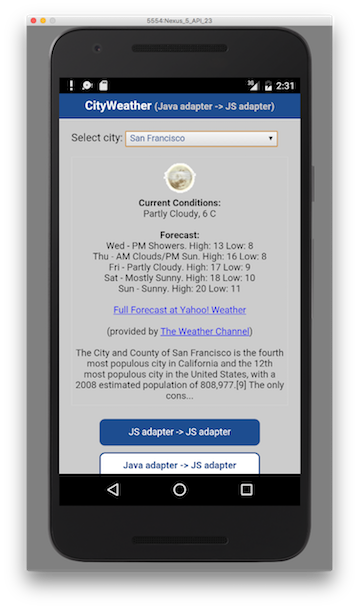

## Overview
Now that basic usage of different types of adapters has been covered, it is important to remember that adapters can be combined to make a procedure that uses different adapters to generate one processed result. You can combine several sources (different HTTP servers, SQL, etc).

In theory, from the client side, you could make several requests successively, one depending on the other.
However, writing this logic on the server side could be faster and cleaner.

#### Jump to:

* [JavaScript adapter API](#javascript-adapter-api)
* [Java adapter API](#java-adapter-api)
* [Data mashup example](#data-mashup-example)
* [Sample application](#sample-application)

## JavaScript adapter API
### Calling a JavaScript adapter procedure from a JavaScript adapter
When calling a JavaScript adapter procedure from another JavaScript adapter use the `MFP.Server.invokeProcedure(invocationData)` API. This API enables to invoke a procedure on any of your JavaScript adapters. `MFP.Server.invokeProcedure(invocationData)` returns the result object retrieved from the called procedure.

The `invocationData` function signature is:  
`MFP.Server.invokeProcedure({adapter: [Adapter Name], procedure: [Procedure Name], parameters: [Parameters seperated by a comma]})`

For example:

```javascript
MFP.Server.invokeProcedure({ adapter : "AcmeBank", procedure : " getTransactions", parameters : [accountId, fromDate, toDate]});
```

> Calling a Java adapter from a JavaScript adapter is not supported

## Java adapter API
Before you can call another adapter - the AdaptersAPI must be assigned to a variable:

```java
@Context
AdaptersAPI adaptersAPI;
```

### Calling a Java adapter from a Java adapter
When calling an adapter procedure from a Java adapter use the `executeAdapterRequest` API.
This call returns an `HttpResponse` object.

```java
HttpUriRequest req = new HttpGet(JavaAdapterProcedureURL);
HttpResponse response = adaptersAPI.executeAdapterRequest(req);
JSONObject jsonObj = adaptersAPI.getResponseAsJSON(response);
```

### Calling a JavaScript adapter procedure from a Java adapter
When calling a JavaScript adapter procedure from a Java adapter use both the `executeAdapterRequest` API and the `createJavascriptAdapterRequest` API that creates an `HttpUriRequest` to pass as a parameter to the `executeAdapterRequest` call.

```java
HttpUriRequest req = adaptersAPI.createJavascriptAdapterRequest(AdapterName, ProcedureName, [parameters]);
org.apache.http.HttpResponse response = adaptersAPI.executeAdapterRequest(req);
JSONObject jsonObj = adaptersAPI.getResponseAsJSON(response);
```

## Data mashup example
The following example shows how to mash up data from 2 data sources, a *database table* and *Fixer.io (exchange rate and currency conversion service)*, And to return the data stream to the application as a single object.

In this example we will use 2 adapters:

* SQL Adapter:
  * Extract a list of currencies from a currencies database table.
  * The result contains the list of currencies. Each currency will have an id, symbol and name. For example: {3, EUR, Euro}
  * This adapter will also have a procedure that calls the HTTP adapter passing 2 parameters - a base currency and a target currency to retrieve the updated exchange-rate.
* HTTP Adapter:
  * Connect to the Fixer.io service.
  * Extract an updated exchange-rate for the requested currencies that are retrieved as parameters via the SQL adapter.

Afterward, the mashed-up data is returned to the application for display.


The provided sample in this tutorial demonstrates the implementation of this scenario using 3 different mashup types.  
In each one of them the names of the adapters are slightly different.  
Here is a list of the mashup types and the corresponding adapter names:

| Scenario                                         |      SQL Adapter name        |  HTTP Adapter name    |  
|--------------------------------------------------|------------------------------|-----------------------|
| **JavaScript** adapter → **JavaScript** adapter  | SQLAdapterJS                 | HTTPAdapterJS         |  
| **Java** adapter → **JavaScript** adapter        | SQLAdapterJava               | HTTPAdapterJS         |  
| **Java** adapter → **Java** adapter              | SQLAdapterJava               | HTTPAdapterJava       |


### Mashup Sample Flow
**1. Create a procedure / adapter call that create a request to a back-end endpoint for the requested currencies and retrieves the corresponding data:**  

(HTTPAdapterJS adapter) XML:

```xml
<connectivity>
  <connectionPolicy xsi:type="http:HTTPConnectionPolicyType">
    <protocol>http</protocol>
    <domain>api.fixer.io</domain>
    <port>80</port>
    ...
  </connectionPolicy>
</connectivity>
```

(HTTPAdapterJS adapter) JavaScript:

```javascript
function getExchangeRate(fromCurrencySymbol, toCurrencySymbol) {
  var input = {
    method: 'get',
    returnedContentType: 'json',
    path: getPath(fromCurrencySymbol, toCurrencySymbol)
  };

  return MFP.Server.invokeHttp(input);
}

function getPath(from, to) {
  return "/latest?base=" + from + "&symbols=" + to;
}
```

(HTTPAdapterJava adapter)

```java
@GET
@Produces("application/json")
public Response get(@QueryParam("fromCurrency") String fromCurrency, @QueryParam("toCurrency") String toCurrency) throws IOException, IllegalStateException, SAXException {
  String path = "/latest?base="+ fromCurrency +"&symbols="+ toCurrency;
  return execute(new HttpGet(path));
}

private Response execute(HttpUriRequest req) throws IOException, IllegalStateException, SAXException {
  HttpResponse RSSResponse = client.execute(host, req);

  InputStream content = RSSResponse.getEntity().getContent();
  if (RSSResponse.getStatusLine().getStatusCode() == HttpStatus.SC_OK){
    responseAsText = IOUtils.toString(content, "UTF-8");
    content.close();
    return Response.ok().entity(responseAsText).build();
  }else{
    content.close();
    return Response.status(RSSResponse.getStatusLine().getStatusCode()).entity(RSSResponse.getStatusLine().getReasonPhrase()).build();
  }
}
```

**2. Create a procedure that fetches the currencies records from the database and returns a resultSet / JSONArray to the application:**

(SQLAdapterJS adapter)

```javascript
var getCurrenciesListStatement = "SELECT id, symbol, name FROM currencies;";

function getCurrenciesList() {
  var list = MFP.Server.invokeSQLStatement({
    preparedStatement: getCurrenciesListStatement,
    parameters: []
  });
  return list.resultSet;
}
```

(SQLAdapterJava adapter)

```java
@GET
@Produces(MediaType.APPLICATION_JSON)
@Path("/getCurrenciesList")
public JSONArray getCurrenciesList() throws SQLException, IOException {
  JSONArray jsonArr = new JSONArray();

  Connection conn = getSQLConnection();
  PreparedStatement getAllCities = conn.prepareStatement("select id, symbol, name from currencies");
  ResultSet rs = getAllCities.executeQuery();
  while (rs.next()) {
    JSONObject jsonObj = new JSONObject();
    jsonObj.put("id", rs.getString("id"));
    jsonObj.put("symbol", rs.getString("symbol"));
    jsonObj.put("name", rs.getString("name"));

    jsonArr.add(jsonObj);
  }
  rs.close();
  conn.close();
  return jsonArr;
}
```

**3. Create a procedure that calls the HTTPAdapter procedure (which we created in step 1) with the base-currency and the target-currency:**

(SQLAdapterJS adapter)

```javascript
function getExchangeRate(fromId, toId) {
  var base = getCurrencySymbol(fromId);
  var exchangeTo = getCurrencySymbol(toId);
  var ExchangeRate = null;

  if (base == exchangeTo) {
    ExchangeRate = 1;
  } else {
    var fixerExchangeRateJSON = MFP.Server.invokeProcedure({
      adapter: 'HTTPAdapterJS',
      procedure: 'getExchangeRate',
      parameters: [base, exchangeTo]
    });
    ExchangeRate = fixerExchangeRateJSON.rates[exchangeTo];
  }

  return {
    "base": base,
    "target": exchangeTo,
    "exchangeRate": ExchangeRate
  };
}
```

(SQLAdapterJava adapter - mashup with another Java adapter)

```java
@GET
@Produces(MediaType.APPLICATION_JSON)
@Path("/getExchangeRate_JavaToJava")
public JSONObject getExchangeRate_JavaToJava(@QueryParam("fromCurrencyId") Integer fromCurrencyId, @QueryParam("toCurrencyId") Integer toCurrencyId) throws SQLException, IOException{
  String base = getCurrencySymbol(fromCurrencyId);
  String exchangeTo = getCurrencySymbol(toCurrencyId);
  Double ExchangeRate = null;

  if(base.equals(exchangeTo)){
    ExchangeRate = 1.0;
  }
  else{
    String getFixerIOInfoProcedureURL = "/HTTPAdapterJava?fromCurrency="+ URLEncoder.encode(base, "UTF-8") +"&toCurrency="+ URLEncoder.encode(exchangeTo, "UTF-8");
    HttpUriRequest req = new HttpGet(getFixerIOInfoProcedureURL);
    HttpResponse response = adaptersAPI.executeAdapterRequest(req);
    JSONObject jsonExchangeRate = adaptersAPI.getResponseAsJSON(response);
    JSONObject rates = (JSONObject)jsonExchangeRate.get("rates");
    ExchangeRate = (Double) rates.get(exchangeTo);
  }

  JSONObject jsonObj = new JSONObject();
  jsonObj.put("base", base);
  jsonObj.put("target", exchangeTo);
  jsonObj.put("exchangeRate", ExchangeRate);

  return jsonObj;
}
```

(SQLAdapterJava adapter - mashup with a JavaScript adapter)

```java
@GET
@Produces(MediaType.APPLICATION_JSON)
@Path("/getExchangeRate_JavaToJS")
public JSONObject getExchangeRate_JavaToJS(@QueryParam("fromCurrencyId") Integer fromCurrencyId, @QueryParam("toCurrencyId") Integer toCurrencyId) throws SQLException, IOException{
  String base = getCurrencySymbol(fromCurrencyId);
  String exchangeTo = getCurrencySymbol(toCurrencyId);
  Double ExchangeRate = null;

  if(base.equals(exchangeTo)){
    ExchangeRate = 1.0;
  }
  else{
    HttpUriRequest req = adaptersAPI.createJavascriptAdapterRequest("HTTPAdapterJS", "getExchangeRate", URLEncoder.encode(base, "UTF-8"), URLEncoder.encode(exchangeTo, "UTF-8"));
    org.apache.http.HttpResponse response = adaptersAPI.executeAdapterRequest(req);
    JSONObject jsonExchangeRate = adaptersAPI.getResponseAsJSON(response);
    JSONObject rates = (JSONObject)jsonExchangeRate.get("rates");
    ExchangeRate = (Double) rates.get(exchangeTo);
  }

  JSONObject jsonObj = new JSONObject();
  jsonObj.put("base", base);
  jsonObj.put("target", exchangeTo);
  jsonObj.put("exchangeRate", ExchangeRate);

  return jsonObj;
}
```



## Sample application
[Click to download](https://github.com/MobileFirst-Platform-Developer-Center/AdaptersMashup/tree/release80) the Cordova project.

**Note:** the sample application's client-side is for Cordova applications, however the server-side code in the adapters applies to all platforms.

### Sample usage
#### Adapter setup
An example of currencies list in SQL is available in the provided adapter maven project (located inside the Cordova project), under `Utils/mobilefirstTraining.sql`.

1. Run the .sql script in your SQL database.
2. Use either Maven, MobileFirst CLI or your IDE of choice to [build and deploy the adapters](../../adapters/creating-adapters/).
3. Open the MobileFirst Console
    - Click on the **SQLAdapterJS** adapter and update the database connectivity properties.
    - Click on the **SQLAdapterJava** adapter and update the database connectivity properties.

#### Application setup

1. From the command line, navigate to the **CordovaApp** project's root folder.
2. Add a platform by running the `cordova platform add` command.
3. Register the application by running the command: `mfpdev app register`.
4. Run the Cordova application by running the `cordova run` command.
