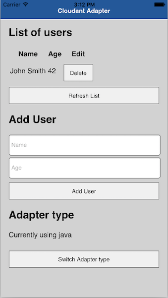

<!-- NLS_CHARSET=UTF-8 -->
## Overview
Cloudant is a NoSQL Database based on CouchDB, which is available as a stand-alone product as well as a Database-as-a-Service (DBaaS) on IBM Bluemix and `cloudant.com`.

As described in the Cloudant documentation:
> Documents are JSON objects. Documents are containers for your data, and are the basis of the Cloudant database.  
All documents must have two fields: a unique `_id` field, and a `_rev` field. The `_id` field is either created by you, or generated automatically as a UUID by Cloudant. The `_rev` field is a revision number, and is essential to the Cloudant replication protocol. In addition to these two mandatory fields, documents can contain any other content expressed as JSON.

The Cloudant API is documented on the [IBM Cloudant Documentation](https://docs.cloudant.com/index.html) site.

You can use IBM MobileFirst Platform adapters to communicate with a remote Cloudant database. This tutorial shows you some examples.

This tutorial assumes that you are comfortable with adapters. See [JavaScript HTTP Adapter](../javascript-adapters/js-http-adapter) or [Java Adapters](../java-adapters).

### Jump to:
* [JavaScript HTTP adapter](#javascript-http-adapter)
* [Java adapters](#java-adapters)
* [Sample application](#sample-application)


## JavaScript HTTP adapter
The Cloudant API can be accessed as a simple HTTP web service.

Using an HTTP adapter, you can connect to the Cloudant HTTP service with the `invokeHttp` method.

### Authentication
Cloudant supports several forms of authentication. See the Cloudant documentation about authentication at [https://docs.cloudant.com/authentication.html](https://docs.cloudant.com/authentication.html). With a JavaScript HTTP adapter, you can use **Basic Authentication**.

In your adapter XML file, specify the `domain` for your Cloudant instance, the `port` and add an `authentication` element of type `basic`. The framework will use those credentials to generate an `Authorization: Basic` HTTP header.

**Note:** With Cloudant, you can generate unique API keys to use instead of your real username and password.

```xml
<connectivity>
  <connectionPolicy xsi:type="http:HTTPConnectionPolicyType">
    <protocol>https</protocol>
    <domain>CLOUDANT_ACCOUNT.cloudant.com</domain>
    <port>443</port>
    <connectionTimeoutInMilliseconds>30000</connectionTimeoutInMilliseconds>
    <socketTimeoutInMilliseconds>30000</socketTimeoutInMilliseconds>
    <authentication>
      <basic/>
        <serverIdentity>
          <username>CLOUDANT_KEY</username>
          <password>CLOUDANT_PASSWORD</password>
        </serverIdentity>
    </authentication>
    <maxConcurrentConnectionsPerNode>50</maxConcurrentConnectionsPerNode>
    <!-- Following properties used by adapter's key manager for choosing specific certificate from key store
    <sslCertificateAlias></sslCertificateAlias>
    <sslCertificatePassword></sslCertificatePassword>
    -->
  </connectionPolicy>
</connectivity>
```

### Procedures
Your adapter procedures use the `invokeHttp` method to send an HTTP request to one of the URLs that are defined by Cloudant.  
For example, you can create a new document by sending a `POST` request to `/{*your-database*}/` with the body being a JSON representation of the document that you wish to store.

```js
function addEntry(entry){

    var input = {
            method : 'post',
            returnedContentType : 'json',
            path : DATABASE_NAME + '/',
            body: {
                contentType : 'application/json',        
                content : entry
            }
        };

    var response = MFP.Server.invokeHttp(input);
    if(!response.id){
        response.isSuccessful = false;
    }
    return response;

}
```

The same idea can be applied to all Cloudant functions. See the Cloudant documentation about documents at [https://docs.cloudant.com/document.html](https://docs.cloudant.com/document.html)

## Java adapters
Cloudant provides a [Java client library](https://github.com/cloudant/java-cloudant) for you to easily use all the features of Cloudant.

During the initialization of your Java adapter, set up a `CloudantClient` instance to work with.  
**Note:** With Cloudant, you can generate unique API keys to use instead of your real username and password.

```java
CloudantClient cloudantClient = new CloudantClient(cloudantAccount,cloudantKey,cloudantPassword);
db = cloudantClient.database(cloudantDBName, false);
```
<br/>
Using [Plain Old Java Objects](https://en.wikipedia.org/wiki/Plain_Old_Java_Object) and standard Java API for RESTful Web Services (JAX-RS 2.0), you can create a new document on Cloudant by sending a JSON representation of the document in the HTTP request.

```java
@POST
@Consumes(MediaType.APPLICATION_JSON)
public Response addEntry(User user){
    if(user!=null && user.isValid()){
        db.save(user);
        return Response.ok().build();
    }
    else{
        return Response.status(418).build();
    }
}
```


## Sample application
[Click to download](https://github.com/MobileFirst-Platform-Developer-Center/CloudantAdapter/tree/release80) the Cordova project.

The sample contains two adapters, one in JavaScript and one in Java.  
It also contains a Cordova application that works with both the Java and JavaScript adapters.

> **Note:** The sample uses Cloudant Java Client v1.2.3 due to known limitation.

### Sample usage
Follow the sample's README.md file for instructions.
