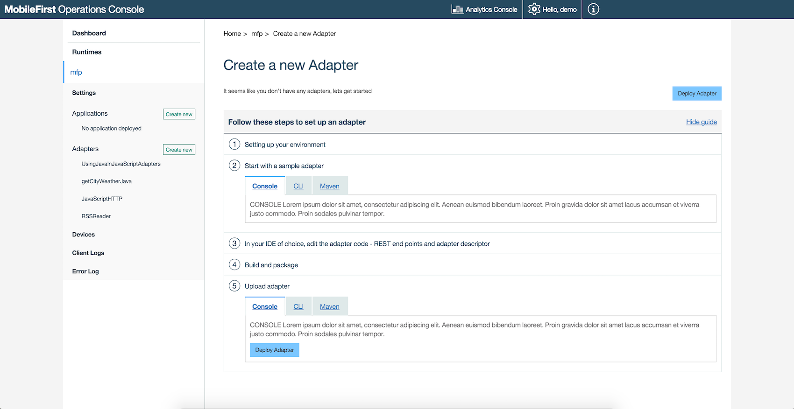

## Overview
An adapter can be created using either Maven commands or by using the MobileFirst CLI (that is dependent on Maven being installed and configured). The Adapter code can then be edited and built using your IDE of choice, such as Eclipse and IntelliJ. This tutorial explains how to create, build and deploy MobileFirst **Java or JavaScript adapters** using Maven and the MobileFirst CLI. To learn how to use the Eclipse or IntelliJ IDEs to create and build adapters, review the [Developing Adapters in Eclipse](../developing-adapters) tutorial.

**Prerequisite:** Make sure that you read the [Adapters Overview](../) first.

#### Jump to:
* [Install Maven](#install-maven)
* [Creating Adapters Using MobileFirst CLI](#creating-adapters-using-mobilefirst-cli)
 * [Install MobileFirst CLI](#install-mobilefirst-cli)
 * [Creating an Adapter](#install-mobilefirst-cli)
* [Creating Adapters Using Maven](#creating-adapters-using-maven-archetype-quot-adapter-maven-archetype-quot)
* [File Structure](#file-structure)
* [Build and Deploy Adapters](#build-and-deploy-adapters)
* [Dependencies](#dependencies)
* [Grouping Adapters in a Single Maven Project](#grouping-adapters-in-a-single-maven-project)
* [Downloading or Deploying Adapters Using MobileFirst Operations Console](#downloading-or-deploying-adapters-using-mobilefirst-operations-console)
* [Updating the Adapter Maven Project](#updating-the-adapter-maven-project)
* [Working offline](#working-offline)
* [Tutorials to follow next](#tutorials-to-follow-next)

## Install Maven
In order to create an adapter, you first need to download and install Maven. Go to the [Apache Maven website](https://maven.apache.org/) and follow the instructions how to download and install Maven.

## Creating Adapters Using MobileFirst CLI

### Install MobileFirst CLI
Follow the installation instructions in the [Downloads]({{site.baseurl}}/downloads/) page to Install MobileFirst CLI.  
**Prerequisite:** To create adapters using the Developer CLI, Maven must be installed.

### Creating an Adapter
To create a Maven adapter project, use the `mfpdev adapter create` command.
You can choose to run the command interactively or directly.

#### Interactive Mode
1. Open a **Command-line** window and run:

    ```bash
    mfpdev adapter create
    ```

2. Enter an adapter name. For example:

    ```bash
    ? Enter Adapter Name: SampleAdapter
    ```

3. Select an adapter type using the arrows and the enter keys:

    ```bash
    ? Select Adapter Type:
      HTTP
      SQL
    ❯ Java
    ```
  * Select `HTTP` to create a JavaScript HTTP adapter
  * Select `SQL` to create a JavaScript SQL adapter  
  * Select `Java` to create a Java adapter

4. Enter an adapter package (this option is valid for Java adapters only). For example:

    ```bash
    ? Enter Package: com.mypackage
    ```

5. Enter a [Group Id](https://maven.apache.org/guides/mini/guide-naming-conventions.html) of the Maven project to be build. For example:

    ```bash
    ? Enter Group ID: com.mycompany
    ```

#### Direct Mode
Replace the placeholders with the actual values and run the command:

```bash
mfpdev adapter create <adapter_name> -t <adapter_type> -p <adapter_package_name> -g <maven_project_groupid>
```

## Creating Adapters Using Maven Archetype "adapter-maven-archetype"
The "adapter-maven-archetype" is a MobileFirst-provided archetype, that based on the [Maven archetype toolkit](https://maven.apache.org/guides/introduction/introduction-to-archetypes.html), and is used by Maven in order to create the MobileFirst adapter Maven project.

To create a Maven adapter project, use the `archetype:generate` Maven command. Once the command is executed, Maven will download (or use the local repositories mentioned above) required files in order to generate the adapter Maven project.

You can choose to run the command interactively or directly.

#### Interactive Mode

1. From a **Command-line** window, navigate to a location of your choosing.  
   This is also where the Maven project will be generated.

2. Replace the **DarchetypeArtifactId** placeholder with the actual value and run:

    ```bash
    mvn archetype:generate -DarchetypeGroupId=com.ibm.mfp -DarchetypeArtifactId=replace-with-the-adapter-type-artifact-ID
    ```
  * The `Archetype Group Id` and Archetype Version are required parameters to identify the archetype.
  * The `Archetype Artifact Id` is a required parameter to identify the adapter type:
     * Use `adapter-maven-archetype-java` to create a Java adapter
     * Use `adapter-maven-archetype-http` to create a JavaScript HTTP adapter
     * Use `adapter-maven-archetype-sql` to create a JavaScript SQL adapter  

3. Enter a [Group Id](https://maven.apache.org/guides/mini/guide-naming-conventions.html) of the Maven project to be build. For example:

    ```bash
    Define value for property 'groupId': : com.mycompany
    ```

4. Enter an Artifact Id of the Maven project **which will later be used also as the adapter name**. For example:

    ```bash
    Define value for property 'artifactId': : SampleAdapter
    ```

5. Enter a Maven project version (the default is `1.0-SNAPSHOT`). For example:

    ```bash
    Define value for property 'version':  1.0-SNAPSHOT: : 1.0
    ```

6. Enter an adapter package name (the default is the `groupId`). For example:

    ```bash
    Define value for property 'package':  com.mycompany: : com.mypackage
    ```

7. Enter `y` to confirm:

    ```bash
    Confirm properties configuration:
    groupId: com.mycompany
    artifactId: SampleAdapter
    version: 1.0
    package: com.mypackage
    archetypeVersion: 8.0.0
     Y: : y
    ```

#### Direct Mode

Replace the placeholders with the actual values and run the command:

```bash
mvn archetype:generate -DarchetypeGroupId=com.ibm.mfp -DarchetypeArtifactId=<adapter type artifact ID> -DgroupId=<maven_project_groupid> -DartifactId=<maven_project_artifactid>  -Dpackage=<adapter_package_name>
```

> For more information about the `archetype:generate` command see the [Maven documentation](http://maven.apache.org/).

## File Structure
After creating the adapter the result will be a Maven project containing a **src** folder and a **pom.xml** file:


## Build and Deploy Adapters
### Build

* **Using the MobileFirst CLI** - Run the `adapter build` command from the project's root folder.
    
    ```bash
    mfpdev adapter build
    ```
    
* **Using Maven** - The adapter is built each time you run the `install` command to build the Maven project.

    ```bash
    mvn install
    ```

### Build All
If you have multiple adapters in a filesystem folder and you'd like to build all of them, use:

```bash
mfpdev adapter build all
```

The outcome is an **.adapter** archive file which can be found in the **target** folder of each adapter:


### Deploy

1. The **pom.xml** file contains the following `properties`:

    ```xml
    <properties>
    	<!-- parameters for deploy mfpf adapter -->
    	<mfpfUrl>http://localhost:9080/mfpadmin</mfpfUrl>
    	<mfpfUser>admin</mfpfUser>
    	<mfpfPassword>admin</mfpfPassword>
    	<mfpfRuntime>mfp</mfpfRuntime>
    </properties>
    ```
   * Replace **localhost:9080** with your MobileFirst Server IP address and port number.
   * **Optional**. Replace the **mfpfUser** and **mfpfPassword** default values with your MobileFirst admin user name and password.
   * **Optional**. Replace the **mfpfRuntime** default value with your MobileFirst runtime name.
2. Run the deploy command from the project's root folder:
 * **Using the MobileFirst CLI**:

        ```bash
        mfpdev adapter deploy -x
        ```
        The `-x` option deploys the adapter to the MobileFirst Server that is specified in adapter's **pom.xml** file.  
        If the option is not used, the CLI will use the default server specified in the CLI settings.
    
        > For more CLI deployment options run the command: `mfpdev help adapter deploy`.
 * **Using Maven**:

        ```bash
        mvn adapter:deploy
        ```

### Deploy All
If you have multiple adapters in a filesystem folder and you'd like to deploy all of them, use:

```bash
mfpdev adapter deploy all
```

> <span class="glyphicon glyphicon-info-sign" aria-hidden="true"></span> **Tip:** You can also build and deploy the adapter using a single command: `mvn install adapter:deploy`

### Deploying to different runtimes
If you run multiple runtimes, see [Registering applications and deploying adapters to different runtimes](../../installation-configuration/production/server-configuration/#registering-applications-and-deploying-adapters-to-different-runtimes).

## Dependencies <a name="dependencies"></a>
In order to use an external library in your adapter, follow one of the following suggested instructions:

#### Adding a local dependency:

1. Add a **lib** folder under the root Maven project folder and put the external library in it.
2. Add the library path under the `dependencies` element in the Maven project's **pom.xml** file.  

For example:

```xml
<dependency>
<groupId>sample</groupId>
<artifactId>com.sample</artifactId>
<version>1.0</version>
<scope>system</scope>
<systemPath>${project.basedir}/lib/</systemPath>
</dependency>
```

#### Adding an external dependency:

1. Search online repositories such as [The Central Repository](http://search.maven.org/) for the dependency.
2. Copy the POM dependency information and paste it under the `dependencies` element in the Maven project's **pom.xml** file.

The following example uses the `cloudant-client artifactId`:

```xml
<dependency>
  <groupId>com.cloudant</groupId>
  <artifactId>cloudant-client</artifactId>
  <version>1.2.3</version>
</dependency>
```

</br>
> For more information about dependencies see the Maven documentation.

## Grouping Adapters in a Single Maven Project
If you have several adapters in your project you may want to arrange them under a single Maven project. Grouping adapters provides benefits such as build all, deploy all and sharing dependencies. You can also build all and deploy all adapters even if they are not grouped in a single Maven project using the `mfpdev adapter build all` and `mfpdev adapter deploy all` CLI commands.

To group adapters you need to:

1. Create a root folder and call it, for example, "GroupAdapters".
2. Put the Maven adapter projects in it.
3. Create a **pom.xml** file:

    ```xml
    <project xmlns="http://maven.apache.org/POM/4.0.0" xmlns:xsi="http://www.w3.org/2001/XMLSchema-instance"
    	xsi:schemaLocation="http://maven.apache.org/POM/4.0.0 http://maven.apache.org/xsd/maven-4.0.0.xsd">

    	<modelVersion>4.0.0</modelVersion>
    	<groupId>com.sample</groupId>
    	<artifactId>GroupAdapters</artifactId>
    	<version>1.0-SNAPSHOT</version>
    	<packaging>pom</packaging>

    	<modules>
				<module>Adapter1</module>
				<module>Adapter2</module>
    	</modules>

    	<properties>
    		<!-- parameters for deploy mfpf adapter -->
    		<mfpfUrl>http://localhost:9080/mfpadmin</mfpfUrl>
    		<mfpfUser>admin</mfpfUser>
    		<mfpfPassword>admin</mfpfPassword>
        <mfpfRuntime>mfp</mfpfRuntime>
    	</properties>

      <build>
    		<plugins>
    			<plugin>
    				<groupId>com.ibm.mfp</groupId>
    				<artifactId>adapter-maven-plugin</artifactId>
    				<extensions>true</extensions>
    			</plugin>
    		</plugins>
    	</build>

    </project>
    ```
  1. Define a **`groupId`** element of your choice
  2. Add an **`artifactId`** element - the root folder's name
  3. Add a **`module`** element for each adapter
  4. Add the **`build`** element
  5. **Optional**. Replace **localhost:9080** with your specific MobileFirst Server IP address and port number.
  6. **Optional**. Replace the **`mfpfUser`** and **`mfpfPassword`** default values with your MobileFirst admin user name and password.
  7. **Optional**. Replace the **`mfpfRuntime`** default value with your MobileFirst runtime name.

4. To [build or deploy](#build-and-deploy-adapters) all adapters, run the Maven commands from the root "GroupAdapters" project.

## Downloading or Deploying Adapters Using MobileFirst Operations Console

1. Open your browser of choice and load the MobileFirst Operations Console using the address `http://<IP>:<PORT>/mfpconsole/`.  
2. Click on the "Create new" button next to Adapters. You have two options to create an adapter:
 * Using Maven or MobileFirst CLI as previously explained above.
 * Download a template adapter project (step 2).
3. Build the adapter Using Maven or MobileFirst CLI.
4. Choose one of the following ways to upload the generated **.adapter** file which can be found in the target folder of the adapter project:
 * Click on the Deploy Adapter button (step 5).
 * Drag and drop the file into the Create new adapter screen.

    

5. After successfully deploying the adapter, the details page will be displayed containing the following tabs:
 * Configurations - properties defined by the adapter XML file. Here you can change the configurations without having to deploy again.
 * Resources - a list of the adapter resources.
 * Configurations Files - adapter configuration data, to be used in devops environments.

## Updating the Adapter Maven Project
To update the adapter Maven project with the latest release, find the **version number** of the API and Plugin artifacts [in Maven's Central Repository](http://search.maven.org/#search%7Cga%7C1%7Cibmmobilefirstplatformfoundation) by search for "IBM MobileFirst Platform" and update the following properties in the adapter Maven project's **pom.xml** file:

1. The `adapter-maven-api` version:

    ```xml
    <dependency>
      <groupId>com.ibm.mfp</groupId>
      <artifactId>adapter-maven-api</artifactId>
      <scope>provided</scope>
      <version>8.0.2016061011</version>
    </dependency>
    ```
2. The `adapter-maven-plugin` version:

    ```xml
    <plugin>
      <groupId>com.ibm.mfp</groupId>
      <artifactId>adapter-maven-plugin</artifactId>
      <version>8.0.2016061011</version>
      <extensions>true</extensions>
    </plugin>
    ```

## Working offline
If you do not have online access to the Maven Central Repository, you can share MobileFirst Maven artifacts in the internal repository of your organization.

1. [Visit the Downloads page]({{site.baseurl}}/downloads/) and download the MobileFirst Foundation Development Kit Installer.
2. Start MobileFirst Server and in a browser, load the MobileFirst Operations Console from the following URL: http://<your-server-host:server-port>/mfpconsole.
3. Click **Download Center**. Under **Tools → Adapter Archetypes**, click **Download**. The mfp-maven-central-artifacts-adapter.zip archive is downloaded.
4. Add the adapter archetypes and security checks to the internal Maven repository by running the **install.sh** script for Linux and Mac, or the **install.bat** script for Windows.
5. The following JAR files are required by adapter-maven-api. Make sure they are located either in developers' local **.m2** folder, or in the Maven repository of your organization. You can download them from The Central Repository.
    * javax.ws.rs:javax.ws.rs-api:2.0
    * javax:javaee-web-api:6.0
    * org.apache.httpcomponents:httpclient:4.3.4
    * org.apache.httpcomponents:httpcore:4.3.2
    * commons-logging:commons-logging:1.1.3
    * javax.xml:jaxp-api:1.4.2
    * org.mozilla:rhino:1.7.7
    * io.swagger:swagger-annotations:1.5.6
    * com.ibm.websphere.appserver.api:com.ibm.websphere.appserver.api.json:1.0
    * javax.servlet:javax.servlet-api:3.0.1

## Tutorials to follow next

* [Learn about Java adapters](../java-adapters/)
* [Learn about JavaScript adapters](../javascript-adapters/)
* [Develop adapters in IDEs](../developing-adapters/)
* [Testing and debugging adapters](../testing-and-debugging-adapters/)
* [Review all Adapters tutorials](../)
