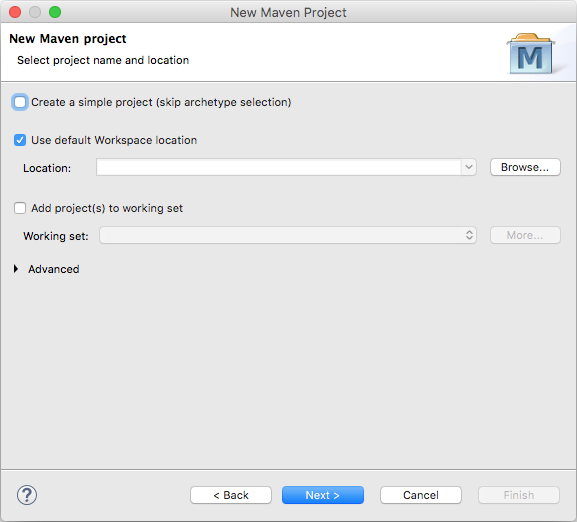
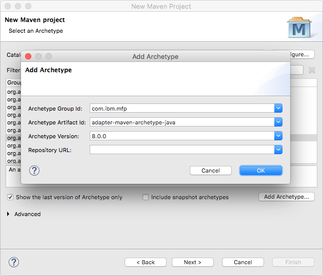
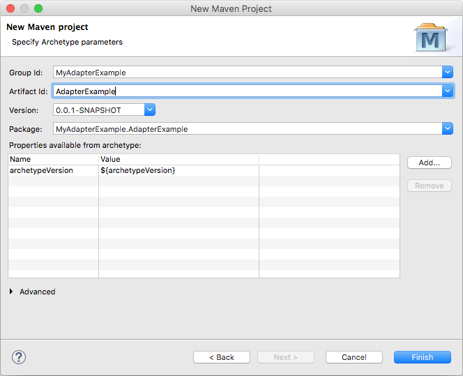

<!-- NLS_CHARSET=UTF-8 -->
## Overview
As taught in previous [Adapters tutorials](../), MobileFirst Adapters are Maven projects that are created by using either Maven directly or via the MobileFirst CLI. The adapter code can then be edited in any IDE, and later built and deployed using either Maven or the MobileFirst CLI. A developer may also choose to create, develop, build and deploy all inside a supported IDEs, such as Eclipse or IntelliJ. In this tutorial a MobileFirst adapter is created and built from the Eclipse IDE.

> For instructions how to use IntelliJ see the [Using IntelliJ to Develop MobileFirst Java Adapters]({{site.baseurl}}/blog/2016/03/31/using-intellij-to-develop-adapters) Blog Post.

**Prerequisite:**

* Get familiarized with MobileFirsts adapters by reading the [Adapters tutorials](../) first.
* Maven integration in Eclipse. Starting Eclipse Kepler (v4.3), Maven support is built-in in Eclipse. If your Eclipse instance does not support Maven, [follow the m2e instructions](http://www.eclipse.org/m2e/) to add Maven support.

#### Jump to:

* [Creating a new adapter Maven project](#creating-a-new-adapter-maven-project)
* [Importing an existing adapter Maven project](#importing-an-existing-adapter-maven-project)
* [Building and deploying an adapter Maven project](#building-and-deploying-an-adapter-maven-project)
* [Further reading](#further-reading)

## Create or import a MobileFirst Adapter Maven project
Follow the bellow instructions to either create a new adapter Maven project or import an existing one.

### Creating a new adapter Maven project

1. To create a new adapter Maven project, select: **File → New → Other... → Maven → Maven Project** and click **Next**.

    

2. Provide project name and location.  
    - Make sure the option to create a simple project is ticked **off** and click **Next**.

    

3. Select or add the MobileFirst adapter Archetype.
    - If you [installed the archetypes locally](../creating-adapters/#install-maven) and they are not appearing in the list of archetypes, select **Configure → Add Local Catalog → Browse to the /.m2/repository/archetype-catalog.xml in the home directory**.
    - Click on **Add Archetype** and provide the following details:
        - **Archetype Group Id**: `com.ibm.mfp`
        - **Archetype Artifact Id**: either `adapter-maven-archetype-java`, `adapter-maven-archetype-http` or `adapter-maven-archetype-sql`
        - **Archetype Version**: `8.0.2016061011` (you can find the latest available version in [Maven Central](http://search.maven.org/#search%7Cga%7C1%7Cibmmobilefirstplatformfoundation))

    

4. Specify Maven project parameters.  
    - Specify required **Group Id**, **Artifact Id**, **Version** and **package** parameters, and click **Finish**.

    

### Importing an existing adapter Maven project
To import the adapter Maven project, select **File → Import... → Maven → Existing Maven Projects**.

## Building and deploying an adapter Maven project
An adapter project can be built and deployed by using either Maven command-line commands, the MobileFirst CLI or from Eclipse.  
[Learn how to build and deploy adapters](../creating-adapters/#build-and-deploy-adapters).

>  **Tip:** Eclipse can also be enhanced to ease the deployment step by integrating a **Command-line** window using a plug-in, creating a consistant development environment. From this window Maven or MobileFirst CLI commands can be run.

### Building an adapter
To build an adapter, right-click on the adapter folder and select **Run As → Maven install**.  

### Deploying an adapter
To deploy an adapter, first add the deploy Maven command:

1. Select **Run → Run Configurations...**, right-click on **Maven Build** and select **New**.
2. Provide a Name: "Maven deploy".
2. Set as a Goal: "adapter:deploy".
3. Click **Apply** followed by clicking on **Run** to have an initial deploy.

You can now right-click on the adapter folder and select **Run As → Maven Deploy**

### Building and deploying an adapter
You can also combine the "build" and  "deploy" Maven Goals to a single "build and deploy" Goal: "clean install adapter:deploy".

## Further reading
Learn how to debug Java code in adapters in the [Testing and debugging adaters](../testing-and-debugging-adapters) tutorial.
