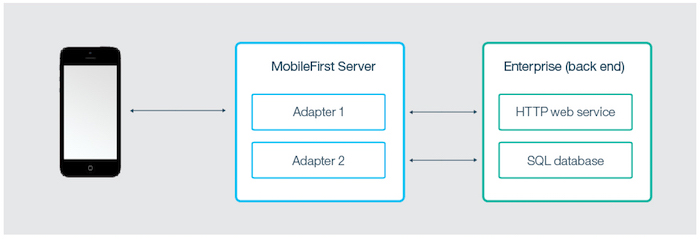

## Overview
MobileFirst Adapters are Maven projects that contain server-side code implemented in either Java or JavaScript.  
Adapters are used perform any necessary server-side logic, and to transfer and retrieve information from back-end systems to client applications and cloud services. 

Each adapter has its own isolated sandbox, which runs without knowing about or interrupting other adapter sandboxes. That said, adapters can still communicate with one another by calling API which makes "[adapter mashup](advanced-adapter-usage-mashup)" possible.

It is possible to include third-party libraries that are required by the adapter code by defining them as Maven dependencies in the adapter's **pom.xml** file. For more information, see the [Dependencies](creating-adapters/#dependencies) section in the [Creating Java and JavaScript Adapters](creating-adapters) tutorial.

Adapters also support DevOps needs:

* You can "hot deploy" adapters, meaning deploy, undeploy, and redeploy them at run time. This capability lends great flexibility to the MobileFirst server-side development process.
* An adapter can have user-defined properties that can be configured by administration personnel, without redeploying the adapter. This feature lets you customize adapter behavior for different environments, for example development, testing, and production.

Continue reading for an overview of Java and JavaScript adapters. Then follow the tutorials in the sidebar navigation to learn how to: create, build, update, develop, test and deploy Java and JavaScript adapters, learn how to use IDEs for adapters development, collect server-side logs, as well as more advanced topics such as adapters mashup and Cloudant integration.

### Benefits of using adapters
#### Universality
* Adapters support multiple integration technologies and back-end information systems.

#### Read-only and transactional capabilities
* Adapters support read-only and transactional access modes to back-end systems.

#### Fast development
* Adapters use simple XML syntax and are easily configured with JavaScript API or Java API.

#### Security
* Adapters use flexible authentication facilities to create connections with back-end systems.
* Adapters offer control over the identity of the connected user.

#### Transparency
* Data that is retrieved from back-end applications is exposed in a uniform manner, regardless of the adapter type.  

### Benefits specific to Java adapters
* Ability to fully control the URL structure, the content types, the request and response headers, content and encoding
* Ability to test the adapter by using a 3rd-party tool such as Postman
* Easy and fast deployment to a running MobileFirst Server instance with no compromise on performance and no downtime
* Security integration with the MobileFirst security model with no additional customization, by using simple annotations in the source code

## JavaScript adapters
JavaScript adapters provide templates for communicating with HTTP and SQL back-ends. These templates contain a set of services called procedures. Mobile apps can call these procedures by issuing AJAX requests. The procedure retrieves information from the back-end application and return data to the application. Using a REST interface, you can benefit from the [OAuth 2.0-based security framework](../authentication-and-security) provided by MobileFirst.

* If the format of the data is JSON then the MobileFirst Server keeps the data intact. Otherwise the MobileFirst Server automatically converts it to JSON.  
* Alternatively you can provide XSL transformation to convert the data to JSON. In this case, the returned content type from the back-end must be XML. Then, you can use an XSLT to filter the data based on requirements.
* With an HTTP adapter, you can send GET or POST HTTP requests and retrieve data from the response headers and body. HTTP adapters work with RESTful and SOAP-based services, and can read structured HTTP sources such as RSS feeds.
* With an SQL adapter, you can communicate with any SQL data source. You can use plain SQL queries or stored procedures.

> * Learn how to create adapters in the [Creating Adapters](creating-adapters) tutorial.
> * Learn more about [JavaScript adapters](javascript-adapters)

## Java adapters
Java adapters are based on the [JAX-RS 2.0 specification] (https://jax-rs-spec.java.net/nonav/2.0-rev-a/apidocs/index.html) and are thus written in Java, and expose a full REST API to the client. In Java adapters, it is up to the developer to define the returned content and its format, as well as the URL structure of each resource. The only exception is if the client sending the request supports GZip, then the returned content encoding of the Java adapter is compressed by GZip. All operations on the returned content are done and owned by the developer.

The diagram below depicts how a mobile device can access any Java adapter from its REST endpoint. The REST interface is protected by the MobileFirst OAuth security filter, meaning that the client needs to obtain an access token to access the adapter resources. Each of the resources of the adapter has its own URL, so it is possible to protect MobileFirst endpoints using any firewall. The REST interface invokes the Java code (JAX-RS service) to handle incoming requests. The Java code can perform operations on the server by using the Java MobileFirst Server API. In addition, the Java code can connect to the enterprise system to fetch data, update data, or perform any other operation that the enterprise system exposes.

> * Learn how to create adapters in the [Creating Adapters](creating-adapters) tutorial.
> * Learn more about [Java adapters](java-adapters)

## Tutorials to follow next
