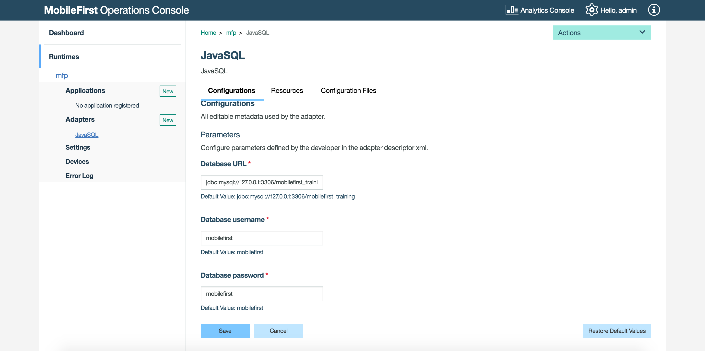

## Overview
Java adapters are based on the JAX-RS 2.0 specification. In other words, a Java adapter is a JAX-RS 2.0 service that can easily be deployed to a MobileFirst Server instance and has access to MobileFirst Server APIs and other 3rd party APIs.

**Prerequisite:** Make sure to read the [Creating Java and JavaScript Adapters](../creating-adapters) tutorial first.

#### Jump to:

* [File structure](#file-structure)
* [JAX-RS 2.0 application class](#jax-rs-2-0-application-class)
* [Implementing a JAX-RS 2.0 resource](#implementing-a-jax-rs-2-0-resource)
* [HTTP Session](#http-session)
* [Server-side APIs](#server-side-apis)

## File structure


### The adapter-resources folder  
The **adapter-resources** folder contains an XML configuration file (**adapter.xml**). In this configuration file you configure the class name of the JAX-RS 2.0 application for this adapter. For example: `com.sample.JavaAdapterApplication`.

```xml
<?xml version="1.0" encoding="UTF-8"?>
<mfp:adapter name="JavaAdapter"
	xmlns:xsi="http://www.w3.org/2001/XMLSchema-instance"
	xmlns:mfp="http://www.ibm.com/mfp/integration"
	xmlns:http="http://www.ibm.com/mfp/integration/http">

	<displayName>JavaAdapter</displayName>
	<description>JavaAdapter</description>

	<JAXRSApplicationClass>com.sample.JavaAdapterApplication</JAXRSApplicationClass>
	
	<securityCheckDefinition name="sample" class="com.sample.sampleSecurityCheck">
    	<property name="maxAttempts" defaultValue="3"/>
	</securityCheckDefinition>
	
	<property name="DB_url" displayName="Database URL" defaultValue="jdbc:mysql://127.0.0.1:3306/mobilefirst_training"  />
	<property name="DB_username" displayName="Database username" defaultValue="mobilefirst"  />
	<property name="DB_password" displayName="Database password" defaultValue="mobilefirst"  />
</mfp:adapter>
```

<div class="panel-group accordion" id="terminology" role="tablist" aria-multiselectable="false">
    <div class="panel panel-default">
        <div class="panel-heading" role="tab" id="adapter-xml">
            <h4 class="panel-title">
                <a class="preventScroll" role="button" data-toggle="collapse" data-parent="#adapter-xml" data-target="#collapse-adapter-xml" aria-expanded="false" aria-controls="collapse-adapter-xml"><b>Click for adapter.xml attributes and subelements</b></a>
            </h4>
        </div>

        <div id="collapse-adapter-xml" class="panel-collapse collapse" role="tabpanel" aria-labelledby="adapter-xml">
            <div class="panel-body">
                <ul>
                    <li><b>name</b>: <i>Mandatory.</i> The name of the adapter. This name must be unique within the MobileFirst Server. It can contain alphanumeric characters and underscores, and must start with a letter. After you define and deploy an adapter, you cannot modify its name.</li>
					<li><b>displayName</b>: <i>Optional.</i> The name of the adapter that is displayed in the MobileFirst Operations Console. If this element is not specified, the value of the name attribute is used instead.</li>
					<li><b>description</b>: <i>Optional.</i> Additional information about the adapter. Displayed in the MobileFirst Operations Console.</li>
					<li><b>JAXRSApplicationClass</b>: <i>Mandatory for exposing an /adapter endpoint.</i> Defines the class name of the JAX-RS application of this adapter. In the example, it is com.acme.JavaAdapterApplication.</li>
					<li><b>securityCheckDefinition</b>: <i>Optional.</i> Defines a security-check object. Learn more about security checks in the <a href="../../authentication-and-security/creating-a-security-check">Creating a Security Checks</a> tutorial.</li>
					<li><b>property</b>: <i>Optional.</i> Declares a user-defined property. Learn more in the Custom properties topic below.</li>
                </ul>
				<br/>
                <a class="preventScroll" role="button" data-toggle="collapse" data-parent="#adapter-xml" data-target="#collapse-adapter-xml" aria-expanded="false" aria-controls="collapse-adapter-xml"><b>Close section</b></a>.
            </div>
        </div>
    </div>
</div>

#### Custom properties

The **adapter.xml** file can also contain user-defined custom properties. The values that developers assign to them during the creation of the adapter can be overridden in the **MobileFirst Operations Console → [your adapter] → Configurations tab**, without redeploying the adapter. User-defined properties can be read using the [ConfigurationAPI interface](#configuration-api) and then further customized at run time.

> <span class="glyphicon glyphicon-info-sign" aria-hidden="true"></span> **Note:**  The configuration properties elements must be located **below** the `JAXRSApplicationClass` element.  
In the example above we defined the connection settings and gave them default values, so they could be used later in the AdapterApplication class.

The `<property>` element takes the following attributes:

- **name**: The name of the property, as defined in the configuration class.
- **defaultValue**: Overrides the default value defined in the configuration class.
- **displayName**: *optional*, a friendly name to be displayed in the console.
- **description**: *optional*, a description to be displayed in the console.
- **type**: *optional*, ensures that the property is of a specific type such as `integer`, `string`, `boolean` or a list of valid values (for example `type="['1','2','3']"`).



#### Pull and Push Configurations

Customized adapter properties can be shared using the adapter configuration file found in the **Configuration files tab**.  
To do so, use the `pull` and `push` commands described below using either Maven or the MobileFirst CLI. For the properties to be shared, you need to *change the default values given to the properties*.

Run the commands from the root folder of the adapter Maven project:

**Maven**  

* To **pull** the configurations file - `mvn adapter:configpull -DmfpfConfigFile=config.json`.
* To **push** the configurations file - `mvn adapter:configpush -DmfpfConfigFile=config.json`.

**MobileFirst CLI**  

* To **pull** the configurations file - `mfpdev adapter pull`.
* To **push** the configurations file - `mfpdev adapter push`.

> Learn more in by using `mfpdev help adapter pull/push`.

### The java folder
the Java sources of the JAX-RS 2.0 service are placed in this folder. JAX-RS 2.0 services are composed of an application class (which extends `com.ibm.mfp.adapter.api.MFPJAXRSApplication`) and the resources classes.

The JAX-RS 2.0 application and resources classes define the Java methods and their mapping to URLs.  
`com.sample.JavaAdapterApplication` is the JAX-RS 2.0 application class and `com.sample.JavaAdapterResource` is a JAX-RS 2.0 resource included in the application.

## JAX-RS 2.0 application class
The JAX-RS 2.0 application class tells the JAX-RS 2.0 framework which resources are included in the application.

```java
package com.sample.adapter;

import java.util.logging.Logger;
import com.ibm.mfp.adapter.api.MFPJAXRSApplication;

public class JavaAdapterApplication extends MFPJAXRSApplication{

    static Logger logger = Logger.getLogger(JavaAdapterApplication.class.getName());

    @Override
    protected void init() throws Exception {
        logger.info("Adapter initialized!");
    }

    @Override
    protected String getPackageToScan() {
        //The package of this class will be scanned (recursively) to find JAX-RS 2.0 resources.
        return getClass().getPackage().getName();
    }
}
```

The `MFPJAXRSApplication` class scans the package for JAX-RS 2.0 resources and automatically creates a list. Additionally, its `init` method is called by MobileFirst Server as soon as the adapter is deployed (before it starts serving) and when the MobileFirst runtime starts up.

## Implementing a JAX-RS 2.0 resource
JAX-RS 2.0 resource is a POJO (Plain Old Java Object) which is mapped to a root URL and has Java methods for serving requests to this root URL and its child URLs. Any resource can have a separate set of URLs.

```java
package com.sample.adapter;

import java.util.logging.Logger;

import javax.ws.rs.GET;
import javax.ws.rs.Path;
import javax.ws.rs.PathParam;

@Path("/")
public class JavaAdapterResource {

    //Define logger (Standard java.util.Logger)
    static Logger logger = Logger.getLogger(JavaAdapterResource.class.getName());

    //Path for method: "<server address>/Adapters/adapters/JavaAdapter/{username}"
    @GET
    @Path("/{username}")
    public String helloUser(@PathParam("username") String name){
        return "Hello " + name;
    }
}
```

* `@Path("/")` before the class definition determines the root path of this resource. If you have multiple resource classes, you should set each resource a different path.  

	For example, if you have a `UserResource` with `@Path("/users")` to manage users of a blog, that resource is accessible via `http(s)://host:port/ProjectName/adapters/AdapterName/users/`.

	That same adapter may contain another resource `PostResource` with `@Path("/posts")` to manage posts of a blog. It is accessible via the `http(s)://host:port/ProjectName/adapters/AdapterName/posts/` URL.  

	In the example above, because there it has only one resource class, it is set to `@Path("/")` so that it is accessible via `http(s)://host:port/Adapters/adapters/JavaAdapter/`.  

* Each method is preceded by one or more JAX-RS 2.0 annotations, for example an annotation of type "HTTP request" such as `@GET`, `@PUT`, `@POST`, `@DELETE`, or `@HEAD`. Such annotations define how the method can be accessed.  

* Another example is `@Path("/{username}")`, which defines the path to access this procedure (in addition to the resource-level path). As you can see, this path can include a variable part. This variable is then used as a parameter of the method, as defined `@PathParam("username") String name`.  

> You can use many other annotations. See **Annotation Types Summary** here:
[https://jax-rs-spec.java.net/nonav/2.0-rev-a/apidocs/javax/ws/rs/package-summary.html](https://jax-rs-spec.java.net/nonav/2.0-rev-a/apidocs/javax/ws/rs/package-summary.html)

## HTTP Session
The MobileFirst server does not rely on HTTP sessions and each request may reach a different node. You should not rely on HTTP sessions to keep data from one request to the next.

## Server-side APIs
Java adapters can use the MobileFirst server-side Java APIs to perform operations that are related to MobileFirst Server, such as calling other adapters, logging to the server log, getting values of configuration properties, reporting activities to Analytics and getting the identity of the request issuer.  

### Configuration API
The `ConfigurationAPI` class provides an API to retrieve properties defined in the **adapter.xml** or in the MobileFirst Operations console.

Inside your Java class, add the following at the class level:

```java
@Context
ConfigurationAPI configurationAPI;
```

Then you can use the `configurationAPI` instance to get properties:

```java
configurationAPI.getPropertyValue("DB_url");
```

When the adapter configuration is modified from the MobileFirst Operations console, the JAX-RS application class is reloaded and its `init` method is called again.

The `getServerJNDIProperty` method can also be used to retrieve a JNDI property from your server configuration.

You can see usage examples on the [Java SQL Adapter tutorial](java-sql-adapter).

### Adapters API
The `AdaptersAPI` class provides an API to retrieve information about the current adapter and send REST requests to other adapters.

Inside your Java class, add the following at the class level:

```java
@Context
AdaptersAPI adaptersAPI;
```

You can see usage examples on the [advanced adapter usage mashup tutorial](../advanced-adapter-usage-mashup).

### Analytics API
The `AnalyticsAPI` class provides an API for reporting information to analytics.

Inside your Java class, add the following at the class level:

```java
@Context
AnalyticsAPI analyticsAPI;
```

You can see usage examples on the [Analytics API tutorial](../../analytics/analytics-api).

### Security API
The `AdapterSecurityContext` class provides the security context of an adapter REST call.

Inside your Java class, add the following at the class level:

```java
@Context
AdapterSecurityContext securityContext;
```

You can then, for example, get the current `AuthenticatedUser` using:

```java
AuthenticatedUser currentUser = securityContext.getAuthenticatedUser();
```

## Java adapter examples
For examples of Java adapters communicating with an HTTP or SQL back end, see:
