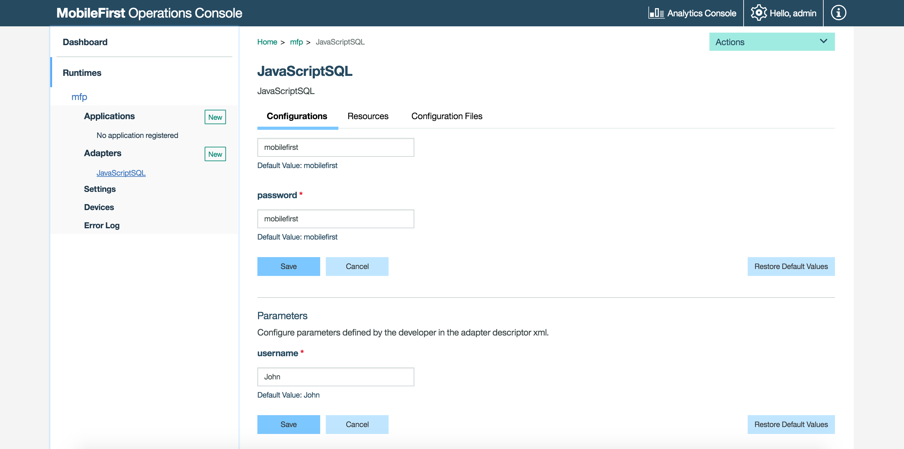

<!-- NLS_CHARSET=UTF-8 -->
## Overview
JavaScript adapters provide templates for connection to HTTP and SQL back-ends. It provides a set of services, called procedures and mobile apps can call these procedures by issuing AJAX requests.

**Prerequisite:** Make sure to read the [Creating Java and JavaScript Adapters](../creating-adapters) tutorial first.

## File structure


### The adapter-resources folder  
The `adapter-resources` folder contains an XML configuration file. This configuration file describes the connectivity options and lists the procedures that are exposed to the application or other adapters.

```xml
<?xml version="1.0" encoding="UTF-8"?>
<mfp:adapter name="JavaScriptAdapter">
    <displayName>JavaScriptAdapter</displayName>
    <description>JavaScriptAdapter</description>
    
    <connectivity>
        <connectionPolicy>
        ...
        </connectionPolicy>
    </connectivity>

    <procedure name="procedure1"></procedure>
    <procedure name="procedure2"></procedure>

    <property name="name" displayName="username" defaultValue="John"  />
</mfp:adapter>
```

<div class="panel-group accordion" id="terminology" role="tablist" aria-multiselectable="false">
    <div class="panel panel-default">
        <div class="panel-heading" role="tab" id="adapter-xml">
            <h4 class="panel-title">
                <a class="preventScroll" role="button" data-toggle="collapse" data-parent="#adapter-xml" data-target="#collapse-adapter-xml" aria-expanded="false" aria-controls="collapse-adapter-xml"><b>Click for adapter.xml attributes and subelements</b></a>
            </h4>
        </div>

        <div id="collapse-adapter-xml" class="panel-collapse collapse" role="tabpanel" aria-labelledby="adapter-xml">
            <div class="panel-body">
                <ul>
                    <li><b>name</b>: <i>Mandatory.</i> The name of the adapter. This name must be unique within the {{ site.data.keys.mf_server }}. It can contain alphanumeric characters and underscores, and must start with a letter. After you define and deploy an adapter, you cannot modify its name.</li>
					<li><b>displayName</b>: <i>Optional.</i> The name of the adapter that is displayed in the {{ site.data.keys.mf_console }}. If this element is not specified, the value of the name attribute is used instead.</li>
					<li><b>description</b>: <i>Optional.</i> Additional information about the adapter. Displayed in the {{ site.data.keys.mf_console }}.</li>
					<li><b>connectivity</b>: <i>Mandatory.</i> Defines the mechanism by which the adapter connects to the back-end application. It contains the <code>connectionPolicy</code> subelement.
                        <ul>
                            <li><b>connectionPolicy</b>: <i>Mandatory</i>. The <code>connectionPolicy</code> defines connection properties. The structure of this subelement depends on the integration technology of the back-end application. For more information about connectionPolicy, see <a href="js-http-adapter">HTTP adapter connectionPolicy element</a> and <a href="js-sql-adapter">SQL adapter connectionPolicy element</a>.</li>
                        </ul>
                    </li>
                    <li><b>procedure</b>: <i>Mandatory.</i> Defines a process for accessing a service that is exposed by a back-end application.
                        <ul>
                            <li><b>name</b>: <i>Mandatory.</i> The name of the procedure. This name must be unique within the adapter. It can contain alphanumeric characters and underscores, and must start with a letter.</li>
                            <li><b>audit</b>: <i>Optional.</i> Defines whether calls to the procedure are logged in the audit log. The following values are valid: 
                                <ul>
                                    <li><b>true</b>: Calls to the procedure are logged in the audit log.</li> 
                                    <li><b>false</b>: Default. Calls to the procedure are not logged in the audit log.</li>
                                </ul>
                            </li>
                            <li><b>scope</b>: <i>Optional.</i> The security scope that protects the adapter resource procedure, as a string of zero or more space-separated scope elements. A scope element can be a keyword that is mapped to a security check, or the name of a security check. The default value of the scope attribute is an empty string. When the value of the <b>secured</b> attribute is false, the scope attribute is ignored. For information on OAuth resource protection, see the <a href="../../authentication-and-security">Authorization Concepts</a> tutorial.</li>
                            <li><b>secured</b>: <i>Optional.</i> Defines whether the adapter resource procedure is protected by the {{ site.data.keys.product }} security framework. The following values are valid:
                                <ul>
                                    <li><b>true</b>: Default. The procedure is protected. Calls to the procedure require a valid access token.</li>
                                    <li><b>false</b>. The procedure is not protected. Calls to the procedure do not require an access token. When this value is set, the <b>scope</b> attribute is ignored. To understand the implications of disabling resource protection, see the <a href="../../authentication-and-security/#unprotected-resources">Unprotected resources</a> topic in the <a href="../../authentication-and-security">Authorization Concepts</a> tutorial.</li>
                                </ul>
                            </li>
                        </ul>
                    </li>
                    <li><b>securityCheckDefinition</b>: <i>Optional.</i> Defines a security-check object. Learn more about security checks in the <a href="../../authentication-and-security/creating-a-security-check">Creating a Security Checks</a> tutorial.</li>
        			<li><b>property</b>: <i>Optional.</i> Declares a user-defined property. Learn more in the Custom properties topic below.</li>
                </ul>
                <br/>
                <a class="preventScroll" role="button" data-toggle="collapse" data-parent="#adapter-xml" data-target="#collapse-adapter-xml" aria-expanded="false" aria-controls="collapse-adapter-xml"><b>Close section</b></a>
            </div>
        </div>
    </div>
</div>

#### Custom properties

The **adapter.xml** file can also contain user-defined custom properties. The values that developers assign to them during the creation of the adapter can be overridden in the **{{ site.data.keys.mf_console }} → [your adapter] → Configurations tab**, without redeploying the adapter. User-defined properties can be read using the [getPropertyValue API](#getpropertyvalue) and then further customized at run time.

> <span class="glyphicon glyphicon-info-sign" aria-hidden="true"></span> **Note:**  The configuration properties elements must always be located *below* the `procedure` elements. In the example above we defined a displayName property with a default value, so it could be used later.

The `<property>` element takes the following attributes:

- **name**: The name of the property, as defined in the configuration class.
- **defaultValue**: Overrides the default value defined in the configuration class.
- **displayName**: *optional*, a friendly name to be displayed in the console.
- **description**: *optional*, a description to be displayed in the console.
- **type**: *optional*, ensures that the property is of a specific type such as `integer`, `string`, `boolean` or a list of valid values (for example `type="['1','2','3']"`).



#### Pull and Push Configurations

Customized adapter properties can be shared using the adapter configuration file found in the **Configuration files tab**.  
To do so, use the `pull` and `push` commands described below using either Maven or the {{ site.data.keys.mf_cli }}. For the properties to be shared, you need to *change the default values given to the properties*.

Run the commands from the root folder of the adapter Maven project:

**Maven**  

* To **pull** the configurations file - `mvn adapter:configpull -DmfpfConfigFile=config.json`.
* To **push** the configurations file - `mvn adapter:configpush -DmfpfConfigFile=config.json`.

**{{ site.data.keys.mf_cli }}**  

* To **pull** the configurations file - `mfpdev adapter pull`.
* To **push** the configurations file - `mfpdev adapter push`.

> Learn more in by using `mfpdev help adapter pull/push`.

### The js folder
This folder contains all the JavaScript implementation file of the procedures that are declared in the **adapter.xml** file. It also contains zero, one, or more XSL files, which contain a transformation scheme for retrieved raw XML data. Data that is retrieved by an adapter can be returned raw or preprocessed by the adapter itself. In either case, it is presented to the application as a **JSON object**.

## JavaScript adapter procedures
Procedures are declared in XML and are implemented with server-side JavaScript, for the following purposes:

* To provide adapter functions to the application
* To call back-end services to retrieve data or to perform actions

Each procedure that is declared in the **adapter.xml** file must have a corresponding function in the JavaScript file.

By using server-side JavaScript, a procedure can process the data before or after it calls the service. You can apply more filtering to retrieved data by using simple XSLT code.  
JavaScript adapter procedures are implemented in JavaScript. However, because an adapter is a server-side entity, it is possible to [use Java in the adapter](../javascript-adapters/using-java-in-javascript-adapters) code.

### Using global variables
The {{ site.data.keys.mf_server }} does not rely on HTTP sessions and each request may reach a different node. You should not rely on global variables to keep data from one request to the next.

### Adapter response threshold
Adapter calls are not designed to return huge chunks of data because the adapter response is stored in {{ site.data.keys.mf_server }} memory as a string. Thus, data that exceeds the amount of available memory might cause an out-of-memory exception and the failure of the adapter invocation. To prevent such failure, you configure a threshold value from which the {{ site.data.keys.mf_server }} returns gzipped HTTP responses. The HTTP protocol has standard headers to support gzip compression. The client application must also be able to support gzip content in HTTP.

#### Server-side
In the {{ site.data.keys.mf_console }}, under **Runtimes > Settings > GZIP compression threshold for adapter responses**, set the desired threshold value. The default value is 20 KB.  
**Note:** By saving the change in the {{ site.data.keys.mf_console }}, the change is effective immediately in the runtime.

#### Client-side
Ensure that you enable the client to parse a gzip response, by setting the value of the `Accept-Encoding` header to `gzip` in every client request.
Use the `addHeader` method with your request variable, for example: `request.addHeader("Accept-Encoding","gzip");`

## Server-side APIs
JavaScript adapters can use server-side APIs to perform operations that are related to {{ site.data.keys.mf_server }}, such as calling other JavaScript adapters, logging to the server log, getting values of configuration properties, reporting activities to Analytics and getting the identity of the request issuer.  

### getPropertyValue
Use the `MFP.Server.getPropertyValue(propertyName)` API to retrieve properties defined in the **adapter.xml** or in the {{ site.data.keys.mf_console }}:

```js
MFP.Server.getPropertyValue("name");
```

### getTokenIntrospectionData

Use the `MFP.Server.getTokenIntrospectionData()` API to

To get the current User ID use:

```js
function getAuthUserId(){
   var securityContext = MFP.Server.getTokenIntrospectionData();
   var user = securityContext.getAuthenticatedUser();
 
   return "User ID: " + user.getId;
}
```


### getAdapterName
Use the `getAdapterName()` API to retrieve the adapter name.

### invokeHttp
Use the `MFP.Server.invokeHttp(options)` API in HTTP adapters.  
You can see usage examples on the [JavaScript HTTP Adapter](js-http-adapter) tutorial.

### invokeSQL
Use the `MFP.Server.invokeSQLStatement(options)` and the `MFP.Server.invokeSQLStoredProcedure(options)` APIs in SQL adapters.  
You can see usage examples on the [JavaScript SQL Adapter](js-sql-adapter) tutorial.

### addResponseHeader
Use the `MFP.Server.addResponseHeader(name,value)` API to add a new header(s) to the response:

```js
MFP.Server.addResponseHeader("Expires","Sun, 5 October 2014 18:00:00 GMT");
```
### getClientRequest
Use the `MFP.Server.getClientRequest()` API to get a reference to the Java HttpServletRequest object that was used to invoke an adapter procedure:

```js
var request = MFP.Server.getClientRequest();
var userAgent = request.getHeader("User-Agent");
```

### invokeProcedure
Use the `MFP.Server.invokeProcedure(invocationData)` to call other JavaScript adapters.  
You can see usage examples on the [Advanced Adapter Usage and Mashup](../advanced-adapter-usage-mashup) tutorial.

### Logging
The JavaScript API provides logging capabilities through the MFP.Logger class. It contains four functions that correspond to four standard logging levels.  
You can see the [server-side log collection](../server-side-log-collection) tutorial for more information.

## JavaScript adapter examples:
