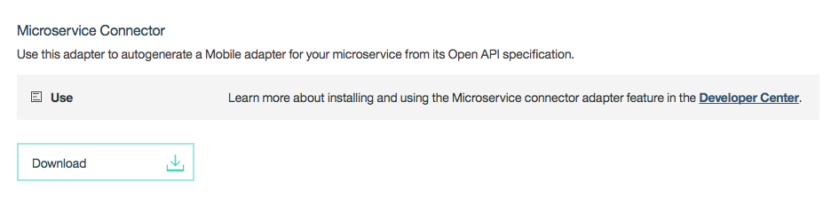

<!-- NLS_CHARSET=UTF-8 -->
## Overview
{: #overview }

{{ site.data.keys.product }} adapters are used to perform any necessary server-side logic, and to transfer and retrieve information from back-end systems to client applications and cloud services.

##  Generate an adapter from its OpenAPI specification
{: #generate-adapter-openapi-spec}

Auto-generation of an adapter from its OpenAPI specification (Swagger Specification) helps in expediting application development. {{ site.data.keys.product }} user can now focus on the application logic instead of creating the {{ site.data.keys.product }} adapter, which connects the application to the desired back-end service.

>**Note:** This feature is available only in DevKit.

To use this feature, the OpenAPI specification JSON for the microservice (or the desired back-end service) should be available. The adapter generation feature is made available by an extension adapter called **Microservice Connector**, also referred to as **Microservice Adapter Generator**, which is available for download from the **Download Center** on {{ site.data.keys.product }} Console.

>**Note:** As a prerequisite, configure the JAVA_HOME variable to point to the installed JDK folder.

  

Download the **Microservice Adapter Generator** adapter and deploy it to {{ site.data.keys.product }} server. The deployed adapter will now be listed under **Extensions**, in the navigation pane.

  

Clicking the **Microservice Adapter Generator** will launch the page, where the user can provide the OpenAPI Specification JSON file and can choose to generate the adapter from the provided OpenAPI specification.

  

After the adapter is generated it will be automatically downloaded to the browser. The user is then required to deploy the generated adapter, for use in their apps.

The adapter generator depends on the accuracy of the OpenAPI specification JSON. If the specification is incomplete or incorrect, the generation may fail or may result in the generation of adapter APIs that do not match the APIs of the back-end microservices.
