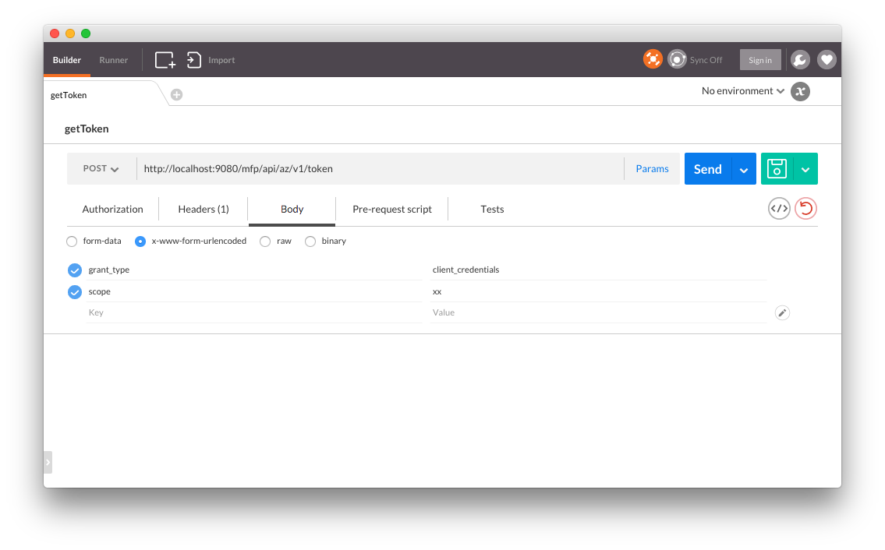
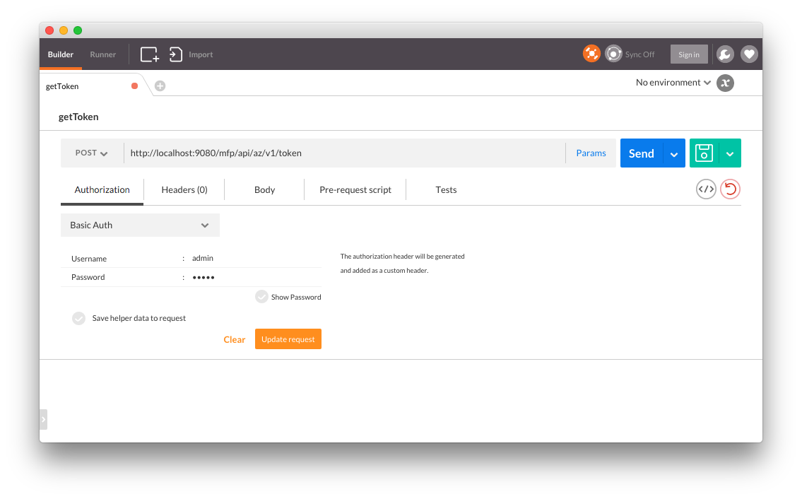
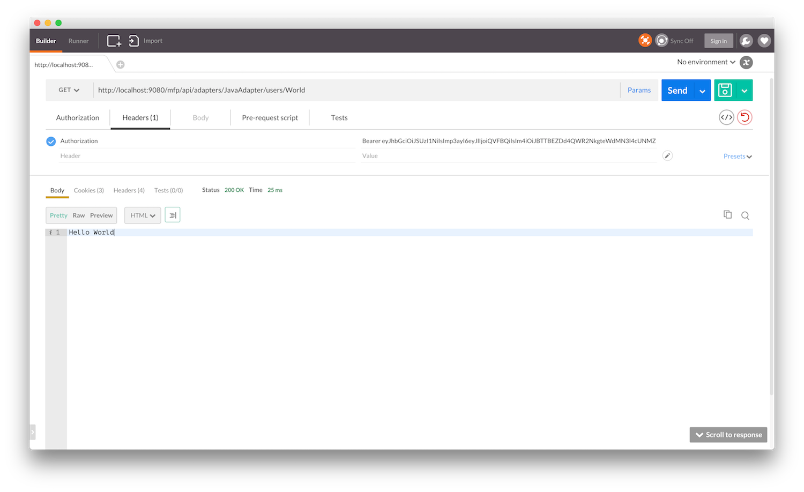
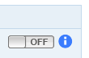
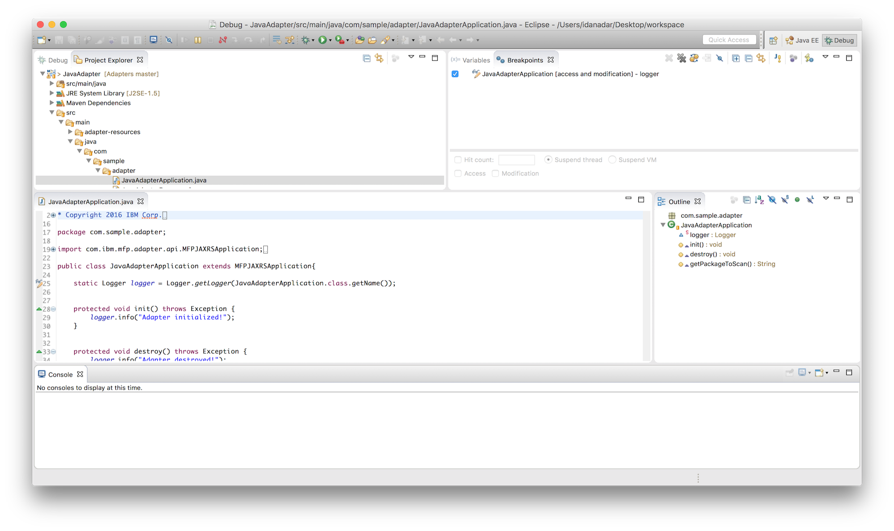

<!-- NLS_CHARSET=UTF-8 -->
## Overview

You can use IDEs, such as Eclipse, IntelliJ, or similar ones, to test Java and JavaScript adapters, and debug Java code  that is implemented for use in Java or JavaScript adapters.  

This tutorial demonstrates how to test adapters by using the MobileFirst CLI and by using Postman, and also how to debug a Java adapter by using the Eclipse IDE.

#### Jump to:

* [Testing Adapters](#testing-adapters)
 * [Using Postman](#using-postman)
 * [Using Swagger](#using-swagger)
* [Debugging Adapters](#debugging-adapters)
 * [JavaScript adapters](#javascript-adapters)
 * [Java adapters](#java-adapters)

## Testing Adapters
MobileFirst adapters are available via a REST interface. This means that if you know the URL of a resource, you can use HTTP tools such as Postman to test requests and pass `URL` parameters, `path` parameters, `body` parameters or `headers` as you see fit.

The structure of the URL used to access the adapter resource is:

* In JavaScript adapters - `http://hostname-or-ip-address:port-number/mfp/api/adapters/{adapter-name}/{procedure-name}`
* In Java adapters - `http://hostname-or-ip-address:port-number/mfp/api/adapters/{adapter-name}/{path}`

### Passing parameters

* When using Java adapters, you can pass parameters in the URL, body, form, etc, depending on how you configured your adapter.
* When using JavaScript adapters, you pass parameters as `params=["param1", "param2"]`. In other words, a JavaScript procedure receives only one parameter called `params` which needs to be **an array of ordered, unnamed values**. This parameter can either be in the URL (`GET`) or in the body (`POST`) using `Content-Type: application/x-www-form-urlencoded`.

### Handling security
The MobileFirst security framework requires an access token for any adapter resource even if the resource is not explicitly assigned a scope. So unless you specifically disabled security, the endpoint is always protected.

To disable security in Java adapters, attach the `OAuthSecurity` annotation to the method/class:

```java
@OAuthSecurity(enabled=false)
```

To disable security in JavaScript adapters, add the `secured` attribute to the procedure:

```js
<procedure name="adapter-procedure-name" secured="false"/>
```

Alternatively, the development version of the MobileFirst Server includes a test token endpoint to bypass the security challenges.

### Using Postman

#### Test Token
To receive a Test Token, either click the "Run in Postman" button below to import a Collection to your Postman app that contains a ready request, or follow the next steps to create the request yourself.

<a href="https://app.getpostman.com/run-collection/d614827491450d43c10e"></a>


1. In the MobileFirst Operations Console → **Settings** → **Confidential Clients** tab, create a confidential client or use the default one:  
For testing purposes, set **Allowed Scopes** as `**`.

  


1. Use your HTTP client (Postman) to make an HTTP `POST` request to `http://<IP>:<PORT>/mfp/api/az/v1/token` with the following parameters using `Content-Type: application/x-www-form-urlencoded`:

* `grant_type` : `client_credentials`
* `scope` : Use the scope protecting the resource.  
If you don't use a scope to protect your resource, use an empty string.


  
2. Add an `authorization header` using `Basic authentication` with Confidential Client ID ("test") and Secret ("test").
> Learn more about Confidential Client in the [Confidential Client](../../authentication-and-security/confidential-clients) tutorial.

  


The result is a JSON object with a temporary valid access token:

```json
{
  "access_token": "eyJhbGciOiJSUzI1NiIsImp3ayI6eyJlIjoiQVFBQiIsIm4iOiJBTTBEZDd4QWR2NkgteWdMN3I4cUNMZEUtM0kya2s0NXpnWnREZF9xczhmdm5ZZmRpcVRTVjRfMnQ2T0dHOENWNUNlNDFQTXBJd21MNDEwWDlJWm52aHhvWWlGY01TYU9lSXFvZS1ySkEwdVp1dzJySGhYWjNXVkNlS2V6UlZjQ09Zc1FOLW1RSzBtZno1XzNvLWV2MFVZd1hrU093QkJsMUVocUl3VkR3T2llZzJKTUdsMEVYc1BaZmtOWkktSFU0b01paS1Uck5MelJXa01tTHZtMDloTDV6b3NVTkExNXZlQ0twaDJXcG1TbTJTNjFuRGhIN2dMRW95bURuVEVqUFk1QW9oMmluSS0zNlJHWVZNVVViTzQ2Q3JOVVl1SW9iT2lYbEx6QklodUlDcGZWZHhUX3g3c3RLWDVDOUJmTVRCNEdrT0hQNWNVdjdOejFkRGhJUHU4Iiwia3R5IjoiUlNBIiwia2lkIjoidGVzdCJ9fQ.eyJpc3MiOiJjb20uaWJtLm1mcCIsInN1YiI6InRlc3QiLCJhdWQiOiJjb20uaWJtLm1mcCIsImV4cCI6MTQ1MjUxNjczODAwNSwic2NvcGUiOiJ4eCJ9.vhjSkv5GShCpcDSu1XCp1FlgSpMHZa-fcJd3iB4JR-xr_3HOK54c36ed_U5s3rvXViao5E4HQUZ7PlEOl23bR0RGT2bMGJHiU7c0lyrMV5YE9FdMxqZ5MKHvRnSOeWlt2Vc2izh0pMMTZd-oL-0w1T8e-F968vycyXeMs4UAbp5Dr2C3DcXCzG_h9jujsNNxgXL5mKJem8EpZPolQ9Rgy2bqt45D06QTW7J9Q9GXKt1XrkZ9bGpL-HgE2ihYeHBygFll80M8O56By5KHwfSvGDJ8BMdasHFfGDRZUtC_yz64mH1lVxz5o0vWqPwEuyfslTNCN-M8c3W9-6fQRjO4bw",
  "token_type": "Bearer",
  "expires_in": 3599,
  "scope": "**"
}
```
<br/><br/>
#### Sending request

Now with any future request to adapter endpoints, add an HTTP header with the name `Authorization` and the value you received previously (starting with Bearer). The security framework will skip any security challenges protecting your resource.

  

### Using Swagger
The Swagger docs UI is a visual representation of an adapter's REST endpoints.  
Using Swagger, a developer can test the adapter endpoints before they are consumed by a client application.

To access Swagger:

1. Open the MobileFirst Operations Console and select an adapter from the adapters list.
2. Click on the **Resources** tab.
3. Click on the **View swagger Docs** button.  
4. Click on the **Show/Hide** button.

  


#### Test Token
To add a Test Token to the request, so that the security framework skips any security challenges protecting your resource, click the **on/off switch** button on the right corner of an endpoint's operation.

You will be asked to select which scopes you want to grant to the Swagger UI (for testing purposes, you can select all). If you are using the Swagger UI for the first time, you might be required to log in with a Confidential Client ID and Secret. For this, you will need to create a new confidential client with `*` as its **Allowed Scope**.

> Learn more about Confidential Client in the [Confidential Client](../../authentication-and-security/confidential-clients) tutorial.

<br/><br/>

#### Sending Request

Expand the endpoint's operation, enter the required parameters (if needed) and click on the **Try it out!** button.

  

#### Swagger Annotations
Available only in Java adapters.

To generate Swagger documentation for Java adapters, use Swagger-supplied annotations in your Java implementation.
> To learn more about Swagger Annotations, see the [Swagger documentation](https://github.com/swagger-api/swagger-core/wiki/Annotations-1.5.X).

```java
@ApiOperation(value = "Multiple Parameter Types Example", notes = "Example of passing parameters by using 3 different methods: path parameters, headers, and form parameters. A JSON object containing all the received parameters is returned.")
@ApiResponses(value = { @ApiResponse(code = 200, message = "A JSON object containing all the received parameters returned.") })
@POST
@Produces(MediaType.APPLICATION_JSON)
@Path("/{path}")
public Map<String, String> enterInfo(
    @ApiParam(value = "The value to be passed as a path parameter", required = true) @PathParam("path") String path,
    @ApiParam(value = "The value to be passed as a header", required = true) @HeaderParam("Header") String header,
    @ApiParam(value = "The value to be passed as a form parameter", required = true) @FormParam("form") String form) {
  Map<String, String> result = new HashMap<String, String>();

  result.put("path", path);
  result.put("header", header);
  result.put("form", form);

  return result;
}
```



### Using MobileFirst CLI

In order to test the adapter functionality, use the `mfpdev adapter call` command to call Java or JavaScript adapters from the command line.
You can choose to run the command interactively or directly. The following is an example of using the direct mode:

#### Java adapters
Open a **Command-line** window and run:

```bash
mfpdev adapter call adapterName/path
```
For example:

```bash
mfpdev adapter call SampleAdapter/users/World

Calling GET '/mfp/api/adapters/SampleAdapter/users/World'
Response:
Hello World
```

#### JavaScript adapters
Open a **Command-line** window and run:

```bash
mfpdev adapter call adapterName/procedureName
```
For example:

```bash
mfpdev adapter call SampleAdapter/getFeed

Calling GET '/mfp/api/adapters/SampleAdapter/users/World'
Response:
Hello World
```




## Debugging Adapters
### JavaScript adapters
You can debug JavaScript code in JavaScrit adapters by using the `MFP.Logger` API.  
Available logging levels, from least to most verbose, are: `MFP.Logger.error`, `MFP.Logger.warn`, `MFP.Logger.info` and `MFP.Logger.debug`.

The logs are then printed to the log file of the application server.  
Be sure to set the server verbosity level accordingly, otherwise you will not see the logging in the log file.

### Java adapters
Before an adapter's Java code can be debugged, Eclipse needs to be configured as follows:

1. **Maven integration** - Starting Eclipse Kepler (v4.3), Maven support is built-in in Eclipse.  
If your Eclipse instance does not support Maven, [follow the m2e instructions](http://www.eclipse.org/m2e/) to add Maven support.

2. Once Maven is available in Eclipse, import the adapter Maven project:

    

3. Provide debugging parameters:
    - Click **Run** → **Debug Configurations**.
    - Double-click on **Remote Java application**.
    - Provide a **Name** for this configuration.
    - Set the **Host** value: use "localhost" if running a local server, or provide your remote server host name.
    - Set the **Port** value to "10777".
    - Click **Browse** and select the Maven project.
    - Click **Debug**.

    

4. Click on **Window → Show View → Debug** to enter *debug mode*. You can now debug the Java code normally as you would do in a standard Java application. You need to issue a request to the adapter to make the code run and hit any set breakpoints. This can be accomplished by following the instructions on how to call an adapter resource in the [Testing adapters section](#testing-adapters).

    

> For instructions how to use IntelliJ to debug Java adapters see the [Using IntelliJ to Develop MobileFirst Java Adapters]({{site.baseurl}}/blog/2016/03/31/using-intellij-to-develop-adapters) Blog Post.
