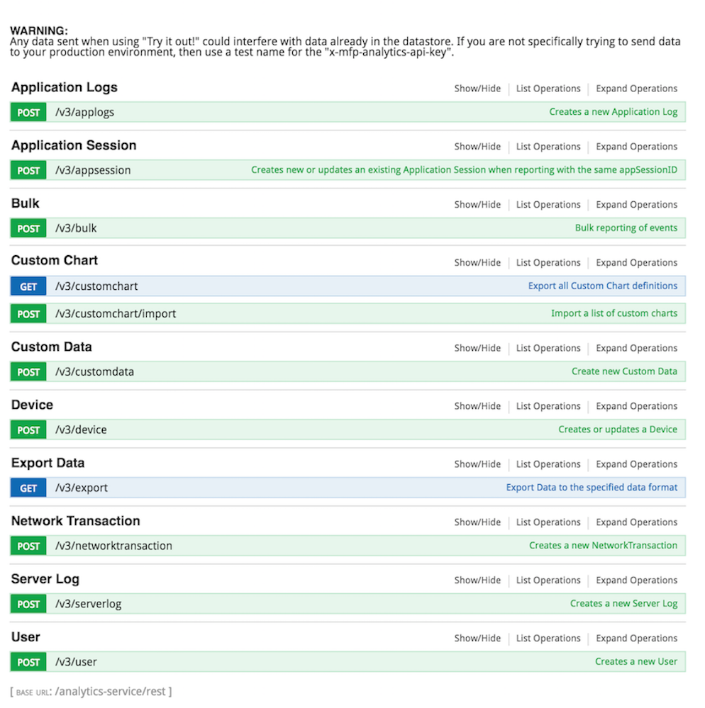
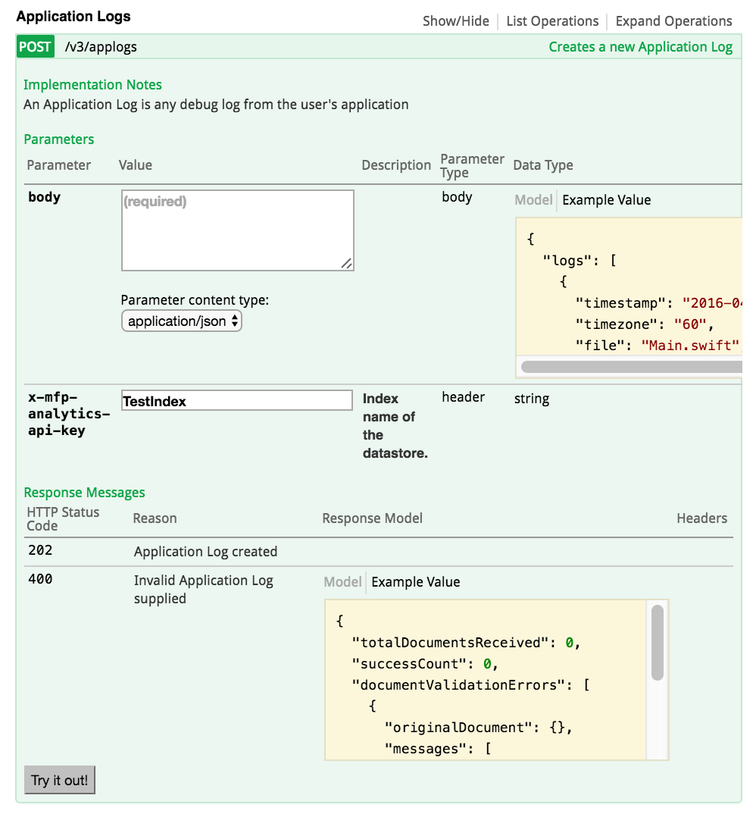

## Overview
MobileFirst Platform Foundation Operational Analytics provides REST APIs to help the developer with importing (POST) and exporting (GET) analytics data.

## Jump to:
* [Analytics REST API](#analytics-rest-api)
* [Try It Out on Swagger Docs](#try-it-out-on-swagger-docs)

## Analytics REST API
To use the analytics REST API.

**Base URL**

`/analytics-service/rest`

**Example**

`https://example.com:9080/analytics-service/v3/applogs`

REST API Method | Endpoint | Description
--- | --- | ---
Application Logs (POST) | /v3/applogs | Create a new application log.
Application Session (POST) | /v3/appsession | Creates new or updates an existing application session when reporting with the same appSessionID.
Bulk (POST) | /v3/bulk | Bulk reporting of events.
Custom Chart (GET)| /v3/customchart | Export all custom chart definitions.
Custom Chart (POST) | /v3/customchart/import | Import a list of custom charts.
Custom Data (POST) | /v3/customdata | Create new custom data.
Device (POST) | /v3/device | Creates or updates a device.
Export Data (GET) | /v3/export | Export data to the specified data format.
Network Transaction (POST) | /v3/networktransaction |  Create a new network transaction.
Server Log (POST) | /v3/serverlog | Creates a new server log.
User (POST) | /v3/user | Creates a new user.

> For more information about the analytics REST API, see the topic about analytics in the user documentation.

## Try it out on Swagger Docs
Try out the analytics REST API on Swagger Docs included with the analytics console.
It is already bundled with your analytics console at:

URL: `<ipaddress>:<port>/analytics-service`

Default: `localhost:9080/analytics-service/`

By clicking `Expand Operations` you are able to see the implementation notes, parameters, and response messages for each method.

> Warning: Any data sent when using "Try it out!" could interfere with data already in the datastore. If you are not specifically trying to send data to your production environment, then use a test name for the "x-mfp-analytics-api-key".
