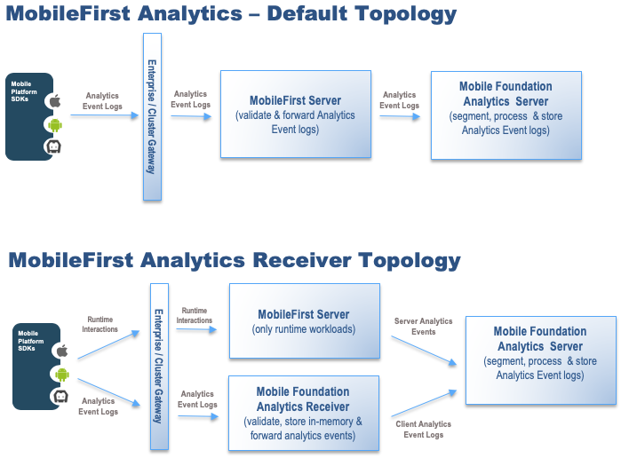

<!-- NLS_CHARSET=UTF-8 -->
## Overview
{: #overview }

The {{ site.data.keys.mf_analytics_receiver_short }} is an optional service that can be set up to receive event logs from mobile applications and forward them to {{ site.data.keys.mf_analytics_short }} in a phased manner using an in-memory event queue. {{ site.data.keys.mf_analytics_receiver_short }} maintains an in-memory event queue to store the logs before sending them to {{ site.data.keys.mf_analytics }}.

The default setup and configuration for mobile Analytics is that the {{ site.data.keys.mf_server }} receives all mobile client event logs and forwards them to the {{ site.data.keys.mf_analytics }}. When there are a large number of devices, high usage of the mobile client applications, and substantial analytics data logged and sent from client applications the performance of {{ site.data.keys.mf_server }} could be impacted. Enabling the {{ site.data.keys.mf_analytics_receiver_short }} will take away the burden of analytics events processing from the {{ site.data.keys.mf_server }}, thereby allowing {{ site.data.keys.mf_server }} resources to be fully utilized for runtime functions.

The {{ site.data.keys.mf_analytics_receiver_short }} can be set up and configured anytime. Update the Mobile client applications with the latest Mobile Foundation client SDKs. There are no changes required to the application code. Update the {{ site.data.keys.mf_server }} JNDI properties with the {{ site.data.keys.mf_analytics_receiver_short }} configurations so that the {{ site.data.keys.mf_analytics_receiver_short }} endpoint is available to client applications for sending analytics events.

## {{ site.data.keys.mf_analytics_receiver_short }} configuration
{: #analytics-receiver-configuration }

The analytics receiver WAR file is included with the {{ site.data.keys.mf_server }} installation. For more information, see the distribution structure of the {{ site.data.keys.mf_server }}.

* For information about how to install the {{ site.data.keys.mf_analytics_receiver_server }}, see the [{{ site.data.keys.mf_analytics_receiver_server }} installation guide](../../installation-configuration/production/analyticsreceiver/installation).
* For more information about how to configure the IBM MobileFirst Analytics Receiver, see the [Configuration Guide](../../installation-configuration/production/analyticsreceiver/configuration).

* As a quick configuration check after installing {{ site.data.keys.mf_analytics_receiver_short }}, make sure that the following JNDI properties are pointing to {{ site.data.keys.mf_analytics }}.

  | Property                           | Description                                           | Default Value |
  |------------------------------------|-------------------------------------------------------|---------------|
  | receiver.analytics.url                  |Required. The URL that is exposed by the {{ site.data.keys.mf_analytics_server }} that receives incoming analytics data. For example, http://hostname:port/analytics-service/rest. | None |
  | receiver.analytics.username             | The user name that is used if the data entry point is protected with basic authentication. | None |
  | receiver.analytics.password             | The password that is used if the data entry point is protected with basic authentication. | None |
  | receiver.analytics.event.qsize          | Optional. Size of analytic event queue size. It should be added with caution by providing ample JVM heap size. Default queue size 10000.  | None |

* To enable receiver to be used as *loguploader* make sure the following JNDI properties are set in the {{ site.data.keys.mf_server }}. These JNDI properties should point to {{ site.data.keys.mf_analytics_receiver_server }}.

  | Property                           | Description                                           | Default Value |
  |------------------------------------|-------------------------------------------------------|---------------|
  | mfp.analytics.receiver.url                  |Required. The URL that is exposed by the {{ site.data.keys.mf_analytics_receiver_server }} that receives incoming analytics data. For example, http://hostname:port/analytics-receiver/rest. | None |
  | mfp.analytics.receiver.username             | The user name that is used if the data entry point is protected with basic. authentication. | None |
  | mfp.analytics.receiver.password             | The password that is used if the data entry point is protected with basic. authentication. | None |

* Make sure that the {{ site.data.keys.mf_analytics_short }} setup is not disturbed in the {{ site.data.keys.mf_server }} since server logs are still transmitted directly from {{ site.data.keys.mf_server }} to {{ site.data.keys.mf_analytics_server }} .

## Troubleshooting
{: #troubleshooting }

For information on troubleshooting {{ site.data.keys.mf_analytics_receiver }}, see [Analytics Receiver Troubleshooting](../../troubleshooting/analyticsreceiver/).
