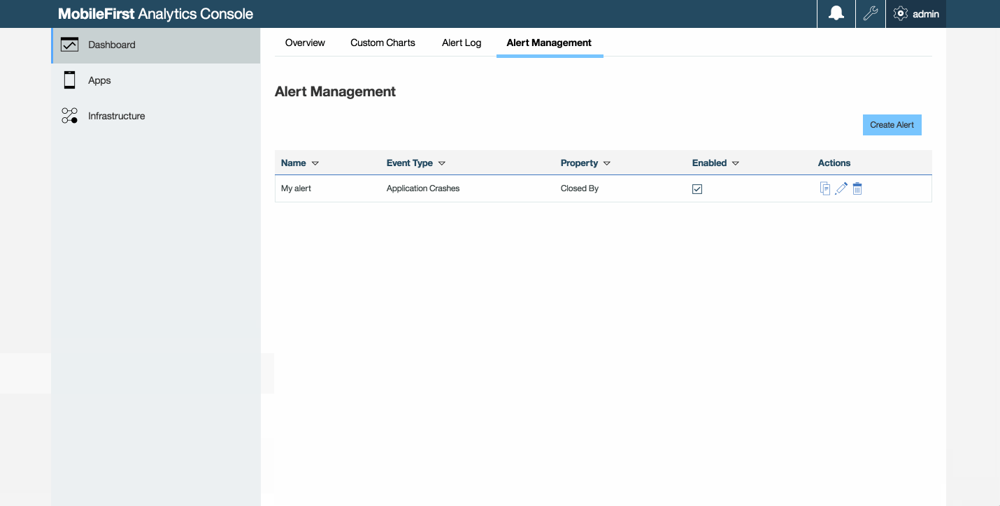
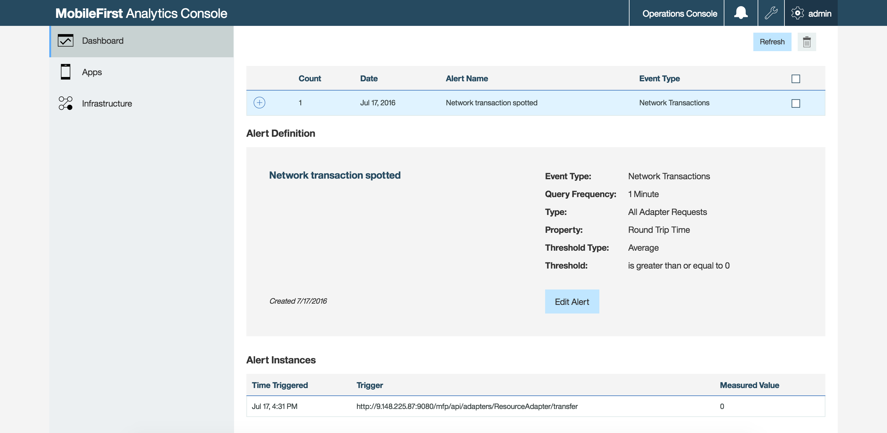

## Overview
Alerts provide a proactive means to monitor the health of your mobile apps without having to check the MobileFirst Analytics Console regularly.  
You can set reactive thresholds in the MobileFirst Analytics Console to trigger alerts when a specific criteria is met.

You can set thresholds at a broad level (a specific app) or at a granular level (a specific app instance or device). Alert notifications can be configured to display in the MobileFirst Analytics Console, and also be sent to a pre-configured REST endpoint or custom webhook.

**Prerequisite:** Ensure that the MobileFirst Analytics Server is started and ready to receive client logs.

## Creating an alert
In the MobileFirst Analytics Console:

1. Select the **Dashboard→Alert Management** tab. Click the **Create Alert** button. The **Alert Definition** tab appears.

1. Provide the following values: Alert Name, Message, Query Frequency, Event Type, Application Name, Application Version, Threshold Type and Operator.

2. Once all values are entered, click **Next**. The **Distribution Method** tab appears.

### Distribution Method tab
By default, the alert is displayed in the Analytics Console.

You can send a POST message with a JSON payload to both the Analytics Console and to a customized URL by selecting the **Analytics Console and Network Post** option.

The following fields are available if you choose this option:

* *required*. Network POST URL
* *optional*. Headers
* *required*. Authentication Type




## Custom web hook
You can set up a distribution method for an alert. For example: define a custom web hook to which a payload is sent to when an alert threshold is triggered.

Example payload:

```json
{
  "timestamp": 1442848504431,
  "condition": {"value":5.0,"operator":"GTE"},
  "value": "CRASH",
  "offenders": [
    { "XXX 1.0": 5.0 },
    { "XXX 2.0": 1.0 }
  ],
  "property":"closedBy",
  "eventType":"MfpAppSession",
  "title":" Crash Count Alert for Application ABC",
  "message": "The crash count for a application ABC exceeded XYZ.
    View the Crash Summary table in the Crashes tab in the Apps
    section of the MobileFirst Analytics Console
    to see a detailed stacktrace of this crash instance."
}
```

The POST request includes the following attributes:

* **timestamp** - the time at which the alert notification was created.
* **condition** - the threshold that was set by the user (for example, greater than or equals 5).
* **eventType** - the eventType that was queried.
* **property** - the property of the eventType that was queried.
* **value** - the value of the property that was queried.
* **offenders** - a list of apps or devices that triggered the alert.
* **title** - the user-defined title.
* **message** - the user-defined message.

## Viewing alert details
Alert details can be viewed from the **Dashboard→Alert Log** tab in the MobileFirst Operational Analytics console.


Click the **+** icon for any of the available incoming alerts. This action displays the **Alert Definition** and **Alert Instances** sections. The following image shows the Alert Definition and Alert Instances sections:


