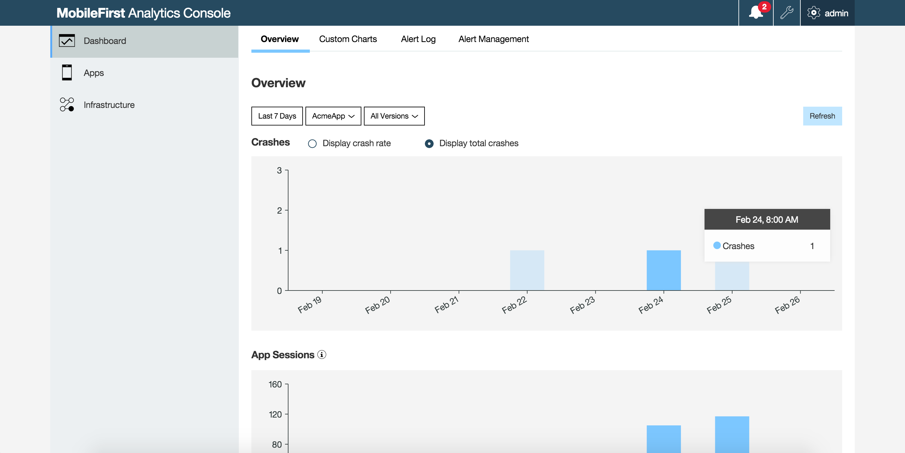
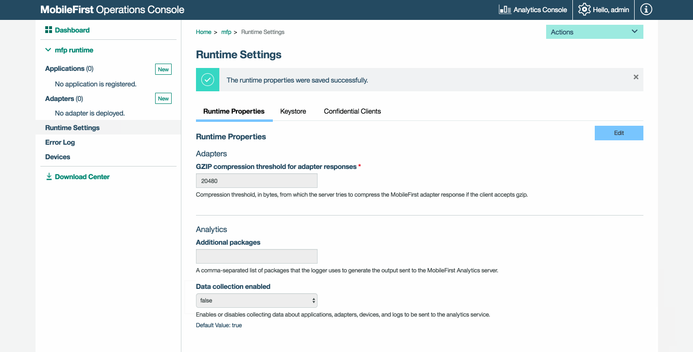

<!-- NLS_CHARSET=UTF-8 -->

## Overview
Configure the way the client works with the {{ site.data.keys.mf_analytics_server }}, configure and view a wide range of reports using the Operations and Analytics Consoles.

## {{ site.data.keys.mf_analytics_console_full }}
From the {{ site.data.keys.mf_analytics_console }}, view and configure the Analytics reports. Manage alerts and view client logs.

You can open the {{ site.data.keys.mf_analytics_console_short }} from the {{ site.data.keys.mf_console }} by clicking the  **Analytics Console**  link in the top-right navigation bar.

After navigating to the {{ site.data.keys.mf_analytics_console_short }}, the default **Dashboard** panel appears. If a client application has already sent logs and analytics data to the server, the relevant reports are populated. The **Apps** and **Infrastructure** can be chosen from the navigation bar.

### Dashboard
In the **Dashboard** panel, you can review collected analytics data related to: application crashes, application sessions, and server processing time. Additionally you can create custom charts as well as manage alerts.

### Apps
In the **Apps** panel, you can review in-depth analytics data related to: usage and devices (such as total device and app sessions, active users, app usage, new devices, model usage and operating system), as well as crash-related data. Search through client logs for specific apps and devices (**Apps → Client Log Search**).

### Infrastructure
In the **Infrastructure** panel you can review analytics data related to: session processing time, average request size, server requests, network requests, adapters response time, procedure response time, and size and adapters usage, as well as push notifications data such as notification requests and per mediator. You can also search through server logs.

> Learn more in the [Analytics Workflows](../workflows/) tutorial.

## Analytics features

### App Analytics
From the **Apps → Usage and Devices** tab, you can view App Session charts and App Usage charts to find out which app is being used most frequently by your users.

### Built-in Analytics
When you use the {{ site.data.keys.product_adj }} client SDK together with the {{ site.data.keys.mf_server }}, analytics data automatically gets collected for any request that your app makes to the {{ site.data.keys.mf_server }}. From **Dashboard → Overview** view basic device metadata that gets collected and reported to the {{ site.data.keys.mf_analytics_server }}.

### Custom Analytics
You can have your app send custom data and create custom charts for your custom data.

> Learn how to send custom analytics in the [Analytics API](../analytics-api/) tutorial.

### Custom charts
Custom charts allow you to visualize the collected analytics data in your analytics data store as charts that are not available by default in the {{ site.data.keys.mf_analytics_console_short }} (**Dashboard → Custom Charts**). This visualization feature is a powerful way to analyze business-critical data.

> Learn how to create custom charts in the [Creating Custom Charts](custom-charts/) tutorial.

### Manage alerts
Alerts provide a proactive means to monitor the health of your mobile apps without having to check the {{ site.data.keys.mf_analytics_console }} regularly.

From the **Dashboard → Alert Management** tab, you can configure thresholds which, if exceeded, trigger alerts to notify administrators. You can visualize the triggered alerts on the console or handle them by using a custom web hook. A custom web hook allows you to control who is notified when an alert is triggered, and how.

> Learn how to manage alerts in the [Manage Alerts](alerts/) tutorial.

### Monitor app crashes
App crashes are visualized on the {{ site.data.keys.mf_analytics_console_short }} (**Apps → Crashes**), where you can quickly view crashes and act on them accordingly. Crash logs are collected on the device by default and sent to the server once the application is running again. When crash logs are sent to the analytics server, they automatically populate the crash charts.

### Monitor server and network data
The {{ site.data.keys.mf_analytics_console_short }} monitors network data when it is sent to the Analytics Server, and allows the user to query this information in different ways (**Infrastructure → Servers and Networks**).

### Collect, search, and report on client logs
Client logs can be sent to the server and included in analytics reports.

To include logging information in a report:

1. From the {{ site.data.keys.mf_analytics_console_short }}, choose the **Dashboard → Custom Charts** tab.

2. Choose **Client Logs** from the **Event Type** pull-down menu.

For more information on **Custom Charts**, see [Creating Custom Charts](custom-charts/).

Logging data can be filtered. Log filters can be configured and saved on the Analytics Server, and then retrieved by client applications.

For information on configuring log filters, see [Client log searches](log-filters/) tutorial.

For more information on sending logs from the client, see [Client log collection](../../application-development/client-side-log-collection/).

## {{ site.data.keys.mf_console_full }}
Configure and administer the Analytics Server with the {{ site.data.keys.mf_console }}.

If you are in the {{ site.data.keys.mf_analytics_console_short }}, access the {{ site.data.keys.mf_console }} by clicking the **Operations Console** button in the top navigation bar.

### Collect analytics data from additional logger packages
By default, only logging from the package `com.worklight` is sent to analytics. In order to add logging from additional packages see [Forwarding logs to the Analytics Server](../../adapters/server-side-log-collection/java-adapter/#forwarding-logs-to-the-analytics-server).

### Enable/disable Analytics support
The collection of data for analysis by the Analytics server is enabled by default. You can disable it, for example to save processing time.

1. In the navigation sidebar, click on **Runtime settings**. To avoid inadvertent changes, runtime properties are displayed in read-only mode.
2. To make the settings editable, click the **Edit** button. If you logged in with a role other than *administrator* or *deployer*, the **Edit** button is not visible because you are not allowed to modify runtime properties.
3. From the **Data collection enabled** drop-down menu, select **false** to disable data collection.
4. Click **Save**.
5. Click the **Read Only** button to lock the properties again.

### Role-based access control
Content in the {{ site.data.keys.mf_analytics_console_short }} is restricted by predefined security roles.  
The {{ site.data.keys.mf_analytics_console_short }} displays different content based on the security role of the logged-in user. The following table shows the security roles and their access to the {{ site.data.keys.mf_analytics_console_short }}.

| Role           | Role name                | Viewing Access                                                     | Editing Access  |
|----------------|--------------------------|--------------------------------------------------------------------|-----------------|
| Administrator  | analytics_administrator  | Everything.	                                                     | Everything.     |
| Infrastructure | analytics_infrastructure	| Everything.	                                                     | Everything.     |
| Developer      | analytics_developer	    | Everything except for the Administration pages.		             | Everything.     |
| Support        | analytics_support        | Everything except for the Administration pages.		             | Everything.     |
| Business       | analytics_business       | Everything except for the Administration and Infrastructure pages. | Everything.     |

> For information on setting up roles, see [Configuring user authentication for {{ site.data.keys.mf_server }} administration](../../installation-configuration/production/server-configuration#configuring-user-authentication-for-mobilefirst-server-administration).

## Related blog posts
* [More on Instrumenting Custom Analytics]({{site.baseurl}}/blog/2016/01/22/howto-custom-in-app-behavior-analytics/)
* [More on Instrumenting Webhooks]({{site.baseurl}}/blog/2015/10/19/using-mfp-adapters-endpoint-analytics-alerts-webhooks/)
