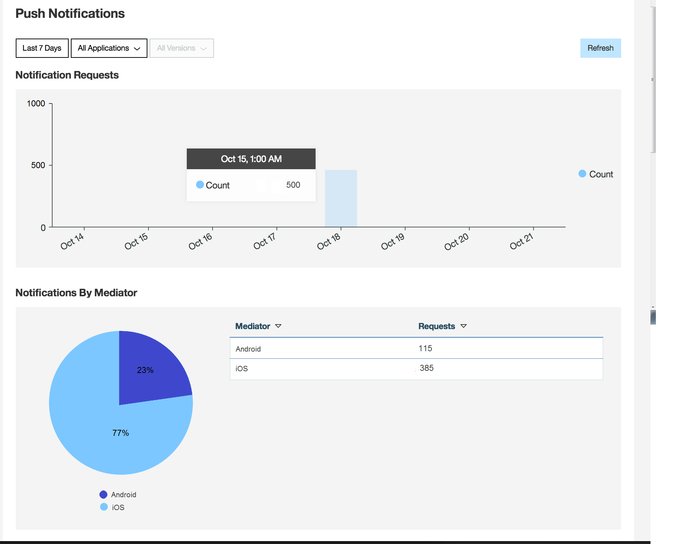

<!-- NLS_CHARSET=UTF-8 -->
## Overview
{: #overview }

Once {{ site.data.keys.mf_analytics }} support is set up for Push Notifications  (see [Setting Up Analytics Support](../../../notifications/analytics/)), you can create reports about Push usage.

## Push reports
{: #push-reports }

Push Notifications reports become available after {{ site.data.keys.mf_analytics_short }} support is configured, and Push events are sent to the {{ site.data.keys.mf_analytics_short }} service.

1. In the {{ site.data.keys.mf_analytics_console }}, choose the **Infrastructure** section from the navigation bar.
2. Choose the **Push Notifications** tab.

Two reports types are displayed:

**Notification Requests**  
The number of requests is displayed according to the requested period, applications, and versions, broken down by date.

**Notification by Mediator**  
The number of requests is broken down by app platform, for the requested period, applications, and versions.

