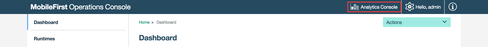
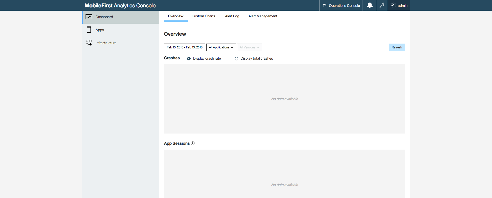

## Overview
MobileFirst Platform Foundation Operational Analytics collects data about applications, adapters, devices, logs, and your own custom events to give a high-level view of the client interaction with the IBM MobileFirst Platform Server.

Operational Analytics is bundled by default as part of the [MobileFirst Platform Foundation Development Kit](../setting-up-your-development-environment/mobilefirst-development-environment).  

#### Jump to

* [MobileFirst Analytics Console](#mobilefirst-analytics-console)
* [Elasticsearch](#elasticsearch)
* [Tutorials to follow next](#tutorials-to-follow-next)

## MobileFirst Analytics Console
You can open the Analytics Console from the MobileFirst Operations Console.



From the Analytics Console you can then:

* Create custom charts
* Manage alerts
* Monitor App Crash
* Monitor App Usage
* Monitor Network Data
* And a lot more!




### Custom Charts
Custom charts allows you to visualize the collected analytics data in your analytics data store in charts that are not avaliable in the out of the box MobileFirst Analytics Console. This visualization is a powerful way to inspect data for specific use cases. You can create charts with data already collected by Operational Analytics in addition to custom data you report.

> For more information about creating custom charts, see the user documentation

### Manage Alerts
You can set thresholds in alert definitions to better monitor your activities.

You can configure thresholds which, if exceeded, trigger alerts to notify the MobileFirst Analytics Console monitor. The triggered alerts can be visualized on the console, or the alerts can be handled by a custom webhook. This feature provides a proactive means of detecting client log errors, server log errors, extended periods of network latency, and authentication failures. Reactive thresholds and alerts keep you from having to sift through your data and set thresholds at a wide spectrum of granularity.

> For more information about creating custom charts, see the user documentation

### Monitor App Crash
App crashes are visualized on the MobileFirst Operational Analytics Console, where you can quickly view crashes and act on them accordingly.

## Elasticsearch
Behind the scenes, running search queries and storing data for Operational Analytics is **Elasticsearch 1.5x**.  
Elasticsearch is a real-time distributed search and analytics engine that provides the ability to explore data at speed and at a scale. Elasticsearch is used for full-text search, structured search.

Elasticsearch is used for storing all mobile and server data in JSON format in the Operational Analytics server in Elasticsearch instances.  
The Elasticsearch instances are queried in real-time in order to populate the MobileFirst Operational Analytics Console.

MobileFirst Operational Analytics does not hide any Elasticsearch functionality. If knowledge how to fully utilize Elasticsearch, debug Elasticsearch, or optimize Elasticsearch instances is present, Operational Analytics does not prevent using it.

If you have interest in any Elasticsearch functionality besides what we are doing for you out of the box, you can read more about it in the Elasticsearch documentation.

> Read more in the [Elasticsearch documentation](https://www.elastic.co/guide/en/elasticsearch/reference/1.5/index.html)

### Elasticsearch properties
Elasticsearch properties are available through JNDI variables or environment entries.  
One of the more useful JNDI properties to get started viewing the Elasticsearch data is:

 ```xml
<jndiEntry jndiName="analytics/http.enabled" value="true"/>
 ```

 This JNDI property will allow you to view your Operational Analytics raw data in JSON format and allow you to access your Elasticsearch instance through the port defined by Elasticsearch (default port 9500).

> **Note**: This is not secure and should not be enabled on a production environment.

**Viewing data**  
You can view all your data by visiting the tenant's search REST endpoint.  
Being able to access an Elasticsearch instance provides the ability to run custom queries and view more detailed information about the Elasticsearch cluster.

```
http://localhost:9500/*/_search
```

**View cluster health**

```
http://localhost:9500/_cluster/health
```

**View information on current nodes**

```
http://localhost:9500/_nodes
```

**View the current mappings**

```
http://localhost:9500/*/_mapping
```

> Elasticsearch exposes many more REST endpoints. To learn more, visit the Elasticsearch documentation.

## Tutorials to follow next
