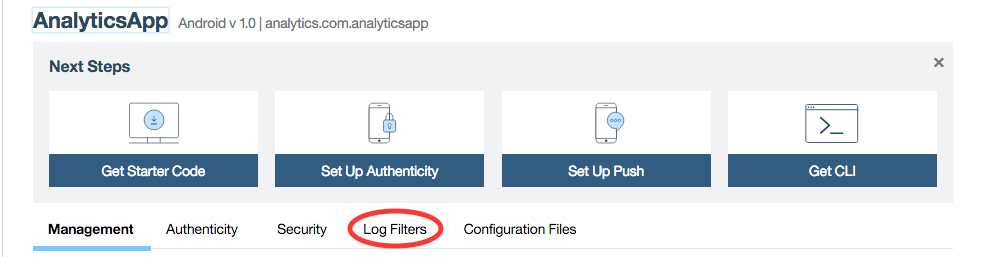
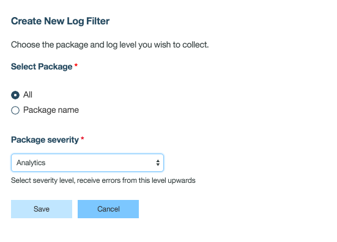

## Overview
Logging is the instrumentation of source code that uses API calls to record messages in order to facilitate diagnostics and debugging.  
Logging libraries typically have verbosity controls, that are frequently called **levels**. From least to most verbose: ERROR, WARN, INFO, LOG and DEBUG.

overview needs updating

## Log capture
Log capture is the ability to persistently record messages that are passed to the logging API.
persist them where? how? in the analytics server? mention this...

The logging level can be controlled by code with API calls that are specific to the platform:

* [Logging in Cordova applications](../cordova/)
* [Logging in iOS applications](../ios/)
* [Logging in Android applications](../android/)

### Admin control of client log capture
To configure log capture preferences for applications in production, use the MobileFirst Operations Console. Administrators can control the MobileFirst client SDK log capture and levels from the MobileFirst Operations Console.

Through `Log Filters` you are able to create a filter level that you can log at.

### Crash capture
The MobileFirst client SDK, on Android and iOS, captures a stack trace upon application crash and logs it at FATAL level. This type of crash is a true crash where the UI disappears from the user's view.

The MobileFirst client SDK, in JavaScript, captures JavaScript global errors and if possible, a JavaScript call stack, and logs it at FATAL level. This type of crash is not a crash event, and might or might not have any adverse consequences to the user experience at run time.

Crash, uncaught exceptions, and global errors are caught and logged automatically.

## For more information
> For more information about logging and log capture, see the user documentation.
