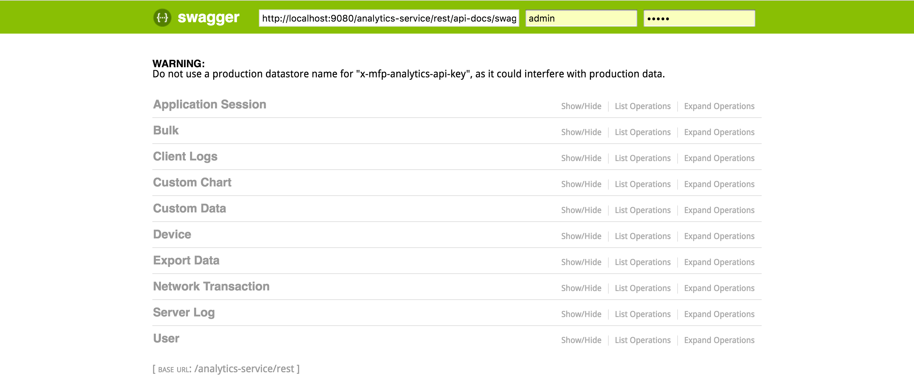

<br/>
> <span class="glyphicon glyphicon glyphicon-fire" aria-hidden="true"></span> **Note:** This page is under construction. [Click for the existing API Reference](https://www.ibm.com/support/knowledgecenter/SSHS8R_8.0.0/com.ibm.worklight.apiref.doc/topics/r_apiref.html).

The MobileFirst Analytics public REST API is documented in Swagger.  
To view and interact with Swagger, deploy the analytics-service.war file and go to the context root in your browser:

```bash
[protocol]://[host]:[port]/analytics-service/
```

Replace **protocol**, **host** and **port** with your server's values.  
For example, for a local MobileFirst Server installation [via the Developer Kit]({{site.baseurl}}/tutorials/en/foundation/8.0/setting-up-your-development-environment/mobilefirst-development-environment/), typically these will be: [http://localhost:9080/analytics-service](http://localhost:9080/analytics-service).

