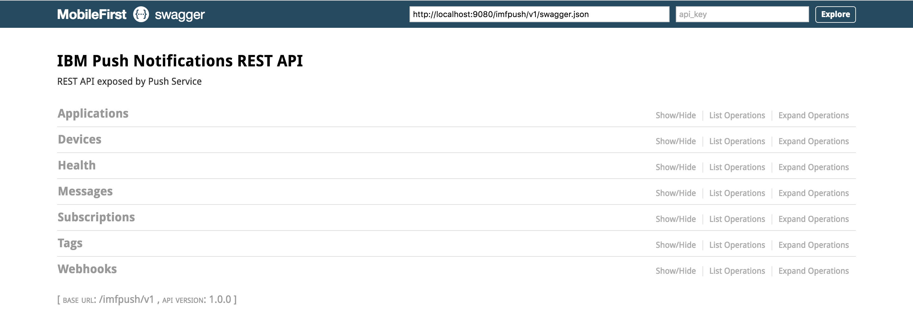

## Overview
The REST API for the Push service in the MobileFirst runtime environment enables back-end server applications that were deployed outside of the MobileFirst Server to access Push functions from a REST API endpoint.

The Push service on the MobileFirst Server is exposed over a REST API endpoint that can be directly accessed by non-mobile clients. You can use the REST API runtime services for Push for registrations, subscriptions, messages, and retrieving tags. Paging and filtering is supported for database persistence in both Cloudant and SQL.

These REST API endpoints are protected by OAuth which requires the clients [to be confidential clients](../../authentication-and-security/confidential-clients/) and also possess the required scope(s) in their OAuth access tokens that is passed by a designated HTTP header.

#### Jump to
* [Swagger UI](#swagger-ui)
* [REST Endpoints](#rest-endpoints)

### Swagger UI
The REST endpoints below are also accessible from a Swagger UI in the development environment provided by the [DevKit Installer](../../setting-up-your-development-environment/mobilefirst-development-environment). To access it, load the following URL: [http://localhost:9080/doc/?url=/imfpush/v1/swagger.json](http://localhost:9080/doc/?url=/imfpush/v1/swagger.json).

### REST Endpoints
