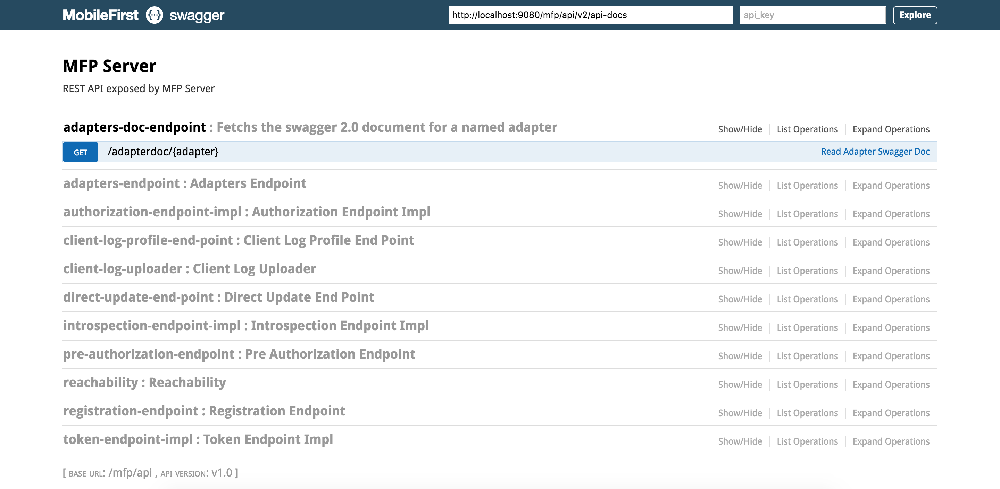

## Overview
The REST API for the Runtime service provides several services for mobile clients and confidential clients to call adapters, obtain access tokens, get Direct Update content, and more.

#### Jump to
* [Swagger UI](#swagger-ui)
* [REST Endpoints](#rest-endpoints)

### Swagger UI
The REST endpoints below are also accessible from a Swagger UI. To access it, load the following URL: [http://localhost:9080/doc/](http://localhost:9080/doc/).

### REST Endpoints
