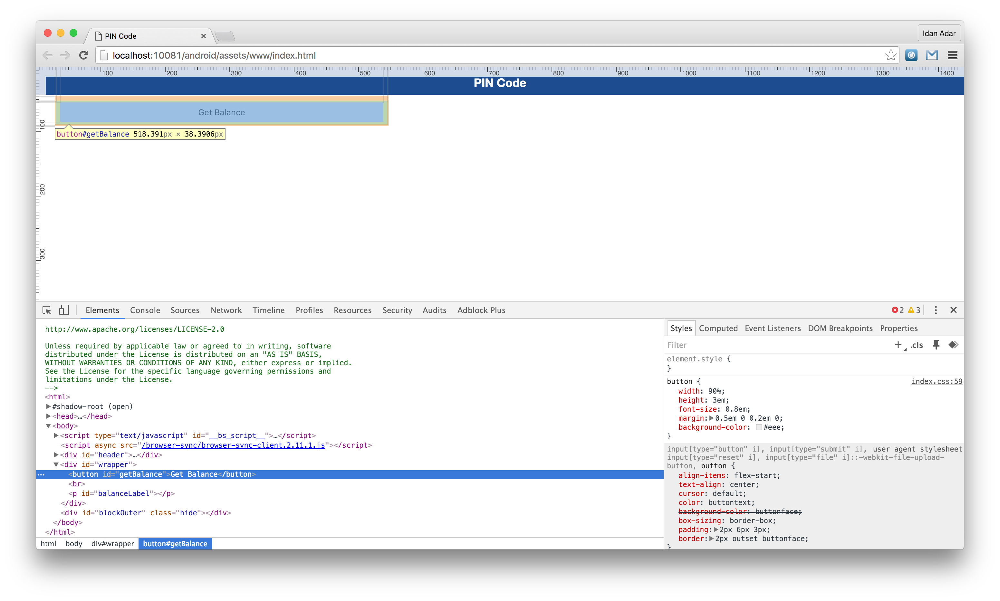

## Overview
Debugging is a process that consists of finding the cause of defects in applicative code and application user interface.

* JavaScript (Cordova, Web) applications consist of web-based resources such as HTML, JavaScript &amp; CSS. Cordova application may also contain optional native code (written in Java, Objective-C, Swift, C#, ...).
* Native code can be debugged by using standard tools that are provided by the platform SDK, such as XCode, Android, or Microsoft Visual Studio.

This tutorial explores various approaches to debugging a JavaScript-based application, whether running locally via an Emulator, Simulator, physica device or in a web browser.

> Learn more about Cordova debugging and testing in the Cordova website: [Debugging applications](https://cordova.apache.org/docs/en/latest/guide/next/index.html#link-testing-on-a-simulator-vs-on-a-real-device).

#### Jump to:

* [Debugging with the IBM Mobile Browser Simulator](#debugging-with-the-ibm-mobile-browser-simulator)
* [Debugging with Ripple](#debugging-with-ripple)
* [Debugging with iOS Remote Web Inspector](#debugging-with-ios-remote-web-inspector)
* [Debugging with Chrome Remote Web Inspector](#debugging-with-chrome-remote-web-inspector)
* [Debugging with IBM MobileFirst Logger](#debugging-with-ibm-mobilefirst-logger)
* [Debugging with WireShark](#debugging-with-wireshark)

## Debugging with the IBM Mobile Browser Simulator
You can use IBM MobileFirst Foundation's Mobile Browser Simulator (MBS) to preview and debug MobileFirst applications.  
To use the MBS, open a **Command-line** window and run the command:

```bash
mfpdev app preview
```

If your application consists of more than one platform - specify the platform to preview:

```bash
mfpdev app preview -p <platform>
```

> <span class="glyphicon glyphicon-exclamation-sign" aria-hidden="true"></span> **Important:** The preview feature has several known limitations. Your application may not behave as expected during preview. For example, it bypasses security features using a confidential client, so challenge handlers are not triggered. 

### Mobile Browser Simulator


### Simple Preview



> Learn more about the MobileFirst CLI in the [Using MobileFirst CLI to manage MobileFirst artifacts](../using-mobilefirst-cli-to-manage-mobilefirst-artifacts) tutorial.

## Debugging with Ripple
Apache Ripple™ is a web based mobile environment simulator for debugging mobile web applications.  
It lets you run a Cordova application in your browser and fake various Cordova features. For example, it can fake the camera API by letting you select a picture locally from your computer.  

### Installing Ripple

1. Download and install the latest version of [Node.js](https://nodejs.org/en/).
You can verify Node.js installation by typing `npm -v` in terminal.
2. Open terminal and type:

   ```bash
   npm install -g ripple-emulator
   ```

### Running application using Ripple
After Ripple is installed open terminal from your Cordova project location and type:

```bash
ripple emulate
```


> More information about Apache Ripple™ can be found on the [Apache Ripple page](http://ripple.incubator.apache.org/) or [npm ripple-emulator page](https://www.npmjs.com/package/ripple-emulator).

## Debugging with iOS Remote Web Inspector
Starting iOS 6, Apple introduced a remote [Web Inspector](https://developer.apple.com/safari/tools/) for debugging web applications on iOS devices. To debug, make sure that the device (or iOS Simulator) has the **Private Browsing** option turned off.  

1. To enable Web Inspector on the device, Tap **Settings > Safari > Advanced > Web Inspector**.
2. To start debugging, connect the iOS device to a Mac, or start the simulator.
3. In Safari, go to **Preferences > Advanced**, and select the **Show Develop menu in menu bar** checkbox.
4. In Safari, select **Develop > [your device ID] > [your application HTML file]**.


## Debugging with Chrome Remote Web Inspector
Using Google Chrome it is possible to remotely inspect web applications on Android devices or the Android Emulator.  
This action requires Android 4.4 or later, Chrome 32 or later. Additionally, in the `AndroidManifest.xml` file, `targetSdkVersion = 19` or above is required. In the `project.properties` file, `target = 19` or above is required.

1. Start the application in the Android Emulator or a connected device.
2. In Chrome, enter the following URL in the address bar: `chrome://inspect`.
3. Press **Inspect** for the relevant application.


### Debugging with IBM MobileFirst Logger
IBM MobileFirst Foundation provides a `WL.Logger` object that can be used to print log messages.  
`WL.Logger` contains several levels of logging: `WL.Logger.info`, `WL.Logger.debug`, `WL.Logger.error`.

> For more information, see the documentation for `WL.Logger` in the API reference part of the user documentation.

**Inspecting the log:**

* **Developer console** when previewing a platform using a Simulator or Emulator.
* **LogCat** when it is running on Android device
* **XCode Console** when it is running on an iOS device
* **Visual Studio Output** when it is running on a Windows devices.

### Debugging with WireShark
**Wireshark is a network protocol analyzer** that can be used to see what happens in the network.  
You can use filters to follow only what is required.  

> For more information, see the [WireShark](http://www.wireshark.org) website.


