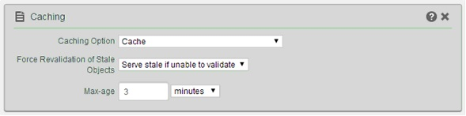

## Overview
{: #overview }
You can configure Direct Update requests to be served from a CDN (content delivery network) instead of from the {{ site.data.keys.mf_server }}.

#### Advantages of using a CDN
{: #advantages-of-using-a-cdn }
Using a CDN instead of the {{ site.data.keys.mf_server }} to serve Direct Update requests has the following advantages:

* Removes network overheads from the {{ site.data.keys.mf_server }}.
* Increases transfer rates higher than the 250 MB/second limit when serving requests from a {{ site.data.keys.mf_server }}.
* Ensures a more uniform Direct Update experience for all users regardless of their geographical location.

#### General requirements
{: #general-requirements }
To serve Direct Update requests from a CDN, ensure that your configuration conforms to the following conditions:

* The CDN must be a reverse proxy in front of the {{ site.data.keys.mf_server }} (or in front of another reverse proxy if needed).
* When building the application from your development environment, set up your target server to the CDN host and port instead of the host and port of the {{ site.data.keys.mf_server }}. For example, when running the {{ site.data.keys.mf_cli }} command mfpdev server add, provide the CDN host and port.
* In the CDN administration panel, you need to mark the following Direct Update URLs for caching to ensure that the CDN passes all requests to the {{ site.data.keys.mf_server }} except for the Direct Update requests. For Direct Update requests, the CDN determines whether it obtained the content. If it has, it returns it without going to the {{ site.data.keys.mf_server }}; if not, it goes to the {{ site.data.keys.mf_server }}, gets the Direct Update archive (.zip file), and stores it for the next requests for that specific URL. For applications that are built with v8.0 of {{ site.data.keys.product_full }}, the Direct Update URL is: `PROTOCOL://DOMAIN:PORT/CONTEXT_PATH/api/directupdate/VERSION/CHECKSUM/TYPE`.
The `PROTOCOL://DOMAIN:PORT/CONTEXT_PATH` prefix is constant for all runtime requests. For example: http://my.cdn.com:9080/mfp/api/directupdate/0.0.1/742914155/full?appId=com.ibm.DirectUpdateTestApp&clientPlatform=android

In the example, there are additional request parameters that are also part of the request.

* The CDN must allow caching of the request parameters. Two different Direct Update archives might differ only by the request parameters.
* The CDN must support TTL on the Direct Update response. The support is needed to support multiple direct updates for the same version.
* The CDN must not change or remove the HTTP headers that are used in the server-client protocol.

## Example configuration
{: #example-configuration }
This example is based on using an Akamai CDN configuration that caches the Direct Update archive. The following tasks are completed by the network administrator, the {{ site.data.keys.product_adj }} administrator, and the Akamai administrator:

#### Network administrator
{: #network-administrator }
Create another domain in the DNS for your {{ site.data.keys.mf_server }}. For example, if your server domain is yourcompany.com you need to create an additional domain such as `cdn.yourcompany.com`.
In the DNS for the new `cdn.yourcompany.com` domain, set a `CNAME` to the domain name that is provided by Akamai. For example, `yourcompany.com.akamai.net`.

#### {{ site.data.keys.product_adj }} administrator
{: #mobilefirst-administrator }
Set the new cdn.yourcompany.com domain as the {{ site.data.keys.mf_server }} URL for the {{ site.data.keys.product_adj }} applications. For example, for the Ant builder task, the property is: `<property name="wl.server" value="http://cdn.yourcompany.com/${contextPath}/"/>`.

#### Akamai administrator
{: #akamai-administrator }
1. Open the Akamai property manager and set the property **host name** to the value of the new domain.

    
    
2. On the Default Rule tab, configure the original {{ site.data.keys.mf_server }} host and port, and set the **Custom Forward Host Header** value to the newly created domain.

    
    
3. From the **Caching Option** list, select **No Store**.

    

4. From the **Static Content configuration** tab, configure the matching criteria according to the Direct Update URL of the application. For example, create a condition that states `If Path matches one of direct_update_URL`.

    
    
5. Set values similar to the following values to configure the caching behavior to make cache the Direct Update URL and to set TTL.

    | Field | Value |
    |-------|-------|
    | Caching Option | Cache |
    | Force Revaluation of Stale Objects | Serve stale if unable to validate |
    | Max-Age | 3 minutes |

    

6. Configure the cache key behavior to use all request parameters in the cache key (you must do so to cache different Direct Update archives for different applications or versions). For example, from the **Behavior** list, select `Include all parameters (preserve order from request)`.

    

