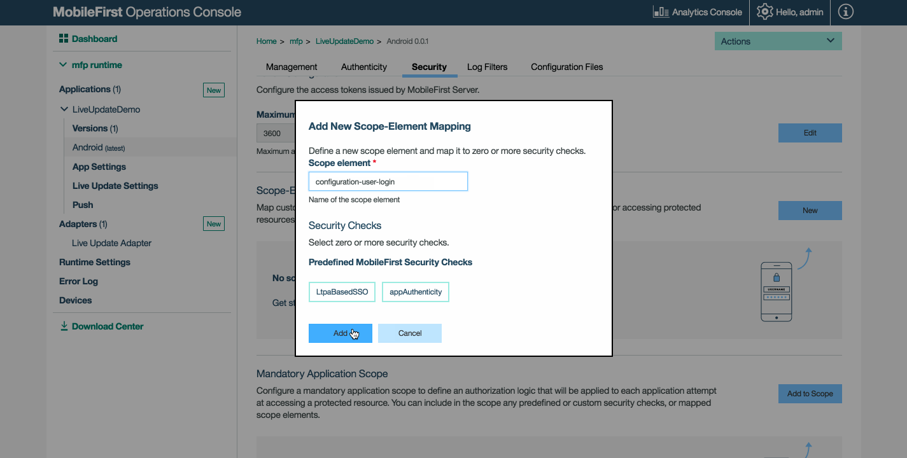

<!-- NLS_CHARSET=UTF-8 -->
## Overview
User segmentation is the practice of dividing users into groups that reflect similarity among users in each group. A common example is [geographic segmentation](https://en.wikipedia.org/wiki/Market_segmentation#Geographic_segmentation), that is, dividing users on a geographical basis. The goal of segmenting users is to decide how to relate to them in each segment in order to maximize value.

The Live Update feature in MobileFirst Foundation provides a simple way to define and serve different configurations for each segment of users of an application. It includes a component in the MobileFirst Operations Console for defining the structure of the configuration as well as the values of the configuration for each segment. Also provided is  a client SDK (available for Android and iOS **native** applications) for consuming the configuration.

#### Common Use Cases
Live Update supports defining and consuming segment-based configurations, making it easy to make segment-based customizations to the application. Common use cases can be:

* Release trains and feature flipping
* A/B testing
* Context-based customization of the application (e.g. geographic segmentation)

#### Demonstration
The following video provides a demonstration of the Live Update feature.

<div class="sizer">
    <div class="embed-responsive embed-responsive-16by9">
        <iframe src="https://www.youtube.com/embed/TjbC9thSfmM"></iframe>
    </div>
</div>

#### Jump to:
* [Live Update Architecture](#live-update-architecture)
* [Adding Live Update to MobileFirst Server](#adding-live-update-to-mobilefirst-server)
* [Configuring Application Security](#configuring-application-security)
* [Schema and Segments](#schema-and-segments)
* [Adding Live Update SDK to Applications](#adding-live-update-sdk-to-applications)
* [Using the Live Update SDK](#using-the-live-update-sdk)
* [Advanced Topics](#advanced-topics)
* [Sample Application](#sample-application)


## Live Update Architecture
The following system components function together in order to provide the Live Update functionality.


* **Live Update adapter:** an adapter which provides:
 - Application schema and segments management
 - Serving configurations to applications
* **Segment Resolver adapter:** *Optional*. A custom adapter that is implemented by the developer. The adapter receives application context (such as device and user context, as well as custom parameters) and returns the ID of a segment that corresponds to the context.
* **Client-side SDK:** the Live Update SDK is used to retrieve and access configuration elements such as features and properties from the MobileFirst Server.
* **MobileFirst Operations Console:** used for configuring the Live Update adapter and settings.
* **Configuration Service:** *Internal*. Provides configuration management services for the Live Update adapter.

## Adding Live Update to MobileFirst Server
By default, Live Update Settings in the MobileFirst Operations Console is hidden. To enable, the provided Live Update adapter needs to be deployed.  

1. Open the MobileFirst Operations Console. From the sidebar navigation click on **Download Center → Tools** tab.
2. Download and deploy the Live Update adapter.

Once deployed, the **Live Update Settings** screen is then revealed for each registered application.


## Configuring Application Security
In order to allow integration with Live Update, a scope element is required. Without it, the adapter will reject requests from client applications.  

Load the MobileFirst Operations Console and click on **[your application] → Security tab → Scope-Elements Mapping**. Click **New** and enter the scope element **configuration-user-login**. Then, click **Add**.

You can also map the scope element to a security check in case you're using one in your application.

> [Learn more about the MobileFirst security framework](../../authentication-and-security/)



## Schema and Segments
Two tabs are available in the Live Update Settings screen:

#### Schema
A schema is where features and properties are defined.  

* Using "features" you can define configurable application features and set their default value.  
* Using "properties" you can define configurable application properties and set their default value.

#### Segments
Segments define unique application behaviors by customizing the default features and properties defined by the schema.

### Adding Schema and Segments
Before adding a schema and segments for an applicaiton, the developer or product management team need to reach a decision about several aspects:

* The set of **features** to utilize Live Update for as well as their default state
* The set of configurable string **properties** and their default value
* The market segments for the application

For each market segment it should be decided:

* What is the state of every feature, and how this state can change during the application lifetime
* What is the value of every property, and how this value can change during the application lifetime

<br/>
Once the parameters are decided upon, Schema features &amp; properties and Segments can be added.  
To add, click **New** and provide the requested values.

<div class="panel-group accordion" id="terminology" role="tablist" aria-multiselectable="false">
    <div class="panel panel-default">
        <div class="panel-heading" role="tab" id="schema">
            <h4 class="panel-title">
                <a class="preventScroll" role="button" data-toggle="collapse" data-parent="#terminology" data-target="#collapseSchema" aria-expanded="false" aria-controls="collapseSchema">Click to review schema terminology</a>
            </h4>
        </div>

        <div id="collapseSchema" class="panel-collapse collapse" role="tabpanel" aria-labelledby="schema">
            <div class="panel-body">
                <ul>
                    <li><b>Feature:</b> A feature determines if some part of the application functionality is enabled or disabled. When defining a feature in the schema of an application the following elements should be provided:
                        <ul>
                            <li><i>id</i> – A unique feature identifier. String, Non-editable.</li>
                            <li><i>name</i> - A descriptive name of the feature. String, Editable.</li>
                            <li><i>description</i> – A short description of the feature. String, Editable.</li>
                            <li><i>defaultValue</i> – The default value of the feature that will be served unless it was overridden inside the segment (see Segment below). Boolean, Editable.</li>
                        </ul>
                    </li>
                    <li><b>Property:</b> A property is a key:value entity that can be used to customize applications. When defining a property in the schema of an application the following elements should be provided:
                        <ul>
                            <li><i>id</i> – A unique property identifier. String, Non-editable.</li>
                            <li><i>name</i> - A descriptive name of a property. String, Editable.</li>
                            <li><i>description</i> – A short description of the property. String, Editable.</li>
                            <li><i>defaultValue</i> - The default value of the property that will be served unless it was overridden inside the segment (see Segment below). String, Editable.</li>
                        </ul>
                    </li>
                </ul>
            </div>
        </div>
    </div>

    <div class="panel panel-default">
        <div class="panel-heading" role="tab" id="segment">
            <h4 class="panel-title">
                <a class="preventScroll" role="button" data-toggle="collapse" data-parent="#terminology" data-target="#collapseSegment" aria-expanded="false" aria-controls="collapseSegment">Click to review segment terminology</a>
            </h4>
        </div>

        <div id="collapseSegment" class="panel-collapse collapse" role="tabpanel" aria-labelledby="segment">
            <div class="panel-body">
                <ul>
                    <li><b>Segment:</b> A segment is an entity that corresponds to a market segment. It contains the features and properties that were defined in the schema and potentially overriding values. When defining a Segment the  following elements should be provided:
                        <ul>
                            <li><i>id</i> - A unique segment identifier. String, Non-editable.</li>
                            <li><i>name</i> - A descriptive name of segment. String, Editable.</li>
                            <li><i>description</i> – A short description of segment. String, Editable.</li>
                            <li><i>Features</i>  - A the list of features as defined in the schema, the user can set a static value to a feature which is detached from the schema default.</li>
                            <li><i>Properties</i> - the list of properties as defined in the schema, the user can set a static value to a property which is detached from the schema default.</li>
                        </ul>
                    </li>
                </ul>

                <blockquote><b>Note:</b><br/>
                    <ul>
                        <li>When a feature or property is added to a schema, a corresponding feature or property is automatically added to all segments of an application (with the default value)</li>
                        <li>When a feature or property is removed from a schema, the corresponding feature or property is automatically removed from all the segments of an application.</li>
                    </ul>
                </blockquote>
            </div>
        </div>
    </div>
</div>

#### Define Schema features and properties with default values


#### Define segments that correspond to market segments


#### Override default values of features and properties

Enable a feature and change its default state.


Override the default value of a property.


## Adding Live Update SDK to applications
The Live Update SDK provides developers with API to query runtime configuration features and properties that were previously defined in the Live Update Settings screen of the registered application in the MobileFirst Operations Console.

* [Cordova plugin documentation](https://github.com/mfpdev/mfp-live-update-cordova-plugin)
* [iOS Swift SDK documentation](https://github.com/mfpdev/mfp-live-update-ios-sdk)
* [Android SDK documentation](https://github.com/mfpdev/mfp-live-update-android-sdk)

### Adding the Cordova plugin
In your Cordova application folder run:

```bash
cordova plugin add cordova-plugin-mfp-liveupdate
```

### Adding the iOS SDK

1. Edit your application's podfile by adding the `IBMMobileFirstPlatformFoundationLiveUpdate` pod.  
 For example:

   ```xml
   use_frameworks!

   target 'your-Xcode-project-target' do
      pod 'IBMMobileFirstPlatformFoundation'
      pod 'IBMMobileFirstPlatformFoundationLiveUpdate'
   end
   ```

2. From a **command-line** window, nagivate to the Xcode project's root folder and run the commmand: `pod install`.

### Adding the Android SDK

1. In Android Studio, select **Android → Gradle Scripts**, then select the **build.gradle (Module: app)** file.
2. Add `ibmmobilefirstplatformfoundationliveupdate` inside `dependencies`:

   ```xml
   dependencies {
        compile group: 'com.ibm.mobile.foundation',
        name: 'ibmmobilefirstplatformfoundation',
        version: '8.0.+',
        ext: 'aar',
        transitive: true

        compile group: 'com.ibm.mobile.foundation',
        name: 'ibmmobilefirstplatformfoundationliveupdate',
        version: '8.0.0',
        ext: 'aar',
        transitive: true
   }   
   ```
    
## Using the Live Update SDK
There are several approaches to using the Live Update SDK.

### Pre-determined Segment
Implement logic to retrieve a configuration for a relevant segment.  
Replace "segment-name", "property-name" and "feature-name" with your own.

#### Cordova

```javascript
    var input = { segmentId :'segment-name' };
    LiveUpdateManager.obtainConfiguration(input,function(configuration) {
        // do something with configration (JSON) object, for example,
        // if you defined in the server a feature named 'feature-name':
        // if (configuration.features.feature-name) {
        //   console.log(configuration.properties.property-name);
	// }
    } ,
    function(err) {
        if (err) {
           alert('liveupdate error:'+err);
        }
  });
```

#### iOS

```swift
LiveUpdateManager.sharedInstance.obtainConfiguration("segment-name", completionHandler: { (configuration, error) in
  if error == nil {
    print (configuration?.getProperty("property-name"))
    print (configuration?.isFeatureEnabled("feature-name"))
  } else {
    print (error)
  }
})
```

#### Android

```java
LiveUpdateManager.getInstance().obtainConfiguration("segment-name", new ConfigurationListener() {

    @Override
    public void onSuccess(final Configuration configuration) {
        Log.i("LiveUpdateDemo", configuration.getProperty("property-name"));
        Log.i("LiveUpdateDemo", configuration.isFeatureEnabled("feature-name").toString());
    }

    @Override
    public void onFailure(WLFailResponse wlFailResponse) {
        Log.e("LiveUpdateDemo", wlFailResponse.getErrorMsg());
    }
});
```

With the Live Update configuration retrieved, the applicative logic and the application flow can be based on the state of features and properties. For example, if today is a national holiday, introduce a new marketing promotion in the application.

### Segment Resolver adapter
In the [Live Update Architecture](#live-update-architecture) topic, a "segment resolver" adapter was mentioned.  
The purpose of this adapter is to provide custom business logic for retrieving a segment based on the application/device/user context and applicative custom parameters.

To use a Segment Resolver adapter:

1. [Create a new Java adapter](../../adapters/creating-adapters/).
2. Define the adapter as the Segment Resolver adpater in **Adapters → Live Update adapter → segmentResolverAdapterName**.
3. When development is done remember [to build and deploy it as well](../../adapters/creating-adapters/).

The Segment Resolver adapter defines a REST interface. The request to this adapter contains in its body all the required information to decide which segment the end-user belongs to and sends it back to the application.

To obtain the configuration by parameters, use the Live Update API to send the request:

#### Cordova

```javascript
var input = { params : { 'paramKey': 'paramValue'} ,useClientCache : true };                                                                                                    
LiveUpdateManager.obtainConfiguration(input,function(configuration) {
        // do something with configration (JSON) object, for example:
        // console.log(configuration.properties.property-name);                                                                                                             // console.log(configuration.data.features.feature-name);                                                                                                        
    } ,
    function(err) {
        if (err) {
           alert('liveupdate error:'+err);
        }
  });
```

#### iOS

```swift
LiveUpdateManager.sharedInstance.obtainConfiguration(["paramKey":"paramValue"], completionHandler: { (configuration, error) in
  if error == nil {
    print (configuration?.getProperty("property-name"))
    print (configuration?.isFeatureEnabled("feature-name"))
  } else {
    print (error)
  }
})
```

#### Android

```java
Map <String,String> params = new HashMap<>();
params.put("paramKey", "paramValue");

LiveUpdateManager.getInstance().obtainConfiguration(params , new ConfigurationListener() {

    @Override
    public void onSuccess(final Configuration configuration) {
        Log.i("LiveUpdateDemo", configuration.getProperty("property-name"));
        Log.i("LiveUpdateDemo", configuration.isFeatureEnabled("feature-name").toString());
    }

    @Override
    public void onFailure(WLFailResponse wlFailResponse) {
        Log.e("LiveUpdateDemo", wlFailResponse.getErrorMsg());
    }
});
```

#### Adapter implementation
The arguments that are provided by the application using the Live Update client SDK are then passed to the Live Update adapter and from there to the Segment Resolver adapter. This is done automatically by the Live Update adapter without any developer action needed.

Update your newly created Segment Resolver adapter's implementation to handle these arguments to return the relevant segment.  
The below is sample code you can use.

**Note:** Make sure to add the Gson dependency in your adapter's `pom.xml`:

```xml
<dependency>
    <groupId>com.google.code.gson</groupId>
    <artifactId>gson</artifactId>
    <version>2.7</version>
</dependency>
```

**SampleSegmentResolverAdapterApplication.java**  

```java
@Api(value = "Sample segment resolver adapter")
@Path("/")
public class SampleSegmentResolverAdapter {

    private static final Gson gson = new Gson();
    private static final Logger logger = Logger.getLogger(SampleSegmentResolverAdapter.class.getName());

    @POST
    @Path("segment")
    @Produces("text/plain;charset=UTF-8")
    @OAuthSecurity(enabled = true, scope = "configuration-user-login")
    public String getSegment(String body) throws Exception {
        ResolverAdapterData data = gson.fromJson(body, ResolverAdapterData.class);
        String segmentName = "";

        // Get the custom arguments
        Map<String, List<String>> arguments = data.getQueryArguments();

        // Get the authenticatedUser object
        AuthenticatedUser authenticatedUser = data.getAuthenticatedUser();
        String name = authenticatedUser.getDisplayName();

        // Get registration data such as device and application
        RegistrationData registrationData = data.getRegistrationData();
        ApplicationKey application = registrationData.getApplication();
        DeviceData deviceData = registrationData.getDevice();

        // Based on the above context (arguments, authenticatedUser and registrationData) resolve the segment name.
        // Write your custom logic to resolve the segment name.

        return segmentName;
    }
}
```

**SampleSegmentResolverAdapter.java**

```java
public class ResolverAdapterData {
    public ResolverAdapterData() {
    }

    public ResolverAdapterData(AdapterSecurityContext asc, Map<String, List<String>> queryArguments)
    {
        ClientData cd = asc.getClientRegistrationData();

        this.authenticatedUser = asc.getAuthenticatedUser();
        this.registrationData = cd == null ? null : cd.getRegistration();
        this.queryArguments = queryArguments;
    }

    public AuthenticatedUser getAuthenticatedUser() {
        return authenticatedUser;
    }

    public RegistrationData getRegistrationData() {
        return registrationData;
    }

    public Map<String, List<String>> getQueryArguments() {
        return queryArguments;
    }

    private AuthenticatedUser authenticatedUser;
    private RegistrationData registrationData;
    private Map<String, List<String>> queryArguments;
}
```

#### REST interface of the Segment Resolver adapter

**Request**

| **Attribute** |  **Value**                                                                                     |  
|:----------------|:--------------------------------------------------------------------------------------------------|
| *URL*           | /segment                                                                                          |
| *Method*        | POST                                                                                              |               
| *Content-type*  | application/json                                                                                  |
| *Body*          | &lt;JSON object containing all required information for segment resolving&gt;                     |

**Response**

|  **Attribute**   |  **Value**                                |
|:-------------------|:--------------------------------------------|
| *Content-type*     | text/plain                                  |                                                                          
| *Body*             |  &lt;string describing the segment ID&gt;   |


## Advanced Topics
### Import/Export
Once a schmea and segments have been defined, the system administrator can export and import them to other server instances.

#### Export schema

```bash
curl --user admin:admin http://localhost:9080/mfpadmin/management-apis/2.0/runtimes/mfp/admin-plugins/liveUpdateAdapter/com.sample.HelloLiveUpdate/schema > schema.txt
```

#### Import schema

```bash
curl -X PUT -d @schema.txt --user admin:admin -H "Content-Type:application/json" http://localhost:9080/mfpadmin/management-apis/2.0/runtimes/mfp/admin-plugins/liveUpdateAdapter/com.sample.HelloLiveUpdate/schema
```

* Replace "admin:admin" with your own (default is "admin")
* Replace "localhost" and the port number with your own if needed
* Replace the application identifier "com.sample.HelloLiveUpdate" with your own application's.

#### Export segment(s)

```bash
curl --user admin:admin http://localhost:9080/mfpadmin/management-apis/2.0/runtimes/mfp/admin-plugins/liveUpdateAdapter/com.sample.HelloLiveUpdate/segment?embedObjects=true > segments.txt
```

#### Import segment(s)

```bash
#!/bin/bash
segments_number=$(python -c 'import json,sys;obj=json.load(sys.stdin);print len(obj["items"]);' < segments.txt)
counter=0
while [ $segments_number -gt $counter ]
do
    segment=$(cat segments.txt | python -c 'import json,sys;obj=json.load(sys.stdin);data_str=json.dumps(obj["items"]['$counter']);print data_str;')
    echo $segment | curl -X POST -d @- --user admin:admin --header "Content-Type:application/json" http://localhost:9080/mfpadmin/management-apis/2.0/runtimes/mfp/admin-plugins/liveUpdateAdapter/com.sample.HelloLiveUpdate/segment
    ((counter++))
done
```

* Replace "admin:admin" with your own (default is "admin")
* Replace "localhost" and the port number with your own if needed
* Replace the application identifier "com.sample.HelloLiveUpdate" with your own application's.

### Caching
Caching is enabled by default in order to avoid network latency. This means that updates may not take place immediately.  
Caching can be disabled if more frequent updates are required.

#### Cordova

controlling client side cache by using an optional _useClientCache_ boolean flag:

```javascript
	var input = { segmentId :'18' ,useClientCache : false };
        LiveUpdateManager.getConfiguration(input,function(configuration) {
                // do something with resulting configuration, for example:
                // console.log(configuration.data.properties.property-name);  
                // console.log(configuration.data.features.feature-name);
        } ,
        function(err) {
                if (err) {
                   alert('liveupdate error:'+err);
                }
  });
```

#### iOS

```swift
LiveUpdateManager.sharedInstance.obtainConfiguration("segment-name", useCache: false, completionHandler: { (configuration, error) in
  if error == nil {
    print (configuration?.getProperty("property-name"))
    print (configuration?.isFeatureEnabled("feature-name"))
  } else {
    print (error)
  }
})
```

#### Android

```java
LiveUpdateManager.getInstance().obtainConfiguration("segment-name", false, new ConfigurationListener() {

    @Override
    public void onSuccess(final Configuration configuration) {
      Log.i("LiveUpdateSample", configuration.getProperty("property-name"));
      Log.i("LiveUpdateSample", configuration.isFeatureEnabled("feature-name").toString());
    }

    @Override
    public void onFailure(WLFailResponse wlFailResponse) {
        Log.e("LiveUpdateSample", wlFailResponse.getErrorMsg());
    }
});
```

### Cache expiration
The `expirationPeriod` value that is defined in **Adapters → Live Update adapter** dictates the length of time until the caching expires.


## Sample application
In the sample application you select a country flag and using Live Update the app then outputs text in language that corresponds to the selected country. If enabling the map feature and providing the map, a map of the corresponding country will be displayed.

[Click to download](https://github.com/MobileFirst-Platform-Developer-Center/LiveUpdateSwift/tree/release80) the Xcode project.  
[Click to download](https://github.com/MobileFirst-Platform-Developer-Center/LiveUpdateAndroid/tree/release80) the Android Studio project.

### Sample usage
Follow the sample's README.md file for instructions.

#### Changing Live Update Settings
Each segment gets the default value from the schema. Change each one according to the language. For example, for French add: **helloText** - **Bonjour le monde**.

In **MobileFirst Operations Console → [your application] → Live Update Settings → Segments tab**, click on the **Properties** link that belongs, for example, to **FR**.

* Click the **Edit** icon and provide a link to an image that representes for example the France geography map.
* To see the map while using the app, you need to enable to `includeMap` feature.
