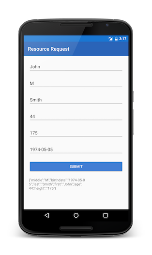

<!-- NLS_CHARSET=UTF-8 -->
## Overview
MobileFirst applications can access resources using the `WorklightResourceRequest` REST API.  
The REST API works with all adapters and external resources.

**Prerequisites**:

- Ensure you have added the MobileFirst Platform SDK to your Native [Xamarin application](../../sdk/xamarin/).
- Learn how to [create adapters](../../../adapters/creating-adapters/).

## WLResourceRequest
The `WorklightResourceRequest` class handles resource requests to adapters or external resources.

Create a `WorklightResourceRequest` object and specify the path to the resource and the HTTP method.  
Available methods are: `GET`, `POST`, `PUT` and `DELETE`.

```cs
URI adapterPath = new URI("/adapters/JavaAdapter/users",UriKind.Relative);
WorklightResourceRequest request = WorklightClient.CreateInstance.ResourceRequest(adapterPath,"GET");
```

* For **JavaScript adapters**, use `/adapters/{AdapterName}/{procedureName}`
* For **Java adapters**, use `/adapters/{AdapterName}/{path}`. The `path` depends on how you defined your `@Path` annotations in your Java code. This would also include any `@PathParam` you used.
* To access resources outside of the project, use the full URL as per the requirements of the external server.
* **timeout**: Optional, request timeout in milliseconds
* **scope**: Optional, if you know which scope is protecting the resource - specifying this scope could make the request more efficient.

## Sending the request
Request the resource by using the `.send()` method.

```cs
WorklightResponse response = await request.send();
```

Use the `WorklightResponse response` object to get the data that is retrieved from the adapter.

The `response` object contains the response data and you can use its methods and properties to retrieve the required information. Commonly used properties are `ResponseText`, `ResponseJSON` (if the response is in JSON) , `Success` (if the invoke was successful or failure) and `HTTPStatus` (the HTTP status of the response).

## Parameters
Before sending your request, you may want to add parameters as needed.

### Path parameters
As explained above, **path** parameters (`/path/value1/value2`) are set during the creation of the `WorklightResourceRequest` object:

```cs
Uri adapterPath = new Uri("/adapters/JavaAdapter/users/value1/value2",UriKind.Relative);
WorklightResourceRequest request = WorklightClient.CreateInstance.ResourceRequest(adapterPath,"GET");
```

### Query parameters
To send **query** parameters (`/path?param1=value1...`) use the `SetQueryParameter` method for each parameter:

```cs
request.SetQueryParameter("param1","value1");
request.SetQueryParameter("param2","value2");
```

#### JavaScript adapters
JavaScript adapters use ordered nameless parameters. To pass parameters to a Javascript adapter, set an array of parameters with the name `params`:

```cs
request.SetQueryParameter("params","['value1', 'value2']");
```

This should be used with `GET`.

### Form parameters
To send form parameters in the body, use `.Send(Dictionary<string, string> formParameters)` instead of `.Send()`:  

```cs
Dictionary<string,string> formParams = new Dictionary<string,string>();
formParams.Add("height", height.getText().toString());
request.Send(formParams);
```   

#### JavaScript adapters
JavaScript adapters use ordered nameless parameters. To pass parameters to a Javascript adapter, set an array of parameters with the name `params`:

```cs
formParams.Add("params","['value1', 'value2']");
```

This should be used with `POST`.

### Header parameters
To send a parameter as an HTTP header use `.SetHeader()` API:

```cs
System.Net.WebHeaderCollection headerCollection = new WebHeaderCollection();

headerCollection["key"] = value;

request.AddHeader(headerCollection);
```

### Other custom body parameters
- `.Send(requestBody)` allows you to set an arbitrary String in the body.
- `.Send(JObject json)` allows you to set an arbitrary dictionary in the body.
- `.Send(byte[] data)` allows you to set an arbitrary byte array in the body.

## The response
The `WorklightResponse` object contains the response data and you can use its methods and properties to retrieve the required information. Commonly used properties are `ResponseText` (String), `ResponseJSON` (JSONObject) (if the response is in JSON) and `success` (boolean) (success status of the response).

In case of request failure, the response object also contains a `error` property.

## For more information
> For more information about WLResourceRequest, refer to the user documentation.



## Sample application
The ResourceRequestXamarin project contain a native Android and iOS application that makes a resource request using a Java adapter.  
The adapter Maven project contains the Java adapter used during the resource request call.

[Click to download](https://github.com/MobileFirst-Platform-Developer-Center/ResourceRequestXamarin/tree/release80) the Xamarin project.  
[Click to download](https://github.com/MobileFirst-Platform-Developer-Center/Adapters/tree/release80) the adapter Maven project.

### Sample usage
Follow the sample's README.md file for instructions.
